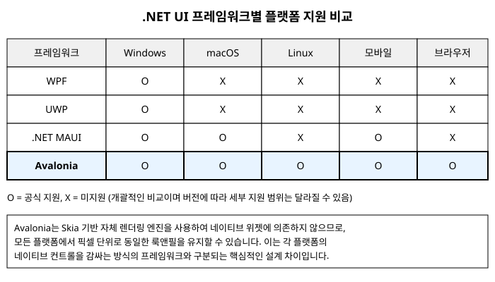

# 1장. Avalonia란 무엇인가

[◀ 이전: 목차](00-목차.md) | [📖 목차](00-목차.md) | [다음: 2장. 첫 프로그램과 프로젝트 구조 ▶](ch02-첫프로그램과프로젝트구조.md)

## 들어가며

C#과 .NET으로 데스크톱 애플리케이션을 만들어 본 개발자라면 한 번쯤 이런 고민을 해봤을 것입니다. "이 프로그램을 Windows뿐 아니라 macOS와 Linux에서도 똑같이 돌릴 수는 없을까?" WPF(Windows Presentation Foundation)는 강력하고 성숙한 프레임워크지만 이름 그대로 Windows 전용입니다. 반대로 웹 기술을 데스크톱에 욱여넣는 방식(Electron 등)은 크로스플랫폼은 되지만 네이티브 애플리케이션다운 가벼움과 반응성을 포기해야 하는 경우가 많습니다.

Avalonia UI(이하 Avalonia)는 바로 이 지점에서 출발한 오픈소스 UI 프레임워크입니다. .NET 위에서 동작하면서도 특정 운영체제에 종속되지 않고, WPF 개발자에게 익숙한 XAML 문법과 데이터 바인딩, MVVM 패턴을 그대로 쓸 수 있게 설계되었습니다. 이번 장에서는 Avalonia가 어떤 배경에서 탄생했는지, 다른 .NET UI 프레임워크들과 무엇이 다른지, 그리고 어떤 종류의 프로그램을 만들 때 Avalonia가 좋은 선택이 되는지를 살펴봅니다.

## Avalonia의 탄생 배경

Avalonia의 역사는 2013년경 "Perspex"라는 이름의 개인 프로젝트에서 시작되었습니다. 당시 개발자 Steven Kirk는 WPF의 선언적 UI 작성 방식과 강력한 바인딩 시스템을 좋아했지만, 그 좋은 아이디어가 Windows에만 갇혀 있다는 점을 아쉬워했습니다. 그래서 WPF와 비슷한 방식으로 UI를 기술할 수 있으면서도, 렌더링부터 레이아웃, 입력 처리까지 전 과정을 플랫폼에 의존하지 않는 방식으로 직접 구현하는 실험을 시작했습니다.

이 실험적인 프로젝트는 이후 이름을 Avalonia로 바꾸고 커뮤니티 기여자가 늘어나면서 본격적인 오픈소스 프로젝트로 성장했습니다. 지금은 .NET Foundation의 지원을 받는 프로젝트 중 하나로 자리 잡았고, 실제 상용 소프트웨어에도 널리 쓰이고 있습니다.

여기서 짚고 넘어갈 중요한 사실이 하나 있습니다. Avalonia는 WPF의 소스 코드를 어딘가에서 가져다 쓰거나 이식한 것이 아닙니다. XAML이라는 "UI를 마크업으로 선언한다"는 아이디어와 속성 시스템, 바인딩 같은 개념적 유산은 WPF에서 영감을 받았지만, 실제 렌더링 엔진과 레이아웃 엔진, 컨트롤 시스템은 Avalonia 팀이 처음부터 새로 작성한 것입니다. 그 덕분에 Avalonia는 Windows의 GDI나 DirectX, macOS의 Core Graphics 같은 운영체제 고유의 그리기 API에 의존하지 않고, 모든 플랫폼에서 스스로 화면을 그립니다.

이 자체 렌더링을 담당하는 핵심 엔진이 바로 Skia입니다. Skia는 Google Chrome, Android, Flutter 등에서도 사용되는 2D 그래픽 렌더링 라이브러리로, 검증된 성능과 폭넓은 플랫폼 지원을 자랑합니다. Avalonia는 SkiaSharp(Skia의 .NET 바인딩)를 통해 버튼 하나, 텍스트 한 줄, 도형 하나까지 모든 픽셀을 직접 그립니다. 운영체제는 오직 "그림을 그릴 캔버스 창을 하나 열어 달라"는 역할만 담당하고, 그 안에 실제로 무엇을 그릴지는 전적으로 Avalonia가 결정하는 구조입니다.

이런 구조가 갖는 의미는 생각보다 큽니다. 각 플랫폼의 네이티브 위젯을 그대로 가져다 쓰는 방식(예: 어떤 크로스플랫폼 프레임워크들이 채택하는 방식)은 플랫폼마다 버튼 모양이나 여백이 미묘하게 달라지는 문제를 안고 있습니다. 반면 Avalonia는 스스로 모든 픽셀을 그리기 때문에, Windows에서 보던 화면과 macOS나 Linux에서 보는 화면이 픽셀 단위로 동일합니다. 뒤에서 다시 다루겠지만 이는 Avalonia를 선택하는 중요한 이유 중 하나입니다.

## 얼마나 넓은 곳에서 돌아가는가

Avalonia가 지원하는 플랫폼의 범위는 계속 넓어지고 있습니다. 대표적으로 다음과 같은 환경에서 동일한 코드베이스로 애플리케이션을 실행할 수 있습니다.

- **Windows** - 데스크톱 애플리케이션의 전통적인 주 무대
- **macOS** - Apple Silicon과 Intel 칩 모두 지원
- **Linux** - 다양한 배포판과 데스크톱 환경
- **모바일** - Android와 iOS
- **브라우저** - WebAssembly(WASM)를 통해 웹 브라우저 안에서도 실행

물론 모바일이나 브라우저 대상은 데스크톱 대상만큼 성숙하지 않을 수 있고, 프로젝트의 상황에 따라 완성도 차이가 있을 수 있습니다. 하지만 핵심은 "하나의 XAML과 하나의 C# 코드베이스"에서 출발해 이렇게 다양한 실행 환경으로 뻗어나갈 수 있다는 가능성 자체입니다. 이 책에서는 우선 데스크톱 환경(Windows/macOS/Linux)에서 동작하는 애플리케이션 제작을 중심으로 Avalonia를 익히고, 그 과정에서 배우는 XAML 문법과 MVVM 패턴, 데이터 바인딩은 다른 플랫폼으로 확장할 때도 그대로 재사용됩니다.

## 다른 .NET UI 프레임워크와의 관계

.NET 생태계에는 이미 여러 UI 프레임워크가 존재합니다. Avalonia가 그중 어디에 위치하는지 이해하면 언제 Avalonia를 선택해야 하는지가 명확해집니다.

**WPF**는 2006년 등장한 이래로 Windows 데스크톱 애플리케이션의 표준 중 하나로 자리 잡았습니다. 성숙하고 안정적이며 방대한 문서와 커뮤니티 자산을 갖고 있습니다. 다만 이름에서 알 수 있듯 Windows 전용이며, .NET 5 이후에도 크로스플랫폼으로 확장되지 않았습니다. Avalonia는 XAML 문법, 속성 시스템, 바인딩 개념 등 WPF와 닮은 부분이 많아서 WPF 경험이 있는 개발자가 가장 빠르게 적응할 수 있는 프레임워크입니다. 다만 클래스 이름이나 세부 API는 동일하지 않은 경우도 많으므로 "똑같다"기보다는 "친숙하다" 정도로 이해하는 것이 정확합니다.

**UWP(Universal Windows Platform)**는 Windows 10 시대에 Microsoft가 밀었던 프레임워크로, Windows 생태계(데스크톱, 태블릿, Xbox 등) 안에서의 통합을 목표로 했습니다. 하지만 이 역시 Windows 바깥으로는 나가지 못했고, 현재는 WinUI 3 등 후속 기술로 무게 중심이 옮겨가는 추세입니다.

**.NET MAUI**는 Microsoft가 직접 만든 크로스플랫폼 프레임워크로, Xamarin.Forms의 후계자에 가깝습니다. Android, iOS, macOS(Mac Catalyst), Windows를 지원하며, 특히 모바일 우선 시나리오에 강점을 보입니다. MAUI는 각 플랫폼의 네이티브 컨트롤을 최대한 활용하는 접근을 취하는데, 이는 플랫폼 고유의 느낌을 살리는 데는 유리하지만 반대로 플랫폼마다 UI가 미묘하게 달라질 수 있다는 뜻이기도 합니다.

이 지형 안에서 Avalonia는 "진짜 크로스플랫폼 데스크톱 UI"라는 위치를 차지합니다. 정리하면 다음과 같은 특징으로 요약할 수 있습니다.

- WPF의 XAML/바인딩 문법에 익숙한 개발자가 낮은 학습 장벽으로 시작할 수 있다
- 네이티브 위젯을 감싸는 방식이 아니라 자체 렌더링을 사용하므로, 모든 플랫폼에서 동일한 룩앤필을 보장한다
- 데스크톱 애플리케이션에 특히 강점이 있으면서, 모바일과 브라우저까지 시야를 넓히고 있다
- 완전한 오픈소스이며 특정 회사의 상업적 판단에 로드맵이 좌우되지 않는다

물론 이것이 "Avalonia가 다른 모든 프레임워크보다 우월하다"는 뜻은 아닙니다. Windows 전용 애플리케이션이면서 Windows 고유 기능을 깊게 활용해야 한다면 WPF나 WinUI가 더 적합할 수 있고, 모바일 앱스토어 배포가 핵심 목표라면 MAUI가 더 성숙한 생태계를 제공할 수도 있습니다. 다만 "하나의 코드베이스로 여러 데스크톱 운영체제에서 픽셀 단위로 동일하게 보이는 애플리케이션"을 만들고 싶다면, Avalonia는 현재 .NET 생태계에서 가장 강력한 선택지 중 하나입니다.

## MVVM과 함께 설계된 프레임워크

Avalonia를 처음 접하면 단순히 "크로스플랫폼이 되는 WPF" 정도로 생각하기 쉽지만, 조금 더 들여다보면 Avalonia는 처음부터 MVVM(Model-View-ViewModel) 패턴을 자연스럽게 적용할 수 있도록 설계되었다는 점을 알 수 있습니다.

MVVM은 화면에 무엇을 어떻게 그릴지 담당하는 View와, 화면 뒤에서 데이터와 로직을 다루는 ViewModel을 분리하는 설계 방식입니다. Avalonia의 XAML은 `{Binding}` 구문을 통해 View의 컨트롤과 ViewModel의 속성을 연결할 수 있고, 버튼 클릭 같은 사용자 동작은 `ICommand`를 구현한 커맨드 객체와 연결할 수 있습니다. 이렇게 하면 View(.axaml 파일)는 "무엇을 어떻게 보여줄지"에만 집중하고, 실제 비즈니스 로직은 ViewModel이라는 순수 C# 클래스 안에 모아둘 수 있습니다.

이 구조의 실질적인 이점은 테스트 용이성과 유지보수성입니다. ViewModel은 UI 프레임워크에 대한 직접적인 의존이 없는 평범한 C# 클래스이므로, UI를 화면에 띄우지 않고도 단위 테스트를 작성할 수 있습니다. 또한 View와 ViewModel이 느슨하게 연결되어 있으므로, 디자이너가 XAML을 수정하는 동안 개발자는 ViewModel 로직을 건드리지 않고 병행 작업할 수 있습니다.

지금 단계에서는 "Avalonia는 데이터 바인딩과 커맨드를 중심으로 View와 로직을 분리하는 것을 자연스럽게 지원하는 프레임워크구나" 정도로 감을 잡아두면 충분합니다. 데이터 바인딩의 구체적인 문법은 7장에서, MVVM 패턴을 실제 프로젝트 구조로 적용하는 방법은 8장에서, 커맨드를 이용해 사용자 동작을 처리하는 방법은 9장에서 각각 자세히 다룹니다.

## Avalonia로 만들 수 있는 것들

그렇다면 Avalonia는 실제로 어떤 종류의 애플리케이션을 만들 때 유용할까요? 몇 가지 대표적인 시나리오를 살펴보겠습니다.

**크로스플랫폼 데스크톱 유틸리티**. 파일 관리 도구, 이미지 뷰어, 텍스트 편집기처럼 Windows, macOS, Linux 사용자 모두에게 동일한 프로그램을 배포하고 싶은 경우입니다. 각 플랫폼마다 별도의 UI 코드를 작성할 필요 없이 하나의 XAML/C# 코드베이스로 세 플랫폼을 동시에 지원할 수 있습니다.

**개발자 도구**. API 클라이언트, 데이터베이스 관리 도구, 로그 뷰어처럼 개발자 자신이 여러 운영체제를 넘나들며 사용하는 도구를 만들 때 Avalonia는 좋은 선택입니다. 실제로 이런 카테고리의 오픈소스 도구 중 상당수가 Avalonia로 만들어져 있습니다.

**엔터프라이즈 내부 도구**. 회사 내부에서 사용하는 재고 관리, 모니터링 대시보드, 설정 관리 애플리케이션 등은 화려한 애니메이션보다 안정적인 데이터 바인딩과 폼 처리 능력이 더 중요한 경우가 많습니다. Avalonia는 WPF에서 이미 검증된 폼 기반 애플리케이션 개발 경험을 크로스플랫폼으로 그대로 가져올 수 있습니다.

**기존 WPF 애플리케이션의 이식**. 이미 WPF로 작성된 애플리케이션을 크로스플랫폼으로 확장하고 싶을 때, XAML 문법과 MVVM 구조가 유사한 Avalonia는 완전히 처음부터 다시 작성하는 것보다 훨씬 적은 노력으로 마이그레이션할 수 있는 발판이 되어 줍니다. 물론 API 차이는 있으므로 무조건적인 자동 변환을 기대하기는 어렵지만, 개념적인 재사용 폭이 넓습니다.

반대로 대규모 3D 게임 렌더링이나 극도로 무거운 그래픽 처리가 핵심인 애플리케이션이라면 Avalonia보다는 전용 게임 엔진이나 그래픽 프레임워크가 더 적합할 수 있습니다. Avalonia는 어디까지나 "일반적인 업무용/유틸리티용 데스크톱 애플리케이션의 UI"를 잘 만들기 위한 프레임워크라는 점을 기억해 두면, 앞으로의 학습 방향을 잡는 데 도움이 됩니다.

## 요약

- Avalonia는 2013년경 시작된 Perspex 프로젝트에서 출발한 오픈소스 크로스플랫폼 UI 프레임워크로, WPF의 XAML 문법과 바인딩 개념에서 영감을 받았지만 소스 코드를 이식한 것이 아니라 처음부터 새로 구현되었습니다.
- Avalonia는 Skia 기반의 자체 렌더링 엔진을 사용해 운영체제의 네이티브 위젯에 의존하지 않고 모든 픽셀을 직접 그리므로, Windows/macOS/Linux에서 픽셀 단위로 동일한 화면을 보여줄 수 있습니다.
- 데스크톱(Windows/macOS/Linux)을 넘어 모바일(Android/iOS)과 웹 브라우저(WASM)까지 지원 범위를 넓혀가고 있습니다.
- WPF, UWP, .NET MAUI 등 다른 .NET UI 프레임워크와 비교했을 때, Avalonia는 "진짜 크로스플랫폼 데스크톱 UI"라는 독자적인 위치를 차지합니다.
- Avalonia는 데이터 바인딩과 커맨드를 통해 View와 ViewModel을 분리하는 MVVM 패턴을 자연스럽게 지원하도록 설계되었습니다. 자세한 내용은 7장, 8장, 9장에서 다룹니다.
- 크로스플랫폼 유틸리티, 개발자 도구, 엔터프라이즈 내부 도구, WPF 애플리케이션 이식 등 다양한 시나리오에서 Avalonia가 강점을 발휘합니다.

## 연습문제

1. Avalonia의 전신이 된 프로젝트의 이름은 무엇이며, 어떤 동기에서 시작되었는지 설명해 보세요.
2. Avalonia가 각 운영체제의 네이티브 위젯을 사용하는 대신 자체 렌더링 엔진을 사용하는 이유와, 그로 인해 얻는 장점을 한 가지 이상 설명해 보세요.
3. WPF, .NET MAUI, Avalonia는 각각 어떤 상황에서 더 적합한 선택이 될 수 있는지 비교해 보세요.
4. MVVM 패턴에서 View와 ViewModel을 분리했을 때 테스트 작성 측면에서 어떤 이점이 있는지 설명해 보세요.
5. 여러분이 만들고 싶은 애플리케이션을 하나 떠올려 보고, 그것이 Avalonia에 적합한 시나리오인지 아닌지 이유와 함께 판단해 보세요.

---

[◀ 이전: 목차](00-목차.md) | [📖 목차](00-목차.md) | [다음: 2장. 첫 프로그램과 프로젝트 구조 ▶](ch02-첫프로그램과프로젝트구조.md)
