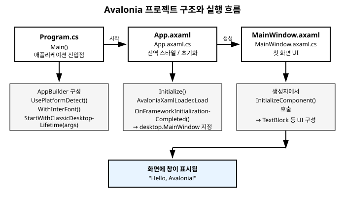

# 2장. 첫 프로그램과 프로젝트 구조

[◀ 이전: 1장. Avalonia란 무엇인가](ch01-Avalonia란무엇인가.md) | [📖 목차](00-목차.md) | [다음: 3장. XAML 기초 ▶](ch03-XAML기초.md)


## 들어가며

1장에서 Avalonia가 어떤 프레임워크인지 개념적으로 살펴봤다면, 이번 장에서는 실제로 손을 움직여 첫 번째 Avalonia 애플리케이션을 만들어 봅니다. 개발 환경을 준비하고, 템플릿으로 프로젝트를 생성한 뒤, 생성된 파일들이 각각 어떤 역할을 하는지 하나씩 뜯어봅니다. 마지막에는 화면에 직접 문구를 하나 표시해 보면서 "코드를 고치면 화면이 바뀐다"는 감각을 익히는 것이 이번 장의 목표입니다.

## 개발 환경 준비하기

Avalonia는 .NET 위에서 동작하므로 가장 먼저 .NET SDK가 설치되어 있어야 합니다. 터미널(또는 명령 프롬프트, PowerShell)에서 다음 명령으로 설치 여부와 버전을 확인할 수 있습니다.

```bash
dotnet --version
```

버전 번호가 출력된다면 .NET SDK가 정상적으로 설치되어 있는 것입니다. 만약 명령을 찾을 수 없다는 오류가 나온다면, .NET 공식 사이트에서 최신 LTS(장기 지원) 버전의 SDK를 내려받아 설치한 뒤 다시 시도합니다.

.NET SDK가 준비되었다면, 다음으로 Avalonia 프로젝트 템플릿을 설치합니다. 이 템플릿은 `dotnet new` 명령에 Avalonia 전용 프로젝트 유형을 추가해 주는 패키지입니다.

```bash
dotnet new install Avalonia.Templates
```

이 명령을 실행하면 Avalonia 팀이 제공하는 여러 프로젝트 템플릿(일반 애플리케이션, MVVM 구조가 미리 적용된 애플리케이션 등)이 함께 설치됩니다. 설치가 끝나면 `dotnet new list` 명령으로 `avalonia`라는 이름이 포함된 템플릿 목록이 나타나는지 확인해 볼 수 있습니다.

> 참고: 코드 편집기로는 Visual Studio, JetBrains Rider, Visual Studio Code 등 어떤 것을 사용해도 무방합니다. 이 책의 예제는 특정 IDE에 종속되지 않도록 대부분 `dotnet` CLI 명령을 기준으로 설명합니다.

## 프로젝트 생성하기

템플릿 설치가 끝났다면 이제 실제 프로젝트를 만들어 볼 차례입니다. 원하는 작업 폴더로 이동한 뒤 다음 명령을 실행합니다.

```bash
dotnet new avalonia.app -o MyApp
```

`avalonia.app`은 방금 설치한 템플릿의 이름이고, `-o MyApp`은 `MyApp`이라는 이름의 폴더를 새로 만들어 그 안에 프로젝트를 생성하라는 의미입니다. 명령이 끝나면 `MyApp` 폴더 안에 다음과 같은 파일들이 생성됩니다.

```
MyApp/
├── MyApp.csproj
├── Program.cs
├── App.axaml
├── App.axaml.cs
├── MainWindow.axaml
├── MainWindow.axaml.cs
├── app.manifest
└── Assets/
    └── avalonia-logo.ico
```

각 파일이 무슨 역할을 하는지는 뒤에서 하나씩 자세히 살펴보겠습니다. 프로젝트가 잘 생성되었는지 먼저 확인해 보고 싶다면, 프로젝트 폴더 안으로 들어가 다음 명령으로 곧바로 실행해 볼 수 있습니다.

```bash
cd MyApp
dotnet run
```

빌드가 끝나면 "Welcome to Avalonia!" 같은 문구가 담긴 기본 창이 화면에 나타납니다. 이 창이 뜬다면 개발 환경 준비와 프로젝트 생성이 모두 성공적으로 끝난 것입니다.

## `.axaml`이라는 확장자

프로젝트 폴더를 살펴보면 `.cs` 파일 옆에 낯선 `.axaml` 확장자를 가진 파일들이 보입니다. WPF를 다뤄본 경험이 있다면 `.xaml` 확장자에 익숙할 텐데, Avalonia는 왜 굳이 `A`를 하나 덧붙인 `.axaml`이라는 별도의 확장자를 쓰는 것일까요?

이유는 간단합니다. `.xaml`이라는 확장자와 관련 파일 처리 방식은 이미 Visual Studio 등 여러 도구 안에서 WPF/UWP 전용으로 강하게 연결되어 있습니다. Avalonia의 XAML은 WPF의 XAML과 문법적으로 상당히 비슷하지만 세부적으로는 다른 부분이 있고, 대상 프레임워크도 다릅니다. 만약 같은 `.xaml` 확장자를 그대로 사용한다면, 편집기가 이 파일을 WPF용으로 착각해 잘못된 인텔리센스나 디자이너를 띄우는 등 혼란이 생길 수 있습니다. 이런 충돌을 피하기 위해 Avalonia는 처음부터 `.axaml`이라는 자신만의 확장자를 정의해서 사용합니다.

기능적인 관점에서 보면 `.axaml` 파일은 XAML과 마찬가지로 UI 구조를 선언적으로 기술하는 마크업 파일입니다. 태그로 컨트롤을 배치하고, 속성으로 모양과 동작을 지정하고, 바인딩 구문으로 데이터와 연결하는 방식 모두 XAML의 문법 체계를 따릅니다. 이 책 전반에서 `.axaml` 파일 안의 코드는 ` ```xml ` 코드 블록으로 표기합니다.

## `Program.cs` - 애플리케이션의 진입점

`Program.cs`는 여느 .NET 콘솔 애플리케이션과 마찬가지로 프로그램이 시작되는 지점입니다. 기본 템플릿이 생성한 내용은 대략 다음과 같은 모습입니다.

```csharp
using Avalonia;

namespace MyApp;

class Program
{
    // 초기화 코드는 반드시 이 메서드 안에서만 실행합니다.
    // AppMain에서 실행되는 코드는 Avalonia 초기화 이전에
    // 스레드 관련 문제를 일으킬 수 있습니다.
    [STAThread]
    public static void Main(string[] args)
        => BuildAvaloniaApp()
            .StartWithClassicDesktopLifetime(args);

    public static AppBuilder BuildAvaloniaApp()
        => AppBuilder.Configure<App>()
            .UsePlatformDetect()
            .WithInterFont()
            .LogToTrace();
}
```

`Main` 메서드는 `BuildAvaloniaApp()`이 만든 `AppBuilder` 객체를 가져와서 `StartWithClassicDesktopLifetime(args)`를 호출해 애플리케이션을 시작합니다. `AppBuilder`는 Avalonia 애플리케이션을 구성하는 빌더 객체로, 어떤 플랫폼에서 렌더링할지, 어떤 서비스를 사용할지 등을 체이닝 방식으로 설정합니다.

`BuildAvaloniaApp` 메서드 안의 각 호출은 다음과 같은 의미를 가집니다.

- `AppBuilder.Configure<App>()` - 뒤에서 살펴볼 `App` 클래스를 애플리케이션의 진입점으로 등록합니다.
- `UsePlatformDetect()` - 현재 실행 중인 운영체제를 자동으로 감지해서 그에 맞는 창 시스템, 입력 처리 방식을 선택합니다. 이 한 줄 덕분에 개발자가 Windows용, macOS용 코드를 따로 분기할 필요가 없습니다.
- `WithInterFont()` - Inter라는 오픈소스 서체를 기본 글꼴로 함께 포함시킵니다. 운영체제마다 기본 글꼴이 다르기 때문에, 이 설정이 없다면 플랫폼별로 텍스트의 모양이 미묘하게 달라질 수 있습니다.
- `LogToTrace()` - Avalonia 내부에서 발생하는 로그를 추적할 수 있도록 연결합니다. 디버깅 중 문제를 파악하는 데 도움이 됩니다.

`StartWithClassicDesktopLifetime`이라는 메서드 이름에서 "Classic Desktop Lifetime"이라는 표현이 등장하는데, 이는 "일반적인 데스크톱 애플리케이션처럼 창이 열리고 메인 창이 닫히면 프로그램도 함께 종료되는 생명주기"를 의미합니다. Avalonia는 데스크톱 외에도 다른 실행 환경(모바일, 브라우저 등)을 지원하기 때문에 이렇게 생명주기 방식을 명시적으로 선택하도록 설계되어 있습니다.

## `App.axaml`과 `App.axaml.cs` - 애플리케이션 전역 설정

`App.axaml`은 애플리케이션 전체에서 공통으로 사용할 리소스와 설정을 선언하는 파일입니다. 기본 템플릿의 내용은 다음과 비슷합니다.

```xml
<Application xmlns="https://github.com/avaloniaui"
             xmlns:x="http://schemas.microsoft.com/winfx/2006/xaml"
             x:Class="MyApp.App"
             RequestedThemeVariant="Default">

    <Application.Styles>
        <FluentTheme />
    </Application.Styles>

</Application>
```

`<Application>`이 최상위 루트 요소이고, `Application.Styles` 안에 `<FluentTheme />`이 들어 있는 것이 눈에 띕니다. `FluentTheme`은 Avalonia가 기본으로 제공하는 테마로, Microsoft의 Fluent Design 언어를 참고해 만든 버튼, 체크박스, 텍스트박스 등 기본 컨트롤들의 모양을 정의합니다. 이 한 줄 덕분에 아무 스타일도 직접 작성하지 않아도 컨트롤들이 자연스러운 모습으로 표시됩니다. 스타일과 테마를 직접 다루는 방법은 10장과 16장에서 더 자세히 살펴봅니다.

이 XAML 파일과 짝을 이루는 `App.axaml.cs`는 코드 비하인드(code-behind) 파일로, 애플리케이션이 시작될 때 실행할 초기화 로직을 담습니다.

```csharp
using Avalonia;
using Avalonia.Controls.ApplicationLifetimes;
using Avalonia.Markup.Xaml;

namespace MyApp;

public partial class App : Application
{
    public override void Initialize()
    {
        AvaloniaXamlLoader.Load(this);
    }

    public override void OnFrameworkInitializationCompleted()
    {
        if (ApplicationLifetime is IClassicDesktopStyleApplicationLifetime desktop)
        {
            desktop.MainWindow = new MainWindow();
        }

        base.OnFrameworkInitializationCompleted();
    }
}
```

`Initialize` 메서드의 `AvaloniaXamlLoader.Load(this)`는 같은 이름을 가진 `App.axaml` 파일을 읽어 들여서, 그 안에 선언된 스타일과 리소스를 실제 `App` 객체에 적용하는 역할을 합니다. `partial class`로 선언된 이유도 여기에 있습니다. XAML 컴파일러가 `.axaml` 파일을 분석해서 자동으로 생성하는 코드와, 개발자가 직접 작성하는 `App.axaml.cs`의 코드가 하나의 클래스로 합쳐지기 때문입니다.

`OnFrameworkInitializationCompleted` 메서드는 Avalonia 프레임워크의 초기화가 모두 끝난 시점에 호출됩니다. 여기서는 현재 애플리케이션이 "클래식 데스크톱 스타일" 생명주기로 동작하고 있는지 확인한 뒤, 맞다면 `MainWindow`의 인스턴스를 생성해서 `desktop.MainWindow`에 지정합니다. 이 대입이 이루어지는 순간 비로소 화면에 첫 번째 창이 나타나게 됩니다.

## `MainWindow.axaml`과 `MainWindow.axaml.cs` - 첫 창

`MainWindow`는 애플리케이션이 시작될 때 사용자에게 보이는 첫 번째 창을 나타내는 클래스입니다. `App.axaml`이 애플리케이션 전체의 설정을 담당했다면, `MainWindow.axaml`은 실제로 창 안에 어떤 내용을 보여줄지를 정의합니다.

```xml
<Window xmlns="https://github.com/avaloniaui"
        xmlns:x="http://schemas.microsoft.com/winfx/2006/xaml"
        x:Class="MyApp.MainWindow"
        Title="MyApp">

    <TextBlock Text="Welcome to Avalonia!"
               HorizontalAlignment="Center"
               VerticalAlignment="Center" />

</Window>
```

`<Window>` 요소가 최상위 루트이며, `Title` 속성은 운영체제의 제목 표시줄에 나타나는 창 제목을 지정합니다. `x:Class` 속성은 이 XAML이 어떤 C# 클래스와 짝을 이루는지를 나타내는데, 여기서는 `MyApp.MainWindow`로 지정되어 있습니다. `<Window>` 태그 안에는 하나의 자식 요소만 둘 수 있으며, 여기서는 화면 정중앙에 "Welcome to Avalonia!"라는 문구를 표시하는 `<TextBlock>`이 그 역할을 하고 있습니다. `HorizontalAlignment`와 `VerticalAlignment`를 각각 `Center`로 지정했기 때문에 텍스트가 창의 가로/세로 중앙에 위치하게 됩니다. XAML 문법 자체와 레이아웃 관련 속성들은 각각 3장과 4장에서 더 깊이 다룹니다.

`MainWindow.axaml.cs`는 이 창에 대한 코드 비하인드 파일입니다.

```csharp
using Avalonia.Controls;

namespace MyApp;

public partial class MainWindow : Window
{
    public MainWindow()
    {
        InitializeComponent();
    }
}
```

생성자 안의 `InitializeComponent()` 호출이 핵심입니다. 이 메서드는 XAML 컴파일러가 자동으로 생성해 주는 메서드로, `MainWindow.axaml`에 선언된 UI 구조를 실제로 읽어 들여 이 창 객체를 구성합니다. 지금 당장은 이벤트 처리기 하나 없는 단순한 클래스지만, 6장에서 이벤트 처리를 다루기 시작하면 이 코드 비하인드 파일에 버튼 클릭 같은 동작을 연결하는 코드를 작성하게 됩니다.

## 전체 실행 흐름 정리

지금까지 살펴본 네 쌍의 파일이 어떤 순서로 서로를 호출하며 화면을 띄우는지 정리하면 다음과 같습니다.

1. 운영체제가 실행 파일을 시작하면 `Program.cs`의 `Main` 메서드가 호출됩니다.
2. `Main`은 `AppBuilder`를 구성한 뒤 `StartWithClassicDesktopLifetime`을 호출해 Avalonia 프레임워크를 가동합니다.
3. Avalonia는 `App` 클래스(`App.axaml`/`App.axaml.cs`)의 인스턴스를 만들고 `Initialize`를 호출해 `App.axaml`에 정의된 스타일과 리소스를 적용합니다.
4. 프레임워크 초기화가 끝나면 `OnFrameworkInitializationCompleted`가 호출되어 `MainWindow`의 인스턴스를 생성하고 `desktop.MainWindow`에 지정합니다.
5. `MainWindow`의 생성자가 `InitializeComponent()`를 호출해 `MainWindow.axaml`에 정의된 UI를 구성하고, 완성된 창이 화면에 표시됩니다.

이 흐름을 그림으로 정리하면 다음과 같습니다.



## Hello, Avalonia! 직접 만들어 보기

이제 기본 템플릿의 문구를 직접 수정해서 나만의 첫 화면을 만들어 보겠습니다. `MainWindow.axaml` 파일을 열어서 `<TextBlock>` 부분을 다음과 같이 바꿔봅니다.

```xml
<Window xmlns="https://github.com/avaloniaui"
        xmlns:x="http://schemas.microsoft.com/winfx/2006/xaml"
        x:Class="MyApp.MainWindow"
        Title="MyApp"
        Width="400"
        Height="250">

    <StackPanel HorizontalAlignment="Center"
                VerticalAlignment="Center"
                Spacing="8">
        <TextBlock Text="Hello, Avalonia!"
                   FontSize="28"
                   FontWeight="Bold"
                   HorizontalAlignment="Center" />
        <TextBlock Text="첫 번째 Avalonia 애플리케이션입니다."
                   HorizontalAlignment="Center" />
    </StackPanel>

</Window>
```

`Window`에 `Width`와 `Height`를 지정해서 창 크기를 조금 더 크게 잡았고, 두 개의 `TextBlock`을 세로로 나란히 배치하기 위해 `StackPanel`이라는 컨테이너 컨트롤을 사용했습니다. `StackPanel`의 `Spacing="8"`은 자식 요소들 사이에 8픽셀의 여백을 자동으로 넣어줍니다. `StackPanel`을 비롯한 레이아웃 컨트롤들의 동작 방식은 4장에서 본격적으로 다룹니다.

파일을 저장한 뒤 프로젝트 폴더에서 다시 실행해 봅니다.

```bash
dotnet run
```

창이 뜨면 "Hello, Avalonia!"라는 굵은 글씨와 그 아래 작은 설명 문구가 화면 중앙에 나란히 표시되는 것을 확인할 수 있습니다. `.axaml` 파일을 수정하고 다시 `dotnet run`을 실행하는 것만으로 화면이 바뀐다는 사실이 대단해 보이지 않을 수도 있지만, 이것이 바로 Avalonia 개발의 가장 기본적인 사이클입니다. 앞으로 이 책의 예제 대부분은 이런 식으로 XAML을 고치고, 코드 비하인드나 ViewModel을 고치고, 다시 실행해 결과를 확인하는 과정을 반복하게 됩니다.

> 참고: IDE에 따라 `dotnet run` 대신 디버그 실행(F5 등)을 사용하면 코드를 수정할 때마다 매번 터미널 명령을 입력하지 않아도 되어 더 편리합니다. 또한 일부 IDE와 Avalonia의 Hot Reload 기능을 함께 사용하면 애플리케이션을 재시작하지 않고도 XAML 변경 사항을 즉시 반영해 볼 수 있습니다.

## 요약

- .NET SDK 설치 후 `dotnet new install Avalonia.Templates`로 Avalonia 프로젝트 템플릿을 설치하고, `dotnet new avalonia.app -o MyApp`으로 새 프로젝트를 생성합니다.
- Avalonia는 XAML과 유사하지만 구분되는 `.axaml` 확장자를 사용하며, 이는 WPF 등 다른 프레임워크의 `.xaml` 처리 방식과의 충돌을 피하기 위한 설계입니다.
- `Program.cs`는 `AppBuilder`를 구성하고 `StartWithClassicDesktopLifetime`으로 애플리케이션을 시작하는 진입점입니다.
- `App.axaml`/`App.axaml.cs`는 애플리케이션 전역 스타일(예: `FluentTheme`)과 초기화 로직, 그리고 `MainWindow`를 지정하는 역할을 담당합니다.
- `MainWindow.axaml`/`MainWindow.axaml.cs`는 사용자에게 처음 보이는 창의 UI 구조와 코드 비하인드를 정의합니다.
- `dotnet run` 명령으로 프로젝트를 실행하고, `.axaml` 파일을 수정한 뒤 다시 실행하면 변경된 화면을 바로 확인할 수 있습니다.

## 연습문제

1. `dotnet new install Avalonia.Templates`와 `dotnet new avalonia.app -o MyApp` 두 명령은 각각 어떤 역할을 하는지 설명해 보세요.
2. Avalonia가 `.xaml` 대신 `.axaml`이라는 고유한 확장자를 사용하는 이유를 설명해 보세요.
3. `Program.cs`, `App.axaml`, `MainWindow.axaml`이 프로그램 시작부터 첫 창이 화면에 나타나기까지 어떤 순서로 서로를 호출하는지 순서대로 나열해 보세요.
4. `App.axaml.cs`의 `OnFrameworkInitializationCompleted` 메서드에서 `desktop.MainWindow = new MainWindow();`가 하는 역할은 무엇인가요?
5. `MainWindow.axaml`의 `<TextBlock>` 두 개를 `StackPanel`로 감싸지 않고 그대로 두면 어떤 문제가 발생할지 예상해 보고, 실제로 코드를 바꿔 실행하며 확인해 보세요.

---

[◀ 이전: 1장. Avalonia란 무엇인가](ch01-Avalonia란무엇인가.md) | [📖 목차](00-목차.md) | [다음: 3장. XAML 기초 ▶](ch03-XAML기초.md)
