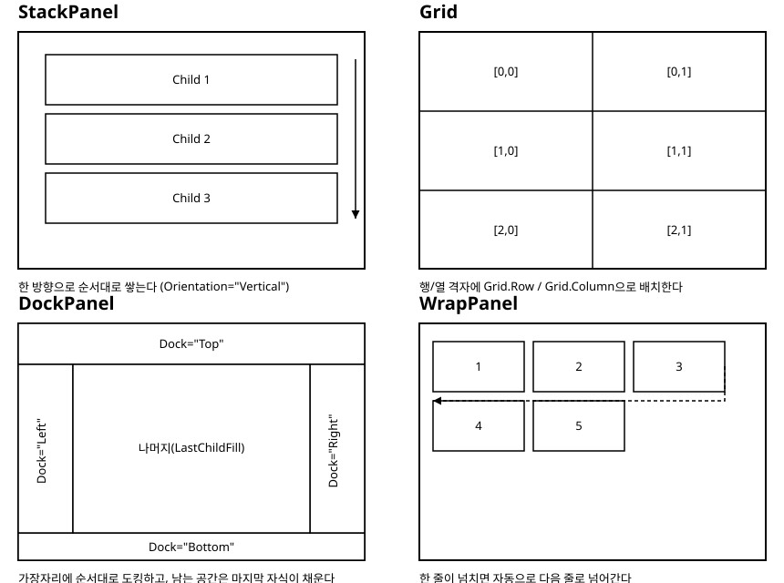

# 4장. 레이아웃 시스템

[◀ 이전: 3장. XAML 기초](ch03-XAML기초.md) | [📖 목차](00-목차.md) | [다음: 5장. 기본 컨트롤 ▶](ch05-기본컨트롤.md)


3장에서는 XAML로 컨트롤 하나하나를 선언하는 방법을 배웠습니다. 그런데 실제 화면은 컨트롤 하나로 끝나지 않고, 여러 개의 컨트롤이 특정한 규칙에 따라 배치됩니다. 버튼 세 개를 가로로 나란히 놓을지, 세로로 쌓을지, 화면 크기가 바뀌면 어떻게 다시 배치할지를 결정하는 것이 바로 레이아웃(layout)입니다. 이 장에서는 Avalonia가 제공하는 대표적인 레이아웃 패널들과, 정렬·여백을 다루는 공통 속성들을 살펴봅니다.

## 레이아웃 시스템 개요

Avalonia의 모든 화면 요소는 `Control`을 상속하며, 그중에서도 자식 요소들을 담고 배치 규칙을 적용하는 컨트롤을 패널(panel)이라고 부릅니다. 패널은 모두 `Panel`이라는 클래스를 상속하고, 공통적으로 `Children`이라는 컬렉션 프로퍼티에 자식 컨트롤을 담습니다. 3장에서 본 것처럼 이 `Children`은 콘텐츠 프로퍼티이므로, XAML에서는 패널 태그 안에 자식 엘리먼트를 바로 중첩하는 것만으로 충분합니다.

패널마다 "자식들을 어떤 규칙으로 배치할 것인가"에 대한 답이 다릅니다. 이 장에서 다루는 다섯 가지 패널은 다음과 같습니다.

- `StackPanel`: 자식을 한 방향(가로 또는 세로)으로 순서대로 나란히 쌓습니다.
- `Grid`: 화면을 행과 열의 격자로 나누고, 각 자식을 특정 셀에 배치합니다.
- `DockPanel`: 자식을 상하좌우 가장자리에 순서대로 붙이고, 남는 공간을 마지막 자식이 채웁니다.
- `WrapPanel`: `StackPanel`처럼 순서대로 배치하되, 공간이 부족하면 자동으로 다음 줄(또는 다음 열)로 넘어갑니다.
- `Canvas`: 격자나 순서 없이, 각 자식의 위치를 절대 좌표로 지정합니다.

아래 그림은 이 중 네 가지 패널이 같은 개수의 자식 요소를 각자의 방식으로 배치하는 모습을 비교한 것입니다. `Canvas`는 좌표를 직접 지정하는 방식이라 비교 다이어그램보다는 실제 예제로 감을 잡는 편이 이해하기 쉬워서 그림에서는 제외했습니다.



## StackPanel: 한 방향으로 쌓기

`StackPanel`은 가장 단순하면서도 가장 자주 쓰이는 패널입니다. `Orientation` 프로퍼티로 쌓는 방향을 지정하며, 기본값은 `Vertical`입니다.

```xml
<StackPanel Orientation="Vertical" Spacing="8" Margin="16">
    <TextBlock Text="아이디" />
    <TextBox Watermark="아이디를 입력하세요" />
    <TextBlock Text="비밀번호" />
    <TextBox Watermark="비밀번호를 입력하세요" PasswordChar="*" />
    <Button Content="로그인" HorizontalAlignment="Right" />
</StackPanel>
```

`Orientation="Horizontal"`로 바꾸면 자식들이 왼쪽부터 오른쪽으로 나란히 배치됩니다. 툴바나 버튼 그룹처럼 가로로 나열되는 UI에서 흔히 볼 수 있는 형태입니다.

```xml
<StackPanel Orientation="Horizontal" Spacing="8">
    <Button Content="확인" />
    <Button Content="취소" />
</StackPanel>
```

`Spacing` 프로퍼티는 자식 사이의 간격을 일괄적으로 지정합니다. `Spacing`이 등장하기 전에는 각 자식에 개별적으로 `Margin`을 주어 간격을 만들어야 했는데, 자식 개수가 많아지면 첫 자식과 마지막 자식의 여백을 다르게 줘야 하는 번거로움이 있었습니다. `Spacing`을 쓰면 자식들 사이의 간격만 균일하게 지정되고, 패널의 맨 앞과 맨 뒤에는 별도의 여백이 생기지 않습니다.

`StackPanel`의 특징은 쌓는 방향으로는 자식이 원하는 만큼의 크기(자연 크기)를 갖고, 그 반대 방향으로는 기본적으로 패널의 폭(또는 높이)에 맞춰 늘어난다는 점입니다. 세로로 쌓을 때 각 자식의 `Width`를 지정하지 않아도 `TextBox`가 패널 폭만큼 넓게 그려지는 것이 이 때문입니다. 다만 자식 요소 각각의 자식 개수가 늘어날수록 세로로 긴 화면이 만들어지므로, 스크롤이 필요한 긴 목록에는 `StackPanel` 단독보다는 14장에서 다룰 `ItemsControl`이나 `ScrollViewer`와 함께 쓰는 경우가 많습니다.

## Grid: 행과 열의 격자

`StackPanel`이 한 방향의 나열에 특화되어 있다면, `Grid`는 행과 열이 교차하는 2차원 배치를 담당합니다. 폼 화면, 대시보드, 표 형태의 UI처럼 "이 항목은 여기, 저 항목은 저기"라고 명확한 좌표를 지정하고 싶을 때 `Grid`를 사용합니다.

`Grid`를 쓰려면 먼저 `RowDefinitions`와 `ColumnDefinitions`로 격자의 구조를 정의합니다.

```xml
<Grid RowDefinitions="Auto,Auto,*" ColumnDefinitions="120,*">
    <TextBlock Text="이름" Grid.Row="0" Grid.Column="0" VerticalAlignment="Center" />
    <TextBox Grid.Row="0" Grid.Column="1" />

    <TextBlock Text="이메일" Grid.Row="1" Grid.Column="0" VerticalAlignment="Center" />
    <TextBox Grid.Row="1" Grid.Column="1" />

    <TextBlock Text="메모" Grid.Row="2" Grid.Column="0" VerticalAlignment="Top" />
    <TextBox Grid.Row="2" Grid.Column="1" AcceptsReturn="True" TextWrapping="Wrap" />
</Grid>
```

`RowDefinitions="Auto,Auto,*"`는 콤마로 구분된 문자열 축약 문법이며, `Auto`는 "그 행에 들어갈 자식의 자연 크기만큼만 차지한다", `*`는 "남는 공간을 비율대로 나눠 가진다"는 뜻입니다. 여러 행에 `*`가 있으면 `2*`, `3*`처럼 숫자를 붙여 비율을 조정할 수 있고, 숫자만 적으면(`120`처럼) 픽셀 단위의 고정 크기가 됩니다. `ColumnDefinitions`도 같은 규칙을 따릅니다. 위 예제는 왼쪽 열은 라벨을 위한 고정 폭 120픽셀, 오른쪽 열은 남는 공간을 모두 차지하는 구성입니다.

축약 문법 대신 프로퍼티 엘리먼트 문법으로 각 행과 열을 개별 엘리먼트로 풀어 쓸 수도 있습니다. 각 정의에 이름을 붙이거나 나중에 코드에서 개별적으로 다뤄야 할 때 유용합니다.

```xml
<Grid>
    <Grid.RowDefinitions>
        <RowDefinition Height="Auto" />
        <RowDefinition Height="*" />
    </Grid.RowDefinitions>
    <Grid.ColumnDefinitions>
        <ColumnDefinition Width="120" />
        <ColumnDefinition Width="*" />
    </Grid.ColumnDefinitions>
    <!-- 자식들 -->
</Grid>
```

`Grid.Row`와 `Grid.Column`은 첨부 속성(attached property)입니다. `Row`나 `Column`이 `TextBlock`이나 `TextBox` 자신의 프로퍼티가 아니라 `Grid`가 정의해 둔 프로퍼티라는 점이 특징입니다. `Grid`는 "나의 자식이라면 누구든 이 프로퍼티 값을 가질 수 있다"고 선언해 두었고, 자식은 `소유자.프로퍼티` 형태인 `Grid.Row="1"`처럼 적어서 그 값을 부여받습니다. 첨부 속성은 이후 12~13장에서 사용자 정의 컨트롤을 만들 때 직접 정의해 볼 것이므로, 지금은 "부모 패널이 자식에게 위치 정보를 붙여 주는 문법"이라는 정도로 이해해 두면 충분합니다. `Grid.Row`와 `Grid.Column`을 생략하면 기본값인 `0`이 적용되므로, 위 첫 번째 예제에서 굳이 `Grid.Row="0"`을 적지 않아도 결과는 같습니다. 다만 격자 구조를 한눈에 파악하기 쉽도록 명시적으로 적어 두는 습관을 들이는 것을 권장합니다.

셀 하나가 여러 행이나 열에 걸치도록 하려면 `Grid.RowSpan`, `Grid.ColumnSpan` 첨부 속성을 사용합니다.

```xml
<TextBlock Text="※ 이메일은 로그인 아이디로도 사용됩니다."
           Grid.Row="3" Grid.Column="0" Grid.ColumnSpan="2" />
```

## DockPanel: 가장자리에 도킹하기

`DockPanel`은 자식을 상하좌우 가장자리에 순서대로 붙이고, 마지막 자식이 남는 공간을 채우는 패널입니다. 창 상단에 메뉴나 툴바를 고정하고, 하단에 상태 바를 고정하고, 나머지 공간에 본문 콘텐츠를 채우는 전형적인 애플리케이션 레이아웃에 잘 맞습니다.

```xml
<DockPanel LastChildFill="True">
    <Menu DockPanel.Dock="Top">
        <MenuItem Header="파일" />
        <MenuItem Header="편집" />
    </Menu>
    <StatusBar DockPanel.Dock="Bottom" Height="24">
        <TextBlock Text="준비됨" Margin="8,0" />
    </StatusBar>
    <Border Background="#F0F0F0" DockPanel.Dock="Left" Width="180">
        <TextBlock Text="사이드 메뉴" Margin="8" />
    </Border>
    <TextBlock Text="본문 콘텐츠 영역" Margin="16" />
</DockPanel>
```

`DockPanel.Dock` 역시 첨부 속성이며 `Top`, `Bottom`, `Left`, `Right` 중 하나를 지정합니다. 도킹은 선언된 순서대로 안쪽으로 파고드는 방식으로 계산됩니다. 위 예제에서는 `Menu`가 맨 위를 차지한 뒤, `StatusBar`가 남은 영역의 맨 아래를 차지하고, `Border`가 그 남은 영역의 왼쪽을 차지한 다음, 마지막으로 남은 가운데 공간을 마지막 자식인 `TextBlock`이 채웁니다. 이 마지막 채움 동작은 `LastChildFill` 프로퍼티가 `True`(기본값)일 때만 일어나며, `False`로 설정하면 마지막 자식도 다른 자식들처럼 `Dock` 값에 따라 자연 크기만큼만 배치되고 남는 공간은 비워집니다.

## WrapPanel: 넘치면 다음 줄로

`WrapPanel`은 `StackPanel`과 마찬가지로 자식을 순서대로 배치하지만, 사용 가능한 공간을 넘어서면 자동으로 다음 줄(가로 방향일 때) 또는 다음 열(세로 방향일 때)로 넘어간다는 점이 다릅니다. 태그 목록, 썸네일 갤러리, 필터 칩처럼 미리 개수를 예측하기 어려운 요소들을 나열할 때 적합합니다.

```xml
<WrapPanel Orientation="Horizontal">
    <Button Content="C#" Margin="4" />
    <Button Content="Avalonia" Margin="4" />
    <Button Content="XAML" Margin="4" />
    <Button Content="MVVM" Margin="4" />
    <Button Content="데스크톱" Margin="4" />
    <Button Content="크로스플랫폼" Margin="4" />
</WrapPanel>
```

창 폭을 줄이면 뒤쪽 버튼들이 자연스럽게 다음 줄로 내려가는 것을 확인할 수 있습니다. `StackPanel`의 `Orientation="Horizontal"`을 그대로 썼다면 창 폭이 좁아졌을 때 버튼들이 화면 밖으로 잘려 나가지만, `WrapPanel`은 줄바꿈으로 그 문제를 해결합니다. `ItemWidth`, `ItemHeight` 프로퍼티를 지정하면 모든 자식이 균일한 격자 형태로 줄바꿈되도록 만들 수도 있습니다.

## Canvas: 절대 좌표 배치

`Canvas`는 앞의 네 패널과 근본적으로 다르게 동작합니다. 자식들 사이의 상대적인 순서나 간격을 계산하지 않고, 각 자식이 `Canvas.Left`, `Canvas.Top`, `Canvas.Right`, `Canvas.Bottom` 첨부 속성으로 지정한 절대 좌표에 그대로 놓입니다.

```xml
<Canvas Width="300" Height="200" Background="#EEEEEE">
    <Ellipse Canvas.Left="20" Canvas.Top="20" Width="40" Height="40" Fill="Red" />
    <Ellipse Canvas.Left="100" Canvas.Top="60" Width="40" Height="40" Fill="Blue" />
    <TextBlock Canvas.Left="20" Canvas.Top="150" Text="좌표 (20, 150)" />
</Canvas>
```

`Canvas`는 창 크기가 바뀌어도 자식의 위치나 크기를 자동으로 조정해 주지 않으므로, 일반적인 폼이나 목록 화면에는 잘 쓰이지 않습니다. 대신 그림판, 다이어그램 편집기, 간단한 게임 화면처럼 요소의 정확한 위치를 프로그램이 직접 계산해서 배치해야 하는 상황에 적합합니다.

## 패널 선택 가이드

지금까지 살펴본 패널들을 언제 선택해야 할지 정리하면 다음과 같습니다.

| 상황 | 적합한 패널 |
| --- | --- |
| 항목을 세로 또는 가로로 순서대로 나열 | `StackPanel` |
| 라벨-입력란 형태의 폼, 표 형태의 배치 | `Grid` |
| 상단 메뉴, 하단 상태 바 등 창의 큰 틀을 잡는 레이아웃 | `DockPanel` |
| 개수가 유동적인 태그·칩·썸네일 목록 | `WrapPanel` |
| 좌표를 직접 계산해서 그리는 그래픽, 다이어그램 | `Canvas` |

실무에서는 이 패널들 중 하나만 쓰기보다는, 이번 장 마지막 절에서 살펴볼 것처럼 여러 패널을 중첩해서 화면 전체의 큰 구조는 `DockPanel`이나 `Grid`로 잡고, 그 안의 세부 영역은 `StackPanel`이나 `WrapPanel`로 채우는 방식이 일반적입니다.

## 정렬과 여백

패널이 "자식들을 어디에 배치할 공간을 줄 것인가"를 결정한다면, 그 공간 안에서 자식이 정확히 어디에 어떻게 놓일지는 정렬(alignment)과 여백(margin, padding) 프로퍼티가 결정합니다.

`HorizontalAlignment`와 `VerticalAlignment`는 자식에게 할당된 공간보다 자식의 크기가 작을 때, 그 공간 안에서 자식을 어느 쪽으로 붙일지 지정합니다. 두 프로퍼티 모두 `Stretch`(기본값), `Left`/`Top`, `Center`, `Right`/`Bottom` 값을 가집니다.

```xml
<Border Width="300" Height="100" Background="#F5F5F5">
    <Button Content="가운데 정렬"
            HorizontalAlignment="Center"
            VerticalAlignment="Center" />
</Border>
```

`Stretch`는 자식이 부모가 준 공간을 가득 채우도록 늘어난다는 뜻이고, 나머지 값들은 자식이 자신의 자연 크기만큼만 차지한 채 해당 방향으로 붙는다는 뜻입니다. `Button`에 `Width`를 명시적으로 지정하지 않았는데도 `Center`를 주면 버튼이 콘텐츠 크기만큼만 그려지는 것을 위 예제에서 확인할 수 있습니다.

`Margin`은 컨트롤의 바깥쪽 여백, `Padding`은 컨트롤의 안쪽 여백입니다. 이 둘을 헷갈리기 쉬운데, "테두리를 기준으로 바깥이냐 안이냐"로 구분하면 됩니다. `Margin`은 그 컨트롤과 주변 요소(형제 요소나 부모의 경계) 사이의 간격이고, `Padding`은 컨트롤의 테두리와 그 안의 콘텐츠 사이의 간격입니다. `Padding`은 모든 컨트롤이 아니라 `Border`, `Button`, `TextBox`처럼 콘텐츠를 담는 컨트롤들이 주로 가지고 있습니다.

```xml
<Border Background="#DDEEFF" Margin="16" Padding="12">
    <TextBlock Text="여백이 적용된 텍스트" />
</Border>
```

`Margin`과 `Padding`은 모두 네 값을 지정하는 축약 문법을 공유합니다. `Margin="16"`은 상하좌우 모두 16, `Margin="16,8"`은 좌우 16, 상하 8, `Margin="4,8,4,12"`는 왼쪽 4, 위 8, 오른쪽 4, 아래 12를 뜻합니다.

## 중첩 패널로 폼 화면 구성하기

실제 화면은 대개 패널 하나로 끝나지 않고, 여러 패널을 중첩해서 구성합니다. 회원 가입 폼처럼 흔히 볼 수 있는 화면을 예로 들어, 지금까지 배운 패널들을 조합해 보겠습니다. 전체 구조는 `DockPanel`로 상단 제목과 하단 버튼 영역을 고정하고, 가운데 입력 영역은 `Grid`로 라벨과 입력란을 정렬하는 방식입니다.

```xml
<DockPanel Margin="24">
    <TextBlock Text="회원 가입"
               FontSize="22"
               FontWeight="Bold"
               DockPanel.Dock="Top"
               Margin="0,0,0,16" />

    <StackPanel DockPanel.Dock="Bottom"
                Orientation="Horizontal"
                HorizontalAlignment="Right"
                Spacing="8"
                Margin="0,16,0,0">
        <Button Content="취소" />
        <Button Content="가입하기" />
    </StackPanel>

    <Grid RowDefinitions="Auto,Auto,Auto,Auto" ColumnDefinitions="100,*">
        <TextBlock Text="이름" Grid.Row="0" Grid.Column="0" VerticalAlignment="Center" />
        <TextBox Grid.Row="0" Grid.Column="1" Margin="0,4" />

        <TextBlock Text="이메일" Grid.Row="1" Grid.Column="0" VerticalAlignment="Center" />
        <TextBox Grid.Row="1" Grid.Column="1" Margin="0,4" />

        <TextBlock Text="관심 분야" Grid.Row="2" Grid.Column="0" VerticalAlignment="Top" Margin="0,8" />
        <WrapPanel Grid.Row="2" Grid.Column="1" Margin="0,4">
            <Button Content="프런트엔드" Margin="0,0,6,6" />
            <Button Content="백엔드" Margin="0,0,6,6" />
            <Button Content="데스크톱" Margin="0,0,6,6" />
            <Button Content="모바일" Margin="0,0,6,6" />
        </WrapPanel>

        <TextBlock Text="자기소개" Grid.Row="3" Grid.Column="0" VerticalAlignment="Top" Margin="0,8" />
        <TextBox Grid.Row="3" Grid.Column="1" Margin="0,4"
                 AcceptsReturn="True" TextWrapping="Wrap" Height="80" />
    </Grid>
</DockPanel>
```

이 예제를 층위별로 뜯어보면 다음과 같은 구조입니다.

1. 가장 바깥은 `DockPanel`입니다. 제목(`TextBlock`)을 `Dock="Top"`으로, 버튼 영역(`StackPanel`)을 `Dock="Bottom"`으로 고정합니다.
2. `DockPanel`의 `LastChildFill` 기본 동작에 따라, 마지막 자식인 `Grid`가 제목과 버튼 사이의 남은 공간을 모두 차지합니다.
3. `Grid`는 네 개의 행(`Auto` 크기, 즉 내용물 크기만큼)과 두 개의 열(라벨용 100픽셀, 입력란용 나머지)로 폼의 각 항목을 정렬합니다.
4. "관심 분야" 항목의 값 칸에는 다시 `WrapPanel`을 중첩해서, 태그 형태의 버튼들이 필요에 따라 다음 줄로 넘어가도록 했습니다.

이렇게 패널을 중첩할 때는 "가장 바깥쪽 구조부터 결정하고, 안쪽으로 들어가면서 세부 배치를 채운다"는 순서로 생각하면 복잡한 화면도 어렵지 않게 설계할 수 있습니다. 큰 틀(창 전체의 상하좌우 구획)은 `DockPanel`이, 표 형태로 정렬해야 하는 항목들은 `Grid`가, 그 안의 유동적인 나열은 `StackPanel`이나 `WrapPanel`이 담당하는 식으로 각 패널의 강점에 맞게 역할을 나누는 것이 핵심입니다.

## 요약

- Avalonia의 레이아웃 패널은 모두 `Panel`을 상속하며 `Children` 컬렉션에 자식을 담습니다. `StackPanel`, `Grid`, `DockPanel`, `WrapPanel`, `Canvas`는 각각 다른 배치 규칙을 가집니다.
- `StackPanel`은 한 방향으로 순서대로 쌓고, `Spacing`으로 자식 사이 간격을 지정합니다.
- `Grid`는 `RowDefinitions`/`ColumnDefinitions`로 행과 열을 정의하고, `Grid.Row`/`Grid.Column` 같은 첨부 속성으로 자식을 특정 셀에 배치합니다. `Auto`, `*`, 고정 픽셀 값을 조합해 유연한 격자를 만들 수 있습니다.
- `DockPanel`은 `DockPanel.Dock` 첨부 속성으로 자식을 가장자리에 순서대로 붙이고, `LastChildFill`이 `True`일 때 마지막 자식이 남는 공간을 채웁니다.
- `WrapPanel`은 공간이 부족하면 자동으로 줄바꿈되므로 개수가 유동적인 목록에 적합합니다.
- `Canvas`는 `Canvas.Left`/`Canvas.Top` 등으로 절대 좌표를 지정하는, 나머지 패널들과 근본적으로 다른 배치 방식입니다.
- `HorizontalAlignment`/`VerticalAlignment`는 할당된 공간 안에서 자식의 위치를, `Margin`/`Padding`은 각각 바깥 여백과 안쪽 여백을 지정합니다.
- 실제 화면은 여러 패널을 중첩해서 구성하며, 큰 구조는 `DockPanel`이나 `Grid`로, 세부적인 나열은 `StackPanel`이나 `WrapPanel`로 채우는 방식이 일반적입니다.

## 연습문제

1. `StackPanel`과 `WrapPanel`은 둘 다 자식을 순서대로 배치한다는 점에서 비슷합니다. 두 패널의 동작이 근본적으로 갈리는 지점은 무엇이며, 어떤 상황에서 `WrapPanel`을 선택해야 하는지 설명해 보세요.
2. `RowDefinitions="Auto,*,Auto"`로 정의된 3행짜리 `Grid`가 있을 때, 각 행이 어떤 기준으로 높이를 배분받는지 설명해 보세요.
3. 상단에 제목 표시줄, 왼쪽에 내비게이션 메뉴, 가운데에 본문이 있는 전형적인 애플리케이션 창 레이아웃을 `DockPanel`을 사용해 XAML로 작성해 보세요.
4. `Margin`과 `Padding`의 차이를 "테두리를 기준으로" 한 문장으로 설명하고, 두 프로퍼티를 함께 사용하는 예제를 작성해 보세요.
5. 이 장의 회원 가입 폼 예제에서, "관심 분야" 행 대신 아이디 중복 확인용 `TextBox`와 `Button`을 가로로 나란히 배치하는 행을 추가하려면 `Grid`의 셀 안에 어떤 패널을 중첩하면 좋을지, 그리고 그 XAML을 작성해 보세요.

---

[◀ 이전: 3장. XAML 기초](ch03-XAML기초.md) | [📖 목차](00-목차.md) | [다음: 5장. 기본 컨트롤 ▶](ch05-기본컨트롤.md)
