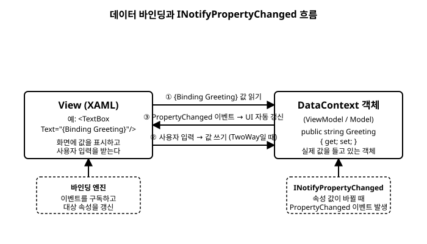

# 7장. 데이터 바인딩 기초

[◀ 이전: 6장. 이벤트 처리](ch06-이벤트처리.md) | [📖 목차](00-목차.md) | [다음: 8장. MVVM 패턴 ▶](ch08-MVVM패턴.md)


지금까지는 버튼을 누르면 이벤트 핸들러 코드에서 `TextBlock.Text`를 직접 대입하는 식으로 화면을 갱신했다. 이 방식은 규모가 작을 때는 문제가 없지만, 화면에 표시할 값이 늘어나고 값이 바뀌는 경로가 여러 개가 되면 "어떤 코드가 어떤 컨트롤을 갱신하는지"를 일일이 추적해야 하는 코드가 된다.

Avalonia는 XAML 마크업 안에서 "이 컨트롤의 이 속성은 저 데이터를 그대로 반영한다"라고 선언만 해두면, 데이터가 바뀔 때 화면이 자동으로 따라 바뀌는 **데이터 바인딩(Data Binding)** 기능을 제공한다. 이번 장에서는 바인딩의 가장 기본적인 문법과, 그 뒤에서 실제로 값 변경을 전달하는 `INotifyPropertyChanged` 인터페이스의 동작 원리를 다룬다. 이 장의 내용은 8장 MVVM 패턴과 9장 커맨드의 토대가 되므로 예제를 직접 따라 쳐보길 권한다.

## 7.1 코드비하인드 방식의 한계

다음은 버튼을 클릭할 때마다 카운트를 늘려 화면에 표시하는, 바인딩을 쓰지 않은 코드다.

```xml
<StackPanel Margin="20" Spacing="10">
    <TextBlock Name="CountText" Text="0" FontSize="24" />
    <Button Name="IncrementButton" Content="증가" />
</StackPanel>
```

```csharp
public partial class MainWindow : Window
{
    private int _count;

    public MainWindow()
    {
        InitializeComponent();
        IncrementButton.Click += (_, _) =>
        {
            _count++;
            CountText.Text = _count.ToString();
        };
    }
}
```

값이 하나뿐일 때는 별로 불편하지 않다. 하지만 같은 값을 화면 여러 곳에 표시해야 하거나, 값이 바뀌는 경로가 버튼 클릭 말고도 타이머, 네트워크 응답 등으로 늘어나면, 값이 바뀔 때마다 "화면의 어느 컨트롤을 찾아서 갱신해야 하는지"를 코드 곳곳에 흩뿌려 적어야 한다. 즉 **데이터**와 **그 데이터를 보여주는 방법(UI)**이 강하게 얽혀버린다.

데이터 바인딩은 이 얽힘을 풀어준다. "이 데이터가 바뀌면 화면이 알아서 갱신된다"는 규칙을 프레임워크에 한 번 맡겨두고, 우리는 데이터 쪽 코드만 신경 쓰면 된다.

## 7.2 {Binding} 구문 기초

Avalonia에서 바인딩은 XAML 속성 값 자리에 `{Binding 경로}` 형태로 적는다. 중괄호로 둘러싸인 부분을 **마크업 확장(Markup Extension)**이라고 부르는데, 3장에서 다룬 문법이다.

먼저 화면에 보여줄 값을 담을 평범한 C# 클래스를 하나 만든다.

```csharp
namespace BindingDemo;

public class MainWindowViewModel
{
    public string Greeting { get; set; } = "안녕하세요, Avalonia!";
}
```

이 클래스는 지금 시점에는 Avalonia의 어떤 타입도 상속하지 않은, 그야말로 평범한 C# 클래스다. 이 객체의 `Greeting` 속성을 XAML의 `TextBlock.Text`에 연결해보자.

```xml
<Window xmlns="https://github.com/avaloniaui"
        xmlns:x="http://schemas.microsoft.com/winfx/2006/xaml"
        x:Class="BindingDemo.MainWindow"
        Title="BindingDemo">
    <TextBlock Text="{Binding Greeting}"
               FontSize="20"
               Margin="20" />
</Window>
```

그리고 코드비하인드에서 이 객체를 만들어 윈도우에 연결한다.

```csharp
public partial class MainWindow : Window
{
    public MainWindow()
    {
        InitializeComponent();
        DataContext = new MainWindowViewModel();
    }
}
```

`DataContext = new MainWindowViewModel();` 한 줄이 핵심이다. 이 줄이 없으면 `{Binding Greeting}`은 값을 어디서 가져와야 할지 알 수 없다. `DataContext`가 무엇인지는 다음 절에서 자세히 다룬다.

`{Binding Greeting}`에서 `Greeting`은 바인딩 **경로(Path)**라고 부른다. 만약 속성이 중첩되어 있다면(예: `Person.Address.City`) 점(`.`)으로 이어서 적으면 된다.

```xml
<TextBlock Text="{Binding Owner.Name}" />
```

## 7.3 DataContext: 바인딩의 기준점

`DataContext`는 `Control`이 상속하는 `StyledElement` 클래스에 정의된 속성으로, "이 컨트롤과 그 자식 컨트롤들이 바인딩할 때 기준으로 삼을 객체"를 가리킨다. `{Binding Greeting}`이라고만 적으면 바인딩 엔진은 별다른 설정이 없는 한 가장 가까운 `DataContext`에서 `Greeting`이라는 이름의 속성을 찾는다.

`DataContext`의 중요한 특징은 **시각 트리를 따라 자식에게 상속된다**는 점이다. 부모 컨트롤에 `DataContext`를 한 번 지정하면, 그 자식들은 별도로 지정하지 않아도 같은 객체를 공유해서 바인딩할 수 있다.

```xml
<StackPanel>
    <!-- 이 StackPanel의 DataContext는 Window에서 물려받는다 -->
    <TextBlock Text="{Binding Greeting}" />
    <TextBlock Text="{Binding Greeting}" FontWeight="Bold" />
</StackPanel>
```

위 예제에서 `StackPanel`에는 `DataContext`를 지정하지 않았지만, 두 `TextBlock` 모두 `Window`에 설정된 `MainWindowViewModel` 인스턴스를 그대로 바인딩 기준으로 사용한다. 이는 마치 `FontSize` 같은 속성이 부모에서 자식으로 상속되는 것과 비슷한 동작 방식이다.

물론 필요하다면 트리 중간에서 `DataContext`를 다시 지정해 하위 영역만 다른 객체를 바라보게 만들 수도 있다. 이 기법은 14장에서 목록의 각 항목마다 서로 다른 데이터를 바인딩할 때 중요하게 쓰인다.

```xml
<Border DataContext="{Binding SelectedOwner}">
    <TextBlock Text="{Binding Name}" />
</Border>
```

여기서 `Border`의 `DataContext`는 바깥쪽 `DataContext`의 `SelectedOwner` 속성으로 다시 바인딩되었고, 그 안의 `TextBlock`은 `SelectedOwner.Name`이 아니라 `Name`만 적어도 된다. 기준점(`DataContext`)이 이미 `SelectedOwner`로 옮겨졌기 때문이다.

## 7.4 바인딩은 어떻게 동작하는가

지금까지 본 예제는 프로그램이 시작할 때 딱 한 번 값을 읽어와 화면에 표시하는 정도였다. 하지만 바인딩의 진짜 힘은 **데이터가 바뀌면 화면도 자동으로 따라 바뀐다**는 데 있다. 이 흐름을 그림으로 정리하면 다음과 같다.



전체 과정은 세 단계로 나눌 수 있다.

1. **값 읽기**: `TextBlock.Text="{Binding Greeting}"`이 처음 평가될 때, 바인딩 엔진은 `DataContext` 객체의 `Greeting` 속성 값을 읽어 `TextBlock.Text`에 대입한다.
2. **값 쓰기(양방향 바인딩일 때)**: `TextBox`처럼 사용자가 값을 직접 입력할 수 있는 컨트롤이라면, 사용자가 입력한 내용을 다시 `DataContext` 객체의 속성에 써 넣을 수도 있다.
3. **변경 통지**: `DataContext` 객체의 속성 값이 코드에서 바뀌면, 그 객체가 "내 속성이 바뀌었다"는 신호를 보내야 바인딩 엔진이 이를 알아채고 화면을 다시 갱신한다.

문제는 세 번째 단계다. 앞서 만든 `MainWindowViewModel.Greeting`은 그냥 자동 구현 속성(`{ get; set; }`)이라서, 코드에서 `Greeting`을 나중에 바꿔도 "값이 바뀌었다"는 신호를 어디에도 보내지 않는다. 이 신호를 보내는 표준 규약이 바로 `INotifyPropertyChanged` 인터페이스다.

## 7.5 INotifyPropertyChanged로 변경 알리기

`INotifyPropertyChanged`는 Avalonia 전용 인터페이스가 아니라 `System.ComponentModel` 네임스페이스에 정의된 표준 .NET 인터페이스다. Avalonia의 바인딩 엔진은 `DataContext`로 지정된 객체가 이 인터페이스를 구현하고 있는지 확인하고, 구현하고 있다면 그 객체의 `PropertyChanged` 이벤트를 자동으로 구독한다.

인터페이스 자체는 단순하다.

```csharp
namespace System.ComponentModel;

public interface INotifyPropertyChanged
{
    event PropertyChangedEventHandler? PropertyChanged;
}
```

이제 `MainWindowViewModel`을 이 인터페이스를 구현하도록 고쳐보자.

```csharp
using System.ComponentModel;

namespace BindingDemo;

public class MainWindowViewModel : INotifyPropertyChanged
{
    private string _greeting = "안녕하세요, Avalonia!";

    public string Greeting
    {
        get => _greeting;
        set
        {
            if (_greeting == value)
            {
                return;
            }

            _greeting = value;
            PropertyChanged?.Invoke(this, new PropertyChangedEventArgs(nameof(Greeting)));
        }
    }

    public event PropertyChangedEventHandler? PropertyChanged;
}
```

핵심은 `Greeting`의 `set` 접근자다. 더 이상 값을 필드에 대입만 하고 끝나지 않는다.

1. 새로 들어온 값이 기존 값과 같다면 아무 일도 하지 않고 반환한다(불필요한 UI 갱신과 이벤트 발생을 막기 위한 관례다).
2. 값이 실제로 다르면 필드(`_greeting`)에 새 값을 저장한다.
3. `PropertyChanged` 이벤트를 발생시키면서, `PropertyChangedEventArgs`에 **어떤 속성이 바뀌었는지**를 문자열로 담아 전달한다. `nameof(Greeting)`을 쓰면 오타 걱정 없이 "Greeting"이라는 문자열을 얻을 수 있다.

Avalonia의 바인딩 엔진은 이 `PropertyChanged` 이벤트를 구독해 두었다가, 이벤트가 발생하면 `PropertyChangedEventArgs.PropertyName`이 자신이 바인딩하고 있는 이름(`Greeting`)과 일치하는지 확인하고, 일치하면 그 즉시 `DataContext.Greeting`을 다시 읽어 `TextBlock.Text`에 반영한다. `PropertyName`이 `null`이거나 빈 문자열이면 "이 객체의 모든 속성이 바뀌었을 수 있다"는 의미로 해석해, 바인딩 중인 모든 속성을 다시 읽어온다.

이제 다음처럼 어딘가에서 `Greeting` 속성을 바꾸기만 하면, `TextBlock`에 표시된 문자열이 코드 한 줄 더 건드리지 않아도 자동으로 바뀐다.

```csharp
public MainWindow()
{
    InitializeComponent();

    var viewModel = new MainWindowViewModel();
    DataContext = viewModel;

    viewModel.Greeting = "환영합니다!"; // TextBlock이 자동으로 갱신된다
}
```

매 속성마다 `if (_field == value) return;` 이후 필드 대입, 이벤트 발생을 반복해서 적는 일은 금방 지겨워진다. 8장에서는 이 반복되는 패턴을 `ViewModelBase`라는 공통 기반 클래스로 한 번만 작성해두고 재사용하는 방법을 다룬다.

## 7.6 바인딩 모드

지금까지의 예제는 데이터가 화면으로 흘러가는 방향, 즉 "소스(`DataContext`의 속성) → 대상(컨트롤 속성)"만 다뤘다. 하지만 `TextBox`처럼 사용자 입력을 받는 컨트롤은 반대 방향, 즉 "대상 → 소스"로도 값이 흘러야 한다. 이 방향을 결정하는 것이 바인딩 모드(`BindingMode`)다.

`Avalonia.Data.BindingMode` 열거형에는 다음 값들이 있다.

| 모드 | 설명 |
|---|---|
| `OneWay` | 소스 → 대상 방향으로만 값이 전달된다. 대상 쪽에서 값을 바꿔도 소스는 바뀌지 않는다. |
| `TwoWay` | 소스 → 대상, 대상 → 소스 양쪽 방향 모두로 값이 전달된다. |
| `OneTime` | 바인딩이 처음 연결되는 시점에 딱 한 번만 값을 읽어오고, 이후로는 소스가 바뀌어도 대상을 갱신하지 않는다. |
| `OneWayToSource` | 대상 → 소스 방향으로만 전달된다. `OneWay`의 반대 방향이다. |
| `Default` | 대상 속성이 정의해 둔 기본 모드를 따른다. |

`Mode` 속성으로 바인딩 모드를 명시적으로 지정할 수 있다.

```xml
<TextBox Text="{Binding Greeting, Mode=TwoWay}" />
<TextBlock Text="{Binding Greeting, Mode=OneWay}" />
```

특별히 `Mode`를 적지 않으면 `Default`가 적용되는데, 이는 곧 대상 컨트롤의 그 속성이 미리 정해둔 기본값을 따른다는 뜻이다. 예를 들어 `TextBox.Text`는 기본 바인딩 모드가 `TwoWay`로 정의되어 있어서, `Mode`를 생략해도 사용자가 입력한 값이 곧바로 소스 속성에 반영된다. 반면 `TextBlock.Text`처럼 사용자가 값을 편집할 수 없는 속성은 기본 모드가 `OneWay`다.

```xml
<!-- TextBox.Text의 기본 모드는 TwoWay이므로 아래 두 줄은 동일하게 동작한다 -->
<TextBox Text="{Binding Greeting}" />
<TextBox Text="{Binding Greeting, Mode=TwoWay}" />
```

`OneTime`은 프로그램 실행 중 절대 바뀌지 않을 값(예: 설정 화면을 열 때 한 번만 읽어오는 초기 옵션 목록)에 사용하면, 바인딩 엔진이 `PropertyChanged` 이벤트를 구독하지 않아도 되므로 아주 미세하게나마 성능 이점이 있다.

## 7.7 값 변환기 맛보기: IValueConverter

바인딩 소스의 타입과 대상 속성의 타입이 항상 딱 맞아떨어지지는 않는다. 예를 들어 `bool` 값에 따라 `TextBlock`의 글자 색을 바꾸고 싶다거나, `DateTime` 값을 `"2026년 8월 23일"` 같은 형식의 문자열로 보여주고 싶을 수 있다. 이럴 때 소스 값과 대상 값 사이를 변환해주는 역할을 `IValueConverter` 인터페이스가 담당한다.

```csharp
namespace Avalonia.Data.Converters;

public interface IValueConverter
{
    object? Convert(object? value, Type targetType, object? parameter, CultureInfo culture);
    object? ConvertBack(object? value, Type targetType, object? parameter, CultureInfo culture);
}
```

`Convert`는 소스 → 대상 방향으로 값이 흐를 때, `ConvertBack`은 (`TwoWay` 바인딩에서) 대상 → 소스 방향으로 값이 흐를 때 호출된다. XAML에서는 `Converter` 속성으로 변환기 인스턴스를 지정해서 사용한다.

```xml
<TextBlock Text="{Binding IsOnline, Converter={StaticResource BoolToStatusConverter}}" />
```

이 장에서는 `IValueConverter`가 "타입이 다른 소스와 대상 사이를 이어주는 어댑터"라는 존재 이유만 짚고 넘어간다. 실제로 변환기를 구현하고 리소스로 등록해 활용하는 방법은 이후 실전 예제들에서 필요할 때마다 다시 다룬다.

## 요약

- `{Binding 경로}` 구문으로 XAML 컨트롤의 속성을 코드의 객체가 가진 속성과 연결할 수 있다.
- `DataContext`는 바인딩이 값을 찾는 기준이 되는 객체이며, 시각 트리를 따라 자식 컨트롤에 상속된다.
- `INotifyPropertyChanged`는 속성 값이 바뀔 때 `PropertyChanged` 이벤트를 발생시켜, 바인딩 엔진이 화면을 자동으로 갱신하도록 알려주는 표준 .NET 인터페이스다.
- `BindingMode`는 값이 흐르는 방향을 결정한다. `OneWay`는 소스→대상, `TwoWay`는 양방향, `OneTime`은 최초 한 번만 값을 읽는다.
- `IValueConverter`는 소스와 대상의 타입이 다를 때 그 사이를 변환해주는 인터페이스로, `Convert`/`ConvertBack` 두 메서드를 구현한다.

## 연습문제

1. `INotifyPropertyChanged`를 구현하지 않은 클래스를 `DataContext`로 지정했을 때, 코드에서 속성 값을 바꿔도 화면이 갱신되지 않는 이유를 이 장에서 설명한 바인딩 동작 원리를 근거로 서술하시오.
2. `Name`, `Age` 두 개의 속성을 가진 `PersonViewModel` 클래스를 `INotifyPropertyChanged`를 구현해 작성하고, `TextBlock` 두 개에 각각 바인딩하는 XAML을 작성하시오.
3. `TextBox`와 `TextBlock`을 하나씩 배치하고, 같은 `Message`라는 속성에 바인딩하되 `TextBox`는 `TwoWay`, `TextBlock`은 `OneWay`로 동작하도록 XAML을 작성하시오. `TextBox`에 글자를 입력하면 `TextBlock`도 같은 내용으로 바뀌는 이유를 설명하시오.
4. `Mode=OneTime`으로 바인딩된 속성의 값을 실행 중에 코드에서 변경했을 때 화면에 어떤 일이 일어나는지, 또 어떤 상황에 `OneTime`을 쓰는 것이 적절한지 설명하시오.
5. `bool` 타입의 `IsUrgent` 속성 값에 따라 `TextBlock`의 `Text`를 각각 `"긴급"`, `"일반"`으로 표시하고 싶다. `IValueConverter`가 왜 필요한지, 어떤 메서드에 어떤 로직을 넣어야 할지 개략적으로 서술하시오(구현 코드를 완성할 필요는 없다).

---

[◀ 이전: 6장. 이벤트 처리](ch06-이벤트처리.md) | [📖 목차](00-목차.md) | [다음: 8장. MVVM 패턴 ▶](ch08-MVVM패턴.md)
