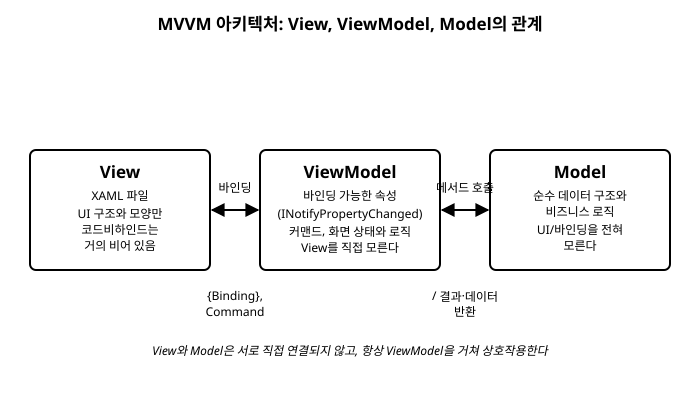

# 8장. MVVM 패턴

[◀ 이전: 7장. 데이터 바인딩 기초](ch07-데이터바인딩기초.md) | [📖 목차](00-목차.md) | [다음: 9장. 커맨드(ICommand) ▶](ch09-커맨드ICommand.md)


7장에서는 `{Binding}`과 `INotifyPropertyChanged`가 XAML의 컨트롤과 코드의 객체를 어떻게 이어주는지 살펴봤다. 이번 장에서는 그 기법을 발판 삼아, Avalonia를 비롯한 대부분의 XAML 기반 UI 프레임워크에서 표준처럼 쓰이는 설계 방식인 **MVVM(Model-View-ViewModel)** 패턴을 소개한다. MVVM은 특정 클래스나 API가 아니라, 코드를 세 가지 역할로 나누어 서로의 책임을 분리하는 **설계 관습**에 가깝다.

## 8.1 MVVM이란 무엇인가

MVVM은 화면 하나를 이루는 코드를 다음 세 계층으로 나눈다.

- **Model**: 애플리케이션이 다루는 순수한 데이터와 비즈니스 로직이다. 예를 들어 "할 일 항목"을 나타내는 클래스나, 파일을 읽고 쓰는 로직, 서버와 통신하는 로직 등이 여기 속한다. Model은 화면이 어떻게 생겼는지, 심지어 Avalonia가 쓰이고 있다는 사실조차 전혀 알지 못한다.
- **View**: XAML로 작성하는 화면 그 자체다. 버튼이 어디에 있고, 글자 크기가 얼마인지 같은 **UI의 구조와 모양**만을 정의한다. 코드비하인드(`.axaml.cs`)에는 되도록 로직을 두지 않고 `InitializeComponent()` 정도만 남겨둔다.
- **ViewModel**: View와 Model 사이를 잇는 계층이다. View가 화면에 표시할 상태(속성)와, 사용자 동작에 반응할 로직(커맨드, 9장에서 다룸)을 제공한다. ViewModel은 자신이 `TextBlock`에 보이는지 `Button`에 보이는지 전혀 모른다. 오직 "화면이 보여줄 만한 값과 동작"만 외부에 노출할 뿐이다.

세 계층의 관계를 그림으로 정리하면 다음과 같다.



여기서 눈여겨볼 규칙이 하나 있다. **View는 ViewModel을 알지만, ViewModel은 View를 모른다.** View는 자신의 `DataContext`로 ViewModel 인스턴스를 받아 바인딩으로 값을 끌어다 쓰지만, ViewModel의 코드 어디에도 `Button`이나 `TextBlock` 같은 Avalonia 타입은 등장하지 않는다. 이렇게 한쪽 방향으로만 의존하도록 만들어두면, ViewModel은 화면 없이도(예를 들어 단위 테스트 코드에서) 그대로 생성하고 검증할 수 있다.

마찬가지로 ViewModel은 Model을 알지만 Model은 ViewModel을 모른다. ViewModel은 Model의 메서드를 호출해 데이터를 가져오거나 저장하고, 그 결과를 다시 자신의 속성에 반영해 View에 보여준다.

## 8.2 Avalonia가 MVVM과 잘 맞는 이유

MVVM은 어떤 UI 프레임워크에서도 적용해볼 수 있는 개념이지만, Avalonia는 특히 이 패턴이 자연스럽게 녹아들도록 설계되어 있다.

첫째, 7장에서 다룬 것처럼 바인딩 시스템이 매우 강력하다. 단순한 텍스트 표시뿐 아니라 색상, 표시 여부, 목록(14장), 커맨드(9장)까지 대부분의 컨트롤 속성을 XAML만으로 ViewModel에 연결할 수 있다. 이 덕분에 "값이 바뀌면 화면을 갱신하는" 코드를 코드비하인드에 직접 작성할 필요가 거의 없어진다.

둘째, 이 강력한 바인딩 덕분에 **코드비하인드를 거의 비워둘 수 있다.** 실제로 Avalonia 프로젝트 템플릿이 만들어주는 `MainWindow.axaml.cs` 파일은 대개 다음과 같은 모습에서 크게 벗어나지 않는다.

```csharp
public partial class MainWindow : Window
{
    public MainWindow()
    {
        InitializeComponent();
    }
}
```

코드비하인드가 비어있다는 것은 게으르다는 뜻이 아니라, 화면과 관련된 로직이 전부 테스트하기 쉬운 ViewModel 쪽에 모여 있다는 뜻이다. 이는 프로그램이 커질수록 큰 이점이 된다.

## 8.3 ViewModelBase 만들기

7장에서 `INotifyPropertyChanged`를 직접 구현했을 때, `Greeting` 속성 하나를 위해 "기존 값과 같은지 비교하고, 다르면 필드에 대입하고, 이벤트를 발생시키는" 코드를 매번 반복해서 작성해야 했다. 속성이 여러 개인 ViewModel을 만들 때마다 이 코드를 새로 타이핑하는 일은 금방 번거로워진다.

이 반복을 없애기 위해, 프로젝트의 모든 ViewModel이 공통으로 상속할 `ViewModelBase` 클래스를 하나 만들어두는 것이 관용적인 방법이다.

```csharp
using System.Collections.Generic;
using System.ComponentModel;
using System.Runtime.CompilerServices;

namespace CounterApp.ViewModels;

public class ViewModelBase : INotifyPropertyChanged
{
    public event PropertyChangedEventHandler? PropertyChanged;

    protected void OnPropertyChanged([CallerMemberName] string? propertyName = null)
    {
        PropertyChanged?.Invoke(this, new PropertyChangedEventArgs(propertyName));
    }

    protected bool SetProperty<T>(ref T field, T value, [CallerMemberName] string? propertyName = null)
    {
        if (EqualityComparer<T>.Default.Equals(field, value))
        {
            return false;
        }

        field = value;
        OnPropertyChanged(propertyName);
        return true;
    }
}
```

두 가지 도우미 메서드가 핵심이다.

- `OnPropertyChanged`는 `PropertyChanged` 이벤트를 발생시키는 역할만 한다. `[CallerMemberName]` 특성이 붙어 있어서, 호출하는 쪽에서 속성 이름을 생략하면 컴파일러가 **호출한 속성(또는 메서드)의 이름을 자동으로 채워 넣는다.**
- `SetProperty`는 7장에서 손으로 쓴 "값 비교 → 필드 대입 → 이벤트 발생" 세 단계를 제네릭 메서드 하나로 캡슐화한 것이다. `EqualityComparer<T>.Default.Equals`를 사용하므로 `int`, `string`, `bool` 등 어떤 타입의 속성이든 재사용할 수 있다.

`ViewModelBase`를 상속하면, 7장에서 여러 줄로 작성했던 속성 하나를 다음처럼 짧게 줄일 수 있다.

```csharp
public class MainWindowViewModel : ViewModelBase
{
    private string _greeting = "안녕하세요, Avalonia!";

    public string Greeting
    {
        get => _greeting;
        set => SetProperty(ref _greeting, value);
    }
}
```

`SetProperty(ref _greeting, value)`를 호출할 때 속성 이름을 따로 넘기지 않아도, `[CallerMemberName]` 덕분에 `Greeting`이라는 이름이 자동으로 전달된다. 이 관용구는 이후 장들에서 등장하는 모든 ViewModel 예제의 기본 뼈대가 된다.

## 8.4 View에 ViewModel 연결하기

`DataContext`에 ViewModel 인스턴스를 지정하는 방법은 실행 시점과 디자인 시점, 두 가지로 나눠 생각할 수 있다.

### 실행 시점: 코드비하인드 생성자에서 지정

가장 기본적인 방법은 7장에서 이미 했던 대로, View의 코드비하인드 생성자에서 `DataContext`에 ViewModel 인스턴스를 대입하는 것이다.

```csharp
public partial class MainWindow : Window
{
    public MainWindow()
    {
        InitializeComponent();
        DataContext = new MainWindowViewModel();
    }
}
```

`InitializeComponent()` 호출 이후에 `DataContext`를 지정해야 XAML에 정의된 컨트롤들이 먼저 만들어진 뒤 바인딩이 값을 찾아갈 수 있다.

### 디자인 시점: Design.DataContext로 미리보기 지정

IDE의 XAML 미리보기 창은 실제로 프로그램을 실행하지 않고도 화면 모양을 보여준다. 하지만 코드비하인드 생성자는 프로그램이 실행될 때만 호출되므로, 미리보기 창에는 `DataContext`가 `null`인 상태로 컨트롤이 표시되어 바인딩된 값들이 전부 비어 보인다.

Avalonia는 이 문제를 해결하기 위해 `Design` 클래스가 제공하는 `Design.DataContext` 첨부 속성을 제공한다. 이 값은 IDE의 미리보기와 디자이너에서만 적용되고, 실제 프로그램 실행 시에는 완전히 무시된다.

```xml
<Window xmlns="https://github.com/avaloniaui"
        xmlns:x="http://schemas.microsoft.com/winfx/2006/xaml"
        xmlns:d="http://schemas.microsoft.com/expression/blend/2008"
        xmlns:mc="http://schemas.openxmlformats.org/markup-compatibility/2006"
        xmlns:vm="using:CounterApp.ViewModels"
        mc:Ignorable="d"
        d:DesignWidth="400" d:DesignHeight="300"
        x:Class="CounterApp.Views.MainWindow"
        x:DataType="vm:MainWindowViewModel"
        Title="CounterApp">

    <Design.DataContext>
        <vm:MainWindowViewModel />
    </Design.DataContext>

    <TextBlock Text="{Binding Greeting}" />
</Window>
```

`xmlns:vm="using:CounterApp.ViewModels"`로 ViewModel이 속한 네임스페이스를 XAML에 끌어온 뒤, `<Design.DataContext>` 안에 `MainWindowViewModel`을 객체 요소로 만들어 넣었다. 이렇게 하면 미리보기 창에서도 `Greeting` 속성의 실제 값("안녕하세요, Avalonia!")이 표시되어, 실행하지 않고도 화면 모양을 확인할 수 있다.

`x:DataType="vm:MainWindowViewModel"` 역시 함께 적어두면 좋다. 이 속성은 XAML 컴파일러에게 "이 View의 `DataContext`는 항상 이 타입이다"라고 알려주는 역할을 하며, `{Binding}`에 오타가 있거나 존재하지 않는 속성 이름을 적었을 때 실행 전 컴파일 단계에서 오류를 잡아주고, IDE의 자동 완성도 훨씬 정확해진다.

## 8.5 실전 예제: 카운터 앱

지금까지 배운 내용을 모두 엮어, 버튼을 누르면 숫자가 하나씩 늘어나는 간단한 카운터 앱을 처음부터 끝까지 만들어보자.

### ViewModel

```csharp
namespace CounterApp.ViewModels;

public class MainWindowViewModel : ViewModelBase
{
    private int _count;

    public int Count
    {
        get => _count;
        set => SetProperty(ref _count, value);
    }

    public void Increment()
    {
        Count++;
    }
}
```

`Count`는 화면에 보여줄 상태고, `Increment`는 그 상태를 바꾸는 동작이다. 이 클래스 어디에도 `Button`이나 `Click` 같은 Avalonia UI 관련 타입은 등장하지 않는다. `Increment` 메서드는 그저 정수 하나를 1 늘릴 뿐이다.

### View

```xml
<Window xmlns="https://github.com/avaloniaui"
        xmlns:x="http://schemas.microsoft.com/winfx/2006/xaml"
        xmlns:d="http://schemas.microsoft.com/expression/blend/2008"
        xmlns:mc="http://schemas.openxmlformats.org/markup-compatibility/2006"
        xmlns:vm="using:CounterApp.ViewModels"
        mc:Ignorable="d"
        d:DesignWidth="300" d:DesignHeight="200"
        x:Class="CounterApp.Views.MainWindow"
        x:DataType="vm:MainWindowViewModel"
        Title="CounterApp"
        Width="300" Height="200">

    <Design.DataContext>
        <vm:MainWindowViewModel />
    </Design.DataContext>

    <StackPanel Margin="20" Spacing="12" HorizontalAlignment="Center" VerticalAlignment="Center">
        <TextBlock Text="{Binding Count}"
                   FontSize="36"
                   HorizontalAlignment="Center" />
        <Button Content="증가"
                Click="OnIncrementClick"
                HorizontalAlignment="Center" />
    </StackPanel>
</Window>
```

`TextBlock.Text`는 `Count`에 바인딩되어 있으므로, `Count` 값이 바뀔 때마다 `ViewModelBase.SetProperty`가 발생시키는 `PropertyChanged` 이벤트를 통해 자동으로 갱신된다. `Button`에는 아직 커맨드(9장의 주제)를 쓰지 않았으므로, 우선은 6장에서 배운 `Click` 이벤트로 처리한다.

### 코드비하인드

```csharp
using Avalonia.Controls;
using Avalonia.Interactivity;
using CounterApp.ViewModels;

namespace CounterApp.Views;

public partial class MainWindow : Window
{
    public MainWindow()
    {
        InitializeComponent();
        DataContext = new MainWindowViewModel();
    }

    private void OnIncrementClick(object? sender, RoutedEventArgs e)
    {
        if (DataContext is MainWindowViewModel viewModel)
        {
            viewModel.Increment();
        }
    }
}
```

### 전체 흐름 정리

버튼을 클릭했을 때 일어나는 일을 순서대로 따라가 보자.

1. 사용자가 "증가" 버튼을 클릭하면 `Click` 이벤트가 발생하고, 코드비하인드의 `OnIncrementClick`이 호출된다.
2. `OnIncrementClick`은 UI를 직접 건드리지 않는다. 대신 `DataContext`를 `MainWindowViewModel`로 캐스팅해 `Increment()` 메서드만 호출한다.
3. `Increment()` 안에서 `Count++`가 실행되면 `Count`의 `set` 접근자가 호출되고, 내부적으로 `SetProperty`가 이전 값과 새 값을 비교한 뒤 다르므로 필드를 갱신하고 `PropertyChanged` 이벤트를 발생시킨다.
4. Avalonia의 바인딩 엔진은 이 이벤트를 구독하고 있다가, 이벤트가 발생하면 `TextBlock.Text`가 바인딩하고 있는 `Count` 값을 다시 읽어와 화면에 반영한다.

이 흐름에서 코드비하인드가 하는 일은 딱 하나, "버튼 클릭"이라는 UI 이벤트를 ViewModel의 메서드 호출로 그대로 전달하는 것뿐이다. 실제 상태 변경과 그 결과로 화면이 갱신되는 과정은 전부 ViewModel과 바인딩 엔진이 처리한다. 9장에서 `ICommand`를 배우고 나면, `Click` 이벤트 핸들러조차 코드비하인드에서 없앨 수 있게 되어 코드비하인드는 `InitializeComponent()` 한 줄만 남게 된다.

## 요약

- MVVM은 화면을 View(구조/모양), ViewModel(상태/로직), Model(순수 데이터/비즈니스 로직) 세 계층으로 나누는 설계 관습이다. View는 ViewModel을 알지만 ViewModel은 View를 모르며, ViewModel은 Model을 일반적인 메서드 호출로 사용한다.
- Avalonia는 강력한 바인딩 시스템 덕분에 코드비하인드를 거의 비워두고, 화면 관련 로직을 테스트하기 쉬운 ViewModel에 모을 수 있다.
- `ViewModelBase`처럼 `INotifyPropertyChanged`를 한 번만 구현해둔 공통 기반 클래스를 만들고, `SetProperty` 도우미 메서드와 `[CallerMemberName]`을 활용하면 반복 코드를 크게 줄일 수 있다.
- 실행 시점에는 코드비하인드 생성자에서 `DataContext`를 지정하고, 디자인 시점 미리보기를 위해서는 `<Design.DataContext>`에 ViewModel 인스턴스를 선언해둔다. `x:DataType`을 함께 지정하면 바인딩 오류를 컴파일 단계에서 미리 잡을 수 있다.
- 카운터 앱 예제에서 보았듯, 코드비하인드는 UI 이벤트를 ViewModel의 메서드 호출로 전달하는 최소한의 역할만 맡고, 실제 상태 관리는 ViewModel이 전담한다.

## 연습문제

1. MVVM에서 "View는 ViewModel을 알지만 ViewModel은 View를 모른다"는 규칙이 왜 중요한지, 이 규칙을 어겼을 때(예: ViewModel 안에서 `Button` 타입을 직접 참조한다면) 어떤 문제가 생길 수 있을지 서술하시오.
2. `ViewModelBase`의 `SetProperty` 메서드에서 `[CallerMemberName]` 특성이 하는 역할을 설명하고, 이 특성이 없다면 `Count` 속성의 `set` 접근자 코드가 어떻게 달라져야 하는지 작성하시오.
3. 이 장의 카운터 앱 예제에 "감소" 버튼을 추가하여 `Count`를 1씩 줄이는 기능을 완성하시오. ViewModel과 View, 코드비하인드에 필요한 변경 사항을 모두 포함하시오.
4. `Design.DataContext`가 실행 시점의 `DataContext`와 어떻게 다른지, 그리고 두 가지를 모두 지정해야 하는 이유를 설명하시오.
5. `Name`과 `Email` 두 속성을 가진 `Person` Model 클래스와, 이를 감싸서 화면에 보여줄 `PersonEditorViewModel`을 설계하시오. `PersonEditorViewModel`은 `ViewModelBase`를 상속하며, 내부적으로 `Person` 인스턴스를 가지고 있다가 속성이 바뀌면 그 값을 `Person`에 반영하는 형태로 작성하시오.

---

[◀ 이전: 7장. 데이터 바인딩 기초](ch07-데이터바인딩기초.md) | [📖 목차](00-목차.md) | [다음: 9장. 커맨드(ICommand) ▶](ch09-커맨드ICommand.md)
