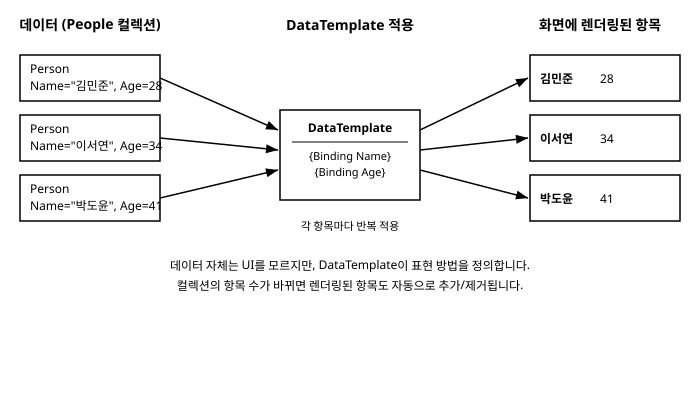

# 11장. 컨트롤 템플릿과 데이터 템플릿

[◀ 이전: 10장. 스타일과 리소스](ch10-스타일과리소스.md) | [📖 목차](00-목차.md) | [다음: 12장. 사용자 정의 컨트롤(UserControl) ▶](ch12-사용자정의컨트롤.md)


10장에서는 `Style`과 리소스를 이용해 `Background`, `FontSize`, `Margin` 같은 속성 값을 여러 컨트롤에 일괄 적용하는 방법을 살펴보았습니다. 그런데 속성 값을 바꾸는 것만으로는 해결되지 않는 문제가 있습니다. 예를 들어 `Button`을 완전히 다른 모양 — 테두리가 없고 텍스트만 떠 있는 버튼, 혹은 아이콘과 글자가 세로로 쌓인 버튼 — 으로 바꾸고 싶다면, 몇 가지 속성 값을 조정하는 정도로는 부족합니다. 버튼의 내부 구조 자체를 다시 정의해야 합니다.

또 하나, 지금까지는 화면에 무엇을 보여줄지 XAML에 직접 써왔습니다. `TextBlock`, `Button`, `Border`를 하나씩 배치하는 식이었죠. 하지만 실제 앱에서는 "사람 목록", "주문 목록"처럼 데이터의 컬렉션을 화면에 뿌려야 하는 경우가 훨씬 많습니다. 데이터가 10개면 10개, 100개면 100개의 UI 조각이 필요한데, 이걸 일일이 XAML로 쓸 수는 없습니다.

이 두 가지 문제를 해결하는 것이 이번 장의 주제인 **컨트롤 템플릿(ControlTemplate)**과 **데이터 템플릿(DataTemplate)**입니다. 이름은 비슷하지만 역할은 분명히 다릅니다.

- **ControlTemplate**은 컨트롤 하나의 겉모습(시각적 구조)을 통째로 새로 정의합니다.
- **DataTemplate**은 데이터 객체 하나를 화면에 어떻게 그릴지 정의합니다.

## 11.1 템플릿이라는 개념

Avalonia의 많은 컨트롤은 **로직**과 **겉모습**이 분리되어 있습니다. `Button`을 예로 들면, "클릭하면 `Click` 이벤트를 발생시킨다", "눌려 있는 동안 `:pressed` 상태가 된다" 같은 동작 로직은 `Button` 클래스 코드에 들어 있습니다. 반면 "버튼이 화면에 사각형 테두리로 그려진다"는 겉모습은 클래스 코드가 아니라 **ControlTemplate**이라는 별도의 XAML 조각에 정의되어 있습니다.

이렇게 로직과 겉모습을 분리해두면, 버튼이 클릭을 인식하고 이벤트를 발생시키는 동작은 그대로 둔 채 겉모습만 완전히 다르게 그릴 수 있습니다. 이것이 ControlTemplate의 존재 이유입니다.

데이터 템플릿은 조금 다른 문제를 다룹니다. `Person`이라는 데이터 클래스가 있고 그 인스턴스를 화면에 표시하고 싶다고 합시다. `Person` 자체는 UI에 대해 아무것도 모르는 순수한 데이터 클래스입니다. 이 데이터를 "이름은 굵게, 나이는 회색 글씨로, 가로로 나란히" 같은 식으로 그리는 방법을 알려주는 것이 **DataTemplate**입니다. 즉 DataTemplate은 "이런 종류의 데이터가 오면 이렇게 그려라"는 변환 규칙입니다.

두 템플릿의 차이를 한 문장으로 요약하면 이렇습니다.

> ControlTemplate은 **컨트롤 자신**의 모양을 정의하고, DataTemplate은 **컨트롤이 보여줄 데이터**의 모양을 정의합니다.

## 11.2 ControlTemplate으로 컨트롤 겉모습 다시 그리기

### 기본 컨트롤의 템플릿

`Button`, `CheckBox`, `TextBox` 같은 내장 컨트롤은 모두 기본 ControlTemplate을 가지고 있습니다. 이 기본 템플릿은 Avalonia가 제공하는 테마(Fluent 테마 등)에 정의되어 있어서, 우리가 XAML에 `<Button Content="확인"/>`이라고만 써도 버튼다운 모양이 나오는 것입니다.

`Button`의 기본 템플릿이 실제로 어떻게 생겼는지 짐작해보면 대략 다음과 같은 구조입니다.

```xml
<ControlTemplate TargetType="Button">
    <ContentPresenter Background="{TemplateBinding Background}"
                       BorderBrush="{TemplateBinding BorderBrush}"
                       BorderThickness="{TemplateBinding BorderThickness}"
                       CornerRadius="{TemplateBinding CornerRadius}"
                       Content="{TemplateBinding Content}"
                       ContentTemplate="{TemplateBinding ContentTemplate}"
                       Padding="{TemplateBinding Padding}"
                       HorizontalContentAlignment="{TemplateBinding HorizontalContentAlignment}"
                       VerticalContentAlignment="{TemplateBinding VerticalContentAlignment}"/>
</ControlTemplate>
```

핵심은 `{TemplateBinding ...}`입니다. 이 바인딩은 템플릿이 적용되는 대상, 즉 `Button` 인스턴스 자신의 속성 값을 템플릿 내부의 요소에 그대로 전달합니다. 우리가 `<Button Background="Red"/>`라고 쓰면 그 값이 `TemplateBinding`을 통해 템플릿 내부의 `ContentPresenter.Background`로 흘러 들어가는 것입니다. `TemplateBinding`은 `ControlTemplate` 내부에서만 의미를 가지는 특별한 바인딩이며, 7장에서 다룬 일반 데이터 바인딩과는 목적이 다릅니다 — 데이터 바인딩이 데이터 소스와 화면을 연결한다면, `TemplateBinding`은 컨트롤 자신의 속성과 템플릿 내부 요소를 연결합니다.

`ContentPresenter`는 `Button`처럼 `Content` 속성을 갖는 컨트롤(`ContentControl` 계열)에서 실제 콘텐츠가 그려질 자리를 표시하는 특수한 컨트롤입니다. `Content`로 전달된 문자열이든, 다른 컨트롤이든, `ContentPresenter`가 그 자리에 렌더링을 담당합니다.

### 나만의 ControlTemplate 만들기

이제 버튼의 모양을 직접 새로 정의해봅시다. 10장에서 배운 `Style`의 `Setter`를 이용해 `Template` 속성 자체를 교체하면 됩니다.

```xml
<Window.Styles>
    <Style Selector="Button.pill">
        <Setter Property="Template">
            <ControlTemplate TargetType="Button">
                <Border Name="PART_Border"
                        Background="{TemplateBinding Background}"
                        BorderBrush="{TemplateBinding BorderBrush}"
                        BorderThickness="{TemplateBinding BorderThickness}"
                        CornerRadius="18">
                    <ContentPresenter Content="{TemplateBinding Content}"
                                      Margin="{TemplateBinding Padding}"
                                      HorizontalAlignment="Center"
                                      VerticalAlignment="Center"/>
                </Border>
            </ControlTemplate>
        </Setter>
        <Setter Property="Background" Value="#3B82F6"/>
        <Setter Property="Padding" Value="20,8"/>
    </Style>
</Window.Styles>

<Button Classes="pill" Content="알약 모양 버튼"/>
```

`Border`의 `CornerRadius`를 크게 주어 양 끝이 둥근 알약 모양 버튼을 만들었습니다. 원래 `Button`의 클릭 처리, 포커스 처리 같은 동작 로직은 전혀 건드리지 않았고, 오직 "어떻게 그려지는가"만 바꾸었다는 점에 주목하세요.

### 상태에 따라 모양이 바뀌는 부분 스타일링

버튼은 마우스가 올라갔을 때(`:pointerover`), 눌렸을 때(`:pressed`) 모양이 달라져야 자연스럽습니다. 10장에서 배운 의사 클래스 선택자를 템플릿 내부의 이름 붙은 요소에도 적용할 수 있습니다. `/template/`는 "이 셀렉터가 템플릿 내부를 가리킨다"는 뜻의 결합자입니다.

```xml
<Style Selector="Button.pill:pointerover /template/ Border#PART_Border">
    <Setter Property="Background" Value="#2563EB"/>
</Style>

<Style Selector="Button.pill:pressed /template/ Border#PART_Border">
    <Setter Property="Background" Value="#1D4ED8"/>
</Style>
```

`Border`에 `Name="PART_Border"`를 지정해두었기 때문에 `#PART_Border`로 정확히 그 요소를 지목할 수 있습니다. 이런 방식으로 컨트롤의 동작 로직은 그대로 두고, 상태별 모양만 원하는 대로 세밀하게 조정할 수 있습니다.

## 11.3 DataTemplate으로 데이터를 화면에 그리기

### 데이터 하나를 그리기

간단한 데이터 클래스를 하나 정의해봅시다.

```csharp
public class Person
{
    public string Name { get; set; } = string.Empty;
    public int Age { get; set; }
}
```

이 클래스는 UI에 대해 아무것도 모릅니다. `Person` 인스턴스 하나를 화면에 표시하려면 `ContentControl`과 `DataTemplate`을 조합하면 됩니다.

```xml
<ContentControl Content="{Binding SelectedPerson}">
    <ContentControl.ContentTemplate>
        <DataTemplate x:DataType="local:Person">
            <StackPanel Orientation="Horizontal" Spacing="8">
                <TextBlock Text="{Binding Name}" FontWeight="Bold"/>
                <TextBlock Text="{Binding Age, StringFormat='({0}세)'}"/>
            </StackPanel>
        </DataTemplate>
    </ContentControl.ContentTemplate>
</ContentControl>
```

`DataTemplate`의 `x:DataType`은 이 템플릿이 어떤 형식의 데이터를 대상으로 하는지 컴파일 타임에 알려줍니다. 7장에서 살펴본 것처럼 `x:DataType`을 지정하면 Avalonia는 컴파일된 바인딩(compiled binding)을 생성할 수 있어서, 오타가 있는 속성 이름은 실행 시점이 아니라 빌드 시점에 걸러지고 바인딩 성능도 더 좋아집니다.

`ContentControl`이 `Content`로 받은 `Person` 객체를 화면에 그릴 때, `ContentTemplate`에 지정된 `DataTemplate`을 사용해 `StackPanel` 안에 이름과 나이를 표시하는 것입니다. `Person` 클래스 자체는 여전히 UI를 전혀 모르는 순수한 데이터 클래스로 남아 있습니다.

### 목록에 DataTemplate 적용하기 — ItemTemplate

DataTemplate의 진짜 위력은 컬렉션을 다룰 때 드러납니다. `ItemsControl`이나 `ListBox` 같은 컨트롤은 `ItemsSource`에 컬렉션을 연결하면 그 안의 항목 하나하나에 대해 **같은 DataTemplate을 반복 적용**해서 화면을 채웁니다.

```xml
<ListBox ItemsSource="{Binding People}">
    <ListBox.ItemTemplate>
        <DataTemplate x:DataType="local:Person">
            <StackPanel Orientation="Horizontal" Spacing="8" Margin="4">
                <TextBlock Text="{Binding Name}" FontWeight="Bold" Width="80"/>
                <TextBlock Text="{Binding Age}" Foreground="Gray"/>
            </StackPanel>
        </DataTemplate>
    </ListBox.ItemTemplate>
</ListBox>
```

`People`이 `Person` 100개를 담은 컬렉션이라면, `ListBox`는 이 `DataTemplate`을 100번 적용해서 100개의 행을 그립니다. 데이터가 바뀌어 컬렉션의 항목 수가 늘거나 줄면 화면도 자동으로 함께 바뀝니다. 이 내용은 14장 "리스트와 컬렉션 바인딩"에서 `ObservableCollection`과 함께 훨씬 더 깊이 다룰 것입니다. 지금은 "`ItemTemplate` 하나로 컬렉션의 모든 항목을 동일한 규칙으로 그릴 수 있다"는 점만 기억해두면 충분합니다.

### 형식만으로 자동 매칭되는 암묵적 템플릿

지금까지는 `ContentTemplate`이나 `ItemTemplate`에 명시적으로 `DataTemplate`을 지정했습니다. 그런데 앱 전체에서 `Person`이 등장할 때마다 매번 같은 템플릿을 반복해서 써야 한다면 번거롭습니다. Avalonia는 `DataTemplates`라는 컬렉션 속성을 통해 "이 형식의 데이터가 나타나면 항상 이 템플릿으로 그려라"라는 규칙을 등록할 수 있게 해줍니다. `Window`, `UserControl`, `Application` 등은 모두 이 `DataTemplates` 컬렉션을 가지고 있습니다.

```xml
<Window.DataTemplates>
    <DataTemplate DataType="local:Person">
        <StackPanel Orientation="Horizontal" Spacing="8">
            <TextBlock Text="{Binding Name}" FontWeight="Bold"/>
            <TextBlock Text="{Binding Age}"/>
        </StackPanel>
    </DataTemplate>
</Window.DataTemplates>
```

이렇게 등록해두면 같은 창 안에서 `ContentControl.Content`나 `ItemsControl.ItemsSource`에 `Person` 객체가 나타날 때 별도로 `ItemTemplate`을 지정하지 않아도 이 템플릿이 자동으로 적용됩니다. 이 방식은 8장에서 다룬 MVVM 패턴에서 특히 유용합니다. 뷰모델 형식과 뷰(UserControl)를 일대일로 짝지어 `App.axaml`의 `Application.DataTemplates`에 등록해두면, 코드에서는 "어떤 뷰모델을 보여줄지"만 결정하고 "그 뷰모델을 실제로 어떤 화면으로 그릴지"는 템플릿 매칭에 완전히 맡길 수 있기 때문입니다. 이 패턴은 15장 "네비게이션과 다이얼로그"에서 화면 전환을 구현할 때 다시 등장합니다.

## 11.4 템플릿 렌더링 흐름 한눈에 보기

지금까지 설명한 DataTemplate의 동작을, 사람 목록 데이터가 실제 화면 항목으로 바뀌는 과정을 통해 그림으로 정리하면 다음과 같습니다.



왼쪽의 순수한 데이터 객체들이, 가운데의 `DataTemplate`이라는 변환 규칙을 각 항목마다 반복 적용받아, 오른쪽의 실제로 화면에 그려지는 UI 조각들로 바뀝니다. 데이터가 추가되거나 삭제되면 이 변환 과정이 다시 실행되어 화면이 최신 상태로 갱신됩니다.

## 11.5 TemplatedControl과 UserControl, 무엇이 다른가

Avalonia에서 재사용 가능한 UI 조각을 만드는 방법은 크게 두 갈래로 나뉩니다.

- **UserControl**: 기존 컨트롤 몇 개를 조합해 하나의 화면 조각으로 묶는 방식입니다. 내부 레이아웃을 XAML에 직접, 고정된 형태로 작성합니다. 만들기 쉽고 이해하기 쉬워서 화면의 특정 영역(예: 로그인 폼, 카드 위젯)을 재사용하고 싶을 때 가장 먼저 선택하는 방법입니다.
- **TemplatedControl**: `Button`이나 `CheckBox`처럼, 동작 로직과 겉모습(ControlTemplate)을 완전히 분리해서 만드는 방식입니다. 컨트롤을 사용하는 쪽에서 이번 장에서 배운 것처럼 `ControlTemplate`을 통째로 갈아 끼워 겉모습을 마음대로 바꿀 수 있다는 것이 UserControl과의 가장 큰 차이입니다.

간단히 말하면, UserControl은 "이미 정해진 모양의 조립품"이고 TemplatedControl은 "모양을 통째로 바꿔 끼울 수 있는 부품"입니다. 대부분의 화면 조각은 UserControl로 충분하며, 정말 여러 프로젝트에서 재사용하거나 테마에 따라 겉모습이 완전히 달라져야 하는 범용 컨트롤을 만들 때 TemplatedControl을 선택합니다. UserControl을 직접 만들어보는 실습은 바로 다음 장에서 진행하고, TemplatedControl과 Avalonia의 속성 시스템(`StyledProperty`, `DirectProperty`)은 13장에서 본격적으로 다룹니다.

## 요약

- **ControlTemplate**은 컨트롤의 시각적 구조 자체를 새로 정의합니다. `Style`의 `Template` 속성에 `Setter`로 지정하며, 내부에서는 `{TemplateBinding ...}`으로 컨트롤 자신의 속성 값을 끌어옵니다.
- `ContentPresenter`는 `ContentControl` 계열 컨트롤에서 실제 콘텐츠가 그려질 위치를 나타내는 특수한 컨트롤입니다.
- 템플릿 내부의 이름 붙은 요소는 `Selector /template/ 이름#요소` 형태의 셀렉터로 지목해 상태별(예: `:pointerover`, `:pressed`) 스타일을 세밀하게 적용할 수 있습니다.
- **DataTemplate**은 데이터 객체 하나를 화면에 어떻게 그릴지 정의합니다. `x:DataType`을 지정하면 컴파일된 바인딩의 이점을 얻을 수 있습니다.
- `ContentTemplate`, `ItemTemplate`으로 명시적으로 지정하거나, `DataTemplates` 컬렉션에 형식별로 등록해 암묵적으로 매칭시킬 수 있습니다.
- `ItemsControl`, `ListBox` 등은 `ItemTemplate`을 컬렉션의 각 항목에 반복 적용해 목록 UI를 만듭니다. 자세한 내용은 14장에서 다룹니다.
- UserControl은 고정된 조립형 화면 조각, TemplatedControl은 겉모습을 통째로 교체할 수 있는 범용 부품입니다.

## 연습문제

1. `TextBlock`을 감싼 `Border`로 구성된 `CheckBox`용 `ControlTemplate`을 직접 작성해보세요. 체크되지 않았을 때와 체크되었을 때(`:checked` 의사 클래스) 배경색이 달라지도록 스타일을 추가해보세요.
2. `TemplateBinding`과 일반 데이터 바인딩(`{Binding ...}`)의 차이를 자신의 말로 설명해보세요. 각각 어떤 상황에서 사용해야 하는지도 함께 정리해보세요.
3. `Product` 클래스(이름, 가격 속성)를 정의하고, `ListBox`의 `ItemTemplate`으로 이름은 굵게, 가격은 `StringFormat`을 이용해 `"₩12,000"` 형태로 표시하는 `DataTemplate`을 작성해보세요.
4. 같은 `Product` 템플릿을 `Window.DataTemplates`에 암묵적 템플릿으로 등록하고, `ItemTemplate`을 지정하지 않은 `ListBox`에서도 자동으로 적용되는지 확인해보세요.
5. UserControl과 TemplatedControl 중 어느 쪽을 선택해야 할지 애매한 상황을 하나 떠올려보고, 어떤 기준으로 결정할지 이유와 함께 적어보세요.

---

[◀ 이전: 10장. 스타일과 리소스](ch10-스타일과리소스.md) | [📖 목차](00-목차.md) | [다음: 12장. 사용자 정의 컨트롤(UserControl) ▶](ch12-사용자정의컨트롤.md)
