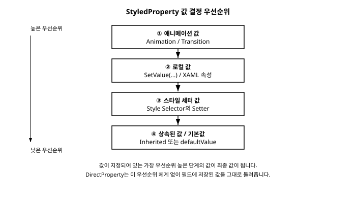

# 13장. 커스텀 컨트롤과 속성 시스템

[◀ 이전: 12장. 사용자 정의 컨트롤(UserControl)](ch12-사용자정의컨트롤.md) | [📖 목차](00-목차.md) | [다음: 14장. 리스트와 컬렉션 바인딩 ▶](ch14-리스트와컬렉션바인딩.md)


12장에서는 `UserControl`을 상속해 여러 컨트롤을 조합한 화면 조각을 재사용 가능한 컴포넌트로 만드는 방법을 살펴보았습니다. 라벨과 입력란을 묶은 간단한 컨트롤을 만들면서 `public string` 속성 몇 개를 평범한 C# 자동 속성으로 노출했을 것입니다. 이 방식은 컨트롤 내부에서 값을 읽고 쓰는 데는 아무 문제가 없지만, 정작 그 컨트롤을 XAML에서 사용하려는 순간 한계가 드러납니다. 다음과 같이 써보면 어떻게 될까요?

```xml
<local:LabeledTextBox Label="이름" Text="{Binding UserName}" />
```

만약 `Text`가 그냥 `public string Text { get; set; }`로 선언된 평범한 CLR 속성이라면, 이 바인딩은 애초에 성립하지 않습니다. Avalonia의 `{Binding}` 마크업 확장은 바인딩 대상 속성이 반드시 **AvaloniaProperty**여야 동작하기 때문입니다. 즉 우리가 지금까지 아무 문제 없이 써온 `Button.Content`, `TextBox.Text`, `Border.Background` 같은 속성들은 사실 전부 겉모습만 평범한 C# 속성이고, 그 안에는 Avalonia만의 별도 속성 시스템이 자리 잡고 있는 것입니다.

이번 장에서는 이 속성 시스템의 정체를 파헤치고, 12장에서 만든 것과 같은 사용자 정의 컨트롤의 속성을 실제로 바인딩 가능하고 스타일링 가능한 속성으로 다시 만들어 봅니다. 그 과정에서 `StyledProperty<T>`와 `DirectProperty<T>`라는 두 종류의 속성이 서로 어떻게 다르고 언제 무엇을 선택해야 하는지 정리하고, 마지막으로 11장에서 예고했던 `TemplatedControl`의 개념까지 이어서 살펴봅니다.

## 13.1 AvaloniaProperty란 무엇인가

Avalonia의 거의 모든 컨트롤은 `AvaloniaObject`라는 클래스를 최상위 조상으로 두고 있습니다. `AvaloniaObject`는 일반적인 C# 필드 대신 `GetValue(AvaloniaProperty)`와 `SetValue(AvaloniaProperty, value)`라는 메서드를 통해 속성 값을 저장하고 꺼내는 별도의 저장소를 내부에 가지고 있습니다. 우리가 평소에 `button.Background`처럼 평범하게 접근하는 속성들은, 실제로는 그 뒤에서 `GetValue(BackgroundProperty)`를 호출하는 얇은 CLR 래퍼일 뿐입니다.

왜 이렇게 번거로운 구조를 택했을까요? 일반 C# 자동 속성만으로는 다음과 같은 기능을 구현하기가 매우 까다롭기 때문입니다.

- **값의 출처를 여러 단계로 관리하기**: 로컬에서 직접 지정한 값, 스타일에서 지정한 값, 부모로부터 상속된 값, 기본값 중 어떤 것을 최종적으로 사용할지 우선순위를 정해야 합니다.
- **스타일링**: 10장에서 배운 `Style`의 `Setter`로 값을 지정하려면, 그 값을 "지정되어 있을 수도, 지정되어 있지 않을 수도 있는" 형태로 관리할 수 있어야 합니다.
- **애니메이션**: 값이 시간에 따라 부드럽게 바뀌려면 속성 시스템이 그 값의 변화를 직접 관장할 수 있어야 합니다.
- **변경 알림**: 값이 바뀔 때 자동으로 다시 그리거나 레이아웃을 다시 계산해야 하는데, 이를 매 속성마다 수동으로 챙기는 것은 비효율적입니다.
- **메모리 효율**: 컨트롤마다 수십 개의 속성이 있지만 대부분은 기본값 그대로 사용됩니다. 값이 실제로 지정된 속성만 저장 공간을 차지하게 만들면 메모리를 절약할 수 있습니다.

이 모든 것을 각 속성마다 직접 구현하는 대신, Avalonia는 `AvaloniaProperty`라는 공통 인프라를 한 번 만들어두고 모든 컨트롤이 이를 재사용하도록 설계했습니다. 그리고 이 인프라는 크게 두 가지 구체적인 형태로 나뉩니다. 바로 `StyledProperty<T>`와 `DirectProperty<T>`입니다.

## 13.2 StyledProperty\<T\>와 DirectProperty\<T\>의 차이

### StyledProperty\<T\> — 우선순위 시스템을 갖춘 값

`StyledProperty<T>`는 앞서 설명한 값 우선순위 시스템을 온전히 갖춘 속성입니다. 값은 실제 필드가 아니라 컨트롤 인스턴스별로 관리되는 값 저장소에 보관되며, 다음과 같은 순서로 최종 값이 결정됩니다(우선순위가 높은 것부터).

1. 실행 중인 애니메이션/트랜지션 값
2. `SetValue(...)`나 XAML 속성으로 직접 지정한 로컬 값
3. `Style`의 `Setter`로 지정된 값
4. 부모로부터 상속된 값(`inherits: true`로 등록한 경우)
5. 등록 시 지정한 기본값(`defaultValue`)

`Background`, `FontSize`, `IsVisible`처럼 스타일로 일괄 적용하고 싶은 대부분의 속성이 `StyledProperty<T>`로 만들어져 있는 이유가 바로 이것입니다.

### DirectProperty\<T\> — 필드 기반의 경량 속성

`DirectProperty<T>`는 접근 방식이 다릅니다. 값은 우선순위 시스템을 거치지 않고 컨트롤 인스턴스의 필드에 직접 저장됩니다. 대신 값이 바뀔 때 변경 알림(`PropertyChanged`)을 자동으로 발생시켜 준다는 점에서, 일반 CLR 속성보다는 한 단계 발전한 형태입니다. 다만 스타일의 `Setter`로 값을 지정할 수 없고 애니메이션의 대상도 될 수 없습니다.

`DirectProperty<T>`는 주로 다음과 같은 상황에 적합합니다.

- 값이 아주 자주 바뀌거나 계산 비용이 커서, 우선순위 시스템을 거치는 오버헤드를 피하고 싶은 경우
- 외부에서 임의로 값을 설정하기보다는, 컨트롤 내부 로직이 계산해서 노출하는 읽기 전용에 가까운 값인 경우
- 이미 존재하는 일반 CLR 속성을 최소한의 변경만으로 바인딩 가능하게 만들고 싶은 경우

두 속성의 차이를 표로 정리하면 다음과 같습니다.

| 구분 | StyledProperty\<T\> | DirectProperty\<T\> |
|---|---|---|
| 값 저장 방식 | 우선순위 기반 값 저장소 | 인스턴스 필드에 직접 저장 |
| 스타일 Setter로 지정 | 가능 | 불가능 |
| 애니메이션 대상 | 가능 | 불가능 |
| 상속(`inherits`) | 가능 | 불가능 |
| 변경 알림 | 가능 | 가능 |
| 바인딩 대상/소스 | 모두 가능 | 모두 가능 |
| 주 사용처 | 사용자가 자유롭게 꾸밀 수 있어야 하는 속성 | 계산된 값, 성능이 중요한 값 |

두 속성 모두 바인딩의 대상(target)과 소스(source)로 사용할 수 있다는 점은 같습니다. 차이는 어디까지나 "스타일 시스템과 얼마나 깊이 통합되어 있는가"에 있습니다. 실무에서는 컨트롤을 사용하는 쪽에서 값을 자유롭게 지정하고 테마별로 다르게 꾸밀 수 있어야 하는 속성이라면 `StyledProperty<T>`를, 컨트롤 내부에서 계산해 외부에는 결과만 읽기 전용으로 보여주고 싶은 속성이라면 `DirectProperty<T>`를 선택한다고 기억해두면 충분합니다.



## 13.3 LabeledTextBox를 StyledProperty로 다시 만들기

이제 앞서 문제로 지적한 컨트롤을 실제로 고쳐봅시다. 12장에서 만들었던 것과 같은 형태의, 라벨과 텍스트 입력란을 묶은 `LabeledTextBox`를 예로 듭니다. 일반 CLR 속성으로 만들었던 버전은 대략 다음과 같은 모습이었을 것입니다.

```csharp
// 12장 방식: 평범한 CLR 속성
public partial class LabeledTextBox : UserControl
{
    public string Label { get; set; } = string.Empty;
    public string Text { get; set; } = string.Empty;

    public LabeledTextBox()
    {
        InitializeComponent();
    }
}
```

이 코드는 컴파일도 되고, XAML에서 `<local:LabeledTextBox Label="이름"/>`처럼 리터럴 값을 지정하는 정도는 문제없이 동작합니다. 하지만 `Text="{Binding UserName}"`처럼 바인딩을 걸려는 순간 Avalonia 컴파일러는 `Text`를 바인딩 대상으로 삼을 수 없다고 판단합니다. `Text`가 `AvaloniaProperty`가 아니기 때문입니다.

`StyledProperty<T>`를 사용해 이 컨트롤을 다시 작성해봅시다. 핵심은 `AvaloniaProperty.Register<TOwner, TValue>` 정적 메서드로 속성을 등록하고, 실제 값 접근은 `GetValue`/`SetValue`에 위임하는 얇은 CLR 속성을 함께 선언하는 것입니다.

```csharp
using Avalonia;
using Avalonia.Controls;

namespace AvaloniaGuide.Controls;

public class LabeledTextBox : UserControl
{
    public static readonly StyledProperty<string> LabelProperty =
        AvaloniaProperty.Register<LabeledTextBox, string>(
            nameof(Label),
            defaultValue: string.Empty);

    public static readonly StyledProperty<string> TextProperty =
        AvaloniaProperty.Register<LabeledTextBox, string>(
            nameof(Text),
            defaultValue: string.Empty,
            defaultBindingMode: Avalonia.Data.BindingMode.TwoWay);

    public string Label
    {
        get => GetValue(LabelProperty);
        set => SetValue(LabelProperty, value);
    }

    public string Text
    {
        get => GetValue(TextProperty);
        set => SetValue(TextProperty, value);
    }

    public LabeledTextBox()
    {
        InitializeComponent();
    }
}
```

`AvaloniaProperty.Register<TOwner, TValue>`의 첫 번째 형식 인자 `TOwner`는 "이 속성을 소유하는 컨트롤이 무엇인지", 두 번째 형식 인자 `TValue`는 "값의 형식이 무엇인지"를 각각 나타냅니다. `nameof(Text)`로 속성 이름을 전달하는 이유는, 나중에 디버깅이나 애니메이션, 스타일 셀렉터에서 이 이름으로 속성을 식별하기 때문입니다. `TextProperty`에는 `defaultBindingMode: BindingMode.TwoWay`를 지정해, 이 속성을 별도로 `Mode=TwoWay`를 적지 않아도 양방향 바인딩이 기본으로 동작하도록 만들었습니다. `TextBox.Text`가 별도의 `Mode` 지정 없이도 양방향으로 잘 동작하는 것과 같은 원리입니다.

`static readonly` 필드로 선언된 `LabelProperty`, `TextProperty`는 컨트롤 인스턴스마다 새로 만들어지는 것이 아니라 `LabeledTextBox` 클래스 전체에서 단 하나만 존재합니다. 실제 값은 인스턴스별로 내부 저장소에 보관되고, `GetValue`/`SetValue`를 호출할 때 "어떤 속성을 다루고 싶은지"를 가리키는 키 역할만 이 정적 필드가 담당하는 것입니다.

내부 XAML에서 이 속성들을 화면에 반영할 때는, `UserControl` 자신도 하나의 `AvaloniaObject`이므로 이름을 붙여 요소 바인딩(`ElementName` 바인딩)으로 참조할 수 있습니다.

```xml
<UserControl xmlns="https://github.com/avaloniaui"
             xmlns:x="http://schemas.microsoft.com/winfx/2006/xaml"
             x:Class="AvaloniaGuide.Controls.LabeledTextBox"
             x:Name="Root">
    <StackPanel Orientation="Horizontal" Spacing="8">
        <TextBlock Text="{Binding Label, ElementName=Root}"
                   VerticalAlignment="Center"
                   Width="60"/>
        <TextBox Text="{Binding Text, ElementName=Root, Mode=TwoWay}"
                 Width="200"/>
    </StackPanel>
</UserControl>
```

`UserControl`의 자식 요소들은 기본적으로 부모의 `DataContext`를 그대로 물려받습니다. 그런데 내부의 `TextBlock`이나 `TextBox`가 참조해야 할 값은 `DataContext`가 아니라 `LabeledTextBox` 컨트롤 자신의 `Label`, `Text` 속성입니다. 그래서 `DataContext`를 거치는 `{Binding}` 대신 `x:Name="Root"`로 컨트롤 자신에 이름을 붙이고 `ElementName=Root`로 명시적으로 지목한 것입니다.

이렇게 고쳐두면 이제 이 컨트롤을 사용하는 쪽에서 다음과 같이 자유롭게 바인딩을 걸 수 있습니다.

```xml
<local:LabeledTextBox Label="이름" Text="{Binding UserName, Mode=TwoWay}" />
```

`UserName`이 ViewModel에서 바뀌면 `TextBox`에 반영되고, 사용자가 `TextBox`에 입력하면 `UserName`에도 그대로 반영됩니다. `Text`가 진짜 `AvaloniaProperty`가 되었기 때문에 가능해진 일입니다.

## 13.4 속성 변경에 반응하기: 값이 바뀔 때 추가 동작 실행하기

`StyledProperty<T>`는 값이 바뀌는 시점을 감지해 추가 동작을 실행할 수 있는 두 가지 방법을 제공합니다. 예제로, `LabeledTextBox`에 `MaxLength` 속성을 추가하고 `Text`가 바뀔 때마다 글자 수를 표시하는 기능을 붙여보겠습니다.

### 방법 1: 컨트롤 안에서 OnPropertyChanged 오버라이드하기

`AvaloniaObject`는 `OnPropertyChanged`라는 가상 메서드를 제공합니다. 어떤 `AvaloniaProperty`든 값이 바뀔 때마다 이 메서드가 호출되므로, 바뀐 속성이 무엇인지 확인해 원하는 처리를 추가할 수 있습니다.

```csharp
public class LabeledTextBox : UserControl
{
    public static readonly StyledProperty<string> TextProperty =
        AvaloniaProperty.Register<LabeledTextBox, string>(nameof(Text), string.Empty);

    public static readonly StyledProperty<int> MaxLengthProperty =
        AvaloniaProperty.Register<LabeledTextBox, int>(nameof(MaxLength), 20);

    public static readonly StyledProperty<string> CountTextProperty =
        AvaloniaProperty.Register<LabeledTextBox, string>(nameof(CountText), "0 / 20");

    public string Text
    {
        get => GetValue(TextProperty);
        set => SetValue(TextProperty, value);
    }

    public int MaxLength
    {
        get => GetValue(MaxLengthProperty);
        set => SetValue(MaxLengthProperty, value);
    }

    public string CountText
    {
        get => GetValue(CountTextProperty);
        private set => SetValue(CountTextProperty, value);
    }

    protected override void OnPropertyChanged(AvaloniaPropertyChangedEventArgs change)
    {
        base.OnPropertyChanged(change);

        if (change.Property == TextProperty || change.Property == MaxLengthProperty)
        {
            CountText = $"{Text.Length} / {MaxLength}";
        }
    }

    public LabeledTextBox()
    {
        InitializeComponent();
    }
}
```

`change.Property`로 어떤 속성이 바뀌었는지 확인하고, `change.GetNewValue<T>()` / `change.GetOldValue<T>()`로 바뀌기 전후의 값을 꺼내올 수도 있습니다. `Text`나 `MaxLength` 중 어느 쪽이 바뀌어도 글자 수 표시를 다시 계산하도록 두 속성을 함께 검사한 점에 주목하세요.

### 방법 2: 정적 생성자에서 Changed 이벤트 구독하기

두 번째 방법은 인스턴스 메서드를 오버라이드하는 대신, 속성 자체가 제공하는 `Changed`라는 정적 옵저버블을 정적 생성자에서 구독하는 것입니다. 컨트롤 계층 구조가 깊어져서 상속받은 자식 클래스에서까지 일관되게 반응하고 싶을 때 유용한 패턴입니다.

```csharp
public class LabeledTextBox : UserControl
{
    public static readonly StyledProperty<string> TextProperty =
        AvaloniaProperty.Register<LabeledTextBox, string>(nameof(Text), string.Empty);

    static LabeledTextBox()
    {
        TextProperty.Changed.AddClassHandler<LabeledTextBox>((control, e) => control.OnTextChanged(e));
    }

    private void OnTextChanged(AvaloniaPropertyChangedEventArgs e)
    {
        var newText = e.GetNewValue<string>();
        // 예: 입력값이 바뀔 때마다 유효성 검사를 다시 실행
        Classes.Set("invalid", newText.Length > MaxLength);
    }

    // Label, MaxLength 등 나머지 속성은 앞서와 동일

    public string Text
    {
        get => GetValue(TextProperty);
        set => SetValue(TextProperty, value);
    }

    public int MaxLength { get; set; } = 20;

    public LabeledTextBox()
    {
        InitializeComponent();
    }
}
```

`AddClassHandler<TTarget>`은 "이 속성을 가진 모든 `TTarget` 인스턴스에 대해 이 핸들러를 실행하라"는 뜻입니다. 정적 생성자는 클래스당 단 한 번만 실행되므로, 인스턴스가 몇 개 생성되든 구독은 한 번만 이루어지고 이후로는 해당 형식의 어떤 인스턴스에서 속성이 바뀌든 핸들러가 호출됩니다. `Classes.Set("invalid", ...)`는 10장에서 다룬 스타일 클래스를 코드에서 동적으로 켜고 끄는 방법으로, 유효하지 않은 입력일 때 `:invalid`에 준하는 스타일 클래스를 적용해 시각적으로 표시하는 데 사용할 수 있습니다.

두 방법 중 어느 쪽을 선택할지는 취향과 상황에 따라 다릅니다. 지금 만들고 있는 컨트롤 하나에서만 필요한 반응이라면 `OnPropertyChanged` 오버라이드가 더 직관적이고, 여러 속성에 대해 재사용 가능한 로직을 캡슐화하고 싶다면 `Changed.AddClassHandler`가 더 깔끔한 경우가 많습니다.

### DirectProperty의 변경 알림: SetAndRaise

`DirectProperty<T>`는 값을 필드에 직접 저장하는 대신, 변경 알림을 챙겨주는 `SetAndRaise` 헬퍼 메서드를 함께 제공합니다. 컨트롤 내부에서 계산해 읽기 전용으로 노출하고 싶은 값에 적합합니다. 예를 들어 `LabeledTextBox`가 내부적으로 글자 수를 셀 때, 외부에서 직접 설정할 수 없는 계산된 값으로 만들고 싶다면 다음과 같이 작성합니다.

```csharp
public class LabeledTextBox : UserControl
{
    public static readonly DirectProperty<LabeledTextBox, int> CharacterCountProperty =
        AvaloniaProperty.RegisterDirect<LabeledTextBox, int>(
            nameof(CharacterCount),
            owner => owner.CharacterCount);

    private int _characterCount;

    public int CharacterCount
    {
        get => _characterCount;
        private set => SetAndRaise(CharacterCountProperty, ref _characterCount, value);
    }

    protected override void OnPropertyChanged(AvaloniaPropertyChangedEventArgs change)
    {
        base.OnPropertyChanged(change);

        if (change.Property == TextProperty)
        {
            CharacterCount = Text.Length;
        }
    }

    // Text, TextProperty 등은 앞서와 동일
}
```

`RegisterDirect`에는 값을 어떻게 읽어올지 알려주는 getter 델리게이트(`owner => owner.CharacterCount`)를 전달합니다. setter 델리게이트를 생략했으므로 이 속성은 외부에서 `SetValue`로 값을 바꿀 수 없는, 사실상 읽기 전용 속성이 됩니다. 값이 바뀔 때는 `SetAndRaise`가 필드에 새 값을 대입하는 동시에 필요한 변경 알림까지 함께 처리해줍니다.

## 13.5 한 걸음 더: TemplatedControl로 넘어가기

지금까지 만든 `LabeledTextBox`는 여전히 `UserControl`입니다. 즉 내부 비주얼 구조(`StackPanel`과 그 안의 `TextBlock`, `TextBox`)가 XAML 파일 안에 고정되어 있습니다. 컨트롤을 사용하는 쪽에서 `Label`, `Text` 같은 속성값은 자유롭게 바꿀 수 있지만, "라벨을 텍스트 위쪽에 배치하고 싶다"거나 "테두리 스타일을 완전히 다르게 하고 싶다" 같은 요구에는 대응할 수 없습니다. 그러려면 컨트롤을 사용하는 쪽에서 내부 XAML 파일 자체를 수정해야 하는데, 이는 재사용성을 크게 떨어뜨립니다.

11장에서 `Button`, `CheckBox` 같은 내장 컨트롤은 동작 로직과 겉모습(`ControlTemplate`)이 분리되어 있어서, `ControlTemplate`을 통째로 갈아 끼워 겉모습을 마음대로 바꿀 수 있다고 배웠습니다. 이런 컨트롤들은 `UserControl`이 아니라 `TemplatedControl`을 상속해서 만들어집니다. `TemplatedControl`을 직접 상속해 나만의 완전한 커스텀 컨트롤을 만드는 절차를 개념적으로 살펴보겠습니다.

`TemplatedControl`을 상속하는 컨트롤은 XAML 코드비하인드 파일(`.axaml`) 없이 순수한 C# 클래스로만 정의하고, 실제 겉모습은 테마 리소스에 `ControlTemplate` 형태로 별도로 정의합니다.

```csharp
using Avalonia;
using Avalonia.Controls;
using Avalonia.Controls.Primitives;

namespace AvaloniaGuide.Controls;

[TemplatePart("PART_IncreaseButton", typeof(Button))]
[TemplatePart("PART_DecreaseButton", typeof(Button))]
public class NumericStepper : TemplatedControl
{
    public static readonly StyledProperty<int> ValueProperty =
        AvaloniaProperty.Register<NumericStepper, int>(nameof(Value), defaultValue: 0);

    public int Value
    {
        get => GetValue(ValueProperty);
        set => SetValue(ValueProperty, value);
    }

    private Button? _increaseButton;
    private Button? _decreaseButton;

    protected override void OnApplyTemplate(TemplateAppliedEventArgs e)
    {
        base.OnApplyTemplate(e);

        if (_increaseButton != null)
            _increaseButton.Click -= OnIncreaseClick;
        if (_decreaseButton != null)
            _decreaseButton.Click -= OnDecreaseClick;

        _increaseButton = e.NameScope.Find<Button>("PART_IncreaseButton");
        _decreaseButton = e.NameScope.Find<Button>("PART_DecreaseButton");

        if (_increaseButton != null)
            _increaseButton.Click += OnIncreaseClick;
        if (_decreaseButton != null)
            _decreaseButton.Click += OnDecreaseClick;
    }

    private void OnIncreaseClick(object? sender, Avalonia.Interactivity.RoutedEventArgs e) => Value++;
    private void OnDecreaseClick(object? sender, Avalonia.Interactivity.RoutedEventArgs e) => Value--;
}
```

몇 가지 새로운 요소를 짚어보겠습니다.

- `[TemplatePart("PART_IncreaseButton", typeof(Button))]`: 이 컨트롤의 `ControlTemplate`이 반드시 `PART_IncreaseButton`이라는 이름의 `Button`을 포함해야 한다는 것을 문서화하는 특성입니다. 실제로 강제하지는 않지만, 이 컨트롤을 테마로 꾸미려는 사람에게 어떤 이름의 요소를 준비해야 하는지 알려주는 계약 역할을 합니다.
- `OnApplyTemplate(TemplateAppliedEventArgs e)`: `ControlTemplate`이 실제로 비주얼 트리에 적용된 직후 호출되는 메서드입니다. 11장에서 배운 `Name="PART_Border"` 같은 이름 붙은 요소를, `e.NameScope.Find<T>("이름")`으로 찾아와 이벤트를 연결하는 것이 이 메서드의 전형적인 역할입니다. 컨트롤 자신은 템플릿이 어떻게 그려질지 전혀 모르고, 오직 "이런 이름의 요소가 있다면 이렇게 동작을 연결하겠다"는 계약만 알고 있습니다.
- `ControlTemplate` 자체는 10장, 11장에서 배운 것과 동일한 방식으로, 테마 리소스나 `Style`의 `Setter`로 나중에 지정합니다. `TargetType="local:NumericStepper"`로 지정한 `ControlTemplate` 안에 `PART_IncreaseButton`, `PART_DecreaseButton`이라는 이름의 `Button`을 배치하고 `TemplateBinding`으로 필요한 속성을 연결하면 됩니다.

`UserControl`과 비교했을 때 `TemplatedControl`은 준비할 것이 확실히 더 많습니다. 하지만 그 대가로 얻는 유연성도 큽니다. 같은 `NumericStepper`라도 프로젝트마다, 혹은 다크 모드와 라이트 모드마다 완전히 다른 `ControlTemplate`을 적용해 겉모습을 자유롭게 바꿀 수 있습니다. 로직(값을 증가/감소시키는 동작)과 겉모습(버튼이 어디에 어떤 모양으로 배치되는지)이 완전히 분리되어 있기 때문입니다. 일반적인 화면 조각을 재사용할 때는 지금까지처럼 `UserControl`로 충분하고, 여러 프로젝트에 걸쳐 재사용하거나 테마에 따라 모양이 크게 달라져야 하는 범용 컨트롤 라이브러리를 만들 때 `TemplatedControl`을 고려하면 됩니다.

## 요약

- Avalonia의 속성은 대부분 `AvaloniaObject`가 제공하는 `GetValue`/`SetValue` 기반의 `AvaloniaProperty`로 구현되어 있으며, 일반 CLR 속성은 `{Binding}`의 대상이 될 수 없습니다.
- `StyledProperty<T>`는 로컬 값, 스타일 세터, 상속된 값, 기본값 사이의 우선순위 체계를 가지며 스타일링과 애니메이션의 대상이 될 수 있습니다. `AvaloniaProperty.Register<TOwner, TValue>`로 등록합니다.
- `DirectProperty<T>`는 값을 필드에 직접 저장하고 `SetAndRaise`로 변경 알림을 처리하는, 계산된 값이나 읽기 전용 값에 적합한 경량 속성입니다. `AvaloniaProperty.RegisterDirect<TOwner, TValue>`로 등록합니다.
- 속성 변경에 반응하려면 `OnPropertyChanged`를 오버라이드하거나, 정적 생성자에서 `프로퍼티.Changed.AddClassHandler<T>(...)`를 구독합니다.
- `TemplatedControl`은 동작 로직과 겉모습(`ControlTemplate`)을 완전히 분리한 컨트롤로, `[TemplatePart]`로 필요한 템플릿 요소를 문서화하고 `OnApplyTemplate`에서 `NameScope.Find<T>`로 그 요소를 찾아 연결합니다.

## 연습문제

1. 일반 CLR 속성으로 정의된 컨트롤 속성이 `{Binding}`의 대상이 될 수 없는 이유를 자신의 말로 설명해보세요.
2. `StyledProperty<T>`와 `DirectProperty<T>`의 차이를 값 저장 방식, 스타일링 가능 여부, 사용 예시를 들어 비교해보세요.
3. 이번 장의 `LabeledTextBox`에 `Watermark`라는 `StyledProperty<string>`을 새로 추가하고, 내부 `TextBox`의 `Watermark` 속성과 연결해보세요.
4. `MaxLength`를 초과하는 텍스트가 입력되었을 때 `Text`를 자동으로 잘라내도록, `OnPropertyChanged`를 이용해 동작을 구현해보세요.
5. `NumericStepper` 예제에 `Minimum`, `Maximum`이라는 `StyledProperty<int>` 두 개를 추가하고, `Value`가 그 범위를 벗어나지 않도록 값 변경 시점에 보정하는 방법을 구상해보세요.

---

[◀ 이전: 12장. 사용자 정의 컨트롤(UserControl)](ch12-사용자정의컨트롤.md) | [📖 목차](00-목차.md) | [다음: 14장. 리스트와 컬렉션 바인딩 ▶](ch14-리스트와컬렉션바인딩.md)
