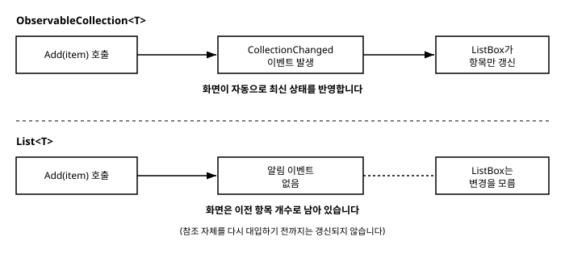

# 14장. 리스트와 컬렉션 바인딩

[◀ 이전: 13장. 커스텀 컨트롤과 속성 시스템](ch13-커스텀컨트롤과속성시스템.md) | [📖 목차](00-목차.md) | [다음: 15장. 네비게이션과 다이얼로그 ▶](ch15-네비게이션과다이얼로그.md)


지금까지 다룬 바인딩은 대부분 문자열 하나, 숫자 하나, 불리언 하나처럼 값 하나를 화면의 속성 하나에 연결하는 경우였습니다. 하지만 실제 애플리케이션 화면의 상당 부분은 "여러 개의 항목을 나열해서 보여주는" 형태를 띱니다. 연락처 목록, 주문 내역, 채팅 메시지, 할 일 목록 — 모두 컬렉션을 화면에 그리는 문제입니다.

5장에서는 `ListBox`에 문자열 몇 개를 나열해보았고, 11장에서는 `ItemTemplate`으로 컬렉션의 각 항목을 원하는 모양으로 그리는 방법을 맛보았습니다. 이번 장에서는 이 내용을 한데 모아, 컬렉션을 화면에 바인딩하는 전체 그림을 완성합니다. 특히 `List<T>`가 아니라 `ObservableCollection<T>`을 써야 하는 이유, 선택된 항목을 다루는 방법을 자세히 살펴본 뒤, 9장에서 배운 커맨드까지 결합한 할 일 목록(Todo List) 예제로 마무리합니다.

## 14.1 ItemsControl과 ItemsSource

`ItemsControl`은 여러 항목을 나열해서 보여주는 모든 컨트롤의 기반이 되는 클래스입니다. `ListBox`, `ComboBox` 등은 모두 `ItemsControl`을 상속하며, 선택(selection) 기능이 추가된 형태라고 볼 수 있습니다. 컬렉션을 화면에 연결하는 가장 기본적인 방법은 `ItemsSource` 속성에 바인딩하는 것입니다.

```csharp
public class MainViewModel
{
    public List<string> Fruits { get; } = new()
    {
        "사과", "바나나", "체리"
    };
}
```

```xml
<ItemsControl ItemsSource="{Binding Fruits}" />
```

`ItemTemplate`을 별도로 지정하지 않으면 `ItemsControl`은 각 항목의 `ToString()` 결과를 `TextBlock`으로 그려 세로로 나열합니다. 문자열의 경우 `ToString()`이 자기 자신을 그대로 반환하므로 위 예제는 "사과", "바나나", "체리"가 세 줄로 나열된 화면을 보여줍니다.

같은 컬렉션을 `ListBox`에 연결하면 선택 기능이 추가된 목록을 얻을 수 있습니다.

```xml
<ListBox ItemsSource="{Binding Fruits}" />
```

`ItemsSource`는 `IEnumerable`을 구현하는 어떤 형식이든 받아들일 수 있습니다. `List<T>`, 배열, `IEnumerable<T>`를 반환하는 LINQ 쿼리 결과 등 무엇이든 화면에 나열할 수 있습니다. 문제는 "그 이후"입니다.

## 14.2 List\<T\>로는 부족한 이유: ObservableCollection\<T\>

다음과 같이 버튼을 눌렀을 때 `Fruits`에 새 항목을 추가하는 코드를 작성했다고 합시다.

```csharp
private void AddFruit()
{
    Fruits.Add("포도");
}
```

이 코드를 실행해도 화면의 `ListBox`에는 아무 변화가 없습니다. 이유는 간단합니다. `List<T>`는 항목이 추가되거나 삭제되었다는 사실을 아무에게도 알리지 않기 때문입니다. `ItemsSource` 바인딩은 `Fruits`라는 속성 자체가 다른 리스트로 통째로 교체될 때는 감지할 수 있지만(`INotifyPropertyChanged`를 통해), 이미 연결되어 있는 리스트의 내부 항목이 늘거나 줄어드는 것은 감지할 방법이 없습니다.

이 문제를 해결하는 것이 `System.Collections.ObjectModel` 네임스페이스의 `ObservableCollection<T>`입니다. `ObservableCollection<T>`는 `List<T>`와 거의 같은 방식으로 사용할 수 있지만, 내부적으로 `INotifyCollectionChanged` 인터페이스를 구현하고 있어서 항목이 추가되거나(`Add`), 삭제되거나(`Remove`), 전체가 비워질 때(`Clear`)마다 `CollectionChanged` 이벤트를 발생시킵니다. `ItemsControl`과 `ListBox`는 이 이벤트를 자동으로 구독하고 있다가, 이벤트가 발생하면 화면 전체를 다시 그리는 대신 바뀐 항목만 정확히 추가하거나 제거합니다. 그래서 항목이 수천 개인 목록에서도 항목 하나를 추가하는 비용은 여전히 가볍습니다.

`Fruits`를 `ObservableCollection<T>`로 바꾸면 문제가 해결됩니다.

```csharp
using System.Collections.ObjectModel;

public class MainViewModel
{
    public ObservableCollection<string> Fruits { get; } = new()
    {
        "사과", "바나나", "체리"
    };

    public void AddFruit()
    {
        Fruits.Add("포도"); // 화면에 즉시 "포도" 항목이 추가된다
    }
}
```

XAML은 전혀 바뀌지 않았다는 점에 주목하세요. `ItemsSource="{Binding Fruits}"`는 그대로입니다. 달라진 것은 오직 ViewModel에서 사용하는 컬렉션 형식뿐입니다. 여기서 `Fruits` 속성 자체는 `get`만 있는 읽기 전용 속성이라는 점도 눈여겨볼 만합니다. 컬렉션 참조 자체는 프로그램이 실행되는 동안 바뀌지 않고, 그 안의 내용물만 바뀌기 때문에 `INotifyPropertyChanged`를 통한 속성 변경 알림은 필요하지 않습니다(다만 컬렉션 참조 자체를 통째로 교체하는 상황이 있다면 그 속성에도 `INotifyPropertyChanged`를 구현해야 합니다).



정리하면 원칙은 단순합니다. **화면에 바인딩되어 있고 실행 중에 항목이 추가되거나 삭제될 수 있는 컬렉션은 항상 `ObservableCollection<T>`로 선언한다.** 반대로 한 번 채워지면 그 이후로 항목 구성이 절대 바뀌지 않는 컬렉션(예: 고정된 콤보박스 옵션 목록)이라면 `List<T>`를 써도 무방합니다.

## 14.3 ItemTemplate으로 항목 표시 커스터마이징

문자열이 아니라 커스텀 클래스의 컬렉션을 보여주고 싶다면 11장에서 배운 `ItemTemplate`을 사용합니다. 사람 목록을 예로 들어보겠습니다.

```csharp
public class Person
{
    public string Name { get; set; } = string.Empty;
    public int Age { get; set; }
}
```

```xml
<ListBox ItemsSource="{Binding People}">
    <ListBox.ItemTemplate>
        <DataTemplate x:DataType="vm:Person">
            <StackPanel Orientation="Horizontal" Spacing="8" Margin="4">
                <TextBlock Text="{Binding Name}" FontWeight="Bold" Width="100"/>
                <TextBlock Text="{Binding Age, StringFormat='{}{0}세'}" Foreground="Gray"/>
            </StackPanel>
        </DataTemplate>
    </ListBox.ItemTemplate>
</ListBox>
```

`ItemTemplate` 안에서의 `{Binding}`은 목록 전체의 `DataContext`가 아니라 **그 항목 하나**, 즉 `Person` 인스턴스 하나를 가리킵니다. 7장에서 살펴본 대로 `DataContext`는 트리를 따라 아래로 상속되는데, `ListBox`는 각 항목을 그릴 때마다 그 항목 전용의 `DataContext`를 자식 요소에 새로 지정해줍니다. 그래서 `ItemTemplate` 내부에서는 `{Binding Name}`이 곧 "지금 그리고 있는 이 `Person`의 `Name`"이 되는 것입니다. `x:DataType="vm:Person"`을 지정해두면 컴파일된 바인딩의 이점(오타를 빌드 시점에 발견, 더 나은 성능)도 함께 얻을 수 있습니다.

## 14.4 선택된 항목 다루기: SelectedItem과 SelectedIndex

`ListBox`처럼 선택 기능을 갖춘 컨트롤은 지금 어떤 항목이 선택되어 있는지를 `SelectedItem`(선택된 객체 자체)과 `SelectedIndex`(선택된 항목의 순서, 없으면 -1)라는 두 속성으로 노출합니다. 두 속성 모두 바인딩할 수 있고, ViewModel에서 값을 바꾸면 화면의 선택 상태도 함께 바뀌는 양방향 동작을 지원합니다.

```xml
<ListBox ItemsSource="{Binding People}"
         SelectedItem="{Binding SelectedPerson, Mode=TwoWay}"
         ItemTemplate="{StaticResource PersonItemTemplate}"/>

<TextBlock Text="{Binding SelectedPerson.Name, StringFormat='선택된 사람: {0}'}"/>
```

```csharp
public class MainViewModel : INotifyPropertyChanged
{
    private Person? _selectedPerson;

    public ObservableCollection<Person> People { get; } = new()
    {
        new Person { Name = "김민준", Age = 28 },
        new Person { Name = "이서연", Age = 34 },
    };

    public Person? SelectedPerson
    {
        get => _selectedPerson;
        set
        {
            if (_selectedPerson == value)
                return;

            _selectedPerson = value;
            OnPropertyChanged();
        }
    }

    public event PropertyChangedEventHandler? PropertyChanged;
    protected void OnPropertyChanged([CallerMemberName] string? propertyName = null)
        => PropertyChanged?.Invoke(this, new PropertyChangedEventArgs(propertyName));
}
```

사용자가 목록에서 항목을 클릭하면 `SelectedItem`을 통해 `SelectedPerson`이 자동으로 갱신되고, 반대로 코드에서 `SelectedPerson`에 값을 대입하면 목록의 선택 상태도 그에 맞춰 바뀝니다. 특정 순서의 항목을 다루고 싶다면 `SelectedIndex`를 사용하면 됩니다.

```xml
<ListBox ItemsSource="{Binding People}"
         SelectedIndex="{Binding SelectedIndex, Mode=TwoWay}"/>
```

여러 항목을 동시에 선택해야 한다면 `SelectionMode="Multiple"`을 지정하고, 선택된 항목 전체는 `SelectedItems` 속성(`IList`)으로 접근할 수 있습니다. 다만 이 장에서 만들 예제처럼 단일 선택이나 선택 자체를 사용하지 않는 목록에서는 `SelectedItem`, `SelectedIndex`를 굳이 사용하지 않아도 됩니다.

## 14.5 실전 예제: 할 일 목록(Todo List)

지금까지 배운 내용 — `ObservableCollection<T>`, `ItemTemplate`, 그리고 9장에서 만든 `RelayCommand` — 을 모두 합쳐 할 일 목록 애플리케이션을 만들어보겠습니다.

### 모델: TodoItem

각 할 일은 제목(`Title`)과 완료 여부(`IsDone`)를 가집니다. `IsDone`은 화면의 체크박스와 양방향으로 바인딩되어야 하므로, 값이 바뀔 때 변경 알림을 발생시키도록 `INotifyPropertyChanged`를 구현합니다.

```csharp
using System.ComponentModel;
using System.Runtime.CompilerServices;

namespace AvaloniaGuide.Models;

public class TodoItem : INotifyPropertyChanged
{
    private bool _isDone;

    public string Title { get; }

    public TodoItem(string title)
    {
        Title = title;
    }

    public bool IsDone
    {
        get => _isDone;
        set
        {
            if (_isDone == value)
                return;

            _isDone = value;
            OnPropertyChanged();
        }
    }

    public event PropertyChangedEventHandler? PropertyChanged;

    protected void OnPropertyChanged([CallerMemberName] string? propertyName = null)
        => PropertyChanged?.Invoke(this, new PropertyChangedEventArgs(propertyName));
}
```

### ViewModel: TodoListViewModel

ViewModel은 할 일 목록(`ObservableCollection<TodoItem>`), 새 항목을 입력받을 문자열 속성, 그리고 추가/삭제를 담당하는 두 개의 커맨드로 구성됩니다. 삭제 커맨드는 "어떤 항목을 삭제할지" 알아야 하므로, 9장에서 예고했던 것처럼 `CommandParameter`로 대상 `TodoItem`을 전달받는 형태로 만듭니다.

```csharp
using System.Collections.ObjectModel;
using System.ComponentModel;
using System.Runtime.CompilerServices;
using AvaloniaGuide.Models;

namespace AvaloniaGuide.ViewModels;

public class TodoListViewModel : INotifyPropertyChanged
{
    public ObservableCollection<TodoItem> Todos { get; } = new();

    private string _newTodoTitle = string.Empty;

    public string NewTodoTitle
    {
        get => _newTodoTitle;
        set
        {
            if (_newTodoTitle == value)
                return;

            _newTodoTitle = value;
            OnPropertyChanged();
            AddCommand.RaiseCanExecuteChanged();
        }
    }

    public RelayCommand AddCommand { get; }
    public RelayCommand DeleteCommand { get; }

    public TodoListViewModel()
    {
        AddCommand = new RelayCommand(
            execute: AddTodo,
            canExecute: () => !string.IsNullOrWhiteSpace(NewTodoTitle));

        DeleteCommand = new RelayCommand(
            execute: parameter =>
            {
                if (parameter is TodoItem todo)
                    Todos.Remove(todo);
            });

        Todos.Add(new TodoItem("Avalonia 13장 읽기"));
        Todos.Add(new TodoItem("커스텀 컨트롤 실습하기"));
    }

    private void AddTodo()
    {
        Todos.Add(new TodoItem(NewTodoTitle));
        NewTodoTitle = string.Empty;
    }

    public event PropertyChangedEventHandler? PropertyChanged;

    protected void OnPropertyChanged([CallerMemberName] string? propertyName = null)
        => PropertyChanged?.Invoke(this, new PropertyChangedEventArgs(propertyName));
}
```

9장에서 만든 `RelayCommand`는 매개변수를 받는 `Action<object?>` 생성자와, 매개변수가 필요 없는 `Action` 생성자를 모두 지원했습니다. `AddCommand`는 매개변수가 필요 없으므로 `Action` 형태로, `DeleteCommand`는 삭제할 대상을 `CommandParameter`로 받아야 하므로 `Action<object?>` 형태로 사용했습니다.

### View: TodoListView

마지막으로 화면을 구성합니다. 위쪽에는 새 할 일을 입력하는 `TextBox`와 추가 버튼을, 아래쪽에는 `ListBox`로 목록 전체를 표시합니다.

```xml
<UserControl xmlns="https://github.com/avaloniaui"
             xmlns:x="http://schemas.microsoft.com/winfx/2006/xaml"
             xmlns:vm="using:AvaloniaGuide.ViewModels"
             xmlns:models="using:AvaloniaGuide.Models"
             x:Class="AvaloniaGuide.Views.TodoListView"
             x:DataType="vm:TodoListViewModel"
             x:Name="Root">
    <DockPanel Margin="16">
        <StackPanel DockPanel.Dock="Top"
                    Orientation="Horizontal"
                    Spacing="8"
                    Margin="0,0,0,12">
            <TextBox Text="{Binding NewTodoTitle}"
                     Width="240"
                     Watermark="할 일을 입력하세요"/>
            <Button Content="추가" Command="{Binding AddCommand}"/>
        </StackPanel>

        <ListBox ItemsSource="{Binding Todos}">
            <ListBox.ItemTemplate>
                <DataTemplate x:DataType="models:TodoItem">
                    <Grid ColumnDefinitions="Auto,*,Auto" Margin="0,4">
                        <CheckBox Grid.Column="0" IsChecked="{Binding IsDone}"/>
                        <TextBlock Grid.Column="1"
                                   Text="{Binding Title}"
                                   VerticalAlignment="Center"
                                   Margin="8,0"/>
                        <Button Grid.Column="2"
                                Content="삭제"
                                Command="{Binding #Root.DataContext.DeleteCommand}"
                                CommandParameter="{Binding}"/>
                    </Grid>
                </DataTemplate>
            </ListBox.ItemTemplate>
        </ListBox>
    </DockPanel>
</UserControl>
```

여기서 눈여겨볼 부분은 삭제 `Button`의 `Command` 바인딩입니다. `ItemTemplate` 내부의 `DataContext`는 앞서 설명한 대로 목록 전체의 ViewModel이 아니라 그 행의 `TodoItem` 자신입니다. 그런데 `DeleteCommand`는 `TodoItem`이 아니라 `TodoListViewModel`이 가지고 있습니다. 그래서 `{Binding DeleteCommand}`라고만 쓰면 `TodoItem`에는 그런 속성이 없으므로 바인딩이 실패합니다.

이 문제를 해결하기 위해 `UserControl` 자신에게 `x:Name="Root"`로 이름을 붙여두었습니다. `#Root`는 이름이 붙은 요소를 가리키는 요소 바인딩 문법이고, `#Root.DataContext`는 그 `UserControl`의 `DataContext`, 즉 `TodoListViewModel` 인스턴스를 가리킵니다. 따라서 `{Binding #Root.DataContext.DeleteCommand}`는 "지금 이 행의 `DataContext`가 무엇이든 상관없이, 화면 전체의 `DataContext`가 가진 `DeleteCommand`를 사용하라"는 뜻이 됩니다. `CommandParameter="{Binding}"`은 바인딩 경로를 지정하지 않았으므로 현재 `DataContext`, 즉 지금 그려지고 있는 `TodoItem` 자기 자신을 그대로 매개변수로 전달합니다. 결과적으로 삭제 버튼을 누르면 `DeleteCommand.Execute`가 그 행의 `TodoItem`을 매개변수로 받아 호출되고, ViewModel은 `Todos.Remove(todo)`로 해당 항목을 제거합니다. `Todos`가 `ObservableCollection<TodoItem>`이므로 이 변경은 즉시 화면에 반영되어 해당 행이 목록에서 사라집니다.

체크박스의 `IsChecked="{Binding IsDone}"`도 함께 살펴볼 만합니다. `TodoItem`이 `INotifyPropertyChanged`를 구현하고 있으므로, 사용자가 체크박스를 클릭하면 `IsDone` 속성의 setter가 실행되고 `PropertyChanged` 이벤트가 발생합니다. 이 값 자체가 화면에 별도로 표시되지는 않지만, 실제 애플리케이션이라면 `IsDone`이 `true`인 항목에 취소선 스타일을 적용하는 식으로 10장의 스타일 시스템과 결합해 확장할 수 있습니다.

이 예제는 짧지만 이 책에서 다룬 여러 장의 내용이 한곳에 모여 있습니다. `ObservableCollection<T>`(14장)로 목록을 관리하고, `ItemTemplate`(11장, 14장)으로 각 행의 모양을 정의하고, `RelayCommand`(9장)로 추가/삭제 동작을 ViewModel에 두고, `INotifyPropertyChanged`(7장, 8장)로 값 변경을 화면에 전달합니다. 실전 애플리케이션의 목록 화면 대부분이 이 패턴의 변형이라고 봐도 무방합니다.

## 요약

- `ItemsControl`과 그 파생 클래스인 `ListBox`는 `ItemsSource` 속성에 `IEnumerable`을 바인딩해 컬렉션을 화면에 나열합니다.
- `List<T>`는 항목이 추가/삭제되어도 변경을 알리지 않으므로 화면이 갱신되지 않습니다. `ObservableCollection<T>`는 `INotifyCollectionChanged`를 구현해 항목 변경 시 화면이 자동으로 갱신되게 해줍니다.
- 화면에 바인딩된 채로 실행 중에 항목이 변할 수 있는 컬렉션은 항상 `ObservableCollection<T>`로 선언해야 합니다.
- `ItemTemplate`을 지정하면 각 항목을 원하는 모양으로 그릴 수 있고, 템플릿 내부의 `{Binding}`은 목록 전체가 아니라 항목 하나를 가리킵니다.
- `SelectedItem`, `SelectedIndex`는 현재 선택된 항목을 양방향으로 바인딩할 수 있게 해줍니다.
- 할 일 목록 예제에서는 `ObservableCollection<TodoItem>`, `ItemTemplate`, `RelayCommand`, `CommandParameter`, 요소 바인딩(`#Root.DataContext...`)을 조합해 추가/삭제가 가능한 목록 UI를 완성했습니다.

## 연습문제

1. `List<T>`로 선언된 컬렉션에 런타임에 항목을 추가했을 때 화면이 갱신되지 않는 이유를 설명해보세요. `ObservableCollection<T>`는 이 문제를 어떻게 해결하나요?
2. 이번 장의 할 일 목록 예제에 "완료된 항목만 보기" 체크박스를 추가한다면, `ObservableCollection<TodoItem>`을 그대로 필터링해서 보여줄 수 있을지, 아니면 다른 접근이 필요할지 생각해보세요.
3. `ItemTemplate` 내부의 `{Binding}`이 목록 전체의 `DataContext`가 아니라 항목 하나를 가리키는 이유를 설명하고, 항목 내부에서 목록 전체의 ViewModel에 접근해야 할 때 사용할 수 있는 방법을 하나 이상 제시해보세요.
4. `SelectedItem`과 `SelectedIndex`의 차이는 무엇이며, 각각 어떤 상황에 더 적합한지 예를 들어 설명해보세요.
5. 할 일 목록 예제에 "모두 삭제" 버튼을 추가하고, `Todos.Clear()`를 호출하는 커맨드를 직접 구현해보세요. 이 커맨드는 목록이 비어있을 때는 비활성화되어야 합니다.

---

[◀ 이전: 13장. 커스텀 컨트롤과 속성 시스템](ch13-커스텀컨트롤과속성시스템.md) | [📖 목차](00-목차.md) | [다음: 15장. 네비게이션과 다이얼로그 ▶](ch15-네비게이션과다이얼로그.md)
