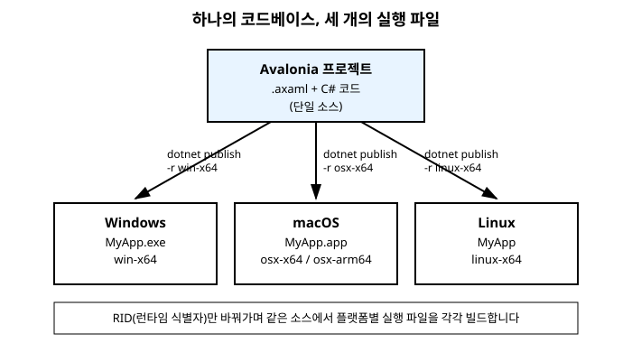

# 17장. 플랫폼별 배포

[◀ 이전: 16장. 테마와 다크 모드](ch16-테마와다크모드.md) | [📖 목차](00-목차.md) | [다음: 18장. 좋은 Avalonia 코드 작성 습관 ▶](ch18-좋은Avalonia코드작성습관.md)


## 들어가며

지금까지 우리는 Visual Studio나 `dotnet run` 명령으로 개발 중인 컴퓨터에서 애플리케이션을 실행하며 학습을 진행해 왔습니다. 하지만 실제로 애플리케이션을 완성했다면, 그다음 질문은 "이걸 어떻게 사용자에게 전달할 것인가"입니다. Avalonia의 가장 큰 매력이 "하나의 코드베이스로 여러 플랫폼을 지원한다"는 점이었던 만큼, 배포 단계에서도 이 장점을 제대로 살리는 방법을 알아야 합니다.

이번 장에서는 같은 Avalonia 프로젝트를 Windows, macOS, Linux용 실행 파일로 각각 빌드하는 방법을 살펴봅니다. `dotnet publish` 명령과 런타임 식별자(RID)라는 개념을 이해하면, 개발은 한 대의 컴퓨터에서 하더라도 세 플랫폼 모두를 대상으로 배포 산출물을 만들어 낼 수 있습니다. 또한 self-contained 배포와 framework-dependent 배포의 차이, 그리고 모바일과 브라우저까지 넓어지는 Avalonia의 배포 대상도 함께 짚어봅니다.

## dotnet publish와 런타임 식별자(RID)

`dotnet run`이 개발 중 빠르게 실행해 보기 위한 명령이라면, `dotnet publish`는 배포용 산출물을 만드는 명령입니다. Avalonia 데스크톱 애플리케이션을 배포하려면 "어떤 운영체제, 어떤 CPU 아키텍처를 대상으로 빌드할 것인가"를 지정해야 하는데, 이를 위한 값이 바로 **런타임 식별자(Runtime Identifier, RID)**입니다.

대표적인 RID는 다음과 같습니다.

- `win-x64` - 64비트 Windows
- `osx-x64` - Intel 기반 macOS
- `osx-arm64` - Apple Silicon(M1/M2/M3 등) 기반 macOS
- `linux-x64` - 64비트 Linux

`-r`(또는 `--runtime`) 옵션에 RID를 지정하면, 개발 중인 컴퓨터의 운영체제와 무관하게 해당 플랫폼을 대상으로 하는 산출물을 만들어 냅니다.

```bash
# Windows용 실행 파일 만들기
dotnet publish -c Release -r win-x64

# macOS(Intel)용 실행 파일 만들기
dotnet publish -c Release -r osx-x64

# macOS(Apple Silicon)용 실행 파일 만들기
dotnet publish -c Release -r osx-arm64

# Linux용 실행 파일 만들기
dotnet publish -c Release -r linux-x64
```

`-c Release`는 최적화가 적용된 릴리스 구성으로 빌드하라는 의미로, 실제 배포 시에는 디버그 구성이 아닌 릴리스 구성을 사용하는 것이 원칙입니다. 명령이 성공적으로 끝나면 프로젝트의 `bin/Release/<대상 프레임워크>/<RID>/publish` 폴더 아래에 해당 플랫폼용 실행 파일과 필요한 파일들이 생성됩니다.

여기서 중요한 점은, RID를 다르게 지정하기만 하면 **같은 소스 코드에서** 세 플랫폼용 산출물을 각각 만들어 낼 수 있다는 것입니다. Windows에서 코드를 수정했다고 해서 macOS나 Linux 대상 빌드 명령을 다시 손볼 필요가 없습니다. 이것이 바로 Avalonia가 자체 렌더링 엔진을 사용해 플랫폼 종속적인 UI 코드를 최소화한 결과입니다.



다만 한 가지 유의할 점은, 크로스 컴파일이 가능한 조합과 그렇지 않은 조합이 있다는 것입니다. 예를 들어 Windows 컴퓨터에서 `-r linux-x64`나 `-r osx-x64`를 지정해 빌드하는 것은 대체로 문제없이 동작하지만, 실제로 그 결과물이 의도대로 동작하는지 확인하려면 결국 해당 운영체제(또는 가상 머신, CI 환경)에서 실행해 검증하는 과정이 필요합니다. 코드를 작성하는 단계는 한 대의 컴퓨터에서 진행하더라도, 최종 배포 전에는 가능하면 실제 대상 플랫폼에서 한 번씩 실행해 보는 습관을 들이는 것이 안전합니다.

## self-contained 배포와 framework-dependent 배포

`dotnet publish`로 애플리케이션을 배포할 때는 ".NET 런타임을 실행 파일 안에 포함시킬 것인가"를 선택할 수 있습니다. 이 선택에 따라 크게 두 가지 배포 방식으로 나뉩니다.

### framework-dependent 배포

**framework-dependent 배포**는 실행에 필요한 .NET 런타임이 사용자의 컴퓨터에 이미 설치되어 있다고 가정하는 방식입니다. 애플리케이션 자체의 코드와 리소스만 배포하므로 산출물의 용량이 작다는 장점이 있습니다.

```bash
dotnet publish -c Release -r win-x64 --self-contained false
```

다만 이 방식은 사용자의 컴퓨터에 호환되는 .NET 런타임이 설치되어 있지 않으면 애플리케이션이 실행되지 않는다는 단점이 있습니다. 개발자나 사내 배포처럼 .NET 런타임이 이미 표준으로 깔려 있는 환경에서는 무난한 선택입니다.

### self-contained 배포

**self-contained 배포**는 애플리케이션 코드뿐 아니라 실행에 필요한 .NET 런타임 전체를 산출물에 포함시키는 방식입니다.

```bash
dotnet publish -c Release -r win-x64 --self-contained true
```

이 경우 사용자는 별도로 .NET 런타임을 설치할 필요 없이 배포된 폴더(또는 실행 파일)를 그대로 실행할 수 있습니다. 일반 사용자에게 배포하는 데스크톱 애플리케이션이라면, ".NET이 설치되어 있는지 신경 쓰지 않아도 된다"는 이 장점이 매우 큽니다. 대신 런타임 전체가 포함되므로 산출물의 용량이 상당히 커진다는 점은 감수해야 합니다.

### 단일 실행 파일로 묶기

self-contained 배포는 기본적으로 여러 개의 파일(DLL 등)을 하나의 폴더에 생성합니다. 배포를 더 간단하게 만들고 싶다면 `PublishSingleFile` 옵션을 함께 사용해 이 여러 파일을 하나의 실행 파일로 묶을 수 있습니다.

```bash
dotnet publish -c Release -r win-x64 --self-contained true -p:PublishSingleFile=true
```

이렇게 하면 사용자에게는 실행 파일 하나만 전달하면 되므로 배포 경험이 한결 단순해집니다. 다만 실제로 실행될 때는 내부적으로 압축이 해제되는 과정이 있으므로, 최초 실행 속도나 임시 파일 처리 방식 등은 상황에 따라 확인해 볼 필요가 있습니다.

두 방식을 표로 정리하면 다음과 같습니다.

| 구분 | framework-dependent | self-contained |
|---|---|---|
| .NET 런타임 포함 여부 | 미포함(사용자 컴퓨터의 런타임 사용) | 포함 |
| 산출물 용량 | 작음 | 큼 |
| 사용자 환경 요구사항 | 호환 런타임 사전 설치 필요 | 없음(그대로 실행 가능) |
| 적합한 상황 | 사내 도구, 개발자 대상 배포 | 일반 사용자 대상 배포 |

## 모바일과 브라우저 대상 지원

이 책은 Windows, macOS, Linux 데스크톱 환경을 중심으로 다루고 있지만, Avalonia는 여기서 더 나아가 모바일과 웹 브라우저까지 배포 대상을 넓힐 수 있습니다. 자세한 프로젝트 설정과 빌드 절차는 이 책의 범위를 벗어나므로 다루지 않지만, "이런 것도 가능하다"는 정도는 알아 두면 앞으로의 학습 방향을 잡는 데 도움이 됩니다.

- **Android / iOS** - Avalonia 프로젝트 템플릿에는 모바일 대상 프로젝트가 포함되어 있어, 같은 XAML과 ViewModel 코드를 재사용하면서 모바일 환경에 맞는 진입점과 플랫폼별 설정을 추가하는 방식으로 앱스토어 배포용 패키지를 만들 수 있습니다.
- **브라우저(WebAssembly, WASM)** - Avalonia 애플리케이션을 WebAssembly로 컴파일하면, 별도의 설치 없이 웹 브라우저 안에서 같은 UI를 실행할 수 있습니다.

두 경우 모두 데스크톱 배포보다 고려할 사항(권한 모델, 화면 크기 대응, 브라우저 샌드박스 제약 등)이 많아지지만, 핵심 UI 코드와 MVVM 구조를 그대로 재사용할 수 있다는 점은 데스크톱 개발 단계에서부터 View와 ViewModel을 잘 분리해 두는 것이 왜 중요한지를 다시 한번 보여줍니다.

## 플랫폼별 차이에 대한 주의사항

같은 코드베이스를 여러 플랫폼에 배포하더라도, 몇 가지 요소는 플랫폼마다 다르게 동작하거나 별도의 설정이 필요할 수 있습니다. 배포 전에 다음과 같은 부분을 점검해 두면 좋습니다.

**앱 아이콘**. Windows는 `.ico` 형식, macOS는 `.icns` 형식처럼 플랫폼마다 선호하는 아이콘 파일 형식이 다릅니다. 프로젝트 파일에서 플랫폼별로 아이콘 경로를 지정해야 하는 경우가 많으므로, 배포 전에 각 플랫폼에서 아이콘이 의도대로 표시되는지 확인해야 합니다.

**창 크기와 화면 배율(DPI)**. 운영체제마다 기본 DPI 처리 방식이나 모니터 배율 설정이 다르기 때문에, 개발 컴퓨터에서 적절해 보였던 창 크기가 다른 환경에서는 너무 작거나 크게 보일 수 있습니다. `Width`, `Height`를 고정값으로만 지정하기보다는 4장에서 다룬 레이아웃 시스템을 활용해 내용에 따라 유연하게 크기가 조정되도록 설계해 두면 이런 문제를 줄일 수 있습니다.

**파일 경로 구분자와 대소문자 구분**. Windows는 파일 경로에서 대소문자를 구분하지 않지만 Linux는 구분합니다. 코드에서 파일 경로를 다룰 때 하드코딩된 구분자(`\` 등)를 피하고 .NET이 제공하는 경로 관련 API를 사용하면 이런 차이로 인한 문제를 예방할 수 있습니다.

**메뉴와 단축키 관례**. macOS는 화면 상단의 전역 메뉴 막대를 사용하고 단축키도 Windows/Linux의 Ctrl 대신 Cmd 키를 쓰는 관례가 있습니다. 여러 플랫폼을 동시에 지원하는 애플리케이션이라면 이런 플랫폼 고유의 사용자 경험 관례도 배포 전에 한 번쯤 점검해 볼 가치가 있습니다.

이런 차이들은 대부분 "완전히 새로운 코드를 작성해야 하는 문제"라기보다는 "배포 전에 확인하고 다듬어야 하는 세부 사항"에 가깝습니다. Avalonia가 자체 렌더링 엔진으로 대부분의 UI를 동일하게 그려 준 덕분에, 개발자가 신경 써야 할 플랫폼별 차이는 다른 크로스플랫폼 접근 방식에 비해 훨씬 적은 편입니다.

## 요약

- `dotnet publish`에 `-r` 옵션으로 런타임 식별자(RID, 예: `win-x64`, `osx-x64`, `osx-arm64`, `linux-x64`)를 지정하면 같은 코드베이스에서 여러 플랫폼용 실행 파일을 각각 빌드할 수 있습니다.
- framework-dependent 배포는 사용자 컴퓨터에 설치된 .NET 런타임을 사용해 산출물 용량이 작고, self-contained 배포는 .NET 런타임 자체를 포함시켜 사용자가 별도 설치 없이 실행할 수 있습니다.
- `--self-contained true`와 `-p:PublishSingleFile=true`를 함께 사용하면 self-contained 배포 결과물을 실행 파일 하나로 묶을 수 있습니다.
- Avalonia는 데스크톱(Windows/macOS/Linux)뿐 아니라 모바일(Android/iOS)과 브라우저(WebAssembly)까지 배포 대상을 확장할 수 있으며, 이때도 핵심 UI 코드와 MVVM 구조는 재사용됩니다.
- 앱 아이콘 형식, 창 크기와 DPI, 파일 경로 대소문자 구분, 메뉴/단축키 관례처럼 플랫폼마다 다르게 동작할 수 있는 세부 사항은 배포 전에 미리 점검해 두는 것이 좋습니다.

## 연습문제

1. `dotnet publish` 명령에서 런타임 식별자(RID)의 역할을 설명하고, Windows/macOS/Linux 각각에 해당하는 RID 값을 하나씩 적어 보세요.
2. framework-dependent 배포와 self-contained 배포의 차이를 산출물 용량과 사용자 환경 요구사항 관점에서 비교해 보세요.
3. 일반 사용자에게 배포할 유틸리티 애플리케이션을 만든다면 두 배포 방식 중 어느 쪽이 더 적합할지, 그 이유와 함께 설명해 보세요.
4. Avalonia 애플리케이션을 여러 플랫폼에 배포할 때 신경 써야 할 플랫폼별 차이(아이콘, 창 크기, 경로 등)를 두 가지 이상 나열해 보세요.
5. `dotnet publish -c Release -r linux-x64 --self-contained true -p:PublishSingleFile=true` 명령이 실행하는 작업을 단계별로 설명해 보세요.

---

[◀ 이전: 16장. 테마와 다크 모드](ch16-테마와다크모드.md) | [📖 목차](00-목차.md) | [다음: 18장. 좋은 Avalonia 코드 작성 습관 ▶](ch18-좋은Avalonia코드작성습관.md)
