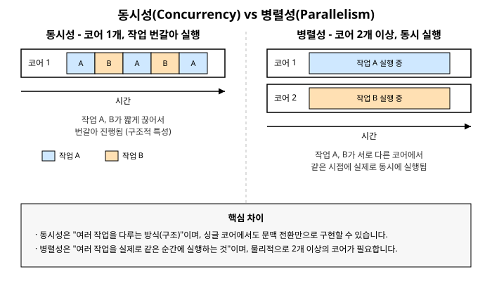

# 1장. 동시성과 병렬성이란 무엇인가

[◀ 이전: 목차](00-목차.md) | [📖 목차](00-목차.md) | [다음: 2장. 프로세스와 스레드 기초 ▶](ch02-프로세스와스레드기초.md)


프로그램이 "동시에 여러 일을 한다"는 말은 사실 두 가지 서로 다른 상황을 뭉뚱그려 가리킬 때가 많습니다. 하나는 여러 작업을 조금씩 번갈아 처리해서 마치 동시에 진행되는 것처럼 보이게 만드는 것이고, 다른 하나는 실제로 여러 작업이 같은 순간에 물리적으로 실행되는 것입니다. 이 둘을 구분하지 않고 뭉뚱그려 이해하면, 코드를 설계할 때 "왜 스레드를 여러 개 만들었는데도 속도가 빨라지지 않지?"라거나 "싱글 코어 장비인데 어떻게 여러 작업이 동시에 진행되는 것처럼 보이지?" 같은 의문에 제대로 답할 수 없습니다.

이 장에서는 동시성(Concurrency)과 병렬성(Parallelism)이라는 두 개념을 정확히 구분하는 데서 출발합니다. 그다음 왜 오늘날의 소프트웨어가 이 두 가지를 모두 적극적으로 활용해야 하는지 살펴보고, .NET이 이를 위해 어떤 도구들을 제공하는지 지도를 그려봅니다. 마지막으로 동시성 프로그래밍이 본질적으로 안고 있는 어려움을 미리 짚어두어, 앞으로 이 책 전체에서 왜 "안전한 패턴"을 그토록 강조하는지 이해할 수 있도록 하겠습니다.

## 동시성이란 무엇인가

동시성은 여러 작업을 **번갈아 가며 진행하는 구조**를 말합니다. 핵심은 "동시에 실행되는가"가 아니라 "여러 작업의 진행이 서로 겹쳐 있는가"입니다.

예를 들어 한 사람이 요리를 하면서 동시에 빨래를 돌린다고 생각해봅시다. 그 사람은 물리적으로 손이 하나뿐이므로 요리와 빨래를 동시에 할 수는 없습니다. 하지만 밥을 안쳐놓고 기다리는 동안 세탁기를 돌리고, 세탁기가 돌아가는 동안 다시 돌아와 국을 끓이는 식으로 작업을 번갈아 진행할 수 있습니다. 밖에서 보면 "이 사람은 요리와 빨래를 동시에 처리하고 있다"고 말할 수 있지만, 실제로 어느 한 순간을 정확히 잘라보면 그 순간에는 요리나 빨래 중 하나만 하고 있을 뿐입니다.

컴퓨터도 마찬가지입니다. 코어가 하나뿐인 CPU에서도 운영체제는 매우 짧은 시간 단위로 실행 중인 작업을 바꿔가며(이를 **문맥 전환**, context switch라고 합니다) 여러 프로그램을 번갈아 실행합니다. 사용자 입장에서는 웹 브라우저와 음악 재생 프로그램이 동시에 돌아가는 것처럼 보이지만, 실제로 CPU 코어 하나는 특정 순간에는 반드시 하나의 작업만 실행하고 있습니다. 이것이 동시성입니다. **동시성은 싱글 코어 환경에서도 얼마든지 구현할 수 있는 구조적 특성**입니다.

## 병렬성이란 무엇인가

병렬성은 여러 작업이 **실제로 같은 시각에 동시에 실행되는 것**을 말합니다. 앞의 비유를 이어가면, 만약 그 사람에게 요리를 담당하는 손과 빨래를 담당하는 손이 각각 따로 있어서 정말로 같은 순간에 두 가지 일을 처리할 수 있다면, 이것이 병렬성에 해당합니다.

컴퓨터에서 병렬성이 성립하려면 물리적으로 독립된 실행 단위, 즉 **2개 이상의 CPU 코어**가 필요합니다. 코어가 4개인 CPU에서는 이론적으로 최대 4개의 작업을 정확히 같은 순간에 실행할 수 있습니다. 코어가 하나뿐이라면 운영체제가 아무리 빠르게 문맥 전환을 하더라도 두 작업이 정확히 같은 순간에 실행되는 일은 일어날 수 없습니다.

정리하면 다음과 같습니다.

- **동시성**: 여러 작업의 진행 구간이 겹쳐 있는 것. 구조와 설계의 문제이며 싱글 코어에서도 가능합니다.
- **병렬성**: 여러 작업이 실제로 같은 순간에 실행되는 것. 물리적 자원(멀티 코어)이 있어야만 가능합니다.

병렬성은 동시성의 특수한 형태라고 볼 수 있습니다. 여러 작업이 실제로 동시에 실행되고 있다면 그 작업들의 진행 구간은 당연히 겹쳐 있으므로, 병렬로 실행되는 프로그램은 항상 동시성을 띠고 있습니다. 하지만 그 역은 성립하지 않습니다. 동시성 있는 프로그램이라고 해서 반드시 병렬로 실행되고 있는 것은 아닙니다.

아래 그림은 이 차이를 타임라인으로 비교한 것입니다. 왼쪽은 코어 하나에서 작업 A와 B가 짧은 구간으로 쪼개져 번갈아 실행되는 동시성의 모습이고, 오른쪽은 코어 두 개에서 작업 A와 B가 같은 시간대에 나란히 실행되는 병렬성의 모습입니다.



.NET 코드로 조금 더 구체화해보면, 다음 두 코드는 겉보기에 비슷해 보이지만 실제 실행 방식이 다를 수 있습니다.

```csharp
// 동시성의 예: 코어가 하나뿐이어도 async/await로 여러 작업을 번갈아 진행할 수 있다
async Task DownloadReportsAsync()
{
    Task<string> reportA = DownloadAsync("https://example.com/a");
    Task<string> reportB = DownloadAsync("https://example.com/b");

    // 두 다운로드가 네트워크 I/O를 기다리는 동안 스레드는 다른 일을 할 수 있다
    string[] results = await Task.WhenAll(reportA, reportB);
}
```

```csharp
// 병렬성의 예: 멀티 코어를 전제로 실제로 동시에 CPU 작업을 수행한다
void ComputeChecksums(byte[][] chunks, long[] results)
{
    Parallel.For(0, chunks.Length, i =>
    {
        results[i] = ComputeChecksum(chunks[i]);
    });
}
```

첫 번째 예제는 네트워크 응답을 기다리는 동안 스레드를 점유하지 않기 때문에, 싱글 코어 환경에서도 두 다운로드가 번갈아 효율적으로 진행될 수 있습니다. 반면 두 번째 예제는 CPU 자체를 많이 사용하는 계산 작업이므로, 코어가 여러 개일 때만 진짜로 속도 이득을 얻습니다. `Parallel.For`는 12장에서 자세히 다루고, `async`/`await`의 동작 원리는 9장과 10장에서 깊이 있게 설명합니다.

## 왜 동시성과 병렬 프로그래밍이 필요한가

### CPU 코어 수 증가라는 하드웨어 흐름

과거에는 CPU 제조사들이 매년 클럭 속도(동작 주파수)를 높이는 방식으로 성능을 끌어올렸습니다. 하지만 발열과 전력 소비 문제로 인해 클럭 속도를 무한히 높이는 방식은 물리적 한계에 부딪혔습니다. 그 대안으로 업계는 하나의 칩에 여러 개의 코어를 탑재하는 방향으로 전환했습니다. 지금은 저가형 노트북에서도 4~8코어가 흔하고, 서버용 CPU는 수십 개의 코어를 갖추기도 합니다.

문제는 코어 개수가 늘어난다고 해서 기존 프로그램이 자동으로 빨라지지는 않는다는 점입니다. 하나의 스레드에서 순차적으로만 실행되는 프로그램은 코어가 32개인 서버에서 돌려도 코어 1개짜리 성능밖에 내지 못합니다. 여러 코어가 가진 계산 능력을 실제로 활용하려면 프로그램 자체가 작업을 여러 실행 흐름으로 나누어 병렬로 처리하도록 설계되어야 합니다. 이것이 병렬 프로그래밍이 필요한 첫 번째 이유입니다.

### I/O 대기 시간을 낭비하지 않기 위해

프로그램이 하는 일 중 상당수는 CPU 계산이 아니라 **기다리는 일**입니다. 디스크에서 파일을 읽거나, 네트워크로 API를 호출하거나, 데이터베이스 쿼리 결과를 받는 동안 CPU는 사실상 놀고 있습니다. 이런 작업을 동기적으로 한 줄씩 처리하면, 응답이 오는 몇 초 혹은 몇십 밀리초 동안 스레드는 아무 일도 하지 못한 채 블로킹된 상태로 대기합니다.

동시성 프로그래밍 기법, 특히 `async`/`await`를 활용하면 I/O 작업이 진행되는 동안 스레드를 놓아주고 다른 작업을 처리하게 할 수 있습니다. 이는 코어 개수와 무관하게 얻을 수 있는 이득이라는 점에서 앞서 설명한 병렬성과는 다른 종류의 가치입니다. 서버 애플리케이션이 수천 개의 동시 요청을 적은 수의 스레드로 처리할 수 있는 것도 바로 이 덕분입니다. 이 내용은 9장과 10장에서 자세히 다룹니다.

### 응답성 확보 - UI가 멈추지 않게 하기

데스크톱이나 모바일 애플리케이션에는 보통 UI를 그리고 사용자 입력을 처리하는 전용 스레드가 하나 있습니다. 흔히 UI 스레드 또는 메인 스레드라고 부릅니다. 만약 버튼 클릭 이벤트 처리기 안에서 오래 걸리는 파일 처리나 네트워크 호출을 동기적으로 수행하면, 그 작업이 끝날 때까지 UI 스레드는 다른 어떤 것도 처리하지 못합니다. 화면이 다시 그려지지 않고, 사용자의 클릭이나 드래그에도 반응하지 않는 이른바 "먹통" 상태, 흔히 말하는 프리징이 발생합니다.

오래 걸리는 작업을 별도의 스레드나 백그라운드 Task로 넘기고, 그 결과만 UI 스레드로 다시 가져와 화면을 갱신하는 패턴을 사용하면 UI는 항상 사용자 입력에 즉각 반응할 수 있습니다. 이것이 응답성을 위한 동시성입니다. 코어가 여러 개 있어야만 가능한 것이 아니라, 작업을 UI 스레드에서 떼어놓는 구조 자체가 핵심입니다.

정리하면 병렬 프로그래밍은 주로 **CPU 집약적인 작업의 처리 속도**를 높이기 위해, 동시성 프로그래밍은 주로 **I/O 대기 시간의 낭비를 줄이거나 응답성을 확보**하기 위해 사용합니다. 실무에서는 이 두 가지 목적이 한 애플리케이션 안에 함께 등장하는 경우가 대부분입니다.

## .NET이 제공하는 동시성 도구 지형도

.NET은 지난 20여 년간 동시성 프로그래밍을 점점 더 다루기 쉽게 만드는 방향으로 발전해 왔습니다. 아래에서 소개하는 도구들은 서로 대체재라기보다는 각자 다른 층위에서 문제를 해결하며, 대부분 낮은 층위의 도구 위에 높은 층위의 도구가 쌓여 있는 구조입니다. 이 책은 아래 순서를 그대로 따라가며 하나씩 자세히 설명합니다.

**Thread(스레드)**. `System.Threading.Thread`는 운영체제 스레드를 가장 직접적으로 다루는 가장 저수준의 API입니다. 스레드를 직접 생성하고 시작하고 종료를 기다리는 방법을 배우는 것은 이후에 나오는 모든 고수준 도구를 이해하는 토대가 됩니다. 이 장 바로 다음인 2장에서 다룹니다.

**동기화 프리미티브**. 여러 스레드가 같은 데이터를 공유하면 경쟁 상태(race condition) 문제가 발생합니다. `lock` 키워드, `Monitor`, `Mutex`, `Semaphore`, `SemaphoreSlim` 같은 동기화 도구로 이를 제어하는 방법을 3장과 4장에서, 이벤트 기반으로 스레드 간 신호를 주고받는 방법을 5장에서 다룹니다.

**ThreadPool(스레드 풀)**. 매번 스레드를 새로 만들고 폐기하는 것은 비용이 큰 작업입니다. .NET 런타임이 미리 만들어 관리하는 스레드 집합을 재사용하는 `ThreadPool`을 6장에서 다룹니다.

**Task와 async/await**. `System.Threading.Tasks.Task`는 ThreadPool 위에서 동작하는 비동기 작업의 추상화이며, `async`/`await` 키워드는 이를 마치 동기 코드를 작성하듯 자연스럽게 사용할 수 있게 해주는 언어 차원의 지원입니다. 7장부터 11장까지 TPL(Task Parallel Library)의 기초와 조합, `async`/`await`의 동작 원리, 취소와 진행률 보고를 순서대로 다룹니다. 실무에서 작성하는 동시성 코드의 대다수는 바로 이 층위에 속합니다.

**Parallel 클래스와 PLINQ**. 배열이나 컬렉션의 각 항목에 대해 독립적으로 수행할 수 있는 CPU 집약적 작업을 여러 코어에 자동으로 분배해주는 `Parallel.For`, `Parallel.ForEach`와, LINQ 쿼리 자체를 병렬로 실행하는 PLINQ(Parallel LINQ)를 12장과 13장에서 다룹니다.

**동시성 컬렉션과 비동기 스트림, Channel**. 여러 스레드가 동시에 안전하게 접근할 수 있도록 설계된 `ConcurrentDictionary<TKey, TValue>`, `ConcurrentQueue<T>` 같은 컬렉션을 14장에서, `IAsyncEnumerable<T>`를 이용한 비동기 스트림을 15장에서, 생산자와 소비자 사이의 데이터 흐름을 다루는 `System.Threading.Channels`를 16장에서 다룹니다.

마지막으로 17장에서는 스레드 안전성과 .NET의 메모리 모델을 더 깊이 파고들고, 18장에서는 지금까지 배운 내용을 바탕으로 좋은 동시성 코드를 작성하는 습관과 디버깅 요령을 정리합니다.

## 동시성 프로그래밍이 어려운 이유

동시성과 병렬 프로그래밍은 강력한 만큼 다루기 까다롭습니다. 순차적으로 실행되는 코드는 위에서 아래로 한 줄씩 읽으면 동작을 예측할 수 있지만, 여러 실행 흐름이 얽히는 순간 상황이 복잡해집니다. 이 책을 시작하며 미리 경계해야 할 대표적인 문제 세 가지를 짚어보겠습니다.

**경쟁 상태(Race Condition)**. 두 개 이상의 스레드가 같은 데이터를 동시에 읽고 쓸 때, 실행 순서에 따라 결과가 달라지는 현상입니다. 예를 들어 두 스레드가 동시에 같은 변수의 값을 1 증가시키는 코드를 실행하면, 운이 나쁘면 두 번의 증가 중 하나가 사라져 최종 값이 예상보다 작게 나올 수 있습니다. 문제는 이런 버그가 항상 재현되는 것이 아니라 특정 타이밍에서만 드물게 발생한다는 점입니다. 이 내용은 3장에서 본격적으로 다룹니다.

**데드락(Deadlock)**. 두 개 이상의 스레드가 서로가 점유한 자원을 기다리며 영원히 멈춰 서는 현상입니다. 스레드 A가 자원 1을 잠그고 자원 2를 기다리는 동시에, 스레드 B가 자원 2를 잠그고 자원 1을 기다린다면 두 스레드 모두 영원히 진행되지 못합니다. 데드락은 개발 중에는 잘 드러나지 않다가 운영 환경의 특정 부하 상황에서 갑자기 나타나는 경우가 많아 대응하기 까다롭습니다.

**디버깅의 어려움**. 동시성 버그는 실행할 때마다 스레드의 스케줄링 순서가 달라질 수 있기 때문에 재현하기가 매우 어렵습니다. 개발자의 컴퓨터에서는 수천 번을 실행해도 멀쩡하던 코드가 운영 서버에서는 하루에 한 번씩 실패하는 일도 드물지 않습니다. 디버거로 한 줄씩 실행하며 확인하는 순간 타이밍이 바뀌어 버그 자체가 사라지는 경우(흔히 "하이젠버그"라고 부릅니다)도 있습니다.

이런 문제들 때문에 동시성 코드는 "일단 돌아가니까 됐다"는 태도로 접근하면 반드시 대가를 치르게 됩니다. 이 책은 각 장마다 단순히 API 사용법을 나열하는 데 그치지 않고, 왜 그 도구가 필요한지, 어떤 함정을 피해야 하는지, 그리고 실무에서 신뢰할 수 있는 패턴이 무엇인지를 함께 짚어가며 설명할 것입니다. 18장에서는 이런 안전한 패턴들과 디버깅 전략을 종합적으로 정리합니다.

## 요약

- 동시성은 여러 작업의 진행이 서로 겹치는 구조적 특성으로, 싱글 코어 환경에서도 문맥 전환을 통해 구현할 수 있습니다.
- 병렬성은 여러 작업이 실제로 같은 순간에 실행되는 것으로, 물리적으로 2개 이상의 CPU 코어가 있어야만 가능합니다. 병렬성은 동시성의 한 형태이지만, 동시성이 항상 병렬성을 의미하지는 않습니다.
- 동시성/병렬 프로그래밍이 필요한 이유는 크게 세 가지입니다. CPU 코어 수가 계속 늘어나는 하드웨어 흐름을 활용하기 위해, I/O 대기 시간 동안 자원을 낭비하지 않기 위해, 그리고 UI나 서버의 응답성을 확보하기 위해서입니다.
- .NET은 Thread, 동기화 프리미티브, ThreadPool, Task/async-await, Parallel/PLINQ, 동시성 컬렉션, 비동기 스트림, Channel에 이르기까지 여러 층위의 동시성 도구를 제공하며, 이 책은 이 순서를 따라 각 도구를 다룹니다.
- 동시성 프로그래밍은 경쟁 상태, 데드락, 재현하기 어려운 버그라는 고유한 어려움을 동반합니다. 이 책은 이런 함정을 피하고 안전한 패턴을 익히는 데 초점을 맞춥니다.

## 연습문제

1. 동시성과 병렬성의 차이를 자신의 말로 설명하고, 싱글 코어 CPU에서는 왜 병렬성이 성립할 수 없는지 이유를 서술하세요.
2. 다음 중 병렬성이 필요한 상황과 동시성만으로 충분한 상황을 구분해보세요. (1) 여러 이미지 파일의 크기를 동시에 줄이는 CPU 집약적 작업, (2) 여러 외부 API를 호출해 응답을 기다리는 작업, (3) 사용자가 버튼을 클릭했을 때 오래 걸리는 보고서를 생성하면서도 화면이 멈추지 않게 하는 작업.
3. 경쟁 상태와 데드락의 차이를 설명하고, 각각이 발생하는 상황을 간단한 예시로 들어보세요.
4. 동시성 버그가 일반적인 논리 버그보다 디버깅하기 어려운 이유를 두 가지 이상 서술하세요.
5. 자신이 최근에 작성했거나 사용해본 프로그램 중에서, 동시성 또는 병렬 프로그래밍을 도입하면 성능이나 응답성이 개선될 만한 부분이 있는지 찾아보고 어떤 방식(I/O 대기 활용, 멀티 코어 활용, 응답성 확보)이 적합할지 생각해보세요.

---

[◀ 이전: 목차](00-목차.md) | [📖 목차](00-목차.md) | [다음: 2장. 프로세스와 스레드 기초 ▶](ch02-프로세스와스레드기초.md)
