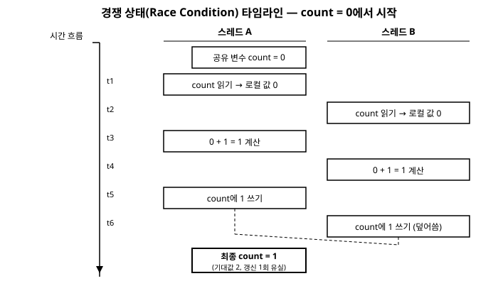

# 3장. 스레드 동기화 기초

[◀ 이전: 2장. 프로세스와 스레드 기초](ch02-프로세스와스레드기초.md) | [📖 목차](00-목차.md) | [다음: 4장. 동기화 프리미티브 ▶](ch04-동기화프리미티브.md)


2장에서 우리는 `Thread` 클래스를 이용해 여러 개의 실행 흐름을 동시에 띄우는 방법을 살펴보았다. 그런데 스레드를 여러 개 만들어 동시에 실행시키는 순간부터, 지금까지 순차적인 프로그램을 작성할 때는 전혀 신경 쓸 필요가 없었던 새로운 종류의 버그가 등장한다. 바로 여러 스레드가 같은 데이터를 동시에 건드릴 때 생기는 문제들이다. 이 장에서는 이러한 문제의 근본 원인인 **경쟁 상태(Race Condition)** 를 코드로 직접 확인하고, 가장 기본적인 해결 도구인 `lock` 키워드와 그 내부 동작 원리인 `Monitor` 클래스를 다룬다. 마지막으로 동기화를 잘못 사용했을 때 발생할 수 있는 대표적인 함정인 **데드락(Deadlock)** 을 살펴보고 이를 예방하는 방법을 알아본다.

## 3.1 경쟁 상태(Race Condition)란 무엇인가

경쟁 상태란, 두 개 이상의 스레드가 공유된 자원(변수, 필드, 컬렉션 등)에 동시에 접근하여 읽고 쓰는 작업을 수행할 때, 그 실행 순서(타이밍)에 따라 결과가 달라지는 상황을 말한다. 프로그램의 정확성이 스레드들의 실행 순서라는, 개발자가 통제할 수 없는 요소에 의존하게 되는 것이다.

### 3.1.1 공유 카운터 예제로 확인하는 경쟁 상태

가장 흔히 드는 예로, 여러 스레드가 하나의 정수 변수를 1씩 증가시키는 코드를 보자.

```csharp
using System;
using System.Threading;
using System.Threading.Tasks;

class Counter
{
    public static int count = 0;

    public static void Increment()
    {
        for (int i = 0; i < 1_000_000; i++)
        {
            count++;
        }
    }
}

class Program
{
    static void Main()
    {
        Thread t1 = new Thread(Counter.Increment);
        Thread t2 = new Thread(Counter.Increment);

        t1.Start();
        t2.Start();

        t1.Join();
        t2.Join();

        Console.WriteLine($"최종 결과: {Counter.count}");
        // 기대값: 2,000,000
        // 실제로는 실행할 때마다 그보다 작은, 예측할 수 없는 값이 출력된다.
    }
}
```

두 개의 스레드가 각각 `count`를 100만 번씩 증가시키므로, 상식적으로는 최종 결과가 정확히 200만이 되어야 할 것 같다. 하지만 이 코드를 여러 번 실행해 보면 매번 다른 값이, 그것도 대부분 200만보다 작은 값이 출력되는 것을 확인할 수 있다.

원인은 `count++`라는 한 줄의 코드가 겉보기와 달리 원자적(atomic)인 단일 연산이 아니라는 데 있다. 이 코드는 컴파일러/CLR 수준에서 최소한 다음 세 단계로 분해된다.

1. **읽기(Load)**: 메모리(또는 캐시)에서 `count`의 현재 값을 CPU 레지스터로 읽어온다.
2. **연산(Increment)**: 레지스터에 있는 값에 1을 더한다.
3. **쓰기(Store)**: 계산된 값을 다시 `count`의 메모리 위치에 저장한다.

문제는 이 세 단계 사이에 다른 스레드가 끼어들 수 있다는 점이다. 두 스레드 A, B가 `count`가 0인 시점에 동시에 실행된다고 가정해 보자.

| 시각 | 스레드 A | 스레드 B | count 실제 값 |
|---|---|---|---|
| t1 | `count` 읽기 (0) | | 0 |
| t2 | | `count` 읽기 (0) | 0 |
| t3 | 0 + 1 = 1 계산 | | 0 |
| t4 | | 0 + 1 = 1 계산 | 0 |
| t5 | `count`에 1 쓰기 | | 1 |
| t6 | | `count`에 1 쓰기 | 1 |

두 스레드가 각각 한 번씩, 총 두 번 증가 연산을 수행했지만 최종 값은 2가 아니라 1이 되었다. 스레드 B가 A의 갱신 결과를 반영하기 전의 낡은(stale) 값을 읽어서 자신의 연산을 수행했고, 그 결과로 A가 만든 갱신 내용을 덮어써 버린 것이다. 이렇게 하나의 증가 연산이 "유실"되는 현상이 수백만 번의 반복 중 곳곳에서 무작위로 일어나기 때문에, 최종 결과는 실행할 때마다 달라지고 항상 기댓값보다 작거나 같게 나온다.

이처럼 여러 단계로 이루어진 연산의 중간에 다른 스레드가 끼어들어 공유 상태를 예기치 않게 변경하는 상황이 바로 경쟁 상태다. 핵심은 **"읽고-수정하고-쓰는(read-modify-write)" 연산이 쪼개질 수 있다는 것, 그리고 그 쪼개진 틈을 다른 스레드가 비집고 들어올 수 있다는 것**이다. 이렇게 여러 스레드가 동시에 접근했을 때 문제가 되는 코드 구간을 **임계 영역(critical section)**이라고 부른다. 경쟁 상태를 해결한다는 것은 결국 임계 영역에 한 번에 하나의 스레드만 들어갈 수 있도록 보장하는 문제로 귀결된다.

아래 다이어그램은 두 스레드가 공유 변수를 동시에 읽고, 증가시키고, 쓰는 과정에서 갱신 하나가 유실되는 과정을 시간 순으로 보여준다.



### 3.1.2 경쟁 상태는 왜 재현하기 어려운가

경쟁 상태의 가장 성가신 특징은 항상 발생하는 것이 아니라 특정 타이밍에서만 발생한다는 점이다. 반복 횟수가 적으면(예: 100번) 위 예제에서도 우연히 정확한 값이 나올 수 있다. 스레드 스케줄링은 운영체제, CPU 코어 수, 시스템 부하 등 다양한 요인에 좌우되기 때문에, 개발 환경에서는 버그가 드러나지 않다가 운영 환경의 특정 부하 상황에서만 간헐적으로 터지는 경우가 흔하다. 이런 이유로 동시성 버그는 로그나 디버거로 재현하기 매우 까다롭고, "가끔 한 번씩 이상한 값이 나온다"는 보고를 받았을 때 가장 먼저 의심해 봐야 할 것이 바로 공유 상태에 대한 동기화되지 않은 접근이다.

## 3.2 `lock` 키워드로 임계 영역 보호하기

C#은 임계 영역을 가장 간단하게 만들 수 있는 `lock` 키워드를 제공한다. `lock` 블록으로 감싼 코드는 한 번에 하나의 스레드만 진입할 수 있다. 앞의 카운터 예제를 `lock`으로 수정해 보자.

```csharp
using System;
using System.Threading;

class Counter
{
    private static readonly object _lockObject = new object();
    public static int count = 0;

    public static void Increment()
    {
        for (int i = 0; i < 1_000_000; i++)
        {
            lock (_lockObject)
            {
                count++;
            }
        }
    }
}

class Program
{
    static void Main()
    {
        Thread t1 = new Thread(Counter.Increment);
        Thread t2 = new Thread(Counter.Increment);

        t1.Start();
        t2.Start();

        t1.Join();
        t2.Join();

        Console.WriteLine($"최종 결과: {Counter.count}"); // 항상 2,000,000
    }
}
```

이제 `count++`는 `lock` 블록 안에 있으므로, 한 스레드가 이 블록을 실행하는 동안에는 다른 스레드가 같은 블록에 들어오려고 해도 대기 상태에 놓인다. 먼저 진입한 스레드가 블록을 빠져나가야 비로소 대기하던 스레드가 진입할 수 있다. 그 결과 "읽고-수정하고-쓰는" 세 단계가 다른 스레드의 개입 없이 통째로 수행되는 것이 보장되어, 항상 정확히 200만이라는 결과를 얻는다.

### 3.2.1 lock의 동작 원리

`lock (obj) { ... }`는 지정한 참조 타입 객체(`obj`)를 **잠금 대상(lock object)** 으로 삼아, 그 객체에 대해 하나의 스레드만 동시에 잠금을 보유할 수 있도록 한다. 어떤 스레드가 이미 `obj`에 대한 잠금을 보유한 상태에서 다른 스레드가 같은 `obj`로 `lock`을 시도하면, 그 스레드는 잠금이 풀릴 때까지 블로킹(대기)된다. 잠금을 보유한 스레드가 블록을 빠져나가면(정상 종료든, 예외로 인한 탈출이든) 잠금은 자동으로 해제되고, 대기 중이던 스레드 중 하나가 잠금을 획득하여 진입한다.

여기서 중요한 것은 **잠금 대상 객체 자체에는 아무런 의미가 없고, 오직 "이 객체를 기준으로 상호 배제를 수행한다"는 식별자 역할만 한다**는 점이다. `lock (obj)`는 `obj`의 내용을 읽거나 바꾸지 않는다. 단지 CLR 내부적으로 각 객체마다 연결될 수 있는 동기화 정보(sync block)를 이용해 "지금 이 객체를 누가 잠그고 있는가"를 추적할 뿐이다.

### 3.2.2 잠금 대상 객체 선택 시 주의사항

`lock`에 어떤 객체를 넘겨야 하는지는 생각보다 중요한 설계 결정이다. 다음과 같은 원칙을 지켜야 한다.

**전용 private readonly 객체를 사용한다.** 잠금 전용으로 사용할 `private readonly object` 필드를 별도로 만들고, 그 객체로만 잠그는 것이 가장 안전한 관례다.

```csharp
private readonly object _lockObject = new object();
```

- `private`이어야 하는 이유: 외부 코드(다른 클래스)가 같은 객체로 `lock`을 걸 수 있게 되면, 내가 의도하지 않은 곳에서 내 임계 영역과 경합하거나, 심지어 의도적으로 오랫동안 잠금을 붙잡아 두어 내 코드를 마비시키는 것도 가능해진다. 잠금 대상은 그 잠금이 보호하는 코드를 소유한 클래스만 알고 있어야 한다.
- `readonly`여야 하는 이유: 잠금 대상 필드 자체가 도중에 다른 객체로 바뀌면, 어떤 스레드는 옛 객체로 잠그고 어떤 스레드는 새 객체로 잠그는 상황이 생겨 상호 배제가 깨진다. `readonly`로 선언해 한 번 생성된 이후 절대 재할당되지 않도록 고정한다.
- 잠금 전용의 의미 없는 `object` 인스턴스여야 하는 이유: 잠금 대상은 오직 상호 배제를 위한 "표식"이어야 한다. 업무적으로 의미 있는 객체(예: 리스트, 문자열, 도메인 객체)를 잠금 대상으로 쓰면, 그 객체가 다른 목적으로도 참조되면서 예상치 못한 곳에서 같은 객체에 잠금이 걸릴 위험이 커진다.

**피해야 할 잠금 대상들:**

```csharp
lock (this)      // 이 클래스의 인스턴스를 외부에서도 참조할 수 있다면,
                  // 외부 코드가 lock(myInstance)로 잠가서 간섭할 수 있다.

lock (typeof(MyClass))  // Type 객체는 앱 도메인 전체에서 공유되므로
                         // 전혀 관련 없는 코드와 잠금이 충돌할 수 있다.

lock ("문자열 리터럴")   // 문자열 리터럴은 인턴(intern)되어 같은 내용의
                         // 문자열이 프로그램 전체에서 동일 인스턴스로 공유된다.
                         // 의도치 않은 곳과 잠금을 공유하게 될 위험이 크다.
```

이런 대상들의 공통점은 "나만의 것"이 아니라는 점이다. 여러 곳에서 같은 참조에 접근할 가능성이 있는 객체를 잠금 대상으로 쓰면, 그 잠금이 정확히 어떤 코드와 상호 배제를 이루는지 코드만 보고는 알 수 없게 된다. 반드시 해당 클래스 내부에서만 접근 가능한 전용 객체를 사용하자.

또한 값 타입(struct)은 `lock`의 대상이 될 수 없다는 점도 기억해두자. `lock`은 참조를 기준으로 동작하므로 잠금 대상은 반드시 참조 타입이어야 하며, 실제로 값 타입을 `lock`에 넘기려 하면 컴파일 오류가 발생한다.

## 3.3 lock의 실체: Monitor 클래스

사실 `lock` 키워드는 새로운 기능이 아니라 `System.Threading.Monitor` 클래스를 사용하는 코드를 컴파일러가 대신 작성해 주는 **문법적 편의(syntactic sugar)** 다. 앞서 작성한 코드는 컴파일러에 의해 개념적으로 다음과 같은 코드로 변환된다.

```csharp
bool lockTaken = false;
try
{
    Monitor.Enter(_lockObject, ref lockTaken);
    count++;
}
finally
{
    if (lockTaken)
    {
        Monitor.Exit(_lockObject);
    }
}
```

(실제 생성 코드는 .NET 버전에 따라 세부 사항이 조금씩 다르지만, 핵심은 `Monitor.Enter`로 잠금을 획득하고 `finally` 블록에서 반드시 `Monitor.Exit`로 잠금을 해제한다는 것이다.)

### 3.3.1 Monitor를 직접 사용하기

`Monitor` 클래스를 직접 사용하면 `lock`보다 더 세밀한 제어가 가능하다. 대표적으로 잠금을 무한정 기다리지 않고 일정 시간만 기다려보는 `TryEnter`가 있다.

```csharp
using System;
using System.Threading;

class SafeCounter
{
    private readonly object _lockObject = new object();
    private int _count = 0;

    public void Increment()
    {
        bool lockTaken = false;
        try
        {
            Monitor.Enter(_lockObject, ref lockTaken);
            _count++;
        }
        finally
        {
            if (lockTaken)
            {
                Monitor.Exit(_lockObject);
            }
        }
    }

    public bool TryIncrementWithTimeout(int millisecondsTimeout)
    {
        bool lockTaken = false;
        try
        {
            // 지정한 시간 동안만 잠금 획득을 시도한다.
            Monitor.TryEnter(_lockObject, millisecondsTimeout, ref lockTaken);
            if (lockTaken)
            {
                _count++;
                return true;
            }
            return false; // 시간 내에 잠금을 얻지 못했다.
        }
        finally
        {
            if (lockTaken)
            {
                Monitor.Exit(_lockObject);
            }
        }
    }
}
```

`TryEnter`는 잠금을 얻으면 `true`, 얻지 못하면(제한 시간이 지나도록 다른 스레드가 잠금을 놓지 않으면) `false`를 반환한다. 무작정 기다리는 대신 "잠깐 기다려보고 안 되면 다른 일을 하거나 실패로 처리한다"는 유연한 전략을 구현할 때 유용하다. 이는 순수한 `lock` 키워드만으로는 표현할 수 없는 동작으로, `Monitor`를 직접 다뤄야 하는 대표적인 이유다.

### 3.3.2 왜 반드시 try/finally로 잠금을 해제해야 하는가

`Monitor.Enter`와 `Monitor.Exit`를 직접 사용할 때 가장 위험한 실수는 `Monitor.Exit` 호출을 빠뜨리는 것이다. 다음과 같이 작성했다고 가정해 보자.

```csharp
// 절대 이렇게 작성하면 안 되는 예
Monitor.Enter(_lockObject);
count++;
if (count > 1000)
{
    throw new InvalidOperationException("한도 초과"); // 여기서 예외가 발생하면
}
Monitor.Exit(_lockObject); // 이 줄은 절대 실행되지 않는다!
```

`count++`와 예외를 던지는 코드 사이 어딘가에서 예외가 발생하면, 제어 흐름은 `Monitor.Exit` 호출을 건너뛰고 곧바로 예외 처리기(또는 호출 스택 위쪽)로 넘어간다. 그 결과 `_lockObject`에 대한 잠금은 영원히 해제되지 않는다. 이후 다른 스레드가 같은 객체로 `lock`이나 `Monitor.Enter`를 시도하면, 이미 아무도 사용하지 않는 잠금인데도 그 스레드는 **영원히 블로킹된 채 멈춰버린다.** 이는 CPU 자원을 낭비하는 무한 대기 상태이며, 애플리케이션 전체가 서서히 멈춰서는 원인이 되기도 한다.

이런 사고를 막기 위해 `Monitor.Enter`로 획득한 잠금은 반드시 `try/finally`로 감싸서, 블록 안에서 어떤 예외가 발생하든 관계없이 `finally`에서 `Monitor.Exit`가 실행되도록 보장해야 한다. `finally` 블록은 `try` 블록이 정상적으로 끝나든, `return`으로 빠져나가든, 예외로 중단되든 반드시 실행되는 유일한 방법이기 때문이다.

바로 이 패턴이 번거롭고 실수하기 쉽기 때문에 C# 언어 차원에서 `lock` 키워드를 제공하는 것이다. `lock` 블록은 컴파일러가 자동으로 `try/finally` 패턴을 생성해 주므로, 개발자가 잠금 해제를 깜빡할 위험 자체가 사라진다. 따라서 실무에서는 특별한 이유(제한 시간 대기, 조건부 대기 등 `lock` 문법만으로 표현할 수 없는 경우)가 없다면 `Monitor`를 직접 쓰기보다 `lock` 키워드를 사용하는 것이 훨씬 안전하다.

## 3.4 데드락(Deadlock)

`lock`은 경쟁 상태를 해결해주지만, 잘못 사용하면 그 자체로 또 다른 심각한 문제인 데드락을 유발할 수 있다. 데드락이란 두 개 이상의 스레드가 서로가 가진 자원을 기다리며 영원히 멈춰버리는 상황이다.

### 3.4.1 두 개의 락을 서로 다른 순서로 잡을 때

데드락의 가장 고전적인 형태는 두 스레드가 두 개의 락을 서로 반대 순서로 획득하려 할 때 발생한다.

```csharp
using System;
using System.Threading;

class DeadlockExample
{
    private static readonly object lockA = new object();
    private static readonly object lockB = new object();

    static void Thread1Work()
    {
        lock (lockA)
        {
            Console.WriteLine("Thread1: lockA 획득");
            Thread.Sleep(100); // 다른 스레드가 lockB를 잡을 시간을 벌어준다.

            Console.WriteLine("Thread1: lockB 획득 시도...");
            lock (lockB)
            {
                Console.WriteLine("Thread1: lockB 획득 성공");
            }
        }
    }

    static void Thread2Work()
    {
        lock (lockB)
        {
            Console.WriteLine("Thread2: lockB 획득");
            Thread.Sleep(100);

            Console.WriteLine("Thread2: lockA 획득 시도...");
            lock (lockA)
            {
                Console.WriteLine("Thread2: lockA 획득 성공");
            }
        }
    }

    static void Main()
    {
        Thread t1 = new Thread(Thread1Work);
        Thread t2 = new Thread(Thread2Work);

        t1.Start();
        t2.Start();

        t1.Join();
        t2.Join();

        Console.WriteLine("모든 작업 완료"); // 이 줄은 절대 출력되지 않는다.
    }
}
```

이 코드를 실행하면 다음과 같은 상황이 벌어진다.

1. `Thread1`이 `lockA`를 획득한다.
2. 거의 동시에 `Thread2`가 `lockB`를 획득한다.
3. `Thread1`이 `lockB`를 획득하려 하지만, `Thread2`가 이미 `lockB`를 쥐고 있으므로 대기한다.
4. `Thread2`가 `lockA`를 획득하려 하지만, `Thread1`이 이미 `lockA`를 쥐고 있으므로 대기한다.

`Thread1`은 `Thread2`가 `lockB`를 놓아주기를 기다리고, `Thread2`는 `Thread1`이 `lockA`를 놓아주기를 기다린다. 그런데 `Thread1`은 `lockB`를 얻어야 자신의 `lock` 블록을 빠져나가 `lockA`를 놓을 수 있고, `Thread2` 역시 `lockA`를 얻어야 `lockB`를 놓을 수 있다. 서로가 서로를 기다리는 순환 대기(circular wait)가 형성되어, 두 스레드 모두 영원히 풀려나지 못한다. 프로그램은 아무 예외도 발생시키지 않은 채 그냥 멈춰버린다.

### 3.4.2 데드락 발생의 네 가지 필요조건

일반적으로 데드락은 다음 네 가지 조건이 동시에 성립할 때 발생한다고 알려져 있다.

1. **상호 배제(Mutual Exclusion)**: 자원(락)을 한 번에 하나의 스레드만 가질 수 있다.
2. **점유 대기(Hold and Wait)**: 하나의 자원을 쥔 채로 다른 자원을 추가로 기다린다.
3. **비선점(No Preemption)**: 다른 스레드가 강제로 자원을 빼앗을 수 없다. 오직 보유한 스레드가 자발적으로 놓아줘야 한다.
4. **순환 대기(Circular Wait)**: 스레드들이 서로가 기다리는 자원을 서로가 쥐고 있는 원형 의존 관계를 형성한다.

이 네 조건 중 하나라도 깨뜨리면 데드락을 막을 수 있다. 실무에서 가장 다루기 쉬운 것은 마지막 조건, 순환 대기다.

### 3.4.3 예방법: 락 획득 순서를 일관되게 유지하기

가장 실용적이고 널리 쓰이는 데드락 예방법은 **여러 개의 락이 필요한 모든 코드에서 항상 동일한 순서로 락을 획득하도록 강제하는 것**이다. 앞의 예제에서 `Thread1`과 `Thread2`가 항상 "`lockA`를 먼저, `lockB`를 나중에" 획득하도록 통일하면 데드락은 발생할 수 없다.

```csharp
static void Thread1Work()
{
    lock (lockA)
    {
        Console.WriteLine("Thread1: lockA 획득");
        Thread.Sleep(100);

        lock (lockB)
        {
            Console.WriteLine("Thread1: lockB 획득 성공");
        }
    }
}

static void Thread2Work()
{
    // Thread2도 lockA를 먼저 획득하도록 순서를 통일한다.
    lock (lockA)
    {
        Console.WriteLine("Thread2: lockA 획득");
        Thread.Sleep(100);

        lock (lockB)
        {
            Console.WriteLine("Thread2: lockB 획득 성공");
        }
    }
}
```

이렇게 하면 두 스레드 중 누가 먼저 실행되든, 반드시 `lockA`를 먼저 얻은 스레드가 `lockB`까지 마저 얻어서 작업을 끝내고 두 락을 모두 반환한 뒤에야 다른 스레드가 `lockA`부터 순서대로 진행할 수 있다. 순환 대기 자체가 구조적으로 성립할 수 없게 되는 것이다.

실제 프로젝트에서는 락을 요구하는 코드가 여러 클래스, 여러 파일에 흩어져 있어 "항상 같은 순서로 잠근다"는 규칙을 지키기가 생각보다 까다롭다. 이를 관리하는 몇 가지 실전 전략은 다음과 같다.

- **락에 순서(랭크)를 매겨 문서화한다.** 예를 들어 "계좌 락은 항상 계좌 번호가 작은 순서로 획득한다"처럼 명확한 규칙을 정하고 코드 리뷰에서 확인한다.
- **하나의 메서드 안에서 여러 락을 동시에 들고 있는 코드를 최소화한다.** 락 하나를 완전히 놓은 뒤 다음 락을 잡는 구조로 설계할 수 있다면 애초에 순환 대기의 여지가 사라진다.
- **제한 시간이 있는 `Monitor.TryEnter`를 활용한다.** 일정 시간 안에 두 번째 락을 얻지 못하면 첫 번째 락도 포기하고 나중에 재시도하는 방식으로, 데드락이 발생하더라도 스레드가 영원히 멈추지 않고 빠져나올 길을 열어둘 수 있다.
- **락의 세분화(granularity)를 점검한다.** 너무 많은 락을 동시에 다뤄야 하는 설계라면, 애초에 락의 개수나 범위를 재설계하는 것이 근본적인 해결책이 될 수 있다.

데드락은 경쟁 상태와 달리 "멈춰버린다"는 증상이 명확하기 때문에 발견 자체는 오히려 쉬운 편이지만, 운영 중인 서비스에서 발생하면 즉시 응답 불능 상태로 이어지므로 설계 단계에서부터 락 순서를 통제하는 습관을 들이는 것이 중요하다. 다음 장에서는 `lock` 외에 프로세스 경계를 넘나드는 `Mutex`, 동시 접근 개수를 제한하는 `Semaphore`, 읽기와 쓰기를 구분하는 `ReaderWriterLockSlim` 등 더 다양한 동기화 도구들을 살펴본다.

## 요약

- **경쟁 상태**는 여러 스레드가 공유 자원을 동기화 없이 동시에 읽고 쓸 때, 실행 타이밍에 따라 결과가 달라지는 현상이다. `count++` 같은 겉보기에 단순한 연산도 읽기-연산-쓰기의 세 단계로 쪼개지기 때문에 그 사이에 다른 스레드가 끼어들면 갱신이 유실될 수 있다.
- `lock` 키워드는 지정한 객체를 기준으로 **임계 영역**을 만들어, 한 번에 하나의 스레드만 그 블록에 진입하도록 보장한다. 잠금 대상은 외부에서 간섭할 수 없도록 `private readonly`로 선언한 전용 `object`를 사용해야 하며, `this`, `typeof(T)`, 문자열 리터럴처럼 공유될 수 있는 객체는 피해야 한다.
- `lock`은 `Monitor.Enter`/`Monitor.Exit`를 `try/finally`로 감싼 코드의 축약형이다. `Monitor`를 직접 사용하면 `TryEnter`로 제한 시간이 있는 잠금 시도 같은 세밀한 제어가 가능하지만, 예외가 발생해도 잠금이 반드시 해제되도록 `try/finally` 패턴을 직접 지켜야 한다.
- **데드락**은 두 개 이상의 스레드가 서로 다른 순서로 여러 락을 획득하려 할 때, 서로가 서로를 기다리며 영원히 멈춰버리는 현상이다. 가장 실용적인 예방법은 모든 코드에서 락을 획득하는 순서를 일관되게 통일하는 것이다.

## 연습문제

1. 본문의 공유 카운터 예제에서 `lock` 없이 4개의 스레드가 각각 50만 번씩 증가시키도록 수정하고 여러 번 실행해서 결과값이 어떻게 달라지는지 관찰해 보라. 그 다음 `lock`을 추가해 항상 정확한 값(200만)이 나오는지 확인하라.
2. `lock (this)`를 사용하는 클래스를 작성하고, 이 클래스의 인스턴스를 외부에서 참조하여 `lock (인스턴스)`로 잠그는 코드를 추가했을 때 어떤 문제가 발생할 수 있는지 시나리오를 설계하고 설명하라.
3. `Monitor.TryEnter(object, int)`를 사용하여, 잠금을 500밀리초 동안 시도하다가 실패하면 "바쁨" 메시지를 출력하고 다른 작업을 계속하는 메서드를 작성하라.
4. 본문의 데드락 예제를 그대로 실행해서 프로그램이 멈추는 것을 확인한 뒤, 락 획득 순서를 통일하는 방식으로 수정하여 데드락이 사라지는 것을 확인하라.
5. 세 개의 락(`lockA`, `lockB`, `lockC`)과 세 개의 스레드가 있고, 각 스레드가 서로 다른 두 개의 락을 서로 다른 순서로 획득하려 한다면 데드락이 발생할 수 있는지 분석하고, 이를 예방하려면 어떤 순서 규칙을 세워야 하는지 서술하라.

---

[◀ 이전: 2장. 프로세스와 스레드 기초](ch02-프로세스와스레드기초.md) | [📖 목차](00-목차.md) | [다음: 4장. 동기화 프리미티브 ▶](ch04-동기화프리미티브.md)
