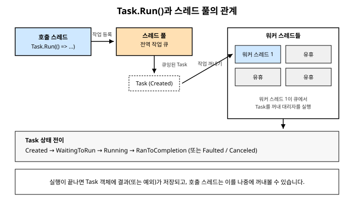

# 7장. Task와 TPL(Task Parallel Library) 기초

[◀ 이전: 6장. 스레드 풀(ThreadPool)](ch06-스레드풀.md) | [📖 목차](00-목차.md) | [다음: 8장. Task 조합과 예외 처리 ▶](ch08-Task조합과예외처리.md)


6장에서는 `ThreadPool`을 이용해 스레드를 직접 관리하는 부담을 덜어내는 방법을 살펴봤습니다. `ThreadPool.QueueUserWorkItem()`을 호출하면 워커 스레드가 알아서 작업을 실행해 주지만, 막상 사용해 보면 불편한 점이 금방 드러납니다. 작업이 언제 끝났는지 알 방법이 마땅치 않고, 작업의 결과값을 돌려받으려면 콜백이나 공유 변수를 직접 마련해야 하며, 작업 중 예외가 발생하면 그 예외를 누가 어떻게 처리해야 하는지도 명확하지 않습니다.

이런 문제를 해결하기 위해 .NET 4.0부터 `System.Threading.Tasks` 네임스페이스에 TPL(Task Parallel Library)이 도입되었습니다. TPL의 핵심에는 `Task`라는 타입이 있습니다. 이번 장에서는 `Task`가 정확히 무엇을 표현하는 객체인지, `ThreadPool`과는 어떤 관계인지, 그리고 결과를 기다리는 기본적인 방법들을 알아봅니다.

## 7.1 Task란 무엇인가

`Task`는 "지금 당장 결과가 준비되어 있지는 않지만, 언젠가 완료될 하나의 작업"을 표현하는 객체입니다. 이 정의에서 중요한 부분은 `Task` 객체 자체가 작업을 실행하는 주체가 아니라는 점입니다. `Task`는 작업의 실행 상태(아직 시작 전인지, 실행 중인지, 끝났는지, 실패했는지)와 그 결과(정상 결과값 또는 예외)를 담아두는 핸들에 가깝습니다.

이 개념이 낯설게 느껴진다면, 음식점에서 주문을 넣고 받는 진동벨을 떠올려 보세요. 진동벨 자체는 음식을 조리하지 않습니다. 하지만 진동벨을 손에 쥐고 있으면 "주문한 음식이 준비되면 알려줄게"라는 약속을 보장받은 것이고, 벨이 울리는 순간 카운터에 가서 완성된 음식을 받아올 수 있습니다. `Task`도 마찬가지로, 실제 작업(음식 조리)은 스레드 풀의 워커 스레드가 수행하고, `Task` 객체는 그 작업이 끝났는지 확인하고 결과를 받아오는 창구 역할을 합니다.

중요한 점은 `Task`가 반드시 별도의 스레드에서 실행되는 것을 의미하지는 않는다는 사실입니다. `Task`는 어디까지나 "비동기적으로 완료되는 작업의 추상화"이고, 그 작업이 실제로 어디서 실행되는지는 `Task`를 생성하는 방법에 따라 달라집니다. 예를 들어 뒤에서 살펴볼 `Task.Run()`은 스레드 풀의 워커 스레드에서 작업을 실행하지만, 9장에서 다룰 `TaskCompletionSource`나 비동기 I/O 기반의 `Task`는 스레드를 전혀 점유하지 않고도 완료될 수 있습니다. 이번 장과 다음 장에서는 우선 가장 기본적인 형태인, 스레드 풀 위에서 실행되는 `Task`에 집중합니다.

### Task와 ThreadPool의 관계

`Task.Run()`을 호출하면 내부적으로 무슨 일이 벌어질까요? 대략적인 흐름은 다음과 같습니다.

1. `Task.Run()`은 전달받은 대리자(delegate)를 감싸는 `Task` 객체를 생성합니다.
2. 이 `Task`는 스레드 풀의 작업 큐에 등록됩니다. (6장에서 살펴본 전역 큐와 스레드별 로컬 큐 구조를 그대로 사용합니다.)
3. 스레드 풀의 워커 스레드 중 하나가 큐에서 이 `Task`를 꺼내 대리자를 실행합니다.
4. 실행이 끝나면 결과값(또는 예외)이 `Task` 객체에 저장되고, `Task`의 상태가 완료 상태로 바뀝니다.

즉, `Task`는 `ThreadPool` 위에 얹힌 더 정교한 추상화라고 볼 수 있습니다. `ThreadPool.QueueUserWorkItem()`이 "이 코드를 실행해줘"라는 요청만 던지고 끝이라면, `Task.Run()`은 그 요청의 진행 상황을 추적할 수 있는 손잡이까지 함께 돌려줍니다. 이 관계를 그림으로 나타내면 다음과 같습니다.



## 7.2 Task.Run()으로 작업 시작하기

`Task.Run()`은 스레드 풀에서 실행할 작업을 등록하는 가장 기본적인 방법입니다. 반환값이 없는 작업은 `Task`로, 반환값이 있는 작업은 `Task<TResult>`로 표현됩니다.

### 결과가 없는 Task

```csharp
using System;
using System.Threading;
using System.Threading.Tasks;

Task task = Task.Run(() =>
{
    Console.WriteLine($"작업 실행 중 - 스레드 ID: {Environment.CurrentManagedThreadId}");
    Thread.Sleep(1000); // 시간이 걸리는 작업을 흉내냅니다.
    Console.WriteLine("작업 완료");
});

Console.WriteLine($"메인 스레드 ID: {Environment.CurrentManagedThreadId}");
Console.WriteLine("Task.Run() 호출 직후, 작업은 아직 끝나지 않았을 수 있습니다.");

task.Wait(); // 7.4절에서 자세히 다룹니다.
Console.WriteLine("이제 작업이 확실히 끝났습니다.");
```

`Task.Run()`은 대리자를 스레드 풀에 등록하자마자 즉시 반환됩니다. 즉, `Task.Run()`을 호출한 스레드는 작업이 끝나기를 기다리지 않고 다음 코드를 계속 실행합니다. 이것이 바로 `Task`가 제공하는 비동기성의 핵심입니다. "작업을 시작시키는 것"과 "작업의 결과를 사용하는 것" 사이에 시간적인 간격이 생기고, 그 사이에 호출 스레드는 다른 일을 할 수 있습니다.

### 결과가 있는 Task&lt;TResult&gt;

작업의 결과값을 돌려받아야 한다면 `Task<TResult>`를 사용합니다. `Task.Run()`에 전달하는 대리자가 값을 반환하면, 컴파일러가 자동으로 `Task<TResult>` 타입의 객체를 생성해 줍니다.

```csharp
using System;
using System.Threading.Tasks;

Task<int> sumTask = Task.Run(() =>
{
    int sum = 0;
    for (int i = 1; i <= 1000; i++)
    {
        sum += i;
    }
    return sum;
});

Console.WriteLine("합계를 계산하는 동안 다른 작업을 수행할 수 있습니다.");

int result = sumTask.Result; // 결과를 꺼내는 시점에 필요하다면 대기합니다.
Console.WriteLine($"1부터 1000까지의 합: {result}");
```

`Task<TResult>`는 `Task`를 상속하는 타입이므로, `Task`가 가진 상태 추적 기능(완료 여부, 예외 발생 여부 등)을 그대로 가지면서 `Result` 프로퍼티를 통해 결과값에 접근할 수 있는 기능이 추가된 형태입니다. 여러 개의 `Task<TResult>`를 조합해서 사용하는 방법은 8장에서 자세히 다룹니다.

> **참고: 제네릭 타입 매개변수 이름**
> TPL 관련 문서와 코드에서는 결과 타입을 나타내는 제네릭 매개변수로 관례적으로 `TResult`를 사용합니다. `Task<int>`, `Task<string>`, `Task<List<Order>>`처럼 어떤 타입이든 결과로 사용할 수 있습니다.

## 7.3 Task의 상태

모든 `Task` 객체는 `Status` 프로퍼티를 통해 자신의 현재 상태를 노출합니다. 실제로는 `TaskStatus` 열거형에 더 세분화된 값들(`WaitingForActivation`, `WaitingToRun`, `WaitingForChildrenToComplete` 등)이 정의되어 있지만, 개발자가 코드에서 실질적으로 관심을 갖게 되는 상태는 다음 다섯 가지로 요약할 수 있습니다.

| 상태 | 의미 |
|---|---|
| `Created` | `Task` 객체가 생성되었지만 아직 스케줄링(실행 예약)되지 않은 상태 |
| `Running` | 워커 스레드에서 실제로 대리자가 실행되고 있는 상태 |
| `RanToCompletion` | 예외 없이 정상적으로 실행을 마친 상태 |
| `Faulted` | 실행 중 처리되지 않은 예외가 발생해 실패로 끝난 상태 |
| `Canceled` | 취소 요청을 받아들여 실행이 중단된 상태 (11장에서 취소 토큰과 함께 자세히 다룹니다) |

```csharp
using System;
using System.Threading.Tasks;

Task<int> task = Task.Run(() => 42);
task.Wait();

Console.WriteLine(task.Status); // RanToCompletion

Task faultedTask = Task.Run(() => throw new InvalidOperationException("문제 발생"));
try
{
    faultedTask.Wait();
}
catch (AggregateException)
{
    // 8장에서 AggregateException을 자세히 다룹니다.
}

Console.WriteLine(faultedTask.Status); // Faulted
Console.WriteLine(faultedTask.IsFaulted); // True
```

`Task`는 `IsCompleted`, `IsCompletedSuccessfully`, `IsFaulted`, `IsCanceled`처럼 상태를 직접 물어볼 수 있는 편의 프로퍼티도 함께 제공합니다. `Status`를 직접 비교하는 것보다 이런 프로퍼티를 사용하는 편이 의도를 더 명확하게 드러냅니다.

한 가지 유의할 점은, `Task.Run()`으로 생성한 `Task`는 생성과 동시에 스케줄링까지 함께 이루어지기 때문에 `Created` 상태를 코드에서 직접 관찰하기는 어렵다는 것입니다. `Created` 상태는 `new Task(...)` 생성자로 `Task`를 만들고 `Start()`를 호출하기 전까지의 짧은 구간에서만 나타납니다. 이 책에서는 `new Task(...)` + `Start()` 조합보다 `Task.Run()`을 기본으로 사용합니다. 스레드 풀 옵션을 세밀하게 제어해야 하는 특수한 경우가 아니라면 `Task.Run()`이 더 안전하고 의도가 분명한 선택입니다.

## 7.4 Task.Wait()와 .Result로 결과 기다리기

지금까지의 예제에서 `task.Wait()`와 `sumTask.Result`를 이미 사용했습니다. 이 두 방법은 호출한 스레드를 블로킹시켜, 대상 `Task`가 완료될 때까지 그 자리에서 멈춰 기다리게 만듭니다.

```csharp
using System;
using System.Threading.Tasks;

Task<string> downloadTask = Task.Run(() =>
{
    // 네트워크 다운로드를 흉내내는 지연
    System.Threading.Thread.Sleep(2000);
    return "다운로드한 데이터";
});

downloadTask.Wait(); // 완료될 때까지 현재 스레드를 블로킹
Console.WriteLine(downloadTask.Result);

// 또는 Wait() 없이 Result에 바로 접근해도 동일하게 블로킹됩니다.
Task<int> quickTask = Task.Run(() => 7 * 6);
int value = quickTask.Result; // 아직 안 끝났다면 여기서 대기
Console.WriteLine(value);
```

`Wait()`는 반환값이 없는 `Task`에도, 반환값이 있는 `Task<TResult>`에도 사용할 수 있습니다. `Result`는 `Task<TResult>`에만 존재하며, 값을 꺼내는 것 자체가 "완료될 때까지 기다렸다가 값을 달라"는 의미를 내포하고 있습니다. `Wait()`에는 타임아웃이나 `CancellationToken`을 전달하는 오버로드도 준비되어 있어서, 무한정 기다리지 않도록 제한을 둘 수도 있습니다.

```csharp
bool completedInTime = downloadTask.Wait(TimeSpan.FromSeconds(1));
if (!completedInTime)
{
    Console.WriteLine("1초 안에 끝나지 않았습니다.");
}
```

### 동기적으로 기다리는 것의 위험성

`Wait()`와 `Result`는 사용법이 간단하지만, 실무에서는 신중하게 사용해야 합니다. 그 이유는 크게 세 가지입니다.

**첫째, 스레드를 낭비합니다.** `Wait()`를 호출한 스레드는 작업이 끝날 때까지 아무 일도 하지 못하고 그 자리에 멈춰 있습니다. 스레드 풀의 스레드에서 다시 `Wait()`로 다른 스레드 풀 작업을 기다리면, 스레드 풀의 가용 스레드 수가 그만큼 줄어드는 셈입니다. 스레드를 생성하고 유지하는 데는 비용이 들기 때문에, 이런 패턴이 누적되면 스레드 풀 고갈로 이어질 수 있습니다.

**둘째, 교착 상태(deadlock)를 유발할 수 있습니다.** 특히 UI 애플리케이션(WPF, WinForms)이나 과거의 ASP.NET처럼 특정 스레드에서만 특정 작업을 마무리 지어야 하는 동기화 컨텍스트가 존재하는 환경에서, UI 스레드가 `Task`의 `Wait()`나 `Result`를 호출하며 블로킹되어 있는데 그 `Task`의 완료 후속 처리가 다시 UI 스레드로 되돌아와야 하는 상황이 발생하면 서로가 서로를 기다리는 교착 상태에 빠질 수 있습니다. 이 문제는 `async`/`await`가 어떻게 다르게 동작하는지 이해해야 완전히 설명할 수 있는데, 9장과 10장에서 동기화 컨텍스트를 다룰 때 자세히 살펴봅니다.

**셋째, 예외 처리 방식이 직관적이지 않습니다.** `Wait()`나 `Result` 호출 중에 대상 `Task`가 실패한 상태였다면, 원본 예외가 그대로 던져지는 것이 아니라 `AggregateException`이라는 래퍼(wrapper) 예외로 감싸여 던져집니다. 이 부분은 8장에서 예외 처리를 다루며 자세히 설명하지만, 지금은 "동기적으로 결과를 기다리면 예외 처리도 한 단계 더 복잡해진다"는 점만 기억해 두면 충분합니다.

```csharp
Task faultyTask = Task.Run(() => throw new InvalidOperationException("실패!"));
try
{
    faultyTask.Wait();
}
catch (AggregateException ex)
{
    // 원본 예외인 InvalidOperationException이 아니라 AggregateException이 잡힙니다.
    Console.WriteLine($"래핑된 예외 타입: {ex.GetType().Name}");
    Console.WriteLine($"실제 원인: {ex.InnerException?.GetType().Name}");
}
```

이런 이유들 때문에, 실무 코드에서는 `Wait()`나 `Result`로 `Task`를 동기적으로 기다리는 대신 9장에서 배울 `await` 키워드를 사용하는 것이 훨씬 더 나은 선택입니다. `await`는 스레드를 블로킹하지 않고, 작업이 완료된 뒤 나머지 코드를 이어서 실행하도록 예약만 해 둡니다. 또한 예외도 `AggregateException`으로 감싸지 않고 원본 예외 타입 그대로 전파합니다. 이 책에서는 이후 장들에서 실제 애플리케이션 코드를 작성할 때는 `await`를 기본으로 사용하고, `Wait()`와 `Result`는 콘솔 애플리케이션의 `Main` 메서드처럼 `await`를 사용할 수 없는 극히 제한적인 상황이나 개념을 설명하기 위한 예제에서만 사용할 것을 권장합니다.

## 7.5 Task.Delay()로 시간 지연시키기

`Thread.Sleep()`은 2장과 3장에서 이미 다룬 적이 있습니다. `Thread.Sleep(1000)`을 호출하면 현재 스레드는 1초 동안 아무 일도 하지 못한 채 운영체제 스케줄러에게 대기 상태로 표시됩니다. 이 방식은 간단하지만, 스레드 하나를 통째로 낭비한다는 단점이 있습니다.

`Task.Delay()`는 같은 목적(일정 시간 후에 다음 동작을 진행하는 것)을 달성하지만, 그 방식이 근본적으로 다릅니다. `Task.Delay()`는 지정한 시간이 지나면 완료되는 `Task`를 반환하는데, 이 대기 시간 동안 어떤 스레드도 점유하지 않습니다. 내부적으로는 타이머를 등록해 두고, 타이머가 만료되면 그때서야 `Task`를 완료 상태로 바꾸는 방식으로 동작합니다.

```csharp
using System;
using System.Threading.Tasks;

Task delayTask = Task.Delay(TimeSpan.FromSeconds(2));
Console.WriteLine("대기를 시작했지만, 스레드는 점유되지 않습니다.");

delayTask.Wait(); // 여기서는 설명을 위해 동기적으로 기다립니다.
Console.WriteLine("2초가 지났습니다.");
```

위 예제에서 `delayTask.Wait()`를 호출한 부분은 사실 `Task.Delay()`의 장점을 제대로 살리지 못하는 사용법입니다. `Wait()`로 기다리면 결국 호출 스레드가 블로킹되기 때문입니다. `Task.Delay()`의 진짜 위력은 9장에서 살펴볼 `await Task.Delay(...)` 형태로 사용할 때 드러납니다. 이 경우 호출 스레드는 대기하는 동안 완전히 자유로워져 다른 작업을 처리할 수 있고, 지정한 시간이 지나면 스레드 풀의 어떤 스레드가 이어서 나머지 코드를 실행합니다.

`Thread.Sleep()`과 `Task.Delay()`의 차이를 표로 정리하면 다음과 같습니다.

| 구분 | `Thread.Sleep()` | `Task.Delay()` |
|---|---|---|
| 대기 방식 | 현재 스레드를 블로킹 | 타이머 기반, 스레드 미점유 |
| `await`와 결합 | 불가능(그 자체로 블로킹 호출) | 가능 (`await Task.Delay(...)`) |
| 취소 지원 | 없음 | `CancellationToken` 오버로드 제공 |
| 적합한 상황 | 스레드 자체를 일정 시간 멈춰야 하는 드문 경우 | 비동기 흐름에서의 지연, 폴링 간격, 재시도 대기 등 |

`Task.Delay()`는 재시도 로직에서 다음 시도까지의 간격을 두거나, 폴링(polling) 방식으로 어떤 상태를 주기적으로 확인할 때, 혹은 테스트 코드에서 비동기 지연을 흉내낼 때 자주 사용됩니다. 취소 토큰을 함께 전달할 수 있다는 점도 눈여겨볼 만한데, 이 부분은 11장에서 취소 패턴을 다룰 때 자세히 살펴봅니다.

```csharp
using System.Threading;

var cts = new CancellationTokenSource();
Task delayWithCancellation = Task.Delay(TimeSpan.FromSeconds(5), cts.Token);
// 필요하다면 cts.Cancel()을 호출해 대기를 즉시 중단시킬 수 있습니다.
```

## 요약

- `Task`는 미래에 완료될 작업을 표현하는 객체이며, 작업 자체를 실행하는 주체가 아니라 실행 상태와 결과를 추적하는 핸들입니다.
- `Task.Run()`은 대리자를 스레드 풀의 작업 큐에 등록하고, 워커 스레드가 이를 꺼내 실행합니다. 결과가 있는 작업은 `Task<TResult>`로 표현되며 `Result` 프로퍼티로 값을 꺼낼 수 있습니다.
- `Task`의 상태는 `Created`, `Running`, `RanToCompletion`, `Faulted`, `Canceled` 등으로 표현되며, `IsCompleted`, `IsFaulted` 같은 편의 프로퍼티로도 확인할 수 있습니다.
- `Wait()`와 `Result`는 호출 스레드를 블로킹시켜 결과를 기다립니다. 간단하지만 스레드 낭비, 교착 상태 위험, `AggregateException`으로 감싸지는 예외 처리 방식 때문에 실무 코드에서는 9장에서 배울 `await`를 사용하는 것이 더 안전합니다.
- `Task.Delay()`는 `Thread.Sleep()`과 달리 스레드를 점유하지 않는 타이머 기반의 지연을 제공하며, `await`와 결합했을 때 진가를 발휘합니다.

## 연습문제

1. `Task.Run()`으로 시작한 작업과 `Task.Run()`을 호출한 스레드가 각각 어떤 스레드 ID를 갖는지 `Environment.CurrentManagedThreadId`를 출력해서 확인해 보세요. 두 값이 항상 다른지, 같을 수도 있는지 실험해 보고 그 이유를 설명해 보세요.
2. 정수 배열을 입력받아 합계를 계산하는 `Task<int>`를 작성하고, `Result`로 결과를 받아오는 코드와 `Wait()` 후 별도 프로퍼티로 결과를 받아오는 코드를 각각 작성해 비교해 보세요.
3. 의도적으로 예외를 던지는 `Task`를 만들고, `Wait()`로 기다렸을 때 잡히는 예외의 타입과 `Status`, `IsFaulted` 값을 확인하는 코드를 작성해 보세요.
4. `Thread.Sleep(3000)`을 사용하는 버전과 `Task.Delay(3000).Wait()`를 사용하는 버전을 각각 작성하고, 동시에 여러 개를 실행했을 때 전체 소요 시간과 사용되는 스레드 수에 어떤 차이가 있는지 추론해 보세요. (실제 스레드 점유 차이를 관찰하려면 10장 이후에 배울 `await` 버전과 비교하는 것이 더 정확합니다.)
5. `Task`의 `Status` 프로퍼티가 `Created`로 남아 있는 상황을 직접 만들어 보세요. `new Task(...)` 생성자를 사용하고 `Start()`를 호출하기 전에 `Status`를 출력하면 어떤 값이 나오는지 확인해 보세요.

---

[◀ 이전: 6장. 스레드 풀(ThreadPool)](ch06-스레드풀.md) | [📖 목차](00-목차.md) | [다음: 8장. Task 조합과 예외 처리 ▶](ch08-Task조합과예외처리.md)
