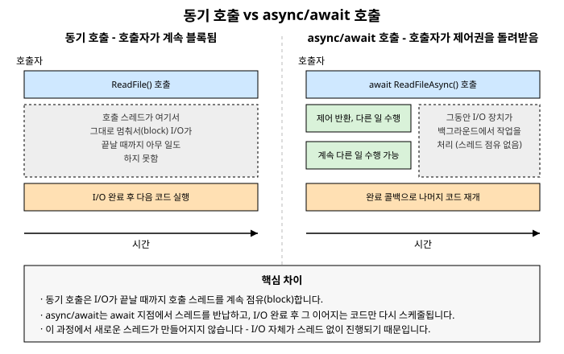

# 9장. async/await 기초

[◀ 이전: 8장. Task 조합과 예외 처리](ch08-Task조합과예외처리.md) | [📖 목차](00-목차.md) | [다음: 10장. async/await 심화 ▶](ch10-asyncawait심화.md)


8장에서는 `Task`를 조합하는 방법으로 `ContinueWith()`를 살펴보았습니다. `ContinueWith()`는 분명 콜백 지옥보다는 나은 방법이었지만, 여러 개의 비동기 작업을 순차적으로 이어 붙이거나 조건 분기를 섞으면 코드가 금방 읽기 어려워진다는 한계가 있었습니다. 이번 장에서는 C# 5.0부터 도입된 `async`/`await` 키워드가 이 문제를 어떻게 해결하는지, 그리고 그 이면에서 실제로 어떤 일이 벌어지는지를 자세히 살펴봅니다.

## 9.1 async/await가 필요했던 이유

먼저 8장에서 다뤘던 방식으로 "파일을 읽고, 그 내용을 가공한 뒤, 결과를 다시 파일에 저장하는" 작업을 표현해 보겠습니다.

```csharp
Task<string> readTask = File.ReadAllTextAsync("input.txt");

readTask.ContinueWith(t =>
{
    string processed = t.Result.ToUpperInvariant();
    return File.WriteAllTextAsync("output.txt", processed);
}).Unwrap().ContinueWith(t =>
{
    if (t.IsFaulted)
    {
        Console.WriteLine($"오류 발생: {t.Exception?.InnerException?.Message}");
    }
    else
    {
        Console.WriteLine("작업 완료");
    }
});
```

이 코드는 몇 줄 안 되는데도 `Unwrap()`을 챙겨야 하고, `t.Result`와 `t.Exception?.InnerException`처럼 `Task` 내부를 직접 들여다봐야 하며, 실제 로직의 흐름(읽기 → 가공 → 쓰기 → 완료 보고)이 콜백들 사이에 흩어져 있습니다. 만약 여기에 조건문이나 반복문, 추가적인 예외 처리가 끼어들면 가독성은 급격히 떨어집니다.

`async`/`await`를 사용하면 같은 로직을 다음과 같이 표현할 수 있습니다.

```csharp
async Task ProcessFileAsync()
{
    try
    {
        string content = await File.ReadAllTextAsync("input.txt");
        string processed = content.ToUpperInvariant();
        await File.WriteAllTextAsync("output.txt", processed);
        Console.WriteLine("작업 완료");
    }
    catch (Exception ex)
    {
        Console.WriteLine($"오류 발생: {ex.Message}");
    }
}
```

두 코드는 실행 시점에 벌어지는 일이 거의 동일합니다. 그런데도 두 번째 코드는 마치 동기 코드를 읽듯이 위에서 아래로 순서대로 읽힙니다. `try`/`catch`도 일반적인 동기 코드에서 쓰던 것을 그대로 사용할 수 있고, `if`나 `for`, `while` 같은 제어 구문도 아무 제약 없이 섞어 쓸 수 있습니다.

이것이 `async`/`await`가 등장한 근본적인 이유입니다. **비동기 작업의 실행 방식(스레드를 점유하지 않고 대기한다는 것)은 그대로 유지하면서, 그것을 표현하는 코드의 모양은 동기 코드와 똑같이 만드는 것**입니다. 컴파일러가 `await` 지점을 기준으로 코드를 잘라서 콜백 체인으로 재작성해 주기 때문에, 개발자는 더 이상 `ContinueWith()`와 `Unwrap()`을 손으로 조립할 필요가 없습니다. 이 변환이 정확히 어떻게 이루어지는지는 10장에서 상태 머신(state machine)이라는 개념으로 자세히 다룰 것입니다.

## 9.2 가장 흔한 오해: async/await는 새 스레드를 만들지 않는다

`async`/`await`를 처음 배우는 사람들이 가장 많이 하는 오해는 "`async` 메서드를 호출하면 별도의 스레드에서 실행된다"는 것입니다. 이는 사실이 아닙니다.

**`async` 키워드는 스레드를 전혀 만들지 않습니다.** `async`는 단지 컴파일러에게 "이 메서드 안에서 `await`를 사용할 것이며, 이 메서드를 상태 머신으로 변환해 달라"고 알려주는 표시일 뿐입니다. 실제로 스레드가 새로 생성되는지 여부는 `await` 대상이 되는 작업이 **무엇을 하는가**에 달려 있습니다.

이 지점을 이해하려면 작업을 두 가지로 구분해야 합니다.

- **I/O 바운드 작업**: 파일 읽기/쓰기, 네트워크 요청, 데이터베이스 쿼리처럼 CPU가 아니라 디스크 컨트롤러, 네트워크 카드, 원격 서버 등 외부 자원이 실제 작업을 수행하고 우리는 그 결과를 기다리기만 하는 작업
- **CPU 바운드 작업**: 대량의 숫자 계산, 이미지 처리, 정렬 알고리즘처럼 CPU 코어가 쉬지 않고 계산을 수행해야 끝나는 작업

I/O 바운드 작업에서 `await`가 하는 일은 놀랍도록 효율적입니다. 예를 들어 `File.ReadAllTextAsync()`나 `HttpClient.GetAsync()`를 호출하면, 그 내부에서는 운영체제의 비동기 I/O API(윈도우의 I/O 완료 포트 등)에 "이 파일을 읽어서 끝나면 알려줘"라고 요청을 던지고, **그 즉시 제어를 반환합니다.** 이 시점에는 그 어떤 스레드도 결과를 기다리며 블록되어 있지 않습니다. 요청을 보낸 스레드는 스레드 풀로 돌아가 다른 작업을 처리할 수 있고, 디스크 컨트롤러가 데이터를 다 읽으면 운영체제가 인터럽트를 걸어 완료를 알리고, 그때서야 스레드 풀에서 (반드시 원래 그 스레드일 필요는 없는) 스레드 하나가 배정되어 `await` 이후의 나머지 코드를 실행합니다.

즉, I/O가 진행되는 동안에는 **스레드를 하나도 쓰지 않습니다.** 스레드는 "요청을 보낼 때" 잠깐, 그리고 "결과가 도착해서 나머지 코드를 실행할 때" 잠깐만 사용될 뿐, I/O가 실제로 진행되는 구간에는 관여하지 않습니다. 이것이 바로 `async`/`await`가 I/O 바운드 작업에서 확장성을 크게 높여주는 이유입니다. 스레드 하나가 수천 개의 대기 중인 I/O 요청을 동시에 "기다릴" 수 있는 것처럼 보이는 이유도 여기에 있습니다. 실제로는 아무도 기다리고 있지 않기 때문입니다.

반면 CPU 바운드 작업은 이야기가 다릅니다. 실제로 계산을 수행할 무언가가 필요하기 때문에, CPU 바운드 작업을 비동기로 만들고 싶다면 명시적으로 다른 스레드(보통 6장에서 다룬 스레드 풀의 작업자 스레드)에 계산을 위임해야 합니다. 이때 사용하는 것이 7장에서 배운 `Task.Run()`입니다.

```csharp
async Task<long> ComputeSumAsync(int[] numbers)
{
    // CPU 바운드 작업이므로 Task.Run으로 스레드 풀에 위임
    long sum = await Task.Run(() =>
    {
        long total = 0;
        foreach (int n in numbers)
        {
            total += HeavyComputation(n);
        }
        return total;
    });

    return sum;
}
```

여기서 `await`가 기다리는 대상은 "스레드 풀 작업자 스레드가 계산을 끝내는 것"입니다. 스레드는 분명히 사용되지만, 그 스레드를 점유하는 것은 호출자가 아니라 `Task.Run()`이 배정한 스레드 풀 스레드이며, 호출자 스레드(예를 들어 UI 스레드)는 `await`를 만나는 즉시 자유로워집니다. 9.4절에서 이 구분을 좀 더 실전적인 기준으로 다시 정리하겠습니다.

> **핵심 요약**: `async`/`await`는 스레드를 만드는 도구가 아니라, "지금 이 스레드를 계속 점유할 필요가 없다"는 사실을 표현하고 나중에 이어서 실행할 수 있게 해주는 **제어 흐름 재구성 도구**입니다.

## 9.3 async Task, async Task\<T\>, async void

`async` 메서드는 반환 타입에 따라 세 가지 형태로 나뉩니다.

### async Task

반환값이 없는 비동기 메서드는 `void` 대신 `Task`를 반환 타입으로 선언합니다.

```csharp
async Task SaveLogAsync(string message)
{
    await File.AppendAllTextAsync("log.txt", message + Environment.NewLine);
}
```

호출자는 이 메서드가 반환한 `Task`를 `await`하거나, 완료를 기다렸다가 예외를 확인할 수 있습니다. `void`가 아니라 `Task`를 반환하기 때문에, 메서드 내부에서 예외가 발생하면 그 예외는 반환된 `Task`에 담겨 호출자에게 전달됩니다. 이는 7장, 8장에서 다룬 `Task`의 예외 전파 방식과 동일합니다.

### async Task\<T\>

값을 반환해야 하는 비동기 메서드는 `Task<T>`를 반환 타입으로 선언합니다.

```csharp
async Task<int> CountLinesAsync(string path)
{
    string content = await File.ReadAllTextAsync(path);
    return content.Split('\n').Length;
}
```

주목할 점은 `return` 문에서 `int`를 그대로 반환한다는 것입니다. `Task<int>`를 직접 만들어서 반환하는 것이 아닙니다. 컴파일러가 상태 머신을 생성하면서, 이 메서드가 호출되는 즉시 `Task<int>`를 만들어 호출자에게 돌려주고, 메서드 본문의 실행이 끝나 `return content.Split('\n').Length`에 도달하면 그 결과값을 미리 만들어 둔 `Task<int>`의 결과로 채워 넣습니다.

### async void

`async void`는 반환할 `Task`가 없는 특수한 형태로, **오직 이벤트 핸들러를 작성할 때만** 사용해야 합니다.

```csharp
private async void Button_Click(object sender, EventArgs e)
{
    button.Enabled = false;
    try
    {
        await LoadDataAsync();
    }
    finally
    {
        button.Enabled = true;
    }
}
```

이벤트 핸들러는 애초에 `void EventHandler(object sender, EventArgs e)`처럼 시그니처가 프레임워크에 의해 고정되어 있어서 `Task`를 반환하도록 바꿀 수 없습니다. 이런 경우에 한해 `async void`가 예외적으로 허용됩니다.

`async void`를 일반적인 메서드에는 절대로 사용하면 안 됩니다. 이유는 크게 두 가지입니다.

1. **예외를 잡을 방법이 없습니다.** `async Task` 메서드는 예외가 반환된 `Task` 객체에 담기므로 호출자가 `await` 시점에 `try`/`catch`로 잡을 수 있습니다. 그러나 `async void` 메서드는 반환할 `Task`가 없으므로, 메서드 내부에서 처리되지 않은 예외는 호출자의 `try`/`catch`를 그냥 건너뛰고 곧바로 현재의 `SynchronizationContext`(또는 스레드 풀)로 던져집니다. 그 결과 대부분의 경우 애플리케이션이 그대로 크래시합니다.
2. **완료 시점을 추적할 수 없습니다.** `Task`를 반환하지 않으므로 호출자는 이 메서드가 언제 끝나는지 `await`로 기다릴 방법이 없습니다. 테스트 코드에서 `async void` 메서드를 호출하면 메서드가 끝나기도 전에 테스트가 종료돼 버리는 문제가 대표적입니다.

`async void`의 위험성과 이를 피해야 하는 구체적인 이유는 18장에서 코드 작성 습관과 디버깅을 다룰 때 다시 짚어보겠습니다. 지금 단계에서 기억할 원칙은 단순합니다.

> **원칙**: 새로 작성하는 비동기 메서드는 반환값이 없다면 `async Task`를, 값을 반환한다면 `async Task<T>`를 사용하세요. `async void`는 이벤트 핸들러를 작성할 때만 예외적으로 허용됩니다.

## 9.4 await를 만나면 실제로 무슨 일이 벌어지는가

`await` 키워드가 등장하는 지점에서 벌어지는 일을 단계별로 따라가 보겠습니다. 다음 코드를 예로 들겠습니다.

```csharp
async Task<string> DownloadAndSummarizeAsync(string url)
{
    Console.WriteLine("1. 다운로드 시작");
    string content = await DownloadAsync(url);   // ← 여기서 await
    Console.WriteLine("3. 다운로드 완료, 요약 시작");
    return Summarize(content);
}
```

`DownloadAndSummarizeAsync()`가 호출되면 다음과 같은 순서로 진행됩니다.

1. 메서드가 시작되고 `Console.WriteLine("1. 다운로드 시작")`이 동기적으로 실행됩니다. 이 시점까지는 일반 메서드와 완전히 동일하게, 호출한 스레드가 그대로 실행합니다.
2. `DownloadAsync(url)`이 호출되어 `Task<string>`을 반환합니다. 이 `Task`는 아직 완료되지 않았을 수도, 이미 완료되어 있을 수도 있습니다(예를 들어 결과가 캐시되어 있었다면 즉시 완료된 `Task`가 반환될 수 있습니다).
3. `await`는 이 `Task`의 완료 여부를 확인합니다.
   - **이미 완료되어 있다면**: 별다른 중단 없이 곧바로 다음 줄로 진행합니다. 즉, 항상 비동기 전환이 일어나는 것은 아닙니다.
   - **아직 완료되지 않았다면**(대부분의 실제 I/O 상황): 여기서부터가 핵심입니다. `await`는 **현재 메서드의 실행을 일시 중단**하고, 이 `Task`가 완료되었을 때 나머지 코드(3번째 줄부터)를 실행하도록 콜백(연속 실행, continuation)을 등록한 뒤, **호출자에게 제어를 즉시 돌려줍니다.** `DownloadAndSummarizeAsync()`를 호출한 스레드는 이 시점에 블록되지 않고 자유로워지며, `DownloadAndSummarizeAsync()`가 반환한(아직 완료되지 않은) `Task<string>`을 받아서 원하는 다른 작업을 계속할 수 있습니다.
4. 시간이 흘러 `DownloadAsync()`의 I/O 작업이 실제로 끝나면, 그 결과와 함께 3번에서 등록해 둔 콜백이 실행됩니다. 이 콜백은 `content` 변수에 결과값을 채워 넣고, `Console.WriteLine("3. 다운로드 완료, 요약 시작")`부터 `return Summarize(content)`까지 마저 실행합니다. 이때 실행을 재개하는 스레드는 상황에 따라 원래 호출했던 스레드와 다를 수도 있습니다(콘솔 앱이나 ASP.NET Core에서는 스레드 풀의 아무 스레드나 배정됩니다). 이 부분은 10장에서 `SynchronizationContext`를 다룰 때 더 정확하게 설명하겠습니다.
5. 나머지 코드까지 모두 실행되고 `return`에 도달하면, 3번에서 호출자에게 돌려주었던 `Task<string>`이 그 결과값과 함께 완료 상태로 바뀝니다. 만약 호출자가 그 `Task`를 `await`하고 있었다면, 이제 호출자 쪽의 나머지 코드가 이어서 실행됩니다.

이 흐름에서 가장 중요하게 짚어야 할 부분은 3번입니다. **"실행을 일시 중단하고 호출자에게 제어를 돌려준다"**는 말은 스레드가 그 자리에서 멈춰 있다는 뜻이 아닙니다. 스레드는 완전히 자유로워져서 호출 스택을 거슬러 올라가 호출자에게 돌아가며, 호출자는 이 시점부터 자기 할 일을 계속합니다. `DownloadAndSummarizeAsync()`의 "나머지 코드"는 메서드 실행이 멈춘 그 위치에 저장되어 있다가, 나중에 완료 콜백이 실행될 때 그 위치에서부터 재개됩니다. 이 "실행 위치와 지역 변수를 저장했다가 나중에 그 지점부터 재개한다"는 메커니즘이 바로 컴파일러가 생성하는 상태 머신의 역할이며, 10장에서 자세히 다룹니다.

앞서 설명한 내용을 그림으로 정리하면 다음과 같습니다.



왼쪽은 동기 호출입니다. 호출자는 `ReadFile()`을 호출한 뒤 I/O가 끝날 때까지 그 자리에서 완전히 멈춰 있습니다. 그동안 호출 스레드는 다른 어떤 일도 할 수 없습니다. 오른쪽은 `await`를 사용한 호출입니다. 호출자는 `await ReadFileAsync()`를 호출한 즉시 제어를 돌려받아 다른 작업을 계속 수행하고, I/O가 백그라운드에서 진행되는 동안에는 어떤 스레드도 점유되지 않습니다. I/O가 끝나면 그 완료를 계기로 나머지 코드가 (스레드 풀의 스레드에 의해) 이어서 실행됩니다.

## 9.5 CPU 바운드 작업과 I/O 바운드 작업, async/await를 쓰는 방식의 차이

9.2절에서 잠깐 언급했던 구분을 실전적인 기준으로 정리해 보겠습니다. `async`/`await`를 쓸 때 가장 자주 하는 실수 중 하나가 이 두 가지를 혼동하는 것입니다.

### I/O 바운드 작업: 그대로 await

.NET 클래스 라이브러리가 제공하는 I/O 관련 API는 대부분 이미 비동기 버전(`*Async` 메서드)을 제공합니다. 이런 메서드들은 내부적으로 운영체제의 비동기 I/O를 사용하도록 구현되어 있으므로, 그냥 `await`하면 됩니다. `Task.Run()`으로 감쌀 필요가 전혀 없습니다.

```csharp
// 올바른 방법: 그대로 await
async Task<string> LoadConfigAsync(string path)
{
    return await File.ReadAllTextAsync(path);
}

// 이렇게 하면 안 됨: 불필요하게 스레드 풀 스레드를 하나 더 사용
async Task<string> LoadConfigAsync_Bad(string path)
{
    return await Task.Run(() => File.ReadAllText(path));
}
```

두 번째 코드는 겉보기에는 비슷해 보이지만 실제로는 스레드 풀 스레드 하나를 빌려서 그 스레드 안에서 **동기 버전**의 `File.ReadAllText()`를 호출하고, 그 스레드가 I/O가 끝날 때까지 블록되도록 만듭니다. I/O 자체는 비동기로 흘러갈 수 있는데 억지로 스레드 하나를 붙잡아 두는 셈이니, `File.ReadAllTextAsync()`를 직접 `await`하는 첫 번째 방식보다 자원을 낭비하게 됩니다. 네트워크 요청(`HttpClient.GetAsync()`), 데이터베이스 접근(`SqlCommand.ExecuteReaderAsync()` 등) 모두 같은 원칙이 적용됩니다.

### CPU 바운드 작업: Task.Run으로 감싸서 await

반대로 계산이 오래 걸리는 CPU 바운드 작업에는 애초에 비동기 API가 존재하지 않습니다. "계산을 비동기로 만든다"는 것 자체가, 사실은 "그 계산을 다른 스레드(주로 스레드 풀 작업자 스레드)에 맡기고, 지금 이 스레드는 자유롭게 풀어준다"는 뜻이기 때문입니다. 이때 `Task.Run()`이 그 위임 역할을 합니다.

```csharp
// UI 스레드에서 호출된다고 가정
async void OnCalculateButtonClick()
{
    resultLabel.Text = "계산 중...";

    // CPU 바운드 계산이므로 Task.Run으로 감싼다
    long result = await Task.Run(() => CalculatePrimesUpTo(10_000_000));

    resultLabel.Text = $"결과: {result}";
}
```

여기서 `Task.Run()`이 없다면 `CalculatePrimesUpTo()`가 UI 스레드 위에서 그대로 실행되어 계산이 끝날 때까지 UI가 멈춰 버립니다(응답 없음 상태). `Task.Run()`으로 감싸면 계산은 스레드 풀 작업자 스레드에서 진행되고, UI 스레드는 `await` 지점에서 곧바로 풀려나 화면을 계속 그리고 사용자 입력을 받을 수 있습니다.

콘솔 애플리케이션이나 ASP.NET Core처럼 "블록해서는 안 되는 특정 스레드"가 없는 서버 환경에서는 상황이 조금 다릅니다. 요청을 처리하는 스레드가 잠깐 CPU 바운드 계산으로 막힌다고 해도 심각한 문제가 되지 않을 수도 있지만, 서버는 보통 수많은 요청을 동시에 처리해야 하므로 CPU 바운드 작업을 무분별하게 `Task.Run()`으로 스레드 풀에 떠넘기면 오히려 스레드 풀 고갈로 이어질 수 있습니다. 이런 트레이드오프와 스레드 풀의 동작 원리는 6장에서 다룬 내용과 12장의 병렬 프로그래밍에서 다시 연결됩니다. 지금 단계에서 기억해야 할 기준은 다음과 같습니다.

| 작업 종류 | 예시 | 처리 방법 |
|---|---|---|
| I/O 바운드 | 파일 읽기/쓰기, 네트워크 요청, DB 쿼리 | 제공되는 `*Async` 메서드를 그대로 `await` |
| CPU 바운드 | 대량 계산, 이미지/영상 처리, 정렬 | `Task.Run()`으로 스레드 풀에 위임한 뒤 `await` |

이 표를 "무조건 외워서 적용하는 규칙"이 아니라, "지금 기다리는 대상이 외부 자원의 응답인가, 아니면 CPU 계산 그 자체인가"를 스스로 묻는 습관으로 받아들이는 것이 중요합니다. 그 답에 따라 `Task.Run()`이 필요한지 아닌지가 자연스럽게 결정됩니다.

## 요약

- `async`/`await`는 8장에서 다룬 `ContinueWith()` 체이닝을 대체하기 위해 등장했습니다. 실행 방식은 동일하지만, 코드를 동기 코드처럼 위에서 아래로 읽을 수 있게 해 줍니다.
- **`async`/`await`는 새로운 스레드를 만들지 않습니다.** I/O 바운드 작업에서 `await`는 운영체제의 비동기 I/O에 요청만 던져 놓고 어떤 스레드도 점유하지 않은 채 대기하며, 작업이 끝나면 스레드 풀의 스레드가 나머지 코드를 이어서 실행합니다.
- `async` 메서드는 반환값이 없으면 `async Task`, 값을 반환하면 `async Task<T>`로 선언합니다. `async void`는 예외를 호출자가 잡을 수 없고 완료를 추적할 수도 없으므로, 시그니처를 바꿀 수 없는 이벤트 핸들러에서만 예외적으로 사용해야 합니다(18장에서 위험성을 더 자세히 다룹니다).
- `await`를 만나면 대상 `Task`가 완료되지 않은 경우, 메서드 실행이 일시 중단되고 나머지 코드가 콜백으로 등록된 뒤 호출자에게 제어가 즉시 돌아갑니다. 작업이 끝나면 그 콜백이 실행되어 나머지 코드가 이어집니다.
- I/O 바운드 작업은 제공되는 `*Async` 메서드를 그대로 `await`하면 되고, CPU 바운드 작업은 `Task.Run()`으로 스레드 풀에 위임한 뒤 그 결과를 `await`해야 합니다. 이 둘을 혼동하면 불필요한 스레드 낭비나 UI 응답 없음 문제로 이어집니다.

## 연습문제

1. 다음 두 메서드의 실행 결과(어떤 스레드에서, 몇 개의 스레드가 사용되는지)를 비교하여 설명하세요.
   ```csharp
   async Task<string> A() => await File.ReadAllTextAsync("a.txt");
   async Task<string> B() => await Task.Run(() => File.ReadAllText("a.txt"));
   ```
2. "`async` 키워드를 붙이면 메서드가 자동으로 별도의 스레드에서 실행된다"는 말이 왜 틀렸는지, I/O 바운드 작업을 예로 들어 설명하세요.
3. 시그니처가 `void OnTimerElapsed(object sender, ElapsedEventArgs e)`로 고정된 이벤트 핸들러 안에서 비동기 작업을 수행해야 합니다. 왜 `async Task`로 바꿀 수 없는지, 그리고 이 경우 예외 처리를 어떻게 해야 안전한지 설명하세요.
4. 다음 메서드에는 문제가 있습니다. 무엇이 잘못되었는지 지적하고 수정하세요.
   ```csharp
   async Task<int[]> SortLargeArrayAsync(int[] data)
   {
       Array.Sort(data);  // 원소 수백만 개, CPU 바운드 작업
       return await Task.FromResult(data);
   }
   ```
5. `await` 지점에서 "메서드 실행이 일시 중단되고 호출자에게 제어가 돌아간다"는 문장을 자신의 언어로 다시 설명하고, 이 동작이 왜 스레드를 블록하는 것과 다른지 서술하세요.

---

[◀ 이전: 8장. Task 조합과 예외 처리](ch08-Task조합과예외처리.md) | [📖 목차](00-목차.md) | [다음: 10장. async/await 심화 ▶](ch10-asyncawait심화.md)
