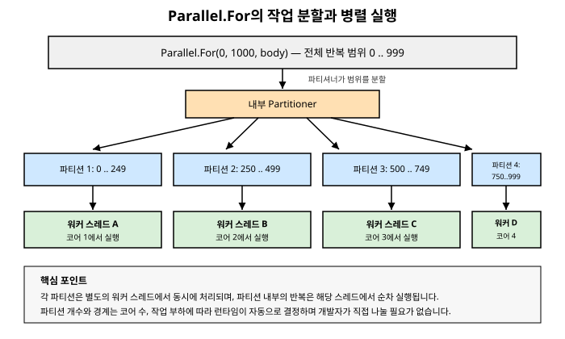

# 12장. 병렬 프로그래밍(Parallel 클래스)

[◀ 이전: 11장. 취소와 진행률 보고](ch11-취소와진행률보고.md) | [📖 목차](00-목차.md) | [다음: 13장. PLINQ ▶](ch13-PLINQ.md)


## 동시성에서 병렬성으로

1장에서 우리는 동시성(concurrency)과 병렬성(parallelism)을 구분했습니다. 동시성은 여러 작업을 "번갈아가며" 또는 "기다리는 동안 다른 일을 하며" 진행 관리하는 것이고, 병렬성은 여러 작업을 실제로 "동시에, 서로 다른 CPU 코어에서" 실행하는 것입니다.

7장부터 11장까지 다룬 `Task`, `async`/`await`, 취소, 진행률 보고는 대부분 **동시성**의 영역에 속했습니다. 네트워크 요청이 돌아오기를 기다리거나, 파일 I/O가 끝나기를 기다리는 동안 스레드를 놀리지 않고 다른 일을 할 수 있게 해주는 도구들이었습니다. 이런 작업들은 대부분 I/O 바운드(I/O-bound)이며, 실제로 CPU가 계산을 수행하는 시간은 짧습니다.

이 장부터는 방향을 바꿉니다. 지금부터 다룰 것은 **CPU 바운드(CPU-bound)** 작업—대량의 숫자 계산, 이미지 처리, 데이터 변환처럼 CPU가 쉬지 않고 계산을 수행해야 하는 작업—을 여러 코어에 나눠서 진짜로 동시에 실행시키는 방법입니다. 이것이 바로 **병렬성**이고, .NET에서 이를 가장 손쉽게 실현해주는 도구가 `System.Threading.Tasks.Parallel` 클래스입니다.

`Parallel` 클래스는 내부적으로 `Task`와 스레드 풀(6장)을 그대로 활용합니다. 즉 완전히 새로운 실행 모델이 아니라, 반복문이나 독립적인 작업들을 스레드 풀 위에 자동으로 분산시켜주는 편의 계층이라고 이해하면 됩니다.

## Parallel.For — 반복문을 여러 코어에 분산하기

가장 흔한 CPU 바운드 패턴은 큰 배열이나 컬렉션의 각 원소에 대해 독립적인 계산을 반복하는 것입니다. 예를 들어 배열의 각 원소를 어떤 무거운 함수로 변환하는 경우를 생각해봅시다.

```csharp
void TransformSequential(double[] data)
{
    for (int i = 0; i < data.Length; i++)
    {
        data[i] = HeavyComputation(data[i]);
    }
}
```

이 코드는 `data.Length`가 아무리 크더라도, 처음부터 끝까지 단 하나의 스레드(단 하나의 코어)에서만 실행됩니다. 만약 각 원소의 계산이 서로 완전히 독립적이라면—즉 `data[i]`를 계산하는 데 `data[j]`(i≠j)의 값이 전혀 필요 없다면—이 반복문은 여러 코어에 나눠서 동시에 처리해도 결과가 달라지지 않습니다. 이런 상황에 정확히 맞는 도구가 `Parallel.For()`입니다.

```csharp
void TransformParallel(double[] data)
{
    Parallel.For(0, data.Length, i =>
    {
        data[i] = HeavyComputation(data[i]);
    });
}
```

`Parallel.For(fromInclusive, toExclusive, body)`는 `for (int i = fromInclusive; i < toExclusive; i++) body(i);`와 논리적으로 동일한 일을 하지만, 내부적으로 전체 범위를 여러 개의 **파티션(partition)**으로 나누고, 각 파티션을 스레드 풀의 서로 다른 워커 스레드에 배정해서 동시에 실행합니다. 파티션을 몇 개로 나눌지, 어떤 크기로 나눌지는 개발자가 신경 쓸 필요 없이 런타임이 사용 가능한 코어 수와 부하 상황을 고려해 자동으로 결정합니다.



`Parallel.For()`는 `ParallelLoopResult`를 반환하는데, 여기에는 루프가 끝까지 완료됐는지(`IsCompleted`), 만약 중간에 멈췄다면 어느 인덱스까지 처리됐는지(`LowestBreakIteration`) 같은 정보가 담겨 있습니다.

```csharp
ParallelLoopResult result = Parallel.For(0, data.Length, i =>
{
    data[i] = HeavyComputation(data[i]);
});

Console.WriteLine(result.IsCompleted ? "모두 완료" : "일부만 완료");
```

### Parallel.ForEach — 컬렉션 순회를 병렬화하기

배열처럼 인덱스로 접근할 필요 없이, `IEnumerable<T>`를 순회하며 각 원소에 독립적인 작업을 적용하고 싶을 때는 `Parallel.ForEach()`를 사용합니다.

```csharp
List<string> imagePaths = GetImagePaths();

// 순차 버전
foreach (string path in imagePaths)
{
    ResizeAndSave(path);
}

// 병렬 버전
Parallel.ForEach(imagePaths, path =>
{
    ResizeAndSave(path);
});
```

`Parallel.ForEach()`는 소스가 `IEnumerable<T>`이기만 하면 동작하므로, 리스트뿐 아니라 `IEnumerable<T>`를 구현하는 임의의 컬렉션—파일 시스템을 지연 열거하는 `Directory.EnumerateFiles()` 같은 경우도 포함해서—에 그대로 적용할 수 있습니다.

### 언제 병렬 반복문을 써야 하는가

`Parallel.For`/`Parallel.ForEach`로 바꾼다고 항상 빨라지는 것은 아닙니다. 다음 조건을 반드시 확인해야 합니다.

- **각 반복이 서로 독립적이어야 합니다.** 한 반복의 결과가 다른 반복에 영향을 주거나, 반복 순서에 의존하는 로직이 있다면 병렬화는 잘못된 결과를 낳습니다.
- **반복당 작업량이 충분히 커야 합니다.** 파티션을 나누고, 워커 스레드를 배정하고, 결과를 취합하는 데도 오버헤드가 듭니다. `data[i] = data[i] + 1;`처럼 극도로 가벼운 작업을 병렬화하면, 병렬화에 드는 오버헤드가 병렬 실행으로 얻는 이득보다 커져서 오히려 순차 버전보다 느려질 수 있습니다.
- **I/O 바운드 작업에는 적합하지 않습니다.** 네트워크 요청처럼 대기 시간이 대부분인 작업은 `Parallel`보다 `Task.WhenAll`(8장)이나 비동기 스트리밍(15장, 16장)이 더 적합합니다. `Parallel`의 워커 스레드가 I/O를 기다리며 블로킹되면 스레드 풀 자원을 낭비하게 됩니다.

실무에서는 "일단 병렬화해보고 벤치마크로 측정한다"는 태도가 중요합니다. 데이터 규모와 하드웨어에 따라 손익분기점이 다르기 때문에, 직관만으로 판단하기보다 실제로 `Stopwatch`나 벤치마킹 도구로 순차/병렬 버전을 비교해보는 습관을 들이는 것이 좋습니다.

## Parallel.Invoke — 서로 다른 여러 작업을 동시에 실행하기

`Parallel.For`/`ForEach`가 "같은 종류의 작업을 여러 데이터에 반복 적용"하는 데 쓰인다면, `Parallel.Invoke()`는 "서로 다른, 독립적인 작업 여러 개를 한꺼번에 실행"하는 데 사용합니다.

```csharp
void RunAllChecks()
{
    Parallel.Invoke(
        () => ValidateInventory(),
        () => ValidatePricing(),
        () => ValidateShippingRules()
    );

    Console.WriteLine("모든 검증이 완료되었습니다.");
}
```

`Parallel.Invoke()`는 넘겨받은 `Action` 델리게이트들을 각각 별도의 스레드 풀 작업으로 실행하고, **모든 델리게이트가 완료될 때까지 호출 스레드를 블로킹한 채로 기다립니다.** 이 점에서 8장에서 다룬 `Task.WhenAll()`과 목적이 비슷하지만 중요한 차이가 있습니다. `Task.WhenAll()`은 `await`로 기다리는 비동기 대기이므로 호출 스레드를 블로킹하지 않는 반면, `Parallel.Invoke()`는 동기적으로 블로킹합니다. 따라서 `Parallel.Invoke()`는 이미 별도의 백그라운드 스레드나 콘솔 애플리케이션의 흐름처럼 블로킹이 문제되지 않는 CPU 바운드 시나리오에 적합하며, UI 스레드나 비동기 요청 처리 스레드에서 직접 호출하는 것은 피해야 합니다.

전달하는 각 작업 내부에서 발생한 예외는 개별적으로 발생하더라도 모두 모여서 하나의 `AggregateException`으로 던져집니다. 이는 8장에서 살펴본 `Task.WhenAll()`의 예외 취합 방식과 같은 철학을 공유합니다.

```csharp
try
{
    Parallel.Invoke(
        () => throw new InvalidOperationException("A 실패"),
        () => throw new InvalidOperationException("B 실패")
    );
}
catch (AggregateException ex)
{
    foreach (Exception inner in ex.InnerExceptions)
    {
        Console.WriteLine(inner.Message);
    }
}
```

## ParallelOptions로 병렬도 제어하기

`Parallel.For`, `Parallel.ForEach`, `Parallel.Invoke`는 모두 `ParallelOptions`를 받는 오버로드를 제공합니다. 이를 통해 병렬 실행의 세부 동작을 조정할 수 있는데, 가장 자주 쓰이는 것이 **최대 병렬도(degree of parallelism)** 제한입니다.

```csharp
var options = new ParallelOptions
{
    MaxDegreeOfParallelism = 4
};

Parallel.For(0, data.Length, options, i =>
{
    data[i] = HeavyComputation(data[i]);
});
```

`MaxDegreeOfParallelism`을 설정하지 않으면 기본값은 `Environment.ProcessorCount`(가용 논리 코어 수)를 기준으로 런타임이 알아서 결정합니다. 명시적으로 제한을 두어야 하는 대표적인 상황은 다음과 같습니다.

- **다른 작업과 CPU를 공유해야 할 때**: 서버 프로세스가 여러 요청을 동시에 처리하는 도중에 한 요청이 모든 코어를 독점하면 다른 요청의 응답 시간이 나빠질 수 있습니다.
- **외부 리소스에 대한 동시 접근을 제한해야 할 때**: 예를 들어 각 반복이 외부 API를 호출한다면, API의 동시 호출 제한(rate limit)에 맞춰 병렬도를 낮춰야 할 수 있습니다.
- **디버깅이나 테스트 시 동작을 예측 가능하게 만들고 싶을 때**: `MaxDegreeOfParallelism = 1`로 설정하면 사실상 순차 실행처럼 동작하게 만들어 문제를 재현하기 쉬워집니다.

`ParallelOptions`는 이 외에도 `CancellationToken`을 설정할 수 있는 속성을 제공합니다. 11장에서 다룬 협력적 취소 모델을 병렬 반복문에도 그대로 적용할 수 있는 것입니다.

```csharp
using var cts = new CancellationTokenSource();
var options = new ParallelOptions { CancellationToken = cts.Token };

try
{
    Parallel.For(0, data.Length, options, i =>
    {
        options.CancellationToken.ThrowIfCancellationRequested();
        data[i] = HeavyComputation(data[i]);
    });
}
catch (OperationCanceledException)
{
    Console.WriteLine("병렬 반복이 취소되었습니다.");
}
```

토큰이 취소되면 `Parallel.For`는 새로운 반복을 더 이상 시작하지 않고, 이미 실행 중인 반복들이 끝나는 대로 `OperationCanceledException`을 던지며 종료됩니다. 이미 진행 중이던 반복을 강제로 중단시키지는 않는다는 점에서, 취소는 여전히 협력적입니다.

## 공유 변수 접근과 경쟁 조건

병렬 반복문을 사용할 때 가장 흔히 발생하는 실수는 3장에서 다룬 **경쟁 조건(race condition)**을 반복문 본문에 그대로 끌고 들어오는 것입니다. 아래 코드는 얼핏 자연스러워 보이지만 심각한 버그를 안고 있습니다.

```csharp
int total = 0;

Parallel.For(0, data.Length, i =>
{
    total += ComputeValue(data[i]); // 위험: 여러 스레드가 total을 동시에 수정
});

Console.WriteLine(total); // 실행할 때마다 다른(대개 틀린) 값이 나올 수 있다
```

`total += ...`는 "읽고, 더하고, 쓰는" 세 단계로 이루어진 연산입니다. 여러 워커 스레드가 이 세 단계를 겹쳐서 실행하면, 어떤 스레드의 갱신 결과가 다른 스레드의 갱신 결과를 덮어써버려 일부 덧셈이 누락됩니다. 이는 3장에서 살펴본 경쟁 조건이 병렬 반복문이라는 새로운 맥락에서 재현된 것뿐입니다.

가장 손쉬운 해결책은 4장에서 다룬 `lock`이나 `Interlocked`를 사용하는 것입니다.

```csharp
int total = 0;

Parallel.For(0, data.Length, i =>
{
    int value = ComputeValue(data[i]);
    Interlocked.Add(ref total, value);
});
```

이 코드는 정확한 결과를 내지만, 매 반복마다 원자적 연산(또는 락)을 거쳐야 하므로 반복이 매우 잦고 가벼운 경우 그 오버헤드가 상당할 수 있습니다. 매번 공유 변수에 접근하는 대신, 각 스레드가 **자신만의 로컬 값**을 누적하다가 마지막에 한 번만 전체를 합치는 방식이 훨씬 효율적입니다. `Parallel.For`는 이를 위한 전용 오버로드를 제공합니다.

## 스레드 로컬 상태를 이용한 안전한 집계

`Parallel.For`에는 스레드별 로컬 상태를 초기화하고, 각 반복마다 그 로컬 상태를 갱신하고, 마지막에 로컬 상태를 안전하게 전체 결과에 합치는 세 단계를 표현하는 오버로드가 있습니다.

```csharp
Parallel.For<TLocal>(
    int fromInclusive,
    int toExclusive,
    Func<TLocal> localInit,
    Func<int, ParallelLoopState, TLocal, TLocal> body,
    Action<TLocal> localFinally);
```

- `localInit`: 이 파티션을 처리할 워커 스레드가 작업을 시작하기 전, 스레드마다 한 번씩 호출되어 로컬 상태의 초기값을 만듭니다.
- `body`: 각 반복마다 호출되며, 현재 인덱스와 지금까지 누적된 로컬 상태를 받아 갱신된 로컬 상태를 반환합니다.
- `localFinally`: 해당 스레드가 배정받은 파티션의 반복을 모두 끝낸 뒤, 스레드마다 한 번씩 호출되어 로컬 상태를 전체 결과에 병합할 기회를 줍니다.

이 세 단계를 이용해 앞서의 합산 예제를 안전하고 효율적으로 다시 작성하면 다음과 같습니다.

```csharp
int total = 0;

Parallel.For(
    fromInclusive: 0,
    toExclusive: data.Length,
    localInit: () => 0, // 스레드별 로컬 합계의 초기값
    body: (i, loopState, localSum) =>
    {
        return localSum + ComputeValue(data[i]); // 로컬 합계에만 더함, 락 불필요
    },
    localFinally: localSum =>
    {
        // 이 시점에만 공유 변수에 접근하므로 스레드 간 경쟁이 크게 줄어든다
        Interlocked.Add(ref total, localSum);
    });

Console.WriteLine(total);
```

이 패턴의 핵심은 **매 반복마다 공유 변수에 접근하는 대신, 파티션당 단 한 번만 공유 변수에 접근한다**는 것입니다. 워커 스레드 4개가 각각 250번씩 반복을 처리한다면, `Interlocked.Add`는 반복 1000번마다 한 번이 아니라 파티션 4개당 한 번, 즉 4번만 호출됩니다. 이는 락이나 원자적 연산의 호출 횟수를 반복 횟수 수준에서 파티션 개수 수준으로 줄여주므로, 반복이 잦고 가벼운 집계 작업일수록 효과가 큽니다.

같은 오버로드는 `Parallel.ForEach`에도 동일하게 제공되므로, 컬렉션을 순회하며 로컬 집계를 수행하는 경우에도 똑같이 적용할 수 있습니다.

## 병렬화의 함정: 항상 빠른 것은 아니다

지금까지 살펴본 도구들은 강력하지만, "병렬화 = 항상 더 빠름"이라는 공식은 성립하지 않습니다. `Parallel.For`가 반복 범위를 파티션으로 나누고, 파티션을 스레드 풀 워커에 배정하고, 워커가 다른 작업을 하고 있었다면 새로 깨워야 하는 과정 자체에 비용이 듭니다. 반복 본문이 몇 나노초 만에 끝나는 극히 가벼운 연산이라면, 이 오버헤드가 병렬 실행으로 얻는 이득을 넘어서서 오히려 순차 `for` 루프보다 느려지는 경우가 흔합니다.

일반적인 경험칙은 다음과 같습니다.

- 반복 하나하나가 계산 비용이 크고(예: 복잡한 수학 연산, 이미지 픽셀 처리), 전체 반복 횟수도 충분히 많다면 병렬화의 이득이 큽니다.
- 반복 본문이 아주 가볍다면(단순 산술 연산 몇 개), 오히려 배열을 몇 개의 큰 덩어리로 미리 나눠서 `Parallel.Invoke`나 `Parallel.For`로 "덩어리 단위"로만 병렬화하는 것이 낫습니다. `Parallel.For` 내부의 파티셔너도 기본적으로 이런 방식(범위를 적당한 크기로 미리 나누는 방식)으로 동작하지만, 반복 본문이 극단적으로 가벼우면 그마저도 이득을 못 볼 수 있습니다.
- 최종 판단은 항상 실제 하드웨어에서의 측정을 근거로 내려야 합니다. 13장에서 다룰 PLINQ 역시 동일한 트레이드오프를 안고 있으며, PLINQ의 실행 엔진은 상황에 따라 병렬 실행이 이득이 없다고 판단하면 자동으로 순차 실행으로 전환하는 등의 최적화를 시도합니다.

## 요약

- 7장부터 11장까지가 I/O 바운드 작업을 효율적으로 기다리는 **동시성**에 초점을 맞췄다면, 이 장부터는 CPU 바운드 작업을 여러 코어에 분산하는 **병렬성**을 다룹니다.
- `Parallel.For()`/`Parallel.ForEach()`는 반복문을 자동으로 여러 파티션으로 나누어 스레드 풀의 여러 워커 스레드에서 동시에 실행합니다. 각 반복은 서로 독립적이어야 하며, 반복당 작업량이 충분히 커야 병렬화의 이득이 있습니다.
- `Parallel.Invoke()`는 서로 다른 여러 작업을 동시에 실행하고 모두 끝날 때까지 호출 스레드를 블로킹합니다. 비동기적으로 기다리는 `Task.WhenAll()`과는 블로킹 여부에서 차이가 있습니다.
- `ParallelOptions.MaxDegreeOfParallelism`으로 동시에 사용할 최대 스레드 수를 제한할 수 있고, `ParallelOptions.CancellationToken`으로 11장의 협력적 취소 모델을 병렬 반복문에도 적용할 수 있습니다.
- 병렬 반복문 안에서 공유 변수를 직접 수정하면 3장에서 다룬 경쟁 조건이 그대로 재현됩니다. 매 반복마다 락이나 `Interlocked`로 공유 변수를 보호할 수도 있지만, `Parallel.For`의 로컬 초기화(`localInit`)/본문(`body`)/최종 병합(`localFinally`) 오버로드를 사용하면 스레드별 로컬 값에 누적하고 파티션당 한 번만 공유 변수에 접근하도록 만들어 훨씬 효율적으로 집계할 수 있습니다.
- 병렬화는 공짜가 아닙니다. 반복 본문이 너무 가벼우면 파티션 분할과 스레드 조율에 드는 오버헤드가 이득보다 커질 수 있으므로, 항상 실측을 통해 병렬화 여부를 판단해야 합니다.

## 연습문제

1. `Parallel.For`가 순차 `for` 루프보다 느려질 수 있는 상황을 두 가지 이상 제시하고, 그 이유를 설명하세요.
2. `Parallel.Invoke()`와 `Task.WhenAll()`은 여러 작업을 동시에 실행한다는 점에서 비슷하지만 중요한 차이가 있습니다. 이 차이를 설명하고 각각 어떤 상황에 더 적합한지 서술하세요.
3. 정수 배열의 각 원소를 제곱한 값들의 총합을 구하는 작업을, (a) `lock`을 사용한 방식과 (b) `Parallel.For`의 로컬 초기화/본문/최종 병합 오버로드를 사용한 방식 두 가지로 각각 구현하고, 두 방식의 성능 차이가 왜 발생하는지 설명하세요.
4. 외부 REST API를 초당 5회까지만 호출할 수 있다는 제약이 있을 때, `Parallel.ForEach`와 `ParallelOptions`를 이용해 이 제약을 지키면서 여러 항목을 처리하는 방법을 설명하세요. (힌트: 이 제약이 `MaxDegreeOfParallelism`만으로 완전히 해결되는지, 그리고 API 호출이 I/O 바운드라는 점이 어떤 영향을 주는지 함께 고려하세요.)
5. 대량의 이미지 파일 목록을 리사이즈하는 작업에 `CancellationToken`을 지원하는 `Parallel.ForEach` 코드를 작성하고, 사용자가 취소를 요청했을 때 이미 진행 중이던 리사이즈 작업들이 어떻게 종료되는지 설명하세요.

---

[◀ 이전: 11장. 취소와 진행률 보고](ch11-취소와진행률보고.md) | [📖 목차](00-목차.md) | [다음: 13장. PLINQ ▶](ch13-PLINQ.md)
