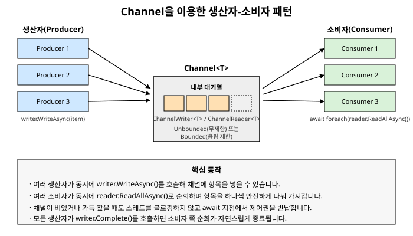

# 16장. Channel과 생산자-소비자 패턴

[◀ 이전: 15장. 비동기 스트림](ch15-비동기스트림.md) | [📖 목차](00-목차.md) | [다음: 17장. 스레드 안전성과 메모리 모델 ▶](ch17-스레드안전성과메모리모델.md)


14장에서는 `ConcurrentQueue<T>`, `ConcurrentDictionary<TKey, TValue>` 같은 동시성 컬렉션과 함께, 생산자-소비자 패턴을 손쉽게 구현할 수 있도록 도와주는 `BlockingCollection<T>`을 다뤘습니다. `BlockingCollection<T>`은 오랫동안 .NET에서 생산자-소비자 패턴을 구현하는 표준적인 선택지였습니다. 하지만 이름에서 알 수 있듯이 이 컬렉션의 대기 방식은 근본적으로 **블로킹**입니다. 소비자가 `Take()`를 호출했는데 큐가 비어 있으면, 그 스레드는 새 항목이 들어올 때까지 그 자리에서 멈춰(block) 있습니다.

9장과 10장에서 강조했듯이, 오늘날의 서버 애플리케이션은 스레드를 아껴 써야 합니다. 소비자 수십, 수백 개가 각각 스레드 하나씩을 차지한 채 데이터가 들어오기만을 블로킹 상태로 기다린다면, 실제로 하는 일이 없는데도 스레드 풀의 스레드를 계속 점유하게 됩니다. 이 장에서 다루는 `System.Threading.Channels` 네임스페이스의 `Channel<T>`는 바로 이 문제를 해결하기 위해 등장한, `BlockingCollection<T>`의 **async/await 친화적인 최신 대안**입니다. 개념적으로 하는 일은 거의 같습니다. 생산자가 데이터를 넣고 소비자가 데이터를 꺼내는 안전한 통로를 제공하는 것입니다. 다만 그 대기 방식이 블로킹이 아니라 `await`를 통한 비동기 대기라는 점이 결정적으로 다릅니다.

## Channel&lt;T&gt;란 무엇인가

`Channel<T>`는 한쪽 끝에서 값을 쓰고 다른 쪽 끝에서 값을 읽는 파이프라인을 나타냅니다. 채널 자체는 직접 생성하지 않고, 정적 팩토리 메서드를 통해 만듭니다.

```csharp
using System.Threading.Channels;

Channel<int> channel = Channel.CreateUnbounded<int>();
```

이렇게 만든 `channel` 객체는 두 부분으로 나뉘어 사용됩니다.

- `channel.Writer` (`ChannelWriter<T>` 타입): 생산자가 데이터를 써넣는 쪽입니다.
- `channel.Reader` (`ChannelReader<T>` 타입): 소비자가 데이터를 읽어가는 쪽입니다.

이렇게 쓰기 쪽과 읽기 쪽을 분리해 놓은 이유는, 생산자 역할을 하는 코드에는 `Writer`만 넘겨주고 소비자 역할을 하는 코드에는 `Reader`만 넘겨줌으로써, 각 쪽이 자신의 역할에 맞는 메서드만 사용하도록 타입 시스템 차원에서 강제할 수 있기 때문입니다. 생산자 쪽 코드는 실수로 채널에서 값을 읽어갈 수 없고, 소비자 쪽 코드는 실수로 채널에 값을 써넣을 수 없습니다.

## 채널 생성 - Unbounded와 Bounded

채널은 크게 용량 제한이 없는 채널과 용량 제한이 있는 채널로 나뉩니다.

### CreateUnbounded - 무제한 채널

```csharp
Channel<string> channel = Channel.CreateUnbounded<string>();
```

`CreateUnbounded<T>()`로 만든 채널은 내부 대기열의 크기에 제한이 없습니다. 생산자는 소비자의 처리 속도와 무관하게 얼마든지 빠르게 데이터를 써넣을 수 있습니다. 다만 이는 곧 생산자가 소비자보다 훨씬 빠르게 데이터를 만들어내는 상황에서 대기열이 무한정 커져 메모리를 과도하게 소비할 수 있다는 위험을 의미하기도 합니다.

### CreateBounded - 용량 제한 채널

```csharp
Channel<string> channel = Channel.CreateBounded<string>(capacity: 100);
```

`CreateBounded<T>()`로 만든 채널은 내부 대기열의 최대 크기를 지정합니다. 대기열이 가득 찬 상태에서 생산자가 `WriteAsync()`를 호출하면, 소비자가 항목을 하나 꺼내 공간이 생길 때까지 그 `WriteAsync()` 호출이 완료되지 않고 대기합니다. 이때의 대기 역시 블로킹이 아니라 `await` 기반이므로, 생산자 스레드도 소비자와 마찬가지로 스레드 풀 스레드를 점유하지 않고 반납한 채 기다립니다.

용량 제한 채널은 `BoundedChannelOptions`를 통해 대기열이 가득 찼을 때의 동작 방식을 세밀하게 지정할 수도 있습니다.

```csharp
var options = new BoundedChannelOptions(capacity: 100)
{
    FullMode = BoundedChannelFullMode.Wait,       // 기본값: 공간이 생길 때까지 대기
    SingleReader = false,                          // 소비자가 여러 명일 수 있음
    SingleWriter = false                           // 생산자가 여러 명일 수 있음
};

Channel<string> channel = Channel.CreateBounded<string>(options);
```

`FullMode`에는 `Wait`(기본값, 공간이 생길 때까지 대기) 외에도 `DropOldest`(가장 오래된 항목을 버림), `DropNewest`(새로 들어온 항목을 버림), `DropWrite`(쓰려던 항목 자체를 버림)가 있습니다. 실시간성이 중요해서 오래된 데이터가 쌓이는 것보다는 차라리 버리는 편이 나은 시나리오(예: 최신 센서 값만 의미 있는 경우)라면 `DropOldest`를 선택할 수 있습니다.

무제한 채널을 쓸지 용량 제한 채널을 쓸지는 결국 4장에서 다룬 `SemaphoreSlim`을 이용한 동시 실행 개수 제한과 비슷한 고민입니다. 생산자의 속도를 제한하지 않고 최대한 빨리 처리하고 싶다면 무제한 채널을, 생산자와 소비자 속도 차이로 인한 메모리 폭증을 막고 싶다면 용량 제한 채널을 선택합니다. 실무에서는 안전장치 차원에서 용량 제한 채널을 기본으로 선택하는 경우가 많습니다.

## 생산자 쪽 - WriteAsync와 Complete

생산자는 `channel.Writer`를 통해 데이터를 써넣습니다.

```csharp
async Task ProduceAsync(ChannelWriter<int> writer, CancellationToken cancellationToken)
{
    for (int i = 1; i <= 5; i++)
    {
        await writer.WriteAsync(i, cancellationToken);
        Console.WriteLine($"생산: {i}");
        await Task.Delay(200, cancellationToken);
    }

    // 더 이상 쓸 데이터가 없음을 알림 - 반드시 호출해야 소비자 쪽 순회가 끝난다
    writer.Complete();
}
```

`WriteAsync()`는 `ValueTask`를 반환하는 비동기 메서드입니다. 무제한 채널에서는 거의 항상 즉시 완료되지만, 용량 제한 채널에서 대기열이 가득 차 있으면 공간이 생길 때까지 완료되지 않고 대기합니다.

생산이 끝났다면 반드시 `writer.Complete()`를 호출해야 합니다. 이 호출은 "이 채널에는 더 이상 새로운 데이터가 들어오지 않는다"는 신호를 채널에 새겨 넣는 것으로, 소비자 쪽에서 이 신호를 보고 순회를 자연스럽게 종료할 수 있게 해줍니다. `Complete()`를 호출하지 않으면 소비자는 채널이 끝났다는 사실을 알 방법이 없어 영원히 다음 항목을 기다리게 됩니다. 생산 도중 예외가 발생했다면 `writer.Complete(exception)`처럼 예외를 함께 전달할 수도 있으며, 이 경우 소비자 쪽에서 그 예외가 다시 던져집니다.

```csharp
async Task ProduceWithErrorHandlingAsync(ChannelWriter<int> writer, CancellationToken cancellationToken)
{
    try
    {
        for (int i = 1; i <= 5; i++)
        {
            await writer.WriteAsync(i, cancellationToken);
        }

        writer.Complete();
    }
    catch (Exception ex)
    {
        writer.Complete(ex); // 소비자 쪽 await foreach에서 이 예외가 다시 던져진다
    }
}
```

## 소비자 쪽 - ReadAllAsync로 순회하기

소비자는 `channel.Reader`를 통해 데이터를 읽어갑니다. 가장 간단한 방법은 15장에서 배운 `await foreach`와 `ReadAllAsync()`를 조합하는 것입니다.

```csharp
async Task ConsumeAsync(ChannelReader<int> reader, CancellationToken cancellationToken)
{
    await foreach (int item in reader.ReadAllAsync(cancellationToken))
    {
        Console.WriteLine($"소비: {item}");
    }

    Console.WriteLine("채널이 닫혀 순회가 종료되었습니다.");
}
```

`ReadAllAsync()`는 `IAsyncEnumerable<T>`를 반환하므로, 15장에서 다룬 비동기 스트림 그대로 소비할 수 있습니다. 채널에 항목이 없으면 `await foreach`는 스레드를 블로킹하지 않고 반납한 채 기다리다가, 새 항목이 도착하거나 `writer.Complete()`가 호출되면 즉시 재개됩니다. 항목이 더 도착하지 않고 채널이 완료된 상태라면 순회가 정상적으로 끝나고, `Complete(exception)`으로 예외가 전달된 상태라면 그 예외가 다시 던져집니다.

`ReadAllAsync()` 대신 `WaitToReadAsync()`와 `TryRead()`를 직접 조합하는 더 저수준의 방법도 있습니다. 반복문 안에서 세밀한 제어가 필요할 때 유용합니다.

```csharp
async Task ConsumeManuallyAsync(ChannelReader<int> reader, CancellationToken cancellationToken)
{
    while (await reader.WaitToReadAsync(cancellationToken))
    {
        while (reader.TryRead(out int item))
        {
            Console.WriteLine($"소비: {item}");
        }
    }
}
```

`WaitToReadAsync()`는 채널에 읽을 수 있는 항목이 하나라도 생기거나 채널이 완료될 때까지 비동기로 대기하고, 읽을 항목이 있으면 `true`를, 채널이 완료되었고 남은 항목도 없으면 `false`를 반환합니다. `TryRead()`는 블로킹 없이 즉시 시도해서 성공하면 항목을 꺼내고 `true`를 반환합니다. 대부분의 경우 `ReadAllAsync()`만으로 충분하지만, 이 저수준 API가 존재한다는 것을 알아두면 특수한 상황에서 도움이 됩니다.

## 실전 예제 - 여러 생산자와 여러 소비자를 둔 작업 큐

`Channel<T>`의 진짜 강점은 여러 생산자와 여러 소비자를 동시에 둘 수 있다는 점에서 드러납니다. 웹 요청을 처리하는 여러 워커가 작업을 큐에 등록하고, 별도의 워커 풀이 그 작업을 꺼내 처리하는 작업 큐 시스템을 예로 들어보겠습니다.

```csharp
public record WorkItem(int Id, string Payload);

public class WorkQueueDemo
{
    public async Task RunAsync(CancellationToken cancellationToken)
    {
        var options = new BoundedChannelOptions(capacity: 10)
        {
            SingleReader = false,
            SingleWriter = false
        };
        Channel<WorkItem> channel = Channel.CreateBounded<WorkItem>(options);

        const int producerCount = 3;
        const int consumerCount = 4;
        const int itemsPerProducer = 5;

        // 생산자 여러 개를 동시에 시작
        var producers = Enumerable.Range(0, producerCount)
            .Select(p => ProduceAsync(channel.Writer, p, itemsPerProducer, cancellationToken))
            .ToArray();

        // 모든 생산자가 끝나면 채널을 완료 처리
        Task producerCompletion = Task.WhenAll(producers)
            .ContinueWith(_ => channel.Writer.Complete(), cancellationToken);

        // 소비자 여러 개를 동시에 시작
        var consumers = Enumerable.Range(0, consumerCount)
            .Select(c => ConsumeAsync(channel.Reader, c, cancellationToken))
            .ToArray();

        await Task.WhenAll(consumers.Append(producerCompletion));
    }

    private static async Task ProduceAsync(
        ChannelWriter<WorkItem> writer,
        int producerId,
        int itemCount,
        CancellationToken cancellationToken)
    {
        for (int i = 0; i < itemCount; i++)
        {
            var item = new WorkItem(producerId * 100 + i, $"생산자{producerId}의 작업 {i}");
            await writer.WriteAsync(item, cancellationToken);
            Console.WriteLine($"[생산자 {producerId}] 등록: {item.Payload}");
            await Task.Delay(50, cancellationToken);
        }
    }

    private static async Task ConsumeAsync(
        ChannelReader<WorkItem> reader,
        int consumerId,
        CancellationToken cancellationToken)
    {
        await foreach (WorkItem item in reader.ReadAllAsync(cancellationToken))
        {
            Console.WriteLine($"    [소비자 {consumerId}] 처리 시작: {item.Payload}");
            await Task.Delay(120, cancellationToken); // 처리 시간 흉내
            Console.WriteLine($"    [소비자 {consumerId}] 처리 완료: {item.Payload}");
        }

        Console.WriteLine($"    [소비자 {consumerId}] 더 이상 작업이 없어 종료");
    }
}
```

이 예제에서 눈여겨볼 부분은 세 가지입니다.

첫째, 생산자 3개가 각자 독립적으로 `writer.WriteAsync()`를 호출하지만 `Channel<T>` 내부적으로 스레드 안전성이 보장되므로, 별도의 락 없이도 여러 생산자가 동시에 안전하게 값을 써넣을 수 있습니다.

둘째, 소비자 4개가 `reader.ReadAllAsync()`로 같은 채널을 동시에 순회하지만, 채널은 각 항목이 정확히 한 소비자에게만 전달되도록 보장합니다. 같은 작업이 두 소비자에게 중복으로 전달되는 일은 일어나지 않습니다. 소비자 수가 생산자 수보다 많으므로, 처리 속도가 빠른 소비자가 자연스럽게 더 많은 작업을 가져가는 형태로 부하가 분산됩니다.

셋째, `writer.Complete()`는 **모든** 생산자가 작업을 끝낸 뒤 딱 한 번만 호출해야 합니다. 그래서 개별 생산자 안에서 `Complete()`를 호출하는 대신, `Task.WhenAll(producers)`로 모든 생산자의 완료를 기다린 뒤 `ContinueWith`에서 `Complete()`를 호출하도록 구성했습니다. 이 채널 완료 대기 자체도 `Task.WhenAll`의 대상에 포함시켜서, 전체 파이프라인(생산자 완료 처리 + 모든 소비자)이 끝날 때까지 `RunAsync`가 기다리도록 만들었습니다. 8장에서 다룬 `Task.WhenAll`의 조합 패턴이 여기서도 그대로 활용됩니다.

이 코드를 실행하면 세 생산자가 번갈아 작업을 등록하는 로그와, 네 소비자가 병렬로 작업을 꺼내 처리하는 로그가 뒤섞여 출력됩니다. 어떤 소비자가 어떤 작업을 가져갈지는 실행할 때마다 스케줄링에 따라 달라지지만, 총 15개의 작업이 정확히 한 번씩만 처리된다는 사실은 항상 보장됩니다.

아래 그림은 이 구조를 도식화한 것입니다. 여러 생산자가 채널에 항목을 써넣고, 여러 소비자가 채널에서 항목을 나눠 가져가는 모습입니다.



## BlockingCollection과 비교했을 때의 장점

14장에서 다룬 `BlockingCollection<T>`과 `Channel<T>`은 해결하려는 문제가 같기 때문에 겉으로 보면 대응되는 개념이 많습니다.

| BlockingCollection&lt;T&gt; | Channel&lt;T&gt; |
|---|---|
| `Add(item)` | `await writer.WriteAsync(item)` |
| `Take()` | `await reader.ReadAsync()` |
| `GetConsumingEnumerable()` + `foreach` | `reader.ReadAllAsync()` + `await foreach` |
| `CompleteAdding()` | `writer.Complete()` |
| 생성자의 `boundedCapacity` | `Channel.CreateBounded<T>(capacity)` |

기능적으로는 비슷해 보이지만, 결정적인 차이는 **대기하는 동안 스레드를 어떻게 다루는가**에 있습니다.

`BlockingCollection<T>.Take()`는 이름 그대로 블로킹 호출입니다. 큐가 비어 있으면 호출한 스레드는 커널 수준의 대기 상태로 들어가 새 항목이 들어올 때까지 완전히 멈춥니다. 이 스레드는 그동안 스레드 풀의 다른 작업을 처리할 수 없습니다. 소비자를 100개 두면 최악의 경우 스레드 풀에서 100개의 스레드가 그대로 잠들어 버릴 수 있다는 뜻입니다. 6장에서 설명했듯이 스레드 풀의 스레드 개수는 무한하지 않으며, 이렇게 스레드가 블로킹된 채로 쌓이면 다른 작업을 처리할 스레드가 부족해지는 스레드 풀 기아(starvation) 현상으로 이어질 수 있습니다.

`Channel<T>.Reader.ReadAsync()`(그리고 `ReadAllAsync()`, `WaitToReadAsync()`)는 처음부터 `async`/`await`를 염두에 두고 설계되었습니다. 채널이 비어 있어 대기해야 할 때는 9장에서 배운 `await`의 원리 그대로 스레드를 스레드 풀에 반납하고, 새 항목이 도착하면 그 이어지는 코드만 다시 스케줄링됩니다. 소비자를 100개 두더라도, 대기 중인 소비자들은 실제 스레드를 하나도 점유하지 않습니다. 이는 특히 ASP.NET Core 같은 서버 환경에서 수천 개의 동시 연결을 적은 수의 스레드로 처리해야 하는 상황에 정확히 들어맞는 특성입니다.

정리하면 다음과 같은 기준으로 선택할 수 있습니다.

- 기존에 동기 코드 기반으로 작성된 애플리케이션이고, 별도의 전용 스레드 몇 개만 생산자/소비자로 사용한다면 `BlockingCollection<T>`도 여전히 합리적인 선택입니다.
- 새로 작성하는 코드이거나, `async`/`await` 기반의 비동기 파이프라인 안에 자연스럽게 녹여 넣고 싶다면, 그리고 특히 소비자나 생산자의 수가 많아질 수 있다면 `Channel<T>`을 선택하는 것이 스레드 자원을 훨씬 효율적으로 사용하는 길입니다.

## 요약

- `Channel<T>`는 `System.Threading.Channels` 네임스페이스가 제공하는, 생산자-소비자 패턴을 위한 async/await 친화적인 통로입니다. 14장에서 다룬 `BlockingCollection<T>`과 목적은 같지만 대기 방식이 블로킹이 아니라 비동기라는 점이 핵심적인 차이입니다.
- `Channel.CreateUnbounded<T>()`는 용량 제한이 없는 채널을, `Channel.CreateBounded<T>(capacity)`는 용량 제한이 있는 채널을 만듭니다. 용량 제한 채널은 `BoundedChannelOptions.FullMode`로 대기열이 가득 찼을 때의 동작을 지정할 수 있습니다.
- 생산자는 `writer.WriteAsync()`로 값을 써넣고, 더 쓸 데이터가 없으면 반드시 `writer.Complete()`를 호출해야 소비자 쪽 순회가 정상적으로 종료됩니다.
- 소비자는 `await foreach (var item in reader.ReadAllAsync())`로 채널을 순회하며, 15장에서 다룬 비동기 스트림 소비 방식을 그대로 사용합니다.
- 여러 생산자와 여러 소비자를 동시에 둘 수 있으며, 채널은 각 항목이 정확히 한 소비자에게만 전달되도록 스레드 안전하게 보장합니다.
- `Channel<T>`의 가장 큰 장점은 대기 중에 스레드 풀 스레드를 점유하지 않는다는 것으로, 생산자나 소비자의 수가 많은 서버 환경에서 `BlockingCollection<T>`보다 훨씬 적은 자원으로 같은 패턴을 구현할 수 있습니다.

## 연습문제

1. `BlockingCollection<T>.Take()`와 `ChannelReader<T>.ReadAsync()`가 큐(또는 채널)가 비어 있을 때 각각 어떻게 대기하는지 설명하고, 이 차이가 스레드 풀에 어떤 영향을 미치는지 서술하세요.
2. 용량이 5인 `Channel.CreateBounded<int>(5)` 채널을 만들고, 생산자가 소비자보다 훨씬 빠르게 값을 쓰려고 할 때 `WriteAsync()` 호출이 어떻게 동작하는지 직접 코드로 확인해보세요.
3. `BoundedChannelFullMode.DropOldest`를 사용하는 채널을 만들어, 대기열이 가득 찬 상태에서 새 값을 쓰면 어떤 값이 사라지는지 실험해보세요.
4. 이 장의 작업 큐 예제에서 소비자 수를 1개로 줄이고 생산자 수를 5개로 늘렸을 때, 전체 처리 시간이 어떻게 달라지는지 예상하고 실제로 측정해보세요.
5. `writer.Complete()`를 호출하지 않고 프로그램을 실행하면 어떤 문제가 발생하는지 직접 코드로 재현하고, 왜 그런 문제가 생기는지 설명하세요.

---

[◀ 이전: 15장. 비동기 스트림](ch15-비동기스트림.md) | [📖 목차](00-목차.md) | [다음: 17장. 스레드 안전성과 메모리 모델 ▶](ch17-스레드안전성과메모리모델.md)
