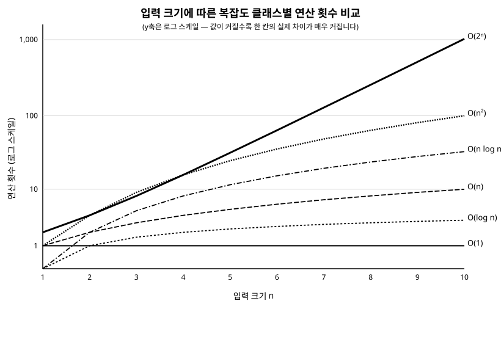

# 2장. 복잡도 분석 기초(Big-O)

[◀ 이전: 1장. 자료구조와 알고리즘을 배우는 이유](ch01-자료구조와알고리즘을배우는이유.md) | [📖 목차](00-목차.md) | [다음: 3장. 배열과 동적 배열 ▶](ch03-배열과동적배열.md)

---

## 시작하며

1장에서 순차 탐색과 이진 탐색의 성능 차이를 살펴보았습니다. "100만 개 중에서 최악의 경우 100만 번 비교" 대 "최악의 경우 약 20번 비교"라는 표현은 직관적이지만, 매번 이렇게 구체적인 숫자로 설명하는 것은 번거롭고 정확하지도 않습니다. 이 장에서는 알고리즘의 성능을 입력 크기에 따라 일반화해서 표현하는 방법인 **Big-O 표기법**을 배웁니다. 앞으로 이 책의 모든 장에서 어떤 자료구조의 연산이 "얼마나 빠른가"를 이야기할 때 이 표기법을 공통 언어로 사용합니다.

## 시간 복잡도와 공간 복잡도

알고리즘의 효율을 평가할 때 크게 두 가지를 봅니다.

**시간 복잡도(time complexity)**는 입력 크기가 커질 때 실행 시간이 얼마나 늘어나는지를 나타냅니다. 여기서 중요한 점은 초 단위의 실제 시간이 아니라, 입력 크기 `n`에 대해 핵심 연산(비교, 대입 등)이 몇 번 일어나는지를 센다는 것입니다. 실제 실행 시간은 CPU 속도, 컴파일러 최적화, 하드웨어 환경에 따라 달라지지만, 연산 횟수의 증가 패턴은 환경과 무관하게 알고리즘 고유의 특성입니다.

**공간 복잡도(space complexity)**는 입력 크기가 커질 때 알고리즘이 추가로 사용하는 메모리가 얼마나 늘어나는지를 나타냅니다. 입력 자체를 저장하는 공간은 보통 제외하고, 알고리즘이 계산 과정에서 별도로 사용하는 메모리(보조 공간, auxiliary space)를 기준으로 삼습니다.

## Big-O 표기법: 최악의 경우 증가율

**Big-O 표기법**은 입력 크기 `n`이 커질 때 알고리즘의 실행 시간(또는 사용 메모리)이 **최악의 경우** 어떤 비율로 증가하는지를 나타내는 표기법입니다. 여기서 두 가지를 정확히 짚고 넘어가야 합니다.

첫째, Big-O는 **정확한 연산 횟수가 아니라 증가율(growth rate)**을 나타냅니다. 어떤 알고리즘이 `3n + 5`번의 연산을 한다면, 상수 배수(3)와 상수항(5)은 `n`이 아주 커지면 무시할 수 있는 수준이 되므로 O(n)이라고 표현합니다. 중요한 것은 `n`이 두 배가 될 때 실행 시간도 대략 두 배가 되는지, 네 배가 되는지, 거의 그대로인지를 나타내는 "모양"입니다.

둘째, Big-O는 보통 **최악의 경우(worst case)**를 기준으로 합니다. 예를 들어 순차 탐색은 찾는 값이 리스트의 맨 앞에 있으면 단 한 번 만에 끝나지만, 값이 없거나 맨 뒤에 있으면 모든 원소를 다 확인해야 합니다. Big-O는 이 중 가장 나쁜 경우, 즉 "운이 가장 나쁠 때 얼마나 걸리는가"를 기준으로 알고리즘을 표현합니다. 이렇게 하면 알고리즘이 어떤 입력을 만나더라도 최소한 이 정도 성능은 보장된다는 안전한 상한선을 알 수 있습니다.

## 흔한 복잡도 클래스

자주 등장하는 복잡도 클래스를 실행 시간이 짧은 순서대로, 실제 C# 코드와 함께 살펴봅니다. 모든 예제는 크기가 `n`인 입력을 기준으로 설명합니다.

### O(1) — 상수 시간

입력 크기와 무관하게 항상 일정한 횟수의 연산만 수행합니다.

```csharp
// 배열의 인덱스로 바로 접근하므로 배열 크기와 무관하게 항상 한 번에 끝난다
public static int GetFirstElement(int[] numbers)
{
    return numbers[0];
}
```

배열의 길이가 10이든 1,000만이든, `numbers[0]`에 접근하는 시간은 동일합니다. 반복문이 전혀 없고 입력 크기에 의존하는 부분이 없다는 것이 O(1)의 특징입니다.

### O(log n) — 로그 시간

매 단계마다 처리해야 할 범위가 절반(혹은 일정 비율)씩 줄어드는 경우입니다.

```csharp
// 정렬된 배열에서 절반씩 범위를 좁혀가며 탐색한다 (1장에서 본 이진 탐색)
public static int BinarySearch(int[] sortedNumbers, int target)
{
    int low = 0;
    int high = sortedNumbers.Length - 1;

    while (low <= high)
    {
        int mid = low + (high - low) / 2;

        if (sortedNumbers[mid] == target)
        {
            return mid;
        }
        else if (sortedNumbers[mid] < target)
        {
            low = mid + 1;
        }
        else
        {
            high = mid - 1;
        }
    }

    return -1; // 찾지 못함
}
```

`n`개의 원소가 있을 때 반복문은 최대 `log₂n`번 실행됩니다. 원소가 100만 개여도 약 20번, 10억 개여도 약 30번이면 충분합니다. 8장에서 배울 이진 탐색 트리의 탐색 연산도 트리가 균형 잡혀 있다면 O(log n)입니다.

### O(n) — 선형 시간

입력의 모든 원소를 한 번씩 확인하는 경우입니다.

```csharp
// 배열 전체를 한 번 훑으면서 최댓값을 찾는다
public static int FindMax(int[] numbers)
{
    int max = numbers[0];

    foreach (var number in numbers)
    {
        if (number > max)
        {
            max = number;
        }
    }

    return max;
}
```

원소가 `n`개면 반복문도 `n`번 실행됩니다. 최댓값을 찾으려면 모든 원소를 최소 한 번은 봐야 하므로, 이보다 더 빠른 방법은 (사전 정보가 없는 한) 존재하지 않습니다.

### O(n log n) — 선형 로그 시간

효율적인 정렬 알고리즘에서 자주 등장하는 복잡도입니다.

```csharp
// 병합 정렬: 배열을 절반으로 나누고(log n 단계), 각 단계마다 병합에 O(n)이 걸린다
public static void MergeSort(int[] array, int left, int right)
{
    if (left >= right)
    {
        return;
    }

    int mid = left + (right - left) / 2;
    MergeSort(array, left, mid);
    MergeSort(array, mid + 1, right);
    Merge(array, left, mid, right);
}

private static void Merge(int[] array, int left, int mid, int right)
{
    int[] leftPart = array[left..(mid + 1)];
    int[] rightPart = array[(mid + 1)..(right + 1)];

    int i = 0, j = 0, k = left;

    while (i < leftPart.Length && j < rightPart.Length)
    {
        array[k++] = leftPart[i] <= rightPart[j] ? leftPart[i++] : rightPart[j++];
    }

    while (i < leftPart.Length) array[k++] = leftPart[i++];
    while (j < rightPart.Length) array[k++] = rightPart[j++];
}
```

배열을 절반씩 나누는 데 `log n` 단계가 필요하고, 각 단계에서 병합 작업에 전체 원소를 한 번씩 훑는 O(n) 시간이 걸리므로 전체는 O(n log n)이 됩니다. 병합 정렬은 15장에서 자세히 다룹니다.

### O(n²) — 이차 시간

이중 반복문으로 모든 쌍을 비교하는 경우 흔히 나타납니다.

```csharp
// 배열 안에 중복된 값이 있는지 모든 쌍을 비교해서 확인한다
public static bool HasDuplicate(int[] numbers)
{
    for (int i = 0; i < numbers.Length; i++)
    {
        for (int j = i + 1; j < numbers.Length; j++)
        {
            if (numbers[i] == numbers[j])
            {
                return true;
            }
        }
    }
    return false;
}
```

바깥 반복문이 `n`번, 안쪽 반복문이 평균적으로 `n`번에 가깝게 실행되므로 전체 비교 횟수는 대략 `n²`에 비례합니다. 원소가 1,000개면 최대 약 50만 번의 비교가 필요하고, 10,000개면 약 5,000만 번으로 100배 늘어납니다. 14장에서 다룰 버블 정렬, 선택 정렬도 대표적인 O(n²) 알고리즘입니다.

### O(2ⁿ) — 지수 시간

입력이 하나 늘어날 때마다 경우의 수가 두 배로 늘어나는 경우입니다. 재귀로 모든 부분집합을 나열하는 문제가 대표적입니다.

```csharp
// 피보나치 수를 재귀로 계산 (메모이제이션 없이) - 매 호출마다 두 번씩 재귀 호출한다
public static long Fibonacci(int n)
{
    if (n <= 1)
    {
        return n;
    }
    return Fibonacci(n - 1) + Fibonacci(n - 2);
}
```

`Fibonacci(n)`은 내부적으로 `Fibonacci(n - 1)`과 `Fibonacci(n - 2)`를 호출하고, 이 호출들이 각각 또 두 번씩 호출을 만들어내면서 호출 트리가 기하급수적으로 커집니다. `n`이 30만 되어도 백만 번 이상의 호출이 발생하고, `n`이 40을 넘으면 눈에 띄게 느려집니다. 18장에서는 이런 중복 계산을 동적 프로그래밍으로 해결해 O(n)까지 줄이는 방법을 다룹니다.

## 복잡도 클래스의 순서

입력 크기 `n`이 커질수록 위에서 소개한 복잡도들은 다음 순서로 빠르게 나빠집니다.

```
O(1) < O(log n) < O(n) < O(n log n) < O(n²) < O(2ⁿ)
```

아래 그래프는 `n`이 커질 때 각 복잡도 클래스의 실행 시간이 어떻게 증가하는지 보여줍니다. O(1)과 O(log n)은 거의 평평하게 유지되는 반면, O(n²)과 O(2ⁿ)은 매우 가파르게 치솟는 것을 볼 수 있습니다.



## 시간과 공간의 트레이드오프

빠른 알고리즘이 항상 공짜로 얻어지는 것은 아닙니다. 흔히 실행 시간을 줄이는 대신 메모리를 더 쓰거나, 메모리를 아끼는 대신 시간을 더 쓰는 **트레이드오프(trade-off)** 관계가 나타납니다.

앞서 본 피보나치 함수를 예로 들어봅시다. 재귀 호출만으로 구현하면 추가 메모리는 거의 쓰지 않지만(O(n)의 호출 스택 공간 정도) 시간은 O(2ⁿ)이 걸립니다. 이번에는 이미 계산한 값을 저장해두는 방식으로 바꿔봅시다.

```csharp
// 계산 결과를 배열에 저장해두고 재사용한다 (메모이제이션)
public static long FibonacciWithMemo(int n, long[] memo)
{
    if (n <= 1)
    {
        return n;
    }
    if (memo[n] != 0)
    {
        return memo[n]; // 이미 계산한 값을 재사용
    }

    memo[n] = FibonacciWithMemo(n - 1, memo) + FibonacciWithMemo(n - 2, memo);
    return memo[n];
}
```

이 방식은 크기 `n + 1`짜리 배열(O(n)의 추가 공간)을 사용하는 대신, 시간 복잡도를 O(2ⁿ)에서 O(n)으로 극적으로 줄입니다. 즉 "메모리를 조금 더 쓰고 시간을 훨씬 아끼는" 선택을 한 것입니다. 이런 트레이드오프는 이 책 전반에 걸쳐 반복해서 등장합니다. 예를 들어 11장의 해시 테이블은 추가 메모리를 사용해서 평균 O(1) 탐색을 가능하게 하고, 10장의 힙은 정렬된 상태를 유지하지 않는 대신 최솟값(또는 최댓값)에 대한 접근만 빠르게 만듭니다. "무엇을 희생하고 무엇을 얻을 것인가"를 판단하는 것이 자료구조와 알고리즘 설계의 핵심입니다.

## .NET BCL에서 찾아보기

Big-O 표기법 자체는 특정 클래스가 아니라 분석 도구이므로 BCL에 대응하는 클래스는 없습니다. 다만 .NET 공식 문서는 `List<T>`, `Dictionary<TKey, TValue>` 등 주요 컬렉션 클래스의 각 메서드마다 시간 복잡도를 명시해두고 있습니다. 예를 들어 `List<T>.Add`는 대부분 O(1)이지만 내부 배열이 꽉 찼을 때는 O(n)이 걸릴 수 있고, `Dictionary<TKey, TValue>.TryGetValue`는 평균 O(1)입니다. 앞으로 각 장에서 해당 자료구조를 다룰 때마다 이런 공식 문서의 복잡도 표기를 함께 확인하는 습관을 들이면 좋습니다.

## 요약

- 시간 복잡도는 입력 크기에 따른 실행 시간의 증가율을, 공간 복잡도는 입력 크기에 따른 추가 메모리 사용량의 증가율을 나타냅니다.
- Big-O 표기법은 상수 배수와 낮은 차수의 항을 무시하고 입력 크기 `n`에 대한 증가율의 "모양"만을 나타내며, 보통 최악의 경우를 기준으로 합니다.
- 자주 등장하는 복잡도 클래스는 빠른 순서대로 O(1), O(log n), O(n), O(n log n), O(n²), O(2ⁿ)이 있으며, 각각 상수 시간 접근, 이진 탐색, 선형 스캔, 효율적인 정렬, 이중 반복문, 지수적 재귀 호출과 같은 패턴에서 나타납니다.
- 시간 복잡도와 공간 복잡도는 종종 트레이드오프 관계에 있으며, 메모이제이션처럼 메모리를 더 사용해서 시간을 절약하는 선택이 자주 등장합니다.
- 이후 모든 장에서 자료구조의 연산 효율을 이야기할 때 이 장에서 배운 Big-O 표기법을 공통 언어로 사용합니다.

## 연습문제

1. 어떤 알고리즘의 연산 횟수가 `5n² + 3n + 100`이라면 Big-O 표기법으로 어떻게 표현하는지 설명하고 그 이유를 서술하세요.
2. 본문의 `HasDuplicate` 함수를 `HashSet<int>`를 사용해서 O(n) 시간에 동작하도록 다시 작성해보세요. 이때 추가로 사용하는 공간은 어떻게 되는지도 함께 설명하세요.
3. `Fibonacci`와 `FibonacciWithMemo` 두 함수에 `n = 35`를 넣고 `Stopwatch`로 실행 시간을 측정해서 실제로 얼마나 차이가 나는지 확인해보세요.
4. 다음 중 O(n log n)에 해당하는 상황을 고르고 이유를 설명하세요: (a) 정렬된 배열에서 이진 탐색, (b) 병합 정렬로 배열 정렬, (c) 배열의 모든 쌍의 합 구하기.
5. 시간 복잡도를 줄이기 위해 공간 복잡도를 늘린 경험(직접 짠 코드가 아니어도, 캐시를 쓴다거나 미리 계산해둔 테이블을 쓰는 것도 포함)을 하나 떠올려 설명해보세요.

---

[◀ 이전: 1장. 자료구조와 알고리즘을 배우는 이유](ch01-자료구조와알고리즘을배우는이유.md) | [📖 목차](00-목차.md) | [다음: 3장. 배열과 동적 배열 ▶](ch03-배열과동적배열.md)
