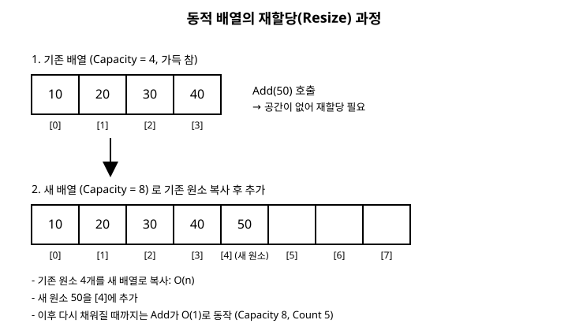

# 3장. 배열과 동적 배열

[◀ 이전: 2장. 복잡도 분석 기초(Big-O)](ch02-복잡도분석기초.md) | [📖 목차](00-목차.md) | [다음: 4장. 연결 리스트 ▶](ch04-연결리스트.md)

---

2장에서 시간 복잡도와 공간 복잡도를 재는 도구를 갖췄으니, 이제 본격적으로 자료구조를 하나씩 뜯어볼 차례입니다. 가장 먼저 다룰 자료구조는 배열입니다. 배열은 프로그래밍을 처음 배울 때부터 써왔을 만큼 익숙하지만, "왜 인덱스로 접근하면 그렇게 빠른가"를 제대로 설명할 수 있는 사람은 생각보다 적습니다. 이 장에서는 배열이 빠른 이유를 메모리 구조 관점에서 살펴보고, C# 배열의 근본적인 한계인 "고정 크기"를 극복하기 위해 동적 배열을 직접 만들어 봅니다.

## 3.1 배열이 빠른 이유: 연속된 메모리와 인덱스 접근

배열의 핵심 특징은 원소들이 메모리에 **연속으로** 저장된다는 점입니다. `int[] arr = new int[5];`라고 선언하면, 런타임은 `int` 하나의 크기(4바이트)에 5를 곱한 20바이트짜리 연속된 메모리 블록을 확보합니다. 배열의 시작 주소를 `baseAddress`라고 하면, `arr[i]`의 실제 메모리 주소는 다음 공식으로 즉시 계산됩니다.

```
주소(i) = baseAddress + i * 원소크기
```

이 계산에는 배열의 크기나 다른 원소의 값이 전혀 필요하지 않습니다. 그냥 곱셈 한 번, 덧셈 한 번이면 끝입니다. 그래서 `arr[0]`에 접근하든 `arr[9999]`에 접근하든 걸리는 시간이 동일합니다. 이것이 배열의 인덱스 접근이 O(1)인 이유입니다.

반대로 생각하면, 이 O(1) 접근은 "연속된 메모리"라는 전제가 있어야만 성립합니다. 만약 원소들이 메모리 여기저기 흩어져 있다면 위 공식은 성립하지 않고, i번째 원소를 찾으려면 처음부터 하나씩 따라가야 합니다(이런 구조가 바로 4장에서 다룰 연결 리스트입니다).

```csharp
int[] scores = new int[5] { 90, 85, 77, 100, 63 };

// O(1): 인덱스 계산만으로 즉시 접근
int third = scores[2]; // 77

// 배열 전체를 순회하는 것은 O(n)
int sum = 0;
for (int i = 0; i < scores.Length; i++)
{
    sum += scores[i];
}
```

## 3.2 C# 배열의 한계: 고정 크기

연속된 메모리를 확보한다는 장점은 동시에 단점이 됩니다. 배열을 생성할 때 런타임은 정확히 그 크기만큼의 연속된 공간을 미리 확보해야 하므로, **한 번 만든 배열의 크기는 바꿀 수 없습니다.**

```csharp
int[] arr = new int[5];
// arr에는 이제부터 딱 5개의 int만 담을 수 있다.
// arr[5] = 10; // 실행 시 IndexOutOfRangeException 발생
```

원소를 하나 더 넣고 싶다면 방법은 하나뿐입니다. 더 큰 새 배열을 만들고, 기존 원소를 전부 복사한 뒤, 새 원소를 추가하는 것입니다.

```csharp
int[] Grow(int[] old, int newSize)
{
    int[] bigger = new int[newSize];
    for (int i = 0; i < old.Length; i++)
    {
        bigger[i] = old[i];
    }
    return bigger;
}
```

매번 크기가 부족할 때마다 이런 복사를 손으로 반복하는 것은 불편하고 실수하기 쉽습니다. 그래서 실무에서는 이 과정을 자동화한 자료구조, 즉 **동적 배열(dynamic array)**을 사용합니다.

## 3.3 동적 배열 직접 구현하기

동적 배열의 핵심 아이디어는 간단합니다.

1. 내부적으로 고정 크기 배열(`_items`)을 하나 들고 있는다.
2. 실제로 사용 중인 원소 개수(`Count`)와 내부 배열의 전체 크기(`Capacity`)를 구분해서 관리한다.
3. 원소를 추가하려는데 내부 배열이 꽉 찼다면, **두 배 크기**의 새 배열을 만들어 기존 원소를 복사한 뒤 교체한다.

왜 하필 "두 배"일까요? 크기를 1씩만 늘리면 원소를 n개 넣는 동안 재할당이 n번 일어나서 전체 비용이 O(n²)이 됩니다. 반면 두 배씩 늘리면 재할당 횟수가 log₂(n)번으로 줄어들고, 재할당마다 복사 비용이 있긴 하지만 전체적으로 n번 삽입에 드는 총비용이 O(n)에 그칩니다. 즉 삽입 한 번당 **평균적으로**(amortized) O(1)이 보장됩니다. 가끔 한 번씩 비싼 재할당이 일어나지만, 그 비용을 전체 삽입 횟수에 분산시켜 생각하면 평균은 여전히 상수 시간이라는 뜻입니다.

다음은 제네릭 동적 배열 `MyDynamicArray<T>`의 구현입니다.

```csharp
public class MyDynamicArray<T>
{
    private T[] _items;
    private int _count;

    public int Count => _count;
    public int Capacity => _items.Length;

    public MyDynamicArray(int initialCapacity = 4)
    {
        _items = new T[initialCapacity];
        _count = 0;
    }

    // 인덱스 접근: O(1)
    public T this[int index]
    {
        get
        {
            if (index < 0 || index >= _count)
                throw new IndexOutOfRangeException();
            return _items[index];
        }
        set
        {
            if (index < 0 || index >= _count)
                throw new IndexOutOfRangeException();
            _items[index] = value;
        }
    }

    // 맨 뒤에 추가: 평균 O(1), 최악의 경우(재할당 시) O(n)
    public void Add(T item)
    {
        if (_count == _items.Length)
        {
            Resize(_items.Length == 0 ? 4 : _items.Length * 2);
        }
        _items[_count] = item;
        _count++;
    }

    // 특정 위치에 삽입: O(n) — 뒤쪽 원소를 한 칸씩 밀어야 한다
    public void InsertAt(int index, T item)
    {
        if (index < 0 || index > _count)
            throw new IndexOutOfRangeException();

        if (_count == _items.Length)
        {
            Resize(_items.Length == 0 ? 4 : _items.Length * 2);
        }

        // index부터 끝까지, 뒤에서부터 한 칸씩 뒤로 민다
        for (int i = _count; i > index; i--)
        {
            _items[i] = _items[i - 1];
        }
        _items[index] = item;
        _count++;
    }

    // 특정 위치 삭제: O(n) — 뒤쪽 원소를 한 칸씩 당겨야 한다
    public void RemoveAt(int index)
    {
        if (index < 0 || index >= _count)
            throw new IndexOutOfRangeException();

        for (int i = index; i < _count - 1; i++)
        {
            _items[i] = _items[i + 1];
        }
        _count--;
        _items[_count] = default!; // 참조를 끊어 GC가 회수할 수 있게 함
    }

    private void Resize(int newCapacity)
    {
        T[] newItems = new T[newCapacity];
        for (int i = 0; i < _count; i++)
        {
            newItems[i] = _items[i];
        }
        _items = newItems;
    }
}
```

사용 예시는 다음과 같습니다.

```csharp
var list = new MyDynamicArray<string>(initialCapacity: 2);
list.Add("사과");
list.Add("바나나");
list.Add("체리"); // 여기서 내부 배열이 2 -> 4로 재할당됨

Console.WriteLine(list.Count);    // 3
Console.WriteLine(list.Capacity); // 4

list.InsertAt(1, "포도"); // "사과", "포도", "바나나", "체리"
list.RemoveAt(0);         // "포도", "바나나", "체리"
```

## 3.4 삽입과 삭제의 비용 분석

동적 배열은 인덱스 접근(`this[index]`)에서는 여전히 O(1)의 성능을 유지합니다. 내부 배열이 연속 메모리이기 때문에 3.1절의 주소 계산 공식이 그대로 적용되기 때문입니다.

하지만 **맨 앞이나 중간에** 삽입·삭제할 때는 이야기가 다릅니다. `InsertAt(0, item)`처럼 맨 앞에 넣으려면 기존 원소를 전부 한 칸씩 뒤로 밀어야 하므로 O(n)이 걸립니다. `RemoveAt(0)`도 마찬가지로 나머지 원소를 전부 한 칸씩 당겨야 해서 O(n)입니다. 반면 `Add`처럼 맨 뒤에 추가하는 연산은 재할당만 없다면 O(1)이고, 재할당까지 포함해도 앞서 설명한 상각 분석 덕분에 평균 O(1)입니다.

정리하면 다음과 같습니다.

| 연산 | 위치 | 시간 복잡도 |
|---|---|---|
| 인덱스로 읽기/쓰기 | 아무 위치 | O(1) |
| 맨 뒤에 추가 | 끝 | 평균 O(1) (재할당 시 O(n)) |
| 중간/앞에 삽입 | i번째 | O(n) — 뒤쪽 원소 이동 필요 |
| 중간/앞에서 삭제 | i번째 | O(n) — 뒤쪽 원소 이동 필요 |

이 트레이드오프, 즉 "빠른 임의 접근 vs 느린 중간 삽입/삭제"는 4장에서 다룰 연결 리스트와 정확히 대비되는 특성이므로 기억해 두면 좋습니다.

아래 그림은 동적 배열이 가득 찼을 때 두 배 크기의 새 배열로 데이터를 복사하는 과정을 보여줍니다.



## .NET BCL에서 찾아보기

이 장에서 직접 만든 `MyDynamicArray<T>`는 사실 `System.Collections.Generic.List<T>`의 단순화된 버전입니다. `List<T>`도 내부적으로 배열을 하나 들고 있다가, 공간이 부족해지면 자동으로 더 큰 배열(보통 2배)로 교체하고 기존 원소를 복사합니다. 개발자는 이 과정을 신경 쓸 필요 없이 `Add`, `Insert`, `RemoveAt`을 호출하기만 하면 됩니다.

`List<T>`를 쓸 때 헷갈리기 쉬운 두 속성이 있습니다.

- `Count`: 현재 실제로 담겨 있는 원소의 개수 (우리 구현의 `_count`에 해당)
- `Capacity`: 내부 배열이 재할당 없이 담을 수 있는 최대 개수 (우리 구현의 `_items.Length`에 해당)

```csharp
var numbers = new List<int>();
numbers.Add(1);
numbers.Add(2);
numbers.Add(3);

Console.WriteLine(numbers.Count);    // 3 (실제 담긴 개수)
Console.WriteLine(numbers.Capacity); // 4 (내부 배열이 이미 4칸으로 확장됨, 구체적인 값은 구현에 따라 다를 수 있음)
```

`Count`는 항상 `Capacity`보다 작거나 같습니다. `Capacity`가 `Count`보다 크다는 것은, 앞으로 몇 번은 재할당 없이 `Add`할 수 있는 여유 공간이 남아 있다는 뜻입니다. 미리 담을 개수를 알고 있다면 `new List<int>(capacity: 1000)`처럼 초기 용량을 지정해서 불필요한 재할당을 줄일 수도 있습니다. 이는 우리 구현에서 생성자에 `initialCapacity`를 받도록 한 것과 같은 이유입니다.

## 요약

- 배열은 원소를 메모리에 연속으로 저장하기 때문에 `baseAddress + i * 원소크기` 공식으로 인덱스 접근이 O(1)입니다.
- C# 배열은 생성 시점에 크기가 고정되며, 크기를 바꾸려면 새 배열을 만들어 복사해야 합니다.
- 동적 배열은 내부 배열이 가득 차면 두 배 크기로 재할당하는 방식으로 가변 크기를 흉내 냅니다. 이 덕분에 맨 뒤 추가는 상각 O(1)을 유지합니다.
- 중간이나 맨 앞에서의 삽입·삭제는 뒤쪽 원소를 밀거나 당겨야 하므로 O(n)입니다.
- `System.Collections.Generic.List<T>`가 바로 이 장에서 만든 동적 배열의 실제 BCL 구현이며, `Count`(실제 개수)와 `Capacity`(할당된 용량)를 구분해서 관리합니다.

## 연습문제

1. `MyDynamicArray<T>`에서 `Add`를 n번 연속 호출했을 때 재할당이 총 몇 번 일어나는지, 초기 용량이 4일 때를 예로 들어 계산해 보세요.
2. `InsertAt`과 `RemoveAt`이 각각 맨 뒤(`index == Count` 또는 `index == Count - 1`)에서 호출될 때는 예외적으로 O(1)이 될 수 있습니다. 왜 그런지 설명해 보세요.
3. 배열이 줄어들 때(원소를 많이 삭제했을 때) 내부 배열을 더 작게 재할당하는 `Shrink` 기능을 추가한다면, 어떤 기준으로 축소를 트리거하는 것이 합리적일지 설계해 보세요. (힌트: 너무 자주 줄였다 늘렸다 하면 성능이 오히려 나빠질 수 있습니다.)
4. `List<int>`를 생성한 뒤 `Capacity`를 지정하지 않고 원소를 하나씩 추가하면서 매번 `Capacity`를 출력하는 코드를 작성해, 실제로 용량이 어떻게 증가하는지 관찰해 보세요.
5. 만약 배열의 원소 접근이 O(1)이 아니라 O(log n)이었다면, 이 장에서 설명한 상각 분석 결과(맨 뒤 삽입이 평균 O(1))는 어떻게 달라질지 생각해 보세요.

---

[◀ 이전: 2장. 복잡도 분석 기초(Big-O)](ch02-복잡도분석기초.md) | [📖 목차](00-목차.md) | [다음: 4장. 연결 리스트 ▶](ch04-연결리스트.md)
