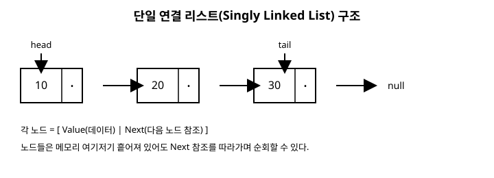

# 4장. 연결 리스트

[◀ 이전: 3장. 배열과 동적 배열](ch03-배열과동적배열.md) | [📖 목차](00-목차.md) | [다음: 5장. 스택 ▶](ch05-스택.md)

---

3장에서는 메모리에 연속으로 저장되기 때문에 인덱스 접근이 빠른 대신, 중간 삽입·삭제가 느린 동적 배열을 살펴봤습니다. 이 장에서는 정반대의 트레이드오프를 가진 자료구조인 **연결 리스트(linked list)**를 다룹니다. 연결 리스트는 원소들을 메모리 여기저기 흩어 놓는 대신, 각 원소가 "다음 원소가 어디 있는지"를 스스로 기억하게 만들어서 삽입·삭제를 훨씬 유연하게 만든 구조입니다.

## 4.1 흩어진 메모리를 참조로 연결하기

배열은 원소를 나란히 붙여 놓고 인덱스 계산으로 위치를 찾습니다. 연결 리스트는 접근 방식이 근본적으로 다릅니다. 각 원소를 **노드(node)**라는 단위로 감싸고, 노드마다 "데이터"와 "다음 노드에 대한 참조"를 함께 저장합니다. 노드들은 메모리의 임의의 위치에 흩어져 있어도 상관없습니다. 앞 노드가 다음 노드의 주소(참조)를 들고 있으면, 그 연결을 따라가기만 하면 전체를 순회할 수 있기 때문입니다.

이런 구조에서는 i번째 원소를 찾으려면 배열처럼 주소를 계산할 수 없습니다. 첫 번째 노드부터 시작해서 참조를 하나씩 따라가며 i번 이동해야 합니다. 그래서 임의 접근은 O(n)입니다. 대신 일단 어떤 노드의 위치를 알고 있다면, 그 앞이나 뒤에 새 노드를 끼워 넣는 작업은 주변 노드의 참조 몇 개만 바꿔주면 끝나므로 원소를 밀거나 당길 필요가 없습니다.

가장 단순한 형태는 각 노드가 "다음 노드"만 가리키는 **단일 연결 리스트(singly linked list)**입니다. 이 장에서는 이 구조를 직접 구현해 봅니다.

## 4.2 노드와 단일 연결 리스트 구현

먼저 노드를 표현하는 `Node<T>` 클래스를 만듭니다.

```csharp
public class Node<T>
{
    public T Value;
    public Node<T>? Next;

    public Node(T value)
    {
        Value = value;
        Next = null;
    }
}
```

이제 이 노드들을 엮어서 리스트 전체를 관리하는 `MyLinkedList<T>` 클래스를 만듭니다. 첫 노드를 가리키는 `_head`와 마지막 노드를 가리키는 `_tail`을 함께 관리하면, 맨 앞 삽입과 맨 뒤 삽입을 모두 O(1)로 처리할 수 있습니다.

```csharp
public class MyLinkedList<T>
{
    private Node<T>? _head;
    private Node<T>? _tail;
    private int _count;

    public int Count => _count;
    public bool IsEmpty => _count == 0;

    // 맨 앞에 삽입: O(1)
    public void AddFirst(T value)
    {
        var newNode = new Node<T>(value)
        {
            Next = _head
        };
        _head = newNode;

        if (_tail == null) // 리스트가 비어 있었다면 tail도 이 노드
        {
            _tail = newNode;
        }
        _count++;
    }

    // 맨 뒤에 삽입: O(1) (tail을 유지하고 있기 때문)
    public void AddLast(T value)
    {
        var newNode = new Node<T>(value);

        if (_tail == null) // 리스트가 비어 있었다면
        {
            _head = newNode;
            _tail = newNode;
        }
        else
        {
            _tail.Next = newNode;
            _tail = newNode;
        }
        _count++;
    }

    // 맨 앞 노드 제거: O(1)
    public void RemoveFirst()
    {
        if (_head == null)
            throw new InvalidOperationException("리스트가 비어 있습니다.");

        _head = _head.Next;
        _count--;

        if (_head == null) // 마지막 하나를 지웠다면 tail도 비운다
        {
            _tail = null;
        }
    }

    // 값으로 노드 찾기: O(n) — 처음부터 순회해야 한다
    public bool Contains(T value)
    {
        Node<T>? current = _head;
        while (current != null)
        {
            if (Equals(current.Value, value))
                return true;
            current = current.Next;
        }
        return false;
    }

    // 전체 순회: O(n)
    public void ForEach(Action<T> action)
    {
        Node<T>? current = _head;
        while (current != null)
        {
            action(current.Value);
            current = current.Next;
        }
    }
}
```

사용 예시는 다음과 같습니다.

```csharp
var list = new MyLinkedList<int>();
list.AddLast(1);
list.AddLast(2);
list.AddLast(3);
list.AddFirst(0);
// 리스트 상태: 0 -> 1 -> 2 -> 3

list.ForEach(v => Console.Write($"{v} ")); // 0 1 2 3

list.RemoveFirst();
// 리스트 상태: 1 -> 2 -> 3
```

주목할 점은 `AddFirst`와 `AddLast` 모두 O(1)이라는 것입니다. 배열이었다면 `AddFirst`에 해당하는 `InsertAt(0, value)`는 기존 원소를 전부 뒤로 밀어야 해서 O(n)이었지만, 연결 리스트는 새 노드 하나를 만들고 참조 한두 개만 바꾸면 되므로 순서와 무관하게 빠릅니다. 반면 `Contains`처럼 특정 값을 찾는 작업은 배열의 순차 탐색과 마찬가지로 O(n)이 걸리고, 심지어 배열보다도 불리합니다. 배열은 인덱스를 알면 O(1)로 접근 가능하지만, 연결 리스트는 몇 번째인지 알아도 처음부터 따라가야 하기 때문입니다.

아래 그림은 노드들이 화살표(참조)로 연결된 단일 연결 리스트의 구조를 보여줍니다.



## 4.3 배열 vs 연결 리스트: 트레이드오프 비교

두 자료구조는 거의 모든 면에서 정반대의 특성을 보입니다.

| 연산/특성 | 배열(동적 배열 포함) | 단일 연결 리스트 |
|---|---|---|
| 임의 접근(i번째 원소) | O(1) | O(n) |
| 맨 앞 삽입/삭제 | O(n) (전부 밀어야 함) | O(1) |
| 맨 뒤 삽입 | 평균 O(1) | O(1) (tail 유지 시) |
| 중간 삽입/삭제(위치 알고 있을 때) | O(n) (뒤쪽 이동) | O(1) (참조만 변경, 단 그 위치까지 도달하는 데는 O(n)) |
| 특정 값 탐색 | O(n) | O(n) |
| 메모리 사용 | 원소 크기만큼만 사용 | 원소 + 참조(포인터) 몫 추가 사용 |
| 캐시 지역성 | 좋음(연속 메모리) | 나쁨(메모리에 흩어짐) |

여기서 "중간 삽입/삭제가 O(1)"이라는 표현에는 함정이 있습니다. 이는 어디까지나 **삽입할 위치를 이미 참조로 들고 있을 때** 이야기입니다. "5번째 위치에 삽입해줘"처럼 인덱스로 위치를 지정하면, 그 위치까지 처음부터 따라가는 데 O(n)이 걸리므로 실질적인 삽입 비용은 배열과 마찬가지로 O(n)이 됩니다. 연결 리스트가 진짜로 유리해지는 상황은, 이미 순회하던 노드 참조를 들고 있는 상태에서 "바로 이 자리에 끼워 넣기"를 반복하는 경우입니다.

또한 연결 리스트는 원소 값 외에 참조(다음 노드 주소)를 위한 추가 메모리가 필요하고, 노드들이 메모리에 흩어져 있어서 배열만큼 캐시 지역성이 좋지 않습니다. 이론적인 시간 복잡도가 같더라도 실제 실행 속도는 배열이 더 빠른 경우가 많은 이유입니다. 어떤 자료구조를 선택할지는 "임의 접근이 잦은가, 아니면 양 끝 삽입·삭제가 잦은가"를 먼저 따져보고 결정하는 것이 좋습니다.

## .NET BCL에서 찾아보기

.NET에는 이 장에서 만든 것보다 한 단계 더 발전된 연결 리스트가 이미 준비되어 있습니다. `System.Collections.Generic.LinkedList<T>`가 그것으로, 각 노드가 다음 노드뿐 아니라 **이전 노드에 대한 참조도 함께 가지는 이중 연결 리스트(doubly linked list)**입니다.

`LinkedList<T>`의 각 노드는 `LinkedListNode<T>` 타입으로 표현되며, `Value`, `Next`, `Previous` 세 가지를 가지고 있습니다. 우리가 만든 단일 연결 리스트는 앞으로만 순회할 수 있었지만, `LinkedList<T>`는 양방향으로 순회할 수 있다는 점이 가장 큰 차이입니다.

```csharp
var list = new LinkedList<string>();

LinkedListNode<string> b = list.AddLast("B");
list.AddFirst("A");           // A -> B
list.AddAfter(b, "C");        // A -> B -> C
list.AddBefore(b, "A-B 사이"); // A -> A-B 사이 -> B -> C

foreach (string item in list)
{
    Console.Write($"{item} ");
}
// A A-B 사이 B C

list.Remove(b); // 값으로 노드를 찾아 제거: O(n)
```

- `AddFirst(value)` / `AddLast(value)`: 맨 앞/맨 뒤에 삽입, O(1)
- `AddBefore(node, value)` / `AddAfter(node, value)`: 특정 노드의 앞/뒤에 삽입, 노드 참조가 있으면 O(1)
- `Remove(node)` 또는 `Remove(value)`: 노드를 알고 있으면 O(1), 값으로 찾아야 하면 탐색에 O(n)

우리가 만든 `MyLinkedList<T>`에는 `Previous` 참조가 없기 때문에 뒤에서 앞으로 순회하거나, 특정 노드 앞에 삽입하려면 처음부터 다시 따라가야 합니다. `LinkedList<T>`는 각 노드가 양쪽을 모두 기억하므로 이런 작업이 훨씬 자연스럽습니다. 다만 그만큼 노드마다 참조를 하나 더 저장해야 하니 메모리를 조금 더 사용한다는 점도 함께 기억해 두세요.

## 요약

- 연결 리스트는 노드마다 데이터와 다음 노드에 대한 참조를 저장하여, 메모리에 흩어져 있어도 순회할 수 있는 구조입니다.
- 배열과 달리 임의 접근은 O(n)이지만, 위치를 이미 참조로 알고 있는 삽입·삭제는 O(1)입니다.
- `head`와 `tail`을 함께 관리하면 맨 앞/맨 뒤 삽입을 모두 O(1)로 처리할 수 있습니다.
- 배열은 임의 접근과 캐시 지역성에서, 연결 리스트는 양 끝(또는 알고 있는 위치)의 삽입·삭제에서 강점을 가지는 상호 보완적인 자료구조입니다.
- `System.Collections.Generic.LinkedList<T>`는 BCL에서 제공하는 실제 이중 연결 리스트로, `LinkedListNode<T>`가 이전·다음 노드를 모두 참조하여 양방향 순회와 `AddBefore`/`AddAfter`를 지원합니다.

## 연습문제

1. `MyLinkedList<T>`에 `AddLast`만 있고 `_tail`을 관리하지 않는다면, `AddLast`의 시간 복잡도는 어떻게 바뀌는지 설명해 보세요.
2. `MyLinkedList<T>`에 `RemoveLast()` 메서드를 추가하려고 합니다. 단일 연결 리스트에서는 왜 이 연산이 O(n)이 될 수밖에 없는지 설명하고, 직접 구현해 보세요. (힌트: 마지막에서 두 번째 노드를 찾아야 합니다.)
3. 배열 기반 `MyDynamicArray<T>`(3장)와 `MyLinkedList<T>`를 이용해 각각 10만 개의 원소를 맨 앞에 삽입하는 코드를 작성하고, 실행 시간을 측정하여 비교해 보세요.
4. `LinkedList<T>`의 `AddBefore(node, value)`가 O(1)로 동작하려면 왜 이중 연결 리스트여야 하는지, 단일 연결 리스트로 같은 기능을 구현할 때 무엇이 문제가 되는지 설명해 보세요.
5. 특정 값을 가진 노드를 찾아 삭제하는 `Remove(T value)` 메서드를 `MyLinkedList<T>`에 추가해 보세요. 삭제하려는 노드가 `_head`인 경우와 중간/끝인 경우를 나누어 처리해야 합니다.

---

[◀ 이전: 3장. 배열과 동적 배열](ch03-배열과동적배열.md) | [📖 목차](00-목차.md) | [다음: 5장. 스택 ▶](ch05-스택.md)
