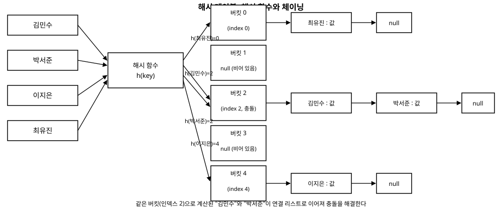

# 11장. 해시 테이블

[◀ 이전: 10장. 힙과 우선순위 큐](ch10-힙과우선순위큐.md) | [📖 목차](00-목차.md) | [다음: 12장. 그래프 기초와 표현 방법 ▶](ch12-그래프기초와표현방법.md)

---

## 시작하며

지금까지 살펴본 자료구조 중에서 배열은 인덱스를 알면 O(1)에 원소에 접근할 수 있었습니다. 하지만 현실의 데이터는 "인덱스"가 아니라 "이름"이나 "학번" 같은 키(key)로 다루어지는 경우가 훨씬 많습니다. "김민수의 전화번호를 찾아라"라는 질문에 답하려면 8장에서 배운 이진 탐색 트리로도 O(log n)에 찾을 수 있지만, 더 빠르게 평균 O(1)로 찾을 방법이 있습니다. 바로 이번 장의 주제인 **해시 테이블(hash table)**입니다.

해시 테이블의 핵심 아이디어는 단순합니다. "김민수"라는 문자열을 어떤 계산을 통해 숫자로 바꾸고, 그 숫자를 배열의 인덱스로 사용하는 것입니다. 키를 인덱스로 직접 변환할 수 있다면, 배열이 인덱스로 O(1) 접근을 제공하듯 키로도 O(1) 접근이 가능해집니다.

## 해시 함수와 버킷

키를 배열의 인덱스로 변환하는 함수를 **해시 함수(hash function)**라고 부릅니다. 그리고 해시 테이블 내부에서 실제 데이터를 담는 배열의 각 칸을 **버킷(bucket)** 또는 슬롯(slot)이라고 부릅니다.

가장 단순한 해시 함수를 하나 만들어봅시다. 문자열의 각 문자 코드를 더한 뒤, 버킷 개수로 나눈 나머지를 인덱스로 사용하는 방식입니다.

```csharp
// 아주 단순한 문자열 해시 함수
public static int SimpleHash(string key, int bucketCount)
{
    int sum = 0;
    foreach (char c in key)
    {
        sum += c; // 문자 코드를 모두 더한다
    }
    return sum % bucketCount; // 버킷 개수로 나눈 나머지가 인덱스
}
```

`SimpleHash("가나", 10)`을 계산하면 두 문자의 코드값 합을 10으로 나눈 나머지가 나옵니다. 이 값을 배열의 인덱스로 쓰면, 키를 몰라도 계산 한 번으로 어느 버킷에 데이터가 있는지 바로 알 수 있습니다. 배열 인덱스 접근은 3장에서 배웠듯 O(1)이므로, 해시 함수 계산 자체가 O(1)(문자열 길이에 비례하지만 보통 상수로 취급)이라면 전체 조회도 평균 O(1)이 됩니다.

## 해시 충돌: 서로 다른 키가 같은 버킷으로

문제는 서로 다른 키가 같은 인덱스로 계산될 수 있다는 점입니다. 예를 들어 "AB"와 "BA"는 문자 코드의 합이 같으므로 `SimpleHash`에서 똑같은 값을 반환합니다. 버킷 개수가 유한한 이상, 키의 가짓수가 버킷 수보다 많아지면 반드시 같은 버킷에 여러 키가 몰리는 상황이 생깁니다. 이를 **해시 충돌(hash collision)**이라고 합니다.

충돌은 피할 수 없는 현상이므로, 좋은 해시 테이블은 "충돌이 아예 없는" 것이 아니라 "충돌을 잘 처리하는" 것을 목표로 합니다. 충돌을 처리하는 대표적인 방법이 이번 장에서 구현할 **체이닝(chaining)**입니다.

## 체이닝으로 충돌 해결하기

체이닝의 아이디어는 각 버킷을 하나의 값이 아니라 **연결 리스트**로 관리하는 것입니다. 같은 인덱스로 계산된 키들은 모두 그 버킷의 연결 리스트에 순서대로 매달아 둡니다. 4장에서 구현한 연결 리스트의 개념을 그대로 활용하는 셈입니다.

조회할 때는 먼저 해시 함수로 버킷을 찾고, 그 버킷의 연결 리스트를 순회하며 키가 일치하는 항목을 찾습니다. 충돌이 적다면 각 버킷의 리스트 길이는 짧게 유지되므로 평균적으로는 여전히 O(1)에 가깝습니다. 다음 그림은 이 구조를 보여줍니다.



## 직접 구현하기

이제 체이닝 방식의 해시 테이블을 직접 만들어봅니다. 각 버킷은 (키, 값) 쌍을 담는 노드들의 연결 리스트로 구성합니다.

```csharp
// 체이닝 방식 해시 테이블에서 각 버킷 내부의 노드
public class HashNode<TKey, TValue>
{
    public TKey Key { get; set; }
    public TValue Value { get; set; }
    public HashNode<TKey, TValue> Next { get; set; } // 같은 버킷의 다음 노드

    public HashNode(TKey key, TValue value)
    {
        Key = key;
        Value = value;
        Next = null;
    }
}

public class SimpleHashTable<TKey, TValue>
{
    private HashNode<TKey, TValue>[] _buckets;
    private int _count;

    public SimpleHashTable(int bucketCount = 16)
    {
        _buckets = new HashNode<TKey, TValue>[bucketCount];
        _count = 0;
    }

    public int Count => _count;

    // 키의 GetHashCode()를 이용해 버킷 인덱스를 계산한다
    private int GetBucketIndex(TKey key)
    {
        int hash = key.GetHashCode();
        // 음수가 나올 수 있으므로 절댓값을 취한 뒤 버킷 개수로 나눈다
        int index = Math.Abs(hash) % _buckets.Length;
        return index;
    }

    public void Add(TKey key, TValue value)
    {
        int index = GetBucketIndex(key);
        HashNode<TKey, TValue> current = _buckets[index];

        // 같은 키가 이미 있으면 값만 갱신한다
        while (current != null)
        {
            if (current.Key.Equals(key))
            {
                current.Value = value;
                return;
            }
            current = current.Next;
        }

        // 새 노드를 버킷의 맨 앞에 연결한다 (연결 리스트의 앞쪽 삽입은 O(1))
        HashNode<TKey, TValue> newNode = new HashNode<TKey, TValue>(key, value);
        newNode.Next = _buckets[index];
        _buckets[index] = newNode;
        _count++;
    }

    public bool TryGetValue(TKey key, out TValue value)
    {
        int index = GetBucketIndex(key);
        HashNode<TKey, TValue> current = _buckets[index];

        while (current != null)
        {
            if (current.Key.Equals(key))
            {
                value = current.Value;
                return true;
            }
            current = current.Next;
        }

        value = default(TValue);
        return false;
    }

    public bool Remove(TKey key)
    {
        int index = GetBucketIndex(key);
        HashNode<TKey, TValue> current = _buckets[index];
        HashNode<TKey, TValue> previous = null;

        while (current != null)
        {
            if (current.Key.Equals(key))
            {
                if (previous == null)
                {
                    _buckets[index] = current.Next; // 버킷의 첫 노드를 제거
                }
                else
                {
                    previous.Next = current.Next; // 중간/끝 노드를 건너뛴다
                }
                _count--;
                return true;
            }
            previous = current;
            current = current.Next;
        }

        return false;
    }
}
```

사용 예시는 다음과 같습니다.

```csharp
var phoneBook = new SimpleHashTable<string, string>();
phoneBook.Add("김민수", "010-1234-5678");
phoneBook.Add("이지은", "010-9876-5432");

if (phoneBook.TryGetValue("김민수", out string number))
{
    Console.WriteLine($"김민수의 번호: {number}"); // 김민수의 번호: 010-1234-5678
}

phoneBook.Remove("이지은");
```

## 좋은 해시 함수의 조건: 고른 분포

체이닝이 평균 O(1) 성능을 내려면 전제 조건이 있습니다. 바로 키들이 버킷에 **고르게 분포(uniform distribution)**되어야 한다는 것입니다. 만약 해시 함수가 모든 키를 같은 버킷으로 몰아넣는다면, 체이닝 리스트 하나의 길이가 n까지 늘어나 조회 성능이 O(n)으로 떨어집니다. 이는 사실상 4장의 연결 리스트를 순차 탐색하는 것과 다를 바 없어집니다.

좋은 해시 함수는 다음 조건을 만족해야 합니다.

- **결정성**: 같은 키는 항상 같은 해시값을 반환해야 합니다.
- **고른 분포**: 키의 작은 차이(예: "AB"와 "BA")도 가능한 한 다른 해시값으로 이어져야 합니다.
- **계산 속도**: 해시값 계산 자체가 빨라야 O(1) 평균 성능이라는 이점이 유지됩니다.

앞서 만든 `SimpleHash`는 문자 코드를 단순히 더하기만 해서 "AB"와 "BA"처럼 문자 순서가 다른 문자열도 같은 값을 만들어내는 약점이 있습니다. 실전에서 쓰이는 해시 함수들은 각 자리의 값에 서로 다른 가중치를 곱하는 등(예: 다항식 기반 해시) 순서 정보까지 반영해 충돌 가능성을 줄입니다. 이 책에서는 원리를 이해하는 데 집중하고, 실전 품질의 해시 함수 설계는 별도의 심화 주제로 남겨둡니다.

버킷이 꽉 차서 평균 체인 길이가 길어지면, 실전 해시 테이블은 버킷 배열 크기를 늘리고 모든 항목을 다시 배치하는 **리해싱(rehashing)**을 수행합니다. 이는 3장에서 배운 동적 배열이 용량을 초과할 때 더 큰 배열로 복사하던 것과 비슷한 전략입니다.

## .NET BCL에서 찾아보기

C#에서 키-값 쌍을 다룰 때 우리가 실제로 사용하는 클래스는 `System.Collections.Generic.Dictionary<TKey, TValue>`입니다. 이 클래스는 지금까지 설명한 것과 같은 해시 테이블 원리로 동작하며, 평균 O(1)의 삽입/조회/삭제 성능을 제공합니다.

중복 없는 원소들의 집합만 필요하다면 `System.Collections.Generic.HashSet<T>`를 사용합니다. `HashSet<T>`도 내부적으로 같은 해싱 원리를 사용하며, "이 값이 이미 집합에 있는가?"를 평균 O(1)에 판단할 수 있습니다.

실전에서 반드시 기억해야 할 점이 있습니다. `Dictionary<TKey, TValue>`나 `HashSet<T>`의 키로 사용자 정의 클래스를 쓰려면, 그 클래스가 `GetHashCode()`와 `Equals()`를 올바르게(그리고 서로 일관되게) 구현해야 합니다. 두 메서드가 어긋나 있으면 — 예를 들어 값이 같은 두 객체가 서로 다른 해시코드를 반환하면 — 방금 넣은 키를 찾지 못하는 등 예측할 수 없는 버그로 이어집니다. C#의 레코드 타입이나 값이 같으면 항상 같은 해시코드를 반환하도록 오버라이드된 타입을 키로 쓰는 것이 안전합니다.

## 요약

- 해시 테이블은 해시 함수로 키를 배열의 인덱스로 변환해 평균 O(1)의 삽입/조회/삭제를 제공하는 자료구조입니다.
- 서로 다른 키가 같은 인덱스로 계산되는 현상을 해시 충돌이라 하며, 충돌은 근본적으로 피할 수 없으므로 잘 처리하는 전략이 필요합니다.
- 체이닝은 각 버킷을 연결 리스트로 관리해 충돌한 키들을 한 버킷 안에 순서대로 이어 붙이는 방식입니다.
- 좋은 해시 함수는 결정적이고, 키를 버킷에 고르게 분포시키며, 계산이 빨라야 합니다. 분포가 나쁘면 성능이 O(n)까지 떨어질 수 있습니다.
- `Dictionary<TKey, TValue>`와 `HashSet<T>`는 BCL의 대표적인 해시 테이블 기반 컬렉션이며, 키 타입은 `GetHashCode()`와 `Equals()`를 올바르게 구현해야 정상 동작합니다.

## 연습문제

1. 본문의 `SimpleHash` 함수가 "AB"와 "BA"에 대해 같은 해시값을 반환함을 직접 계산해보고, 이것이 왜 해시 충돌로 이어지는지 설명해보세요.
2. `SimpleHashTable<TKey, TValue>`에 버킷 개수를 4로 줄여서 20개의 서로 다른 문자열 키를 넣고, 각 버킷의 체인 길이를 출력해보세요. 분포가 고른지 확인해보세요.
3. `SimpleHashTable<TKey, TValue>`의 `Add`, `TryGetValue`, `Remove`가 평균적으로 O(1)이 되는 조건은 무엇인지, 반대로 최악의 경우 O(n)이 되는 상황은 어떤 경우인지 설명해보세요.
4. 버킷 배열이 가득 차서 체인이 길어졌을 때 버킷 수를 두 배로 늘리고 기존 항목을 재배치하는 `Resize` 메서드를 `SimpleHashTable<TKey, TValue>`에 추가해보세요. (3장의 동적 배열 확장 전략을 참고하세요.)
5. 사용자 정의 클래스 `Point { int X; int Y; }`를 `Dictionary<Point, string>`의 키로 사용하려고 합니다. `GetHashCode()`와 `Equals()`를 구현하지 않으면 어떤 문제가 생기는지, 올바르게 구현하려면 어떻게 해야 하는지 설명해보세요.

---

[◀ 이전: 10장. 힙과 우선순위 큐](ch10-힙과우선순위큐.md) | [📖 목차](00-목차.md) | [다음: 12장. 그래프 기초와 표현 방법 ▶](ch12-그래프기초와표현방법.md)
