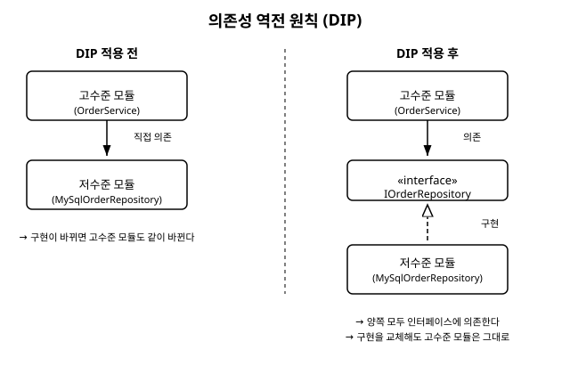

# 2장. 객체지향 설계 원칙 다시보기 (SOLID)

[◀ 이전: 1장. 디자인 패턴이란 무엇인가](ch01-디자인패턴이란.md) | [📖 목차](00-목차.md) | [다음: 3장. 싱글턴 ▶](ch03-싱글턴.md)

---

## 들어가며

디자인 패턴을 본격적으로 배우기 전에 반드시 짚어야 할 것이 있습니다. 패턴은 하늘에서 뚝 떨어진 마법의 공식이 아니라, 몇 가지 기본적인 객체지향 설계 원칙을 실제 코드 구조로 구현해 낸 결과물입니다. 이 원칙들을 먼저 이해하고 있으면, 앞으로 만날 23가지 패턴이 왜 그런 형태를 띠는지가 훨씬 자연스럽게 이해됩니다.

이번 장에서는 먼저 캡슐화, 다형성, 상속, 결합도와 응집도라는 객체지향의 기본 개념을 짧게 되짚어보고, 이어서 SOLID라는 이름으로 잘 알려진 다섯 가지 설계 원칙을 각각 나쁜 예와 좋은 예를 통해 살펴보겠습니다.

## 객체지향의 기본 개념 리마인드

### 캡슐화 (Encapsulation)

캡슐화는 객체의 내부 상태를 외부에서 마음대로 건드릴 수 없게 감추고, 정해진 메서드를 통해서만 접근하도록 하는 것입니다. 다음은 캡슐화가 깨진 예입니다.

```csharp
// 캡슐화가 안 된 클래스 - 외부에서 잔액을 마음대로 바꿀 수 있다
public class BankAccount
{
    public decimal Balance; // public 필드로 노출되어 있다
}

// 사용하는 쪽에서 벌어지는 일
var account = new BankAccount();
account.Balance = -1000; // 잔액이 음수가 되어도 아무도 막지 못한다
```

`Balance`가 `public` 필드로 열려 있으면, 이 클래스를 사용하는 어떤 코드든 잔액을 음수로 만들거나 갑자기 0으로 초기화할 수 있습니다. 아래처럼 바꾸면 상태 변경을 통제할 수 있습니다.

```csharp
// 캡슐화를 적용한 클래스
public class BankAccount
{
    private decimal _balance;

    public decimal Balance => _balance;

    public void Deposit(decimal amount)
    {
        if (amount <= 0)
            throw new ArgumentException("입금 금액은 0보다 커야 합니다.");
        _balance += amount;
    }

    public void Withdraw(decimal amount)
    {
        if (amount > _balance)
            throw new InvalidOperationException("잔액이 부족합니다.");
        _balance -= amount;
    }
}
```

이제 `_balance`는 `Deposit`과 `Withdraw`라는 정해진 통로를 통해서만 바뀌므로, 잘못된 상태가 될 가능성을 클래스 내부에서 차단할 수 있습니다.

### 다형성 (Polymorphism)

다형성은 서로 다른 클래스의 객체를 같은 인터페이스나 부모 타입으로 다루면서, 실제로는 각 객체가 자신에게 맞는 동작을 하도록 하는 능력입니다.

```csharp
public interface IShape
{
    double GetArea();
}

public class Circle : IShape
{
    private readonly double _radius;
    public Circle(double radius) => _radius = radius;
    public double GetArea() => Math.PI * _radius * _radius;
}

public class Rectangle : IShape
{
    private readonly double _width;
    private readonly double _height;
    public Rectangle(double width, double height)
    {
        _width = width;
        _height = height;
    }
    public double GetArea() => _width * _height;
}

// 사용하는 쪽에서는 구체적인 타입을 몰라도 된다
List<IShape> shapes = new List<IShape> { new Circle(3), new Rectangle(4, 5) };
foreach (var shape in shapes)
{
    Console.WriteLine($"넓이: {shape.GetArea():F2}");
}
```

`foreach` 문에서는 `Circle`인지 `Rectangle`인지 신경 쓰지 않고 `IShape`라는 하나의 타입으로만 다룹니다. 이 다형성은 앞으로 등장하는 거의 모든 패턴에서 핵심적인 역할을 합니다.

### 상속 (Inheritance)

상속은 공통 코드를 부모 클래스에 모아두고 자식 클래스가 이를 재사용하는 방법입니다. 하지만 상속은 "is-a(~는 ~이다)" 관계가 실제로 성립할 때만 써야 합니다. 흔히 저지르는 실수는 코드 재사용만을 목적으로 상속을 남용하는 것입니다.

```csharp
// 잘못된 상속 - Penguin은 날 수 없는데 Bird를 상속하면서 문제가 생긴다
public class Bird
{
    public virtual void Fly() => Console.WriteLine("날아갑니다.");
}

public class Penguin : Bird
{
    public override void Fly()
    {
        throw new NotSupportedException("펭귄은 날 수 없습니다."); // 억지로 예외 처리
    }
}
```

이 문제는 뒤에서 다룰 리스코프 치환 원칙과 정확히 맞닿아 있습니다. 상속 관계는 "자식이 부모의 자리를 완전히 대체할 수 있는가"를 기준으로 판단해야 합니다.

### 결합도와 응집도 (Coupling and Cohesion)

- **결합도**는 한 모듈이 다른 모듈에 얼마나 강하게 의존하는지를 나타냅니다. 결합도가 높으면 한쪽을 바꿀 때 다른 쪽도 따라 바뀌어야 하는 상황이 자주 발생합니다. 좋은 설계는 결합도를 낮추는 방향으로 갑니다.
- **응집도**는 한 모듈(클래스) 안의 구성 요소들이 얼마나 밀접하게 하나의 목적을 위해 뭉쳐 있는지를 나타냅니다. 응집도가 높으면 클래스가 하나의 명확한 역할만 담당하게 됩니다. 좋은 설계는 응집도를 높이는 방향으로 갑니다.

한 문장으로 요약하면, **"결합도는 낮게, 응집도는 높게"**가 객체지향 설계의 오래된 격언입니다. 이제 이 격언을 좀 더 구체적인 다섯 가지 원칙으로 풀어보겠습니다.

## SOLID란 무엇인가

SOLID는 로버트 마틴(Robert C. Martin)을 비롯한 여러 저자들의 논의를 거쳐 정착된, 객체지향 설계에서 흔히 따르는 다섯 가지 원칙의 앞글자를 딴 약어입니다.

- **S** - 단일 책임 원칙 (Single Responsibility Principle)
- **O** - 개방-폐쇄 원칙 (Open-Closed Principle)
- **L** - 리스코프 치환 원칙 (Liskov Substitution Principle)
- **I** - 인터페이스 분리 원칙 (Interface Segregation Principle)
- **D** - 의존성 역전 원칙 (Dependency Inversion Principle)

하나씩 나쁜 예와 좋은 예를 통해 살펴보겠습니다.

## S: 단일 책임 원칙 (SRP)

**하나의 클래스는 하나의 책임만 가져야 하며, 그 클래스를 변경해야 하는 이유도 하나뿐이어야 합니다.**

### 나쁜 예

```csharp
// 직원 정보 저장, 급여 계산, 보고서 출력까지 한 클래스가 모두 담당한다
public class Employee
{
    public string Name { get; set; }
    public decimal BaseSalary { get; set; }

    public decimal CalculatePay()
    {
        // 급여 계산 로직
        return BaseSalary * 1.1m;
    }

    public void SaveToDatabase()
    {
        // 데이터베이스에 저장하는 로직
        Console.WriteLine($"{Name} 정보를 DB에 저장합니다.");
    }

    public void PrintPayslip()
    {
        // 급여 명세서를 출력하는 로직
        Console.WriteLine($"{Name}님의 급여: {CalculatePay():C}");
    }
}
```

`Employee` 클래스는 급여 계산 규칙이 바뀌어도, 데이터베이스 저장 방식이 바뀌어도, 명세서 출력 형식이 바뀌어도 전부 수정 대상이 됩니다. 즉 이 클래스를 변경해야 하는 이유가 세 가지나 됩니다.

### 좋은 예

```csharp
// 직원의 데이터만 표현한다
public class Employee
{
    public string Name { get; set; }
    public decimal BaseSalary { get; set; }
}

// 급여 계산만 책임진다
public class PayrollCalculator
{
    public decimal CalculatePay(Employee employee)
    {
        return employee.BaseSalary * 1.1m;
    }
}

// 저장만 책임진다
public class EmployeeRepository
{
    public void Save(Employee employee)
    {
        Console.WriteLine($"{employee.Name} 정보를 DB에 저장합니다.");
    }
}

// 출력만 책임진다
public class PayslipPrinter
{
    private readonly PayrollCalculator _calculator;

    public PayslipPrinter(PayrollCalculator calculator)
    {
        _calculator = calculator;
    }

    public void Print(Employee employee)
    {
        Console.WriteLine($"{employee.Name}님의 급여: {_calculator.CalculatePay(employee):C}");
    }
}
```

각 클래스는 이제 변경 이유가 하나씩만 존재합니다. 급여 계산 규칙이 바뀌면 `PayrollCalculator`만, 저장 방식이 바뀌면 `EmployeeRepository`만 수정하면 됩니다.

## O: 개방-폐쇄 원칙 (OCP)

**기존 코드를 수정하지 않고도(폐쇄), 새로운 기능을 추가할 수 있어야 합니다(개방).**

### 나쁜 예

```csharp
// 할인 종류가 늘어날 때마다 이 메서드를 계속 고쳐야 한다
public class DiscountCalculator
{
    public decimal CalculateDiscount(string customerType, decimal price)
    {
        if (customerType == "Regular")
            return price * 0.05m;
        else if (customerType == "Vip")
            return price * 0.1m;
        else if (customerType == "Vvip")
            return price * 0.2m;
        // 새로운 고객 등급이 추가되면 이 메서드를 또 고쳐야 한다
        return 0;
    }
}
```

새로운 고객 등급이 생길 때마다 `if-else` 블록을 추가해야 하므로, 기존 코드를 계속 건드려야 합니다. 이는 실수를 만들 가능성을 계속 늘리는 구조입니다.

### 좋은 예

```csharp
// 할인 정책을 인터페이스로 추상화한다
public interface IDiscountPolicy
{
    decimal CalculateDiscount(decimal price);
}

public class RegularDiscountPolicy : IDiscountPolicy
{
    public decimal CalculateDiscount(decimal price) => price * 0.05m;
}

public class VipDiscountPolicy : IDiscountPolicy
{
    public decimal CalculateDiscount(decimal price) => price * 0.1m;
}

// 새로운 등급이 필요하면 클래스를 하나 추가하기만 하면 된다
public class VvipDiscountPolicy : IDiscountPolicy
{
    public decimal CalculateDiscount(decimal price) => price * 0.2m;
}

public class DiscountCalculator
{
    public decimal CalculateDiscount(IDiscountPolicy policy, decimal price)
    {
        return policy.CalculateDiscount(price);
    }
}
```

새로운 고객 등급이 추가되어도 `DiscountCalculator`는 전혀 수정할 필요가 없습니다. `IDiscountPolicy`를 구현하는 새 클래스만 추가하면 됩니다. 이 원칙은 4장 팩토리 메서드, 23장 전략 패턴에서 특히 명확하게 드러납니다.

## L: 리스코프 치환 원칙 (LSP)

**서브클래스는 부모 클래스가 쓰이는 모든 곳에서 부모 클래스를 대체할 수 있어야 하며, 대체했을 때 프로그램의 동작이 깨지면 안 됩니다.**

### 나쁜 예

앞서 살펴본 `Penguin`과 `Bird` 예시가 정확히 이 원칙을 위반한 경우입니다. 조금 더 흔한 사례를 살펴보겠습니다.

```csharp
public class Rectangle
{
    public virtual double Width { get; set; }
    public virtual double Height { get; set; }

    public double GetArea() => Width * Height;
}

// 정사각형은 수학적으로 사각형의 일종이지만, 여기서는 문제가 된다
public class Square : Rectangle
{
    public override double Width
    {
        get => base.Width;
        set { base.Width = value; base.Height = value; } // 너비를 바꾸면 높이도 같이 바뀐다
    }

    public override double Height
    {
        get => base.Height;
        set { base.Width = value; base.Height = value; } // 높이를 바꾸면 너비도 같이 바뀐다
    }
}

// 사용하는 쪽 코드
void ResizeRectangle(Rectangle rectangle)
{
    rectangle.Width = 5;
    rectangle.Height = 10;
    // Rectangle이라면 넓이가 50이 되어야 하는데, Square를 넣으면 100이 되어버린다
    Console.WriteLine(rectangle.GetArea());
}
```

`Rectangle`을 기대하고 작성한 `ResizeRectangle` 메서드에 `Square` 객체를 넣으면 예상과 다른 결과가 나옵니다. `Square`가 `Rectangle`의 계약(너비와 높이를 독립적으로 바꿀 수 있다)을 지키지 못하기 때문입니다.

### 좋은 예

```csharp
// 사각형과 정사각형을 별도의 타입으로 분리하고, 공통 인터페이스로 묶는다
public interface IShape
{
    double GetArea();
}

public class Rectangle : IShape
{
    public double Width { get; }
    public double Height { get; }

    public Rectangle(double width, double height)
    {
        Width = width;
        Height = height;
    }

    public double GetArea() => Width * Height;
}

public class Square : IShape
{
    public double Side { get; }

    public Square(double side)
    {
        Side = side;
    }

    public double GetArea() => Side * Side;
}
```

`Square`가 `Rectangle`을 상속하지 않고, 각자 `IShape`라는 공통 인터페이스만 구현하게 하면 서로의 계약을 어길 여지가 없어집니다. "상속 관계를 만들기 전에 정말 is-a 관계인지, 그리고 부모의 계약을 100% 지킬 수 있는지"를 항상 되짚어야 한다는 교훈을 주는 사례입니다.

## I: 인터페이스 분리 원칙 (ISP)

**클라이언트는 자신이 사용하지 않는 메서드에 의존하도록 강요받아서는 안 됩니다.**

### 나쁜 예

```csharp
// 모든 종류의 프린터가 스캔, 팩스, 인쇄 기능을 다 가진다고 가정한 인터페이스
public interface IMultiFunctionPrinter
{
    void Print(string document);
    void Scan(string document);
    void Fax(string document);
}

// 단순 인쇄만 가능한 저가형 프린터도 이 인터페이스를 구현해야 한다
public class BasicPrinter : IMultiFunctionPrinter
{
    public void Print(string document)
    {
        Console.WriteLine($"{document} 인쇄 중...");
    }

    public void Scan(string document)
    {
        throw new NotSupportedException("이 프린터는 스캔 기능이 없습니다.");
    }

    public void Fax(string document)
    {
        throw new NotSupportedException("이 프린터는 팩스 기능이 없습니다.");
    }
}
```

`BasicPrinter`는 자신이 지원하지 않는 `Scan`과 `Fax` 메서드까지 구현해야 하는 상황에 놓입니다. 인터페이스가 너무 크고 뚱뚱하게(fat interface) 설계되었기 때문입니다.

### 좋은 예

```csharp
// 기능별로 인터페이스를 잘게 분리한다
public interface IPrinter
{
    void Print(string document);
}

public interface IScanner
{
    void Scan(string document);
}

public interface IFax
{
    void Fax(string document);
}

// 단순 인쇄 전용 프린터는 필요한 인터페이스만 구현한다
public class BasicPrinter : IPrinter
{
    public void Print(string document)
    {
        Console.WriteLine($"{document} 인쇄 중...");
    }
}

// 복합기는 여러 인터페이스를 조합해서 구현한다
public class AllInOnePrinter : IPrinter, IScanner, IFax
{
    public void Print(string document) => Console.WriteLine($"{document} 인쇄 중...");
    public void Scan(string document) => Console.WriteLine($"{document} 스캔 중...");
    public void Fax(string document) => Console.WriteLine($"{document} 팩스 전송 중...");
}
```

이제 각 클래스는 자신이 실제로 지원하는 기능에 대한 인터페이스만 구현하면 됩니다. 더 이상 지원하지 않는 기능 때문에 예외를 던지는 코드를 억지로 작성할 필요가 없습니다.

## D: 의존성 역전 원칙 (DIP)

**고수준 모듈은 저수준 모듈의 구체적인 구현에 의존해서는 안 되며, 두 모듈 모두 추상화(인터페이스)에 의존해야 합니다.**

여기서 "고수준 모듈"이란 비즈니스 로직처럼 더 중요한 정책을 담당하는 코드를, "저수준 모듈"이란 파일 저장, 데이터베이스 접근처럼 구체적인 구현 세부사항을 담당하는 코드를 가리킵니다. 이름 때문에 헷갈릴 수 있는데, 코드의 물리적 위치나 호출 순서가 아니라 "누가 더 근본적인 정책을 담고 있는가"를 뜻합니다.

### 나쁜 예

```csharp
// 저수준 모듈: 구체적인 저장 방식
public class MySqlOrderRepository
{
    public void Save(string orderInfo)
    {
        Console.WriteLine($"MySQL에 주문 저장: {orderInfo}");
    }
}

// 고수준 모듈: 비즈니스 로직을 담당하지만, 구체 클래스에 직접 의존한다
public class OrderService
{
    private readonly MySqlOrderRepository _repository = new MySqlOrderRepository();

    public void PlaceOrder(string orderInfo)
    {
        // 주문 검증 등 비즈니스 로직...
        _repository.Save(orderInfo);
    }
}
```

`OrderService`는 `MySqlOrderRepository`라는 구체적인 클래스를 직접 알고 있습니다. 만약 저장소를 MongoDB나 파일 시스템으로 바꾸고 싶다면 `OrderService`의 코드까지 수정해야 합니다. 게다가 `OrderService`를 단위 테스트하려고 해도 실제 MySQL 연결 없이는 테스트하기 어렵습니다.

### 좋은 예

```csharp
// 고수준 모듈과 저수준 모듈이 함께 의존할 추상화
public interface IOrderRepository
{
    void Save(string orderInfo);
}

// 저수준 모듈이 추상화를 구현한다
public class MySqlOrderRepository : IOrderRepository
{
    public void Save(string orderInfo)
    {
        Console.WriteLine($"MySQL에 주문 저장: {orderInfo}");
    }
}

// 나중에 다른 저장 방식으로 바꾸는 것도 자유롭다
public class InMemoryOrderRepository : IOrderRepository
{
    private readonly List<string> _orders = new List<string>();

    public void Save(string orderInfo)
    {
        _orders.Add(orderInfo);
        Console.WriteLine($"메모리에 주문 저장: {orderInfo}");
    }
}

// 고수준 모듈은 구체 클래스가 아니라 인터페이스에 의존한다
public class OrderService
{
    private readonly IOrderRepository _repository;

    // 생성자를 통해 구체적인 구현을 외부에서 주입받는다
    public OrderService(IOrderRepository repository)
    {
        _repository = repository;
    }

    public void PlaceOrder(string orderInfo)
    {
        // 주문 검증 등 비즈니스 로직...
        _repository.Save(orderInfo);
    }
}

// 사용하는 쪽 (Main)
var service = new OrderService(new MySqlOrderRepository());
service.PlaceOrder("주문번호 1001");

// 테스트할 때는 InMemoryOrderRepository로 손쉽게 교체할 수 있다
var testService = new OrderService(new InMemoryOrderRepository());
testService.PlaceOrder("테스트 주문");
```

이제 `OrderService`는 `IOrderRepository`라는 추상화에만 의존합니다. 실제 구현이 MySQL이든, 메모리든, 나중에 추가될 다른 무엇이든 `OrderService`의 코드는 단 한 줄도 바뀌지 않습니다. 이렇게 생성자(또는 메서드, 속성)를 통해 외부에서 구체적인 구현을 넘겨주는 방식을 **의존성 주입(Dependency Injection)**이라고 부르며, 의존성 역전 원칙을 실제 코드로 실현하는 대표적인 방법입니다.

아래 다이어그램은 이 관계를 정리한 것입니다. DIP를 적용하기 전에는 고수준 모듈이 저수준 모듈을 직접 가리키지만, 적용한 후에는 양쪽 모두가 중간의 인터페이스를 향하게 됩니다.



이 원칙은 앞으로 배울 여러 패턴, 특히 5장 추상 팩토리, 23장 전략 패턴에서 핵심적인 역할을 합니다. 어떤 패턴이든 "구체 클래스 대신 인터페이스를 참조하게 만들어서 유연성을 확보한다"는 아이디어가 등장한다면, 그 뿌리는 대부분 의존성 역전 원칙입니다.

## SOLID와 디자인 패턴의 관계

지금까지 살펴본 다섯 가지 원칙을 다시 훑어보면, 흥미로운 공통점이 보입니다.

- 단일 책임 원칙은 "책임을 어떻게 나눌 것인가"를 이야기합니다. → 15장 체인 오브 리스판서빌리티, 19장 중재자 같은 패턴이 책임 분리를 구조화합니다.
- 개방-폐쇄 원칙은 "기존 코드를 건드리지 않고 확장하는 방법"을 이야기합니다. → 4장 팩토리 메서드, 11장 데코레이터, 23장 전략 패턴이 이 원칙을 정면으로 구현합니다.
- 리스코프 치환 원칙은 "상속과 다형성을 안전하게 쓰는 방법"을 이야기합니다. → 22장 상태, 24장 템플릿 메서드에서 이 원칙이 지켜지지 않으면 패턴 자체가 무너집니다.
- 인터페이스 분리 원칙은 "인터페이스를 작고 명확하게 쪼개는 방법"을 이야기합니다. → 9장 브리지, 13장 플라이웨이트에서 역할별로 인터페이스를 나누는 방식과 직결됩니다.
- 의존성 역전 원칙은 "구체 클래스 대신 추상화에 의존하는 방법"을 이야기합니다. → 거의 모든 생성 패턴(3장~7장)이 이 원칙을 기반으로 "무엇을 생성할지"를 유연하게 만듭니다.

결국 디자인 패턴은 이 원칙들을 실제 클래스 구조로 구체화해 놓은, 검증된 "적용 사례집"이라고 볼 수 있습니다. 원칙만 알고 있으면 막연하게 느껴지지만, 패턴을 통해 "이 원칙이 이런 모습으로 코드에 나타나는구나"를 확인하고 나면 훨씬 손에 잡히는 지식이 됩니다. 이제 다음 장부터는 이 원칙들이 실제로 어떤 클래스 구조로 구현되는지, 첫 번째 생성 패턴인 싱글턴부터 하나씩 살펴보겠습니다.

## 요약

- 캡슐화, 다형성, 상속은 객체지향의 기본 도구이며, 결합도는 낮추고 응집도는 높이는 것이 좋은 설계의 방향이다.
- SOLID는 단일 책임(SRP), 개방-폐쇄(OCP), 리스코프 치환(LSP), 인터페이스 분리(ISP), 의존성 역전(DIP)의 다섯 가지 원칙을 가리킨다.
- SRP는 한 클래스가 하나의 변경 이유만 갖도록 책임을 분리하라고 말한다.
- OCP는 기존 코드 수정 없이 새로운 기능을 추가할 수 있게 설계하라고 말한다.
- LSP는 서브클래스가 부모 타입의 계약을 완전히 지켜야 한다고 말한다.
- ISP는 인터페이스를 필요한 만큼만 작게 나누라고 말한다.
- DIP는 고수준 모듈과 저수준 모듈 모두 추상화에 의존해야 한다고 말하며, 의존성 주입이 이를 실현하는 대표적인 방법이다.
- 앞으로 배울 디자인 패턴들은 이 다섯 가지 원칙을 구체적인 클래스 구조로 구현한 사례들이다.

## 연습문제

1. 여러분이 최근에 작업한 클래스 중 하나를 골라, 그 클래스가 "변경해야 하는 이유"가 몇 가지나 있는지 따져보고 단일 책임 원칙 관점에서 분리가 필요한지 평가해 보세요.
2. `if-else`나 `switch` 문으로 타입을 분기하는 코드를 본 적이 있다면, 그 코드를 개방-폐쇄 원칙에 맞게 인터페이스와 다형성으로 바꾸는 방법을 스케치해 보세요.
3. 상속 관계로 설계된 클래스 중에서 리스코프 치환 원칙을 위반할 만한 사례를 하나 만들어 보고, 왜 문제가 되는지, 어떻게 고칠 수 있는지 설명해 보세요.
4. 하나의 인터페이스에 너무 많은 메서드가 들어 있어서 일부 클래스가 빈 구현이나 예외를 던지게 되는 경우를 겪어본 적이 있나요? 있다면 어떻게 인터페이스를 분리할 수 있을지 제안해 보세요.
5. `OrderService`와 `IOrderRepository` 예제를 참고하여, 여러분만의 시나리오(예: 알림 발송, 로그 기록)에서 의존성 역전 원칙을 적용한 C# 코드를 직접 작성해 보세요.

---

[◀ 이전: 1장. 디자인 패턴이란 무엇인가](ch01-디자인패턴이란.md) | [📖 목차](00-목차.md) | [다음: 3장. 싱글턴 ▶](ch03-싱글턴.md)
