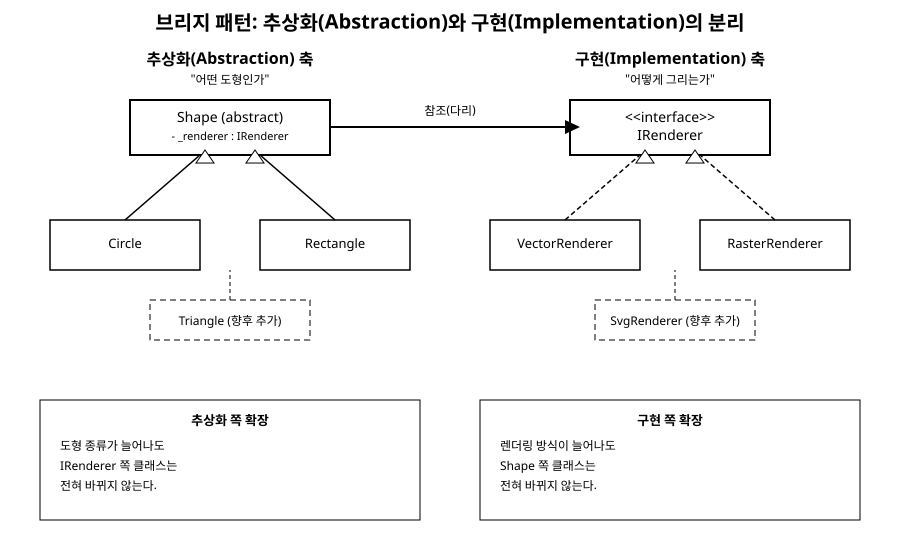

# 9장. 브리지(Bridge)

[◀ 이전: 8장. 어댑터](ch08-어댑터.md) | [📖 목차](00-목차.md) | [다음: 10장. 컴포지트 ▶](ch10-컴포지트.md)

---

## 문제 상황

그래픽 편집 프로그램을 만든다고 생각해 보자. 처음에는 도형이 원(Circle)과 사각형(Rectangle) 두 가지뿐이었고, 화면에 그리는 방식도 벡터 방식 하나뿐이었다. 그래서 `Shape`라는 추상 클래스를 만들고 `VectorCircle`, `VectorRectangle` 두 개의 서브클래스로 시작했다.

그런데 얼마 지나지 않아 요구사항이 늘어난다. 저해상도 프린터에 출력하기 위해 픽셀 단위로 그리는 래스터 방식도 지원해야 하고, 도형 종류도 삼각형(Triangle)이 추가된다. 상속만으로 이 문제를 풀면 다음과 같은 조합이 생긴다.

- `VectorCircle`, `RasterCircle`
- `VectorRectangle`, `RasterRectangle`
- `VectorTriangle`, `RasterTriangle`

도형 종류가 3개, 그리는 방식이 2개인데도 벌써 6개의 클래스가 필요하다. 여기에 도형이 하나 늘거나 렌더링 방식이 하나 늘 때마다 클래스 수는 곱셈으로 불어난다. 도형 10종류에 렌더링 방식 4종류라면 40개의 클래스를 만들어야 한다는 뜻이다.

더 큰 문제는 코드 중복이다. `VectorCircle`과 `RasterCircle`은 "원"이라는 도형의 속성(중심, 반지름)과 로직(넓이 계산 등)을 똑같이 가지고 있지만, 그리는 부분만 다르다. 그런데 상속 구조에서는 이 공통 로직을 `VectorCircle`과 `RasterCircle` 양쪽에 각각 구현하거나, 억지로 공통 조상을 만들어 끼워 맞춰야 한다. "도형의 종류"라는 축과 "그리는 방식"이라는 축이 서로 독립적으로 변해야 하는데, 상속 하나로 두 축을 동시에 표현하려다 보니 이런 폭발이 일어난 것이다.

## 패턴 설명

브리지 패턴은 이런 상황에서 변화하는 축을 두 개로 쪼갠 뒤, 상속이 아니라 객체 합성(composition)으로 그 둘을 연결한다.

- **추상화(Abstraction)**: 사용자가 다루는 개념적인 축. 여기서는 "어떤 도형인가"에 해당한다.
- **구현(Implementation)**: 실제로 일을 처리하는 축. 여기서는 "어떻게 그리는가"에 해당한다.

Abstraction은 Implementation의 인터페이스를 참조만 하고, 실제 작업은 Implementation에 위임한다. 두 계층은 각자 독립적인 상속 트리를 가질 수 있고, Abstraction 쪽에 도형이 하나 늘어도 Implementation 쪽 클래스 수는 그대로이며 반대도 마찬가지다. 즉 두 축이 곱셈이 아니라 덧셈으로 늘어난다. 도형 3종류 + 렌더링 방식 2종류라면 클래스는 3 + 2 + (연결을 위한 클래스 몇 개) 수준이 된다.

이때 Abstraction과 Implementation을 이어주는 다리(bridge) 역할을 하는 것이 바로 Implementation 인터페이스에 대한 참조다. 이 참조는 생성자나 속성을 통해 실행 시점에 주입되므로, 같은 도형 객체라도 실행 중에 렌더러를 바꿔 끼울 수도 있다.

아래는 Abstraction과 Implementation이 각각 독립적으로 확장되는 구조를 보여주는 다이어그램이다.



## C# 예제 코드

먼저 "그리는 방식" 축, 즉 Implementation을 정의한다.

```csharp
// 구현(Implementation) 인터페이스: 실제로 픽셀/좌표를 그리는 저수준 작업을 담당
public interface IRenderer
{
    void DrawCircle(double centerX, double centerY, double radius);
    void DrawRectangle(double x, double y, double width, double height);
}

// 구현체 1: 벡터 방식 렌더러
public class VectorRenderer : IRenderer
{
    public void DrawCircle(double centerX, double centerY, double radius)
    {
        Console.WriteLine($"[벡터] 원 경로 생성: 중심({centerX}, {centerY}), 반지름 {radius}");
    }

    public void DrawRectangle(double x, double y, double width, double height)
    {
        Console.WriteLine($"[벡터] 사각형 경로 생성: ({x}, {y}) 크기 {width}x{height}");
    }
}

// 구현체 2: 래스터(픽셀) 방식 렌더러
public class RasterRenderer : IRenderer
{
    public void DrawCircle(double centerX, double centerY, double radius)
    {
        int pixelCount = (int)(Math.PI * radius * radius);
        Console.WriteLine($"[래스터] 원을 픽셀 {pixelCount}개로 채움");
    }

    public void DrawRectangle(double x, double y, double width, double height)
    {
        int pixelCount = (int)(width * height);
        Console.WriteLine($"[래스터] 사각형을 픽셀 {pixelCount}개로 채움");
    }
}
```

다음으로 "도형의 종류" 축, 즉 Abstraction을 정의한다. Abstraction은 `IRenderer`를 필드로 가지고 있을 뿐, 구체적으로 어떤 렌더러인지는 신경 쓰지 않는다.

```csharp
// 추상화(Abstraction): 도형이라는 개념. 실제 그리기는 renderer에게 위임한다.
public abstract class Shape
{
    protected readonly IRenderer _renderer;

    protected Shape(IRenderer renderer)
    {
        _renderer = renderer;
    }

    public abstract void Draw();
    public abstract void Resize(double factor);
}

// 추상화의 구체 클래스 1: 원
public class Circle : Shape
{
    private double _radius;

    public Circle(IRenderer renderer, double radius) : base(renderer)
    {
        _radius = radius;
    }

    public override void Draw()
    {
        _renderer.DrawCircle(0, 0, _radius);
    }

    public override void Resize(double factor)
    {
        _radius *= factor;
    }
}

// 추상화의 구체 클래스 2: 사각형
public class Rectangle : Shape
{
    private double _width;
    private double _height;

    public Rectangle(IRenderer renderer, double width, double height) : base(renderer)
    {
        _width = width;
        _height = height;
    }

    public override void Draw()
    {
        _renderer.DrawRectangle(0, 0, _width, _height);
    }

    public override void Resize(double factor)
    {
        _width *= factor;
        _height *= factor;
    }
}
```

사용하는 쪽에서는 도형과 렌더러를 자유롭게 조합할 수 있다.

```csharp
public class Program
{
    public static void Main()
    {
        IRenderer vector = new VectorRenderer();
        IRenderer raster = new RasterRenderer();

        Shape circleOnVector = new Circle(vector, 10);
        Shape circleOnRaster = new Circle(raster, 10);
        Shape rectangleOnVector = new Rectangle(vector, 20, 5);

        circleOnVector.Draw();     // [벡터] 원 경로 생성...
        circleOnRaster.Draw();     // [래스터] 원을 픽셀...개로 채움
        rectangleOnVector.Draw();  // [벡터] 사각형 경로 생성...

        // 도형 종류(Circle)는 그대로 두고 렌더러만 바꿔 끼울 수도 있다
        Shape flexible = new Circle(vector, 3);
        flexible.Draw();
    }
}
```

여기에 삼각형(Triangle)이라는 도형이 추가되어도 `IRenderer`는 손댈 필요가 없고, 3D 렌더러 같은 새 구현이 추가되어도 `Shape` 계층은 손댈 필요가 없다. 두 축이 완전히 독립적으로 확장된다.

## 8장 어댑터와의 차이

8장에서 다룬 어댑터(Adapter)와 브리지는 구조도가 비슷해서 자주 혼동된다. 둘 다 "인터페이스를 사이에 두고 다른 구현으로 위임한다"는 형태를 취하기 때문이다. 하지만 등장 시점과 의도가 다르다.

- **어댑터**는 사후 대응이다. 이미 존재하는, 내가 바꿀 수 없는 기존 클래스(예: 외부 라이브러리)의 인터페이스가 내 코드가 기대하는 인터페이스와 맞지 않을 때, 그 사이에 변환기를 끼워 넣는다. 설계 시점에는 이런 결합을 예상하지 못했을 수도 있다. 목적은 "호환되지 않는 것을 나중에 맞추는 것"이다.
- **브리지**는 사전 설계다. 위 예제처럼 "도형의 종류"와 "그리는 방식"이라는 두 축이 각자 독립적으로 커질 것을 처음부터 예상하고, 설계 단계에서부터 두 계층을 분리해 둔다. 목적은 "앞으로 두 방향으로 확장될 것을 알기 때문에, 애초에 상속 하나로 뭉치지 않는 것"이다.

비유하면, 어댑터는 220V 제품을 110V 콘센트에 꽂기 위해 나중에 변환 플러그를 사 오는 것이고, 브리지는 처음부터 전압이 다른 나라에서도 쓸 수 있도록 전원 어댑터를 분리 가능한 부품으로 설계해 두는 것이다. 둘 다 "위임"을 쓰지만, 어댑터는 기존 인터페이스의 불일치를 해소하는 것이 목적이고 브리지는 애초에 다중 확장을 감당하기 위한 구조적 선택이라는 점에서 다르다.

## 언제 사용하는가

- 클래스가 두 개 이상의 독립적인 축을 따라 각각 변형될 수 있고, 상속만으로 표현하면 조합의 수가 곱셈으로 늘어날 때
- 구현 세부사항(플랫폼, 저장소, 렌더링 방식 등)을 추상화로부터 완전히 숨기고, 실행 시점에 구현을 바꿔 끼우고 싶을 때
- 상속 계층이 이미 지나치게 깊거나 넓어져서, 기능을 추가할 때마다 클래스가 기하급수적으로 늘어나는 것을 목격했을 때
- 클라이언트 코드가 구체적인 구현 클래스를 전혀 알지 못한 채로 동작해야 할 때 (5장 추상 팩토리와 함께 쓰면 구현체 생성까지도 숨길 수 있다)

## 요약

브리지 패턴은 하나의 개념을 "무엇을 하는가"(Abstraction)와 "어떻게 하는가"(Implementation)라는 두 개의 독립적인 계층으로 나누고, 상속이 아닌 합성으로 이 둘을 연결한다. 그 결과 두 축이 서로에게 영향을 주지 않은 채 자유롭게 확장될 수 있어, 상속만으로 설계했을 때 발생하는 클래스 수의 폭발을 막을 수 있다. 8장의 어댑터와 구조가 비슷해 보이지만, 어댑터는 이미 존재하는 인터페이스 불일치를 사후에 해결하는 패턴이고 브리지는 향후의 다중 확장을 염두에 두고 사전에 설계하는 패턴이라는 점에서 목적이 다르다.

## 연습문제

1. 브리지 패턴에서 "다리" 역할을 하는 것은 정확히 무엇인가? Abstraction 클래스의 어떤 요소가 이 역할을 수행하는지 코드를 근거로 설명하라.
2. 본문의 예제에 `Triangle` 클래스와 `SvgRenderer` 클래스를 추가해 보라. 기존의 `IRenderer`, `Shape` 코드를 얼마나 수정해야 하는지 확인하라.
3. 어댑터 패턴과 브리지 패턴은 UML 구조가 비슷하지만 의도가 다르다고 했다. 여러분이 실제로 겪을 수 있는 상황을 하나씩 들어 두 패턴을 구분해 보라.
4. 메시지 발송 기능(이메일, SMS, 푸시)과 메시지 종류(공지, 광고, 경고)를 브리지로 설계한다면 어느 쪽이 Abstraction이고 어느 쪽이 Implementation이 되어야 할지 근거를 들어 설명하라.
5. 브리지 패턴을 적용하지 않고 상속만으로 설계했을 때 필요한 클래스 수를, 축이 각각 m개, n개일 때와 브리지를 적용했을 때로 나누어 수식으로 비교해 보라.

---

[◀ 이전: 8장. 어댑터](ch08-어댑터.md) | [📖 목차](00-목차.md) | [다음: 10장. 컴포지트 ▶](ch10-컴포지트.md)
