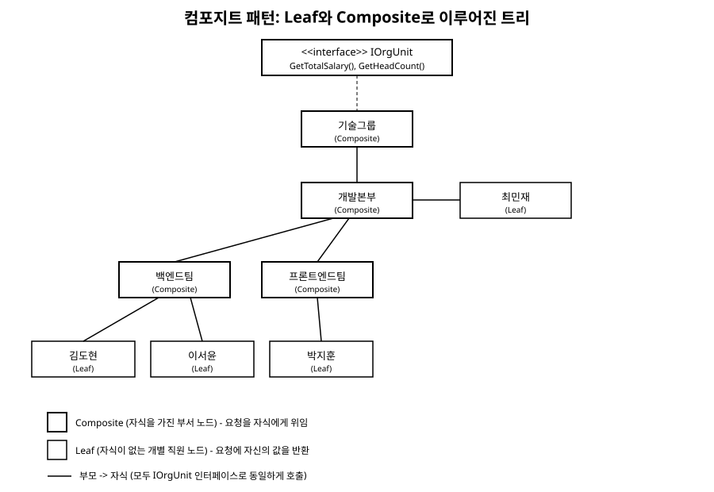

# 10장. 컴포지트(Composite)

[◀ 이전: 9장. 브리지](ch09-브리지.md) | [📖 목차](00-목차.md) | [다음: 11장. 데코레이터 ▶](ch11-데코레이터.md)

---

## 문제 상황

회사의 인사 시스템을 만든다고 하자. 조직도는 개별 직원(Employee)과, 여러 직원 또는 하위 부서를 포함하는 부서(Department)로 구성된다. 예를 들어 "개발본부" 아래에 "백엔드팀"과 "프론트엔드팀"이 있고, 각 팀 아래에 여러 직원이 소속되어 있으며, "개발본부" 자체도 더 큰 조직인 "기술그룹" 아래에 속할 수 있다.

이제 "이 조직의 인건비 총합을 구하라"는 기능을 만들어야 한다. 개별 직원이라면 그냥 자신의 연봉을 반환하면 된다. 그런데 부서라면 어떻게 해야 할까? 부서 자체는 연봉이 없으니, 자신에게 속한 모든 직원과 하위 부서를 찾아가서 각각의 인건비를 더해야 한다. 그리고 그 하위 부서 역시 자신의 하위 부서를 또 뒤져야 한다.

이 문제를 처음 접하면 대개 다음과 같은 코드를 짜기 쉽다.

```csharp
public double CalculateTotalSalary(object node)
{
    if (node is Employee employee)
    {
        return employee.Salary;
    }
    else if (node is Department department)
    {
        double total = 0;
        foreach (var child in department.Children)
        {
            total += CalculateTotalSalary(child); // 각 자식이 또 직원인지 부서인지 검사해야 함
        }
        return total;
    }
    throw new ArgumentException("알 수 없는 노드 타입");
}
```

이 코드는 동작은 하지만 문제가 많다. 인건비 총합 말고 "총 인원수를 구하라", "이름을 트리 형태로 출력하라" 같은 기능이 추가될 때마다 `is Employee`, `is Department` 분기를 매번 새로 작성해야 한다. 게다가 나중에 "계약직 직원"이나 "프로젝트 태스크포스" 같은 세 번째 노드 종류가 추가되면, 이 타입 검사 코드를 찾아서 전부 손봐야 한다. 개별 대상과 그 대상들의 묶음을 서로 다른 타입으로 다루면서, 호출하는 쪽에서 매번 "이게 낱개인지 묶음인지"를 구분해야 하는 것이 근본 문제다.

## 패턴 설명

컴포지트 패턴은 이 문제를 "낱개 객체(Leaf)와 낱개들의 묶음(Composite)에 동일한 인터페이스를 부여한다"는 방법으로 해결한다.

- **Component**: Leaf와 Composite가 공통으로 구현하는 인터페이스(또는 추상 클래스). "인건비를 계산하라" 같은 연산이 여기에 선언된다.
- **Leaf**: 자식을 가지지 않는 말단 객체. 여기서는 개별 직원(Employee)이다. 연산을 요청받으면 자기 자신의 값을 그대로 반환한다.
- **Composite**: 다른 Component(Leaf든 Composite든 상관없다)를 자식으로 담을 수 있는 객체. 여기서는 부서(Department)다. 연산을 요청받으면 자신이 가진 모든 자식에게 같은 연산을 그대로 요청하고, 그 결과를 모아서 되돌려준다.

핵심은 Composite가 자식을 다룰 때 그 자식이 Leaf인지 또 다른 Composite인지 전혀 신경 쓰지 않는다는 점이다. 자식도 똑같이 Component 인터페이스를 구현하고 있으므로, Composite는 그냥 "내 자식들에게 같은 메서드를 호출한다"는 한 가지 규칙만 따르면 된다. 이렇게 하면 트리가 몇 단계로 깊어지든, 호출하는 쪽 코드는 최상위 노드 하나에만 메서드를 호출하면 되고 나머지는 재귀적으로 저절로 처리된다.

아래는 Leaf와 Composite가 하나의 인터페이스 아래에서 트리 구조를 이루는 모습이다.



## C# 예제 코드

먼저 Leaf와 Composite가 공유할 Component 인터페이스를 정의한다.

```csharp
// Component: 개별 직원과 부서가 공통으로 구현하는 인터페이스
public interface IOrgUnit
{
    string Name { get; }
    decimal GetTotalSalary();      // 인건비 총합
    int GetHeadCount();            // 인원수 총합
    void Print(int depth);         // 트리 형태로 출력
}
```

Leaf는 자식이 없는 개별 직원이다.

```csharp
// Leaf: 자식을 갖지 않는 말단 노드
public class Employee : IOrgUnit
{
    public string Name { get; }
    private readonly decimal _salary;

    public Employee(string name, decimal salary)
    {
        Name = name;
        _salary = salary;
    }

    public decimal GetTotalSalary() => _salary;

    public int GetHeadCount() => 1;

    public void Print(int depth)
    {
        Console.WriteLine(new string(' ', depth * 2) + $"- {Name} ({_salary:C0})");
    }
}
```

Composite는 자식 목록을 가지고, 자신에게 온 요청을 모든 자식에게 그대로 위임한 뒤 결과를 취합한다.

```csharp
// Composite: 다른 IOrgUnit(Leaf든 Composite든)을 자식으로 담는 노드
public class Department : IOrgUnit
{
    public string Name { get; }
    private readonly List<IOrgUnit> _children = new List<IOrgUnit>();

    public Department(string name)
    {
        Name = name;
    }

    // 자식은 개별 직원일 수도, 하위 부서일 수도 있다 - 타입 구분 없이 받는다
    public void Add(IOrgUnit child)
    {
        _children.Add(child);
    }

    public void Remove(IOrgUnit child)
    {
        _children.Remove(child);
    }

    public decimal GetTotalSalary()
    {
        decimal total = 0;
        foreach (var child in _children)
        {
            total += child.GetTotalSalary(); // 자식이 Leaf든 Composite든 동일하게 호출
        }
        return total;
    }

    public int GetHeadCount()
    {
        int count = 0;
        foreach (var child in _children)
        {
            count += child.GetHeadCount();
        }
        return count;
    }

    public void Print(int depth)
    {
        Console.WriteLine(new string(' ', depth * 2) + $"+ {Name}");
        foreach (var child in _children)
        {
            child.Print(depth + 1); // 재귀 호출: 트리를 한 단계씩 내려간다
        }
    }
}
```

사용하는 쪽은 트리의 구조를 전혀 모른 채로, 최상위 노드 하나에만 메서드를 호출하면 된다.

```csharp
public class Program
{
    public static void Main()
    {
        var backend = new Department("백엔드팀");
        backend.Add(new Employee("김도현", 65_000_000));
        backend.Add(new Employee("이서윤", 58_000_000));

        var frontend = new Department("프론트엔드팀");
        frontend.Add(new Employee("박지훈", 60_000_000));

        var devDivision = new Department("개발본부");
        devDivision.Add(backend);
        devDivision.Add(frontend);
        devDivision.Add(new Employee("최민재", 90_000_000)); // 본부 직속 직원도 가능

        var techGroup = new Department("기술그룹");
        techGroup.Add(devDivision);

        // 호출하는 쪽은 techGroup이 몇 단계로 이루어져 있는지 전혀 알 필요가 없다
        Console.WriteLine($"총 인건비: {techGroup.GetTotalSalary():C0}");
        Console.WriteLine($"총 인원수: {techGroup.GetHeadCount()}명");
        techGroup.Print(0);
    }
}
```

여기서 "계약직 직원"이나 "프로젝트 태스크포스" 같은 새로운 노드 종류가 필요해지면, `IOrgUnit`을 구현하는 클래스를 하나 더 추가하기만 하면 된다. `Department`의 `Add`, `GetTotalSalary` 같은 기존 코드는 한 줄도 건드릴 필요가 없다. 문제 상황에서 보았던 `is Employee`, `is Department` 분기가 통째로 사라진 것을 확인할 수 있다.

## 언제 사용하는가

- 전체와 부분을 같은 방식으로 다뤄야 할 때: 파일과 폴더, 조직과 구성원, UI의 컨테이너와 위젯처럼 "묶음 안에 낱개와 묶음이 섞여 있는" 트리 구조가 자연스러운 도메인일 때
- 클라이언트 코드가 재귀적인 구조를 순회할 때 "이게 낱개인지 묶음인지"를 구분하는 조건문을 계속 작성하고 있다면, 그 신호는 대개 컴포지트로 정리할 수 있다는 뜻이다
- 트리의 깊이가 실행 중에 얼마나 깊어질지 미리 알 수 없을 때 (재귀 호출이 알아서 깊이에 맞춰 처리한다)
- 16장 커맨드나 21장 옵저버처럼 "여러 개를 하나처럼 다루고 싶다"는 요구가 반복적으로 나타나는 상황과도 잘 어울린다. 예컨대 여러 커맨드를 묶은 매크로 커맨드도 컴포지트 구조로 만들 수 있다

다만 Composite에 자식을 추가/삭제하는 메서드(`Add`, `Remove`)를 Component 인터페이스에까지 올릴지, Composite 클래스에만 둘지는 설계 선택의 문제다. 인터페이스에 올리면 Leaf도 이 메서드를 구현해야 하므로(대개 예외를 던지거나 아무 일도 하지 않는 식으로) 타입 안전성이 떨어지지만 클라이언트 코드는 더 단순해진다. 반대로 Composite에만 두면 안전성은 높아지지만 클라이언트가 자식을 추가하려 할 때 캐스팅이 필요해진다. 본문 예제는 후자를 택했다.

## 요약

컴포지트 패턴은 개별 객체(Leaf)와 그 객체들의 묶음(Composite)에 동일한 인터페이스를 부여함으로써, 클라이언트가 둘을 구분하지 않고 똑같이 다룰 수 있게 한다. Composite는 자신에게 온 요청을 자식들에게 그대로 전달하는 역할만 하고, 그 자식이 다시 Leaf인지 Composite인지는 재귀 호출 과정에서 자연스럽게 해소된다. 그 결과 트리 구조를 순회하는 코드에서 타입 분기 조건문이 사라지고, 새로운 노드 종류를 추가할 때도 기존 코드를 건드리지 않고 확장할 수 있다.

## 연습문제

1. 본문의 조직도 예제에 `Freelancer`(계약직 직원)라는 새 Leaf 클래스를 추가해 보라. `Department`나 `IOrgUnit` 인터페이스를 수정해야 하는가?
2. `IOrgUnit`에 `Add`/`Remove` 메서드를 넣지 않고 `Department` 클래스에만 둔 이유를 본문에서 설명했다. 만약 반대로 `IOrgUnit`에 이 메서드들을 선언했다면 `Employee` 클래스는 어떻게 구현해야 할지, 그리고 그 선택의 장단점을 논하라.
3. `Department.GetTotalSalary()`와 `GetHeadCount()`는 구조가 거의 동일한 재귀 순회를 두 번 반복하고 있다. 이 중복을 줄이려면 어떤 설계를 고려할 수 있을까? (힌트: 23장 전략 패턴이나 방문자 패턴을 참고할 수 있다)
4. 파일 시스템의 파일과 폴더를 컴포지트로 설계한다면 Component, Leaf, Composite에 각각 어떤 클래스가 대응하는지, 그리고 "폴더 전체 용량 계산" 기능을 어떻게 구현할지 설계해 보라.
5. 컴포지트 패턴을 적용하기 전 문제 상황 코드에 있던 `is Employee`, `is Department` 분기가 패턴 적용 후 어디로, 어떻게 사라졌는지 코드를 비교하며 설명하라.

---

[◀ 이전: 9장. 브리지](ch09-브리지.md) | [📖 목차](00-목차.md) | [다음: 11장. 데코레이터 ▶](ch11-데코레이터.md)
