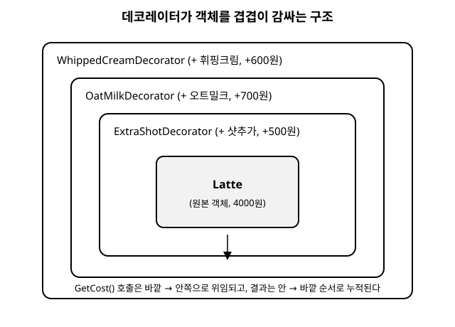

# 11장. 데코레이터(Decorator)

[◀ 이전: 10장. 컴포지트](ch10-컴포지트.md) | [📖 목차](00-목차.md) | [다음: 12장. 퍼사드 ▶](ch12-퍼사드.md)

---

## 문제 상황

작은 스페셜티 커피 전문점을 위한 주문 시스템을 만든다고 생각해 보자. 처음에는 메뉴가 단순했다. `Espresso`, `Americano`, `Latte` 세 가지 클래스만 있으면 충분했고, 각 클래스는 `GetDescription()`과 `GetCost()`를 구현해 주문서에 이름과 가격을 출력했다.

문제는 손님들이 옵션을 요구하기 시작하면서 벌어졌다. 샷을 추가하고 싶은 손님, 오트밀크로 바꾸고 싶은 손님, 바닐라 시럽에 휘핑크림까지 얹고 싶은 손님이 뒤섞여 몰려온다. 이걸 상속으로 처리하려고 하면 다음과 같은 클래스가 필요해진다.

```csharp
class EspressoWithExtraShot : Espresso { /* ... */ }
class LatteWithOatMilk : Latte { /* ... */ }
class LatteWithOatMilkAndVanilla : Latte { /* ... */ }
class LatteWithOatMilkAndVanillaAndWhip : Latte { /* ... */ }
class AmericanoWithExtraShotAndWhip : Americano { /* ... */ }
// ... 옵션이 하나 늘어날 때마다 조합의 수는 기하급수적으로 늘어난다
```

옵션이 4가지(샷 추가, 오트밀크, 바닐라 시럽, 휘핑크림)만 있어도 각 옵션을 켜고 끄는 조합은 2의 4제곱, 즉 16가지다. 여기에 기본 음료 종류(에스프레소, 아메리카노, 라떼)를 곱하면 이론상 만들어야 하는 클래스가 48개에 달한다. 옵션이 하나 더 늘어나면 그 수는 다시 두 배가 된다. 이것이 바로 상속을 기능 조합의 도구로 사용할 때 나타나는 "클래스 폭발(class explosion)" 문제다.

게다가 가격 계산 로직도 문제다. `LatteWithOatMilkAndVanillaAndWhip`의 `GetCost()`는 라떼 가격에 오트밀크, 바닐라, 휘핑 가격을 모두 더해야 하는데, 이 계산 코드는 비슷한 조합의 클래스마다 중복해서 나타난다. 옵션 가격이 바뀌면 관련된 모든 클래스를 찾아서 고쳐야 한다.

## 패턴 설명

데코레이터 패턴은 이 문제를 상속이 아니라 **합성(composition)**으로 푼다. 핵심 아이디어는 "옵션도 음료와 똑같은 인터페이스를 구현하게 만들고, 원래 음료 객체를 감싸도록 하자"는 것이다.

구조는 다음 네 가지 요소로 이루어진다.

- **Component(공통 인터페이스)**: `IBeverage`처럼 기본 객체와 장식된 객체가 모두 따라야 하는 인터페이스.
- **ConcreteComponent(원본 객체)**: `Espresso`, `Americano`, `Latte`처럼 장식되기 전의 기본 객체.
- **Decorator(장식자 추상 클래스)**: `IBeverage`를 구현하면서 동시에 내부에 다른 `IBeverage`를 필드로 들고 있는 클래스. 자신이 감싸고 있는 객체에 작업을 위임한 뒤, 자신만의 동작을 더한다.
- **ConcreteDecorator(구체적인 장식자)**: `ExtraShotDecorator`, `OatMilkDecorator`처럼 실제 옵션 하나하나를 구현한 클래스.

중요한 점은 Decorator도 Component와 같은 인터페이스를 구현하기 때문에, 장식된 객체를 다시 다른 Decorator로 감쌀 수 있다는 것이다. 이렇게 감싸는 과정을 여러 번 반복하면 마치 양파처럼 원본 객체 바깥으로 여러 겹의 장식이 쌓인다. 클라이언트는 이 전체 구조를 여전히 `IBeverage` 하나로만 다루면 되므로, 몇 겹을 씌우든 사용법은 동일하다.

아래 그림은 `Espresso` 객체 하나가 `ExtraShotDecorator`, `OatMilkDecorator`, `WhippedCreamDecorator`로 차례로 감싸지는 모습을 보여준다.



## C# 예제 코드

```csharp
// 공통 인터페이스: 기본 음료와 장식된 음료가 모두 이 형태를 따른다
public interface IBeverage
{
    string GetDescription();
    decimal GetCost();
}

// ConcreteComponent: 장식되기 전의 기본 음료들
public class Espresso : IBeverage
{
    public string GetDescription() => "에스프레소";
    public decimal GetCost() => 3000m;
}

public class Latte : IBeverage
{
    public string GetDescription() => "카페라떼";
    public decimal GetCost() => 4000m;
}

// Decorator: IBeverage를 구현하면서 내부에 다른 IBeverage를 보관한다
public abstract class BeverageDecorator : IBeverage
{
    protected readonly IBeverage _beverage;

    protected BeverageDecorator(IBeverage beverage)
    {
        _beverage = beverage;
    }

    // 기본 구현은 감싸고 있는 대상에게 그대로 위임한다
    public virtual string GetDescription() => _beverage.GetDescription();
    public virtual decimal GetCost() => _beverage.GetCost();
}

// ConcreteDecorator 1: 샷 추가
public class ExtraShotDecorator : BeverageDecorator
{
    public ExtraShotDecorator(IBeverage beverage) : base(beverage) { }

    public override string GetDescription() => _beverage.GetDescription() + " + 샷추가";
    public override decimal GetCost() => _beverage.GetCost() + 500m;
}

// ConcreteDecorator 2: 오트밀크로 변경
public class OatMilkDecorator : BeverageDecorator
{
    public OatMilkDecorator(IBeverage beverage) : base(beverage) { }

    public override string GetDescription() => _beverage.GetDescription() + " + 오트밀크";
    public override decimal GetCost() => _beverage.GetCost() + 700m;
}

// ConcreteDecorator 3: 휘핑크림 추가
public class WhippedCreamDecorator : BeverageDecorator
{
    public WhippedCreamDecorator(IBeverage beverage) : base(beverage) { }

    public override string GetDescription() => _beverage.GetDescription() + " + 휘핑크림";
    public override decimal GetCost() => _beverage.GetCost() + 600m;
}
```

클라이언트는 원하는 옵션을 겹겹이 씌워가며 주문을 조립한다.

```csharp
public class Program
{
    public static void Main()
    {
        // 라떼에 오트밀크와 휘핑크림을 추가한 주문
        IBeverage order = new Latte();
        order = new OatMilkDecorator(order);
        order = new WhippedCreamDecorator(order);

        Console.WriteLine($"{order.GetDescription()} : {order.GetCost()}원");
        // 카페라떼 + 오트밀크 + 휘핑크림 : 5300원

        // 에스프레소에 샷을 두 번 추가한 주문 (같은 데코레이터를 중복 적용)
        IBeverage doubleShot = new ExtraShotDecorator(new ExtraShotDecorator(new Espresso()));
        Console.WriteLine($"{doubleShot.GetDescription()} : {doubleShot.GetCost()}원");
        // 에스프레소 + 샷추가 + 샷추가 : 4000원
    }
}
```

이 방식이라면 새로운 옵션이 하나 더 필요해질 때, 해야 할 일은 `BeverageDecorator`를 상속하는 클래스 하나를 추가하는 것뿐이다. 기존 음료 클래스나 기존 데코레이터는 전혀 손댈 필요가 없고, 옵션들을 어떤 순서와 개수로 조합하든 새 클래스를 만들 필요가 없다.

## 상속 대신 합성을 사용하는 이점

이 구조가 2장에서 다룬 개방-폐쇄 원칙(OCP)을 그대로 실현하고 있다는 점에 주목할 필요가 있다. 새 옵션을 추가할 때 기존 코드를 수정하지 않고 새 클래스를 하나 추가하는 것만으로 기능이 확장된다. 또한 2장에서 강조한 "상속보다 합성을 선호하라(favor composition over inheritance)"는 원칙의 대표적인 실전 사례이기도 하다.

상속으로 옵션을 표현하면 조합의 수만큼 클래스가 필요하고, 그 관계는 컴파일 시점에 고정된다. 반면 합성으로 옵션을 표현하면 런타임에 어떤 객체를 어떤 순서로 감쌀지 자유롭게 결정할 수 있고, 필요한 클래스의 수는 옵션의 개수(덧셈)에 비례할 뿐 조합의 수(곱셈)에 비례하지 않는다. 옵션이 4개면 데코레이터 클래스도 4개면 충분하다. 앞서 계산했던 48개짜리 클래스 목록이 4개의 데코레이터로 대체된 셈이다.

## 언제 사용하는가

- 기존 클래스를 건드리지 않고 객체 하나하나에 새로운 책임을 동적으로 추가하고 싶을 때
- 상속으로 기능을 조합하면 클래스 수가 감당할 수 없이 늘어날 때
- 기능을 켜고 끄는 조합이 실행 중에 결정되어야 할 때 (컴파일 시점에 고정된 상속으로는 표현하기 어렵다)
- .NET 표준 라이브러리의 `Stream` 계열(`FileStream`, `BufferedStream`, `GZipStream`, `CryptoStream`)이 서로를 감싸며 조합되는 방식도 데코레이터 패턴의 실제 사례다

주의할 점은, 데코레이터는 감싸는 대상의 **기능을 확장**하는 데 목적이 있다는 것이다. 이 점에서 14장에서 다룰 프록시(Proxy) 패턴과 구조적으로 매우 비슷해 보이지만 의도는 다르다. 프록시는 대상에 대한 **접근을 제어**하는 것이 목적이다(예: 생성을 지연시키거나, 권한을 검사하거나, 네트워크 너머의 객체를 대신하는 것). 데코레이터는 "무엇을 할 수 있는가"를 늘리고, 프록시는 "언제, 누가, 어떻게 접근할 수 있는가"를 관리한다. 이 차이는 14장에서 더 자세히 다룬다.

## .NET BCL에서 이 패턴 찾아보기

`System.IO.Stream`을 감싸는 클래스들은 .NET BCL에서 데코레이터 패턴을 설명할 때 가장 널리 인용되는 사례다. `FileStream`이 원본 스트림(ConcreteComponent)이라면, `BufferedStream`, `GZipStream`, `CryptoStream` 같은 클래스들은 모두 생성자로 다른 `Stream`을 받아 감싸면서, 자기 자신도 똑같이 `Stream`을 상속한다. 즉 본문의 `BeverageDecorator`가 `IBeverage`를 구현하면서 내부에 다른 `IBeverage`를 들고 있던 것과 동일한 구조다.

```csharp
// FileStream(ConcreteComponent)을 GZipStream으로 감싸 압축 기능을 추가하고,
// 그 결과를 다시 CryptoStream으로 감싸 암호화 기능을 추가한다
using FileStream fileStream = File.Create("data.bin");

using CryptoStream cryptoStream = new CryptoStream(
    fileStream,
    aes.CreateEncryptor(),
    CryptoStreamMode.Write);

using GZipStream gzipStream = new GZipStream(
    cryptoStream,
    CompressionMode.Compress);

// 클라이언트는 gzipStream이 몇 겹으로 감싸져 있는지 몰라도
// 그냥 Stream의 Write 메서드 하나만 호출하면 된다
byte[] buffer = Encoding.UTF8.GetBytes("hello, decorator pattern");
gzipStream.Write(buffer, 0, buffer.Length);
```

이 코드에서 `gzipStream.Write()`를 호출하면 `GZipStream`이 데이터를 압축한 뒤 `cryptoStream`에 넘기고, `CryptoStream`은 그것을 다시 암호화해서 원본 `fileStream`에 최종적으로 써넣는다. 각 클래스는 자신이 감싸고 있는 스트림에 작업을 위임하면서 자신만의 기능(버퍼링, 압축, 암호화)을 더한다는 점에서, 본문에서 `OatMilkDecorator`와 `WhippedCreamDecorator`가 `_beverage.GetCost()`를 호출한 뒤 자신의 가격을 더하던 방식과 구조적으로 완전히 동일하다.

또한 이 예제는 데코레이터를 여러 겹으로 쌓을 수 있다는 점도 잘 보여준다. `BufferedStream`으로 한 겹 더 감싸서 버퍼링 기능을 추가할 수도 있고, 어떤 순서로 감쌀지도 호출하는 쪽에서 자유롭게 결정할 수 있다. `Stream`을 사용하는 코드는 그 안에 몇 겹의 데코레이터가 씌워져 있는지 전혀 알 필요 없이, `Write()`나 `Read()` 같은 `Stream`의 공통 인터페이스만 호출하면 된다는 점에서 본문 커피 예제의 `IBeverage`와 정확히 같은 이점을 준다.

## 요약

- 상속만으로 기능을 조합하면 조합 가능한 옵션 수만큼 클래스가 곱으로 늘어나는 클래스 폭발이 발생한다.
- 데코레이터 패턴은 원본 객체와 동일한 인터페이스를 구현하는 래퍼 객체로 원본을 감싸서 기능을 추가한다.
- 데코레이터는 여러 겹으로 중첩해서 씌울 수 있으며, 클라이언트는 몇 겹이 씌워졌는지 신경 쓰지 않고 동일한 인터페이스로 다룬다.
- 이 패턴은 개방-폐쇄 원칙을 지키며, 상속보다 합성을 선호하는 설계 원칙의 대표적인 적용 사례다.
- 구조는 프록시 패턴과 비슷하지만, 목적이 기능 추가냐 접근 제어냐에서 차이가 난다.

## 연습문제

1. 위 예제에 "카라멜 시럽 추가(+400원)" 옵션을 `CaramelSyrupDecorator`로 추가해 보라. 기존 클래스를 수정해야 하는 부분이 있는지 확인해 보라.
2. 만약 같은 옵션을 두 번 이상 적용하는 것을 금지해야 한다면(예: 오트밀크 변경은 한 번만 가능), 이 제약을 데코레이터 구조 안에서 어떻게 표현할 수 있을지 설계해 보라.
3. `GetDescription()`이 항상 "기본 음료 이름 + 옵션들" 순서로 나열되는 이유를 데코레이터를 감싸는 순서와 위임 방향을 근거로 설명해 보라.
4. 커피 옵션이 아니라 텍스트 파일을 읽는 스트림에 "압축 해제", "암호 해독", "로깅" 기능을 조합하는 상황을 가정하고, `IBeverage` 예제와 동일한 구조로 클래스 설계를 스케치해 보라.
5. 데코레이터로 가격을 더하는 대신, 특정 옵션(예: 오트밀크)이 다른 옵션(예: 샷 추가)보다 항상 먼저 적용되어야 한다는 순서 제약이 있다면, 이를 강제하는 방법에는 어떤 것들이 있을지 논의해 보라.

---

[◀ 이전: 10장. 컴포지트](ch10-컴포지트.md) | [📖 목차](00-목차.md) | [다음: 12장. 퍼사드 ▶](ch12-퍼사드.md)
