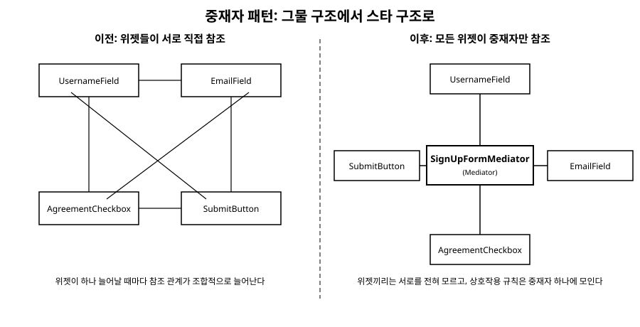

# 19장. 중재자(Mediator)

[◀ 이전: 18장. 이터레이터](ch18-이터레이터.md) | [📖 목차](00-목차.md) | [다음: 20장. 메멘토 ▶](ch20-메멘토.md)

---

## 문제 상황

회원가입 폼을 만든다고 해보자. 폼에는 아이디 입력란, 이메일 입력란, "이용약관에 동의합니다" 체크박스, 그리고 가입 버튼이 있다. 요구사항은 단순하다. 아이디가 4자 이상이고, 이메일 형식이 올바르고, 체크박스가 선택되어 있어야만 가입 버튼이 활성화된다. 그리고 세 조건 중 하나라도 충족되지 않으면 화면 하단에 어떤 조건이 부족한지 안내 문구를 띄워준다.

처음에는 각 위젯이 서로를 직접 참조하게 만들었다. 아이디 입력란은 값이 바뀔 때마다 이메일 입력란과 체크박스의 현재 상태를 직접 확인하고, 조건이 맞으면 가입 버튼의 `Enable()`을 직접 호출했다.

```csharp
public class UsernameField
{
    public string Value { get; private set; }
    private readonly EmailField _emailField;      // 다른 위젯을 직접 참조
    private readonly AgreementCheckbox _agreement; // 다른 위젯을 직접 참조
    private readonly SubmitButton _submitButton;   // 다른 위젯을 직접 참조

    public UsernameField(EmailField emailField, AgreementCheckbox agreement, SubmitButton submitButton)
    {
        _emailField = emailField;
        _agreement = agreement;
        _submitButton = submitButton;
    }

    public void OnChanged(string newValue)
    {
        Value = newValue;
        bool ok = newValue.Length >= 4 && _emailField.IsValid && _agreement.IsChecked;
        _submitButton.SetEnabled(ok); // 조건을 직접 계산해서 다른 위젯을 조작
    }
}
```

문제는 여기서 끝나지 않는다. 이메일 입력란도 같은 이유로 아이디 입력란과 체크박스를 참조해야 하고, 체크박스도 아이디 입력란과 이메일 입력란을 참조해야 한다. 위젯이 4개면 서로를 참조하는 관계가 최대 12개까지 생길 수 있다. 여기에 "비밀번호 확인란"을 하나 추가하면, 기존 위젯 세 개의 코드를 모두 열어서 새 위젯을 참조하도록 고쳐야 한다. 위젯 하나를 추가할 때마다 나머지 모든 위젯의 코드가 흔들리는 것이다.

더 나쁜 것은 "가입 버튼을 활성화할지 결정하는 조건"이라는 하나의 규칙이 세 개의 위젯 클래스에 나뉘어 흩어져 있다는 점이다. 조건을 바꾸려면 여러 파일을 찾아다니며 고쳐야 하고, 그 과정에서 위젯 사이의 참조 관계는 점점 더 촘촘한 그물처럼 얽혀간다.

## 패턴 설명

중재자 패턴은 이런 그물 구조를 별 모양(스타) 구조로 바꾼다. 객체들이 서로를 직접 참조하는 대신, 모두가 **중재자(Mediator)**라는 하나의 객체만 알게 하고, 객체 사이의 통신은 반드시 이 중재자를 거치도록 강제한다.

구조를 이루는 요소는 다음과 같다.

- **Mediator**: 여러 객체(Colleague) 사이의 상호작용 규칙을 한곳에 모아두는 인터페이스. "누가 어떤 상태로 바뀌면 다른 누구에게 무엇을 알려야 하는가"를 이 안에서 결정한다.
- **ConcreteMediator**: 실제 규칙을 구현하는 클래스. 위 예제라면 "아이디 4자 이상, 이메일 형식 정상, 체크박스 선택 시에만 가입 버튼 활성화"라는 규칙이 여기 하나로 모인다.
- **Colleague**: 중재자를 통해서만 다른 Colleague와 상호작용하는 객체. 자기 상태가 바뀌면 다른 Colleague를 직접 건드리지 않고, 중재자에게 "내 상태가 이렇게 바뀌었다"고 알리기만 한다.

Colleague는 다른 Colleague의 존재조차 몰라도 된다. 오직 중재자 인터페이스 하나만 참조하면 충분하다. 그래서 위젯을 하나 추가하거나 제거해도, 손대야 하는 코드는 중재자 하나로 좁혀진다.

## C# 예제 코드

```csharp
// 위젯들이 상태 변화를 알릴 때 사용하는 중재자 인터페이스
public interface ISignUpFormMediator
{
    void NotifyChanged(object sender);
}

// 폼에 참여하는 모든 위젯의 공통 기반. 각자 중재자 하나만 참조한다.
public abstract class FormWidget
{
    protected readonly ISignUpFormMediator Mediator;

    protected FormWidget(ISignUpFormMediator mediator)
    {
        Mediator = mediator;
    }
}

// 아이디 입력란: 다른 위젯을 전혀 모른다
public class UsernameField : FormWidget
{
    public string Value { get; private set; } = "";

    public UsernameField(ISignUpFormMediator mediator) : base(mediator) { }

    public void Input(string newValue)
    {
        Value = newValue;
        Mediator.NotifyChanged(this); // "내가 바뀌었다"고만 알린다
    }

    public bool IsValid => Value.Length >= 4;
}

// 이메일 입력란: 역시 다른 위젯을 모른다
public class EmailField : FormWidget
{
    public string Value { get; private set; } = "";

    public EmailField(ISignUpFormMediator mediator) : base(mediator) { }

    public void Input(string newValue)
    {
        Value = newValue;
        Mediator.NotifyChanged(this);
    }

    public bool IsValid => Value.Contains("@") && Value.Contains(".");
}

// 약관 동의 체크박스
public class AgreementCheckbox : FormWidget
{
    public bool IsChecked { get; private set; }

    public AgreementCheckbox(ISignUpFormMediator mediator) : base(mediator) { }

    public void Toggle(bool value)
    {
        IsChecked = value;
        Mediator.NotifyChanged(this);
    }
}

// 가입 버튼: 스스로 활성화 여부를 계산하지 않고 중재자가 지시한 대로만 따른다
public class SubmitButton : FormWidget
{
    public bool Enabled { get; private set; }

    public SubmitButton(ISignUpFormMediator mediator) : base(mediator) { }

    public void SetEnabled(bool enabled)
    {
        Enabled = enabled;
        Console.WriteLine(enabled ? "[가입 버튼] 활성화됨" : "[가입 버튼] 비활성화됨");
    }
}

// 안내 문구 라벨
public class HintLabel : FormWidget
{
    public HintLabel(ISignUpFormMediator mediator) : base(mediator) { }

    public void Show(string message) => Console.WriteLine($"[안내] {message}");
}

// 실제 규칙을 담고 있는 구체 중재자.
// "누가 바뀌면 무엇을 확인하고, 누구에게 무엇을 지시할지"가 이 클래스 하나에 모인다.
public class SignUpFormMediator : ISignUpFormMediator
{
    private UsernameField _username;
    private EmailField _email;
    private AgreementCheckbox _agreement;
    private SubmitButton _submitButton;
    private HintLabel _hint;

    // 위젯들은 생성 후에 중재자에 등록된다
    public void Register(UsernameField username, EmailField email,
        AgreementCheckbox agreement, SubmitButton submitButton, HintLabel hint)
    {
        _username = username;
        _email = email;
        _agreement = agreement;
        _submitButton = submitButton;
        _hint = hint;
    }

    public void NotifyChanged(object sender)
    {
        // sender가 누구인지는 로깅 목적 외에는 중요하지 않다.
        // 어떤 위젯이 바뀌었든 결국 세 조건을 다시 확인하면 된다.
        if (!_username.IsValid)
        {
            _hint.Show("아이디는 4자 이상이어야 합니다.");
            _submitButton.SetEnabled(false);
            return;
        }
        if (!_email.IsValid)
        {
            _hint.Show("이메일 형식이 올바르지 않습니다.");
            _submitButton.SetEnabled(false);
            return;
        }
        if (!_agreement.IsChecked)
        {
            _hint.Show("이용약관에 동의해야 합니다.");
            _submitButton.SetEnabled(false);
            return;
        }

        _hint.Show("모든 조건을 만족했습니다.");
        _submitButton.SetEnabled(true);
    }
}

public class SignUpFormDemo
{
    public static void Main()
    {
        var mediator = new SignUpFormMediator();

        var username = new UsernameField(mediator);
        var email = new EmailField(mediator);
        var agreement = new AgreementCheckbox(mediator);
        var submitButton = new SubmitButton(mediator);
        var hint = new HintLabel(mediator);

        mediator.Register(username, email, agreement, submitButton, hint);

        Console.WriteLine("--- 아이디만 입력 ---");
        username.Input("hong");

        Console.WriteLine("\n--- 이메일 입력 ---");
        email.Input("hong@example.com");

        Console.WriteLine("\n--- 약관 동의 체크 ---");
        agreement.Toggle(true);
    }
}
```

`UsernameField`, `EmailField`, `AgreementCheckbox`, `SubmitButton`은 서로의 존재를 전혀 모른다. 각자 `ISignUpFormMediator` 하나만 참조하고, 자기 상태가 바뀌면 `NotifyChanged(this)`를 호출할 뿐이다. "가입 버튼을 언제 활성화할지"라는 규칙은 `SignUpFormMediator` 한 곳에만 존재하므로, 조건을 바꾸거나 "비밀번호 확인란"처럼 위젯을 새로 추가하고 싶을 때도 `SignUpFormMediator`와 새 위젯 클래스만 건드리면 된다. 기존 위젯들의 코드는 한 줄도 바뀌지 않는다.

## 옵저버 패턴과 함께 사용하기

위 예제에서 `NotifyChanged`는 사실 21장에서 다룰 옵저버 패턴의 "알림"과 매우 닮아 있다. 실제로 많은 실무 코드에서는 Colleague가 중재자를 직접 호출하는 대신, 중재자가 각 Colleague의 이벤트를 구독(옵저버 패턴)하는 방식으로 두 패턴을 함께 사용한다. 예를 들어 `UsernameField`가 `Changed` 이벤트를 발생시키고, `SignUpFormMediator`가 생성 시점에 그 이벤트를 구독해 두는 식이다. 이렇게 하면 Colleague는 중재자 인터페이스조차 참조하지 않아도 되어 결합도가 한층 더 낮아진다. 다만 이번 장에서는 중재자 패턴의 핵심 구조를 명확히 보여주기 위해 명시적인 메서드 호출 방식으로 구현했다.

두 패턴의 관계를 구조로 나타내면 다음과 같다.



## 언제 사용하는가

중재자 패턴은 다음과 같은 상황에서 힘을 발휘한다.

- 여러 객체가 서로 얽혀서 통신해야 하는데, 그 객체 수가 늘어날수록 참조 관계가 조합적으로 폭증할 때. 이번 장의 폼 위젯이 대표적이다.
- 여러 객체 사이의 상호작용 규칙이 한 곳에 모여 있어야 관리하기 쉬운 경우. 항공 관제 시스템에서 여러 비행기가 서로 직접 교신하지 않고 관제탑(Mediator)을 통해서만 교신하는 것도 같은 이유다.
- 채팅방처럼 다수의 참여자가 있고, 참여자 수가 실행 중에도 계속 바뀌는 경우. 참여자가 서로를 직접 참조한다면 누군가 채팅방을 나갈 때마다 남아있는 모든 참여자의 참조 목록을 정리해야 하지만, 중재자(채팅방 객체)를 통해서만 메시지를 주고받으면 참여자는 중재자에 등록되고 해제되는 것만 신경 쓰면 된다.

반대로 객체 사이의 상호작용이 한두 가지뿐이고 앞으로도 늘어날 가능성이 낮다면, 중재자를 도입하는 것은 오히려 불필요한 간접 계층을 하나 더 만드는 셈이 된다. 그리고 중재자에 규칙을 지나치게 많이 몰아넣으면 중재자 클래스 자체가 거대해지는 "신 클래스(God class)" 문제로 이어질 수 있으니, 규칙이 복잡해지면 중재자 내부를 다시 여러 메서드나 보조 클래스로 나누어 정리하는 것이 좋다.

## .NET BCL에서 이 패턴 찾아보기

솔직히 말하면, 지금까지 살펴본 다른 패턴들과 달리 .NET BCL 안에서 "이것이 중재자 패턴의 대표 사례다"라고 자신 있게 짚을 만한 뚜렷한 클래스는 찾기 어렵다. 억지로 사례를 끼워 맞추기보다는 이 사실을 정직하게 밝히는 편이 낫다.

다만 패턴의 이름 자체를 그대로 가져다 쓴 유명한 사례가 있다. .NET 커뮤니티에서 널리 쓰이는 **MediatR**이라는 라이브러리가 그것인데, 이름에서 알 수 있듯 중재자 패턴을 애플리케이션 아키텍처 수준으로 확장한 것이다. 다만 이는 .NET BCL의 일부가 아니라 NuGet으로 별도 설치해야 하는 서드파티 오픈소스 패키지라는 점을 분명히 해둘 필요가 있다. MediatR을 쓰면 여러 요청 처리기(핸들러)가 서로를 직접 참조하지 않고, `IMediator.Send(request)` 하나만 호출해서 적절한 핸들러로 요청을 전달받는 식으로 동작한다.

BCL 안에서 개념적으로 가장 가까운 것을 꼽자면 `System.Reactive`(Rx)의 `Subject<T>` 정도를 조심스럽게 들 수 있다. 다만 이 역시 BCL 코어가 아니라 별도 패키지로 배포되는 라이브러리다.

```csharp
using System;
using System.Reactive.Subjects;

var subject = new Subject<string>(); // 발행자와 구독자 사이를 중개하는 지점 역할

// 여러 구독자가 서로를 몰라도, subject 하나만 알면 메시지를 받을 수 있다
subject.Subscribe(msg => Console.WriteLine($"[구독자 A] {msg}"));
subject.Subscribe(msg => Console.WriteLine($"[구독자 B] {msg}"));

subject.OnNext("이벤트 발생"); // subject가 등록된 모든 구독자에게 전달한다
```

`Subject<T>`는 발행자가 `OnNext`로 값을 흘려보내면, 그 값을 구독 중인 여러 대상에게 전달하는 중개 지점 역할을 한다는 점에서 "여러 객체 사이의 통신을 하나의 중개자가 떠맡는다"는 중재자 패턴의 정신과 맞닿아 있다. 하지만 엄밀히 보면 `Subject<T>`는 21장에서 다룰 옵저버 패턴(발행-구독)에 훨씬 가깝고, 중재자 패턴처럼 "누가 어떤 상태일 때 누구에게 무엇을 지시할지"에 대한 규칙을 담고 있지는 않다. 그래서 이 둘을 "같은 패턴"이라고 단정하기보다는, 여러 객체 사이에 직접 참조 대신 하나의 중개 지점을 두었다는 구조적 유사성 정도로 받아들이는 것이 정확하다.

## 요약

- 중재자 패턴은 여러 객체가 서로 직접 참조하며 그물처럼 얽히는 구조를, 모든 객체가 중재자 하나만 참조하는 별 모양 구조로 바꾼다.
- Colleague는 자기 상태 변화만 중재자에게 알리고, "그 변화가 다른 객체에 어떤 영향을 주는가"라는 규칙은 전부 중재자 안에 모인다.
- 새로운 Colleague를 추가하거나 상호작용 규칙을 바꿀 때, 건드려야 하는 코드가 중재자 하나로 좁혀진다.
- 옵저버 패턴과 함께 쓰면 Colleague가 중재자 인터페이스조차 참조하지 않도록 만들 수 있으며, 이 조합은 21장에서 다시 다룬다.

## 연습문제

1. 이번 장의 `SignUpFormMediator`에 "비밀번호 입력란"과 "비밀번호 확인 입력란"을 추가하고, 두 값이 일치해야 가입 버튼이 활성화되도록 규칙을 확장해 보라. 기존 위젯 클래스 중 수정해야 하는 것이 있는가?
2. 온라인 회의 프로그램에서 참가자가 화면 공유를 시작하면 다른 모든 참가자의 카메라 화면이 작게 축소되어야 한다는 요구가 있다. 참가자(Colleague)와 회의실(Mediator)을 사용해 이 상호작용을 설계해 보라.
3. 이번 장 예제에서 `NotifyChanged(object sender)`는 어떤 위젯이 보냈는지 구분하지 않고 항상 세 조건을 전부 다시 검사한다. 위젯이 10개로 늘어난다면 이 방식이 어떤 문제를 일으킬 수 있는지, 그리고 `sender`를 활용해 개선할 방법을 설명해 보라.
4. "옵저버 패턴과 함께 사용하기" 절에서 설명한 이벤트 구독 방식으로 `UsernameField`를 다시 작성해 보라. `Changed` 이벤트를 어떤 시그니처로 선언해야 하는가?
5. 중재자 패턴과 12장 퍼사드는 둘 다 여러 객체 앞에 하나의 객체를 두는 구조다. 두 패턴의 목적이 어떻게 다른지 설명해 보라.

---

[◀ 이전: 18장. 이터레이터](ch18-이터레이터.md) | [📖 목차](00-목차.md) | [다음: 20장. 메멘토 ▶](ch20-메멘토.md)
