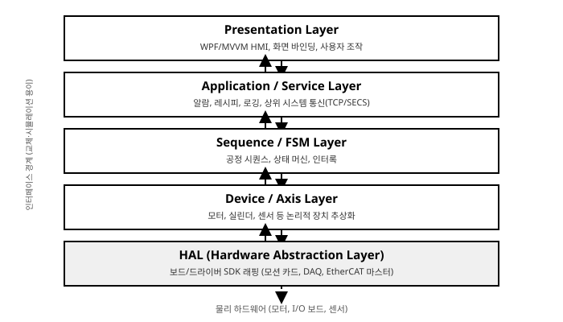

# 1장. C# 기반 장비 제어 시스템 개요

[◀ 이전: 목차](00-목차.md) | [📖 목차](00-목차.md) | [다음: 2장. 비동기 및 멀티스레딩 환경 구축 ▶](ch02-비동기및멀티스레딩환경구축.md)


반도체 증착 장비의 챔버 도어가 열리고, 로봇 암이 웨이퍼를 카세트에서 꺼내 얼라이너로 옮기고, 다시 프로세스 챔버에 안착시키기까지 걸리는 시간은 불과 몇 초다. 이 짧은 시간 동안 수십 개의 모터 축이 동기화되어 움직이고, 수백 개의 디지털 I/O가 상태를 주고받으며, 진공도·온도·유량 센서 값이 수 밀리초 단위로 감시되고, 이 모든 흐름은 화면 위에서 엔지니어가 실시간으로 확인할 수 있어야 한다. 그리고 이상이 생기면 즉시 알람이 뜨고, 장비는 안전한 상태로 정지해야 한다. 이 복잡한 오케스트레이션을 담당하는 것이 바로 장비 제어 소프트웨어(Equipment Control Software)다.

이 책은 이러한 장비 제어 소프트웨어를 C#과 .NET 플랫폼으로 개발하는 실무 엔지니어를 위한 전문서다. 1장에서는 본격적인 구현에 들어가기 전에 반드시 짚고 넘어가야 할 네 가지 주제를 다룬다. 첫째, PC 기반 제어라는 아키텍처 선택이 왜 산업 현장에서 대세가 되었는지, 그리고 그 안에서 C#/.NET이 왜 합리적인 선택인지를 살펴본다. 둘째, 장비 제어 소프트웨어를 어떻게 계층화하여 설계해야 유지보수 가능하고 테스트 가능한 구조가 되는지 다룬다. 셋째, WPF와 WinForms, .NET Framework와 최신 .NET 사이에서 실무적으로 어떤 기준으로 프레임워크를 선택해야 하는지 논의한다. 마지막으로, C#/.NET 환경에서 "실시간성"이 의미하는 바와 그 한계, 그리고 그 한계를 실무적으로 우회하는 기법을 다룬다.

## 1. PC 기반 장비 제어(PC-Based Control)와 C#/.NET의 장점

### 1.1 PC 기반 제어 vs. PLC 단독 제어

산업 자동화의 제어 아키텍처를 이야기할 때 가장 먼저 등장하는 대립 구도는 "PLC(Programmable Logic Controller) 단독 제어"와 "PC 기반 제어(PC-Based Control)"다. 두 방식은 상호 배타적이라기보다는 서로 다른 문제를 잘 푸는 도구이며, 실제 현장에서는 혼합된 형태로 쓰이는 경우가 많다. 이 차이를 정확히 이해하는 것이 장비 제어 소프트웨어 아키텍처를 설계하는 출발점이다.

PLC는 래더 로직(Ladder Logic)이나 구조화 텍스트(Structured Text, IEC 61131-3) 기반으로 프로그래밍되며, 스캔 사이클(scan cycle)이라는 결정론적(deterministic) 실행 모델을 가진다. 매 스캔마다 입력을 읽고, 로직을 평가하고, 출력을 갱신하는 과정이 고정된 주기로 반복된다. 이 구조 덕분에 PLC는 다음과 같은 영역에서 압도적으로 강하다.

- **저수준 I/O 제어와 인터록**: 비상정지, 안전 도어, 가스 누출 감지처럼 밀리초 단위의 확정적 응답이 요구되는 안전 로직
- **결정론적 타이밍**: 스캔 사이클이 보장되므로 특정 시점에 특정 출력이 반드시 갱신된다는 것을 하드웨어 수준에서 보장
- **환경 내구성**: 팬 없는 밀폐형 하드웨어, 넓은 동작 온도 범위, 진동/노이즈에 대한 강건성
- **검증된 안전 인증**: SIL(Safety Integrity Level), 카테고리 3/4 등 기능 안전 인증을 받은 안전 PLC/세이프티 릴레이와의 결합

반면 PLC는 다음과 같은 영역에서 근본적인 한계를 가진다.

- **복잡한 시퀀스/로직 표현력**: 래더 로직으로 수십 단계의 분기와 예외 처리를 포함한 공정 시퀀스를 표현하면 코드가 급격히 비대해지고 가독성이 떨어진다. 객체지향, 제네릭, LINQ 같은 현대적 추상화 도구가 없다.
- **풍부한 UI**: PLC 자체는 HMI 패널(터치스크린)과 결합되긴 하지만, 복잡한 데이터 시각화, 트렌드 차트, 커스텀 대시보드를 만들기에는 표현력이 제한적이다.
- **대용량 데이터 처리 및 로깅**: 공정 데이터를 데이터베이스에 기록하거나, 이미지/비전 데이터를 처리하거나, 대용량 로그 파일을 관리하는 작업은 PLC의 설계 목적을 벗어난다.
- **네트워크 통신 유연성**: MES(Manufacturing Execution System), SECS/GEM, 비전 시스템, 바코드 리더 등 이기종 시스템과의 통신 프로토콜을 다양하게 구현하기 어렵다.
- **소프트웨어 생태계**: 버전 관리(Git), 단위 테스트, CI/CD, 서드파티 라이브러리 등 현대적 소프트웨어 개발 관행을 적용하기 어렵다.

PC 기반 제어는 이 두 번째 그룹의 요구사항, 즉 복잡한 시퀀스 로직, 리치 UI, 데이터 관리, 네트워크 통신을 PC(산업용 PC, IPC)에서 담당하게 하고, 안전 인터록이나 결정론적 모션 사이클처럼 PLC/전용 컨트롤러가 잘하는 영역은 그대로 PLC나 모션 컨트롤러, EtherCAT 마스터에 위임하는 방식이다. 즉 "PC가 PLC를 완전히 대체한다"는 개념이 아니라, **각자가 잘하는 역할을 분담하는 하이브리드 아키텍처**로 이해하는 것이 정확하다. 이 역할 분담 원칙은 4절의 실시간성 논의와 3장의 하드웨어 통신, 4장의 모션 제어에서 다시 등장할 핵심 주제다.

이해를 돕기 위해 전형적인 반도체 이온주입 장비의 예를 들어보자. 웨이퍼 카세트에서 웨이퍼를 꺼내 프로세스 챔버로 이송하는 로봇 암의 서보 모터는 EtherCAT 마스터의 사이클릭 태스크가 1ms 주기로 직접 위치/속도 지령을 주고받으며 제어한다. 이 사이클릭 루프 자체는 C# 애플리케이션이 관여하지 않는다. 반면 "카세트 슬롯 3번의 웨이퍼를 얼라이너로 옮기고, 얼라인이 끝나면 챔버 A로 이송하라"는 시퀀스 판단, 그 과정에서 이송 실패 시 재시도 여부를 결정하는 로직, 진공도가 기준치에 도달할 때까지 대기하는 조건, 오퍼레이터에게 현재 진행 상황을 화면에 보여주는 것은 모두 C# 기반 상위 애플리케이션의 몫이다. 비상정지 버튼이 눌렸을 때 모든 축을 즉시 정지시키는 안전 로직은 C# 애플리케이션의 상태와 무관하게 안전 PLC와 하드와이어드 릴레이 회로가 담당한다. 이처럼 하나의 장비 안에서도 시간 스케일과 안전 등급에 따라 제어 주체가 다층적으로 나뉘어 있다는 것이 PC 기반 제어 아키텍처의 실체다.

이러한 하이브리드 구조에서 C# 애플리케이션이 상위 컨트롤러(PLC, EtherCAT 마스터, 모션 카드)와 주고받는 통신 방식도 다양하다. PLC와는 이더넷 기반 프로토콜(예: TCP/IP 소켓, OPC UA)로 태그 단위의 값을 주고받는 경우가 많고, 모션 카드는 PCI/PCIe 버스를 통해 벤더 SDK(네이티브 DLL)를 P/Invoke로 호출하는 방식이 일반적이며, EtherCAT 마스터는 별도의 마스터 스택 라이브러리를 통해 프로세스 데이터 객체(PDO)를 주기적으로 갱신하는 방식으로 연동한다. 이 각각의 통신 방식은 3장에서 실제 코드와 함께 상세히 다룬다.

반도체, 디스플레이, 2차전지(배터리) 제조 장비에서 최근 10여 년간 PC 기반 제어가 급속히 확산된 데에는 몇 가지 구체적인 이유가 있다.

**공정 복잡도의 증가.** 최신 반도체 장비는 하나의 챔버 안에서도 수십 개의 레시피 파라미터, 수백 개의 인터록 조건, 로트(Lot) 단위의 이력 관리가 필요하다. 이런 복잡도는 래더 로직보다 객체지향 언어와 상태 머신(5장 참조)으로 표현할 때 훨씬 관리하기 쉽다.

**비전 검사와의 결합.** 디스플레이 패널의 결함 검사, 2차전지 전극의 이물 검사처럼 머신비전이 공정에 깊이 결합되는 장비가 늘면서, 비전 SDK(Halcon, Cognex VisionPro 등)를 자연스럽게 호출할 수 있는 PC 환경이 필수가 됐다(8장에서 상세히 다룬다).

**상위 시스템 연동(SECS/GEM, MES).** 반도체 팹의 자동화 표준인 SECS/GEM, 디스플레이·2차전지 라인의 MES 연동은 소켓 통신, XML/JSON 파싱, 상태 리포팅 등 PC 환경에서 훨씬 자연스러운 작업이다.

**터치스크린 HMI와 UX 요구 증가.** 엔지니어와 오퍼레이터가 요구하는 UI 수준이 높아지면서(실시간 트렌드 차트, 3D 웨이퍼 맵, 다국어 지원 등) WPF 같은 리치 클라이언트 프레임워크의 필요성이 커졌다.

**개방형 산업 이더넷의 보편화.** EtherCAT, PROFINET 같은 산업 이더넷 프로토콜이 표준화되면서, PC의 표준 NIC(또는 전용 마스터 카드)로 수십~수백 축의 모션과 I/O를 결정론적으로 제어할 수 있게 됐다. 이는 PC가 더 이상 "느슨한 상위 제어"에 머물지 않고 사이클릭 태스크에 가까운 역할까지 넘볼 수 있게 한 기술적 배경이다(3장 참조).

### 1.2 왜 C#/.NET인가

PC 기반 제어를 채택하기로 했다면, 다음 질문은 "어떤 언어와 플랫폼으로 구현할 것인가"다. 산업 현장에는 C++, C#, 심지어 Python 기반 제어 소프트웨어도 존재한다. 이 책이 C#/.NET을 다루는 이유는 다음과 같은 실무적 근거에 기반한다.

**생산성 — 강타입 언어와 풍부한 표준 라이브러리.** C#은 정적 타입 언어이면서도 제네릭, LINQ, `async/await`, 패턴 매칭 등 현대적 언어 기능을 갖추고 있다. 장비 제어 소프트웨어처럼 수만 라인 이상으로 커지는 프로젝트에서, 컴파일 타임에 타입 오류를 잡아낼 수 있다는 것은 런타임에 발생하는 장비 오동작의 위험을 줄이는 것과 직결된다. `System.Collections.Generic`, `System.Threading`, `System.Net.Sockets`, `System.IO.Ports` 등 .NET 표준 라이브러리만으로도 직렬 통신, TCP/IP 통신, 멀티스레딩, 파일 I/O의 상당 부분을 커버할 수 있다. C++로 동일한 작업을 하려면 서드파티 라이브러리 선정과 메모리 관리에 훨씬 많은 공수가 든다.

**WPF의 성숙한 UI 프레임워크.** 2006년 출시된 WPF(Windows Presentation Foundation)는 XAML 기반 선언적 UI, 강력한 데이터 바인딩, 벡터 그래픽 렌더링, 스타일/템플릿 시스템을 갖추고 있다. 장비 제어 HMI에 필요한 실시간 트렌드 차트, 커스텀 상태 표시등, 애니메이션이 있는 장비 레이아웃 화면 등을 WinForms보다 훨씬 적은 코드로, 훨씬 유지보수하기 쉬운 형태로 구현할 수 있다. WPF의 MVVM(Model-View-ViewModel) 패턴은 UI와 비즈니스 로직을 분리하여 테스트 가능성을 높인다는 점에서도 장비 제어처럼 로직 검증이 중요한 도메인에 잘 맞는다(6장에서 본격적으로 다룬다).

**.NET의 크로스플랫폼화 (.NET 8/9).** .NET Framework 시절에는 Windows 전용이었지만, .NET Core 이후 통합된 현대 .NET(.NET 8은 LTS, .NET 9는 STS)은 Windows뿐 아니라 Linux, ARM 아키텍처까지 지원한다. 이는 산업용 임베디드 PC나 엣지 컴퓨팅 장비가 Linux 기반으로 전환되는 최근 흐름에 대응할 수 있는 유연성을 제공한다. 예를 들어 데이터 수집·전처리를 담당하는 백그라운드 서비스는 .NET 8 기반 콘솔 애플리케이션으로 작성해 Linux 임베디드 게이트웨이에 배포하고, HMI는 여전히 Windows 기반 WPF로 유지하는 하이브리드 구성도 가능하다. 다만 WPF 자체는 여전히 Windows 전용 UI 프레임워크임을 명확히 해둘 필요가 있다 — 크로스플랫폼 UI가 필요하다면 .NET MAUI나 Avalonia 같은 대안을 별도로 검토해야 한다.

**비동기 프로그래밍 모델의 성숙도.** 장비 제어 소프트웨어는 본질적으로 I/O 대기가 많은 소프트웨어다 — 시리얼 포트 응답을 기다리고, 소켓으로 상위 시스템의 응답을 기다리고, 축이 목표 위치에 도달하기를 기다린다. C#의 `async`/`await` 키워드는 이런 I/O 바운드 대기를 스레드를 블로킹하지 않고 처리할 수 있게 해주는, 언어 차원에서 통합된 비동기 모델이다. C++에도 코루틴(C++20)이나 비동기 라이브러리가 있지만, `async`/`await`만큼 언어와 표준 라이브러리 전반에 걸쳐 일관되게 통합된 사례는 드물다. 이 주제는 2장에서 본격적으로 다룬다.

**풍부한 서드파티 생태계.** NuGet 패키지 생태계는 통신 프로토콜 라이브러리, 데이터베이스 ORM(Entity Framework Core, Dapper), 로깅 프레임워크(Serilog, NLog), 차트 컨트롤(LiveCharts, OxyPlot) 등을 즉시 활용할 수 있게 해준다. 비전 분야에서는 Halcon, Cognex VisionPro, MVTec 등 주요 상용 SDK가 예외 없이 .NET 바인딩을 공식 제공한다. 통신 분야에서는 SECS/GEM을 구현한 오픈소스 프로젝트인 Secs4Net, EtherCAT 마스터 스택인 SOEM(Simple Open EtherCAT Master, C로 작성되었으나 P/Invoke로 바인딩 가능) 같은 참고 프로젝트들이 존재한다(3장, 8장에서 각각 상세히 소개한다).

### 1.3 C++ 대비 C#의 트레이드오프 — 정직하게 말하기

C#/.NET을 옹호하는 것과 별개로, 실무 엔지니어라면 C++ 대비 C#의 트레이드오프를 정확히 이해하고 있어야 한다. 이를 숨기거나 과소평가하면 나중에 현장에서 예상치 못한 문제에 부딪힌다.

가장 근본적인 차이는 **메모리 관리 방식**이다. C++은 개발자가 메모리 할당과 해제를 직접 제어한다(또는 RAII, 스마트 포인터로 반자동화한다). 반면 C#은 가비지 컬렉터(GC)가 객체 수명을 자동으로 관리한다. 이는 개발 생산성 측면에서 명백한 이득이다 — 메모리 누수, 댕글링 포인터, 이중 해제 같은 C++의 고질적인 버그 클래스가 원천적으로 크게 줄어든다. 그러나 GC는 "언제 회수할지"를 개발자가 완전히 통제할 수 없다는 대가를 수반한다. GC가 동작하는 순간 애플리케이션 스레드가 일시 정지(Stop-the-World)할 수 있고, 이 정지 시간이 수 밀리초에서 심하면 수십 밀리초에 이를 수 있다. 모션 제어처럼 마이크로초~밀리초 단위의 응답성이 요구되는 루프에서는 이것이 치명적일 수 있다. 이 주제는 4절에서 깊이 다룬다.

두 번째 차이는 **런타임 오버헤드**다. C#은 JIT(Just-In-Time) 컴파일과 관리 실행 환경(CLR) 위에서 동작하므로, 네이티브 C++ 바이너리 대비 시작 시간, 메모리 사용량, 원시 연산 성능에서 일정한 오버헤드가 있다. .NET의 Tiered Compilation과 ReadyToRun 컴파일, 그리고 .NET 8/9의 지속적인 성능 개선으로 이 격차는 과거보다 많이 줄었지만, 하드웨어 레지스터를 직접 다루거나 SIMD 명령어를 극한까지 활용해야 하는 초저지연 신호 처리 같은 영역에서는 여전히 C++이 유리하다.

세 번째는 **저수준 하드웨어 접근성**이다. 커널 모드 드라이버 개발, 인터럽트 서비스 루틴(ISR) 작성, 특정 CPU 명령어 집합에 대한 직접 접근이 필요한 경우 C/C++이 필수적이다. C#은 P/Invoke를 통해 네이티브 DLL을 호출할 수 있지만(3장에서 다룬다), 드라이버 자체를 C#으로 작성하지는 않는다.

이러한 트레이드오프를 종합하면, 실무적인 결론은 다음과 같다: **하드 리얼타임이 필요한 최하위 레이어(모션 사이클, 안전 인터록)는 전용 하드웨어(모션 컨트롤러, EtherCAT 마스터, PLC)나 C/C++로 작성된 드라이버·펌웨어가 담당하고, 그 위의 오케스트레이션·시퀀스·UI·데이터 관리 레이어는 C#/.NET이 담당하는 역할 분담**이 현실적이며, 실제로 업계에서 널리 채택되는 패턴이다. 개발 생산성과 유지보수성에서 C#이 얻는 이득이, 하드 리얼타임을 포기하는 대가보다 훨씬 큰 경우가 대부분이다. 이 원칙을 구체적인 아키텍처로 어떻게 구현하는지는 다음 절에서 다룬다.

## 2. C# 장비 제어 SW의 레이어드 아키텍처 설계

### 2.1 왜 계층화가 필요한가

장비 제어 소프트웨어를 처음 개발할 때 흔히 저지르는 실수는, 버튼 클릭 이벤트 핸들러 안에서 곧바로 모션 카드 SDK 함수를 호출하고, 그 결과에 따라 UI 컨트롤의 색상을 바꾸는 식으로 "모든 것이 한 곳에 뒤섞인" 코드를 작성하는 것이다. 이런 구조는 초기에는 빠르게 동작하는 것처럼 보이지만, 다음과 같은 문제를 필연적으로 낳는다.

- **하드웨어 교체 시 전면 재작성**: 모션 카드 벤더를 바꾸거나 EtherCAT으로 전환하면 UI 코드까지 손대야 한다.
- **테스트 불가능**: 실제 하드웨어 없이는 시퀀스 로직 하나 테스트할 수 없다.
- **재사용 불가**: 동일한 장비의 두 번째 모델(예: 챔버 수만 다른 파생 기종)을 개발할 때 코드를 거의 새로 짜야 한다.
- **디버깅 어려움**: 문제가 UI 때문인지, 시퀀스 로직 때문인지, 드라이버 때문인지 구분하기 어렵다.

구체적으로 어떤 모습이 안티패턴인지 짚어보자. 다음은 버튼 클릭 이벤트 핸들러에서 곧바로 벤더 SDK를 호출하는, 흔히 볼 수 있는 나쁜 예시다.

```csharp
// 안티패턴: UI 이벤트 핸들러가 하드웨어 SDK를 직접 호출
private void btnMoveToLoadPosition_Click(object sender, RoutedEventArgs e)
{
    // 벤더 SDK 함수를 UI 코드에서 직접 호출 — 벤더 교체 시 이 코드가 전면 수정 대상이 된다
    int result = VendorASdk.MOTmoveAbsolute(boardId: 0, axisId: 0, position: 50000, velocity: 100000);
    if (result != 0)
    {
        txtStatus.Text = "이동 실패";
        txtStatus.Foreground = Brushes.Red;
        return;
    }

    // 폴링도 UI 스레드에서 직접 수행 — 화면이 멈추는 원인이 된다 (2장 참조)
    while (VendorASdk.MOTisMoving(0, 0) != 0)
    {
        System.Threading.Thread.Sleep(10);
    }
    txtStatus.Text = "이동 완료";
    txtStatus.Foreground = Brushes.Green;
}
```

이 코드는 세 가지 문제를 동시에 안고 있다. 벤더 SDK 함수 이름이 UI 코드 안에 그대로 노출되어 있어 하드웨어를 교체하면 UI 코드를 고쳐야 하고, `Thread.Sleep`으로 폴링하는 동안 UI 스레드가 블로킹되어 화면이 멈추며, 시뮬레이터로 전환해서 로직만 테스트하는 것이 불가능하다. 이 장 뒷부분에서 제시하는 계층 분리와 2장에서 다루는 비동기 패턴을 적용하면 이 세 문제가 동시에 해결된다.

이 문제를 해결하는 표준적인 접근이 **레이어드 아키텍처(Layered Architecture)**다. 관심사를 명확한 책임 단위로 나누고, 각 계층이 인접한 계층과만 정의된 인터페이스를 통해 통신하도록 강제하는 것이다. 이 책에서 제시하는 장비 제어 소프트웨어의 표준 계층 구조는 다음과 같다.



아래에서 위로 순서대로 살펴보자.

### 2.2 각 계층의 책임

**HAL (Hardware Abstraction Layer).** 최하위 계층으로, 모션 카드 SDK, DAQ 보드 API, EtherCAT 마스터 라이브러리 등 벤더가 제공하는 네이티브 API를 직접 감싸는(wrapping) 역할을 한다. 대부분의 산업용 보드는 C로 작성된 네이티브 DLL과 P/Invoke 시그니처를 제공하며(3장에서 상세히 다룬다), HAL은 이 지저분한 네이티브 호출을 .NET다운 인터페이스로 변환하는 어댑터(Adapter) 역할을 한다. 예를 들어 `int MOTgetStatus(int boardId, int axisId, ref int status)` 같은 C 스타일 함수를 `MotionStatus GetAxisStatus(int axisId)` 같은 관리형 메서드로 감싼다. HAL은 특정 벤더에 강하게 결합되어 있지만, 그 위의 모든 계층은 HAL이 노출하는 인터페이스만 알면 된다.

**Device/Axis Layer.** HAL 위에서 "축(Axis)", "실린더(Cylinder)", "밸브(Valve)", "센서(Sensor)" 같은 논리적 장치 개념을 표현하는 계층이다. 여기서는 더 이상 "3번 보드의 2번 채널"이 아니라 "X축", "웨이퍼 클램프 실린더" 같은 도메인 용어로 장치를 다룬다. 이 계층은 물리적 하드웨어 배치가 바뀌어도(예: 보드를 증설하거나 채널을 재배열해도) 상위 계층에 영향을 주지 않도록 완충 역할을 한다(4장에서 자세히 다룬다).

**Sequence/FSM Layer.** 공정 시퀀스와 상태 머신을 구현하는 계층이다. "웨이퍼 로딩 → 얼라인 → 챔버 진입 → 공정 → 챔버 이탈 → 언로딩" 같은 공정 흐름을 명시적인 상태와 전이(transition)로 표현한다. 이 계층은 Device/Axis Layer가 제공하는 축·I/O 인터페이스를 조합하여 복잡한 시퀀스를 구성하지만, 자신이 어떤 하드웨어 위에서 동작하는지는 알 필요가 없다(5장에서 본격적으로 다룬다).

**Application/Service Layer.** 알람 관리, 레시피 관리, 데이터 로깅, 상위 시스템(MES/SECS-GEM) 통신 등 애플리케이션 전반의 서비스를 제공하는 계층이다. 여러 시퀀스가 공유해야 하는 횡단 관심사(cross-cutting concern)가 이곳에 위치한다(7장, 8장에서 다룬다).

**Presentation Layer.** WPF 기반 HMI로, 사용자에게 정보를 보여주고 조작을 받아 하위 계층에 명령을 전달하는 최상위 계층이다(6장에서 다룬다). Presentation Layer는 원칙적으로 Sequence/FSM Layer나 Application/Service Layer 아래로는 직접 내려가지 않는다.

### 2.3 인터페이스로 계층을 분리해야 하는 이유

각 계층 사이의 경계를 `class`가 아니라 `interface`로 정의해야 하는 이유는 단순히 "좋은 설계 원칙이라서"가 아니라, 장비 제어 소프트웨어의 실무적 요구사항에서 직접 도출된다.

첫째, **하드웨어 교체 대응**이다. 개발 초기에는 특정 모션 카드로 개발했다가 양산 단계에서 다른 벤더의 카드로 교체하는 일이 드물지 않다. HAL이 인터페이스로 분리되어 있다면, 교체는 새로운 HAL 구현체를 하나 추가하고 DI 컨테이너의 등록만 바꾸는 것으로 끝난다.

둘째, **시뮬레이터 전환**이다. 실제 하드웨어 없이 시퀀스 로직을 개발·테스트하려면, `IAxis`, `IDigitalIO` 같은 인터페이스에 대해 가상 하드웨어를 흉내 내는 시뮬레이터 구현체를 만들면 된다. 이는 9장에서 다루는 가상 장비 시뮬레이터의 기반이 되는 개념으로, 하드웨어가 아직 반입되지 않은 개발 초기 단계에도 상위 로직 개발을 병행할 수 있게 해준다.

셋째, **단위 테스트 가능성**이다. Sequence/FSM Layer의 상태 전이 로직을 검증하고 싶을 때, 실제 축을 움직이지 않고도 모의 객체(Mock)를 주입하여 "축이 목표 위치에 도달했다"는 상황을 인위적으로 만들어 테스트할 수 있다.

다음은 HAL과 Device Layer 사이의 전형적인 인터페이스 경계를 보여주는 스켈레톤이다.

```csharp
// HAL 계층: 벤더 SDK를 감싸는 최하위 인터페이스
public interface IMotionBoard
{
    void Initialize(int boardId);
    void MoveAbsolute(int axisId, double targetPositionPulse, double velocity, double acceleration);
    void Stop(int axisId);
    bool IsMoving(int axisId);
    double GetCurrentPosition(int axisId);
    event EventHandler<AxisAlarmEventArgs>? AxisAlarmOccurred;
}

// 특정 벤더(예: 가상의 A사 모션 카드) 구현체
public sealed class VendorAMotionBoard : IMotionBoard
{
    // 실제로는 P/Invoke로 벤더 네이티브 DLL을 호출한다 (3장 참조)
    public void Initialize(int boardId) { /* VendorASdk.Init(boardId) 등 */ }
    public void MoveAbsolute(int axisId, double targetPositionPulse, double velocity, double acceleration) { /* ... */ }
    public void Stop(int axisId) { /* ... */ }
    public bool IsMoving(int axisId) => false; // 실제 SDK 호출 결과 반환
    public double GetCurrentPosition(int axisId) => 0.0;
    public event EventHandler<AxisAlarmEventArgs>? AxisAlarmOccurred;
}

// Device/Axis 계층: 도메인 용어로 표현된 상위 추상화
public interface IAxis
{
    string Name { get; }
    double CurrentPositionMm { get; }
    Task MoveToAsync(double targetMm, CancellationToken cancellationToken);
    event EventHandler<AxisAlarmEventArgs>? AlarmOccurred;
}

public sealed class LinearAxis : IAxis
{
    private readonly IMotionBoard _board;
    private readonly int _axisId;
    private readonly double _pulsePerMm;

    public string Name { get; }

    public LinearAxis(string name, IMotionBoard board, int axisId, double pulsePerMm)
    {
        Name = name;
        _board = board;
        _axisId = axisId;
        _pulsePerMm = pulsePerMm;
        _board.AxisAlarmOccurred += (s, e) =>
        {
            if (e.AxisId == _axisId)
                AlarmOccurred?.Invoke(this, e);
        };
    }

    public double CurrentPositionMm => _board.GetCurrentPosition(_axisId) / _pulsePerMm;

    public async Task MoveToAsync(double targetMm, CancellationToken cancellationToken)
    {
        double targetPulse = targetMm * _pulsePerMm;
        _board.MoveAbsolute(_axisId, targetPulse, velocity: 100_000, acceleration: 500_000);

        while (_board.IsMoving(_axisId))
        {
            cancellationToken.ThrowIfCancellationRequested();
            await Task.Delay(10, cancellationToken); // 폴링 주기는 4장에서 상세히 다룬다
        }
    }

    public event EventHandler<AxisAlarmEventArgs>? AlarmOccurred;
}
```

이 예시에서 `LinearAxis`는 `IMotionBoard`라는 인터페이스에만 의존하므로, 실제 하드웨어 대신 `SimulatedMotionBoard` 같은 시뮬레이터 구현체를 주입해도 `LinearAxis`나 그 위의 시퀀스 코드는 전혀 수정할 필요가 없다.

### 2.4 이벤트와 의존성 주입을 활용한 계층 간 통신

계층 간 통신에는 두 가지 축으로 실전 패턴이 필요하다. 하나는 **상향 통신(하위 → 상위)을 위한 이벤트**이고, 다른 하나는 **계층 간 결합을 느슨하게 유지하기 위한 의존성 주입(Dependency Injection, DI)**이다.

하위 계층에서 상위 계층으로의 통신, 예를 들어 "축에 알람이 발생했다", "I/O 입력이 변경되었다" 같은 사건은 메서드 호출로 역방향 참조를 만드는 대신 `event`/`EventHandler`로 통지하는 것이 일반적이다. 위 코드의 `AlarmOccurred` 이벤트가 그 예다. 이렇게 하면 HAL이나 Device Layer가 상위 계층(Sequence/FSM, Application)의 타입을 전혀 알 필요가 없어, 의존 방향이 항상 아래→위 한 방향으로만 유지된다. 이는 2장에서 다루는 비동기/멀티스레딩 환경에서 스레드 세이프한 이벤트 발행과도 연결되는 주제다.

계층을 조립하는 단계에서는 Microsoft.Extensions.DependencyInjection을 활용한 DI 컨테이너 구성이 실전에서 널리 쓰인다. 다음은 애플리케이션 시작 시 각 계층의 구현체를 등록하고, 실행 환경(실제 하드웨어/시뮬레이터)에 따라 다른 구현체를 주입하는 전형적인 패턴이다.

```csharp
using Microsoft.Extensions.DependencyInjection;
using Microsoft.Extensions.Hosting;

var builder = Host.CreateApplicationBuilder(args);

bool useSimulator = builder.Configuration.GetValue<bool>("UseSimulator");

// HAL 계층: 설정에 따라 실제 하드웨어 또는 시뮬레이터 등록
if (useSimulator)
{
    builder.Services.AddSingleton<IMotionBoard, SimulatedMotionBoard>();
}
else
{
    builder.Services.AddSingleton<IMotionBoard, VendorAMotionBoard>();
}

// Device/Axis 계층
builder.Services.AddSingleton<IAxis>(sp =>
    new LinearAxis("StageX", sp.GetRequiredService<IMotionBoard>(), axisId: 0, pulsePerMm: 1000.0));

// Sequence/FSM 계층
builder.Services.AddSingleton<IWaferTransferSequence, WaferTransferSequence>();

// Application/Service 계층
builder.Services.AddSingleton<IAlarmService, AlarmService>();
builder.Services.AddSingleton<IRecipeService, RecipeService>();

// Presentation 계층 (ViewModel)
builder.Services.AddTransient<MainViewModel>();

var host = builder.Build();
host.Run();
```

`UseSimulator` 설정값 하나로 전체 애플리케이션이 실제 하드웨어와 통신할지, 가상 하드웨어와 통신할지를 전환할 수 있다는 점에 주목하자. 이것이 인터페이스 기반 계층 분리가 주는 실질적인 이득이며, 9장에서 다루는 가상 장비 시뮬레이터 기반 테스트 환경의 기초가 된다. 또한 `WaferTransferSequence`가 생성자에서 `IAxis`, `IAlarmService` 등을 주입받는 구조는, 실제 시퀀스 로직이 어떤 구체적인 하드웨어 구현에도 컴파일 타임 의존성을 갖지 않는다는 것을 보장한다.

이러한 구조는 CI(지속적 통합) 파이프라인 구축에도 직접적인 이득을 준다. 실제 하드웨어가 연결되지 않은 빌드 서버에서도 `IAxis`, `IMotionBoard` 등의 인터페이스에 대해 시뮬레이터 구현체를 주입하면 Sequence/FSM Layer의 단위 테스트를 자동으로 실행할 수 있다. 예를 들어 다음과 같은 테스트를 빌드 파이프라인에 포함시킬 수 있다.

```csharp
[Fact]
public async Task WaferTransferSequence_AlarmDuringMove_TransitionsToErrorState()
{
    // Arrange: 시뮬레이터 기반 축을 주입하여 실제 하드웨어 없이 테스트
    var simulatedBoard = new SimulatedMotionBoard();
    var axis = new LinearAxis("StageX", simulatedBoard, axisId: 0, pulsePerMm: 1000.0);
    var sequence = new WaferTransferSequence(axis, new FakeAlarmService());

    // Act: 이동 도중 알람 발생 상황을 시뮬레이터가 인위적으로 유발
    var moveTask = sequence.RunAsync(CancellationToken.None);
    simulatedBoard.RaiseAlarm(axisId: 0, AlarmCode.ServoFault);
    await moveTask;

    // Assert: 시퀀스가 에러 상태로 정확히 전이되었는지 검증
    Assert.Equal(SequenceState.Error, sequence.CurrentState);
}
```

이런 테스트는 실제 하드웨어를 켜지 않고도, 개발자가 코드를 커밋할 때마다 자동으로 실행되어 시퀀스 로직의 회귀(regression)를 조기에 발견하게 해준다. 이는 장비 제어 소프트웨어처럼 실제 하드웨어 검증에 큰 비용과 시간이 드는 도메인에서 특히 가치가 크다. 단위 테스트와 시뮬레이터 기반 검증 전략은 9장에서 더 깊이 다룬다.

이 절에서 제시한 5계층 구조는 이후 모든 장에서 반복적으로 참조되는 이 책의 근간 아키텍처다. 3장은 HAL 계층의 실제 구현(P/Invoke, 시리얼/TCP 통신)을, 4장은 Device/Axis Layer를, 5장은 Sequence/FSM Layer를, 6장과 7장은 각각 Presentation Layer와 Application/Service Layer를 심화해서 다룬다.

## 3. 프레임워크 선택: WPF(MVVM) vs WinForms vs .NET 8/9

### 3.1 WPF vs WinForms — 실무 관점 비교

.NET 진영에서 데스크톱 UI를 만들 때 가장 오래된 두 선택지는 WinForms(2002년 .NET 1.0과 함께 출시)와 WPF(2006년 .NET 3.0과 함께 출시)다. 두 프레임워크 모두 지금까지도 활발히 지원되고 있으며, 실제로 산업 현장에는 두 프레임워크로 작성된 장비 제어 소프트웨어가 모두 존재한다. 다음 표는 장비 제어 소프트웨어 개발이라는 맥락에서 두 프레임워크를 비교한 것이다.

| 비교 항목 | WPF (MVVM) | WinForms |
|---|---|---|
| 개발 생산성(초기) | XAML 학습 곡선이 있어 초기 진입은 느림 | 드래그 앤 드롭 디자이너로 빠르게 화면 구성 가능 |
| 개발 생산성(중장기) | 데이터 바인딩으로 대규모 화면일수록 유리 | 화면이 커질수록 이벤트 핸들러 코드가 비대해짐 |
| 커스터마이징 | 스타일/템플릿/벡터 그래픽으로 완전한 커스텀 UI 가능 | GDI+ 기반, 커스텀 컨트롤 제작이 상대적으로 번거로움 |
| 데이터 바인딩 | `INotifyPropertyChanged` 기반 양방향 바인딩이 강력 | 바인딩 지원은 있으나 제한적, 수동 갱신이 많음 |
| 해상도/DPI 대응 | 벡터 기반 레이아웃으로 고해상도 대응 우수 | 픽셀 기반이라 고DPI 환경에서 레이아웃 깨짐 이슈 존재 |
| 성능(대량 UI 갱신) | 가상화·컴포지션 활용 시 우수, 잘못 쓰면 오히려 무거움 | 단순 UI에서는 가볍고 빠름 |
| 유지보수성(MVVM 적용 시) | View/ViewModel 분리로 테스트 용이, 장기 유지보수 유리 | 코드비하인드에 로직이 섞이기 쉬워 장기적으로 불리 |
| 팀 숙련도 요구 | XAML, 바인딩, MVVM 패턴에 대한 학습 필요 | 이벤트 기반 프로그래밍만으로 시작 가능, 진입장벽 낮음 |
| 레거시 코드 자산 | 상대적으로 최근 장비 SW에 채택 비중 증가 | 오래된 장비 SW에 압도적으로 많이 남아있음 |

표에서 특히 눈여겨봐야 할 항목은 "팀 숙련도 요구"다. 아무리 WPF가 기술적으로 우월하더라도, 유지보수를 담당할 팀이 XAML과 바인딩, MVVM 패턴에 익숙하지 않다면 오히려 생산성이 떨어지고 버그가 늘어나는 역효과를 낳을 수 있다. 반대로 WinForms에 익숙한 팀이 급하게 WPF로 전환하면 초기 몇 개월간은 개발 속도가 오히려 느려지는 것이 일반적이다. 따라서 프레임워크 선택은 기술적 우열만이 아니라 팀의 현재 역량과 학습 곡선을 감당할 수 있는 프로젝트 일정까지 함께 고려해야 하는 조직적 의사결정이다.

이 표에서 드러나듯, 절대적으로 우월한 프레임워크는 없다. 신규 프로젝트를 시작하는 입장이라면, 화면 수가 많고 커스텀 시각화(장비 레이아웃 다이어그램, 실시간 트렌드 차트 등)가 중요하며 장기간 유지보수해야 하는 장비 제어 소프트웨어에는 WPF+MVVM 조합이 실무적으로 더 나은 선택인 경우가 많다. 반면 이미 WinForms로 작성된 수년~수십 년 된 코드베이스를 유지보수하는 입장이라면, 전면 재작성보다는 WinForms를 유지하면서 필요한 부분만 개선하는 것이 합리적일 수 있다. 이 책은 6장에서 WPF/MVVM을 기준으로 HMI 구축을 다루지만, 여기서 다루는 아키텍처 원칙(2절의 레이어드 구조, MVVM의 View/ViewModel 분리)은 WinForms 환경에도 상당 부분 응용할 수 있다.

### 3.2 .NET Framework 4.8 vs .NET 8/9 — 선택 기준

프레임워크(WPF/WinForms) 선택과 별개로, 어떤 .NET 런타임 버전을 타겟팅할지도 중요한 결정이다. 현재 실무에서 마주치는 선택지는 크게 두 갈래다.

**.NET Framework 4.8**은 2019년 출시된, .NET Framework 계열의 마지막 버전이다. Windows에 사전 설치되어 있거나 손쉽게 배포할 수 있고, WPF/WinForms에 대한 오랜 기간 검증된 안정적 지원을 제공한다. 무엇보다 중요한 것은, 수많은 레거시 장비 드라이버와 SDK가 .NET Framework를 전제로 만들어졌다는 점이다.

**.NET 8/9**는 .NET Core 계열을 잇는 현대 .NET이다. .NET 8은 LTS(Long-Term Support, 3년 지원)이고 .NET 9는 STS(Standard-Term Support, 18개월 지원)다. 신규 프로젝트라면 특별한 제약이 없는 한 LTS인 .NET 8(또는 이후 등장할 차기 LTS) 채택을 권장한다. 성능 개선(JIT 최적화, 서버 GC 개선), `Span<T>`/`Memory<T>` 등 저지연 프로그래밍을 위한 API, 그리고 크로스플랫폼 지원이 주요 이점이다.

실무에서 이 선택을 좌우하는 결정적인 요인은 성능이나 최신 기능이 아니라, **기존 레거시 드라이버와의 호환성**인 경우가 압도적으로 많다. 구체적으로 다음과 같은 상황을 고려해야 한다.

**COM 상호운용성.** 일부 오래된 모션 카드나 계측기 SDK는 COM(Component Object Model) 인터페이스로 제공된다. .NET Framework는 COM Interop을 오랫동안 매우 안정적으로 지원해왔다. .NET 8/9도 Windows 대상으로는 COM Interop을 지원하지만(`Microsoft.Win32` 및 관련 상호운용 API), 일부 오래된 COM 컴포넌트나 등록 방식에 따라 마이그레이션 시 예상치 못한 이슈가 발생할 수 있어 사전 검증이 필수다.

**32비트 네이티브 DLL 의존성.** 오래된 산업용 보드 드라이버 중에는 아직도 32비트(x86) 전용으로만 배포되는 것들이 있다. .NET Framework 애플리케이션은 `AnyCPU`로 빌드해도 프로세스 비트니스 문제를 비교적 유연하게 다뤄온 반면, .NET 8/9에서도 x86 런타임을 명시적으로 타겟팅하면 32비트 DLL을 P/Invoke로 호출하는 것 자체는 가능하다. 그러나 64비트로 전환된 최신 OS·툴체인 환경에서 32비트 전용 드라이버를 계속 써야 하는 상황이라면, 빌드 구성(플랫폼 타겟)을 명시적으로 x86으로 고정해야 하고, 이는 프로젝트 전체의 배포 전략에 영향을 미친다. 이 문제는 3장에서 P/Invoke를 다룰 때 다시 짚는다.

**벤더 SDK의 공식 지원 범위.** 모션 카드, 비전 SDK, PLC 통신 라이브러리 벤더가 .NET Framework 4.x까지만 공식 지원을 명시하고 .NET 8/9에 대한 검증을 아직 완료하지 않은 경우가 실무에서 드물지 않다. 이런 경우 이론적으로는 .NET 8/9에서도 동작할 가능성이 높지만(바이너리 호환성이 유지되는 경우가 많다), 벤더의 공식 지원이 없다는 리스크를 프로젝트 차원에서 감수할지 판단해야 한다. 신규 장비 도입 시에는 벤더에게 .NET 8/9 지원 여부를 명시적으로 확인하는 것이 바람직하다.

**설치 환경의 제약.** 반도체·디스플레이 팹의 장비 PC는 보안 정책상 인터넷 연결이 차단되거나 OS 업데이트가 엄격히 통제되는 경우가 많다. .NET Framework 4.8은 Windows 10/11에 기본 포함되어 있어 별도 런타임 설치가 필요 없는 반면, .NET 8/9는 런타임을 별도 설치하거나(또는 self-contained 배포로 애플리케이션에 런타임을 포함시켜) 배포해야 한다. 이는 self-contained 배포를 통해 상당 부분 해결 가능하지만, 배포 파일 크기 증가와 팹 내부망을 통한 배포 프로세스를 고려해야 한다.

**마이그레이션 경로.** 이미 .NET Framework 4.8로 개발된 장비 제어 소프트웨어를 최신 .NET으로 전환해야 하는 상황이라면, 전면 재작성보다 단계적 전환을 권장한다. 우선 프로젝트 파일을 SDK 스타일(`<Project Sdk="Microsoft.NET.Sdk">`)로 전환하고, 참조 중인 NuGet 패키지와 서드파티 SDK가 `.NET Standard 2.0` 또는 `net8.0`을 지원하는지 하나씩 점검한다. `.NET Upgrade Assistant` 같은 마이그레이션 도구가 프로젝트 파일 변환과 API 호환성 분석의 상당 부분을 자동화해준다. WPF/WinForms 애플리케이션 자체는 .NET 8/9에서도 계속 지원되므로 UI 코드를 재작성할 필요는 없지만, COM 참조나 P/Invoke로 연동하는 벤더 SDK는 개별적으로 재검증해야 한다. 특히 하드웨어에 직접 접근하는 HAL 계층(2절 참조)이 인터페이스로 잘 분리되어 있었다면, 이 계층만 별도 프로젝트로 유지하면서 상위 계층부터 점진적으로 마이그레이션하는 전략도 가능하다 — 이는 레이어드 아키텍처가 주는 또 다른 실무적 이득이다.

이러한 요인들을 종합하면, 실무적인 의사결정 원칙은 다음과 같이 정리할 수 있다.

- **완전히 새로운 장비를 처음부터 개발**하고, 사용할 하드웨어 SDK가 .NET 8/9(또는 최소한 .NET Standard 2.0)를 명시적으로 지원한다면 → .NET 8/9 채택을 기본으로 검토한다.
- **기존 레거시 장비의 유지보수 또는 소규모 개선**이고, COM 기반 SDK나 32비트 전용 드라이버에 강하게 의존한다면 → .NET Framework 4.8을 유지하는 것이 현실적이다.
- **장기적으로 신규 플랫폼(예: Linux 임베디드 게이트웨이, 컨테이너 기반 배포)으로 확장할 계획**이 있다면 → 가능한 조기에 .NET 8/9로 전환하는 로드맵을 세운다. .NET Framework에서 .NET 8/9로의 마이그레이션은 프로젝트가 커질수록 비용이 기하급수적으로 늘어나므로, 미루기보다 계획적으로 접근하는 것이 낫다.

### 3.3 이 책의 기준

이 책은 이후 장에서 **WPF/MVVM(6장)**을 UI 프레임워크의 기준으로 삼고, 런타임으로는 **최신 .NET(주로 .NET 8/9)**의 기능—`async/await` 기반 비동기 패턴(2장), `Span<T>`/`Memory<T>`를 활용한 저지연 데이터 처리, 최신 C# 언어 버전의 패턴 매칭과 레코드 타입 등—을 기준으로 코드를 작성한다. 다만 COM Interop, P/Invoke를 통한 레거시 SDK 연동처럼 .NET Framework 환경에서도 거의 동일하게 적용되는 내용은 별도로 표시하여, 레거시 환경에서 작업하는 독자도 대부분의 내용을 그대로 응용할 수 있도록 구성했다.

## 4. 실시간성(Real-Time) 이슈 이해와 C#에서의 한계 극복 기법

### 4.1 "실시간"이 진짜로 의미하는 것

"실시간(Real-Time)"이라는 단어는 일상 언어에서 흔히 "빠르다", "즉각적이다"라는 뜻으로 오용되지만, 제어 시스템 공학에서 실시간의 정확한 정의는 전혀 다르다. **실시간 시스템이란, 결과의 논리적 정확성뿐 아니라 그 결과가 산출되는 시점(timing)까지도 정확성의 일부로 간주하는 시스템**이다. 다시 말해, "얼마나 빠른가"가 아니라 "정해진 마감시한(deadline)을 반드시 지키는가"가 핵심이다.

이 정의에 따르면 실시간 시스템은 다시 두 가지로 나뉜다.

- **하드 리얼타임(Hard Real-Time)**: 단 한 번이라도 마감시한을 놓치면 시스템 전체의 실패로 간주된다. 예를 들어 EtherCAT의 사이클릭 태스크가 1ms 주기를 요구한다면, 999회 연속으로 정확히 지켰더라도 1000번째에 1.5ms가 걸렸다면 그 자체로 실패다. 자동차 에어백 제어기, 항공기 비행 제어 컴퓨터가 대표적인 예다.
- **소프트 리얼타임(Soft Real-Time)**: 마감시한을 가끔 놓쳐도 시스템 전체가 즉시 실패하지는 않으며, 다만 결과의 가치가 떨어지거나 성능이 저하될 뿐이다. 예를 들어 HMI 화면의 트렌드 차트가 100ms마다 갱신되어야 하는데 한 번 150ms가 걸렸다고 해서 장비가 멈추지는 않는다. 스트리밍 비디오 재생, 대부분의 UI 갱신이 이 범주에 속한다.

이 구분이 왜 중요한가 하면, Windows와 .NET이 근본적으로 하드 리얼타임을 보장할 수 없는 구조이기 때문이다. 그 이유는 두 가지다.

**첫째, Windows는 선점형 멀티태스킹(Preemptive Multitasking) 범용 운영체제다.** 스레드 스케줄러는 우선순위에 따라 CPU 시간을 배분하지만, 언제든 다른 프로세스(백그라운드 업데이트, 안티바이러스 스캔, 디스크 I/O 인터럽트 처리 등)가 끼어들어 특정 스레드의 실행이 지연될 수 있다. 실시간 운영체제(RTOS)처럼 특정 태스크의 실행 시점을 마이크로초 단위로 결정론적으로 보장하는 설계가 아니다.

**둘째, .NET의 가비지 컬렉터가 예측 불가능한 일시 정지를 유발할 수 있다.** 이는 다음 항에서 상세히 다룬다.

이 두 가지 이유로, **C#/.NET 애플리케이션은 원칙적으로 하드 리얼타임을 보장할 수 없다**는 것을 냉정하게 인정하고 아키텍처를 설계해야 한다. 이를 인정하지 않고 "C#으로도 1ms 주기를 완벽히 지킬 수 있겠지"라고 낙관하면, 나중에 현장에서 간헐적인 지연으로 인한 원인 불명의 장비 오동작을 겪게 된다.

### 4.2 GC로 인한 지연(Stop-the-World)의 메커니즘

.NET의 가비지 컬렉터는 세대별(Generational) 수집 전략을 사용한다. 객체는 처음 할당될 때 Gen0(가장 자주, 빠르게 수집되는 영역)에 놓이고, 여러 번의 GC를 살아남으면 Gen1, 그리고 최종적으로 Gen2로 승격된다. 문제는 Gen2 GC다.

Gen0/Gen1 GC는 대체로 매우 빠르게(마이크로초~서브 밀리초 수준) 끝나지만, **Gen2 GC, 특히 Full GC(모든 세대와 LOH(Large Object Heap)를 포함)가 발생하면 수 밀리초에서 심한 경우 수십 밀리초 이상 애플리케이션의 모든 관리 스레드가 완전히 정지(Stop-the-World)할 수 있다.** 이 정지는 GC가 힙을 안전하게 순회하고 압축(compaction)하기 위해 모든 스레드가 "안전 지점(safe point)"에서 멈춰야 하기 때문에 발생하는 근본적인 동작이다.

장비 제어 소프트웨어 관점에서 이것이 왜 위험한지 구체적으로 생각해보자. 만약 Sequence/FSM Layer의 메인 루프가 20ms마다 축 위치를 폴링하며 정지 조건을 검사하는 로직을 돌리고 있는데, 그 사이에 Full GC가 30ms 동안 발생한다면, 정지 조건을 확인해야 할 시점에서 30ms의 응답 지연이 생긴다. 대부분의 공정 시퀀스에서는 이 정도 지연이 치명적이지 않을 수 있지만, 정밀한 위치 제어나 타이밍이 중요한 신호 처리 루프에서는 문제가 될 수 있다.

GC 지연을 유발하는 흔한 원인은 다음과 같다.

- **빈번한 힙 할당**: 루프 안에서 매번 새로운 객체(문자열 연결, `List<T>`, 박싱 등)를 생성하면 Gen0 GC 빈도가 증가하고, 결과적으로 세대 승격과 Gen2 GC 발생 확률도 높아진다.
- **대형 객체(LOH) 할당**: 85,000바이트 이상의 객체는 LOH에 할당되며, LOH는 기본적으로 압축되지 않아 단편화(fragmentation)를 유발하고 Full GC를 촉발하기 쉽다. 예를 들어 비전 이미지 버퍼를 매 프레임 새로 할당하면 LOH 단편화의 전형적인 원인이 된다.
- **서버 GC vs 워크스테이션 GC 설정 불일치**: 멀티코어 환경에서 처리량은 서버 GC가 유리하지만, 지연 특성은 워크스테이션 GC와 다르게 동작하므로 애플리케이션 성격에 맞는 설정을 선택해야 한다.

### 4.3 GCSettings.LatencyMode를 이용한 완화

.NET은 GC 지연을 완전히 없앨 수는 없지만, 애플리케이션이 GC 동작 방식에 대한 힌트를 줄 수 있는 API를 제공한다. 그중 가장 직접적인 것이 `System.Runtime.GCSettings.LatencyMode`다.

```csharp
using System.Runtime;

// 지연에 민감한 구간에 진입하기 전에 설정
GCSettings.LatencyMode = GCLatencyMode.SustainedLowLatency;

try
{
    // 예: 정밀한 타이밍이 요구되는 축 동기화 구간
    RunTimeCriticalMotionSequence();
}
finally
{
    // 구간이 끝나면 기본 모드로 복원하여 누적된 회수 압박을 해소
    GCSettings.LatencyMode = GCLatencyMode.Interactive;
}
```

`GCLatencyMode.SustainedLowLatency`는 백그라운드에서 대부분의 세대별 GC를 계속 허용하되, **블로킹(blocking)되는 Full GC(Gen2 압축 수집)의 발생을 가능한 한 억제**한다. 이는 GC가 완전히 사라지는 것이 아니라, 짧고 예측 가능한 GC는 허용하면서 가장 긴 지연을 유발하는 Full GC를 뒤로 미루는 전략이다. 즉 지연을 "없앤다"기보다 "지연 시간의 분산을 줄이고 최악의 지연을 억제한다"는 개념으로 이해해야 한다.

이 모드는 트레이드오프가 있다. Full GC를 억제하는 동안 메모리 회수가 지연되므로, 애플리케이션의 전체 메모리 사용량(working set)이 일시적으로 증가할 수 있다. 따라서 `SustainedLowLatency`는 특정 타이밍이 중요한 구간에서 일시적으로 켰다가, 해당 구간이 끝나면 다시 `Interactive`(기본값)로 되돌리는 식으로 국소적으로 적용하는 것이 실무적으로 권장된다. 또한 `TryStartNoGCRegion` API를 사용하면 지정한 구간 동안 GC 자체를 아예 발생시키지 않도록 요청할 수도 있지만, 이는 사전에 필요한 힙 크기를 정확히 예약해야 하고 그 한도를 넘으면 예외가 발생하거나 강제로 GC가 수행되므로 더욱 신중한 설계가 필요하다.

개발 단계에서 GC로 인한 지연이 실제로 얼마나 발생하는지 눈으로 확인하고 싶다면, 다음과 같이 `GC.CollectionCount`와 `Stopwatch`를 조합한 간단한 진단 코드로 특정 구간에서 GC가 몇 번, 어떤 세대에서 발생했는지 확인할 수 있다.

```csharp
using System.Diagnostics;

int gen0Before = GC.CollectionCount(0);
int gen1Before = GC.CollectionCount(1);
int gen2Before = GC.CollectionCount(2);

var sw = Stopwatch.StartNew();
RunTimeCriticalMotionSequence();
sw.Stop();

int gen0After = GC.CollectionCount(0);
int gen1After = GC.CollectionCount(1);
int gen2After = GC.CollectionCount(2);

Console.WriteLine($"구간 실행 시간: {sw.ElapsedMilliseconds} ms");
Console.WriteLine($"Gen0: {gen0After - gen0Before}회, Gen1: {gen1After - gen1Before}회, Gen2: {gen2After - gen2Before}회");
```

이 방식은 GC가 "언제" 발생했는지까지는 알려주지 않지만, 특정 구간에서 Gen2 GC가 한 번이라도 발생했다면 그 구간의 실행 시간에 예측 불가능한 지연이 섞여 있을 가능성이 높다는 신호로 활용할 수 있다. 더 정밀한 분석(개별 GC 이벤트의 발생 시점과 소요 시간)이 필요하다면 `dotnet-trace`나 PerfView 같은 전문 프로파일링 도구를 사용해야 하며, 이는 9장에서 상세히 다룬다.

GC 지연 문제에 대한 더 근본적인 접근은 애초에 할당 자체를 줄이는 것이다. 핫 패스(hot path, 자주 실행되는 코드 경로)에서 객체 할당을 피하고, 객체 풀링(object pooling), `struct` 활용, `Span<T>`를 이용한 스택 기반 처리 등으로 GC 압박 자체를 낮추는 기법이 훨씬 근본적인 해법이다. 이 주제는 9장에서 GC 튜닝, 서버/워크스테이션 GC 모드 선택, 메모리 프로파일링 기법과 함께 훨씬 깊이 있게 다룬다.

### 4.4 실무에서는 왜 소프트 리얼타임으로 충분한가 — 역할 분담 원칙

지금까지의 논의를 보면 비관적으로 들릴 수 있지만, 실제로는 대부분의 장비 제어 소프트웨어 프로젝트에서 이것이 큰 문제가 되지 않는다. 그 이유는 애초에 **C# 애플리케이션이 하드 리얼타임을 담당하도록 설계하지 않기 때문**이다.

1절에서 언급했듯, 진짜 하드 리얼타임이 요구되는 영역—예를 들어 여러 축을 정확히 동기화해서 움직여야 하는 모션 인터폴레이션 연산, 서보 드라이브와의 사이클릭 통신(위치/속도/토크 지령을 정확한 주기로 주고받는 것), 안전 인터록—은 다음과 같은 전용 하드웨어/펌웨어에 위임하는 것이 산업 표준 관행이다.

- **전용 모션 컨트롤러**: 모션 카드나 서보 앰프 자체의 펌웨어가 보간(interpolation) 연산과 위치 루프(position loop)를 하드웨어 수준에서 처리한다. C# 애플리케이션은 "목표 위치로 이동하라"는 고수준 명령만 내리고, 그 명령을 정확히 마이크로초 단위로 실행하는 것은 컨트롤러의 몫이다.
- **EtherCAT 마스터의 사이클릭 태스크**: EtherCAT처럼 결정론적 산업 이더넷을 사용하는 경우, 마스터 스택(예: SOEM 기반 구현)이 별도의 실시간 우선순위 스레드나 커널 모듈에서 사이클릭 프레임 송수신을 전담한다. C# 애플리케이션은 이 사이클릭 루프의 최신 상태를 주기적으로 읽어오고, 목표값을 설정하는 상위 인터페이스 역할만 담당한다(3장에서 EtherCAT 통신 아키텍처를 상세히 다룬다).
- **PLC/안전 컨트롤러**: 비상정지, 안전 도어 인터록처럼 절대 놓쳐서는 안 되는 안전 로직은 별도의 안전 인증 PLC나 세이프티 릴레이가 C# 애플리케이션과 독립적으로 하드웨어 배선 수준에서 처리한다. C# 애플리케이션의 상태와 무관하게 안전 기능이 동작해야 하기 때문이다.

이 역할 분담 하에서 C# 애플리케이션이 담당하는 것은 "고수준 오케스트레이션"이다. 즉 "다음에 어떤 시퀀스 단계를 수행할지 결정하고, 그 단계에 필요한 목표값을 하위 컨트롤러에 전달하고, 하위 컨트롤러로부터 상태를 받아 화면에 표시하고 이력을 기록하는" 역할이다. 이런 작업은 대부분 수십~수백 밀리초, 길게는 초 단위의 시간 스케일에서 이루어지며, 여기에는 소프트 리얼타임 수준의 응답성으로 충분하다. GC로 인한 수 밀리초의 지터(jitter)가 발생하더라도, "다음 시퀀스 단계로 넘어가는 판단"이 20ms 걸리든 25ms 걸리든 실무적으로는 무의미한 차이인 경우가 대부분이다.

정리하면, C#/.NET의 실시간성 한계를 다루는 올바른 실무 태도는 "C#으로 어떻게든 하드 리얼타임을 흉내 낸다"가 아니라, **"하드 리얼타임이 필요한 부분은 애초에 C# 애플리케이션의 책임 범위 밖에 두고, C#은 그 위에서 소프트 리얼타임으로 충분한 오케스트레이션 역할에 집중하도록 아키텍처를 설계한다"**는 것이다. 이 원칙은 2절에서 제시한 레이어드 아키텍처와도 정확히 맞물린다 — HAL과 Device/Axis Layer 아래의 실제 사이클릭 타이밍은 하드웨어/펌웨어가 책임지고, 그 위의 Sequence/FSM Layer부터가 C#이 소프트 리얼타임으로 담당하는 영역이다. 모션 제어 루프의 구체적인 설계는 4장에서 이어서 다룬다.

이 역할 분담을 시간 스케일과 책임 주체의 관점에서 정리하면 다음과 같다.

| 시간 스케일 | 대표 작업 | 책임 주체 | 요구되는 실시간성 |
|---|---|---|---|
| ~수십 마이크로초 | 서보 위치/전류 루프, PDO 사이클릭 통신 | 서보 드라이브 펌웨어, EtherCAT 마스터 | 하드 리얼타임 |
| ~1ms | 다축 보간(interpolation), 안전 인터록 | 모션 컨트롤러, 안전 PLC | 하드 리얼타임 |
| 수 ms ~ 수십 ms | 축 상태 폴링, 시퀀스 조건 판단, 통신 응답 처리 | C# Sequence/FSM Layer | 소프트 리얼타임 |
| 수십 ms ~ 수백 ms | 화면 갱신, 트렌드 차트, 알람 표시 | C# Presentation Layer | 소프트 리얼타임 |
| 초 단위 이상 | 레시피 로딩, 로그 기록, MES 통신 | C# Application/Service Layer | 실시간성 요구 없음 |

이 표에서 보듯, C# 애플리케이션이 실제로 관여하는 시간 스케일은 대부분 수 밀리초 이상이며, 이는 앞서 설명한 GC 지연(수 밀리초~수십 밀리초)이 발생하더라도 시퀀스 전체의 정확성에는 영향을 주지 않는 영역이다. 물론 예외적으로 축 상태 폴링 주기가 매우 촘촘해야 하는 경우(예: 정밀 스테이지의 실시간 트렌드 로깅)에는 GC 지연이 체감될 수 있으므로, 4.3절의 완화 기법을 함께 적용해야 한다.

**설계 시점에서 스스로 점검할 질문.** 새로운 기능이나 서브시스템을 설계할 때, "이 작업의 마감시한을 놓치면 장비가 즉시 위험해지거나 공정이 실패하는가?"라고 자문해보는 것이 하드/소프트 리얼타임 경계를 판단하는 실무적인 방법이다. 답이 "그렇다"라면 그 작업은 C# 애플리케이션이 아니라 전용 하드웨어/펌웨어가 담당하도록 설계를 되돌아봐야 한다. 답이 "아니다, 다소 지연되어도 다음 사이클에서 만회되거나 사용자가 인지하지 못한다"라면 C# 애플리케이션에서 소프트 리얼타임으로 구현해도 무방하다.

### 4.5 스레드/프로세스 우선순위 조정과 그 한계

소프트 리얼타임 범위 안에서도, 특정 스레드의 응답성을 조금이라도 개선하고 싶을 때 .NET은 OS 스케줄러에 힌트를 줄 수 있는 API를 제공한다. 바로 `Process.PriorityClass`와 `Thread.Priority`다.

```csharp
using System.Diagnostics;

// 프로세스 전체의 우선순위 클래스를 상향 조정
using (Process currentProcess = Process.GetCurrentProcess())
{
    currentProcess.PriorityClass = ProcessPriorityClass.High;
    // ProcessPriorityClass.RealTime도 존재하지만, 시스템 전체의 응답성을 해칠 위험이 커서
    // 장비 제어 소프트웨어에서는 일반적으로 권장되지 않는다.
}

// 특정 스레드(예: 모션 상태 폴링 스레드)의 우선순위 상향
var pollingThread = new Thread(PollAxisStatusLoop)
{
    Priority = ThreadPriority.Highest,
    IsBackground = true
};
pollingThread.Start();
```

`ProcessPriorityClass`는 `Idle`, `BelowNormal`, `Normal`, `AboveNormal`, `High`, `RealTime` 순으로 우선순위가 높아진다. `ThreadPriority` 역시 `Lowest`부터 `Highest`까지 조정할 수 있다. 이 설정을 통해 Windows 스케줄러가 해당 스레드에 CPU 시간을 더 적극적으로 배분하도록 유도할 수 있고, 실제로 어느 정도의 응답성 개선 효과가 있다.

그러나 이 방법에는 명확한 한계가 있으며, 이를 정직하게 이해하고 사용하는 것이 중요하다.

**첫째, 여전히 보장은 아니다.** 우선순위를 아무리 높여도 Windows는 근본적으로 선점형 스케줄러이며, 더 높은 우선순위의 시스템 프로세스(커널 인터럽트 처리, 드라이버 DPC 등)에 의해 언제든 선점될 수 있다. 우선순위 상향은 "확률을 개선하는 것"이지 "결정론을 만드는 것"이 아니다.

**둘째, `ProcessPriorityClass.RealTime`은 위험하다.** 이 값은 시스템 커널 프로세스보다도 높은 우선순위로 동작할 수 있어, 마우스/키보드 입력 처리나 디스크 I/O 등 시스템 전반의 응답성을 심각하게 저해할 수 있다. 애플리케이션에 버그가 있어 무한 루프에 빠지기라도 하면 시스템 전체가 사실상 응답 불능 상태(hang)에 빠질 수 있다. 따라서 실무에서는 `High`까지만 사용하고 `RealTime`은 피하는 것이 안전하다.

**셋째, GC 정지는 우선순위와 무관하게 발생한다.** 스레드 우선순위를 아무리 높여도, GC가 Stop-the-World를 수행하는 동안에는 우선순위와 무관하게 관리 스레드가 정지한다. 즉 스레드 우선순위 조정과 GC 지연 완화(`GCSettings.LatencyMode`)는 서로 다른 문제를 다루는, 함께 적용해야 하는 별개의 기법이다.

**넷째, 멀티코어 환경에서의 부작용.** 우선순위가 높은 폴링 스레드가 특정 코어를 지속적으로 점유하면, 같은 프로세스 내 다른 스레드(UI 스레드 등)의 응답성이 오히려 저하될 수 있다. 스레드 친화도(affinity)나 코어 배분까지 세밀하게 고려해야 하는 경우도 있다.

결론적으로, `Process.PriorityClass`와 `Thread.Priority`는 소프트 리얼타임 애플리케이션에서 "조금이라도 지연을 줄이고 싶은" 폴링 루프나 통신 스레드에 적용할 수 있는 보조적인 도구일 뿐, 이것으로 하드 리얼타임을 흉내 내려고 해서는 안 된다. 진짜 결정론이 필요하다면 답은 언제나 4.4절에서 설명한 대로 "그 부분을 전용 하드웨어에 위임하는 아키텍처 설계"에 있다. 스레드 우선순위, GC 튜닝을 포함한 성능 최적화 기법 전반은 9장에서 프로파일링 도구와 함께 체계적으로 다시 다룬다.

실무에서는 이 절에서 다룬 기법들—`GCSettings.LatencyMode` 조정, 핫 패스에서의 할당 최소화, 스레드/프로세스 우선순위 상향—을 단독으로 쓰기보다 함께 조합해서 적용하는 경우가 많다. 예를 들어 정밀 스테이지의 위치 폴링 스레드라면, 스레드 우선순위를 `Highest`로 올리고, 폴링 루프 진입 시 `SustainedLowLatency`를 설정하고, 루프 내부에서는 객체 할당이 전혀 일어나지 않도록 `struct` 기반 상태 값과 사전 할당된 버퍼만 사용하는 식으로 여러 기법을 겹쳐 적용한다. 이렇게 하더라도 여전히 "보장"이 아니라 "개선"이라는 점을 팀 내에서 명확히 공유해두어야, 나중에 현장에서 드물게 발생하는 지연 이슈를 두고 "왜 실시간이라고 하지 않았느냐"는 오해를 피할 수 있다. 장비 사양서나 설계 문서에 "본 소프트웨어는 소프트 리얼타임으로 설계되었으며, 하드 리얼타임이 필요한 축 동기화는 EtherCAT 마스터/모션 컨트롤러가 전담한다"는 문장을 명시적으로 남기는 것도 실무에서 유용한 습관이다.

## 요약

이 장에서는 C#/.NET 기반 장비 제어 소프트웨어를 개발하기 전에 이해해야 할 네 가지 기초를 다뤘다.

- **PC 기반 제어와 C#/.NET**: PC 기반 제어는 PLC를 대체하는 것이 아니라, 복잡한 시퀀스·UI·데이터 처리·통신을 PC가 담당하고 저수준 인터록과 결정론적 제어는 PLC/전용 컨트롤러에 위임하는 역할 분담 아키텍처다. C#/.NET은 생산성, 성숙한 WPF UI 프레임워크, 크로스플랫폼 지원(.NET 8/9), 풍부한 생태계라는 강점이 있지만, GC로 인한 지연 가능성이라는 트레이드오프를 안고 있다.
- **레이어드 아키텍처**: HAL → Device/Axis Layer → Sequence/FSM Layer → Application/Service Layer → Presentation Layer의 5계층 구조가 이 책 전체의 근간이다. 각 계층을 인터페이스로 분리하면 하드웨어 교체, 시뮬레이터 전환, 단위 테스트가 용이해지며, 이벤트 기반 상향 통신과 DI 컨테이너를 통한 계층 조립이 실전 패턴이다.
- **프레임워크 선택**: WPF/MVVM은 커스터마이징과 장기 유지보수성에서, WinForms는 낮은 진입장벽과 레거시 자산에서 강점이 있다. .NET Framework 4.8과 .NET 8/9의 선택은 성능보다 레거시 드라이버(COM, 32비트 네이티브 DLL)와의 호환성이 실무적으로 더 큰 영향을 미친다. 이 책은 WPF/MVVM과 최신 .NET을 기준으로 서술한다.
- **실시간성**: 실시간이란 "빠르다"가 아니라 "마감시한을 지킨다"는 의미이며, Windows/.NET은 선점형 스케줄링과 GC의 Stop-the-World 특성 때문에 하드 리얼타임을 보장할 수 없다. 실무에서는 하드 리얼타임이 필요한 모션 사이클을 전용 컨트롤러/EtherCAT 마스터에 위임하고, C# 애플리케이션은 소프트 리얼타임 수준의 고수준 오케스트레이션에 집중하는 것이 표준적인 아키텍처 원칙이다. `GCSettings.LatencyMode`나 스레드/프로세스 우선순위 조정은 지연을 완화할 뿐 보장하지는 못한다는 것을 정직하게 이해해야 한다.

다음 장에서는 이 장에서 언급한 비동기 프로그래밍과 멀티스레딩을 실제로 어떻게 구축하는지, `async/await`, `Task`, 동기화 프리미티브, 스레드 세이프한 이벤트 발행 패턴을 중심으로 다룬다.

## 연습문제

1. PC 기반 제어와 PLC 단독 제어의 차이를 설명하고, 실제 반도체/디스플레이 장비에서 두 방식이 어떻게 역할을 분담하는지 구체적인 예를 들어 서술하시오.
2. 2절에서 제시한 5계층 아키텍처(HAL, Device/Axis, Sequence/FSM, Application/Service, Presentation)에서, 만약 모션 카드 벤더를 교체해야 한다면 어느 계층까지 코드 수정이 필요한지, 그리고 왜 인터페이스 분리가 이 수정 범위를 최소화하는지 설명하시오.
3. WPF와 WinForms 중 하나를 선택해야 하는 상황을 하나 가정하고(예: "레거시 WinForms 장비 SW의 소규모 기능 추가" 또는 "신규 장비의 처음부터 개발"), 어떤 프레임워크를 선택할지와 그 근거를 3절의 비교표를 참고하여 논하시오.
4. .NET의 Stop-the-World GC가 장비 제어 소프트웨어에 미칠 수 있는 구체적인 위험 시나리오를 하나 작성하고, `GCSettings.LatencyMode.SustainedLowLatency`가 이 문제를 "해결"하는 것이 아니라 "완화"하는 것에 그치는 이유를 설명하시오.
5. 진짜 하드 리얼타임이 필요한 모션 동기화 작업을 C# 애플리케이션이 직접 담당하지 않고 전용 모션 컨트롤러나 EtherCAT 마스터에 위임해야 하는 이유를 4.4절의 내용을 바탕으로 설명하고, 이때 C# 애플리케이션이 담당해야 할 역할의 범위를 정의하시오.

---

[◀ 이전: 목차](00-목차.md) | [📖 목차](00-목차.md) | [다음: 2장. 비동기 및 멀티스레딩 환경 구축 ▶](ch02-비동기및멀티스레딩환경구축.md)
