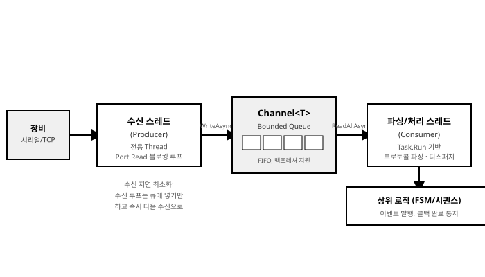

# 2장. 비동기 및 멀티스레딩 환경 구축

[◀ 이전: 1장. C# 기반 장비 제어 시스템 개요](ch01-CSharp기반장비제어시스템개요.md) | [📖 목차](00-목차.md) | [다음: 3장. 하드웨어 통신 및 드라이버 연동 ▶](ch03-하드웨어통신과드라이버연동.md)


1장에서 살펴본 계층형 아키텍처는 프레젠테이션 계층부터 HAL(Hardware Abstraction Layer)까지 책임을 나누어 놓았지만, 그 경계를 넘나드는 실제 동작은 결국 "누가 어느 스레드에서 무엇을 언제 실행하는가"라는 동시성(concurrency) 문제로 귀결된다. 모션 카드가 축 이동 완료를 알려오는 순간, 시리얼 포트에 새 패킷이 도착하는 순간, 사용자가 화면에서 정지 버튼을 누르는 순간은 모두 비동기적이고 예측 불가능한 타이밍에 발생한다. 이 장에서는 C#/.NET이 제공하는 동시성 도구 — `Task`/`async`/`await`, `Thread`/`ThreadPool`, 동기화 프리미티브, `Channel<T>`, `CancellationToken` — 를 장비 제어 소프트웨어의 구체적인 문제에 매핑하는 방법을 다룬다.

장비 제어 소프트웨어의 동시성 설계는 일반적인 업무 애플리케이션과 몇 가지 점에서 다르다. 첫째, 하드웨어 드라이버 SDK는 대부분 이벤트/콜백 기반 API를 제공하므로, 이를 `async`/`await` 모델로 자연스럽게 연결하는 "다리" 역할이 반드시 필요하다. 둘째, 통신 포트나 모션 컨트롤러 같은 공유 자원은 여러 시퀀스가 동시에 접근하려 할 때 반드시 직렬화되어야 하며, 이 직렬화가 UI 스레드를 막아서는 안 된다. 셋째, 장비 정지는 단순한 취소가 아니라 "안전"이라는 요구사항이 걸린 동작이므로, 협력적 취소 모델의 한계를 정확히 이해하고 하드웨어 인터락과 함께 설계해야 한다. 이 장은 이 세 가지 축을 순서대로 다룬다.

## 1. Task, async/await를 활용한 비동기 장비 제어

### 1.1 장비 제어에서 비동기가 중요한 이유

장비 제어 소프트웨어의 실행 흐름에는 두 종류의 "기다림"이 끊임없이 등장한다.

- **통신 I/O 대기**: 시리얼/TCP 포트로 명령을 보내고 응답을 기다리는 시간. 수 밀리초에서 수백 밀리초까지 걸릴 수 있다.
- **모션/공정 완료 대기**: 모터가 목표 위치까지 이동하거나, 실린더가 전진/후진을 완료하거나, 히터가 목표 온도에 도달하는 시간. 수백 밀리초에서 수십 초까지 걸릴 수 있다.

이 대기 시간 동안 스레드를 `Thread.Sleep`이나 동기 블로킹 호출로 점유해 버리면 두 가지 문제가 생긴다. UI 스레드에서 이런 대기를 하면 화면이 멈추고(먹통이 되고) 사용자는 정지 버튼조차 누를 수 없게 된다. 백그라운드 스레드에서 이런 대기를 무분별하게 하면, `ThreadPool`의 제한된 스레드 자원이 "실제 계산은 하나도 안 하면서 그냥 기다리기만 하는" 스레드들로 고갈되어 다른 작업이 지연되는 스레드 기아(starvation) 현상이 발생한다.

`async`/`await`는 이 대기 구간에서 스레드를 실제로 점유하지 않고 반환(yield)했다가, 작업이 완료되면 이어서 실행을 재개하는 모델을 제공한다. 장비 제어 맥락에서는 다음과 같은 이점으로 연결된다.

- UI 스레드에서 `await MoveToAsync(...)`를 호출해도 화면은 계속 반응한다(정지 버튼, 다른 축 상태 표시 갱신 등).
- 여러 통신 채널, 여러 축의 비동기 작업을 동시에 진행시키면서도 코드는 순차적인 흐름처럼 읽을 수 있다.
- 예외 처리와 취소가 `try/catch`, `CancellationToken`이라는 익숙한 문법으로 통합된다.

### 1.2 비동기 모션 명령의 기본 패턴

축(axis) 제어 클래스에서 이동 명령은 보통 다음과 같은 시그니처를 가진다.

```csharp
public interface IAxis
{
    string Name { get; }
    double CurrentPosition { get; }
    bool IsMoving { get; }

    Task MoveToAsync(double targetPosition, CancellationToken cancellationToken = default);
    Task HomeAsync(CancellationToken cancellationToken = default);
}
```

`Task`를 반환하는 메서드는 호출자에게 "이 이동이 끝날 때까지 기다릴 수 있는 손잡이"를 제공한다. 호출하는 쪽은 다음처럼 자연스럽게 순차 로직을 작성할 수 있다.

```csharp
public async Task RunPickAndPlaceStepAsync(IAxis xAxis, IAxis zAxis, CancellationToken ct)
{
    await zAxis.MoveToAsync(SafeZHeight, ct);   // Z축을 안전 높이로
    await xAxis.MoveToAsync(PickPositionX, ct); // X축을 픽업 위치로
    await zAxis.MoveToAsync(PickZHeight, ct);   // Z축을 픽업 높이로 하강

    // 진공 흡착 로직 (별도 절에서 다룸)

    await zAxis.MoveToAsync(SafeZHeight, ct);
}
```

이 코드는 언뜻 동기 코드처럼 보이지만, 각 `await` 지점에서 호출 스레드(예: UI 스레드)는 실제로 블로킹되지 않고 이벤트 루프로 돌아간다. 이동이 완료되면 원래 문맥(주로 `SynchronizationContext`를 통해 UI 스레드)으로 돌아와 다음 줄을 실행한다.

### 1.3 TaskCompletionSource로 콜백 기반 하드웨어 API를 Task로 감싸기

여기까지는 `MoveToAsync`가 이미 `Task`를 반환한다고 가정했지만, 실제로 이 메서드 내부를 구현할 때 가장 자주 마주치는 현실은 모션 카드/드라이버 SDK가 **콜백 또는 이벤트** 기반이라는 점이다. 예를 들어 다음과 같은 전형적인 네이티브 SDK 스타일 API를 가정해 보자.

```csharp
// 벤더가 제공하는 저수준 모션 카드 SDK (콜백 기반, 실제 하드웨어 API를 단순화한 예)
public class MotionCardDriver
{
    // 이동 명령을 큐에 넣고 즉시 반환한다. 완료/오류는 이벤트로 통지된다.
    public void StartMove(int axisId, double targetPulse) { /* P/Invoke 등으로 구현 */ }

    // 축 이동 완료 시 하드웨어 인터럽트 또는 폴링 스레드에서 호출됨
    public event EventHandler<AxisMoveCompletedEventArgs> MoveCompleted;
    public event EventHandler<AxisErrorEventArgs> AxisError;
}

public class AxisMoveCompletedEventArgs : EventArgs
{
    public int AxisId { get; init; }
    public double FinalPosition { get; init; }
}

public class AxisErrorEventArgs : EventArgs
{
    public int AxisId { get; init; }
    public int ErrorCode { get; init; }
    public string Message { get; init; } = string.Empty;
}
```

이런 "명령은 즉시 반환, 완료는 이벤트로 통지"라는 패턴을 `await` 가능한 `Task`로 변환하는 것이 **`TaskCompletionSource<TResult>`**의 역할이다. `TaskCompletionSource<TResult>`는 `Task<TResult>`를 생성하되, 그 완료 시점과 결과를 개발자가 직접(`SetResult`, `SetException`, `SetCanceled`) 제어할 수 있게 해준다. 이는 장비 드라이버를 다루는 실무에서 가장 중요한 기법 중 하나이므로 상세히 살펴본다.

```csharp
public sealed class MotionAxis : IAxis, IDisposable
{
    private readonly MotionCardDriver _driver;
    private readonly int _axisId;

    // 진행 중인 이동 요청을 axisId 기준으로 추적한다.
    private readonly ConcurrentDictionary<int, TaskCompletionSource<double>> _pendingMoves = new();

    public string Name { get; }
    public double CurrentPosition { get; private set; }
    public bool IsMoving { get; private set; }

    public MotionAxis(string name, MotionCardDriver driver, int axisId)
    {
        Name = name;
        _driver = driver;
        _axisId = axisId;

        _driver.MoveCompleted += OnMoveCompleted;
        _driver.AxisError += OnAxisError;
    }

    public async Task MoveToAsync(double targetPosition, CancellationToken cancellationToken = default)
    {
        // RunContinuationsAsynchronously: 완료 콜백(이벤트 핸들러) 스레드에서
        // 후속 코드가 동기적으로 실행되어 콜백 스레드를 오래 점유하는 것을 방지한다.
        var tcs = new TaskCompletionSource<double>(
            TaskCreationOptions.RunContinuationsAsynchronously);

        if (!_pendingMoves.TryAdd(_axisId, tcs))
            throw new InvalidOperationException($"축 {Name}에 이미 진행 중인 이동이 있습니다.");

        // 취소 토큰이 신호되면 TCS를 취소 상태로 전이시키고,
        // 하드웨어에도 정지 명령을 보낸다.
        await using var registration = cancellationToken.Register(() =>
        {
            tcs.TrySetCanceled(cancellationToken);
            _driver.StartMove(_axisId, CurrentPosition); // 현재 위치로 재지정 = 정지(간이 구현)
        });

        IsMoving = true;
        try
        {
            _driver.StartMove(_axisId, targetPosition);
            CurrentPosition = await tcs.Task.ConfigureAwait(false);
        }
        finally
        {
            IsMoving = false;
            _pendingMoves.TryRemove(_axisId, out _);
        }
    }

    private void OnMoveCompleted(object? sender, AxisMoveCompletedEventArgs e)
    {
        if (e.AxisId != _axisId) return;

        if (_pendingMoves.TryGetValue(_axisId, out var tcs))
            tcs.TrySetResult(e.FinalPosition);
    }

    private void OnAxisError(object? sender, AxisErrorEventArgs e)
    {
        if (e.AxisId != _axisId) return;

        if (_pendingMoves.TryGetValue(_axisId, out var tcs))
            tcs.TrySetException(new MotionFaultException(Name, e.ErrorCode, e.Message));
    }

    public async Task HomeAsync(CancellationToken cancellationToken = default)
        => await MoveToAsync(0.0, cancellationToken);

    public void Dispose()
    {
        _driver.MoveCompleted -= OnMoveCompleted;
        _driver.AxisError -= OnAxisError;
    }
}

public class MotionFaultException : Exception
{
    public string AxisName { get; }
    public int ErrorCode { get; }

    public MotionFaultException(string axisName, int errorCode, string message)
        : base($"[{axisName}] 모션 오류 (코드 {errorCode}): {message}")
    {
        AxisName = axisName;
        ErrorCode = errorCode;
    }
}
```

이 패턴의 핵심 요소를 정리하면 다음과 같다.

- **`TaskCreationOptions.RunContinuationsAsynchronously`**: `SetResult`/`SetException`을 호출하는 스레드(대개 드라이버의 콜백 스레드나 인터럽트 처리 스레드)에서 `await` 이후의 코드가 동기적으로 실행되는 것을 막는다. 이 옵션을 빠뜨리면 콜백 스레드가 후속 로직(예: 다음 이동 명령, UI 갱신 트리거)까지 떠안게 되어 콜백 처리가 지연되거나, 최악의 경우 드라이버 내부에서 락을 잡은 채로 콜백을 호출하는 SDK와 결합해 교착 상태를 유발할 수 있다.
- **`TrySetResult`/`TrySetException`/`TrySetCanceled`**: `SetResult` 계열 대신 `Try` 접두사가 붙은 버전을 사용한다. 이벤트가 중복 발생하거나 취소와 완료가 경합하는 상황에서 `SetResult`는 예외를 던지지만 `TrySetResult`는 `false`를 반환할 뿐이므로 이벤트 핸들러 안에서 안전하다.
- **`CancellationToken.Register`**: 취소 신호가 발생했을 때 TCS를 취소 상태로 전이시키는 동시에, 실제 하드웨어에도 정지를 지시한다. `await using`으로 `IDisposable`인 `CancellationTokenRegistration`을 감싸 이동이 정상 완료된 후에는 등록을 반드시 해제한다(등록을 해제하지 않으면 오래 실행되는 `CancellationTokenSource`에 콜백이 누적될 수 있다).
- **`ConfigureAwait(false)`**: 라이브러리/서비스 계층 코드에서는 `await` 이후 원래의 `SynchronizationContext`(예: UI 스레드)로 돌아갈 필요가 없으므로 `ConfigureAwait(false)`를 붙여 불필요한 컨텍스트 전환 비용을 줄인다. 다만 이 메서드를 호출한 UI 코드가 이어서 UI 요소를 직접 건드린다면, 그 UI 코드 쪽에서는 `ConfigureAwait`를 붙이지 않아 컨텍스트가 복원되도록 해야 한다.

> **주의: `async void`를 피하라.** 이벤트 핸들러가 아닌 이상 `async void` 메서드는 예외가 호출자에게 전파되지 않고 곧바로 `SynchronizationContext`(또는 스레드)로 던져져 프로세스를 다운시킬 수 있다. `MoveCompleted`, `AxisError` 같은 이벤트 핸들러는 `async void`가 불가피하지만, 위 예제처럼 핸들러 내부에서 `await`를 사용하지 않고 TCS만 완료시키는 방식으로 설계하면 이 위험을 원천적으로 피할 수 있다.

### 1.4 Task.WhenAll로 다축 동시 이동

여러 축을 동시에 움직이고 모두 완료될 때까지 기다려야 하는 상황(예: X-Y 갠트리를 대각선으로 이동)은 `Task.WhenAll`로 자연스럽게 표현된다.

```csharp
public async Task MoveGantryAsync(
    IAxis xAxis, IAxis yAxis, double targetX, double targetY,
    CancellationToken cancellationToken = default)
{
    Task moveX = xAxis.MoveToAsync(targetX, cancellationToken);
    Task moveY = yAxis.MoveToAsync(targetY, cancellationToken);

    // 두 축이 동시에 이동을 시작하고, 둘 다 끝날 때까지 기다린다.
    await Task.WhenAll(moveX, moveY);
}
```

여기서 중요한 점은 `moveX`, `moveY`를 `await`하지 않고 먼저 **변수에 저장**해서 두 이동을 동시에 시작시킨 뒤 `Task.WhenAll`로 묶는다는 것이다. 만약 `await xAxis.MoveToAsync(...)`를 먼저 쓰고 이어서 `await yAxis.MoveToAsync(...)`를 쓰면 X축이 끝난 다음에야 Y축이 시작되는 순차 실행이 되어버려 대각선 이동이라는 목적을 달성하지 못한다.

여러 축이 배열/컬렉션으로 관리되는 경우에는 LINQ와 결합해 더 일반적으로 작성할 수 있다.

```csharp
public async Task MoveAllAxesAsync(
    IReadOnlyList<(IAxis Axis, double Target)> moves,
    CancellationToken cancellationToken = default)
{
    var tasks = moves.Select(m => m.Axis.MoveToAsync(m.Target, cancellationToken)).ToArray();
    await Task.WhenAll(tasks);
}
```

`Task.WhenAll`은 모든 태스크가 완료될 때까지 기다리되, 하나 이상이 실패하면 `AggregateException`이 아니라 **첫 번째로 관찰된 예외**를 담은 `Task`를 반환한다(모든 예외는 반환된 `Task`의 `Exception` 속성에서 `AggregateException`으로 확인할 수 있다). 따라서 어느 축에서 오류가 났는지 전부 확인하려면 다음처럼 처리한다.

```csharp
public async Task MoveAllAxesSafelyAsync(
    IReadOnlyList<(IAxis Axis, double Target)> moves,
    CancellationToken cancellationToken = default)
{
    var tasks = moves.Select(m => m.Axis.MoveToAsync(m.Target, cancellationToken)).ToArray();

    try
    {
        await Task.WhenAll(tasks);
    }
    catch
    {
        // await된 예외는 첫 번째 것 하나뿐이므로,
        // 실패한 모든 태스크의 예외를 개별적으로 순회해 로그를 남긴다.
        var failures = tasks
            .Where(t => t.IsFaulted)
            .Select(t => t.Exception?.InnerException ?? t.Exception!)
            .ToList();

        foreach (var ex in failures)
            _logger.LogError(ex, "축 이동 실패");

        throw new AggregateException("다축 동시 이동 중 하나 이상의 축에서 오류가 발생했습니다.", failures);
    }
}
```

### 1.5 Task.WhenAny와 타이머를 이용한 통신 타임아웃 처리

장비와의 통신은 케이블 단선, 장비 다운, 프로토콜 불일치 등으로 인해 응답이 영원히 오지 않을 수 있다. `await`가 무한정 대기하지 않도록, `Task.WhenAny`로 "실제 작업"과 "타임아웃 타이머"를 경쟁시키는 패턴이 표준적으로 쓰인다.

```csharp
public async Task<byte[]> SendCommandAndWaitResponseAsync(
    byte[] command, TimeSpan timeout, CancellationToken cancellationToken = default)
{
    Task<byte[]> responseTask = WaitForResponseAsync(command, cancellationToken);
    Task timeoutTask = Task.Delay(timeout, cancellationToken);

    Task completed = await Task.WhenAny(responseTask, timeoutTask);

    if (completed == timeoutTask)
    {
        throw new TimeoutException(
            $"장비 응답 대기 시간 초과 ({timeout.TotalMilliseconds:F0}ms)");
    }

    // responseTask가 먼저 끝난 경우, 결과를 반환하거나
    // responseTask 내부에서 발생한 예외를 그대로 다시 던진다.
    return await responseTask;
}
```

`Task.Delay(timeout, cancellationToken)`에 `cancellationToken`을 함께 넘기면, 상위 시퀀스가 취소될 때 타임아웃 타이머 자체도 즉시 정리되어 불필요하게 남아있는 지연 작업이 생기지 않는다. 마지막 줄에서 `return await responseTask;`를 사용하는 이유는, `completed`가 이미 완료된 `responseTask`라 하더라도 `Task.WhenAny`의 반환값을 그대로 캐스팅해서 쓰는 대신 다시 `await`함으로써 `responseTask` 내부에서 발생한 예외를 원래의 스택 추적 정보와 함께 정확히 전파하기 위함이다.

더 간결한 헬퍼 메서드로 일반화하면 여러 곳에서 재사용할 수 있다.

```csharp
public static class TaskExtensions
{
    public static async Task<T> WithTimeoutAsync<T>(
        this Task<T> task, TimeSpan timeout, string operationName,
        CancellationToken cancellationToken = default)
    {
        using var timeoutCts = CancellationTokenSource.CreateLinkedTokenSource(cancellationToken);
        Task delayTask = Task.Delay(timeout, timeoutCts.Token);

        Task completed = await Task.WhenAny(task, delayTask);

        if (completed == delayTask)
        {
            cancellationToken.ThrowIfCancellationRequested(); // 상위 취소가 원인이면 그쪽 예외를 우선 노출
            throw new TimeoutException($"'{operationName}' 작업이 {timeout.TotalMilliseconds:F0}ms 내에 완료되지 않았습니다.");
        }

        timeoutCts.Cancel(); // 남아있는 Task.Delay를 즉시 정리
        return await task;
    }
}
```

이렇게 만든 확장 메서드는 다음처럼 사용한다.

```csharp
byte[] response = await WaitForResponseAsync(command, ct)
    .WithTimeoutAsync(TimeSpan.FromMilliseconds(500), "온도 센서 응답 대기", ct);
```

통신 계층의 타임아웃 설계에 대해서는 3장(하드웨어 통신 및 드라이버 연동)에서 재시도(retry) 정책과 함께 더 자세히 다룬다.

## 2. Thread, ThreadPool 및 동기화 기법(lock, SemaphoreSlim, Monitor)

### 2.1 전용 Thread가 필요한 경우와 ThreadPool로 충분한 경우

`async`/`await`와 `Task.Run`은 대부분의 상황에서 `ThreadPool`의 스레드를 빌려 짧게 쓰고 반납하는 모델을 전제로 한다. 그러나 장비 제어 소프트웨어에는 이 전제가 깨지는 상황이 존재하며, 이때는 `System.Threading.Thread`로 전용 스레드를 직접 만들어야 한다. 판단 기준은 다음과 같다.

| 상황 | 권장 방식 | 이유 |
|---|---|---|
| 짧은 계산, 짧은 대기 후 완료되는 비동기 작업 | `Task.Run` / `async`/`await` | `ThreadPool`이 부하에 따라 스레드 수를 조절해 효율적 |
| 특정 시리얼/TCP 포트를 **평생 동안(프로세스 종료까지) 전담**하는 블로킹 수신 루프 | 전용 `Thread` | `ThreadPool` 스레드를 무기한 점유하면 풀이 고갈되고, `ThreadPool`은 애초에 "짧게 쓰고 반납"을 전제로 설계됨 |
| 실시간성이 중요한 고정 주기 폴링(예: 1ms 주기 I/O 스캔) | 전용 `Thread` + `ThreadPriority` 조정 | `ThreadPool`의 스레드 생성/스케줄링 지연이 주기 정확도에 영향을 줄 수 있음 |
| 별도 `[STA]` 아파트먼트가 필요한 COM 기반 벤더 SDK 연동 | 전용 `Thread` (`SetApartmentState`) | `ThreadPool` 스레드는 기본적으로 MTA이므로 STA COM 객체를 직접 다룰 수 없음 |
| 여러 개의 짧은 백그라운드 작업을 병렬 실행 | `Task.Run` / `Parallel.ForEachAsync` | 작업 수만큼 전용 스레드를 만드는 것은 낭비 |

전용 스레드로 특정 포트를 전담시키는 전형적인 예는 다음과 같다.

```csharp
public sealed class SerialPortReceiverThread : IDisposable
{
    private readonly SerialPort _port;
    private readonly ChannelWriter<byte[]> _writer;
    private readonly Thread _thread;
    private volatile bool _running;

    public SerialPortReceiverThread(SerialPort port, ChannelWriter<byte[]> writer)
    {
        _port = port;
        _writer = writer;

        _thread = new Thread(ReceiveLoop)
        {
            Name = $"SerialRx-{port.PortName}",
            IsBackground = true,          // 프로세스 종료를 막지 않도록
            Priority = ThreadPriority.AboveNormal,
        };
    }

    public void Start()
    {
        _running = true;
        _thread.Start();
    }

    private void ReceiveLoop()
    {
        var buffer = new byte[256];
        while (_running)
        {
            try
            {
                // SerialPort.Read는 동기 블로킹 API이며,
                // 이 스레드를 계속 점유하는 것이 설계 의도이므로 전용 Thread가 적합하다.
                int bytesRead = _port.Read(buffer, 0, buffer.Length);
                if (bytesRead <= 0) continue;

                var packet = new byte[bytesRead];
                Array.Copy(buffer, packet, bytesRead);

                // 동기 스레드에서 비동기 Channel에 쓸 때는 TryWrite를 우선 사용하고,
                // 가득 찬 경우에만 블로킹 대기(GetAwaiter().GetResult())로 대응한다.
                if (!_writer.TryWrite(packet))
                    _writer.WriteAsync(packet).AsTask().GetAwaiter().GetResult();
            }
            catch (TimeoutException)
            {
                // SerialPort.ReadTimeout에 의한 정상적인 주기적 타임아웃
            }
            catch (IOException) when (!_running)
            {
                // Dispose 과정에서 포트가 닫히며 발생하는 예외는 무시
            }
        }
    }

    public void Dispose()
    {
        _running = false;
        _port.Close(); // Read()에서 블로킹 중인 스레드를 깨우기 위해 포트를 닫는다.
        _thread.Join(TimeSpan.FromSeconds(2));
    }
}
```

여기서 `IsBackground = true`는 필수에 가깝다. 전경(foreground) 스레드로 만들면 애플리케이션의 다른 모든 부분이 종료되어도 이 스레드가 살아있는 한 프로세스가 종료되지 않는다. 반대로, ThreadPool 기반 `Task.Run`으로 충분한 경우(예: 레시피 파일을 파싱하는 짧은 CPU 작업)는 다음처럼 단순하게 처리한다.

```csharp
public Task<Recipe> LoadRecipeAsync(string filePath, CancellationToken ct)
    => Task.Run(() => ParseRecipeFile(filePath), ct);
```

### 2.2 lock을 이용한 공유 자원 보호

여러 시퀀스(또는 여러 축 컨트롤러)가 하나의 통신 포트나 공유 버퍼에 동시에 접근하려는 상황은 장비 제어에서 매우 흔하다. 예를 들어 하나의 RS-485 버스에 여러 슬레이브 장비가 물려 있고, 여러 시퀀스 스텝이 동시에 이 버스로 명령을 보내려 하는 경우, 명령/응답이 뒤섞이지 않도록 반드시 직렬화해야 한다.

가장 단순한 동기 코드 구간에서는 `lock` 문(내부적으로 `Monitor.Enter`/`Monitor.Exit`을 사용)으로 충분하다.

```csharp
public sealed class SharedCounterLog
{
    private readonly object _syncRoot = new();
    private readonly Dictionary<string, long> _counters = new();

    public void Increment(string key)
    {
        lock (_syncRoot)
        {
            _counters.TryGetValue(key, out long current);
            _counters[key] = current + 1;
        }
    }

    public long GetValue(string key)
    {
        lock (_syncRoot)
        {
            return _counters.TryGetValue(key, out long v) ? v : 0;
        }
    }
}
```

그러나 `lock`은 **동기적으로만** 블로킹한다는 결정적인 한계가 있다. `lock` 블록 안에서 `await`를 사용하는 것은 C# 컴파일러가 원천적으로 금지한다(컴파일 오류). 통신 포트에 대한 배타적 접근을 얻은 뒤 `await SendAndWaitResponseAsync(...)`처럼 비동기 I/O를 수행해야 하는 상황에서는 `lock`을 쓸 수 없다.

### 2.3 SemaphoreSlim으로 비동기 대기 가능한 상호 배제 구현

`SemaphoreSlim`은 `lock`과 달리 `await semaphore.WaitAsync()`로 **비동기적으로 대기**할 수 있다. 이는 `lock`과의 핵심적인 차이이며, 통신 포트처럼 점유 구간 안에서 `await`가 필요한 자원을 보호할 때 `SemaphoreSlim(1, 1)`을 이진 뮤텍스처럼 사용하는 것이 표준적인 해법이다.

```csharp
public sealed class SharedSerialBus : IDisposable
{
    private readonly SerialPort _port;
    private readonly SemaphoreSlim _busLock = new(initialCount: 1, maxCount: 1);

    public SharedSerialBus(SerialPort port) => _port = port;

    public async Task<byte[]> SendCommandAsync(
        byte[] command, TimeSpan timeout, CancellationToken cancellationToken = default)
    {
        // 다른 시퀀스가 버스를 점유 중이면 여기서 "스레드를 블로킹하지 않고" 대기한다.
        await _busLock.WaitAsync(cancellationToken);
        try
        {
            _port.Write(command, 0, command.Length);
            return await ReadResponseAsync(timeout, cancellationToken);
        }
        finally
        {
            _busLock.Release(); // 예외가 나더라도 반드시 해제되도록 finally에서 처리
        }
    }

    private async Task<byte[]> ReadResponseAsync(TimeSpan timeout, CancellationToken ct)
    {
        // 실제 구현은 3장에서 다루는 프레이밍/파싱 로직과 결합된다.
        await Task.Delay(10, ct); // 예시를 위한 자리표시자
        return Array.Empty<byte>();
    }

    public void Dispose() => _busLock.Dispose();
}
```

두 시퀀스가 동시에 `SendCommandAsync`를 호출하면, 먼저 진입한 쪽이 버스를 점유하는 동안 나중에 진입한 쪽은 `WaitAsync`에서 **스레드를 반환한 채로** 대기한다. `lock`을 썼다면 나중에 진입한 스레드(예: `ThreadPool` 스레드)가 통째로 블로킹되어 버렸을 상황이다. 여러 개의 동시 접근을 허용해야 하는 자원(예: 최대 3개까지 동시 연결 가능한 통신 채널 풀)에는 `maxCount`를 늘려 세마포어 본래의 용도로 사용할 수도 있다.

```csharp
// 최대 동시 3개 채널까지만 허용하는 통신 채널 풀
private readonly SemaphoreSlim _channelPool = new(initialCount: 3, maxCount: 3);
```

`SemaphoreSlim.WaitAsync`에는 타임아웃을 함께 지정할 수도 있어, 버스가 오랫동안 해제되지 않는 이상 상황(교착 의심)을 조기에 감지하는 데 유용하다.

```csharp
bool acquired = await _busLock.WaitAsync(TimeSpan.FromSeconds(5), cancellationToken);
if (!acquired)
    throw new TimeoutException("통신 버스 점유 대기 시간 초과 - 다른 시퀀스가 버스를 반환하지 않고 있습니다.");
```

### 2.4 Monitor의 저수준 제어와 데드락 회피

`lock` 문은 `Monitor.Enter`/`Monitor.Exit`의 문법적 설탕(syntactic sugar)이다. `Monitor`를 직접 사용하면 `lock`으로는 표현할 수 없는 두 가지를 제어할 수 있다.

```csharp
public bool TryLogWithTimeout(SharedCounterLog log, object syncRoot, Action action)
{
    // Monitor.TryEnter에 타임아웃을 주어, 락을 무한정 기다리지 않고
    // 실패 시 대체 경로(예: 이번 로그는 건너뛰고 다음 기회에 재시도)를 선택할 수 있다.
    if (Monitor.TryEnter(syncRoot, TimeSpan.FromMilliseconds(100)))
    {
        try
        {
            action();
            return true;
        }
        finally
        {
            Monitor.Exit(syncRoot);
        }
    }
    return false;
}
```

`Monitor.TryEnter(object, TimeSpan)`은 락 경합이 심한 상황에서 무한 대기 대신 "이번엔 포기하고 나중에 재시도"하는 방어적 설계를 가능하게 한다. 여러 공유 자원(예: 통신 버스 락과 상태 저장소 락)을 동시에 획득해야 하는 코드에서는, 모든 곳에서 **항상 같은 순서로 락을 획득**하는 규칙을 지키는 것이 데드락을 피하는 가장 실용적인 방법이다. 순서를 강제하기 어려운 구조라면 `Monitor.TryEnter`의 타임아웃 버전으로 순환 대기를 조기에 끊어내는 것도 현실적인 대안이다.

### 2.5 공유 로그/상태 저장소의 스레드 안전 패턴

여러 장비 모듈(축 컨트롤러, I/O 모듈, 통신 채널)이 동시에 로그를 남기거나 공통 상태 딕셔너리를 갱신하는 경우, `lock` 기반의 수동 동기화 대신 `System.Collections.Concurrent` 네임스페이스의 락-프리(lock-free)/미세 잠금(fine-grained locking) 컬렉션을 우선 검토한다.

```csharp
public sealed class EquipmentStatusStore
{
    // ConcurrentDictionary는 내부적으로 세분화된 락(또는 락-프리 알고리즘)을 사용해
    // 대부분의 읽기/쓰기 조합에서 별도의 lock 없이 스레드 안전성을 보장한다.
    private readonly ConcurrentDictionary<string, AxisStatus> _axisStatuses = new();

    public void UpdateStatus(string axisName, AxisStatus status)
        => _axisStatuses.AddOrUpdate(axisName, status, (_, _) => status);

    public AxisStatus? GetStatus(string axisName)
        => _axisStatuses.TryGetValue(axisName, out var status) ? status : null;

    public IReadOnlyDictionary<string, AxisStatus> Snapshot()
        => new Dictionary<string, AxisStatus>(_axisStatuses);
}

public readonly record struct AxisStatus(double Position, bool IsMoving, DateTime UpdatedAtUtc);
```

로그처럼 "순서가 보장되는 큐"가 필요한 경우에는 `ConcurrentQueue<T>`를, 여러 생산자·소비자가 얽힌 파이프라인에는 다음 절에서 다루는 `Channel<T>`나 `BlockingCollection<T>`를 사용한다. 다만 `ConcurrentDictionary`의 `AddOrUpdate`/`GetOrAdd`에 넘기는 팩토리 델리게이트가 **경합 상황에서 여러 번 호출될 수 있다**는 점은 주의해야 한다. 팩토리 안에서 부수 효과(하드웨어 명령 전송 등)를 일으키면 의도치 않게 여러 번 실행될 수 있으므로, 팩토리는 순수 계산으로 한정하는 것이 안전하다.

UI 스레드에서 이 상태 저장소를 구독해 화면을 갱신하는 패턴은 6장(WPF/MVVM 기반 HMI UI 구축)에서 `INotifyPropertyChanged`, `Dispatcher.Invoke`와 함께 다룬다.

## 3. Channel<T> 및 BlockingCollection<T> 기반 생산자-소비자 패턴

### 3.1 장비 제어에서 생산자-소비자 패턴이 쓰이는 대표 시나리오

가장 대표적인 시나리오는 통신 수신 경로다. 시리얼/TCP 포트에서 데이터가 도착하는 시점은 예측할 수 없고, 한 번에 여러 패킷이 몰려 들어올 수도 있다. 이때 수신을 담당하는 스레드가 패킷을 받는 즉시 파싱/처리까지 직접 수행해 버리면, 파싱 로직이 조금만 무거워져도(예: 체크섬 검증, 프로토콜 상태 머신 갱신, 상위 이벤트 발행) 다음 패킷을 받는 시점이 늦어져 수신 버퍼 오버플로우나 타이밍 오류로 이어질 수 있다.

이를 피하기 위해 역할을 분리한다.

- **생산자(producer)**: 포트에서 원시 바이트/패킷을 읽는 즉시 큐에 넣고, 지체 없이 다음 수신으로 돌아간다.
- **큐**: 생산자와 소비자의 속도 차이를 흡수하는 버퍼.
- **소비자(consumer)**: 큐에서 패킷을 하나씩 꺼내 파싱하고, 프로토콜 상태 머신을 갱신하고, 필요하면 상위 로직에 이벤트를 발행(예: 대기 중인 `TaskCompletionSource` 완료)한다.

이 구조의 목적은 **수신 지연 최소화**다. 소비자 쪽 처리가 아무리 무거워져도, 그로 인한 지연은 큐의 대기열 길이로만 흡수되고 생산자(포트 수신)의 타이밍에는 영향을 주지 않는다.

### 3.2 Channel<T>를 이용한 비동기 친화적 구현

.NET의 `System.Threading.Channels` 네임스페이스가 제공하는 `Channel<T>`는 `async`/`await`와 자연스럽게 통합되는 생산자-소비자 큐다. 용량을 제한한 바운디드(bounded) 채널을 만들고, 가득 찼을 때의 동작(대기, 최신 항목으로 대체, 가장 오래된 항목 제거)을 지정할 수 있다.

```csharp
public sealed class PacketPipeline
{
    private readonly Channel<byte[]> _channel;

    public PacketPipeline(int capacity = 256)
    {
        var options = new BoundedChannelOptions(capacity)
        {
            FullMode = BoundedChannelFullMode.Wait, // 큐가 가득 차면 생산자를 대기시킴(패킷 유실 방지)
            SingleReader = true,                    // 소비자가 하나뿐임을 알려 내부 최적화 허용
            SingleWriter = false,                   // 여러 생산자(다중 포트)가 쓸 수 있음
        };
        _channel = Channel.CreateBounded<byte[]>(options);
    }

    public ChannelWriter<byte[]> Writer => _channel.Writer;
    public ChannelReader<byte[]> Reader => _channel.Reader;
}
```

소비자 측 처리 루프는 `ReadAllAsync`를 이용해 `await foreach`로 간결하게 표현된다.

```csharp
public sealed class PacketProcessor
{
    private readonly ChannelReader<byte[]> _reader;
    private readonly ProtocolParser _parser;

    public PacketProcessor(ChannelReader<byte[]> reader, ProtocolParser parser)
    {
        _reader = reader;
        _parser = parser;
    }

    public async Task RunAsync(CancellationToken cancellationToken)
    {
        // Writer.Complete()가 호출되고 큐가 비워지면 반복문이 자연스럽게 종료된다.
        await foreach (byte[] packet in _reader.ReadAllAsync(cancellationToken))
        {
            try
            {
                ParsedMessage message = _parser.Parse(packet);
                Dispatch(message);
            }
            catch (ProtocolException ex)
            {
                _logger.LogWarning(ex, "패킷 파싱 실패, 프레임을 폐기하고 계속 진행합니다.");
                // 파싱 실패한 패킷 1건 때문에 전체 파이프라인이 멈추지 않도록
                // 예외를 여기서 흡수하고 다음 패킷으로 진행한다.
            }
        }
    }

    private void Dispatch(ParsedMessage message)
    {
        // 예: 대기 중인 TaskCompletionSource를 완료시키거나, 상위 FSM에 이벤트 발행
    }

    private readonly ILogger _logger = LoggerFactory.Create(b => { }).CreateLogger<PacketProcessor>();
}
```

생산자 측(전용 `Thread`로 구현한 수신 루프)에서는 `WriteAsync`로 큐에 데이터를 넣는다. 앞서 2.1절 예제의 `SerialPortReceiverThread`가 이미 이 패턴을 보여준다. 동기 스레드에서 비동기 API인 `WriteAsync`를 호출해야 할 때는, 논블로킹으로 먼저 `TryWrite`를 시도하고 실패한 경우(큐가 가득 찬 경우)에만 `WriteAsync(...).AsTask().GetAwaiter().GetResult()`로 대체하는 방식이 일반적인 절충안이다. 만약 수신 스레드 자체를 `Task.Run` 기반 비동기 루프로 설계할 수 있다면, `await writer.WriteAsync(packet, cancellationToken)`을 직접 쓰는 편이 더 자연스럽다.

파이프라인 종료 시에는 `Writer.Complete()`를 호출해 더 이상 새 항목이 들어오지 않음을 알려야 소비자 측의 `ReadAllAsync`가 정상적으로 종료된다.

```csharp
public void Shutdown()
{
    _pipeline.Writer.Complete(); // 정상 종료 신호
    // 오류로 인한 비정상 종료를 알리려면 Complete(exception)을 사용할 수도 있다.
}
```

### 3.3 BlockingCollection<T>과의 차이 — 레거시 코드 이해하기

`Channel<T>`는 .NET Core 3.0 이후 표준적으로 권장되는 방식이지만, `System.Collections.Concurrent.BlockingCollection<T>`는 그 이전부터 존재해 온 동기 블로킹 기반 생산자-소비자 컬렉션이며 여전히 많은 레거시 장비 제어 코드베이스에서 볼 수 있다. 두 API의 핵심 차이는 다음과 같다.

| 항목 | `Channel<T>` | `BlockingCollection<T>` |
|---|---|---|
| 소비 방식 | `await foreach`, `ReadAllAsync` — 비동기, 스레드 비점유 대기 | `foreach (var item in collection.GetConsumingEnumerable())` — **동기 블로킹**, 전용 스레드 점유 |
| 생산 방식 | `WriteAsync`(비동기) 또는 `TryWrite`(논블로킹) | `Add`(동기 블로킹) 또는 `TryAdd` |
| 내부 저장소 | 채널 전용 구현(고성능 큐) | `IProducerConsumerCollection<T>`(기본은 `ConcurrentQueue<T>`)를 감싸는 래퍼 |
| 종료 신호 | `Writer.Complete()` | `CompleteAdding()` |
| async/await 친화성 | 높음(설계 목적 자체가 비동기 파이프라인) | 낮음(소비 루프가 스레드를 블로킹하므로 전용 `Thread` 필요) |

`BlockingCollection<T>`을 사용한 동일한 파이프라인은 다음처럼 작성된다. 이런 코드를 유지보수하게 될 경우를 대비해 형태를 익혀 둘 필요가 있다.

```csharp
public sealed class LegacyPacketPipeline : IDisposable
{
    private readonly BlockingCollection<byte[]> _queue =
        new(boundedCapacity: 256); // 내부적으로 ConcurrentQueue<byte[]> 사용

    public void Enqueue(byte[] packet) => _queue.Add(packet); // 가득 차면 스레드를 블로킹

    public void CompleteAdding() => _queue.CompleteAdding();

    // 소비 루프는 반드시 전용 Thread(또는 Task.Run으로 만든 백그라운드 작업)에서 돌려야 한다.
    // GetConsumingEnumerable()이 동기적으로 블로킹하기 때문에 UI 스레드나
    // 짧게 끝나야 하는 ThreadPool 작업에서 실행하면 안 된다.
    public void RunConsumerLoop(ProtocolParser parser, CancellationToken cancellationToken)
    {
        foreach (byte[] packet in _queue.GetConsumingEnumerable(cancellationToken))
        {
            ParsedMessage message = parser.Parse(packet);
            // 처리...
        }
    }

    public void Dispose() => _queue.Dispose();
}
```

새로운 코드를 작성할 때는 `async`/`await` 기반 파이프라인 전반과의 통합성, 취소 토큰 처리의 일관성 측면에서 `Channel<T>`을 기본 선택지로 삼는 것을 권장한다. `BlockingCollection<T>`은 이미 전용 스레드 모델로 구성된 레거시 하위 시스템을 변경 없이 유지해야 하거나, 소비 로직이 태생적으로 동기적인(예: 벤더 SDK 콜백 안에서 동기적으로 즉시 처리해야 하는) 경우에 여전히 정당한 선택이 될 수 있다.

### 3.4 전체 파이프라인 구조

시리얼/TCP 수신부터 명령 디스패치까지 이어지는 전체 흐름은 다음과 같다.



이 구조를 코드 조합으로 정리하면 다음과 같다.

```csharp
public sealed class SerialCommunicationService : IAsyncDisposable
{
    private readonly SerialPort _port;
    private readonly PacketPipeline _pipeline;
    private readonly PacketProcessor _processor;
    private readonly SerialPortReceiverThread _receiver;
    private readonly CancellationTokenSource _processorCts = new();
    private Task? _processorTask;

    public SerialCommunicationService(SerialPort port, ProtocolParser parser)
    {
        _port = port;
        _pipeline = new PacketPipeline(capacity: 256);
        _processor = new PacketProcessor(_pipeline.Reader, parser);
        _receiver = new SerialPortReceiverThread(port, _pipeline.Writer);
    }

    public void Start()
    {
        _port.Open();
        _receiver.Start();                                   // 생산자: 전용 Thread
        _processorTask = _processor.RunAsync(_processorCts.Token); // 소비자: Task(ThreadPool)
    }

    public async ValueTask DisposeAsync()
    {
        _receiver.Dispose();          // 수신 루프 종료 (포트 닫기 → Read() 예외 유도)
        _pipeline.Writer.Complete();  // 소비자에게 "더 이상 데이터 없음" 통지
        _processorCts.Cancel();

        if (_processorTask is not null)
            await _processorTask.ConfigureAwait(false);
    }
}
```

수신은 전용 `Thread`(2.1절 기준: 평생 블로킹 I/O를 전담)로, 파싱/처리는 `Task` 기반 비동기 루프로 분리되어 있다. 이 분리는 수신 지연을 최소화하면서도 파싱 로직에서는 필요하다면 `await`로 추가적인 비동기 작업(예: 파싱된 메시지에 따라 다른 통신 채널에 응답을 보내는 작업)을 자유롭게 수행할 수 있게 해준다.

## 4. CancellationToken을 이용한 Safe Cancel / Emergency Stop 구현

### 4.1 협력적 취소 모델과 "정지" 명령의 매핑

.NET의 `CancellationTokenSource`/`CancellationToken`은 **협력적(cooperative) 취소** 모델을 따른다. 즉, 취소를 요청하는 쪽이 실행 중인 작업을 강제로 중단시키는 것이 아니라, "취소가 요청되었다"는 신호를 보내면 작업을 수행하는 코드가 그 신호를 스스로 확인하고 정리 후 종료하는 방식이다.

```csharp
var cts = new CancellationTokenSource();
CancellationToken token = cts.Token;

// 어딘가에서: 취소 요청
cts.Cancel();

// 작업 수행 코드 안에서: 취소 확인
token.ThrowIfCancellationRequested();       // 요청되었으면 OperationCanceledException을 던짐
if (token.IsCancellationRequested) { ... }  // 또는 값만 확인해서 직접 분기
```

이 모델은 장비 제어의 "일반 정지" 명령과 자연스럽게 대응된다. 시퀀스 실행 루프, 모션 대기, 통신 대기가 각 단계에서 `CancellationToken`을 전달받아 확인하도록 설계하면, 정지 버튼 클릭 → `Cancel()` 호출 → 각 계층이 현재 진행 중인 작업을 안전한 지점에서 마무리하고 순차적으로 종료되는 흐름을 구현할 수 있다.

### 4.2 Safe Stop과 Emergency Stop을 구분해야 하는 이유

장비 제어 소프트웨어에서 "정지"는 하나의 개념이 아니다. 최소한 두 가지를 명확히 구분해서 설계해야 한다.

- **Safe Stop(일반 정지, 감속 후 정지)**: 현재 진행 중인 동작을 안전한 방식으로 마무리하며 정지한다. 예를 들어 이동 중인 축은 정해진 감속 프로파일을 따라 감속한 후 정지하고, 진행 중이던 시퀀스 스텝은 가능하다면 안전한 상태(예: 클램프 해제, 진공 차단)까지 완료한 뒤 다음 스텝으로 넘어가지 않고 대기 상태로 전환된다. 이는 소프트웨어의 협력적 취소 모델, 즉 `CancellationToken`으로 정확히 표현할 수 있는 영역이다.
- **Emergency Stop(비상 정지, E-Stop)**: 안전 규격(예: IEC 60204-1, ISO 13849)이 요구하는 즉시 정지다. 소프트웨어의 판단이나 실행 흐름을 거치지 않고, **하드웨어 레벨의 인터락 회로**가 모터 구동 전원을 즉시 차단하는 것이 원칙이다. 비상 정지 버튼은 일반적으로 안전 릴레이/안전 PLC를 거쳐 배선되며, 소프트웨어가 정상 동작하고 있는지 여부와 무관하게 동작해야 한다.

이 구분을 명확히 해야 하는 이유는, **소프트웨어의 협력적 취소 모델만으로는 진정한 의미의 비상 정지를 대체할 수 없기 때문**이다. 코드가 무한 루프에 빠지거나, 드라이버 SDK 내부에서 응답 없는 블로킹 호출에 걸리거나, 프로세스 자체가 크래시하면 `CancellationToken`은 더 이상 확인되지 않는다. 이런 상황에서도 장비를 즉시 정지시켜야 하는 것이 비상 정지의 존재 이유이므로, E-Stop 경로는 반드시 소프트웨어를 거치지 않는 하드웨어 인터락으로 이중화되어야 한다. 이 하드웨어 인터락 설계는 3장(하드웨어 통신 및 드라이버 연동)에서 I/O 인터락 구성과 함께 다룬다.

소프트웨어 관점에서 정직하게 정리하면 다음과 같은 역할 분담이 된다.

- 소프트웨어의 `CancellationToken` 기반 취소 = **Safe Stop**의 구현 수단이자, E-Stop이 눌렸을 때 상위 애플리케이션 로직(시퀀스, UI 상태, 로그)을 정합성 있게 정리하는 **보조 수단**.
- 하드웨어 인터락(안전 릴레이, 안전 PLC, E-Stop 버튼 배선) = **Emergency Stop**의 1차적이고 신뢰할 수 있는 구현 수단.

즉, E-Stop 버튼이 눌렸다는 사실을 소프트웨어도 I/O 입력을 통해 감지하고 `CancellationTokenSource.Cancel()`을 호출해 애플리케이션 상태를 안전하게 정리해야 하지만, "모터 전원이 실제로 즉시 차단되는가"는 소프트웨어의 정상 실행에 의존해서는 안 된다는 점을 팀 전체가 공유해야 한다.

### 4.3 CreateLinkedTokenSource로 여러 계층에 취소를 전파하기

시퀀스 → 모션 → 통신으로 이어지는 계층 구조에서, 상위 계층의 취소가 하위 계층까지 전파되어야 하는 동시에 각 계층은 자신만의 추가적인 취소 사유(예: 개별 통신 타임아웃)를 가질 수 있어야 한다. `CancellationTokenSource.CreateLinkedTokenSource`는 여러 개의 상위 토큰 중 **하나라도** 취소되면 연결된 하위 토큰도 함께 취소되는 관계를 만들어준다.

```csharp
public sealed class SequenceExecutor
{
    private readonly CancellationTokenSource _safeStopCts = new(); // 시퀀스 레벨 Safe Stop
    private readonly IAxis _xAxis;
    private readonly SharedSerialBus _bus;

    public SequenceExecutor(IAxis xAxis, SharedSerialBus bus)
    {
        _xAxis = xAxis;
        _bus = bus;
    }

    public void RequestSafeStop() => _safeStopCts.Cancel();

    public async Task RunStepAsync(CancellationToken externalToken)
    {
        // externalToken: 상위(예: 애플리케이션 전역 종료, E-Stop 감지)에서 내려온 토큰
        // _safeStopCts.Token: 이 시퀀스만의 Safe Stop 요청
        using var linkedCts = CancellationTokenSource.CreateLinkedTokenSource(
            externalToken, _safeStopCts.Token);

        CancellationToken stepToken = linkedCts.Token;

        // 통신 단계에도 이 스텝 고유의 5초 타임아웃을 추가로 연결한다.
        using var commTimeoutCts = CancellationTokenSource.CreateLinkedTokenSource(stepToken);
        commTimeoutCts.CancelAfter(TimeSpan.FromSeconds(5));

        await _bus.SendCommandAsync(BuildStartCommand(), TimeSpan.FromSeconds(5), commTimeoutCts.Token);

        // 모션 단계는 스텝 토큰(외부 취소 + Safe Stop)만 전달 — 통신 타임아웃과는 무관하므로 분리
        await _xAxis.MoveToAsync(TargetPosition, stepToken);
    }

    private byte[] BuildStartCommand() => Array.Empty<byte>();
    private const double TargetPosition = 100.0;
}
```

이 구조의 요점은, 하나의 `CancellationToken`을 계층마다 새로 만드는 것이 아니라 **상위에서 내려오는 취소 신호를 링크로 계속 이어 붙이면서, 필요한 계층에서만 자신만의 추가 취소 사유(타임아웃 등)를 덧붙인다**는 것이다. `CancellationTokenSource.CancelAfter(TimeSpan)`은 지정된 시간이 지나면 자동으로 `Cancel()`을 호출해 주므로, 별도의 타이머 코드 없이 타임아웃을 표현할 수 있다.

애플리케이션 전역의 E-Stop 감지 로직은 다음처럼 최상위 토큰 소스를 취소시켜 모든 하위 시퀀스에 즉시 전파한다.

```csharp
public sealed class EmergencyStopMonitor
{
    private readonly CancellationTokenSource _globalStopCts = new();
    public CancellationToken GlobalToken => _globalStopCts.Token;

    // 3장에서 다루는 I/O 폴링 루프가 E-Stop 입력 비트를 감지하면 호출
    public void OnEmergencyStopInputTriggered()
    {
        if (!_globalStopCts.IsCancellationRequested)
            _globalStopCts.Cancel();
    }
}
```

`SequenceExecutor.RunStepAsync`에 `emergencyStopMonitor.GlobalToken`을 `externalToken`으로 전달해 두면, E-Stop이 감지되는 즉시 모든 시퀀스의 모든 계층(통신 대기, 모션 대기)에서 `OperationCanceledException`이 발생하며 정리 절차로 들어간다. 다만 앞서 4.2절에서 강조했듯, 이는 소프트웨어 상태 정리를 위한 것이며 모터 전원 차단 자체는 이와 별개로 하드웨어 인터락이 담당한다.

### 4.4 취소 후 리소스 정리 — try/finally와 Register

취소가 발생했을 때 통신 포트를 닫거나, 모션 컨트롤러에 정지 명령을 보내는 등의 정리 작업이 누락 없이 실행되도록 하는 방법은 크게 두 가지다.

**방법 1: try/finally.** 취소로 인해 `OperationCanceledException`이 예외로 전파되는 지점을 감싸서, 정상 종료든 취소든 항상 실행되어야 하는 정리 코드를 `finally`에 둔다.

```csharp
public async Task RunPumpingStepAsync(IAxis pumpAxis, SharedSerialBus bus, CancellationToken ct)
{
    bool valveOpened = false;
    try
    {
        await bus.SendCommandAsync(BuildOpenValveCommand(), TimeSpan.FromSeconds(2), ct);
        valveOpened = true;

        await pumpAxis.MoveToAsync(FullStroke, ct);
    }
    finally
    {
        if (valveOpened)
        {
            // 취소되었더라도 열려 있는 밸브는 반드시 닫아야 하므로,
            // 정리 작업 자체는 이미 취소된 토큰이 아니라 별도의 짧은 타임아웃으로 수행한다.
            using var cleanupCts = new CancellationTokenSource(TimeSpan.FromSeconds(2));
            try
            {
                await bus.SendCommandAsync(BuildCloseValveCommand(), TimeSpan.FromSeconds(2), cleanupCts.Token);
            }
            catch (Exception ex)
            {
                _logger.LogError(ex, "취소 처리 중 밸브 닫기 실패 - 수동 확인이 필요합니다.");
            }
        }
    }

    byte[] BuildOpenValveCommand() => Array.Empty<byte>();
    byte[] BuildCloseValveCommand() => Array.Empty<byte>();
}
```

여기서 중요한 점은, `finally` 블록의 정리 작업에 **원래 취소된 토큰을 그대로 넘기지 않는다**는 것이다. 이미 취소 신호가 발생한 토큰을 그대로 전달하면 정리 작업(밸브 닫기)조차 즉시 취소되어 버릴 수 있으므로, 정리 전용의 새로운 `CancellationTokenSource`(짧은 자체 타임아웃 포함)를 만들어 사용한다.

**방법 2: CancellationToken.Register.** 취소 신호가 발생하는 "그 순간" 콜백을 실행하고 싶을 때, 특히 현재 실행 스택과 무관한 위치(예: 별도로 대기 중인 하드웨어 핸들)에서 즉시 반응해야 할 때 사용한다. 1.3절의 `TaskCompletionSource` 예제에서 이미 사용한 패턴을 일반화하면 다음과 같다.

```csharp
public async Task WaitForSensorAsync(IHardwareEventSource sensor, CancellationToken ct)
{
    var tcs = new TaskCompletionSource(TaskCreationOptions.RunContinuationsAsynchronously);

    void OnTriggered(object? s, EventArgs e) => tcs.TrySetResult();
    sensor.Triggered += OnTriggered;

    // 취소 시 실행할 콜백을 등록한다. 반환된 CancellationTokenRegistration은
    // IDisposable이므로, 정상 완료 시에도 반드시 해제해 콜백이 남아있지 않도록 한다.
    using CancellationTokenRegistration registration = ct.Register(static state =>
    {
        var innerTcs = (TaskCompletionSource)state!;
        innerTcs.TrySetCanceled();
    }, tcs);

    try
    {
        await tcs.Task;
    }
    finally
    {
        sensor.Triggered -= OnTriggered;
    }
}
```

`Register`에 정적(static) 람다와 `state` 매개변수를 사용하는 이유는, 매 호출마다 클로저를 새로 캡처하는 대신 상태를 명시적으로 전달함으로써 불필요한 할당을 줄이기 위함이다. 폴링 주기가 매우 짧거나 이런 대기가 매우 빈번하게 발생하는 장비 제어 소프트웨어에서는 이런 세부적인 할당 최적화가 GC 압력을 낮추는 데 실질적으로 기여한다(9장에서 GC 및 성능 최적화를 더 다룬다).

`try/finally`와 `Register`는 상호 배타적이지 않고 함께 쓰인다. `Register`로 "취소된 그 순간"에 반응하고, `try/finally`로 "메서드가 어떤 경로로 빠져나가든" 반드시 실행되어야 하는 정리를 보장하는 이중 방어가 실전에서는 일반적이다.

### 4.5 Safe Stop과 Emergency Stop 설계의 정리

이 절의 내용을 실무 체크리스트로 요약하면 다음과 같다.

- Safe Stop은 `CancellationToken`을 모든 비동기 작업(통신 대기, 모션 대기, 시퀀스 루프)에 일관되게 전달하는 것으로 구현한다. 토큰을 받지 않는 `await` 지점이 하나라도 있으면 그 지점에서 정지가 지연된다.
- 시퀀스, 모션, 통신 각 계층은 `CreateLinkedTokenSource`로 상위 취소 신호를 이어받되, 계층별로 필요한 추가 취소 사유(타임아웃 등)를 독립적으로 덧붙인다.
- 정지 처리 중 필요한 정리 작업(밸브 닫기, 포트 닫기 등)은 이미 취소된 토큰이 아닌 별도의 정리 전용 토큰으로 수행한다.
- Emergency Stop은 소프트웨어의 `CancellationToken` 취소만으로 완전히 대체할 수 없다. 하드웨어 인터락(안전 릴레이/안전 PLC)이 1차 방어선이며, 소프트웨어의 취소 전파는 애플리케이션 상태를 정합성 있게 정리하는 2차적 역할로 정직하게 자리매김해야 한다.
- E-Stop 입력을 소프트웨어에서도 감지해 `CancellationTokenSource.Cancel()`로 전역 전파하되, 이 감지·전파 경로 자체가 지연되거나 실패할 가능성(프로세스 행, 크래시 등)을 항상 염두에 두고 하드웨어 인터락 설계를 병행한다(3장에서 계속).

## 요약

- 장비 제어 소프트웨어의 동시성은 통신 I/O 대기와 모션/공정 완료 대기라는 두 종류의 "기다림"을 스레드를 점유하지 않고 처리해야 한다는 요구에서 출발하며, `async`/`await`가 이를 자연스럽게 표현한다.
- 하드웨어 드라이버의 이벤트/콜백 기반 API는 `TaskCompletionSource<TResult>`로 감싸 `await` 가능한 `Task`로 변환한다. `RunContinuationsAsynchronously` 옵션과 `Try*` 메서드, `CancellationToken.Register`를 결합하는 것이 실전 패턴의 핵심이다.
- 여러 축의 동시 이동은 `Task.WhenAll`로, 통신 타임아웃은 `Task.WhenAny`와 `Task.Delay`의 경쟁으로 구현한다.
- 특정 포트를 평생 전담하는 블로킹 수신 루프에는 전용 `Thread`(`IsBackground = true`)를, 짧은 비동기 작업에는 `ThreadPool` 기반 `Task.Run`을 사용한다. 공유 자원 보호에는 동기 코드 구간에서 `lock`을, `await`가 포함된 구간에서는 `SemaphoreSlim.WaitAsync`를 사용하며, `Monitor.TryEnter`의 타임아웃 기능으로 데드락을 회피할 수 있다.
- 통신 수신 스레드(생산자)와 파싱/처리 스레드(소비자)를 분리하는 구조는 수신 지연을 최소화한다. 새 코드는 `Channel<T>`을 기본으로 사용하고, `BlockingCollection<T>`은 레거시 코드 이해를 위해 그 동기 블로킹 특성을 알아둔다.
- Safe Stop은 `CancellationToken`의 협력적 취소 모델로, Emergency Stop은 소프트웨어를 거치지 않는 하드웨어 인터락으로 구현하는 것이 원칙이다. `CreateLinkedTokenSource`로 계층 간 취소를 전파하고, `try/finally`와 `CancellationToken.Register`로 정리 작업의 누락을 방지한다.

## 연습문제

1. `TaskCompletionSource<TResult>`를 생성할 때 `TaskCreationOptions.RunContinuationsAsynchronously`를 지정하지 않으면 어떤 문제가 발생할 수 있는지, 하드웨어 콜백 스레드의 관점에서 설명하라.
2. 세 개의 축을 동시에 목표 위치로 이동시키되, 그중 하나라도 `MotionFaultException`을 던지면 나머지 축에는 즉시 정지 명령을 보내는 `MoveAllAxesWithFaultHandlingAsync` 메서드를 설계하라. `Task.WhenAll`과 예외 수집 패턴을 활용할 것.
3. `lock`과 `SemaphoreSlim.WaitAsync`를 각각 언제 사용해야 하는지, "점유 구간 안에 `await`가 있는가"를 기준으로 설명하고, `lock` 블록 안에서 `await`를 시도하면 어떤 일이 일어나는지 서술하라.
4. `Channel<T>`을 이용한 패킷 파이프라인에서 `BoundedChannelOptions.FullMode`를 `Wait` 대신 `DropOldest`로 바꾸면 장비 제어 시스템의 어떤 측면(안전성 대 응답성)에 어떤 영향을 미치는지 논하라.
5. Safe Stop과 Emergency Stop을 동일한 `CancellationTokenSource` 하나로 구현하면 안 되는 이유를 설명하고, `CreateLinkedTokenSource`를 이용해 두 정지 경로를 어떻게 계층적으로 분리할 수 있는지 설계 방안을 제시하라.

---

[◀ 이전: 1장. C# 기반 장비 제어 시스템 개요](ch01-CSharp기반장비제어시스템개요.md) | [📖 목차](00-목차.md) | [다음: 3장. 하드웨어 통신 및 드라이버 연동 ▶](ch03-하드웨어통신과드라이버연동.md)
