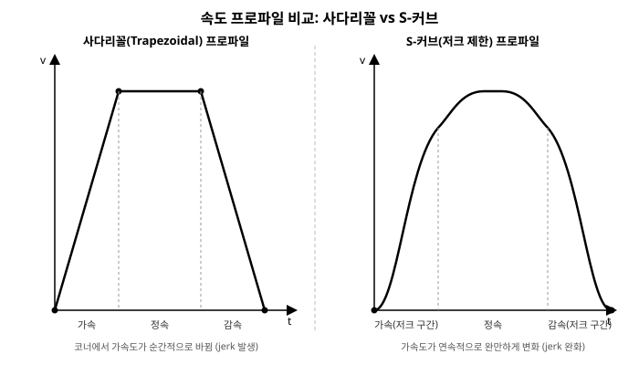

# 4장. 모터 및 I/O 제어(Motion & I/O)

[◀ 이전: 3장. 하드웨어 통신 및 드라이버 연동](ch03-하드웨어통신과드라이버연동.md) | [📖 목차](00-목차.md) | [다음: 5장. 상태 머신(FSM) 및 시퀀스 설계 ▶](ch05-상태머신과시퀀스설계.md)


3장에서는 벤더가 제공하는 네이티브 보드 SDK(DLL)를 P/Invoke로 감싸 C#에서 호출 가능한 형태로 만드는 방법을 다루었다. 하지만 `[DllImport]`가 붙은 `static extern` 함수를 애플리케이션 코드 곳곳에서 직접 호출하는 방식은 장비 제어 소프트웨어를 오래 유지보수할수록 문제를 일으킨다. 채널 번호가 매직 넘버로 코드에 흩어지고, 보드가 바뀌면 전체 코드를 다시 손봐야 하며, 무엇보다 하드웨어 없이 로직을 테스트할 방법이 없어진다.

4장은 이 저수준 SDK 위에 애플리케이션이 실제로 사용할 **고수준 C# 추상화 계층**을 설계한다. 디지털/아날로그 I/O를 논리적 이름을 가진 채널 객체로 감싸고, 모터를 원점 복귀·Jog·절대/상대 이동이 가능한 축(Axis) 객체로 감싸며, 그 위에 사다리꼴/S-커브 속도 프로파일과 다축 보간을 얹는다. 마지막으로 이 모든 동작이 안전하게 이루어지도록 소프트웨어 인터락과 하드웨어 리미트 처리를 다룬다. 여기서 만드는 `IAxis`, `IDigitalInputChannel`, `InterlockManager` 같은 추상화는 5장의 상태 머신(FSM)과 시퀀스가 호출하는 대상이 되고, 6장의 WPF/MVVM HMI가 바인딩하는 대상이 되며, 7장의 레시피/설정 관리가 값을 채워 넣는 대상이 된다.

> **예제 코드에 대한 전제**: 이 장의 코드는 특정 실존 제품을 지칭하지 않는 **가상의 예시 I/O·모션 보드 SDK**(`ExampleIO.dll`, `ExampleAxis.dll`라는 가상의 네이티브 라이브러리, 이하 "예시 보드 SDK")를 3장의 패턴으로 P/Invoke 래핑했다는 전제 위에서 작성한다. 실제 실무에서는 사용 중인 보드사의 SDK 함수명과 시그니처로 치환하면 되며, 이 장에서 설계하는 상위 애플리케이션 계층(`IAxis`, `IDigitalInputChannel` 등)의 구조 자체는 보드가 바뀌어도 거의 그대로 재사용할 수 있도록 의도적으로 설계했다.

## 4.1 DIO/AIO 보드 인터페이스 래핑(Wrapping) 클래스 구조

### 4.1.1 왜 한 번 더 감싸야 하는가

3장에서 만든 P/Invoke 래퍼는 이런 모습이었다고 가정하자.

```csharp
internal static class NativeMethods
{
    private const string Dll = "ExampleIO.dll";

    [DllImport(Dll, CallingConvention = CallingConvention.StdCall)]
    public static extern int EIO_OpenBoard(int boardId);

    [DllImport(Dll, CallingConvention = CallingConvention.StdCall)]
    public static extern int EIO_CloseBoard(int boardId);

    [DllImport(Dll, CallingConvention = CallingConvention.StdCall)]
    public static extern int EIO_DI_Read(int boardId, int channel, out byte value);

    [DllImport(Dll, CallingConvention = CallingConvention.StdCall)]
    public static extern int EIO_DO_Write(int boardId, int channel, byte value);

    [DllImport(Dll, CallingConvention = CallingConvention.StdCall)]
    public static extern int EIO_AI_Read(int boardId, int channel, out double voltage);
}
```

이 정적 클래스는 정확하지만 애플리케이션이 쓰기에는 여러모로 불편하다.

- 호출부마다 `boardId`와 `channel` 숫자를 알아야 한다. `EIO_DI_Read(0, 3, out v)`가 "진공 센서 1번"이라는 사실은 주석 없이는 아무도 알 수 없다.
- 반환값 `int`가 에러 코드인지 매번 확인해서 예외로 변환하는 코드가 호출부마다 중복된다.
- 단위 테스트에서 실제 보드 없이 시퀀스 로직만 검증하고 싶어도 `EIO_DI_Read`를 가짜로 대체할 방법이 없다(정적 P/Invoke 메서드는 모킹이 불가능하다).
- 신호의 극성(activelow/high), 디바운스 시간 같은 채널별 속성을 저장할 곳이 없다.

그래서 P/Invoke 계층과 애플리케이션 계층 사이에 **디바이스 추상화 계층(HAL, Hardware Abstraction Layer)**을 하나 더 둔다. 1장에서 소개한 계층형 아키텍처의 "Device/Axis Layer"가 바로 이 역할을 한다. 이 계층의 목표는 단순하다. 애플리케이션 코드는 `vacuumSensor1.IsOn`, `gripperSolenoid.SetAsync(true)`처럼 **의미가 드러나는 이름과 인터페이스**만으로 하드웨어를 다룰 수 있어야 한다.

### 4.1.2 채널 인터페이스 설계

먼저 세 가지 채널 타입에 대한 인터페이스를 정의한다. 인터페이스로 뽑아 두면 실제 보드 구현체와 시뮬레이션(가짜) 구현체를 상황에 따라 주입할 수 있어, 9장에서 다룰 하드웨어 없는 자동화 테스트가 가능해진다.

```csharp
public interface IDigitalInputChannel
{
    string Name { get; }
    bool IsOn { get; }

    /// 디바운싱을 거친 뒤 값이 실제로 바뀌었을 때만 발생한다.
    event EventHandler<DigitalInputChangedEventArgs> Changed;
}

public interface IDigitalOutputChannel
{
    string Name { get; }
    bool IsOn { get; }

    Task SetAsync(bool on, CancellationToken cancellationToken = default);
}

public interface IAnalogInputChannel
{
    string Name { get; }
    string Unit { get; }

    /// 보드가 반환하는 전압을 엔지니어링 단위(예: Torr, °C)로 환산한 값
    double Value { get; }

    double MinValue { get; }
    double MaxValue { get; }
}

public sealed class DigitalInputChangedEventArgs : EventArgs
{
    public string ChannelName { get; }
    public bool IsOn { get; }

    public DigitalInputChangedEventArgs(string channelName, bool isOn)
    {
        ChannelName = channelName;
        IsOn = isOn;
    }
}
```

`IDigitalOutputChannel.SetAsync`가 `Task`를 반환하는 이유는, 일부 보드 SDK는 출력 반영을 확인하는 데 짧은 지연이 있거나(릴레이 출력 보드 등) 백그라운드 큐를 통해 명령을 보내기 때문이다. 단순 즉시 반영 보드라면 내부에서 `Task.CompletedTask`를 반환해도 무방하지만, 인터페이스를 애초에 비동기로 설계해 두면 나중에 구현을 바꿔도 호출부 코드가 깨지지 않는다.

실제 보드 구현체는 다음과 같이 앞서 만든 `NativeMethods`를 감싼다.

```csharp
internal sealed class BoardDigitalOutputChannel : IDigitalOutputChannel
{
    private readonly int _boardId;
    private readonly int _channel;
    private readonly bool _activeLow;
    private volatile bool _isOn;

    public string Name { get; }
    public bool IsOn => _isOn;

    public BoardDigitalOutputChannel(string name, int boardId, int channel, bool activeLow)
    {
        Name = name;
        _boardId = boardId;
        _channel = channel;
        _activeLow = activeLow;
    }

    public Task SetAsync(bool on, CancellationToken cancellationToken = default)
    {
        cancellationToken.ThrowIfCancellationRequested();

        byte physicalValue = (byte)((on ^ _activeLow) ? 1 : 0); // 극성 보정
        int rc = NativeMethods.EIO_DO_Write(_boardId, _channel, physicalValue);
        if (rc != 0)
            throw new IoBoardException(Name, rc, $"출력 채널 '{Name}' 쓰기 실패 (rc={rc})");

        _isOn = on;
        return Task.CompletedTask;
    }
}
```

극성 보정(`on ^ _activeLow`)을 채널 구현체 안에 캡슐화해 둔 점이 중요하다. 현장에서는 배선 사정으로 "0V일 때 ON"으로 결선된 센서·솔레노이드가 흔한데, 이 보정 로직이 채널 구현 내부에 있으면 상위 시퀀스 코드는 항상 "논리적으로 켜짐/꺼짐"만 다루면 되고 실제 배선 극성을 신경 쓸 필요가 없다.

### 4.1.3 I/O 맵: 하드웨어 채널을 논리적 이름으로

채널 인터페이스를 만들었다면, 다음 문제는 "보드 0번의 채널 3번이 진공 센서 1번이다"라는 매핑 정보를 어디에 둘 것인가이다. 이 정보를 코드에 하드코딩하면 배선이 바뀌거나 설비가 증설될 때마다 재컴파일이 필요하다. 실무에서는 이 매핑을 설정 파일(JSON)로 분리하고, 프로그램 시작 시 한 번 로드해서 채널 객체들을 구성한다. 이 패턴은 7장에서 다루는 레시피·설정 관리와 동일한 축을 공유한다 — 즉, I/O 맵도 넓게 보면 "설비 구성 데이터"의 일종이다.

```json
{
  "boards": [
    { "boardId": 0, "type": "DIO-32CH" },
    { "boardId": 1, "type": "AIO-8CH" }
  ],
  "digitalInputs": [
    { "name": "VacuumSensor1",     "boardId": 0, "channel": 3,  "activeLow": false, "debounceMs": 10 },
    { "name": "DoorClosedSensor",  "boardId": 0, "channel": 5,  "activeLow": true,  "debounceMs": 20 },
    { "name": "Axis1HomeSensor",   "boardId": 0, "channel": 8,  "activeLow": false, "debounceMs": 2  }
  ],
  "digitalOutputs": [
    { "name": "GripperSolenoid",   "boardId": 0, "channel": 0, "activeLow": false },
    { "name": "StackLightRed",     "boardId": 0, "channel": 1, "activeLow": false }
  ],
  "analogInputs": [
    { "name": "ChamberPressure", "boardId": 1, "channel": 0,
      "minVoltage": 0, "maxVoltage": 10, "minValue": 0, "maxValue": 760, "unit": "Torr" }
  ]
}
```

이 JSON을 로드해서 채널 딕셔너리를 만드는 `IoManager`는 다음과 같다.

```csharp
public sealed class IoMapEntry
{
    public string Name { get; set; } = "";
    public int BoardId { get; set; }
    public int Channel { get; set; }
    public bool ActiveLow { get; set; }
    public int DebounceMs { get; set; }
}

public sealed class AnalogIoMapEntry : IoMapEntry
{
    public double MinVoltage { get; set; }
    public double MaxVoltage { get; set; }
    public double MinValue { get; set; }
    public double MaxValue { get; set; }
    public string Unit { get; set; } = "";
}

public sealed class IoMapDocument
{
    public List<BoardEntry> Boards { get; set; } = new();
    public List<IoMapEntry> DigitalInputs { get; set; } = new();
    public List<IoMapEntry> DigitalOutputs { get; set; } = new();
    public List<AnalogIoMapEntry> AnalogInputs { get; set; } = new();

    public sealed class BoardEntry
    {
        public int BoardId { get; set; }
        public string Type { get; set; } = "";
    }
}

public sealed class IoManager
{
    private readonly Dictionary<string, IDigitalInputChannel> _digitalInputs = new();
    private readonly Dictionary<string, IDigitalOutputChannel> _digitalOutputs = new();
    private readonly Dictionary<string, IAnalogInputChannel> _analogInputs = new();

    public static IoManager LoadFromFile(string jsonPath)
    {
        string json = File.ReadAllText(jsonPath);
        var doc = JsonSerializer.Deserialize<IoMapDocument>(json,
            new JsonSerializerOptions { PropertyNameCaseInsensitive = true })
            ?? throw new InvalidDataException("I/O 맵 파일 파싱 실패");

        var manager = new IoManager();

        foreach (var board in doc.Boards)
        {
            int rc = NativeMethods.EIO_OpenBoard(board.BoardId);
            if (rc != 0)
                throw new IoBoardException($"Board{board.BoardId}", rc, "보드 오픈 실패");
        }

        foreach (var entry in doc.DigitalInputs)
        {
            IDigitalInputChannel raw = new BoardDigitalInputChannel(
                entry.Name, entry.BoardId, entry.Channel, entry.ActiveLow);

            // 디바운스 시간이 지정되어 있으면 데코레이터로 감싼다 (4.1.4절).
            manager._digitalInputs[entry.Name] = entry.DebounceMs > 0
                ? new DebouncedDigitalInput(raw, TimeSpan.FromMilliseconds(entry.DebounceMs))
                : raw;
        }

        foreach (var entry in doc.DigitalOutputs)
            manager._digitalOutputs[entry.Name] =
                new BoardDigitalOutputChannel(entry.Name, entry.BoardId, entry.Channel, entry.ActiveLow);

        foreach (var entry in doc.AnalogInputs)
            manager._analogInputs[entry.Name] = new BoardAnalogInputChannel(
                entry.Name, entry.BoardId, entry.Channel,
                entry.MinVoltage, entry.MaxVoltage, entry.MinValue, entry.MaxValue, entry.Unit);

        return manager;
    }

    public IDigitalInputChannel DI(string name) =>
        _digitalInputs.TryGetValue(name, out var ch)
            ? ch
            : throw new KeyNotFoundException($"I/O 맵에 '{name}' 디지털 입력이 정의되어 있지 않습니다.");

    public IDigitalOutputChannel DO(string name) =>
        _digitalOutputs.TryGetValue(name, out var ch)
            ? ch
            : throw new KeyNotFoundException($"I/O 맵에 '{name}' 디지털 출력이 정의되어 있지 않습니다.");

    public IAnalogInputChannel AI(string name) =>
        _analogInputs.TryGetValue(name, out var ch)
            ? ch
            : throw new KeyNotFoundException($"I/O 맵에 '{name}' 아날로그 입력이 정의되어 있지 않습니다.");
}
```

이렇게 구성해 두면 5장의 시퀀스 코드는 다음처럼 이름만으로 하드웨어를 다룬다.

```csharp
if (ioManager.DI("DoorClosedSensor").IsOn)
{
    await ioManager.DO("GripperSolenoid").SetAsync(true);
}
```

보드가 교체되거나 채널 배선이 바뀌어도 JSON 파일 한 줄만 고치면 되고, 코드는 전혀 손댈 필요가 없다. `KeyNotFoundException`을 던지도록 한 것도 의도적이다 — 오타가 있는 채널 이름을 참조하면 프로그램 시작 직후(또는 첫 접근 시점)에 즉시 실패하게 만들어, 현장에서 몇 시간 뒤에 엉뚱한 채널을 건드리는 사고를 예방한다.

### 4.1.4 디지털 입력 디바운싱

기계식 센서(리밋 스위치, 근접 센서 일부, 특히 릴레이 접점)는 상태가 바뀌는 순간 접점이 미세하게 튀는 **채터링(chattering)** 현상을 일으킨다. 물리적으로는 한 번만 눌렸는데 전기 신호로는 수 밀리초 사이에 ON/OFF가 여러 번 반복되는 것이다. 이를 그대로 애플리케이션에 전달하면 "센서가 여러 번 감지되었다"고 오판해 카운터가 잘못 올라가거나, 상태 머신이 짧은 순간에 여러 번 전이하는 등 예측 불가능한 오동작이 발생한다.

디바운싱의 핵심 아이디어는 "값이 바뀐 직후 일정 시간(디바운스 윈도우) 동안 안정적으로 유지되어야만 진짜로 바뀐 것으로 인정한다"는 것이다. 구현 방식은 크게 두 가지다.

1. **폴링 기반**: 짧은 주기(예: 1~2ms)로 원시 채널 값을 읽으면서, 마지막으로 값이 바뀐 시점부터 디바운스 시간이 지날 때까지 값이 흔들리지 않았는지 확인한다.
2. **타이머 리셋 기반**: 값이 바뀔 때마다 타이머를 (재)시작하고, 타이머가 만료될 때까지 값이 또 바뀌지 않으면 그 시점의 값을 확정한다.

여기서는 2장에서 다룬 `PeriodicTimer` 기반 폴링 루프 패턴을 재사용해 폴링 기반 디바운서를 구현한다. `IDigitalInputChannel`을 그대로 구현하는 데코레이터로 만들어 두면, `IoManager`가 원시 채널을 이 데코레이터로 감싸기만 하면 되고 상위 코드는 디바운싱 여부를 신경 쓸 필요가 없다.

```csharp
public sealed class DebouncedDigitalInput : IDigitalInputChannel, IDisposable
{
    private readonly IDigitalInputChannel _raw;
    private readonly TimeSpan _debounceWindow;
    private readonly PeriodicTimer _pollTimer;
    private readonly CancellationTokenSource _cts = new();
    private readonly Task _pollTask;

    private volatile bool _stableValue;
    private bool _candidateValue;
    private DateTime _candidateSince;

    public string Name => _raw.Name;
    public bool IsOn => _stableValue;
    public event EventHandler<DigitalInputChangedEventArgs>? Changed;

    public DebouncedDigitalInput(IDigitalInputChannel raw, TimeSpan debounceWindow, TimeSpan? pollInterval = null)
    {
        _raw = raw;
        _debounceWindow = debounceWindow;
        _stableValue = raw.IsOn;
        _candidateValue = raw.IsOn;
        _candidateSince = DateTime.UtcNow;

        _pollTimer = new PeriodicTimer(pollInterval ?? TimeSpan.FromMilliseconds(2));
        _pollTask = RunPollLoopAsync(_cts.Token);
    }

    private async Task RunPollLoopAsync(CancellationToken cancellationToken)
    {
        try
        {
            while (await _pollTimer.WaitForNextTickAsync(cancellationToken))
            {
                bool current = _raw.IsOn;

                if (current != _candidateValue)
                {
                    // 값이 흔들렸다 - 후보값과 타이머를 리셋한다.
                    _candidateValue = current;
                    _candidateSince = DateTime.UtcNow;
                    continue;
                }

                if (current != _stableValue &&
                    DateTime.UtcNow - _candidateSince >= _debounceWindow)
                {
                    // 디바운스 윈도우 동안 값이 안정적으로 유지되었다 - 확정.
                    _stableValue = current;
                    Changed?.Invoke(this, new DigitalInputChangedEventArgs(Name, current));
                }
            }
        }
        catch (OperationCanceledException)
        {
            // 정상 종료 경로
        }
    }

    public void Dispose()
    {
        _cts.Cancel();
        _pollTimer.Dispose();
        _cts.Dispose();
    }
}
```

디바운스 시간(`debounceMs`)을 센서 종류에 따라 I/O 맵에서 개별 설정할 수 있게 한 이유는, 센서마다 특성이 다르기 때문이다. 광센서나 근접 센서처럼 채터링이 거의 없는 신호는 2ms 정도의 짧은 윈도우로도 충분하지만, 기계식 리밋 스위치나 릴레이 출력을 받는 입력은 10~20ms 정도로 넉넉히 잡아야 안전하다. 반대로 디바운스 시간을 지나치게 길게 잡으면 실제 반응 지연이 커져서, 고속으로 지나가는 부품을 감지해야 하는 센서(예: 컨베이어 통과 센서)에는 독이 될 수 있다. 이 값은 결국 현장에서 실측하며 튜닝해야 하는 파라미터이며, 그래서 코드가 아니라 설정 파일에 두는 것이 중요하다.

## 4.2 모터 제어 기본: 원점 복귀(Homing), Jog, 절대/상대 이동

### 4.2.1 원점 복귀가 반드시 필요한 이유

서보 모터나 스텝 모터 축은 전원이 꺼졌다가 다시 켜지면 대부분의 경우 자신이 실제 공간 어디에 있는지 알지 못한다. 증분형(incremental) 엔코더를 쓰는 축은 전원 인가 순간의 위치를 0으로 놓고 카운트를 시작하므로, 컨트롤러가 기억하는 "현재 위치"는 전원이 꺼지기 전 실제 위치와 아무 상관이 없다. 절대형(absolute) 엔코더를 쓰는 축이라 하더라도, 기구적으로 축이 분해·재조립되었거나 커플링이 밀렸을 가능성이 있기 때문에 전원 인가 직후의 좌표를 곧바로 신뢰하는 것은 위험하다.

그래서 장비 제어 소프트웨어는 시스템 기동 시(혹은 비상정지 해제 후) 반드시 **원점 복귀(Homing)** 절차를 거쳐, 축의 논리 좌표계와 기구적 실제 위치를 다시 일치시킨다. 이 절차를 거치기 전에는 절대 좌표 이동 명령을 신뢰할 수 없으므로, 잘 설계된 축 컨트롤러는 원점 복귀가 끝나지 않은 축에 대해 `MoveAbsoluteAsync` 호출 자체를 거부해야 한다(이는 4.4절 인터락과도 연결된다).

일반적인 홈 시퀀스는 다음 단계를 따른다.

1. **저속으로 홈 센서 방향 이동**: 축을 비교적 낮은 속도로 홈 센서가 있는 방향으로 이동시킨다. 이때 반대편으로 이동하면 하드웨어 리미트에 부딪힐 수 있으므로 방향 설정에 주의한다.
2. **센서 감지**: 홈 센서(근접 센서 또는 포토 센서)가 ON으로 바뀌는 순간 즉시 감속 정지한다. 감속 관성으로 인해 정확한 정지 위치는 센서가 켜진 지점보다 약간 지나친다.
3. **반대 방향으로 미세 후진 후 저속 재접근**: 정지 후 반대 방향으로 조금 물러나 센서가 다시 OFF로 바뀌는 지점을 확인하고, 그 지점에서 아주 낮은 속도로 다시 센서 방향에 접근하며 센서의 ON 엣지를 정밀하게 포착한다. 이 2단계 접근(고속 탐색 → 저속 정밀 접근)을 하는 이유는, 고속으로 이동하는 동안에는 정지 관성 때문에 매번 정지 위치가 미세하게 달라져 반복 정밀도가 떨어지기 때문이다. 저속에서 엣지를 잡으면 반복할 때마다 거의 같은 위치에서 센서 엣지를 검출할 수 있다.
4. **원점 좌표 설정**: 정밀하게 검출한 엣지 위치를 논리 좌표 0(또는 설정된 원점 오프셷 값)으로 설정한다. 보드 SDK의 "현재 위치를 특정 값으로 강제 설정"하는 함수(`EAX_SetCommandPosition`)를 호출한다.

이 절차는 그 자체로 하나의 작은 시퀀스이며, 정확히 5장에서 본격적으로 다룰 **상태 머신(FSM)**의 좋은 예제가 된다. 여기서는 5장에서 만들 범용 FSM 프레임워크를 아직 사용하지 않고, 홈 시퀀스 전용의 단순한 상태 머신을 직접 구현해 본다.

```csharp
public enum HomeState
{
    Idle,
    SeekingFast,     // 저속(고속 탐색)으로 센서 방향 이동 중
    BackingOff,      // 센서를 지나쳐 정지한 뒤 반대 방향으로 후진 중
    SeekingSlow,     // 저속으로 정밀 엣지 재접근 중
    SettingOrigin,   // 원점 좌표 확정 중
    Completed,
    Faulted
}

public sealed class AxisHomeSequencer
{
    private readonly IAxis _axis;
    private readonly HomeSequenceConfig _config;

    public HomeState State { get; private set; } = HomeState.Idle;
    public event EventHandler<HomeState>? StateChanged;

    public AxisHomeSequencer(IAxis axis, HomeSequenceConfig config)
    {
        _axis = axis;
        _config = config;
    }

    public async Task RunAsync(CancellationToken cancellationToken)
    {
        try
        {
            await TransitionAsync(HomeState.SeekingFast, cancellationToken);
            await SeekFastAsync(cancellationToken);

            await TransitionAsync(HomeState.BackingOff, cancellationToken);
            await BackOffAsync(cancellationToken);

            await TransitionAsync(HomeState.SeekingSlow, cancellationToken);
            await SeekSlowAsync(cancellationToken);

            await TransitionAsync(HomeState.SettingOrigin, cancellationToken);
            await _axis.SetOriginAsync(_config.OriginOffset, cancellationToken);

            await TransitionAsync(HomeState.Completed, cancellationToken);
        }
        catch (Exception)
        {
            await TransitionAsync(HomeState.Faulted, CancellationToken.None);
            await _axis.StopAsync(); // 실패 시 즉시 정지, 축은 미완료 상태로 남는다.
            throw;
        }
    }

    private async Task SeekFastAsync(CancellationToken ct)
    {
        // 홈 센서가 켜질 때까지 저속(탐색 속도)으로 이동 명령을 낸다.
        _axis.JogStart(_config.HomeDirection, _config.SeekVelocity);
        try
        {
            await WaitUntilAsync(() => _axis.IsHomeSensorOn, _config.SeekTimeout, ct);
        }
        finally
        {
            _axis.JogStop();
        }
        await _axis.WaitUntilStoppedAsync(ct);
    }

    private async Task BackOffAsync(CancellationToken ct)
    {
        // 센서를 벗어날 때까지 반대 방향으로 소량 후진한다.
        _axis.JogStart(Opposite(_config.HomeDirection), _config.BackOffVelocity);
        try
        {
            await WaitUntilAsync(() => !_axis.IsHomeSensorOn, _config.SeekTimeout, ct);
        }
        finally
        {
            _axis.JogStop();
        }
        await _axis.WaitUntilStoppedAsync(ct);
    }

    private async Task SeekSlowAsync(CancellationToken ct)
    {
        // 아주 낮은 속도로 다시 접근해 정밀한 엣지를 포착한다.
        _axis.JogStart(_config.HomeDirection, _config.CreepVelocity);
        try
        {
            await WaitUntilAsync(() => _axis.IsHomeSensorOn, _config.SeekTimeout, ct);
        }
        finally
        {
            _axis.JogStop(); // 저속이므로 정지 오버런이 매우 작다.
        }
        await _axis.WaitUntilStoppedAsync(ct);
    }

    private async Task TransitionAsync(HomeState next, CancellationToken ct)
    {
        State = next;
        StateChanged?.Invoke(this, next);
        await Task.Yield();
    }

    private static async Task WaitUntilAsync(Func<bool> condition, TimeSpan timeout, CancellationToken ct)
    {
        using var timeoutCts = CancellationTokenSource.CreateLinkedTokenSource(ct);
        timeoutCts.CancelAfter(timeout);

        using var pollTimer = new PeriodicTimer(TimeSpan.FromMilliseconds(2));
        while (!condition())
        {
            if (!await pollTimer.WaitForNextTickAsync(timeoutCts.Token))
                throw new TimeoutException("홈 센서 탐색 타임아웃");
        }
    }

    private static MotionDirection Opposite(MotionDirection d) =>
        d == MotionDirection.Positive ? MotionDirection.Negative : MotionDirection.Positive;
}

public sealed class HomeSequenceConfig
{
    public MotionDirection HomeDirection { get; init; } = MotionDirection.Negative;
    public double SeekVelocity { get; init; } = 50.0;   // mm/s, 고속 탐색
    public double CreepVelocity { get; init; } = 2.0;   // mm/s, 저속 정밀 접근
    public double BackOffVelocity { get; init; } = 10.0;
    public double OriginOffset { get; init; } = 0.0;
    public TimeSpan SeekTimeout { get; init; } = TimeSpan.FromSeconds(30);
}
```

`WaitUntilAsync`가 타임아웃을 갖는 것은 필수다. 배선 불량이나 센서 고장으로 홈 센서가 영원히 감지되지 않는다면, 축은 리미트 스위치에 부딪힐 때까지 계속 이동하게 되고 이는 그대로 설비 파손 사고로 이어진다. 타임아웃이 걸리면 예외가 던져지고 `catch` 블록에서 즉시 `StopAsync()`를 호출해 축을 세운다.

### 4.2.2 Jog 구현과 안전

Jog는 오퍼레이터가 버튼을 누르고 있는 동안에만 축이 움직이고, 버튼을 떼는 즉시(혹은 아주 짧은 감속 시간 내에) 정지하는 수동 이동 모드다. 설비 셋업, 티칭, 정비 시 필수적인 기능이지만 오퍼레이터가 직접 개입하는 만큼 안전 요구사항이 가장 엄격한 모션 모드이기도 하다.

Jog는 API 관점에서 "목표 지점까지 이동"이 아니라 "정지 명령이 올 때까지 지정된 속도로 계속 이동"이라는 점에서 절대/상대 이동과 근본적으로 다르다. 따라서 인터페이스도 `Task`를 반환하는 비동기 메서드가 아니라, 시작과 정지가 분리된 동기 메서드 쌍으로 설계하는 것이 자연스럽다.

```csharp
public interface IAxis
{
    // ... (4.2.4절에서 계속)

    void JogStart(MotionDirection direction, double velocity);
    void JogStop();
}
```

Jog 구현에서 지켜야 할 안전 원칙은 다음과 같다.

- **데드맨 스위치(Dead-man switch) 원칙**: "누르는 동안만 움직인다"는 UI 계약을 소프트웨어가 배신해서는 안 된다. 즉 `JogStart`를 호출한 뒤 UI 이벤트(`PreviewMouseUp`, 버튼 릴리즈 등)가 어떤 이유로든 소실되더라도 축이 계속 움직이면 안 된다. 이를 위해 6장에서 다룰 HMI 버튼은 "keep-alive" 신호를 짧은 주기(예: 100ms)로 계속 보내도록 구현하고, `IAxis` 구현체는 keep-alive가 일정 시간(예: 300ms) 이상 끊기면 자동으로 `JogStop()`을 호출하는 워치독을 내부에 둔다.

```csharp
internal sealed class BoardAxis : IAxis
{
    private readonly Timer _jogWatchdog;
    private volatile bool _isJogging;

    public BoardAxis(/* ... */)
    {
        _jogWatchdog = new Timer(OnJogWatchdogExpired, null, Timeout.Infinite, Timeout.Infinite);
    }

    public void JogStart(MotionDirection direction, double velocity)
    {
        double clampedVelocity = Math.Min(velocity, MaxJogVelocity); // 안전 상한 강제
        double signedVelocity = direction == MotionDirection.Positive ? clampedVelocity : -clampedVelocity;

        int rc = NativeMethods.EAX_MoveVelocity(_axisId, signedVelocity, _config.JogAcceleration);
        if (rc != 0)
            throw new AxisFaultException(_axisId, rc, "Jog 시작 실패");

        _isJogging = true;
        _jogWatchdog.Change(JogKeepAliveTimeout, Timeout.InfiniteTimeSpan);
    }

    /// UI로부터 100ms 주기로 호출되어 워치독을 갱신한다. 버튼이 눌려 있는 동안 계속 호출됨.
    public void JogKeepAlive()
    {
        if (_isJogging)
            _jogWatchdog.Change(JogKeepAliveTimeout, Timeout.InfiniteTimeSpan);
    }

    public void JogStop()
    {
        _jogWatchdog.Change(Timeout.Infinite, Timeout.Infinite);
        _isJogging = false;
        NativeMethods.EAX_Stop(_axisId, _config.JogDeceleration);
    }

    private void OnJogWatchdogExpired(object? state)
    {
        // keep-alive가 끊겼다 - UI 응답 소실 등 비정상 상황으로 간주하고 즉시 정지.
        JogStop();
    }
}
```

- **속도 상한 강제**: Jog 속도는 UI 슬라이더 등으로 사용자가 조절 가능하게 두더라도, `IAxis` 구현체 내부에서 반드시 설비 안전 속도로 클램핑해야 한다. UI 레이어의 값 검증만 믿으면 안 된다 — UI 버그나 자동화 스크립트 호출로 상한을 우회할 수 있기 때문에, 최종 방어선은 항상 하드웨어에 가장 가까운 계층에 있어야 한다는 원칙(4.4절에서 다시 다룬다)이 여기에도 적용된다.
- **리미트 근접 시 자동 감속/정지**: Jog 중에도 하드웨어 리미트 센서 감지는 계속 살아 있어야 하며, 리미트에 도달하면 즉시 정지해야 한다(4.4.3절).
- **동시 명령 차단**: Jog 중에는 다른 절대/상대 이동 명령이 같은 축에 대해 접수되지 않도록 `IAxis` 구현체가 상태를 확인해야 한다. 이는 뒤에서 다룰 `EnsureIdle()` 가드로 처리한다.

### 4.2.3 절대/상대 이동 API 설계

절대 이동(Move Absolute)은 "축 좌표계 원점 기준의 목표 좌표"로 이동하고, 상대 이동(Move Relative)은 "현재 위치 기준의 이동 거리"만큼 이동한다. 두 API는 최종적으로 보드 SDK에는 거의 같은 함수 호출로 이어지지만(많은 보드가 내부적으로 상대 이동도 절대 좌표로 환산해서 명령한다), 애플리케이션 레벨에서는 반드시 별도 메서드로 구분해 제공해야 한다. 그 이유는 두 가지다.

1. **의도 표현이 다르다**: "컨베이어 끝(x=850.0)으로 가라"는 절대 이동이고, "현재 위치에서 5mm 더 전진하라"는 상대 이동이다. 두 메서드를 합쳐서 "부호가 있는 하나의 파라미터로 모드까지 지정"하는 API로 설계하면 호출부 코드의 의도가 흐려지고 실수하기 쉽다.
2. **원점 복귀 여부에 대한 요구사항이 다르다**: 절대 이동은 좌표계가 확정되어 있어야만 의미가 있으므로 반드시 원점 복귀 완료를 전제해야 한다. 반면 상대 이동은 (일부 설계에서) 원점 복귀 전에도 "안전하게 조금만 물러나라" 같은 제한적 용도로 허용할 여지가 있다. 이 정책을 메서드 레벨에서 서로 다르게 강제할 수 있다.

```csharp
public interface IAxis
{
    string Name { get; }
    double CurrentPosition { get; }
    bool IsHomed { get; }
    bool IsMoving { get; }
    bool IsHomeSensorOn { get; }
    bool IsPositiveLimitOn { get; }
    bool IsNegativeLimitOn { get; }

    Task HomeAsync(CancellationToken cancellationToken = default);

    Task MoveAbsoluteAsync(double position, double velocity, CancellationToken cancellationToken = default);
    Task MoveRelativeAsync(double distance, double velocity, CancellationToken cancellationToken = default);

    void JogStart(MotionDirection direction, double velocity);
    void JogStop();

    Task StopAsync(); // 정상 감속 정지
    void EmergencyStop(); // 즉시 정지 (감속 없음, 4.4절)

    Task SetOriginAsync(double originValue, CancellationToken cancellationToken = default);
    Task WaitUntilStoppedAsync(CancellationToken cancellationToken = default);
}

public enum MotionDirection { Positive, Negative }
```

`MoveAbsoluteAsync`와 `MoveRelativeAsync`는 시그니처가 거의 같아 보이지만("position" vs "distance"), 구현체 내부에서 전제 조건 검사가 달라진다.

```csharp
public async Task MoveAbsoluteAsync(double position, double velocity, CancellationToken cancellationToken = default)
{
    if (!IsHomed)
        throw new InvalidOperationException($"축 '{Name}'은 원점 복귀가 완료되지 않아 절대 이동을 수행할 수 없습니다.");

    EnsureIdle();
    _softLimits.EnsureWithinRange(position); // 4.4.2절 소프트 리미트 검사
    _interlockManager.EnsureSafeToMove(this); // 4.4.4절 인터락 검사

    await ExecuteMoveAsync(
        () => NativeMethods.EAX_MoveAbs(_axisId, position, velocity, _config.Acceleration, _config.Deceleration),
        cancellationToken);
}

public async Task MoveRelativeAsync(double distance, double velocity, CancellationToken cancellationToken = default)
{
    EnsureIdle();

    double targetPosition = CurrentPosition + distance;
    _softLimits.EnsureWithinRange(targetPosition);
    _interlockManager.EnsureSafeToMove(this);

    await ExecuteMoveAsync(
        () => NativeMethods.EAX_MoveRel(_axisId, distance, velocity, _config.Acceleration, _config.Deceleration),
        cancellationToken);
}

private void EnsureIdle()
{
    if (IsMoving)
        throw new InvalidOperationException($"축 '{Name}'이 이미 이동 중입니다.");
}
```

`MoveAbsoluteAsync`만 `IsHomed` 검사를 강제하는 것에 주목하자. 상대 이동은 원점 복귀와 무관하게 "지금 위치에서 얼마만큼"이라는 의미로 항상 유효하지만(물론 소프트 리미트가 설정되어 있다면 그 범위 검사는 원점 좌표계를 전제하므로 별도 처리가 필요하다), 절대 이동은 좌표계 자체가 확정되어 있지 않으면 애초에 목표 좌표라는 개념이 성립하지 않는다.

### 4.2.4 TaskCompletionSource 기반 비동기 모션 완료 대기

`MoveAbsoluteAsync`가 `Task`를 반환한다는 것은, 이 메서드가 `await`되었을 때 "이동 명령이 접수된 시점"이 아니라 "축이 실제로 목표 위치에 도달해 정지한 시점"에 완료되어야 한다는 뜻이다. 그런데 예시 보드 SDK의 `EAX_MoveAbs`는 논-블로킹 함수로, 호출 즉시 반환되고 실제 이동은 보드 펌웨어가 백그라운드에서 수행한다. 이 "네이티브 논-블로킹 호출"과 "C# `Task`"를 이어주는 다리가 2장에서 다룬 `TaskCompletionSource<T>` 패턴이다.

이동 완료는 보드가 콜백을 지원하지 않는 한(다수의 저가형/구형 보드가 그렇다) 상태 레지스터를 폴링해서 확인해야 한다. `EAX_GetStatus`가 반환하는 상태 비트에는 `Moving`, `InPosition`, `Alarm`, `PositiveLimitOn`, `NegativeLimitOn`, `HomeSensorOn`이 포함된다고 가정한다.

```csharp
[Flags]
public enum AxisStatusFlags
{
    None = 0,
    Moving = 1 << 0,
    InPosition = 1 << 1,
    Alarm = 1 << 2,
    PositiveLimitOn = 1 << 3,
    NegativeLimitOn = 1 << 4,
    HomeSensorOn = 1 << 5,
}

internal sealed class BoardAxis : IAxis
{
    // ... (필드 생략)

    private async Task ExecuteMoveAsync(Func<int> issueNativeMove, CancellationToken cancellationToken)
    {
        int rc = issueNativeMove();
        if (rc != 0)
            throw new AxisFaultException(_axisId, rc, "모션 명령 접수 실패");

        var tcs = new TaskCompletionSource<bool>(TaskCreationOptions.RunContinuationsAsynchronously);

        // 정상 완료 또는 취소 시 정리
        using var registration = cancellationToken.Register(() =>
        {
            NativeMethods.EAX_Stop(_axisId, _config.Deceleration); // 취소 = 감속 정지
            tcs.TrySetCanceled(cancellationToken);
        });

        using var pollTimer = new PeriodicTimer(TimeSpan.FromMilliseconds(5));
        try
        {
            while (await pollTimer.WaitForNextTickAsync(cancellationToken))
            {
                var status = ReadStatus();

                if (status.HasFlag(AxisStatusFlags.Alarm))
                {
                    tcs.TrySetException(new AxisFaultException(_axisId, -1, "모션 중 축 알람 발생"));
                    break;
                }

                if (status.HasFlag(AxisStatusFlags.PositiveLimitOn) || status.HasFlag(AxisStatusFlags.NegativeLimitOn))
                {
                    // 4.4.3절: 리미트 감지 시 즉시 정지 이벤트가 별도로 처리되지만,
                    // 이동 대기 중인 Task 관점에서도 실패로 완료시켜야 호출부가 다음 동작을 진행하지 않는다.
                    tcs.TrySetException(new AxisLimitException(_axisId, "모션 중 하드웨어 리미트 감지"));
                    break;
                }

                if (!status.HasFlag(AxisStatusFlags.Moving) && status.HasFlag(AxisStatusFlags.InPosition))
                {
                    tcs.TrySetResult(true);
                    break;
                }
            }
        }
        catch (OperationCanceledException)
        {
            // cancellationToken.Register 콜백이 이미 tcs를 취소 처리했으므로 여기서는 무시한다.
        }

        await tcs.Task; // 실제 완료/취소/예외를 호출부까지 전파
    }

    private AxisStatusFlags ReadStatus()
    {
        int rc = NativeMethods.EAX_GetStatus(_axisId, out int rawStatus);
        if (rc != 0)
            throw new AxisFaultException(_axisId, rc, "상태 조회 실패");
        return (AxisStatusFlags)rawStatus;
    }
}
```

이 패턴의 핵심은 "네이티브 SDK의 폴링 방식 상태 확인"을 C# 소비자에게는 완전히 감추고, 소비자는 그저 `await axis.MoveAbsoluteAsync(100.0, 50.0)`라고만 쓰면 된다는 점이다. 시퀀스 코드(5장)는 이렇게 쓸 수 있다.

```csharp
await axisX.MoveAbsoluteAsync(850.0, 200.0, cancellationToken);
await axisY.MoveAbsoluteAsync(300.0, 150.0, cancellationToken);
// 이 지점에 도달했다는 것은 두 이동이 모두 실제로 완료되었음을 의미한다.
```

`CancellationToken`을 받아 등록해 두었기 때문에, 2장에서 만든 전역 비상정지용 `CancellationTokenSource`를 이 토큰에 연결해 두면 시스템 어디선가 비상정지가 눌리는 순간 진행 중이던 모든 `MoveAbsoluteAsync` 호출이 즉시 감속 정지되며 `OperationCanceledException`으로 종료된다. 이 연결 고리는 4.4.3절에서 다시 다룬다.

## 4.3 속도 프로파일(Trapezoidal, S-Curve) 및 인터폴레이션(보간) 제어

`MoveAbsoluteAsync(position, velocity)`를 호출할 때 실제로는 목표 속도 하나만 지정했지만, 축은 정지 상태에서 순간적으로 그 속도에 도달할 수 없다. 관성이 있는 물체를 가속하려면 시간이 걸리고, 목표 지점에 도달하기 전에는 다시 감속해서 정지해야 한다. 이 "시간에 따른 속도 변화 곡선"이 **속도 프로파일**이다. 대부분의 모션 보드는 프로파일 계산을 펌웨어가 대신해 주지만(가속도/감속도 파라미터만 넘기면 된다), 애플리케이션 레벨에서 프로파일의 수학을 이해하고 있어야 이동 소요 시간을 예측하거나, 보드가 프로파일 계산 기능을 제공하지 않는 저가형 보드를 소프트웨어로 보완하거나, 다축 동기화(4.3.3절)를 직접 설계할 수 있다.



### 4.3.1 사다리꼴(Trapezoidal) 속도 프로파일

사다리꼴 프로파일은 가장 널리 쓰이는 기본 프로파일로, 이름 그대로 시간-속도 그래프가 사다리꼴 모양을 그린다.

- **가속 구간**: 속도 0에서 목표 속도 $V_{max}$까지 일정한 가속도 $a$로 선형 증가
- **정속 구간**: $V_{max}$를 유지
- **감속 구간**: $V_{max}$에서 0까지 일정한 감속도 $d$로 선형 감소

이동해야 할 총 거리를 $D$, 가속도를 $a$, 감속도를 $d$, 목표 속도를 $V_{max}$라 하면, 각 구간의 시간과 거리는 다음과 같이 유도된다.

**가속 구간**: 가속 시간 $t_a = V_{max} / a$. 이 구간 동안 이동하는 거리(속도-시간 그래프 아래 삼각형 면적, 또는 등가속도 운동 공식 $s = \tfrac{1}{2}at^2$)는

$$d_a = \frac{1}{2} a t_a^2 = \frac{V_{max}^2}{2a}$$

**감속 구간**: 대칭적으로 감속 시간 $t_d = V_{max} / d$, 감속 거리는

$$d_d = \frac{V_{max}^2}{2d}$$

**정속 구간**: 가속·감속 구간에서 이미 $d_a + d_d$만큼 이동했으므로, 남은 거리를 $V_{max}$로 나눈 시간이 정속 구간 시간이다.

$$d_c = D - d_a - d_d, \qquad t_c = \frac{d_c}{V_{max}}$$

$$T_{total} = t_a + t_c + t_d$$

단, 이 공식은 $d_a + d_d \le D$일 때만, 즉 가속과 감속만으로 이미 목표 거리를 넘어서지 않을 때만 성립한다. 이동 거리가 짧아서 가속 도중에 이미 감속을 시작해야 하는 경우 정속 구간이 사라지고 **삼각형(Triangular) 프로파일**이 된다. 이때는 도달 가능한 최고 속도(피크 속도) $V_p$를 다음 조건에서 역산해야 한다.

$$\frac{V_p^2}{2a} + \frac{V_p^2}{2d} = D \quad\Longrightarrow\quad V_p = \sqrt{\frac{2Da d}{a + d}}$$

가속도와 감속도가 같은 값 $a$라면 이 식은 $V_p = \sqrt{aD}$로 단순화된다.

이 계산을 C# 클래스로 구현하면 다음과 같다.

```csharp
public sealed class TrapezoidalVelocityProfile
{
    public double Distance { get; }
    public double Acceleration { get; }
    public double Deceleration { get; }
    public double PeakVelocity { get; }   // 실제 도달하는 최고 속도 (요청한 MaxVelocity일 수도, 그보다 낮을 수도 있음)
    public double AccelTime { get; }
    public double ConstVelTime { get; }
    public double DecelTime { get; }
    public bool IsTriangular { get; }

    public double TotalTime => AccelTime + ConstVelTime + DecelTime;

    public TrapezoidalVelocityProfile(double distance, double maxVelocity, double acceleration, double deceleration)
    {
        if (distance <= 0)
            throw new ArgumentOutOfRangeException(nameof(distance), "이동 거리는 0보다 커야 합니다.");
        if (maxVelocity <= 0 || acceleration <= 0 || deceleration <= 0)
            throw new ArgumentOutOfRangeException("속도와 가속도/감속도는 0보다 커야 합니다.");

        Distance = distance;
        Acceleration = acceleration;
        Deceleration = deceleration;

        double accelDistance = (maxVelocity * maxVelocity) / (2.0 * acceleration);
        double decelDistance = (maxVelocity * maxVelocity) / (2.0 * deceleration);

        if (accelDistance + decelDistance <= distance)
        {
            IsTriangular = false;
            PeakVelocity = maxVelocity;
            AccelTime = maxVelocity / acceleration;
            DecelTime = maxVelocity / deceleration;
            double constDistance = distance - accelDistance - decelDistance;
            ConstVelTime = constDistance / maxVelocity;
        }
        else
        {
            IsTriangular = true;
            PeakVelocity = Math.Sqrt(2.0 * distance * acceleration * deceleration / (acceleration + deceleration));
            AccelTime = PeakVelocity / acceleration;
            DecelTime = PeakVelocity / deceleration;
            ConstVelTime = 0.0;
        }
    }

    /// 프로파일 시작 후 경과 시간 t(초)에서의 순간 속도
    public double GetVelocityAt(double t)
    {
        if (t <= 0) return 0;
        if (t <= AccelTime) return Acceleration * t;
        if (t <= AccelTime + ConstVelTime) return PeakVelocity;
        if (t <= TotalTime) return PeakVelocity - Deceleration * (t - AccelTime - ConstVelTime);
        return 0;
    }

    /// 프로파일 시작 후 경과 시간 t(초)에서의 누적 이동 거리
    public double GetPositionAt(double t)
    {
        if (t <= 0) return 0;
        if (t <= AccelTime)
            return 0.5 * Acceleration * t * t;

        double posAtAccelEnd = 0.5 * Acceleration * AccelTime * AccelTime;
        if (t <= AccelTime + ConstVelTime)
            return posAtAccelEnd + PeakVelocity * (t - AccelTime);

        double posAtConstEnd = posAtAccelEnd + PeakVelocity * ConstVelTime;
        if (t <= TotalTime)
        {
            double td = t - AccelTime - ConstVelTime;
            return posAtConstEnd + PeakVelocity * td - 0.5 * Deceleration * td * td;
        }
        return Distance;
    }
}
```

`GetPositionAt`은 각 구간 경계에서의 위치를 누적해 나가는 방식으로, 등가속도 운동 공식($s = v_0 t + \tfrac{1}{2}at^2$)을 구간별로 적용한다. 이 클래스는 실제 모션 명령을 내리는 데 쓰기보다는, 이동 소요 시간을 사전에 계산해 UI에 "예상 소요 시간"을 표시하거나(6장), 다축 보간에서 시간 기준을 맞추는 데(4.3.3절) 사용된다. 대부분의 실제 모션은 여전히 보드 SDK의 `EAX_MoveAbs`가 받는 가속도/감속도 파라미터에 맡기고, 펌웨어가 프로파일 실행을 담당한다.

### 4.3.2 S-커브(S-Curve) 프로파일: 저크(Jerk) 완화

사다리꼴 프로파일은 가속 구간에서 정속 구간으로 넘어가는 순간, 가속도가 $a$에서 순간적으로 $0$으로 뚝 떨어진다. 즉 **가속도 자체는 불연속**이다. 가속도의 시간 변화율을 **저크(jerk)**라 부르는데, 사다리꼴 프로파일의 코너 지점에서는 이론적으로 저크가 무한대에 가깝다. 실제로는 서보 드라이브의 응답 대역폭에 의해 무한대까지는 아니지만 매우 급격한 가속도 변화가 발생하며, 이는 다음과 같은 문제를 일으킨다.

- 기구부에 순간적인 충격(진동, 소음)이 전달되어 정밀 부품(웨이퍼, 유리 기판 등)이 손상되거나 위치가 미세하게 틀어질 수 있다.
- 모터와 커플링, 볼스크류 등 기구 요소에 반복적인 피로 하중이 누적되어 수명이 단축된다.
- 진동이 다음 동작(예: 비전 검사, 정밀 조립)의 안정화 대기 시간을 늘려 결과적으로 택트 타임을 늘릴 수 있다.

**S-커브 프로파일**은 가속도 자체가 급격히 바뀌지 않고 완만하게 증가·감소하도록 설계한 프로파일이다. 속도-시간 그래프가 사다리꼴의 뾰족한 코너 대신 부드러운 S자 곡선을 그리기 때문에 이런 이름이 붙었다. 핵심 아이디어는 가속도에 상한(최대 가속도 $A_{max}$)뿐 아니라 저크에도 상한(최대 저크 $J_{max}$)을 두어, 가속도가 0에서 $A_{max}$까지 "선형으로" 램프업되도록 만드는 것이다.

가장 널리 쓰이는 형태는 **7구간(7-segment) 저크 제한 프로파일**이다. 가속 쪽 절반만 보면:

1. **구간 1**: 저크 $+J$로 가속도를 $0 \to A_{max}$까지 선형 증가. 소요 시간 $t_1 = A_{max}/J$. 이 구간에서 얻는 속도 증분은 $\Delta v_1 = \tfrac{1}{2} J t_1^2 = \tfrac{A_{max}^2}{2J}$.
2. **구간 2**: 저크 0, 가속도를 $A_{max}$로 고정한 채 정속 가속(사다리꼴의 가속 구간과 동일). 목표 속도 $V_{max}$에 도달하는 데 필요한 나머지 속도 증분을 이 구간에서 채운다.
3. **구간 3**: 저크 $-J$로 가속도를 $A_{max} \to 0$까지 선형 감소, 목표 속도 $V_{max}$에 정확히 도달하며 종료.

이후 정속 구간(구간 4)을 거쳐, 감속 시에는 구간 1~3을 좌우 대칭으로 반전한 구간 5~7이 이어진다(저크 $-J \to$ 정속 감속 $\to$ 저크 $+J$). 이 방식으로 만들어진 속도 곡선은 매끄러운 S자 형태를 띠고, 가속도 곡선은 사다리꼴(경사진 대각선을 가진 사다리꼴)이 되며, 저크 곡선은 계단형이 되어 어디에서도 무한대로 튀지 않는다.

이 장에서는 완전한 7구간 폐형식(closed-form) 구현까지 유도하지는 않는다 — 실무에서는 다음 두 방식 중 하나를 택하는 것이 현실적이기 때문이다.

- **보드가 S-커브를 네이티브 지원하는 경우**(다수의 중급 이상 모션 컨트롤러가 지원한다): `EAX_MoveAbs` 계열 함수에 저크 제한 파라미터나 "S-커브 비율(%)" 파라미터를 추가로 넘기기만 하면 되고, 프로파일 계산은 펌웨어가 전담한다. 이 경우 애플리케이션 레벨에서 할 일은 `IAxis` 인터페이스에 `JerkLimit` 또는 `SCurvePercent` 설정을 하나 추가하고 그대로 전달하는 것뿐이다.
- **보드가 지원하지 않거나, 소프트웨어 레벨에서 저크 제한 궤적 자체를 생성해야 하는 경우**(예: 비전 트래킹처럼 매 사이클 목표 속도가 갱신되는 상황): 위에서 설명한 7구간 공식을 각 구간의 시작/종료 시각을 미리 계산해 두는 `SCurveVelocityProfile` 클래스로 구현하고, `TrapezoidalVelocityProfile.GetVelocityAt(t)`와 같은 형태의 API(`GetVelocityAt`, `GetAccelerationAt`)를 제공해 매 제어 주기마다 목표 속도를 계산해서 넘겨주는 방식(속도 제어 모드)을 취한다. 실무 설계 시 이 계산은 온라인(매 사이클)이 아니라 이동 명령이 접수되는 시점에 전체 구간 시간표를 한 번에 계산해 캐싱해 두고, 이후에는 그 시간표를 참조만 하는 방식으로 구현해야 실시간성이 보장된다.

정리하면, S-커브 프로파일의 실무적 가치는 "가속도의 불연속을 제거해 기계적 충격을 줄인다"는 원리에 있으며, 그 대가로 가속·감속에 걸리는 시간이 사다리꼴보다 길어져(구간이 3단계로 늘어나므로) 사이클 타임이 약간 늘어난다는 트레이드오프가 있다. 정밀 이송이 중요한 축(예: 반도체/디스플레이 장비의 정밀 스테이지)에는 S-커브를, 단순 반송처럼 속도가 우선인 축에는 사다리꼴을 선택적으로 적용하는 것이 일반적이다.

### 4.3.3 다축 보간(Interpolation): 2축 선형 보간

여러 축이 동시에 움직여 하나의 목표점까지 **직선 경로**를 따라가야 하는 경우(예: XY 스테이지가 대각선으로 이동), 각 축을 독립적으로 `MoveAbsoluteAsync`로 호출하면 문제가 생긴다. 두 축의 이동 거리가 다르면 같은 속도로 움직였을 때 도착 시각이 달라지고, 그 결과 경로가 직선이 아니라 "축별로 먼저 도착한 축은 멈추고 나머지 축만 계속 움직이는" 꺾인 경로가 되어 버린다. 그리퍼가 부품을 들고 이동하는 상황이라면 이 꺾인 경로가 주변 구조물과 충돌하는 원인이 될 수 있다.

**선형 보간(linear interpolation)**은 이 문제를 각 축의 속도를 이동 거리 비율에 맞춰 배분함으로써 해결한다. 2축(X, Y) 예제로 원리를 살펴보자.

시작점 $(x_0, y_0)$에서 목표점 $(x_1, y_1)$까지의 변위를 $dx = x_1 - x_0$, $dy = y_1 - y_0$라 하면, 전체 경로 길이는

$$L = \sqrt{dx^2 + dy^2}$$

경로를 따라 이동할 목표 속도를 $V_{path}$(경로 방향의 속도, "합성 속도"), 가속도를 $A_{path}$라 하면, 각 축에 실제로 명령해야 할 속도와 가속도는 방향 비율(코사인 성분)만큼 배분한다.

$$V_x = V_{path} \cdot \frac{dx}{L}, \qquad V_y = V_{path} \cdot \frac{dy}{L}$$

$$A_x = A_{path} \cdot \frac{|dx|}{L}, \qquad A_y = A_{path} \cdot \frac{|dy|}{L}$$

여기서 중요한 성질이 있다. X축의 가속 시간은 $t_{a,x} = V_x / A_x$인데, $V_x$와 $A_x$ 모두 동일한 비율 $dx/L$로 스케일되었으므로 비율이 약분되어

$$t_{a,x} = \frac{V_x}{A_x} = \frac{V_{path} \cdot dx/L}{A_{path} \cdot |dx|/L} = \frac{V_{path}}{A_{path}} \cdot \text{sign}(dx) \;\Longrightarrow\; |t_{a,x}| = \frac{V_{path}}{A_{path}} = t_{a,path}$$

즉 **X축과 Y축의 가속 시간, 정속 시간, 감속 시간이 경로 기준 프로파일과 정확히 일치**한다. 이는 두 축이 항상 같은 시간에 같은 비율만큼 진행한다는 뜻이고, 따라서 임의의 시각 $t$에서 $x(t) - x_0$과 $y(t) - y_0$의 비율이 항상 $dx : dy$로 일정하게 유지된다 — 즉 실제로 정확한 직선 경로를 그린다. 이것이 "속도·가속도를 방향 비율로 스케일링"하는 방식이 근사가 아니라 **엄밀한 선형 보간**이 되는 이유다.

```csharp
public static class LinearInterpolationPlanner
{
    public readonly record struct AxisMotionParams(double Velocity, double Acceleration, double Deceleration);

    public static (AxisMotionParams x, AxisMotionParams y, double totalTime) Plan(
        double x0, double y0, double x1, double y1,
        double pathVelocity, double pathAcceleration, double pathDeceleration)
    {
        double dx = x1 - x0;
        double dy = y1 - y0;
        double pathLength = Math.Sqrt(dx * dx + dy * dy);

        if (pathLength < 1e-9)
            return (default, default, 0);

        var pathProfile = new TrapezoidalVelocityProfile(pathLength, pathVelocity, pathAcceleration, pathDeceleration);

        double ratioX = Math.Abs(dx) / pathLength;
        double ratioY = Math.Abs(dy) / pathLength;

        var xParams = new AxisMotionParams(
            Velocity: pathProfile.PeakVelocity * ratioX,
            Acceleration: pathAcceleration * ratioX,
            Deceleration: pathDeceleration * ratioX);

        var yParams = new AxisMotionParams(
            Velocity: pathProfile.PeakVelocity * ratioY,
            Acceleration: pathAcceleration * ratioY,
            Deceleration: pathDeceleration * ratioY);

        return (xParams, yParams, pathProfile.TotalTime);
    }
}
```

호출부(5장에서 다룰 시퀀스의 일부)에서는 두 축에 계산된 파라미터로 동시에 이동 명령을 내리고 `Task.WhenAll`로 완료를 함께 기다린다.

```csharp
var (xp, yp, totalTime) = LinearInterpolationPlanner.Plan(
    axisX.CurrentPosition, axisY.CurrentPosition,
    targetX, targetY,
    pathVelocity: 300.0, pathAcceleration: 1000.0, pathDeceleration: 1000.0);

await Task.WhenAll(
    axisX.MoveAbsoluteAsync(targetX, xp.Velocity, cancellationToken),
    axisY.MoveAbsoluteAsync(targetY, yp.Velocity, cancellationToken));
```

단, 이 방식이 성립하려면 `MoveAbsoluteAsync`에 전달한 가속도/감속도가 실제로 위에서 계산한 $A_x, A_y$로 반영되어야 한다. 위 예제의 `IAxis.MoveAbsoluteAsync` 시그니처는 단순화를 위해 속도만 받고 있으므로, 실제 구현에서는 가속도/감속도까지 인자로 받거나 `IAxis`에 축별 프로파일 파라미터를 사전 설정하는 `SetMotionProfile(accel, decel)` 메서드를 추가로 두어야 한다.

한 가지 유의할 점은, 이 소프트웨어 레벨 동기화 기법은 두 축이 **같은 컨트롤러의 같은 명령 주기에서 동시에 시작**된다는 전제가 있어야 정밀하게 성립한다는 것이다. 통신 지연이나 두 축의 명령 접수 시각이 미세하게 어긋나면 그만큼 경로가 흐트러진다. 원호 보간(circular interpolation)이나 다수 축(3축 이상)의 엄밀한 동시 경로 제어, 그리고 매우 정밀한 궤적 추종이 필요한 경우에는 이런 애플리케이션 레벨 스케일링보다 컨트롤러가 네이티브로 제공하는 보간 명령(예: `EAX_MoveLinear2D(x, y, speed)`, `EAX_MoveCircular(...)`)을 사용하는 편이 훨씬 안정적이다. 이런 네이티브 보간 명령이 있는 보드라면 위 `LinearInterpolationPlanner`는 우회책일 뿐이며, 항상 보드가 제공하는 하드웨어/펌웨어 레벨 보간 기능을 우선 검토해야 한다. 이 소프트웨어 동기화 기법은 보간 기능이 없는 저가형 보드나, 서로 다른 두 개의 독립 축 컨트롤러를 하나의 논리적 경로로 묶어야 하는 상황에 대한 현실적인 대안이다.

## 4.4 소프트웨어 인터락(Interlock) 및 하드웨어 Limit 센서 처리

### 4.4.1 인터락이란 무엇인가

**인터락(interlock)**은 특정 안전 조건이 충족되지 않으면 위험할 수 있는 동작(대표적으로 모션 시작)을 소프트웨어 레벨에서 원천적으로 차단하는 메커니즘이다. 예를 들어 다음과 같은 조건들이 전형적인 인터락이다.

- 안전 도어가 열려 있으면 어떤 축도 모션을 시작할 수 없다.
- 진공 챔버의 압력이 목표 범위에 도달하지 않았으면 이송 로봇이 웨이퍼를 반입할 수 없다.
- 그리퍼가 완전히 닫히지 않았으면(부품을 확실히 파지하지 못했으면) 상승 축이 움직일 수 없다.
- 인접 축이 간섭 영역(interference zone) 안에 있으면 다른 축이 그 영역으로 진입할 수 없다.

인터락은 "일이 벌어진 뒤 감지해서 멈추는" 사후 대응이 아니라, "조건이 안 맞으면 애초에 명령 자체를 시작하지 않는" **사전 차단**이라는 점에서 4.4.3절의 리미트 정지 처리와 성격이 다르다. 좋은 인터락 설계는 이 조건 검사를 개별 시퀀스 코드 여기저기에 `if`문으로 흩뿌리지 않고, 4.4.4절처럼 선언적으로 한곳에 모아 관리한다.

### 4.4.2 하드웨어 리미트와 소프트웨어 리미트의 이중 방어

축의 이동 범위를 제한하는 안전장치는 보통 두 겹으로 둔다.

- **하드웨어 리미트**: 기구적 이동 한계 근처에 설치된 물리 센서(정방향 리미트, 역방향 리미트)와, 원점 위치를 알려주는 홈 센서. 이 신호는 보드/드라이브가 직접 읽어 즉시 반응하도록 배선되는 경우가 많고(때로는 드라이브 알람으로 하드와이어링되어 소프트웨어 개입 없이도 즉시 정지), 소프트웨어에서도 상태 레지스터를 통해 확인할 수 있다.
- **소프트웨어 리미트**: 좌표계 기준으로 "이 축은 X ≤ 850.0, X ≥ -10.0 범위에서만 이동 가능"처럼 프로그램이 관리하는 논리적 이동 범위. 모션 명령을 접수하기 **전에** 목표 좌표가 이 범위 안에 있는지 검사한다.

두 방어선을 굳이 이중으로 두는 이유는 명확한 안전 설계 원칙 때문이다. 소프트웨어 리미트는 하드웨어 리미트보다 **항상 더 보수적인(더 안쪽의) 값**으로 설정해, 정상 운전 중에는 소프트웨어 리미트가 먼저 걸려 부드럽게 감속 정지하도록 한다. 하드웨어 리미트는 소프트웨어 리미트가 어떤 이유로든(설정 오류, 좌표계 오차 누적, 소프트웨어 결함) 제 기능을 하지 못했을 때 최후로 축을 세우는 **최종 안전장치**로 남겨 둔다. 즉:

$$\text{원점} \;<\; \text{소프트 리미트}_{-} \;<\; \text{소프트 리미트}_{+} \;<\; \text{하드 리미트}_{+}$$

소프트웨어 리미트에 걸린 정지는 정상적인 프로파일 감속(원치 않는 경로 지점에서 부드럽게 멈춤)인 반면, 하드웨어 리미트에 걸린 정지는 대개 즉각적인 급정지(때로는 드라이브 알람 상태 진입)이므로 기구에 걸리는 충격도 더 크고 복구를 위해 별도의 알람 리셋 절차(7장에서 다룰 알람 관리와 연결)가 필요한 경우가 많다. 소프트웨어 리미트를 1차 방어선으로 촘촘히 두는 것은 결국 하드웨어 리미트가 "정상적으로는 절대 걸리지 않아야 하는" 최후의 보루로 남도록 설계 여유를 확보하는 것이다.

소프트웨어 리미트 검사는 다음과 같이 단순하게 구현한다.

```csharp
public sealed class SoftLimitRange
{
    public double Min { get; }
    public double Max { get; }

    public SoftLimitRange(double min, double max)
    {
        if (min >= max)
            throw new ArgumentException("소프트 리미트 최솟값은 최댓값보다 작아야 합니다.");
        Min = min;
        Max = max;
    }

    public void EnsureWithinRange(double targetPosition)
    {
        if (targetPosition < Min || targetPosition > Max)
            throw new SoftLimitViolationException(
                $"목표 위치 {targetPosition:F3}가 소프트 리미트 범위 [{Min:F3}, {Max:F3}]를 벗어납니다.");
    }
}
```

이 검사는 4.2.4절 `MoveAbsoluteAsync` 구현에서 이미 `_softLimits.EnsureWithinRange(position)`으로 호출된 바 있다 — 명령을 보드로 내려보내기 **전**에 검사한다는 점이 핵심이다.

### 4.4.3 리미트 트리거 시 즉시 정지 처리

소프트웨어 리미트는 "명령을 내리기 전에" 막는 사전 검사지만, 하드웨어 리미트 센서는 이미 움직이고 있는 축이 예상치 못하게 물리적 한계에 다가갔을 때 반응해야 하므로 **이벤트/인터럽트 기반의 즉시 정지 처리**가 필요하다. 4.2.4절의 `ExecuteMoveAsync` 폴링 루프 안에서 리미트 비트를 확인해 해당 이동의 `Task`를 예외로 완료시키는 코드를 이미 보았는데, 이는 "그 순간 진행 중이던 이동 하나"에 대한 처리일 뿐이다. 실제 설비에서는 리미트 감지가 **축 컨트롤러 전체의 즉시 정지**, 나아가 **시스템 전역 비상정지 버스**로 전파되어야 하는 경우가 많다.

이를 위해 별도의 상시 모니터링 루프를 두고, 리미트 비트가 새로 켜지는 순간(엣지) 축의 `EmergencyStop()`을 호출하며 이벤트를 발행한다.

```csharp
public sealed class AxisLimitMonitor : IDisposable
{
    private readonly IAxis _axis;
    private readonly PeriodicTimer _pollTimer;
    private readonly CancellationTokenSource _cts = new();
    private readonly Task _monitorTask;
    private bool _lastPositiveLimit;
    private bool _lastNegativeLimit;

    public event EventHandler<AxisLimitEventArgs>? LimitTriggered;

    public AxisLimitMonitor(IAxis axis)
    {
        _axis = axis;
        _pollTimer = new PeriodicTimer(TimeSpan.FromMilliseconds(1)); // 리미트는 가장 짧은 주기로 감시
        _monitorTask = RunAsync(_cts.Token);
    }

    private async Task RunAsync(CancellationToken ct)
    {
        try
        {
            while (await _pollTimer.WaitForNextTickAsync(ct))
            {
                bool pos = _axis.IsPositiveLimitOn;
                bool neg = _axis.IsNegativeLimitOn;

                if (pos && !_lastPositiveLimit) Trip(MotionDirection.Positive);
                if (neg && !_lastNegativeLimit) Trip(MotionDirection.Negative);

                _lastPositiveLimit = pos;
                _lastNegativeLimit = neg;
            }
        }
        catch (OperationCanceledException) { }
    }

    private void Trip(MotionDirection direction)
    {
        _axis.EmergencyStop(); // 감속 없이 즉시 정지 (드라이브 레벨 급정지 명령)
        LimitTriggered?.Invoke(this, new AxisLimitEventArgs(_axis.Name, direction));
    }

    public void Dispose()
    {
        _cts.Cancel();
        _pollTimer.Dispose();
        _cts.Dispose();
    }
}
```

이 `LimitTriggered` 이벤트를 2장에서 구축한 시스템 전역 비상정지 신호(전역 `CancellationTokenSource`를 취소시키는 서비스)에 연결하면, 한 축의 리미트 트립이 다른 모든 축이 대기 중인 `MoveAbsoluteAsync` 호출까지 함께 정지시키도록 확장할 수 있다.

```csharp
limitMonitor.LimitTriggered += (_, e) =>
{
    logger.LogCritical("축 {Axis} {Direction} 리미트 감지 - 시스템 비상정지 발동", e.AxisName, e.Direction);
    globalEmergencyStop.Trip(); // 내부적으로 전역 CancellationTokenSource.Cancel() 호출
};
```

이렇게 하면 4.2.4절에서 `ExecuteMoveAsync`가 등록해 둔 `cancellationToken.Register(...)` 콜백이 모든 진행 중인 축에서 동시에 발동해, 리미트가 걸리지 않은 다른 축들도 함께 감속 정지한다. 리미트가 걸린 축 하나만 세우고 나머지 축은 계속 움직이게 두면, 특히 다축이 기구적으로 연동된 설비에서는 오히려 더 위험한 상황(예: 그리퍼를 놓친 채 다른 축만 계속 진행)을 만들 수 있기 때문에 이런 전역 전파는 현장에서 거의 필수적으로 요구된다.

### 4.4.4 선언적 인터락 규칙 엔진

인터락 조건이 늘어날수록(도어, 압력, 그리퍼 상태, 인접 축 위치 등) 이를 개별 `if`문으로 시퀀스 코드 곳곳에 흩어 두면 누락과 중복이 발생하기 쉽다. 대신 "조건 목록 + 위반 시 콜백"이라는 단순한 선언적 규칙 엔진으로 모아 관리하면, 조건을 한곳에서 검토·추가·수정할 수 있고 모든 모션 명령이 동일한 검사를 빠짐없이 거치게 만들 수 있다.

```csharp
public sealed class InterlockRule
{
    public string Name { get; }
    public Func<bool> IsSafe { get; }      // true = 조건 충족(안전), false = 위반
    public string ViolationMessage { get; }

    public InterlockRule(string name, Func<bool> isSafe, string violationMessage)
    {
        Name = name;
        IsSafe = isSafe;
        ViolationMessage = violationMessage;
    }
}

public sealed class InterlockViolationException : Exception
{
    public string RuleName { get; }

    public InterlockViolationException(string ruleName, string message) : base(message)
    {
        RuleName = ruleName;
    }
}

public sealed class InterlockManager
{
    private readonly List<InterlockRule> _rules = new();

    public event EventHandler<InterlockViolationEventArgs>? Violated;

    public void AddRule(InterlockRule rule) => _rules.Add(rule);

    /// 모션 명령을 실제로 접수하기 직전, 모든 등록된 규칙을 검사한다.
    /// 하나라도 위반되면 예외를 던져 명령 자체가 시작되지 못하게 막는다.
    public void EnsureSafeToMove(IAxis requestingAxis)
    {
        foreach (var rule in _rules)
        {
            if (!rule.IsSafe())
            {
                var args = new InterlockViolationEventArgs(rule.Name, rule.ViolationMessage, requestingAxis.Name);
                Violated?.Invoke(this, args);
                throw new InterlockViolationException(rule.Name, rule.ViolationMessage);
            }
        }
    }
}
```

시스템 초기화 시점에 규칙들을 등록한다. 조건 함수는 4.1절에서 만든 `IDigitalInputChannel`, `IAnalogInputChannel`을 그대로 참조할 수 있다.

```csharp
var interlockManager = new InterlockManager();

interlockManager.AddRule(new InterlockRule(
    name: "DoorClosed",
    isSafe: () => ioManager.DI("DoorClosedSensor").IsOn,
    violationMessage: "안전 도어가 열려 있어 모션을 시작할 수 없습니다."));

interlockManager.AddRule(new InterlockRule(
    name: "ChamberPressureReady",
    isSafe: () => ioManager.AI("ChamberPressure").Value <= PressureThresholdTorr,
    violationMessage: "챔버 압력이 기준치를 초과해 이송을 시작할 수 없습니다."));

interlockManager.AddRule(new InterlockRule(
    name: "GripperClosed",
    isSafe: () => !ioManager.DI("GripperOpenFeedback").IsOn,
    violationMessage: "그리퍼가 완전히 닫히지 않아 상승 축을 움직일 수 없습니다."));

interlockManager.Violated += (_, e) =>
    logger.LogWarning("인터락 위반: [{Rule}] {Message} (요청 축: {Axis})", e.RuleName, e.Message, e.AxisName);
```

이 `InterlockManager`는 4.2.4절 `MoveAbsoluteAsync`/`MoveRelativeAsync` 구현에서 이미 `_interlockManager.EnsureSafeToMove(this)`로 호출되고 있었다. 즉 모든 모션 명령은 보드로 내려가기 직전 반드시 이 검사를 통과해야 하며, 개별 시퀀스 작성자가 인터락 조건을 매번 손으로 챙기지 않아도 구조적으로 안전이 보장된다. 5장에서 상태 머신 기반 시퀀스를 다룰 때는 이 `InterlockManager`를 상태 전이 가드(guard) 조건과 결합해, "인터락이 위반된 상태에서는 애초에 다음 상태로 전이하는 이벤트 자체가 발생하지 않도록" 한 단계 더 견고하게 만드는 방법을 살펴본다.

인터락 규칙을 폴링이 아니라 이벤트 기반으로 상시 감시하고 싶다면, 4.1.4절의 `DebouncedDigitalInput.Changed` 이벤트를 구독해 조건이 위반되는 순간 즉시 알림을 받도록 확장할 수도 있다.

```csharp
ioManager.DI("DoorClosedSensor").Changed += (_, e) =>
{
    if (!e.IsOn)
    {
        logger.LogWarning("도어 열림 감지 - 진행 중인 모든 모션에 정지 신호 전달");
        globalEmergencyStop.Trip();
    }
};
```

이렇게 하면 인터락은 "모션을 시작하기 전 막는" 사전 차단(`EnsureSafeToMove`)과, "이미 진행 중인 모션도 즉시 세우는" 사후 반응(이벤트 구독)의 두 방식을 함께 갖추게 되어, 4.4.2절에서 설명한 하드웨어/소프트웨어 리미트의 이중 방어 철학과 같은 맥락에서 다층적인 안전망을 구성한다.

## 요약

- 3장에서 만든 저수준 P/Invoke 래퍼 위에, 논리적 이름을 가진 채널 인터페이스(`IDigitalInputChannel`, `IDigitalOutputChannel`, `IAnalogInputChannel`)로 한 번 더 감싸는 HAL을 두면 애플리케이션 코드가 하드웨어 세부사항으로부터 분리된다. 하드웨어 채널-논리 이름 매핑은 JSON I/O 맵 파일로 분리해 7장의 설정 관리와 같은 축을 공유하게 만든다.
- 기계식 센서의 채터링을 걸러내는 디바운싱은 "값이 바뀐 뒤 일정 시간 안정적으로 유지되어야 확정"하는 원리로 구현하며, `IDigitalInputChannel`을 그대로 구현하는 데코레이터로 만들면 상위 코드에 영향을 주지 않고 적용할 수 있다.
- 원점 복귀(Homing)는 전원 인가 후 절대 좌표를 신뢰할 수 없는 상태에서 반드시 거쳐야 하는 절차이며, "고속 탐색 → 후진 → 저속 정밀 접근 → 원점 설정"의 4단계 시퀀스를 작은 상태 머신으로 구현한다. Jog는 데드맨 워치독과 속도 상한 강제로 안전하게 구현하고, 절대/상대 이동은 원점 복귀 요구사항이 다른 별도 API로 분리하며, `TaskCompletionSource`로 보드의 폴링 기반 상태 확인을 C# `Task`로 감싼다.
- 사다리꼴 속도 프로파일은 가속-정속-감속 3구간의 거리·시간 공식으로 정확히 계산할 수 있고, 거리가 짧으면 삼각형 프로파일로 퇴화한다. S-커브 프로파일은 저크를 제한해 가속도를 연속적으로 변화시킴으로써 기계적 충격을 줄인다. 2축 선형 보간은 각 축의 속도/가속도를 이동 거리 비율로 스케일링하면 가속·정속·감속 시간이 축 간에 동일해져 엄밀한 직선 경로가 보장된다.
- 소프트웨어 리미트(사전 차단, 보수적)와 하드웨어 리미트(최종 방어, 즉시 정지)를 이중으로 두고, 리미트 트립은 이벤트 기반으로 축 전체 및 시스템 전역 비상정지로 전파한다. 인터락 조건은 개별 `if`문 대신 선언적 규칙 목록(`InterlockManager`)으로 모아 모든 모션 명령이 동일한 검사를 빠짐없이 거치도록 한다.

## 연습문제

1. `DebouncedDigitalInput`의 폴링 주기를 2ms, 디바운스 윈도우를 10ms로 설정했을 때, 센서가 5ms 간격으로 3번 채터링한 뒤 안정된다면 `Changed` 이벤트는 몇 ms 시점에 발생하는지 타임라인을 그려 설명하라. 폴링 주기를 디바운스 윈도우보다 길게 설정하면 어떤 문제가 생기는가?
2. 4.2.1절의 홈 시퀀스에서 "저속 탐색 → 후진 → 저속 재접근" 2단계 접근 대신, 고속 탐색만으로 홈 센서 ON 엣지를 바로 원점으로 사용한다면 어떤 문제가 발생하는지 설명하고, `AxisHomeSequencer`를 실제로 그렇게 단순화했을 때 반복 정밀도에 미치는 영향을 서술하라.
3. 이동 거리 $D = 40\text{mm}$, 목표 속도 $V_{max} = 300\text{mm/s}$, 가속도·감속도 $a = d = 2000\text{mm/s}^2$인 조건에서 `TrapezoidalVelocityProfile`을 계산했을 때 삼각형 프로파일이 되는지 사다리꼴 프로파일이 되는지 판정하고, 실제 피크 속도와 총 소요 시간을 구하라.
4. 4.3.3절의 `LinearInterpolationPlanner`를 3축(X, Y, Z)으로 확장하려면 어떤 부분을 수정해야 하는가? 특히 세 축 중 한 축만 이동 거리가 0인 경우(예: 순수 XY 평면 이동)를 어떻게 처리해야 하는지 논하라.
5. 소프트웨어 리미트 검사(`EnsureWithinRange`)와 인터락 검사(`EnsureSafeToMove`)를 `MoveAbsoluteAsync` 내부에서 호출하는 대신, 만약 이 두 검사를 모두 생략하고 보드 SDK와 하드웨어 리미트에만 안전을 의존한다면 어떤 시나리오에서 사고로 이어질 수 있는지 구체적인 예를 들어 설명하라.

---

[◀ 이전: 3장. 하드웨어 통신 및 드라이버 연동](ch03-하드웨어통신과드라이버연동.md) | [📖 목차](00-목차.md) | [다음: 5장. 상태 머신(FSM) 및 시퀀스 설계 ▶](ch05-상태머신과시퀀스설계.md)
