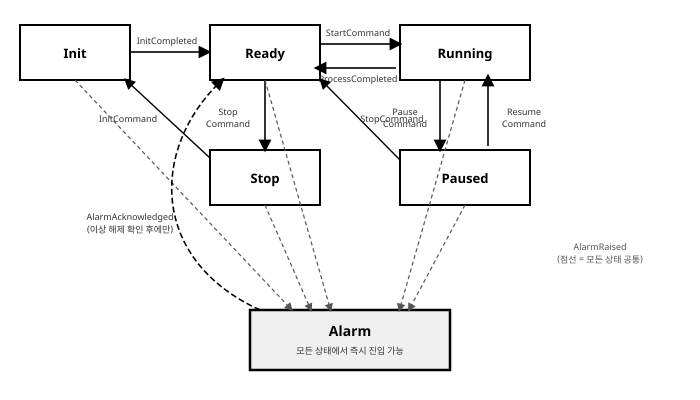
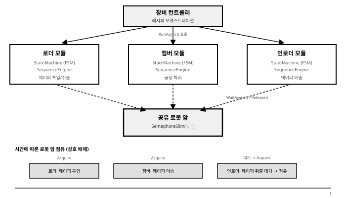

# 5장. 상태 머신(FSM) 및 시퀀스 설계

[◀ 이전: 4장. 모터 및 I/O 제어(Motion & I/O)](ch04-모터및IO제어.md) | [📖 목차](00-목차.md) | [다음: 6장. WPF/MVVM 기반 HMI UI 구축 ▶](ch06-WPFMVVM기반HMIUI구축.md)


3장에서는 장비와 통신하는 방법을, 4장에서는 모터와 I/O를 직접 제어하는 방법을 다뤘다. 하지만 실제 장비 소프트웨어는 "모터를 움직이는 코드"와 "통신 코드"만으로 완성되지 않는다. 그 위에는 반드시 "지금 장비가 어떤 상태이고, 이 이벤트가 들어왔을 때 다음에 무엇을 해야 하는가"를 결정하는 논리 계층이 존재한다. 이 장에서는 이 논리 계층을 견고하게 설계하는 방법 — 상태 머신(FSM)과 시퀀스 엔진 — 을 다룬다.

이 장은 책 전체에서 가장 핵심적인 장이다. 3장과 4장이 "장비와 어떻게 대화하는가"를 다뤘다면, 이 장은 "장비가 무엇을 언제 해야 하는가"를 다룬다. 이후 6장의 HMI는 이 장에서 만든 FSM의 상태를 화면에 표시하고 이벤트를 발생시키는 창구 역할을 하며, 7장의 알람/레시피 관리는 이 장의 Alarm 상태 및 시퀀스 스텝과 직접 연결된다.

## 1. C# 클래스 기반 유한 상태 머신(FSM) 구현

### 1.1 왜 장비 제어 소프트웨어에는 FSM이 필수적인가

산업용 장비의 동작을 사람의 말로 설명해보면 거의 예외 없이 다음과 같은 문장 구조를 띤다.

- "장비가 **Ready** 상태일 때 운전자가 **Start** 버튼을 누르면 **Running** 상태로 전환되고 레시피 실행을 시작한다."
- "**Running** 중에 **일시정지** 명령이 들어오면 **Paused** 상태가 되며, 모터는 현재 위치에서 정지한다."
- "어떤 상태에 있든 **비상정지**가 눌리면 즉시 **Alarm** 상태로 전환되어야 한다."

이 문장들의 공통점은 "특정 상태에서 특정 이벤트가 발생했을 때 다른 상태로 전이한다"는 구조다. 이것이 바로 유한 상태 머신(Finite State Machine, FSM)의 정의 그 자체다. 장비 제어 소프트웨어의 동작이 본질적으로 FSM 구조를 띠기 때문에, 이를 코드로 옮길 때도 FSM이라는 명시적인 모델을 사용하는 것이 자연스럽다.

FSM을 쓰지 않고 장비를 제어하면 어떤 일이 벌어지는가? 초기 개발 단계에서는 `bool isRunning`, `bool isPaused`, `bool hasAlarm` 같은 플래그 여러 개를 조합해서 "지금 상태"를 표현하려는 유혹에 빠지기 쉽다. 하지만 플래그 조합은 상태 공간을 기하급수적으로 늘린다. 플래그가 5개면 이론상 2^5 = 32가지 조합이 가능하지만, 실제로 의미 있는 상태는 6~10개 정도뿐이다. 나머지 20여 가지 조합은 "있어서는 안 되는 상태"인데, 코드 어디에서도 이를 명시적으로 막지 않는다. `isRunning = true`이면서 동시에 `isPaused = true`인 상황이 발생해도 컴파일러는 아무 말도 하지 않는다. 이런 코드는 시간이 지날수록 "이 조합이 실제로 가능한가?"를 아무도 확신할 수 없는 상태가 된다.

FSM으로 명시적으로 모델링하면 이 문제가 근본적으로 사라진다. 장비는 항상 정확히 하나의 상태만 가지며, 상태 전이는 미리 정의된 규칙표를 통해서만 일어난다. "이 상태에서 이 이벤트가 오면 저 상태로 간다"는 규칙이 코드베이스 어딘가에 명확하게 문서화되어 있고, 그 규칙표에 없는 전이는 발생할 수 없다. 이는 장비 소프트웨어처럼 오동작이 곧 장비 파손이나 안전사고로 이어질 수 있는 도메인에서 특히 중요하다.

### 1.2 enum + switch 기반 FSM의 한계

FSM을 구현하는 가장 손쉬운 방법은 상태를 `enum`으로 정의하고 `switch` 문으로 전이 로직을 작성하는 것이다. 작은 장비라면 이 방식으로도 시작할 수 있다.

```csharp
public enum SimpleState
{
    Init,
    Ready,
    Running,
    Alarm
}

public enum SimpleEvent
{
    InitDone,
    Start,
    Stop,
    Fault,
    Reset
}

public class NaiveEquipmentFsm
{
    private SimpleState _state = SimpleState.Init;

    public SimpleState State => _state;

    public void Handle(SimpleEvent evt)
    {
        switch (_state)
        {
            case SimpleState.Init:
                switch (evt)
                {
                    case SimpleEvent.InitDone:
                        _state = SimpleState.Ready;
                        break;
                    case SimpleEvent.Fault:
                        _state = SimpleState.Alarm;
                        break;
                }
                break;

            case SimpleState.Ready:
                switch (evt)
                {
                    case SimpleEvent.Start:
                        _state = SimpleState.Running;
                        break;
                    case SimpleEvent.Fault:
                        _state = SimpleState.Alarm;
                        break;
                }
                break;

            case SimpleState.Running:
                switch (evt)
                {
                    case SimpleEvent.Stop:
                        _state = SimpleState.Ready;
                        break;
                    case SimpleEvent.Fault:
                        _state = SimpleState.Alarm;
                        break;
                }
                break;

            case SimpleState.Alarm:
                switch (evt)
                {
                    case SimpleEvent.Reset:
                        _state = SimpleState.Init;
                        break;
                }
                break;
        }
    }
}
```

상태가 4개뿐인 예제에서는 이 코드가 그럭저럭 읽을 만하다. 하지만 실제 장비는 상태가 6개, 이벤트가 10개를 넘어가는 경우가 흔하고, 여기에 각 상태에 진입/이탈할 때 수행해야 할 부수 작업(모터 정지, 밸브 잠금, 로그 기록, UI 갱신 통지 등)까지 더해지면 이 패턴은 빠르게 무너진다.

이 방식의 구조적인 문제는 다음과 같이 정리할 수 있다.

1. **switch 문이 비대해진다.** 상태 N개 × 이벤트 M개의 조합이 하나의 메서드 안에 중첩된 `switch`로 다 들어가야 한다. 상태가 늘어날 때마다 이 메서드는 선형이 아니라 거의 곱셈으로 커진다.
2. **전이 규칙이 코드 로직 속에 흩어진다.** "Running에서 Alarm으로 갈 수 있는가?"를 확인하려면 `case SimpleState.Running:` 블록을 찾아 그 안의 `case SimpleEvent.Fault:`를 뒤져야 한다. 전체 전이 규칙을 한눈에 파악할 수 있는 곳이 코드 안에 없다.
3. **공통 규칙이 중복된다.** "어떤 상태에서든 Fault가 오면 Alarm으로 간다"는 규칙을 표현하려면 모든 `case` 블록에 `case SimpleEvent.Fault: _state = SimpleState.Alarm; break;`를 반복해서 넣어야 한다. 상태를 하나 추가할 때마다 이 반복을 빠뜨리지 않아야 하는데, 사람이 하는 일이라 결국 언젠가는 빠뜨린다.
4. **진입/이탈 동작을 넣을 자리가 없다.** "Running에 진입할 때 타이머를 시작한다"와 같은 로직을 넣으려면 `_state = SimpleState.Running;` 대입문 주변에 임기응변으로 코드를 끼워 넣게 되고, 이런 코드가 여러 곳에 중복되기 쉽다.
5. **테스트하기 어렵다.** 개별 상태의 동작만 따로 단위 테스트하고 싶어도, 거대한 `switch` 문 전체를 대상으로 테스트를 작성할 수밖에 없다.

이런 한계 때문에 실무에서는 상태가 5개를 넘어가는 순간부터 **State 패턴**으로 옮겨가는 것이 일반적이다.

### 1.3 State 패턴 기반 FSM 프레임워크 설계

State 패턴의 핵심 아이디어는 단순하다. "상태"를 `enum` 값이 아니라 **하나의 클래스(객체)**로 표현하고, 그 상태에서 일어나는 모든 동작(진입, 이탈, 이벤트 처리)을 그 클래스 안에 캡슐화한다. `switch` 문으로 흩어져 있던 로직이 각 상태 클래스로 응집되면서, 상태를 추가하는 작업이 "새 클래스를 하나 추가하는 것"으로 단순해진다.

이 절에서는 재사용 가능한 FSM 프레임워크를 처음부터 설계한다. 상태와 이벤트를 `enum`으로 받는 제네릭 구조로 만들어서, 5.2절의 장비 표준 상태뿐 아니라 3절에서 다룰 모듈별 FSM에도 그대로 재사용할 수 있게 한다.

먼저 상태 하나의 행동을 정의하는 인터페이스를 만든다.

```csharp
using System;

namespace EquipmentControl.Fsm
{
    /// <summary>
    /// 하나의 상태가 가져야 할 행동을 정의하는 인터페이스.
    /// TState, TEvent는 각각 상태와 이벤트를 표현하는 enum 타입이다.
    /// </summary>
    public interface IState<TState, TEvent>
        where TState : struct, Enum
        where TEvent : struct, Enum
    {
        /// <summary>이 상태 객체가 대표하는 상태 값.</summary>
        TState Id { get; }

        /// <summary>이 상태로 진입할 때 정확히 1회 호출된다.</summary>
        void OnEnter(StateMachine<TState, TEvent> machine, TState previous, TEvent trigger);

        /// <summary>이 상태를 벗어날 때 정확히 1회 호출된다.</summary>
        void OnExit(StateMachine<TState, TEvent> machine, TState next);

        /// <summary>
        /// 이 상태에서 이벤트를 처리한다.
        /// 전이가 필요하면 대상 상태를 반환하고, 이 이벤트를 무시하려면 null을 반환한다.
        /// </summary>
        TState? HandleEvent(StateMachine<TState, TEvent> machine, TEvent evt);
    }
}
```

`OnEnter`/`OnExit`은 각 상태가 진입·이탈 시 수행해야 할 부수 작업(모터 정지, 밸브 제어, 타이머 시작/정지 등)을 담는 자리이고, `HandleEvent`는 "이 이벤트를 받으면 어떤 상태로 가고 싶은가"를 상태 스스로 결정하게 한다. 중요한 설계 포인트는, `HandleEvent`가 **직접 상태를 바꾸지 않고 "가고 싶은 상태"만 반환**한다는 것이다. 실제 전이의 승인과 실행은 다음에 만들 `StateMachine` 엔진이 전담한다. 이렇게 책임을 분리해야 "이 전이가 실제로 허용된 것인지"를 한곳에서 검증할 수 있다.

다음으로 상태 머신 엔진 자체를 작성한다. 이 엔진은 (1) 현재 상태를 보관하고, (2) 상태가 요청한 전이를 **명시적 전이 테이블**과 대조해 검증하며, (3) 검증을 통과하면 `OnExit` → 상태 전환 → `OnEnter` 순서로 실행하고, (4) 전이가 일어날 때마다 이벤트를 발행해 로깅 등 외부 관찰자가 훅을 걸 수 있게 한다.

```csharp
using System;
using System.Collections.Generic;

namespace EquipmentControl.Fsm
{
    /// <summary>
    /// State 패턴 기반의 범용 유한 상태 머신 엔진.
    /// 상태 객체 목록과 명시적 전이 테이블을 받아 구성하며,
    /// 전이 테이블에 없는 전이는 예외를 던져 차단한다.
    /// </summary>
    public sealed class StateMachine<TState, TEvent>
        where TState : struct, Enum
        where TEvent : struct, Enum
    {
        private readonly Dictionary<TState, IState<TState, TEvent>> _states;
        private readonly HashSet<(TState From, TEvent Evt, TState To)> _transitionTable;
        private readonly object _sync = new();

        /// <summary>현재 상태 값.</summary>
        public TState Current { get; private set; }

        /// <summary>상태가 실제로 전이될 때마다 발생한다. (이전 상태, 다음 상태, 트리거 이벤트)</summary>
        public event Action<TState, TState, TEvent>? StateChanged;

        public StateMachine(
            IEnumerable<IState<TState, TEvent>> states,
            IEnumerable<(TState From, TEvent Evt, TState To)> transitionTable,
            TState initial)
        {
            _states = new Dictionary<TState, IState<TState, TEvent>>();
            foreach (var state in states)
            {
                _states[state.Id] = state;
            }

            _transitionTable = new HashSet<(TState, TEvent, TState)>(transitionTable);
            Current = initial;
        }

        /// <summary>초기 상태의 OnEnter를 호출해 머신을 가동한다.</summary>
        public void Start(TEvent startupTrigger)
        {
            _states[Current].OnEnter(this, Current, startupTrigger);
        }

        /// <summary>
        /// 이벤트를 현재 상태에 전달한다.
        /// 전이가 발생하면 true, 현재 상태가 이벤트를 무시하면 false를 반환한다.
        /// 전이 테이블에 정의되지 않은 전이를 상태가 요청하면 예외를 던진다.
        /// </summary>
        public bool Fire(TEvent evt)
        {
            lock (_sync)
            {
                IState<TState, TEvent> currentState = _states[Current];
                TState? requested = currentState.HandleEvent(this, evt);
                if (requested is null)
                {
                    return false;
                }

                TState target = requested.Value;

                if (!_transitionTable.Contains((Current, evt, target)))
                {
                    throw new InvalidOperationException(
                        $"허용되지 않은 상태 전이 시도: {Current} --[{evt}]--> {target}. " +
                        "전이 테이블을 확인하십시오.");
                }

                TState previous = Current;
                currentState.OnExit(this, target);

                Current = target;
                _states[target].OnEnter(this, previous, evt);

                StateChanged?.Invoke(previous, target, evt);
                return true;
            }
        }

        /// <summary>등록된 상태 객체를 조회한다. 상태별 부가 정보 접근 등에 사용한다.</summary>
        public IState<TState, TEvent> GetState(TState id) => _states[id];
    }
}
```

여기서 눈여겨볼 설계 결정 두 가지가 있다.

첫째, **전이 테이블을 상태 클래스와 별도로 명시한다.** `HashSet<(TState, TEvent, TState)>` 형태의 전이 테이블은 "이 FSM에서 허용되는 모든 전이"를 한 곳에 나열한 목록이다. 이 목록은 코드 리뷰 시 통째로 읽을 수 있고, 문서의 전이표와 1:1로 대조할 수 있다. 상태 클래스의 `HandleEvent`가 논리적으로 "이 이벤트를 받으면 Alarm으로 가고 싶다"고 판단하더라도, 전이 테이블에 그 조합이 없으면 `StateMachine`이 예외를 던져 막는다. 이는 이중 방어선이다 — 상태 클래스 코드에 버그가 있어 잘못된 전이를 요청하더라도, 테이블이 최종 방어선 역할을 한다.

둘째, `Fire` 메서드를 `lock`으로 보호했다. 장비 제어 소프트웨어에서는 여러 스레드(통신 수신 스레드, UI 스레드, 타이머 콜백 등)가 동시에 이벤트를 발생시킬 수 있으므로, 상태 전이 자체는 반드시 직렬화되어야 한다. 이는 2장에서 다룬 스레드 안전성 원칙을 FSM 엔진에도 그대로 적용한 것이다.

### 1.4 상태 전이 로깅 자동화

`StateChanged` 이벤트를 활용하면 상태 전이가 일어날 때마다 자동으로 로그를 남길 수 있다. 7장에서 구조화된 로깅 시스템을 본격적으로 다루겠지만, 여기서는 `StateMachine`을 생성한 직후 로깅 훅을 붙이는 방법만 미리 보여준다.

```csharp
public static StateMachine<TState, TEvent> AttachTransitionLogger<TState, TEvent>(
    this StateMachine<TState, TEvent> machine,
    Microsoft.Extensions.Logging.ILogger logger)
    where TState : struct, Enum
    where TEvent : struct, Enum
{
    machine.StateChanged += (from, to, evt) =>
    {
        logger.LogInformation(
            "상태 전이: {From} --[{Event}]--> {To} (시각: {Time:O})",
            from, to, evt, DateTimeOffset.Now);
    };
    return machine;
}
```

이렇게 확장 메서드로 만들어두면, FSM을 조립하는 지점에서 다음과 같이 한 줄로 로깅을 연결할 수 있다.

```csharp
var machine = new StateMachine<EquipmentState, EquipmentEvent>(states, transitions, EquipmentState.Init)
    .AttachTransitionLogger(logger);
```

상태 전이 로그는 장비 문제를 사후 분석할 때 가장 먼저 확인하는 자료다. "언제 Alarm에 들어갔고, 언제 Ready로 복귀했는가"를 시간순으로 재구성할 수 있어야 하므로, 이 로그는 반드시 타임스탬프와 함께 영속 저장소(파일 또는 DB)에 남겨야 한다. 이 부분은 7장의 데이터 관리에서 로그 파일 로테이션, 구조화 로깅(Serilog 등)과 함께 더 깊이 다룬다.

## 2. 장비 표준 상태 관리(Init, Ready, Running, Pause, Alarm, Stop)

### 2.1 표준 상태 집합의 유래와 의미

반도체·디스플레이 장비 업계에서는 SEMI(Semiconductor Equipment and Materials International) 표준, 특히 SEMI E10(장비 신뢰성·가동률 관리 표준), SEMI E30(GEM, Generic Equipment Model), SEMI E58(FA/자동화 인터페이스 표준) 등에서 장비의 상태를 표준화된 개념으로 정의한다. 회사마다, 장비마다 세부 명칭과 상태 개수는 조금씩 다르지만, 실무에서 가장 널리 쓰이는 최소 공통 집합은 다음 6가지로 정리할 수 있다.

| 상태 | 의미 | 비고 |
|---|---|---|
| **Init** | 전원 인가 직후 또는 재기동 시, 초기화·자기진단·원점 복귀(Homing)를 수행하는 상태 | 이 상태를 벗어나기 전까지는 어떤 공정 명령도 받지 않는다 |
| **Ready** | 초기화가 끝나고 언제든 공정을 시작할 수 있는 대기 상태 | SEMI에서 Idle/Standby로도 불림 |
| **Running** | 레시피에 따라 실제 공정(모터 구동, 웨이퍼 처리 등)을 수행 중인 상태 | SEMI E10의 Productive에 대응 |
| **Paused** | Running 도중 운전자 또는 상위 시스템의 요청으로 일시 정지된 상태 | 공정을 재개(Resume)하거나 중단(Stop)할 수 있음 |
| **Alarm** | 하드웨어 이상, 안전 인터록 동작, 통신 두절 등 비정상 상황이 감지된 상태 | 5.2.4절에서 별도로 상세히 다룸 |
| **Stop** | 장비가 의도적으로 정지·다운된 상태(전원 차단 전 단계, 정비 등) | SEMI E10의 Scheduled/Unscheduled Downtime에 대응 |

이 표준 상태 집합을 사용하는 이유는 단순한 관례를 넘어선다. 상위 시스템(MES, SECS/GEM 등, 8장에서 다룸)과 통신할 때 장비의 상태를 이 표준 어휘로 보고해야 상호 운용이 가능하고, 여러 장비/여러 라인에서 동일한 상태 모델을 재사용할 수 있어 유지보수 비용이 줄어든다.

### 2.2 상태별 허용 전이와 금지 전이

아래 표는 이 장비의 전체 전이 규칙을 명시한 것이다. 이 표가 곧 앞서 만든 `StateMachine`의 전이 테이블 그 자체가 된다.

| From (현재 상태) | Event (이벤트) | To (다음 상태) | 비고 |
|---|---|---|---|
| Init | InitCompleted | Ready | 자기진단·Homing 성공 시 |
| Ready | StartCommand | Running | 레시피 로드 완료 및 시작 조건 충족 시 |
| Running | ProcessCompleted | Ready | 레시피 정상 종료 |
| Running | PauseCommand | Paused | 현재 위치에서 모터 정지 |
| Paused | ResumeCommand | Running | 정지 지점부터 재개 |
| Paused | StopCommand | Ready | 안전 정지 절차 수행 후 대기 상태로 복귀 |
| Ready | StopCommand | Stop | 장비 전체 다운(정비, 종료 등) |
| Stop | InitCommand | Init | 재기동 |
| **모든 상태** (Alarm 제외) | AlarmRaised | Alarm | 예외적으로 즉시 전이, 2.4절 참조 |
| Alarm | AlarmAcknowledged | Ready | 물리적 이상 해제가 확인된 경우에만, 2.4절 참조 |

명시적으로 **금지**해야 하는 전이도 표로 정리해두면 설계 리뷰 때 유용하다.

| From | To | 왜 금지해야 하는가 |
|---|---|---|
| Running | Init | 공정 도중 초기화 절차로 바로 뛰어들면 안전하지 않다. 반드시 Ready를 거쳐야 한다 |
| Paused | Stop | 일시정지 상태에서 곧바로 다운시키면 미완료 공정 정리가 누락될 수 있다. Ready를 거쳐야 한다 |
| Alarm | Running | 알람 원인이 해소되었는지 검증 없이 곧바로 공정을 재개하는 것은 가장 위험한 패턴이다. 반드시 Ready를 거쳐 새로 Start해야 한다 |
| Init | Running | 초기화가 끝나지 않은 상태에서 공정을 시작할 수 없다 |

이 그림은 위 표를 시각적으로 정리한 것이다.



### 2.3 표준 상태 집합의 FSM 구현

이제 1.3절의 프레임워크로 이 표준 상태 집합을 실제로 구현한다. 먼저 상태와 이벤트를 `enum`으로 정의한다.

```csharp
namespace EquipmentControl.Fsm.Equipment
{
    public enum EquipmentState
    {
        Init,
        Ready,
        Running,
        Paused,
        Alarm,
        Stop
    }

    public enum EquipmentEvent
    {
        InitCommand,
        InitCompleted,
        StartCommand,
        ProcessCompleted,
        PauseCommand,
        ResumeCommand,
        StopCommand,
        AlarmRaised,
        AlarmAcknowledged
    }
}
```

다음으로, "AlarmRaised는 어느 상태에서든 최우선으로 처리한다"는 공통 규칙을 매 상태 클래스마다 중복 작성하지 않도록 추상 기반 클래스를 만든다. 이것이 1.2절에서 지적한 "공통 규칙 중복" 문제에 대한 State 패턴 쪽의 해법이다.

```csharp
namespace EquipmentControl.Fsm.Equipment
{
    public abstract class EquipmentStateBase : IState<EquipmentState, EquipmentEvent>
    {
        public abstract EquipmentState Id { get; }

        public virtual void OnEnter(
            StateMachine<EquipmentState, EquipmentEvent> machine,
            EquipmentState previous,
            EquipmentEvent trigger)
        { }

        public virtual void OnExit(
            StateMachine<EquipmentState, EquipmentEvent> machine,
            EquipmentState next)
        { }

        public EquipmentState? HandleEvent(
            StateMachine<EquipmentState, EquipmentEvent> machine,
            EquipmentEvent evt)
        {
            // 알람은 모든 상태에서 공통으로 최우선 처리한다.
            // 개별 상태 클래스는 이 규칙을 중복 작성할 필요가 없다.
            if (evt == EquipmentEvent.AlarmRaised)
            {
                return EquipmentState.Alarm;
            }

            return HandleStateEvent(machine, evt);
        }

        /// <summary>알람을 제외한, 이 상태 고유의 이벤트 처리 로직.</summary>
        protected abstract EquipmentState? HandleStateEvent(
            StateMachine<EquipmentState, EquipmentEvent> machine,
            EquipmentEvent evt);
    }
}
```

이제 개별 상태 클래스를 작성한다. 각 클래스는 오직 자신의 상태에서 일어나는 일에만 집중하면 된다.

```csharp
public sealed class InitState : EquipmentStateBase
{
    private readonly IMotionController _motion;
    private readonly ILogger _logger;

    public InitState(IMotionController motion, ILogger logger)
    {
        _motion = motion;
        _logger = logger;
    }

    public override EquipmentState Id => EquipmentState.Init;

    public override void OnEnter(
        StateMachine<EquipmentState, EquipmentEvent> machine,
        EquipmentState previous, EquipmentEvent trigger)
    {
        _logger.LogInformation("Init 상태 진입: 자기진단 및 Homing 시작");
        // 실제로는 여기서 비동기 초기화 시퀀스를 트리거하고,
        // 완료되면 machine.Fire(EquipmentEvent.InitCompleted)를 호출한다.
        // (구체적인 시퀀스 구성은 5.3절 참조)
    }

    protected override EquipmentState? HandleStateEvent(
        StateMachine<EquipmentState, EquipmentEvent> machine, EquipmentEvent evt)
    {
        return evt switch
        {
            EquipmentEvent.InitCompleted => EquipmentState.Ready,
            _ => null
        };
    }
}

public sealed class ReadyState : EquipmentStateBase
{
    public override EquipmentState Id => EquipmentState.Ready;

    protected override EquipmentState? HandleStateEvent(
        StateMachine<EquipmentState, EquipmentEvent> machine, EquipmentEvent evt)
    {
        return evt switch
        {
            EquipmentEvent.StartCommand => EquipmentState.Running,
            EquipmentEvent.StopCommand => EquipmentState.Stop,
            _ => null
        };
    }
}

public sealed class RunningState : EquipmentStateBase
{
    private readonly IMotionController _motion;

    public RunningState(IMotionController motion)
    {
        _motion = motion;
    }

    public override EquipmentState Id => EquipmentState.Running;

    public override void OnExit(
        StateMachine<EquipmentState, EquipmentEvent> machine, EquipmentState next)
    {
        // Paused나 Alarm으로 나가는 모든 경로에서 공통으로
        // 모터를 안전하게 감속 정지시킨다.
        _motion.StopAllAxes();
    }

    protected override EquipmentState? HandleStateEvent(
        StateMachine<EquipmentState, EquipmentEvent> machine, EquipmentEvent evt)
    {
        return evt switch
        {
            EquipmentEvent.ProcessCompleted => EquipmentState.Ready,
            EquipmentEvent.PauseCommand => EquipmentState.Paused,
            _ => null
        };
    }
}

public sealed class PausedState : EquipmentStateBase
{
    public override EquipmentState Id => EquipmentState.Paused;

    protected override EquipmentState? HandleStateEvent(
        StateMachine<EquipmentState, EquipmentEvent> machine, EquipmentEvent evt)
    {
        return evt switch
        {
            EquipmentEvent.ResumeCommand => EquipmentState.Running,
            EquipmentEvent.StopCommand => EquipmentState.Ready,
            _ => null
        };
    }
}

public sealed class StopState : EquipmentStateBase
{
    public override EquipmentState Id => EquipmentState.Stop;

    protected override EquipmentState? HandleStateEvent(
        StateMachine<EquipmentState, EquipmentEvent> machine, EquipmentEvent evt)
    {
        return evt switch
        {
            EquipmentEvent.InitCommand => EquipmentState.Init,
            _ => null
        };
    }
}
```

`RunningState.OnExit`에서 `_motion.StopAllAxes()`를 호출하는 부분을 눈여겨보라. 이 코드는 Running에서 Paused로 나가는 정상 경로뿐 아니라, Running 중 알람이 발생해 Alarm으로 강제 전이되는 경로에서도 **똑같이 호출된다.** `OnExit`을 상태 클래스에 고정해두면 "어떤 이유로 이 상태를 떠나든 반드시 실행되어야 하는 안전 동작"을 한 곳에 모아둘 수 있다는 것이 State 패턴의 실질적인 이득이다.

마지막으로 Alarm 상태는 2.4절에서 별도로 다룬다. 모든 상태 객체와 전이 테이블을 조립하는 코드는 다음과 같다.

```csharp
public static class EquipmentFsmFactory
{
    public static StateMachine<EquipmentState, EquipmentEvent> Create(
        IMotionController motion, IAlarmService alarmService, ILogger logger)
    {
        var states = new IState<EquipmentState, EquipmentEvent>[]
        {
            new InitState(motion, logger),
            new ReadyState(),
            new RunningState(motion),
            new PausedState(),
            new AlarmState(alarmService, logger),
            new StopState(),
        };

        var transitions = new List<(EquipmentState, EquipmentEvent, EquipmentState)>
        {
            (EquipmentState.Init,    EquipmentEvent.InitCompleted,      EquipmentState.Ready),
            (EquipmentState.Ready,   EquipmentEvent.StartCommand,       EquipmentState.Running),
            (EquipmentState.Running, EquipmentEvent.ProcessCompleted,   EquipmentState.Ready),
            (EquipmentState.Running, EquipmentEvent.PauseCommand,       EquipmentState.Paused),
            (EquipmentState.Paused,  EquipmentEvent.ResumeCommand,      EquipmentState.Running),
            (EquipmentState.Paused,  EquipmentEvent.StopCommand,        EquipmentState.Ready),
            (EquipmentState.Ready,   EquipmentEvent.StopCommand,        EquipmentState.Stop),
            (EquipmentState.Stop,    EquipmentEvent.InitCommand,        EquipmentState.Init),
            (EquipmentState.Alarm,   EquipmentEvent.AlarmAcknowledged,  EquipmentState.Ready),
        };

        // "모든 상태(Alarm 제외) --AlarmRaised--> Alarm"은 상태 개수만큼 반복해서
        // 손으로 적는 대신 코드로 생성한다. 상태를 추가해도 이 규칙은 자동으로 따라온다.
        foreach (EquipmentState state in Enum.GetValues<EquipmentState>())
        {
            if (state != EquipmentState.Alarm)
            {
                transitions.Add((state, EquipmentEvent.AlarmRaised, EquipmentState.Alarm));
            }
        }

        var machine = new StateMachine<EquipmentState, EquipmentEvent>(
            states, transitions, initial: EquipmentState.Init);

        machine.AttachTransitionLogger(logger);
        return machine;
    }
}
```

`foreach`로 알람 전이를 자동 생성하는 부분은 실용적인 요령이다. 상태를 하나 추가하면 이 코드가 자동으로 그 상태에서 Alarm으로 가는 전이를 테이블에 넣어주므로, "새 상태를 추가했는데 알람 전이를 깜빡했다"는 실수를 원천적으로 방지한다.

### 2.4 Alarm 상태의 특별한 설계 원칙

Alarm 상태는 이 FSM에서 유일하게 비대칭적인 규칙을 갖는다.

**원칙 1: Alarm으로 들어가는 문은 모든 상태에서 항상 열려 있어야 한다.** 장비가 Init 중이든, 공정을 Running 중이든, 심지어 이미 Paused 상태든, 안전과 관련된 이상이 감지되면 예외 없이 즉시 Alarm으로 전이할 수 있어야 한다. 2.3절 코드에서 `EquipmentStateBase.HandleEvent`가 `AlarmRaised`를 상태별 로직보다 먼저 가로채서 처리하는 것이 바로 이 원칙을 코드로 강제한 것이다. 만약 이 처리를 각 상태 클래스에 맡겨 두었다면, 새로운 상태를 추가하는 개발자가 이 규칙을 빠뜨릴 위험이 상존한다.

**원칙 2: Alarm에서 벗어나는 문은 사용자의 명시적 확인(Acknowledge)이 있어야만 열린다.** 이것이 Alarm 상태를 다른 상태와 근본적으로 다르게 만드는 지점이다. 알람 원인이 물리적으로 해소되었다고 해서(예: 인터록 도어가 다시 닫혔다고 해서) 소프트웨어가 자동으로 Ready로 복귀해서는 안 된다. 반드시 운전자가 알람 내용을 인지했다는 것을 `AlarmAcknowledged` 이벤트로 명시적으로 알려야 한다. 이는 안전 규정에서 흔히 요구하는 사항이기도 하다 — 자동 복구는 "무엇이 문제였는지 아무도 확인하지 않은 채 장비가 다시 움직이기 시작하는" 상황을 만들 수 있기 때문이다.

더 나아가서, `AlarmAcknowledged`를 받았다고 무조건 Ready로 보내서도 안 된다. 알람의 **물리적 원인이 실제로 해소되었는지**를 검증해야 한다. 다음 `AlarmState` 구현은 이 두 조건(사용자 확인 + 물리적 해소 확인)을 모두 검사한다.

```csharp
public sealed class AlarmState : EquipmentStateBase
{
    private readonly IAlarmService _alarmService;
    private readonly ILogger _logger;

    public AlarmState(IAlarmService alarmService, ILogger logger)
    {
        _alarmService = alarmService;
        _logger = logger;
    }

    public override EquipmentState Id => EquipmentState.Alarm;

    public override void OnEnter(
        StateMachine<EquipmentState, EquipmentEvent> machine,
        EquipmentState previous, EquipmentEvent trigger)
    {
        _logger.LogError(
            "Alarm 상태 진입 (이전 상태: {Previous}). 활성 알람 목록: {Alarms}",
            previous, string.Join(", ", _alarmService.GetActiveAlarmCodes()));
    }

    protected override EquipmentState? HandleStateEvent(
        StateMachine<EquipmentState, EquipmentEvent> machine, EquipmentEvent evt)
    {
        if (evt != EquipmentEvent.AlarmAcknowledged)
        {
            return null;
        }

        // 사용자가 확인 버튼을 눌렀더라도, 알람의 물리적 원인이
        // 실제로 해소되지 않았다면 Ready로 보내지 않는다.
        if (_alarmService.HasUnclearedCriticalAlarm())
        {
            _logger.LogWarning(
                "AlarmAcknowledged를 받았으나 해제되지 않은 알람이 남아 있어 Ready로 전이하지 않음: {Alarms}",
                string.Join(", ", _alarmService.GetActiveAlarmCodes()));
            return null; // Alarm 상태에 머문다.
        }

        return EquipmentState.Ready;
    }
}
```

`IAlarmService`는 활성 알람 목록을 관리하고 각 알람이 "해제 가능한 상태인지"를 판단하는 서비스로, 7장에서 알람 코드 체계·심각도 등급·알람 이력 저장과 함께 완전한 형태로 구현한다. 여기서는 FSM이 알람 서비스에 물리적 해소 여부를 **질의**하고, 그 결과에 따라 전이 여부를 결정한다는 상호작용 패턴만 기억해두면 충분하다.

## 3. 복잡한 모듈별 시퀀스 엔진 설계 및 비동기 파이프라인

### 3.1 하나의 장비, 여러 개의 모듈

지금까지는 장비 전체를 하나의 FSM으로 다뤘다. 그러나 실제 장비, 특히 반도체·디스플레이 공정 장비는 내부적으로 여러 개의 독립된 모듈로 구성되는 경우가 대부분이다. 전형적인 구성은 다음과 같다.

- **로더(Loader) 모듈**: 카세트/FOUP에서 웨이퍼(또는 기판)를 꺼내 장비 내부로 투입한다.
- **챔버(Chamber) 모듈**: 실제 공정(증착, 식각, 세정 등)이 일어나는 곳이다.
- **언로더(Unloader) 모듈**: 공정이 끝난 웨이퍼를 다시 카세트로 반출한다.

각 모듈은 자신만의 상태와 시퀀스를 가진다. 예를 들어 챔버 모듈은 "도어 닫힘 확인 → 진공 배기 → 가스 주입 → 공정 → 가스 배기 → 도어 열림" 같은 자신만의 절차를 갖는다. 이 세 모듈은 2절의 FSM 프레임워크를 그대로 사용해 각자 독립적인 `StateMachine<ModuleState, ModuleEvent>` 인스턴스를 가질 수 있다.

문제는 이 모듈들이 완전히 독립적이지 않다는 데 있다. 로더가 웨이퍼를 챔버로 옮기려면 물리적인 로봇 암이 필요한데, 이 로봇 암을 로더와 언로더가 공유하는 경우가 많다. 즉, 모듈 각각은 독립된 FSM/시퀀스를 가지면서도, 특정 시점에는 서로 자원을 놓고 조율해야 한다. 이 절에서는 먼저 각 모듈의 절차를 표현하는 **시퀀스 엔진**을 설계하고, 이어서 모듈 간 자원 조율 문제를 다룬다.

### 3.2 시퀀스를 데이터로 표현하기: Step 리스트와 시퀀스 엔진

시퀀스를 코드로 직접 하드코딩하면(예: 하나의 거대한 `async Task RunRecipeAsync()` 메서드 안에 `await`를 수십 번 나열) 다음과 같은 문제가 생긴다. 실패 시 재시도 정책을 스텝마다 다르게 주기 어렵고, 스텝 목록을 로그로 남기거나 UI에 진행 상황으로 표시하기 어려우며, 스텝 순서를 레시피 데이터로부터 동적으로 구성할 수 없다.

이 문제를 해결하는 실전 패턴은 **시퀀스를 "스텝(Step)의 리스트"라는 데이터로 표현**하고, 이를 실행하는 공통 엔진을 만드는 것이다. 각 스텝은 `Func<CancellationToken, Task<StepResult>>` 형태의 비동기 델리게이트로 표현한다. 이렇게 하면 스텝 하나하나가 "이름을 가진, 재시도 정책을 가진, 독립적으로 테스트 가능한 단위"가 된다.

먼저 스텝의 실행 결과를 표현하는 타입을 정의한다.

```csharp
namespace EquipmentControl.Sequencing
{
    public enum StepOutcome
    {
        Success,
        Failed
    }

    public sealed class StepResult
    {
        public StepOutcome Outcome { get; }
        public string? Message { get; }
        public Exception? Error { get; }

        private StepResult(StepOutcome outcome, string? message, Exception? error)
        {
            Outcome = outcome;
            Message = message;
            Error = error;
        }

        public static StepResult Ok(string? message = null) =>
            new(StepOutcome.Success, message, null);

        public static StepResult Fail(string message, Exception? error = null) =>
            new(StepOutcome.Failed, message, error);
    }
}
```

다음으로 스텝 하나를 표현하는 `SequenceStep`을 정의한다. 실패 시 정책(재시도/건너뛰기/중단)과 타임아웃을 스텝별로 지정할 수 있게 한다.

```csharp
namespace EquipmentControl.Sequencing
{
    public enum StepFailurePolicy
    {
        /// <summary>재시도 없이 즉시 시퀀스 전체를 중단한다. 기본값.</summary>
        Abort,

        /// <summary>MaxRetryCount만큼 재시도한 뒤에도 실패하면 시퀀스를 중단한다.</summary>
        Retry,

        /// <summary>실패해도 이 스텝을 건너뛰고 다음 스텝으로 진행한다.</summary>
        Skip
    }

    public sealed class SequenceStep
    {
        public string Name { get; }
        public Func<CancellationToken, Task<StepResult>> Action { get; }
        public StepFailurePolicy FailurePolicy { get; init; } = StepFailurePolicy.Abort;
        public int MaxRetryCount { get; init; } = 0;
        public TimeSpan RetryDelay { get; init; } = TimeSpan.FromMilliseconds(500);
        public TimeSpan Timeout { get; init; } = TimeSpan.FromSeconds(30);

        public SequenceStep(string name, Func<CancellationToken, Task<StepResult>> action)
        {
            Name = name;
            Action = action;
        }
    }
}
```

이제 이 스텝 목록을 순차적으로 실행하는 `SequenceEngine`을 작성한다. 스텝마다 타임아웃을 걸고, 예외를 잡아 `StepResult.Fail`로 변환하며, 실패 정책에 따라 재시도·건너뛰기·중단을 처리한다.

```csharp
using Microsoft.Extensions.Logging;

namespace EquipmentControl.Sequencing
{
    public sealed class SequenceEngine
    {
        private readonly ILogger _logger;

        public SequenceEngine(ILogger logger)
        {
            _logger = logger;
        }

        /// <summary>
        /// 스텝 목록을 순서대로 실행한다.
        /// 모든 스텝이 성공(또는 정책에 의해 건너뜀)하면 true를 반환하고,
        /// Abort 정책의 스텝이 실패하면 즉시 false를 반환한다.
        /// </summary>
        public async Task<bool> RunAsync(
            string sequenceName, IReadOnlyList<SequenceStep> steps, CancellationToken ct)
        {
            _logger.LogInformation("시퀀스 시작: {Sequence} (총 {Count}개 스텝)", sequenceName, steps.Count);

            foreach (var step in steps)
            {
                ct.ThrowIfCancellationRequested();

                bool shouldAbort = await RunSingleStepWithPolicyAsync(sequenceName, step, ct)
                    .ConfigureAwait(false);

                if (shouldAbort)
                {
                    _logger.LogError("시퀀스 중단: {Sequence} (스텝: {Step})", sequenceName, step.Name);
                    return false;
                }
            }

            _logger.LogInformation("시퀀스 완료: {Sequence}", sequenceName);
            return true;
        }

        /// <summary>true를 반환하면 시퀀스 전체를 중단해야 한다는 뜻이다.</summary>
        private async Task<bool> RunSingleStepWithPolicyAsync(
            string sequenceName, SequenceStep step, CancellationToken ct)
        {
            int attempt = 0;
            while (true)
            {
                attempt++;
                StepResult result = await ExecuteOnceAsync(sequenceName, step, attempt, ct)
                    .ConfigureAwait(false);

                if (result.Outcome == StepOutcome.Success)
                {
                    return false; // 중단 아님, 다음 스텝으로 진행
                }

                bool canRetry = step.FailurePolicy == StepFailurePolicy.Retry
                                 && attempt <= step.MaxRetryCount;
                if (canRetry)
                {
                    _logger.LogWarning(
                        "[{Sequence}] {Step} 재시도 대기 중 ({Attempt}/{Max})",
                        sequenceName, step.Name, attempt, step.MaxRetryCount);
                    await Task.Delay(step.RetryDelay, ct).ConfigureAwait(false);
                    continue;
                }

                if (step.FailurePolicy == StepFailurePolicy.Skip)
                {
                    _logger.LogWarning(
                        "[{Sequence}] {Step} 실패했으나 정책에 따라 건너뜀: {Message}",
                        sequenceName, step.Name, result.Message);
                    return false; // 중단 아님, 건너뛰고 진행
                }

                // Abort 정책이거나 재시도 횟수를 다 소진한 경우
                return true;
            }
        }

        private async Task<StepResult> ExecuteOnceAsync(
            string sequenceName, SequenceStep step, int attempt, CancellationToken ct)
        {
            using var timeoutCts = CancellationTokenSource.CreateLinkedTokenSource(ct);
            timeoutCts.CancelAfter(step.Timeout);

            try
            {
                _logger.LogInformation(
                    "[{Sequence}] 스텝 시작: {Step} (시도 {Attempt})", sequenceName, step.Name, attempt);

                StepResult result = await step.Action(timeoutCts.Token).ConfigureAwait(false);

                if (result.Outcome == StepOutcome.Success)
                {
                    _logger.LogInformation("[{Sequence}] 스텝 성공: {Step}", sequenceName, step.Name);
                }
                else
                {
                    _logger.LogWarning(
                        "[{Sequence}] 스텝 실패: {Step} - {Message}",
                        sequenceName, step.Name, result.Message);
                }

                return result;
            }
            catch (OperationCanceledException) when (!ct.IsCancellationRequested)
            {
                // 상위 토큰이 아니라 타임아웃 토큰이 취소를 유발한 경우
                return StepResult.Fail($"{step.Name} 타임아웃 ({step.Timeout.TotalSeconds:F0}초 초과)");
            }
            catch (Exception ex)
            {
                return StepResult.Fail($"{step.Name} 예외 발생: {ex.Message}", ex);
            }
        }
    }
}
```

`ExecuteOnceAsync`에서 `CancellationTokenSource.CreateLinkedTokenSource`로 상위 취소 토큰과 스텝별 타임아웃을 결합하는 부분은 2장에서 다룬 취소 토큰 연쇄 패턴을 그대로 적용한 것이다. 상위에서 시퀀스 전체를 취소하면(`ct`가 취소됨) `OperationCanceledException`이 `ct.IsCancellationRequested == true`인 채로 전파되므로, `when` 절이 이를 걸러내지 않고 그대로 위로 올려보낸다. 반대로 스텝 자체의 타임아웃만 걸린 경우에는 `ct.IsCancellationRequested`가 `false`이므로 이를 "실패"로 변환해 정책(재시도 등)을 적용할 수 있게 한다.

### 3.3 챔버 모듈 시퀀스 작성 예제

이제 이 엔진으로 챔버 모듈의 공정 시퀀스를 실제로 구성해본다. 각 스텝은 4장에서 만든 모터/I/O 제어 API와 3장의 통신 API를 호출한다.

```csharp
public static class ChamberSequences
{
    public static List<SequenceStep> BuildProcessSequence(
        IChamberIo io, IMotionController motion, RecipeParameters recipe)
    {
        return new List<SequenceStep>
        {
            new SequenceStep("도어 닫힘 확인", async ct =>
            {
                bool closed = await io.WaitDoorClosedAsync(ct).ConfigureAwait(false);
                return closed
                    ? StepResult.Ok()
                    : StepResult.Fail("챔버 도어가 닫히지 않았습니다.");
            })
            {
                Timeout = TimeSpan.FromSeconds(10),
                FailurePolicy = StepFailurePolicy.Abort
            },

            new SequenceStep("진공 배기", async ct =>
            {
                await io.StartVacuumPumpAsync(ct).ConfigureAwait(false);
                bool reached = await io.WaitVacuumLevelAsync(recipe.TargetVacuum, ct)
                    .ConfigureAwait(false);
                return reached
                    ? StepResult.Ok($"목표 진공도 {recipe.TargetVacuum} torr 도달")
                    : StepResult.Fail("목표 진공도에 도달하지 못했습니다.");
            })
            {
                Timeout = TimeSpan.FromSeconds(60),
                FailurePolicy = StepFailurePolicy.Retry,
                MaxRetryCount = 2,
                RetryDelay = TimeSpan.FromSeconds(3)
            },

            new SequenceStep("공정 가스 주입 및 반응", async ct =>
            {
                await io.OpenGasValveAsync(recipe.GasChannel, ct).ConfigureAwait(false);
                await Task.Delay(recipe.ProcessDuration, ct).ConfigureAwait(false);
                await io.CloseGasValveAsync(recipe.GasChannel, ct).ConfigureAwait(false);
                return StepResult.Ok();
            })
            {
                Timeout = recipe.ProcessDuration + TimeSpan.FromSeconds(15),
                FailurePolicy = StepFailurePolicy.Abort // 공정 중 실패는 절대 재시도하지 않는다
            },

            new SequenceStep("퍼지(Purge)", async ct =>
            {
                await io.OpenPurgeValveAsync(ct).ConfigureAwait(false);
                await Task.Delay(TimeSpan.FromSeconds(5), ct).ConfigureAwait(false);
                await io.ClosePurgeValveAsync(ct).ConfigureAwait(false);
                return StepResult.Ok();
            })
            {
                Timeout = TimeSpan.FromSeconds(20),
                FailurePolicy = StepFailurePolicy.Skip // 퍼지 실패는 치명적이지 않으므로 건너뛰고 진행
            },
        };
    }
}
```

"공정 가스 주입" 스텝은 `Abort` 정책을, "퍼지" 스텝은 `Skip` 정책을 쓴 것에 주목하라. 실패 정책은 스텝의 안전 중요도에 따라 신중하게 결정해야 하는 설계 판단이다. 공정 자체가 실패했는데 재시도하면 웨이퍼를 망칠 수 있으므로 반드시 `Abort`로 막아야 하고, 반대로 퍼지처럼 안전에 큰 영향이 없는 마무리 동작은 `Skip`으로 처리해 전체 시퀀스가 사소한 이유로 중단되지 않게 할 수 있다. 이런 정책 판단을 코드 스캐터 없이 스텝 선언부에 명시적으로 남길 수 있다는 것이 데이터 기반 시퀀스 엔진의 가장 큰 이점이다.

이 시퀀스는 챔버 모듈의 FSM 안에서 다음과 같이 호출된다. 시퀀스가 완료되면 FSM에 `ProcessCompleted` 이벤트를 쏘아 올려 두 계층(FSM과 시퀀스 엔진)이 협력하는 구조를 완성한다.

```csharp
public sealed class ChamberRunningState : EquipmentStateBase
{
    private readonly SequenceEngine _sequenceEngine;
    private readonly IChamberIo _io;
    private readonly IMotionController _motion;
    private CancellationTokenSource? _cts;

    public ChamberRunningState(SequenceEngine sequenceEngine, IChamberIo io, IMotionController motion)
    {
        _sequenceEngine = sequenceEngine;
        _io = io;
        _motion = motion;
    }

    public override EquipmentState Id => EquipmentState.Running;

    public override void OnEnter(
        StateMachine<EquipmentState, EquipmentEvent> machine,
        EquipmentState previous, EquipmentEvent trigger)
    {
        _cts = new CancellationTokenSource();

        // 시퀀스 실행은 FSM의 이벤트 처리 스레드를 막지 않도록 별도 Task로 fire-and-forget 하되,
        // 결과는 반드시 FSM 이벤트로 되돌려 보낸다.
        _ = RunSequenceAndReportAsync(machine, RecipeParameters.Current, _cts.Token);
    }

    private async Task RunSequenceAndReportAsync(
        StateMachine<EquipmentState, EquipmentEvent> machine,
        RecipeParameters recipe, CancellationToken ct)
    {
        var steps = ChamberSequences.BuildProcessSequence(_io, _motion, recipe);
        bool success = await _sequenceEngine.RunAsync("ChamberProcess", steps, ct)
            .ConfigureAwait(false);

        if (success)
        {
            machine.Fire(EquipmentEvent.ProcessCompleted);
        }
        else
        {
            machine.Fire(EquipmentEvent.AlarmRaised);
        }
    }

    public override void OnExit(
        StateMachine<EquipmentState, EquipmentEvent> machine, EquipmentState next)
    {
        _cts?.Cancel();
        _motion.StopAllAxes();
    }
}
```

### 3.4 모듈 간 리소스 경쟁 조율: 공유 로봇 암과 SemaphoreSlim

로더, 챔버, 언로더가 각자 독립적인 `SequenceEngine`을 갖고 동시에 동작하더라도, 로봇 암처럼 물리적으로 하나뿐인 자원을 다룰 때는 반드시 상호 배제가 필요하다. 두 모듈이 동시에 로봇 암을 움직이려고 하면 충돌이 나거나 최소한 두 시퀀스 중 하나가 예측 불가능한 결과를 얻는다.

2장에서 소개한 `SemaphoreSlim`이 바로 이 문제에 정확히 들어맞는 도구다. 로봇 암을 하나의 공유 자원으로 감싸고, 자원을 사용하려는 모듈은 반드시 `WaitAsync`로 획득한 뒤 사용하고 `Release`로 반납하게 한다.

```csharp
namespace EquipmentControl.Resources
{
    /// <summary>
    /// 여러 모듈이 공유하는 로봇 암을 캡슐화한다.
    /// SemaphoreSlim(1, 1)로 동시에 하나의 모듈만 암을 점유할 수 있게 보장한다.
    /// </summary>
    public sealed class SharedRobotArm
    {
        private readonly SemaphoreSlim _lock = new(1, 1);
        private readonly IRobotArmDriver _driver;
        private readonly ILogger _logger;

        public SharedRobotArm(IRobotArmDriver driver, ILogger logger)
        {
            _driver = driver;
            _logger = logger;
        }

        /// <summary>
        /// 로봇 암을 점유한 상태에서 action을 실행한다.
        /// 다른 모듈이 이미 점유 중이면 반납될 때까지 비동기적으로 대기한다.
        /// </summary>
        public async Task<StepResult> UseAsync(
            string requesterName,
            Func<IRobotArmDriver, CancellationToken, Task<StepResult>> action,
            CancellationToken ct)
        {
            _logger.LogInformation("{Requester}: 로봇 암 점유 대기 중", requesterName);
            await _lock.WaitAsync(ct).ConfigureAwait(false);
            _logger.LogInformation("{Requester}: 로봇 암 점유 성공", requesterName);

            try
            {
                return await action(_driver, ct).ConfigureAwait(false);
            }
            finally
            {
                _logger.LogInformation("{Requester}: 로봇 암 반납", requesterName);
                _lock.Release();
            }
        }
    }
}
```

이 `SharedRobotArm`을 로더 모듈의 시퀀스 스텝 안에서 사용하는 방식은 다음과 같다.

```csharp
new SequenceStep("웨이퍼를 챔버로 이송", async ct =>
{
    return await sharedRobotArm.UseAsync("LoaderModule", async (arm, innerCt) =>
    {
        await arm.PickAsync(slotIndex: 3, innerCt).ConfigureAwait(false);
        await arm.MoveToAsync(RobotPosition.ChamberEntry, innerCt).ConfigureAwait(false);
        await arm.PlaceAsync(RobotPosition.ChamberEntry, innerCt).ConfigureAwait(false);
        return StepResult.Ok();
    }, ct).ConfigureAwait(false);
})
{
    Timeout = TimeSpan.FromSeconds(20),
    FailurePolicy = StepFailurePolicy.Abort
}
```

이 패턴의 핵심은 `SequenceEngine`이 스텝별 타임아웃을 관리하는 계층이고, `SharedRobotArm`은 그 스텝 실행 도중 필요한 자원을 안전하게 획득·반납하는 계층이라는 점이다. 두 계층은 서로의 존재를 몰라도 되며, `SequenceStep`의 `Action` 델리게이트 안에서 자연스럽게 조합된다.

한 가지 실무적으로 중요한 주의사항이 있다. `SemaphoreSlim.WaitAsync(ct)`에 전달하는 취소 토큰은 반드시 그 스텝의 타임아웃 토큰이어야 한다. 만약 로봇 암을 다른 모듈이 오래 점유하고 있어 대기가 길어지면, 이 타임아웃이 만료되어 `OperationCanceledException`이 발생하고, 3.2절의 `ExecuteOnceAsync`가 이를 "스텝 타임아웃"으로 정상적으로 변환해 재시도 또는 중단 정책을 적용한다. 즉, 자원 대기 시간 자체도 시퀀스 엔진의 타임아웃·재시도 메커니즘 안에 자연스럽게 포함된다.

아래 그림은 세 모듈이 각자의 FSM과 시퀀스 엔진을 가지면서도 공유 로봇 암을 통해 조율되는 구조와, 시간에 따라 로봇 암 점유가 직렬화되는 모습을 보여준다.



여러 모듈이 대기 중일 때 `SemaphoreSlim`은 FIFO에 가까운 순서로 대기자를 깨우지만(정확한 순서를 절대적으로 보장하지는 않는다), 실무에서 "누가 먼저 로봇 암을 써야 하는가"에 대한 우선순위가 명확한 경우(예: 챔버가 비어 있을 때는 로더가 우선)에는 세마포어만으로는 부족할 수 있다. 이런 경우 세마포어 앞단에 우선순위 큐를 두거나, 장비 컨트롤러가 전체 레시피 순서를 알고 있으므로 애초에 동시에 로봇 암을 요청하는 상황 자체가 나오지 않도록 오케스트레이션 계층에서 순서를 조정하는 것이 더 견고한 설계다. 즉, 세마포어는 "최후의 안전장치"이지 "스케줄링 정책"을 대신하는 도구는 아니라는 점을 기억해야 한다.

## 4. 장비 재부팅/비상정지 후 상태 복구(Recovery) 로직

### 4.1 문제의 본질: 소프트웨어가 아는 상태와 하드웨어의 실제 상태가 다를 수 있다

지금까지 다룬 FSM은 전원이 켜져 있고 소프트웨어가 계속 실행 중이라는 전제 위에서 동작한다. 그러나 실제 현장에서는 다음과 같은 상황이 반드시 발생한다.

- 정전이나 순간적인 전원 이상으로 PC와 컨트롤러가 갑자기 재부팅된다.
- 비상정지(E-Stop) 버튼이 눌려 모든 구동부가 하드웨어적으로 즉시 정지한다.
- 소프트웨어가 예외로 크래시하고 감시 프로세스(Watchdog)가 재시작한다.

이런 상황이 지나간 뒤 소프트웨어가 다시 시작되면, 메모리 위에 있던 `StateMachine.Current` 값은 사라지고 없다. 더 심각한 문제는, **설령 마지막 상태를 어딘가에 기록해 두었다 하더라도, 그 기록이 하드웨어의 실제 물리적 상태와 일치한다는 보장이 없다**는 것이다.

구체적인 예를 들어보자.

- 로봇 암이 웨이퍼를 챔버로 옮기는 도중 비상정지가 눌렸다. 소프트웨어가 마지막으로 기록한 상태는 "이송 중"이지만, 실제로 그리퍼가 웨이퍼를 잡고 있는지, 이미 놓쳤는지, 어느 위치에 있는지는 재시작된 소프트웨어 입장에서 알 수 없다.
- 모터가 증분형 인코더(incremental encoder)를 쓰는 경우, 전원이 끊기면 컨트롤러는 절대 위치 정보를 완전히 잃는다. 재기동 후 컨트롤러가 보고하는 좌표는 "마지막으로 기억한 값"일 뿐 실제 물리적 위치가 아닐 수 있다.
- 진공 챔버 내부의 압력, 밸브의 개폐 상태 등 물리량은 전원이 나가는 순간에도 계속 변할 수 있다(예: 챔버가 서서히 대기압으로 복귀).

이 간극을 무시하고 소프트웨어가 "마지막 상태 그대로 이어서 진행"하도록 설계하면, 실제로는 비어 있는 그리퍼로 놓는 동작을 시도하거나, 잘못된 좌표로 모터를 움직여 장비를 파손시키는 사고로 이어질 수 있다. 따라서 복구 로직은 이 장 전체에서 가장 안전과 직결되는 부분이며, "빠른 재가동"보다 "안전한 재가동"을 항상 우선해야 한다.

### 4.2 복구 전략 비교

실무에서 쓰이는 복구 전략은 대체로 다음 세 가지로 수렴하며, 각각 장단점이 뚜렷하다.

| 전략 | 방법 | 장점 | 단점 |
|---|---|---|---|
| **보수적 전량 초기화** | 재시작 시 이전 상태를 무시하고 모든 축을 강제로 Homing, 그리퍼는 센서로 실물 유무를 재확인 | 가장 안전하다. 로직이 단순하다 | 매번 초기화 시간이 소요되어 가동률(Uptime)이 저하된다 |
| **상태 영속화 + 사용자 선택** | 마지막 상태를 파일/DB에 지속적으로 기록해두고, 재시작 시 저장된 상태와 현재 센서값을 비교해 운전자에게 "이어서 진행" 또는 "초기화" 선택지를 제공 | 불필요한 재초기화를 줄여 가동률을 높인다. 운전자의 최종 판단을 남긴다 | 구현이 복잡하다. 영속화 로직 자체의 신뢰성이 중요해진다(7장 참조) |
| **하이브리드(부분 신뢰)** | 위치를 잃는 구동축은 무조건 재Homing하되(원천적으로 신뢰 불가), 위치를 잃지 않는 정보(예: 어떤 레시피를 몇 번째 스텝까지 실행했는지, 절대형 엔코더를 쓰는 축)는 영속화된 값을 신뢰하고 물리 센서로 교차 검증 후 재개 | 안전과 가동률 사이의 실용적인 절충 | 축/센서별로 신뢰 가능 여부를 설계 단계에서 정확히 분류해야 한다 |

실무에서는 세 번째 하이브리드 전략을 채택하는 경우가 가장 많다. 다만 중요한 것은 원칙이다 — **위치 정보를 잃을 수 있는 하드웨어(증분형 인코더 기반 축, 전원이 끊기면 열리거나 닫히는 방향이 정해지지 않은 밸브 등)는 예외 없이 재검증한다.** 반대로 절대형 엔코더나, 상태가 전원과 무관하게 유지되는 정보(레시피 진행 스텝 번호, 처리 중이던 로트/웨이퍼 ID)는 영속화된 값을 신뢰의 출발점으로 삼되, 가능한 물리 센서로 교차 검증한다.

영속화되는 마지막 상태는 다음과 같은 정보를 포함하는 것이 일반적이다. 이 구조체의 영속 저장(파일 또는 임베디드 DB에 저장하는 구체적인 방법)은 7장의 데이터 관리에서 상세히 다룬다.

```csharp
namespace EquipmentControl.Recovery
{
    public sealed class PersistedEquipmentState
    {
        public EquipmentState LastState { get; init; }
        public string? ActiveRecipeName { get; init; }
        public int LastCompletedStepIndex { get; init; }
        public bool GripperReportedHoldingWafer { get; init; }
        public Dictionary<string, double> LastKnownAxisPositions { get; init; } = new();
        public DateTimeOffset SavedAtUtc { get; init; }
    }
}
```

### 4.3 복구 시퀀스를 시퀀스 엔진으로 표현하기

복구 절차 그 자체도 결국 "정해진 순서로 실행되는 스텝들"이라는 점에서 3절에서 만든 `SequenceEngine`을 그대로 재사용할 수 있다. 이는 이 프레임워크의 재사용성을 보여주는 좋은 예이며, 별도의 "복구 전용 엔진"을 새로 만들 필요가 없다는 뜻이기도 하다.

```csharp
public static class RecoverySequences
{
    public static List<SequenceStep> BuildRecoverySequence(
        IPersistedStateStore stateStore,
        IMotionController motion,
        IChamberIo chamberIo,
        IRecoveryUserPrompt userPrompt,
        ILogger logger)
    {
        PersistedEquipmentState? persisted = null;
        RecoveryChoice choice = RecoveryChoice.Reset;

        return new List<SequenceStep>
        {
            new SequenceStep("E-Stop 해제 확인", async ct =>
            {
                bool released = await motion.IsEmergencyStopReleasedAsync(ct).ConfigureAwait(false);
                return released
                    ? StepResult.Ok()
                    : StepResult.Fail("비상정지가 아직 해제되지 않았습니다. 물리적으로 해제 후 재시도하십시오.");
            })
            {
                FailurePolicy = StepFailurePolicy.Abort,
                Timeout = TimeSpan.FromSeconds(5)
            },

            new SequenceStep("영속 상태 로드", async ct =>
            {
                persisted = await stateStore.LoadAsync(ct).ConfigureAwait(false);
                if (persisted is null)
                {
                    logger.LogWarning("영속 상태 파일이 없습니다. 전량 초기화로 진행합니다.");
                }
                return StepResult.Ok();
            })
            {
                FailurePolicy = StepFailurePolicy.Skip, // 로드 실패해도 초기화로 진행 가능
                Timeout = TimeSpan.FromSeconds(5)
            },

            new SequenceStep("물리 상태와 영속 상태 불일치 검사", async ct =>
            {
                if (persisted is null)
                {
                    return StepResult.Ok("영속 상태 없음, 검사 생략");
                }

                bool actuallyHolding = await chamberIo.CheckGripperHasWaferAsync(ct)
                    .ConfigureAwait(false);

                if (actuallyHolding != persisted.GripperReportedHoldingWafer)
                {
                    logger.LogWarning(
                        "그리퍼 상태 불일치 감지: 저장된 값={Saved}, 실제 센서 값={Actual}",
                        persisted.GripperReportedHoldingWafer, actuallyHolding);
                }

                return StepResult.Ok();
            })
            {
                FailurePolicy = StepFailurePolicy.Skip,
                Timeout = TimeSpan.FromSeconds(5)
            },

            new SequenceStep("사용자에게 복구 방식 확인", async ct =>
            {
                if (persisted is null)
                {
                    choice = RecoveryChoice.Reset;
                    return StepResult.Ok("영속 상태 없음, 자동으로 초기화 선택");
                }

                // UI(6장)에 다이얼로그를 띄우고 운전자의 선택을 비동기로 기다린다.
                choice = await userPrompt.AskResumeOrResetAsync(persisted, ct)
                    .ConfigureAwait(false);
                return StepResult.Ok($"운전자 선택: {choice}");
            })
            {
                FailurePolicy = StepFailurePolicy.Abort,
                Timeout = TimeSpan.FromMinutes(10) // 운전자 응답을 기다리는 스텝이므로 타임아웃을 넉넉히
            },

            new SequenceStep("전체 축 Homing", async ct =>
            {
                // 위치 정보를 잃는 축은 선택과 무관하게 항상 재Homing한다.
                // "이어서 진행"을 선택했더라도 축의 절대 위치만큼은 예외를 두지 않는다.
                await motion.HomeAllAxesAsync(ct).ConfigureAwait(false);
                return StepResult.Ok();
            })
            {
                FailurePolicy = StepFailurePolicy.Abort,
                Timeout = TimeSpan.FromSeconds(60)
            },

            new SequenceStep("복구 방식에 따른 후속 처리", async ct =>
            {
                if (choice == RecoveryChoice.Reset || persisted is null)
                {
                    await stateStore.ClearAsync(ct).ConfigureAwait(false);
                    return StepResult.Ok("영속 상태 초기화 완료");
                }

                // "이어서 진행"을 선택한 경우: 진행 중이던 레시피 스텝 인덱스를 복원해
                // 이후 장비 컨트롤러가 해당 지점부터 재개할 수 있도록 컨텍스트에 남겨둔다.
                logger.LogInformation(
                    "레시피 '{Recipe}'를 {StepIndex}번째 스텝부터 재개합니다.",
                    persisted.ActiveRecipeName, persisted.LastCompletedStepIndex + 1);
                return StepResult.Ok("이어서 진행 준비 완료");
            })
            {
                FailurePolicy = StepFailurePolicy.Abort,
                Timeout = TimeSpan.FromSeconds(10)
            },
        };
    }
}
```

이 복구 시퀀스를 장비 FSM과 결합하는 방법은 자연스럽다. 소프트웨어가 시작될 때 곧바로 `EquipmentState.Init`에서 시작하되, `InitState.OnEnter`가 (일반적인 자기진단 대신) 이 복구 시퀀스를 실행하도록 구성하면 된다.

```csharp
public sealed class RecoveryAwareInitState : EquipmentStateBase
{
    private readonly SequenceEngine _sequenceEngine;
    private readonly IPersistedStateStore _stateStore;
    private readonly IMotionController _motion;
    private readonly IChamberIo _chamberIo;
    private readonly IRecoveryUserPrompt _userPrompt;
    private readonly ILogger _logger;

    public RecoveryAwareInitState(
        SequenceEngine sequenceEngine, IPersistedStateStore stateStore,
        IMotionController motion, IChamberIo chamberIo,
        IRecoveryUserPrompt userPrompt, ILogger logger)
    {
        _sequenceEngine = sequenceEngine;
        _stateStore = stateStore;
        _motion = motion;
        _chamberIo = chamberIo;
        _userPrompt = userPrompt;
        _logger = logger;
    }

    public override EquipmentState Id => EquipmentState.Init;

    public override void OnEnter(
        StateMachine<EquipmentState, EquipmentEvent> machine,
        EquipmentState previous, EquipmentEvent trigger)
    {
        _ = RunRecoveryAsync(machine);
    }

    private async Task RunRecoveryAsync(StateMachine<EquipmentState, EquipmentEvent> machine)
    {
        var steps = RecoverySequences.BuildRecoverySequence(
            _stateStore, _motion, _chamberIo, _userPrompt, _logger);

        bool success = await _sequenceEngine
            .RunAsync("EquipmentRecovery", steps, CancellationToken.None)
            .ConfigureAwait(false);

        if (success)
        {
            machine.Fire(EquipmentEvent.InitCompleted);
        }
        else
        {
            machine.Fire(EquipmentEvent.AlarmRaised);
        }
    }

    protected override EquipmentState? HandleStateEvent(
        StateMachine<EquipmentState, EquipmentEvent> machine, EquipmentEvent evt)
    {
        return evt switch
        {
            EquipmentEvent.InitCompleted => EquipmentState.Ready,
            _ => null
        };
    }
}
```

이 구현에서 가장 중요한 설계 판단은 "전체 축 Homing" 스텝을 운전자의 선택(`RecoveryChoice`)과 **무관하게** 항상 실행한다는 점이다. "이어서 진행"을 선택하더라도 이는 어디까지나 **레시피의 논리적 진행 상황**(몇 번째 스텝까지 끝났는가)을 이어받는다는 뜻이지, 모터의 물리적 위치까지 이전 값을 그대로 신뢰한다는 뜻이 아니다. 이처럼 "무엇을 신뢰하고 무엇을 재검증할 것인가"를 스텝 단위로 명확히 나눠 표현할 수 있다는 것이 시퀀스 엔진 기반 설계의 실질적인 장점이다.

마지막으로, 복구 로직을 설계할 때 다음 원칙을 반드시 지켜야 한다.

1. **의심스러우면 안전한 쪽으로.** 영속화된 정보와 실제 센서 값이 조금이라도 다르면, 자동으로 판단하지 말고 Alarm으로 전이시켜 운전자의 개입을 요청한다.
2. **영속화 자체의 신뢰성을 담보해야 한다.** 상태를 저장하는 도중에 다시 전원이 끊기면 파일이 손상될 수 있다. 7장에서 다루는 원자적 쓰기(임시 파일에 쓰고 rename), 체크섬 검증 등의 기법이 이 복구 로직의 전제 조건이 된다.
3. **복구 시퀀스도 로깅 대상이다.** 1.4절의 전이 로깅과 3절의 스텝 로깅이 복구 시퀀스에도 그대로 적용되므로, "재기동 후 무슨 일이 있었는지"를 항상 사후에 재구성할 수 있어야 한다.

## 요약

- 장비 제어 소프트웨어의 동작은 본질적으로 "특정 상태에서 특정 이벤트가 오면 다른 상태로 전이한다"는 구조를 갖기 때문에 FSM으로 모델링하는 것이 자연스럽다. `enum` + `switch` 기반 FSM은 상태가 늘어날수록 코드가 비대해지고 전이 규칙이 흩어지는 근본적인 한계를 가진다.
- State 패턴을 적용하면 상태를 클래스(`IState<TState, TEvent>`)로 캡슐화하여 `OnEnter`/`OnExit`/`HandleEvent`에 각 상태의 행동을 응집시킬 수 있다. `StateMachine` 엔진은 상태가 요청한 전이를 **명시적 전이 테이블**과 대조해 검증함으로써 허용되지 않은 전이를 원천 차단하고, `StateChanged` 이벤트를 통해 전이 로깅을 자동화할 수 있다.
- 반도체/디스플레이 업계의 표준 상태 집합(Init, Ready, Running, Paused, Alarm, Stop)을 실제로 구현하면서, Alarm 상태의 비대칭적 설계 원칙 — 모든 상태에서 즉시 진입 가능하지만, 벗어나려면 사용자의 명시적 확인과 물리적 해소 검증이 모두 필요하다는 원칙 — 을 확인했다.
- 하나의 장비는 로더, 챔버, 언로더 같은 여러 모듈로 구성되며, 각 모듈의 절차는 `Func<CancellationToken, Task<StepResult>>` 형태의 스텝 리스트와 이를 실행하는 `SequenceEngine`으로 표현할 수 있다. 스텝별로 재시도/건너뛰기/중단 정책을 다르게 지정할 수 있으며, 모듈 간 공유 자원(로봇 암)은 `SemaphoreSlim`으로 조율한다.
- 재부팅이나 비상정지 이후에는 소프트웨어가 기억하는 마지막 상태와 하드웨어의 실제 물리적 상태가 다를 수 있다는 전제 위에서 복구 로직을 설계해야 한다. 위치 정보를 잃는 축은 항상 재Homing하되, 논리적 진행 상황은 영속화된 값을 신뢰의 출발점으로 삼는 하이브리드 전략이 실무에서 널리 쓰인다. 복구 절차 자체도 시퀀스 엔진으로 표현할 수 있다.

## 연습문제

1. `enum` + `switch` 기반 FSM과 State 패턴 기반 FSM 각각에서, 새로운 상태 `Maintenance`(정비 모드)를 추가할 때 수정해야 하는 코드의 범위를 비교해서 설명하라. State 패턴 쪽에서 추가로 주의해야 할 부분(전이 테이블, 알람 전이 자동 생성 코드 등)은 무엇인가?
2. 5.2절의 `AlarmState` 구현에서, `HasUnclearedCriticalAlarm()`이 `true`를 반환하는데도 `AlarmAcknowledged` 이벤트를 계속 무시하지 않고 특정 조건에서는 `Stop` 상태로 강제 전이시키고 싶다고 하자. 이를 위해 전이 테이블과 `AlarmState.HandleStateEvent`를 어떻게 수정해야 하는지 코드로 작성하라.
3. 3.2절의 `SequenceEngine`에 "스텝 실행 중간에 진행률(현재 스텝 인덱스 / 전체 스텝 수)을 외부에 알리는 기능"을 추가하려고 한다. `IProgress<T>`를 활용하여 `RunAsync` 메서드의 시그니처와 구현을 어떻게 변경해야 할지 설계하라.
4. 3.4절의 `SharedRobotArm`을 사용할 때, 로더 모듈이 로봇 암을 점유한 채로 예외를 던지고 복구되지 않는 상황이 발생하면 어떤 문제가 생기는지 설명하고, 이를 방지하기 위해 `UseAsync` 메서드에 추가로 넣어야 할 방어 코드(예: 타임아웃, 로깅)를 제안하라.
5. 4.2절에서 설명한 세 가지 복구 전략(보수적 전량 초기화, 상태 영속화+사용자 선택, 하이브리드) 중 하나를 골라, 여러분이 담당하는(또는 담당한다고 가정하는) 장비의 특성(축의 엔코더 종류, 공정의 위험도, 요구되는 가동률)을 근거로 어떤 전략이 적합한지 논하라.

---

[◀ 이전: 4장. 모터 및 I/O 제어(Motion & I/O)](ch04-모터및IO제어.md) | [📖 목차](00-목차.md) | [다음: 6장. WPF/MVVM 기반 HMI UI 구축 ▶](ch06-WPFMVVM기반HMIUI구축.md)
