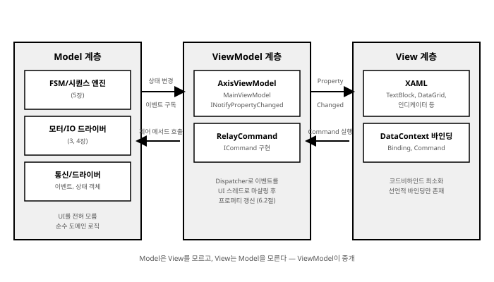
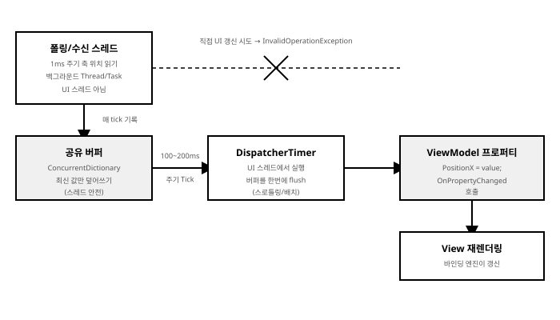

# 6장. WPF/MVVM 기반 HMI UI 구축

[◀ 이전: 5장. 상태 머신(FSM) 및 시퀀스 설계](ch05-상태머신과시퀀스설계.md) | [📖 목차](00-목차.md) | [다음: 7장. 알람, 레시피 및 데이터 관리 ▶](ch07-알람레시피와데이터관리.md)


지금까지 우리는 5장에 걸쳐 장비 제어 소프트웨어의 "몸통"을 만들어 왔다. 2장에서는 비동기·멀티스레딩 기반을 다졌고, 3장에서는 하드웨어와의 통신 계층을, 4장에서는 모터와 I/O 제어를, 5장에서는 이 모든 것을 조율하는 상태 머신과 시퀀스 엔진을 설계했다. 이제 이 몸통에 얼굴을 붙일 차례다. 아무리 정교한 시퀀스 엔진과 안전한 모터 제어 로직을 갖추고 있어도, 현장의 엔지니어와 오퍼레이터가 그것을 직관적으로 보고 조작할 수 없다면 장비는 무용지물이다. HMI(Human-Machine Interface)는 장비 제어 소프트웨어의 "얼굴"이자, 도메인 로직과 사람을 잇는 유일한 접점이다.

이 장에서는 WPF(Windows Presentation Foundation)와 MVVM(Model-View-ViewModel) 패턴을 이용해 산업 현장에서 실제로 쓸 수 있는 HMI를 어떻게 설계하고 구현하는지 다룬다. 단순히 "버튼을 누르면 무언가 실행되는" 수준이 아니라, 수십~수백 개의 축과 센서 상태가 실시간으로 갱신되는 화면을 성능 저하 없이 구현하는 방법, 엔지니어가 장비를 직접 움직여 좌표를 저장하는 티칭(Teaching) 기능, 그리고 운전자의 실수로 장비가 위험한 상태에 빠지지 않도록 막는 권한 관리까지, 실무에서 반드시 마주치는 네 가지 주제를 순서대로 다룬다.

## 6.1 MVVM 패턴 기반 View-ViewModel-Model 역할 분리

### 6.1.1 왜 장비 제어 HMI에 MVVM이 특히 유용한가

일반적인 업무용 애플리케이션(예: 게시판, 쇼핑몰 관리자 화면)과 비교했을 때 장비 제어 HMI는 근본적으로 다른 특성을 가진다.

- **갱신되는 값의 개수가 많다.** 축이 8개, 각 축마다 위치·속도·토크·원점 여부·알람 상태를 표시한다면 벌써 40개의 값이다. 여기에 디지털 입출력 32점, 압력·온도 등 아날로그 센서, 레시피 진행률, 시퀀스 상태까지 더하면 한 화면에서 실시간으로 갱신되는 값이 수백 개에 이르는 것이 특별한 일이 아니다.
- **갱신 빈도가 높다.** 사람의 클릭에 반응하는 것이 아니라, 하드웨어가 스스로 초당 수십~수천 번 상태를 통지한다.
- **정확성이 안전과 직결된다.** 화면에 표시된 축 위치가 실제 값과 다르면 오퍼레이터가 잘못된 판단을 내려 충돌 사고로 이어질 수 있다.

전통적인 코드비하인드(code-behind) 방식—버튼 클릭 이벤트 핸들러 안에서 `textBlock.Text = ...` 처럼 UI 컨트롤을 직접 조작하는 방식—으로 이 요구사항을 감당하려 하면 순식간에 감당할 수 없는 코드가 된다. 축 위치가 바뀔 때마다 "이 값을 표시하는 모든 컨트롤을 찾아서 갱신하는" 코드를 수동으로 작성해야 하고, 이 코드는 UI 레이아웃이 조금만 바뀌어도 함께 깨진다. 더 심각한 문제는 이런 코드가 하드웨어 폴링 스레드, 시퀀스 엔진 스레드, UI 스레드가 뒤섞인 채로 작성되기 쉬워서 크로스 스레드 예외와 경쟁 조건의 온상이 된다는 점이다.

MVVM 패턴, 그리고 그 근간이 되는 WPF의 데이터 바인딩(Data Binding) 엔진은 이 문제를 근본적으로 다른 방식으로 해결한다. "값이 바뀌면 화면의 어디를 갱신해야 하는가"를 개발자가 명령형으로 지시하는 대신, "이 컨트롤은 이 값과 항상 같아야 한다"를 XAML에 선언적으로 기술해 두면, 값이 바뀔 때 `INotifyPropertyChanged` 알림 한 번으로 바인딩 엔진이 알아서 관련된 모든 UI를 갱신한다. 개발자는 더 이상 "누가 무엇을 갱신하는지" 추적할 필요가 없다. 이것이 실시간으로 수백 개의 상태 값을 다루는 장비 제어 HMI에 MVVM이 사실상 표준으로 자리 잡은 이유다.

MVVM은 화면을 세 개의 계층으로 분리한다.

- **Model**: 장비의 실제 상태와 도메인 로직. 이 책의 맥락에서는 3장의 통신 드라이버, 4장의 모터/IO 컨트롤러, 5장의 FSM/시퀀스 엔진이 여기에 해당한다. Model은 WPF나 UI에 대해 전혀 알지 못한다.
- **ViewModel**: Model의 상태를 UI가 바인딩할 수 있는 형태(프로퍼티, 커맨드)로 노출하는 계층. `INotifyPropertyChanged`를 구현해 값 변경을 알리고, `ICommand`를 구현해 사용자 조작을 Model 쪽 메서드 호출로 연결한다.
- **View**: XAML로 작성된 화면 자체. 이상적으로는 코드비하인드가 거의 없고, `Binding`을 통해 ViewModel과 연결될 뿐이다.

### 6.1.2 INotifyPropertyChanged를 구현하는 ViewModelBase

모든 ViewModel이 반복적으로 구현해야 하는 `INotifyPropertyChanged`를 공통 기반 클래스로 뽑아낸다. 실무에서는 이런 기반 클래스를 프로젝트 초기에 한 번 작성해 두고 모든 ViewModel이 상속받아 쓴다.

```csharp
using System.Collections.Generic;
using System.ComponentModel;
using System.Runtime.CompilerServices;

namespace EquipmentControl.Presentation.ViewModels
{
    /// <summary>
    /// 모든 ViewModel의 공통 기반 클래스.
    /// INotifyPropertyChanged 구현과 프로퍼티 변경 감지를 위한 헬퍼를 제공한다.
    /// </summary>
    public abstract class ViewModelBase : INotifyPropertyChanged
    {
        public event PropertyChangedEventHandler? PropertyChanged;

        /// <summary>
        /// 필드 값이 실제로 바뀌었을 때만 PropertyChanged를 발생시킨다.
        /// CallerMemberName 덕분에 호출부에서는 프로퍼티 이름을 문자열로
        /// 적을 필요가 없어 리팩터링 시 오타로 인한 버그를 방지한다.
        /// </summary>
        protected bool SetProperty<T>(
            ref T field,
            T value,
            [CallerMemberName] string? propertyName = null)
        {
            if (EqualityComparer<T>.Default.Equals(field, value))
                return false;

            field = value;
            OnPropertyChanged(propertyName);
            return true;
        }

        protected void OnPropertyChanged([CallerMemberName] string? propertyName = null)
        {
            PropertyChanged?.Invoke(this, new PropertyChangedEventArgs(propertyName));
        }

        /// <summary>
        /// 여러 프로퍼티가 한 값에 종속될 때(예: IsMoving이 바뀌면
        /// StatusText도 다시 계산되어야 할 때) 함께 알림을 보낸다.
        /// </summary>
        protected void OnPropertyChanged(params string[] propertyNames)
        {
            foreach (var name in propertyNames)
                OnPropertyChanged(name);
        }
    }
}
```

`SetProperty`가 값이 실제로 바뀌었을 때만 이벤트를 발생시킨다는 점이 중요하다. 폴링 방식으로 축 위치를 계속 읽어오는 경우, 값이 동일해도 매번 대입하는 코드를 무심코 작성하기 쉬운데, `EqualityComparer<T>.Default.Equals` 비교가 없다면 값이 바뀌지 않았는데도 매번 UI 갱신 이벤트가 발생해 불필요한 렌더링 부하를 유발한다. 6.2절에서 다룰 "너무 잦은 갱신" 문제의 첫 번째 방어선이 바로 이 비교 로직이다.

### 6.1.3 ICommand과 RelayCommand: 버튼 클릭을 ViewModel 메서드로

WPF의 `Button`, `MenuItem` 등은 `Click` 이벤트뿐 아니라 `Command` 프로퍼티를 지원한다. `Command`에 `ICommand`를 구현한 객체를 바인딩하면, 코드비하인드에 이벤트 핸들러를 작성하지 않고도 버튼 클릭을 ViewModel의 메서드 호출로 연결할 수 있다. `ICommand`는 `Execute`, `CanExecute`, `CanExecuteChanged` 세 멤버로 구성되는데, `CanExecute`가 `false`를 반환하면 WPF가 자동으로 버튼을 비활성화(회색 처리)해 준다는 점이 특히 유용하다. 예를 들어 "원점 복귀 중에는 이동 버튼을 누를 수 없다"는 안전 규칙을 `IsEnabled` 바인딩 없이도 커맨드 하나로 표현할 수 있다.

```csharp
using System;
using System.Windows.Input;

namespace EquipmentControl.Presentation.Commands
{
    /// <summary>
    /// 매개변수가 없는 동기 커맨드. 버튼 클릭 등 단순한 액션에 사용한다.
    /// </summary>
    public class RelayCommand : ICommand
    {
        private readonly Action _execute;
        private readonly Func<bool>? _canExecute;

        public RelayCommand(Action execute, Func<bool>? canExecute = null)
        {
            _execute = execute ?? throw new ArgumentNullException(nameof(execute));
            _canExecute = canExecute;
        }

        public bool CanExecute(object? parameter) => _canExecute?.Invoke() ?? true;

        public void Execute(object? parameter) => _execute();

        public event EventHandler? CanExecuteChanged;

        /// <summary>
        /// CanExecute의 결과가 바뀔 만한 상황(예: 축 이동 상태 변경)에서
        /// ViewModel이 명시적으로 호출해 버튼의 활성/비활성을 재평가시킨다.
        /// </summary>
        public void RaiseCanExecuteChanged() =>
            CanExecuteChanged?.Invoke(this, EventArgs.Empty);
    }

    /// <summary>
    /// 제네릭 버전. DataGrid의 선택된 행(TeachingPoint 등)처럼
    /// CommandParameter로 전달되는 값을 다루는 커맨드에 사용한다.
    /// </summary>
    public class RelayCommand<T> : ICommand
    {
        private readonly Action<T?> _execute;
        private readonly Func<T?, bool>? _canExecute;

        public RelayCommand(Action<T?> execute, Func<T?, bool>? canExecute = null)
        {
            _execute = execute ?? throw new ArgumentNullException(nameof(execute));
            _canExecute = canExecute;
        }

        public bool CanExecute(object? parameter) =>
            _canExecute?.Invoke((T?)parameter) ?? true;

        public void Execute(object? parameter) => _execute((T?)parameter);

        public event EventHandler? CanExecuteChanged;

        public void RaiseCanExecuteChanged() =>
            CanExecuteChanged?.Invoke(this, EventArgs.Empty);
    }
}
```

> **비동기 커맨드에 대한 주의사항**: 축 이동, 레시피 로드 등 시간이 걸리는 동작을 `RelayCommand`의 `Execute` 안에서 `async void`로 처리하고 싶은 유혹이 있는데, `async void`는 예외가 발생했을 때 호출자가 이를 캐치할 방법이 없어 애플리케이션이 통째로 죽을 수 있다. 이 책에서는 `Execute` 내부에서 `Task.Run`으로 감싸거나, 별도의 `AsyncRelayCommand`(내부에서 `try/catch`로 예외를 흡수하고 로그를 남기는 버전)를 만들어 쓰는 것을 권장한다. 2장에서 다룬 `async/await`의 예외 전파 규칙을 다시 참고하기 바란다.

버튼 하나를 ViewModel에 연결하는 가장 단순한 예는 다음과 같다.

```csharp
public class AxisViewModel : ViewModelBase
{
    public ICommand HomeCommand { get; }

    public AxisViewModel(IAxisController axisController)
    {
        HomeCommand = new RelayCommand(
            execute: () => _ = HomeAsync(),
            canExecute: () => !IsMoving && !IsHoming);
    }

    private async Task HomeAsync()
    {
        IsHoming = true;
        try
        {
            await _axisController.HomeAsync();
        }
        finally
        {
            IsHoming = false;
        }
    }
}
```

```xml
<Button Content="원점 복귀"
        Command="{Binding HomeCommand}"
        Width="100" Height="32"/>
```

### 6.1.4 Model ↔ ViewModel ↔ View: 장비 제어 맥락에서의 계층 분리

이제 이 세 계층이 장비 제어 소프트웨어에서 구체적으로 어떻게 맞물리는지 정리해 보자. 아래 그림은 5장에서 만든 FSM/시퀀스 엔진과 3~4장에서 만든 하드웨어 드라이버가 Model 계층을 이루고, ViewModel이 이들을 구독해 View에 값을 흘려보내는 전체 흐름을 보여준다.



핵심은 화살표의 방향과 책임이다.

1. **Model → ViewModel (상태 변경 통지)**: 5장에서 설계한 시퀀스 엔진은 `event EventHandler<SequenceStateChangedEventArgs> StateChanged`와 같은 순수 C# 이벤트, 혹은 `IObservable<T>` 형태로 상태 변화를 외부에 알린다. Model은 자신을 구독하는 대상이 ViewModel인지, 로거인지, 다른 서비스인지 전혀 알지 못한다.
2. **ViewModel이 구독하고 프로퍼티로 변환**: ViewModel은 생성자에서 Model의 이벤트를 구독하고, 이벤트 핸들러 안에서 자신의 프로퍼티를 갱신한다. 이 갱신이 `SetProperty`를 통해 `PropertyChanged`를 발생시키면 바인딩 엔진이 View를 갱신한다.
3. **ViewModel → View (PropertyChanged)**: View는 `{Binding PropertyName}` 구문으로 선언되어 있을 뿐, ViewModel이 언제 어떻게 값을 바꾸는지 신경 쓰지 않는다.
4. **View → ViewModel → Model (Command 실행)**: 반대 방향은 사용자의 조작이다. 버튼 클릭은 `ICommand.Execute`를 통해 ViewModel 메서드를 호출하고, ViewModel은 이를 다시 Model(모터 컨트롤러, 시퀀스 엔진)의 메서드 호출로 변환한다.

다음은 5장의 시퀀스 엔진과 연동하는 `MainViewModel`의 예다. 실무에서는 이렇게 Model의 이벤트를 구독하는 코드를 ViewModel의 생성자에 모아두고, `IDisposable`을 구현해 화면이 닫힐 때 반드시 구독을 해제하도록 한다. 구독 해제를 빠뜨리면 ViewModel과 View가 가비지 컬렉션되지 않고 메모리에 남는 전형적인 메모리 누수가 발생한다.

```csharp
public class MainViewModel : ViewModelBase, IDisposable
{
    private readonly ISequenceEngine _sequenceEngine;
    private SequenceState _currentState;
    private string _statusMessage = string.Empty;

    public SequenceState CurrentState
    {
        get => _currentState;
        private set => SetProperty(ref _currentState, value);
    }

    public string StatusMessage
    {
        get => _statusMessage;
        private set => SetProperty(ref _statusMessage, value);
    }

    public ICommand StartCommand { get; }
    public ICommand StopCommand { get; }

    public MainViewModel(ISequenceEngine sequenceEngine)
    {
        _sequenceEngine = sequenceEngine;

        // Model(FSM 엔진)의 상태 변경 이벤트를 구독한다.
        // 이 이벤트는 대개 워커 스레드에서 발생하므로,
        // 실제 구현에서는 6.2절에서 다루는 Dispatcher 마샬링이 반드시 필요하다.
        _sequenceEngine.StateChanged += OnSequenceStateChanged;

        StartCommand = new RelayCommand(
            () => _sequenceEngine.Start(),
            () => CurrentState == SequenceState.Idle);

        StopCommand = new RelayCommand(
            () => _sequenceEngine.Stop(),
            () => CurrentState == SequenceState.Running);
    }

    private void OnSequenceStateChanged(object? sender, SequenceStateChangedEventArgs e)
    {
        CurrentState = e.NewState;
        StatusMessage = $"{e.OldState} → {e.NewState}";
    }

    public void Dispose()
    {
        _sequenceEngine.StateChanged -= OnSequenceStateChanged;
    }
}
```

이 구조의 가장 큰 장점은 **테스트 가능성**이다. `ISequenceEngine`을 인터페이스로 두었기 때문에, 단위 테스트에서는 실제 하드웨어 없이 가짜(mock) 시퀀스 엔진을 주입해 `MainViewModel`의 상태 전이 로직만 독립적으로 검증할 수 있다. WPF `Window`를 띄우지 않고도 ViewModel의 동작을 CI 파이프라인에서 자동 검증할 수 있다는 것은, 코드비하인드 방식으로는 얻기 어려운 이점이다. 9장에서 테스트 전략을 다룰 때 이 구조를 다시 활용한다.

## 6.2 모터 위치, I/O 센서 상태 실시간 모니터링 컴포넌트 개발

### 6.2.1 크로스 스레드 문제: Dispatcher와 SynchronizationContext

WPF의 UI 요소는 이를 생성한 스레드(일반적으로 애플리케이션의 메인 스레드, STA 스레드)에서만 접근할 수 있다는 엄격한 규칙을 가진다. 3장과 4장에서 만든 통신 수신 스레드나 모터 컨트롤러의 폴링 스레드에서 직접 ViewModel의 프로퍼티를 갱신하면 어떻게 될까? 정확히는 ViewModel 자체는 일반 CLR 객체이므로 프로퍼티 대입은 문제없이 동작하지만, 그 프로퍼티가 발생시키는 `PropertyChanged` 이벤트를 WPF 바인딩 엔진이 처리하는 과정에서 UI 요소(예: `TextBlock`)를 다른 스레드가 건드리게 되어 다음과 같은 예외가 발생한다.

```
System.InvalidOperationException:
'호출 스레드가 이 개체를 소유하고 있지 않으므로 액세스할 수 없습니다.'
```

이 문제는 2장의 동시성 기초를 다시 떠올리게 만든다. 해결책은 백그라운드 스레드에서 얻은 값을 반드시 UI 스레드로 "마샬링(marshalling)"해서 전달하는 것이다. WPF에서는 세 가지 방법이 있다.

**1) Dispatcher.Invoke — 동기적으로 UI 스레드에서 실행하고 완료를 기다림**

```csharp
_uiDispatcher.Invoke(() =>
{
    axisViewModel.PositionX = newPosition;
});
```

호출한 백그라운드 스레드가 UI 스레드의 작업이 끝날 때까지 블로킹된다. 폴링 루프처럼 다음 읽기를 즉시 이어가야 하는 코드에서는 이 블로킹이 병목이 될 수 있다.

**2) Dispatcher.BeginInvoke — 비동기적으로 큐에 넣고 즉시 반환**

```csharp
_uiDispatcher.BeginInvoke(() =>
{
    axisViewModel.PositionX = newPosition;
}, DispatcherPriority.Background);
```

백그라운드 스레드는 UI 갱신이 실제로 언제 처리되는지 신경 쓰지 않고 즉시 다음 작업으로 넘어간다. 폴링 루프의 처리량을 최우선으로 해야 하는 경우 `BeginInvoke`가 더 적합하다. 다만 `BeginInvoke`를 남발하면 UI 스레드의 디스패처 큐에 처리되지 못한 작업이 쌓여 오히려 UI가 뒤늦게 반응하는 "지연 누적" 현상이 생길 수 있다는 점을 유의해야 한다. 이는 6.2.2절에서 다룰 스로틀링이 필요한 이유이기도 하다.

**3) SynchronizationContext — async/await와 자연스럽게 결합**

`async/await`를 사용하는 코드라면 `SynchronizationContext.Current`를 캡처해 두었다가 `Post`로 UI 스레드에 작업을 넘기는 방식도 가능하다. 실제로는 WPF 애플리케이션에서 UI 스레드로부터 시작된 `await` 이후의 코드는 별도의 처리 없이도 자동으로 UI 스레드의 `SynchronizationContext`로 복귀하므로(2장, 10장 대응 내용 참고), 순수한 폴링 스레드가 아니라 `async` 메서드 체인 안에서 값을 갱신하는 경우라면 이 메커니즘을 그대로 활용하는 편이 가장 자연스럽다.

```csharp
public class AxisMonitorService
{
    private readonly SynchronizationContext? _uiContext;

    public AxisMonitorService()
    {
        // 반드시 UI 스레드에서 생성자를 호출해야 올바른 컨텍스트를 캡처한다.
        _uiContext = SynchronizationContext.Current;
    }

    // 백그라운드 폴링 스레드에서 호출되는 메서드
    private void OnRawPositionReceived(int axisId, double position)
    {
        _uiContext?.Post(_ =>
        {
            _axisViewModels[axisId].PositionX = position;
        }, null);
    }
}
```

`Dispatcher`와 `SynchronizationContext` 중 어느 것을 쓸지는 팀 컨벤션의 문제에 가깝다. 다만 라이브러리 계층(Model, 서비스 클래스)은 WPF에 대한 의존을 피하기 위해 `SynchronizationContext`나 `IProgress<T>`를 선호하고, ViewModel/View에 인접한 코드에서는 `Dispatcher`를 직접 쓰는 것이 일반적인 관행이다.

### 6.2.2 갱신이 너무 잦을 때: 스로틀링과 배치 업데이트

서보 드라이버가 1ms 주기로 엔코더 값을 보내온다고 해서, 그 값을 받을 때마다 `Dispatcher.BeginInvoke`로 UI를 갱신하면 어떻게 될까? WPF의 렌더링 파이프라인은 초당 약 60프레임(약 16.7ms 주기)으로 화면을 그리기 때문에, 1ms마다 발생하는 갱신 요청의 대부분은 실제로 화면에 반영되지도 못한 채 버려진다. 그런데도 `BeginInvoke` 호출 자체, `PropertyChanged` 이벤트 발생, 바인딩 엔진의 대상 탐색 등에는 CPU 비용이 들기 때문에, 결과적으로 CPU만 낭비하면서 오히려 UI가 버벅이는 역효과가 난다. 축이 8개, 각 축의 위치·속도·전류 값까지 합치면 1ms마다 수십 개의 프로퍼티가 갱신되고, 이는 초당 수만 번의 불필요한 디스패처 호출로 이어진다.

해법은 **갱신 주기를 하드웨어의 데이터 발생 주기가 아니라, 사람이 인지할 수 있는 주기(대략 100~200ms, 화면 성격에 따라 최대 30~60ms)로 분리**하는 것이다. 이때 중요한 것은 중간값을 버려도 괜찮다는 점이다. 사람은 축이 100ms 사이에 1ms 간격으로 어떻게 움직였는지 볼 수 없고, 오직 "현재 어디에 있는가"만 알면 된다. 따라서 최신 값만 유지하는 스레드 안전 버퍼와, 이를 일정 주기로 UI에 반영하는 타이머를 조합한 배치 업데이트 패턴을 사용한다.



```csharp
using System.Collections.Concurrent;
using System.Windows.Threading;

namespace EquipmentControl.Presentation.Services
{
    /// <summary>
    /// 고빈도로 갱신되는 축/센서 값을 스레드 안전한 버퍼에 모아두고,
    /// DispatcherTimer 주기로 한꺼번에 UI에 반영(flush)하는 스로틀러.
    /// </summary>
    public class AxisPositionThrottler
    {
        private readonly ConcurrentDictionary<int, double> _pendingPositions = new();
        private readonly DispatcherTimer _flushTimer;
        private readonly IReadOnlyDictionary<int, AxisViewModel> _axisViewModels;

        public AxisPositionThrottler(
            IReadOnlyDictionary<int, AxisViewModel> axisViewModels,
            TimeSpan flushInterval)
        {
            _axisViewModels = axisViewModels;

            // DispatcherTimer는 UI 스레드(Dispatcher)에서 Tick 콜백을 실행하므로
            // 별도의 Dispatcher.Invoke 없이 안전하게 ViewModel 프로퍼티를 대입할 수 있다.
            _flushTimer = new DispatcherTimer(DispatcherPriority.Background)
            {
                Interval = flushInterval // 예: TimeSpan.FromMilliseconds(100)
            };
            _flushTimer.Tick += (_, _) => Flush();
            _flushTimer.Start();
        }

        /// <summary>
        /// 폴링/수신 스레드에서 호출한다. 락 없이 동작하며,
        /// 같은 축 값이 여러 번 들어와도 최신 값으로 덮어써질 뿐이다.
        /// </summary>
        public void ReportPosition(int axisId, double position)
        {
            _pendingPositions[axisId] = position;
        }

        // UI 스레드(DispatcherTimer.Tick)에서만 호출된다.
        private void Flush()
        {
            if (_pendingPositions.IsEmpty)
                return;

            // 이번 주기에 쌓인 값만 꺼내 비운다.
            foreach (var axisId in _pendingPositions.Keys.ToArray())
            {
                if (_pendingPositions.TryRemove(axisId, out var position) &&
                    _axisViewModels.TryGetValue(axisId, out var vm))
                {
                    vm.PositionX = position; // SetProperty가 값이 같으면 알림을 생략
                }
            }
        }
    }
}
```

이 패턴의 핵심 포인트 세 가지를 짚고 넘어가자.

- **`ConcurrentDictionary`로 락을 피한다.** 여러 축의 폴링 스레드(혹은 하나의 통신 스레드가 여러 축 값을 한꺼번에 파싱하는 구조)가 동시에 `ReportPosition`을 호출해도 `ConcurrentDictionary`의 인덱서는 스레드 안전하므로 별도의 `lock`이 필요 없다.
- **`DispatcherTimer`는 이미 UI 스레드에서 동작한다.** `System.Windows.Threading.DispatcherTimer`는 내부적으로 `Dispatcher`의 큐에 콜백을 등록하는 타이머이므로, `Tick` 핸들러 안에서는 별도의 `Dispatcher.Invoke` 호출 없이 안전하게 ViewModel을 갱신할 수 있다. 반대로 `System.Threading.Timer`나 `System.Timers.Timer`는 스레드 풀 스레드에서 콜백이 실행되므로 이 경우에는 여전히 마샬링이 필요하다.
- **6.1.2절의 `SetProperty`가 두 번째 방어선 역할을 한다.** flush 시점에 값이 이전과 동일하다면(예: 축이 정지해 있는 상태) `PropertyChanged`조차 발생시키지 않으므로, 정지 중인 축이 굳이 화면을 다시 그리게 만들지 않는다.

알람처럼 "한 번이라도 놓치면 안 되는" 이벤트성 데이터는 이 스로틀링 대상에서 제외해야 한다는 점도 중요하다. 위치·속도처럼 "최신 값만 알면 되는" 연속적인 데이터와, 알람 발생·해제처럼 "모든 전이를 놓치지 않아야 하는" 이산적인 이벤트는 서로 다른 경로로 처리해야 한다. 알람은 별도의 큐(예: `Channel<T>`, 2장 참고)에 순서대로 쌓아 두고 스로틀링 없이 즉시(혹은 최소한의 지연으로) 반영하는 것이 안전하다.

### 6.2.3 커스텀 게이지/인디케이터 컨트롤

장비 상태를 한눈에 파악할 수 있어야 하는 HMI에서 색상 코딩된 상태 표시등(램프)은 가장 기본적이면서도 중요한 UI 요소다. WPF에서는 `IValueConverter`를 이용해 도메인 값(enum, bool 등)을 UI 값(색상, 문자열 등)으로 변환하는 것이 정석적인 방법이다.

```csharp
public enum AlarmLevel
{
    Normal,
    Warning,
    Alarm
}
```

```csharp
using System;
using System.Globalization;
using System.Windows.Data;
using System.Windows.Media;

namespace EquipmentControl.Presentation.Converters
{
    /// <summary>
    /// AlarmLevel을 상태 표시등 색상(Brush)으로 변환한다.
    /// Normal = 녹색, Warning = 노랑, Alarm = 빨강(점멸은 XAML 스토리보드로 별도 처리).
    /// </summary>
    public class AlarmLevelToBrushConverter : IValueConverter
    {
        private static readonly Brush NormalBrush = new SolidColorBrush(Color.FromRgb(0x2E, 0xCC, 0x71));
        private static readonly Brush WarningBrush = new SolidColorBrush(Color.FromRgb(0xF1, 0xC4, 0x0F));
        private static readonly Brush AlarmBrush = new SolidColorBrush(Color.FromRgb(0xE7, 0x4C, 0x3C));

        public object Convert(object? value, Type targetType, object? parameter, CultureInfo culture)
        {
            return value switch
            {
                AlarmLevel.Normal => NormalBrush,
                AlarmLevel.Warning => WarningBrush,
                AlarmLevel.Alarm => AlarmBrush,
                _ => Brushes.Gray
            };
        }

        public object ConvertBack(object? value, Type targetType, object? parameter, CultureInfo culture)
        {
            // 단방향 바인딩만 지원한다. 색상에서 상태를 역산하는 것은 의미가 없으므로
            // 실수로 TwoWay 바인딩에 연결되었을 때 바로 알아챌 수 있도록 예외를 던진다.
            throw new NotSupportedException("AlarmLevelToBrushConverter는 OneWay 전용입니다.");
        }
    }
}
```

이 컨버터를 재사용 가능한 `UserControl`로 감싸면, 화면 곳곳에서 동일한 시각 언어(같은 색이 항상 같은 의미)를 유지할 수 있다.

```xml
<!-- StatusLampControl.xaml -->
<UserControl x:Class="EquipmentControl.Presentation.Controls.StatusLampControl"
             xmlns="http://schemas.microsoft.com/winfx/2006/xaml/presentation"
             xmlns:x="http://schemas.microsoft.com/winfx/2006/xaml"
             xmlns:conv="clr-namespace:EquipmentControl.Presentation.Converters">
    <UserControl.Resources>
        <conv:AlarmLevelToBrushConverter x:Key="AlarmLevelToBrushConverter"/>
    </UserControl.Resources>

    <StackPanel Orientation="Horizontal">
        <Ellipse Width="16" Height="16"
                 Fill="{Binding Level, RelativeSource={RelativeSource AncestorType=UserControl},
                        Converter={StaticResource AlarmLevelToBrushConverter}}"
                 Stroke="Black" StrokeThickness="1"/>
        <TextBlock Text="{Binding Label, RelativeSource={RelativeSource AncestorType=UserControl}}"
                   Margin="6,0,0,0" VerticalAlignment="Center"/>
    </StackPanel>
</UserControl>
```

```csharp
public partial class StatusLampControl : UserControl
{
    public static readonly DependencyProperty LevelProperty =
        DependencyProperty.Register(nameof(Level), typeof(AlarmLevel),
            typeof(StatusLampControl), new PropertyMetadata(AlarmLevel.Normal));

    public static readonly DependencyProperty LabelProperty =
        DependencyProperty.Register(nameof(Label), typeof(string),
            typeof(StatusLampControl), new PropertyMetadata(string.Empty));

    public AlarmLevel Level
    {
        get => (AlarmLevel)GetValue(LevelProperty);
        set => SetValue(LevelProperty, value);
    }

    public string Label
    {
        get => (string)GetValue(LabelProperty);
        set => SetValue(LabelProperty, value);
    }

    public StatusLampControl() => InitializeComponent();
}
```

`DependencyProperty`로 `Level`, `Label`을 노출했기 때문에, 이 컨트롤을 사용하는 쪽에서는 일반 컨트롤처럼 바인딩을 걸 수 있다.

```xml
<controls:StatusLampControl Level="{Binding Axis1.AlarmLevel}" Label="축 1"/>
<controls:StatusLampControl Level="{Binding Axis2.AlarmLevel}" Label="축 2"/>
```

축 위치처럼 연속적인 값을 보여주는 게이지도 같은 원리로 만들 수 있다. 간단한 예로 `ProgressBar`를 스타일링해서 현재 위치를 축의 이동 범위(`SoftLimitMin`~`SoftLimitMax`) 대비 비율로 보여주는 방법이 실무에서 자주 쓰인다.

```xml
<Grid>
    <ProgressBar Minimum="{Binding SoftLimitMin}"
                 Maximum="{Binding SoftLimitMax}"
                 Value="{Binding PositionX}"
                 Height="20" Foreground="#2E86C1"/>
    <TextBlock Text="{Binding PositionX, StringFormat={}{0:F3} mm}"
               HorizontalAlignment="Center" VerticalAlignment="Center"/>
</Grid>
```

`ProgressBar.Value`가 `PositionX`에 바인딩되어 있으므로, 6.2.2절의 스로틀러가 100ms마다 `PositionX`를 갱신할 때마다 게이지가 자연스럽게 따라 움직인다. 이처럼 MVVM 구조에서는 새로운 시각화 컴포넌트를 추가하더라도 ViewModel이나 마샬링 로직을 전혀 건드릴 필요 없이 XAML만 추가하면 된다는 것이 데이터 바인딩의 진짜 위력이다.

## 6.3 티칭(Teaching) 화면 및 위치 데이터 바인딩

### 6.3.1 티칭이란 무엇인가

일반적인 소프트웨어 개발자에게는 낯설 수 있지만, 티칭(Teaching)은 산업용 장비 소프트웨어에서 대단히 중요한 개념이다. 로봇 암, 픽앤플레이스 장비, 디스펜싱 장비 등 좌표를 기반으로 동작하는 대부분의 장비는, 도면상의 이론적인 좌표만으로는 실제 현장의 지그(jig)나 부품 위치와 정확히 맞아떨어지지 않는다. 기구 조립 공차, 지그의 개별 편차, 카메라 렌즈 왜곡 등 다양한 요인 때문이다.

이 문제를 해결하는 현장의 방식이 바로 티칭이다. 엔지니어가 조그(Jog) 버튼으로 축을 눈으로 확인하며 원하는 위치까지 직접 이동시킨 뒤, "이 위치를 저장"이라는 명령으로 현재의 실제 좌표를 기록한다. 이렇게 저장된 좌표(티칭 포인트)는 이후 자동 운전 시퀀스가 "픽업 위치로 이동"과 같은 동작을 수행할 때 실제 좌표값으로 사용된다. 즉, 티칭은 이론적인 좌표와 현실 세계 사이의 간극을 사람의 눈과 판단으로 메우는 과정이며, 티칭 화면은 이 과정을 지원하는 HMI의 핵심 기능 중 하나다.

### 6.3.2 TeachingPoint 모델과 ObservableCollection

티칭 포인트 하나는 이름, 좌표(여러 축), 그리고 필요하다면 설명이나 최종 수정 정보를 담는 단순한 데이터 클래스로 표현한다.

```csharp
namespace EquipmentControl.Domain.Teaching
{
    /// <summary>
    /// 하나의 티칭 포인트. 여러 축의 좌표를 하나의 논리적 위치로 묶는다.
    /// </summary>
    public class TeachingPoint
    {
        public int Id { get; set; }
        public string Name { get; set; } = string.Empty;
        public double X { get; set; }
        public double Y { get; set; }
        public double Z { get; set; }
        public double R { get; set; } // 회전축(있는 경우)
        public string Comment { get; set; } = string.Empty;
        public DateTime LastModifiedAt { get; set; }
        public string LastModifiedBy { get; set; } = string.Empty;
    }
}
```

이 목록을 화면에 표시하고 항목의 추가/삭제/갱신이 UI에 즉시 반영되도록 하려면, 일반 `List<T>`가 아니라 `ObservableCollection<T>`를 사용해야 한다. `ObservableCollection<T>`는 `INotifyCollectionChanged`를 구현하고 있어서, 항목이 추가·삭제될 때마다 바인딩된 `DataGrid`나 `ListView`가 자동으로 갱신된다(반면 각 항목의 프로퍼티가 바뀌는 것을 감지하려면 `TeachingPoint` 자체도 `INotifyPropertyChanged`를 구현해야 한다. 여기서는 편집 후 명시적으로 "저장" 커맨드를 실행하는 흐름을 가정해 단순화했다).

```csharp
public class TeachingViewModel : ViewModelBase
{
    private readonly IAxisController _axisController;
    private readonly ITeachingPointRepository _repository;
    private TeachingPoint? _selectedPoint;

    public ObservableCollection<TeachingPoint> Points { get; } = new();

    public TeachingPoint? SelectedPoint
    {
        get => _selectedPoint;
        set
        {
            if (SetProperty(ref _selectedPoint, value))
            {
                // 선택된 포인트가 바뀌면 이동/삭제 버튼의 활성 여부를 재평가한다.
                ((RelayCommand)MoveToCommand).RaiseCanExecuteChanged();
                ((RelayCommand)DeleteCommand).RaiseCanExecuteChanged();
            }
        }
    }

    public ICommand MoveToCommand { get; }
    public ICommand SaveCurrentPositionCommand { get; }
    public ICommand DeleteCommand { get; }
    public ICommand AddNewCommand { get; }

    public TeachingViewModel(IAxisController axisController, ITeachingPointRepository repository)
    {
        _axisController = axisController;
        _repository = repository;

        foreach (var point in _repository.LoadAll())
            Points.Add(point);

        MoveToCommand = new RelayCommand(
            execute: () => _ = MoveToSelectedAsync(),
            canExecute: () => SelectedPoint != null);

        SaveCurrentPositionCommand = new RelayCommand(SaveCurrentPosition,
            canExecute: () => SelectedPoint != null);

        DeleteCommand = new RelayCommand(DeleteSelected,
            canExecute: () => SelectedPoint != null);

        AddNewCommand = new RelayCommand(AddNew);
    }

    private async Task MoveToSelectedAsync()
    {
        if (SelectedPoint is null) return;

        // 실제 현장에서는 이동 전 반드시 확인 대화상자를 띄우거나,
        // 6.4절의 권한 체크(예: Operator는 특정 위치로만 이동 가능)를 거친다.
        await _axisController.MoveAbsoluteAsync(
            new AxisTarget(SelectedPoint.X, SelectedPoint.Y, SelectedPoint.Z, SelectedPoint.R));
    }

    private void SaveCurrentPosition()
    {
        if (SelectedPoint is null) return;

        var current = _axisController.GetCurrentPosition();
        SelectedPoint.X = current.X;
        SelectedPoint.Y = current.Y;
        SelectedPoint.Z = current.Z;
        SelectedPoint.R = current.R;
        SelectedPoint.LastModifiedAt = DateTime.Now;
        SelectedPoint.LastModifiedBy = CurrentUserContext.UserName;

        _repository.SaveAll(Points);

        // TeachingPoint가 INotifyPropertyChanged를 구현하지 않으므로,
        // DataGrid에 변경 사항을 반영하려면 컬렉션 자체를 갱신해 알려준다.
        RefreshGridRow(SelectedPoint);
    }

    private void AddNew()
    {
        var newPoint = new TeachingPoint
        {
            Id = Points.Count == 0 ? 1 : Points.Max(p => p.Id) + 1,
            Name = $"POS_{Points.Count + 1:D2}"
        };
        Points.Add(newPoint);
        SelectedPoint = newPoint;
    }

    private void DeleteSelected()
    {
        if (SelectedPoint is null) return;
        Points.Remove(SelectedPoint);
        _repository.SaveAll(Points);
        SelectedPoint = null;
    }

    private void RefreshGridRow(TeachingPoint point)
    {
        // ObservableCollection은 "항목 자체가 바뀐 것"을 자동 감지하지 못하므로,
        // 강제로 Remove 후 Insert하거나 CollectionView.Refresh()를 호출해
        // DataGrid가 최신 값을 다시 그리도록 한다.
        var index = Points.IndexOf(point);
        if (index >= 0)
        {
            Points.RemoveAt(index);
            Points.Insert(index, point);
        }
    }
}
```

`MoveToSelectedAsync`처럼 실제 하드웨어를 움직이는 커맨드는 특히 주의가 필요하다. 티칭 화면에서의 "이동" 버튼은 오퍼레이터가 실수로 눌렀을 때 축이 예상치 못한 위치로 튀어 주변 설비와 충돌할 위험을 내포하고 있다. 실무에서는 이동 전 반드시 확인 대화상자를 띄우거나, 저속(Jog Speed)으로만 이동을 허용하거나, 6.4절에서 다룰 권한 체크를 통해 Engineer 이상만 이 기능을 사용할 수 있도록 제한하는 것이 일반적이다.

XAML에서는 `DataGrid`로 티칭 포인트 목록을 표시하고, `SelectedItem`을 `SelectedPoint`에 양방향 바인딩한다.

```xml
<Grid Margin="10">
    <Grid.RowDefinitions>
        <RowDefinition Height="*"/>
        <RowDefinition Height="Auto"/>
    </Grid.RowDefinitions>

    <DataGrid Grid.Row="0"
              ItemsSource="{Binding Points}"
              SelectedItem="{Binding SelectedPoint, Mode=TwoWay}"
              AutoGenerateColumns="False"
              IsReadOnly="True"
              SelectionMode="Single">
        <DataGrid.Columns>
            <DataGridTextColumn Header="이름" Binding="{Binding Name}" Width="120"/>
            <DataGridTextColumn Header="X" Binding="{Binding X, StringFormat={}{0:F3}}" Width="80"/>
            <DataGridTextColumn Header="Y" Binding="{Binding Y, StringFormat={}{0:F3}}" Width="80"/>
            <DataGridTextColumn Header="Z" Binding="{Binding Z, StringFormat={}{0:F3}}" Width="80"/>
            <DataGridTextColumn Header="R" Binding="{Binding R, StringFormat={}{0:F3}}" Width="80"/>
            <DataGridTextColumn Header="최종 수정" Binding="{Binding LastModifiedAt, StringFormat=g}" Width="140"/>
            <DataGridTextColumn Header="비고" Binding="{Binding Comment}" Width="*"/>
        </DataGrid.Columns>
    </DataGrid>

    <StackPanel Grid.Row="1" Orientation="Horizontal"
                HorizontalAlignment="Right" Margin="0,10,0,0">
        <Button Content="새 포인트 추가" Command="{Binding AddNewCommand}" Width="110" Margin="4,0"/>
        <Button Content="현재 위치 저장" Command="{Binding SaveCurrentPositionCommand}" Width="110" Margin="4,0"/>
        <Button Content="선택 위치로 이동" Command="{Binding MoveToCommand}" Width="120" Margin="4,0"/>
        <Button Content="삭제" Command="{Binding DeleteCommand}" Width="80" Margin="4,0"/>
    </StackPanel>
</Grid>
```

`DataGrid`에 `IsReadOnly="True"`를 준 이유는, 좌표값을 사람이 직접 타이핑해서 수정하는 것을 막기 위함이다. 좌표는 반드시 실제 축을 움직여서 "현재 위치 저장" 버튼으로 기록해야 하며, 화면에서 숫자를 임의로 고쳐 쓸 수 있게 하면 티칭이라는 기능 자체의 신뢰성이 무너진다. 이름이나 비고처럼 수정해도 안전한 컬럼만 별도로 `IsReadOnly="False"`인 컬럼을 지정하는 것이 좋다.

### 6.3.3 티칭 데이터와 레시피의 관계

지금은 티칭 포인트를 하나의 독립적인 목록으로 다뤘지만, 실제 장비에서는 티칭 포인트가 훨씬 더 큰 그림의 일부다. 제품 A를 생산할 때 필요한 티칭 포인트 집합과, 제품 B를 생산할 때 필요한 집합이 서로 다를 수 있다. 즉, 티칭 포인트는 "제품별 레시피"의 한 구성 요소로 편입되는 경우가 많다. 7장에서는 이 레시피 관리 체계를 본격적으로 다루면서, 오늘 구현한 `ITeachingPointRepository`가 어떻게 레시피 파일의 일부로 저장·전환되는지, 그리고 제품 전환 시 티칭 포인트 세트를 통째로 교체하는 메커니즘을 살펴본다. 지금 설계한 `TeachingPoint`와 `ObservableCollection<TeachingPoint>` 구조는 그대로 재사용되므로, 이 절의 코드는 7장의 레시피 시스템을 위한 토대이기도 하다.

## 6.4 사용자 권한 관리(Operator, Engineer, Admin) 및 화면 제어

### 6.4.1 왜 권한 관리가 필수인가

장비 제어 소프트웨어에서 권한 관리는 선택 사항이 아니라 안전 요구사항에 가깝다. 하루 종일 장비를 운전하는 오퍼레이터가 실수로 서보 게인 값이나 안전 인터록 설정을 바꿔버리면, 그 결과는 단순한 소프트웨어 버그가 아니라 실제 설비 파손이나 인명 사고로 이어질 수 있다. 그렇다고 모든 사용자를 관리자로 취급해 아무 제약 없이 접근을 허용할 수도 없고, 반대로 모든 기능을 관리자만 쓸 수 있게 하면 현장의 정상적인 운전 업무조차 마비된다. 이런 이유로 산업 현장의 장비 소프트웨어는 예외 없이 계층적인 권한 모델을 채택한다. 이 책에서는 가장 널리 쓰이는 3단계 모델을 기준으로 삼는다.

| 권한 | 설명 | 가능한 작업 예 |
|---|---|---|
| Operator (운전자) | 정해진 절차대로 장비를 가동/정지시키는 일상 운전 담당 | 시작/정지/일시정지, 레시피 선택, 알람 확인 |
| Engineer (엔지니어) | 공정 파라미터를 조정하고 티칭을 수행하는 현장 기술자 | 파라미터 수정, 티칭, 수동 조그 이동, 레시피 편집 |
| Admin (관리자) | 시스템 전반의 설정과 사용자 계정을 관리하는 책임자 | 사용자 계정 관리, 통신/드라이버 설정, 안전 파라미터 변경, 로그 관리 |

권한은 항상 상위 권한이 하위 권한의 기능을 포함하는 누적 구조로 설계하는 것이 일반적이다. Admin은 Engineer와 Operator가 할 수 있는 모든 일을 할 수 있고, Engineer는 Operator가 할 수 있는 모든 일을 할 수 있다.

### 6.4.2 UserRole 모델과 인증 서비스

```csharp
namespace EquipmentControl.Domain.Security
{
    /// <summary>
    /// 값이 클수록 더 높은 권한을 의미하도록 설계해,
    /// 정수 비교만으로 "이상" 권한 여부를 판단할 수 있게 한다.
    /// </summary>
    public enum UserRole
    {
        Operator = 0,
        Engineer = 1,
        Admin = 2
    }

    public class UserAccount
    {
        public string UserId { get; init; } = string.Empty;
        public string DisplayName { get; init; } = string.Empty;
        public UserRole Role { get; init; }
    }
}
```

```csharp
using System;

namespace EquipmentControl.Presentation.Security
{
    /// <summary>
    /// 애플리케이션 전역에서 "현재 로그인한 사용자"를 노출하는 서비스.
    /// ViewModel들은 이 서비스를 주입받아 현재 권한을 조회하고,
    /// 로그인/로그아웃/권한 변경 시점을 이벤트로 통지받는다.
    /// </summary>
    public interface ICurrentUserService
    {
        UserAccount? CurrentUser { get; }
        bool IsInRole(UserRole minimumRole);
        event EventHandler<UserAccount?>? UserChanged;

        void Login(UserAccount user);
        void Logout();
    }

    public class CurrentUserService : ICurrentUserService
    {
        private readonly IAuditLogger _auditLogger;
        private UserAccount? _currentUser;

        public UserAccount? CurrentUser => _currentUser;

        public event EventHandler<UserAccount?>? UserChanged;

        public CurrentUserService(IAuditLogger auditLogger)
        {
            _auditLogger = auditLogger;
        }

        public bool IsInRole(UserRole minimumRole) =>
            _currentUser != null && _currentUser.Role >= minimumRole;

        public void Login(UserAccount user)
        {
            var previous = _currentUser;
            _currentUser = user;

            // 6.4.4절: 권한 변경 이력은 반드시 감사 로그로 남긴다.
            _auditLogger.LogAuthorizationEvent(
                eventType: "Login",
                userId: user.UserId,
                role: user.Role,
                previousUserId: previous?.UserId);

            UserChanged?.Invoke(this, _currentUser);
        }

        public void Logout()
        {
            var previous = _currentUser;
            _currentUser = null;

            if (previous != null)
            {
                _auditLogger.LogAuthorizationEvent(
                    eventType: "Logout",
                    userId: previous.UserId,
                    role: previous.Role,
                    previousUserId: null);
            }

            UserChanged?.Invoke(this, null);
        }
    }
}
```

### 6.4.3 XAML 기반 화면 제어: Visibility와 IsEnabled

권한에 따라 버튼이나 메뉴를 숨기거나 비활성화하는 가장 직접적인 방법은, 권한 정보를 UI가 바인딩할 수 있는 값으로 변환하는 `IValueConverter`를 만드는 것이다.

```csharp
using System;
using System.Globalization;
using System.Windows;
using System.Windows.Data;

namespace EquipmentControl.Presentation.Converters
{
    /// <summary>
    /// 현재 사용자의 권한(UserRole)이 ConverterParameter로 지정한
    /// 최소 권한 이상이면 Visible, 아니면 Collapsed를 반환한다.
    /// 사용 예: Visibility="{Binding CurrentRole,
    ///           Converter={StaticResource RoleToVisibilityConverter},
    ///           ConverterParameter=Engineer}"
    /// </summary>
    public class RoleToVisibilityConverter : IValueConverter
    {
        public object Convert(object? value, Type targetType, object? parameter, CultureInfo culture)
        {
            if (value is not UserRole currentRole)
                return Visibility.Collapsed;

            if (parameter is not string requiredRoleText ||
                !Enum.TryParse<UserRole>(requiredRoleText, out var requiredRole))
                return Visibility.Collapsed;

            return currentRole >= requiredRole ? Visibility.Visible : Visibility.Collapsed;
        }

        public object ConvertBack(object? value, Type targetType, object? parameter, CultureInfo culture) =>
            throw new NotSupportedException();
    }
}
```

이 컨버터를 활용하면, ViewModel이 현재 사용자의 `UserRole`을 `CurrentRole` 프로퍼티로 노출하는 것만으로 XAML 쪽에서 화면 요소별 표시 여부를 선언적으로 제어할 수 있다.

```xml
<StackPanel>
    <!-- Operator 이상이면 누구나 볼 수 있는 기본 운전 버튼 -->
    <Button Content="시작" Command="{Binding StartCommand}" Width="100"/>
    <Button Content="정지" Command="{Binding StopCommand}" Width="100"/>

    <!-- Engineer 이상만 보이는 파라미터 조정 버튼: Operator에게는 아예 숨김 -->
    <Button Content="파라미터 설정"
            Command="{Binding OpenParameterEditorCommand}"
            Width="100"
            Visibility="{Binding CurrentRole,
                         Converter={StaticResource RoleToVisibilityConverter},
                         ConverterParameter=Engineer}"/>

    <!-- Admin 전용: 시스템 설정 메뉴 -->
    <Button Content="시스템 설정"
            Command="{Binding OpenSystemSettingsCommand}"
            Width="100"
            Visibility="{Binding CurrentRole,
                         Converter={StaticResource RoleToVisibilityConverter},
                         ConverterParameter=Admin}"/>
</StackPanel>
```

버튼을 완전히 숨기는 `Visibility` 대신, 존재는 보여주되 클릭할 수 없게만 하고 싶다면(예: 오퍼레이터에게 "이 기능은 엔지니어 권한이 필요합니다"라는 사실 자체를 인지시키고 싶을 때) `IsEnabled`를 같은 방식으로 바인딩하면 된다. 다만 6.1.3절에서 다룬 커맨드의 `CanExecute`에 권한 체크를 포함시키는 방식이 더 견고하다. 이 방식은 XAML의 바인딩 실수로 버튼이 숨겨지지 않았더라도, 커맨드 자체가 실행을 거부하므로 이중 방어선이 된다.

```csharp
OpenParameterEditorCommand = new RelayCommand(
    execute: OpenParameterEditor,
    canExecute: () => _currentUserService.IsInRole(UserRole.Engineer));

// 사용자가 로그인/로그아웃하거나 권한이 바뀌면 버튼 상태를 재평가해야 한다.
_currentUserService.UserChanged += (_, _) =>
{
    OnPropertyChanged(nameof(CurrentRole));
    ((RelayCommand)OpenParameterEditorCommand).RaiseCanExecuteChanged();
};
```

**어트리뷰트 기반 접근**도 실무에서 종종 쓰인다. 커맨드가 많아질수록 매번 `canExecute` 람다에 권한 체크 코드를 반복해서 적는 것이 번거로워지는데, 이때 커맨드에 대응하는 메서드에 필요한 최소 권한을 어트리뷰트로 선언하고, 커맨드 생성 시 리플렉션이나 소스 제너레이터로 이를 읽어 자동으로 `CanExecute`에 포함시키는 방식이다.

```csharp
[AttributeUsage(AttributeTargets.Method)]
public class RequiresRoleAttribute : Attribute
{
    public UserRole MinimumRole { get; }
    public RequiresRoleAttribute(UserRole minimumRole) => MinimumRole = minimumRole;
}
```

```csharp
public class ParameterEditorViewModel : ViewModelBase
{
    [RequiresRole(UserRole.Engineer)]
    public void SaveParameters()
    {
        // 파라미터 저장 로직
    }
}
```

```csharp
/// <summary>
/// 메서드에 붙은 RequiresRoleAttribute를 읽어 자동으로 canExecute를 구성하는 헬퍼.
/// 소규모~중간 규모 프로젝트에서는 이 정도의 리플렉션 비용은 문제가 되지 않는다.
/// </summary>
public static class RoleAwareCommandFactory
{
    public static RelayCommand Create(
        Action execute,
        ICurrentUserService userService,
        UserRole minimumRole)
    {
        return new RelayCommand(execute, () => userService.IsInRole(minimumRole));
    }
}
```

```csharp
SaveParametersCommand = RoleAwareCommandFactory.Create(
    SaveParameters, _currentUserService, UserRole.Engineer);
```

어느 방식을 택하든, **권한 체크는 UI 레이어에만 존재해서는 안 된다**는 원칙을 지켜야 한다. `IsEnabled`나 `Visibility`는 어디까지나 사용자 경험을 위한 것이고, 실제로 위험한 동작을 실행하는 Model 계층의 메서드(예: `IAxisController.SetServoGain`, `ISequenceEngine.OverrideSafetyInterlock`) 내부에서도 호출자의 권한을 다시 한번 검증해야 한다. 그래야 XAML을 조작하거나 디버거로 커맨드를 강제 실행하는 식의 우회를 막을 수 있다.

### 6.4.4 권한 변경 이력 로깅의 중요성

누가, 언제, 어떤 권한으로 로그인했고, 어떤 설정을 변경했는지 기록하는 감사 로그(Audit Log)는 사고 발생 시 원인을 추적하는 데 결정적인 역할을 한다. "왜 이 파라미터가 바뀌었는가", "누가 이 시점에 안전 인터록을 해제했는가"와 같은 질문에 답할 수 없는 시스템은 현장에서 신뢰받기 어렵다. 6.4.2절의 `CurrentUserService.Login`/`Logout`에서 `IAuditLogger.LogAuthorizationEvent`를 호출하는 코드를 이미 넣어 둔 것도 이 때문이다.

```csharp
public interface IAuditLogger
{
    void LogAuthorizationEvent(
        string eventType, string userId, UserRole role, string? previousUserId);

    void LogParameterChange(
        string userId, string parameterName, object? oldValue, object? newValue);
}
```

권한 변경 이력, 파라미터 변경 이력은 단순한 텍스트 로그 파일로 남길 수도 있지만, 실무에서는 이후 검색·필터링이 가능하도록 데이터베이스나 구조화된 로그 저장소에 남기는 경우가 많다. 이 감사 로그 체계는 7장에서 다룰 알람 이력, 생산 이력 관리와 사실상 같은 인프라를 공유하게 된다. 즉 "누가 언제 무엇을 바꿨는가"를 남기는 이 절의 로깅 코드는, 7장에서 본격적으로 설계할 통합 로깅/이력 관리 시스템의 한 축으로 편입된다.

## 요약

이 장에서는 WPF와 MVVM 패턴을 이용해 장비 제어 HMI를 구축하는 네 가지 핵심 주제를 다뤘다.

- **MVVM 계층 분리**: `INotifyPropertyChanged`를 구현하는 `ViewModelBase`와 `ICommand`를 구현하는 `RelayCommand`를 기반으로, 5장의 FSM/시퀀스 엔진(Model)이 발행하는 이벤트를 ViewModel이 구독해 프로퍼티로 변환하고, View는 오직 바인딩만으로 이를 표시하는 구조를 설계했다. 이 구조는 실시간으로 갱신되는 수백 개의 상태 값을 코드비하인드 없이 선언적으로 다룰 수 있게 해주며, Model을 UI 없이 단위 테스트할 수 있는 기반이기도 하다.
- **실시간 모니터링과 스로틀링**: 백그라운드 폴링/수신 스레드에서 얻은 값을 `Dispatcher.Invoke`/`BeginInvoke` 또는 `SynchronizationContext`로 UI 스레드에 안전하게 마샬링해야 한다는 것, 그리고 하드웨어의 갱신 주기(예: 1ms)를 그대로 UI에 반영하면 성능이 저하되므로 `ConcurrentDictionary` 버퍼와 `DispatcherTimer`를 조합한 스로틀링/배치 업데이트가 실전에서 필수적이라는 것을 다뤘다. 상태 표시등은 `IValueConverter`로 도메인 값을 색상으로 변환하는 재사용 가능한 `UserControl`로 구현했다.
- **티칭 화면**: 엔지니어가 실제 축을 움직여 좌표를 저장하는 티칭의 개념과, `ObservableCollection<TeachingPoint>`를 `DataGrid`에 바인딩해 목록을 관리하고 "이동"/"저장" 커맨드로 하드웨어와 연동하는 패턴을 구현했다. 이 데이터는 7장의 레시피 관리 시스템으로 이어진다.
- **권한 관리**: Operator/Engineer/Admin 3단계 권한 모델을 설계하고, `IValueConverter` 기반의 `Visibility`/`IsEnabled` 제어와 어트리뷰트 기반 커맨드 권한 체크를 구현했다. 권한 체크는 UI뿐 아니라 Model 계층에서도 이중으로 검증해야 하며, 권한 변경 이력을 감사 로그로 남기는 것이 7장의 로깅 체계와 연결된다는 것을 확인했다.

## 연습문제

1. `ViewModelBase.SetProperty<T>`에서 `EqualityComparer<T>.Default.Equals` 비교를 생략하면 어떤 문제가 발생할 수 있는지, 6.2.2절의 스로틀링 논의와 연결지어 설명하라.
2. `Dispatcher.Invoke`와 `Dispatcher.BeginInvoke`의 차이를 설명하고, 축 위치를 1ms 주기로 폴링하는 스레드에서 어느 쪽을 사용하는 것이 더 적합한지, 그 이유와 함께 서술하라. `DispatcherTimer`와 `System.Threading.Timer`의 콜백 실행 스레드 차이도 함께 설명하라.
3. 6.2.2절의 `AxisPositionThrottler`를 확장하여, 위치뿐 아니라 속도(`Velocity`)와 토크(`Torque`) 값도 같은 방식으로 배치 업데이트하도록 코드를 수정하라. 알람 이벤트는 왜 이 스로틀링 대상에서 제외해야 하는지도 함께 논하라.
4. 티칭 화면에서 "선택 위치로 이동" 버튼을 눌렀을 때, 이동 전 사용자에게 확인 대화상자를 띄우고 확인을 누른 경우에만 `MoveAbsoluteAsync`를 호출하도록 `MoveToSelectedAsync` 메서드를 수정하라. 또한 이 버튼이 Operator 권한으로는 실행되지 않도록 6.4절의 권한 체크를 추가하라.
5. `RoleToVisibilityConverter`를 사용하는 대신, `IsInRole` 결과를 ViewModel의 `bool` 프로퍼티(예: `CanEditParameters`)로 미리 계산해 노출하고 XAML에서는 `BooleanToVisibilityConverter`로 바인딩하는 방식과 비교했을 때, 각각의 장단점은 무엇인가? 어떤 상황에서 어느 방식을 선택하겠는가?

---

[◀ 이전: 5장. 상태 머신(FSM) 및 시퀀스 설계](ch05-상태머신과시퀀스설계.md) | [📖 목차](00-목차.md) | [다음: 7장. 알람, 레시피 및 데이터 관리 ▶](ch07-알람레시피와데이터관리.md)
