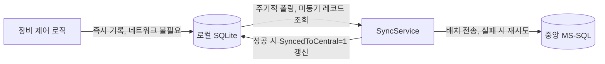

# 7장. 알람, 레시피 및 데이터 관리

[◀ 이전: 6장. WPF/MVVM 기반 HMI UI 구축](ch06-WPFMVVM기반HMIUI구축.md) | [📖 목차](00-목차.md) | [다음: 8장. 상위 시스템 및 외부 비전 연동 ▶](ch08-상위시스템과비전연동.md)


장비 제어 소프트웨어는 모터를 움직이고 I/O를 스캔하는 것만으로 완성되지 않는다. 현장에 설치된 장비는 24시간 가동되며, 그 과정에서 발생하는 이상 상황을 운영자에게 즉시 알려야 하고, 생산 제품이 바뀔 때마다 공정 파라미터를 빠르고 안전하게 교체해야 하며, 생산된 모든 결과와 장비의 동작 이력을 남겨 품질 추적과 원인 분석에 활용해야 한다. 이 세 가지—알람(Alarm), 레시피(Recipe), 데이터 이력(Data History)—은 5장에서 설계한 상태 머신, 6장에서 구축한 WPF/MVVM UI와 함께 장비 제어 소프트웨어의 "업무 계층"을 이룬다. 아무리 모션 제어가 정교해도 알람 하나를 놓쳐 라인이 멈추거나, 레시피를 잘못 적용해 불량이 대량으로 발생하거나, 생산 이력이 유실되어 품질 문제의 원인을 추적할 수 없다면 그 장비는 현장에서 신뢰받을 수 없다.

이번 장에서는 이 세 가지 축을 실무에서 바로 적용할 수 있는 수준까지 파고든다. 중앙집중식 `AlarmManager`를 설계해 5장의 FSM과 6장의 MVVM UI를 하나로 잇고, Serilog를 이용해 초당 수백~수천 건씩 발생할 수 있는 제어 로그를 성능 저하 없이 기록하는 방법을 다룬다. 이어서 JSON/XML 직렬화와 DB를 조합한 레시피 버전 관리 체계를 만들고, 마지막으로 SQLite와 MS-SQL을 함께 사용해 "로컬 우선, 지연 동기화" 데이터 아키텍처를 구축한다.

## 7.1 실시간 이벤트/알람 관리 엔진 및 UI 팝업

### 7.1.1 알람의 특성과 데이터 구조

장비 알람은 단순한 에러 메시지가 아니다. 실무에서 알람 시스템을 설계할 때는 다음과 같은 속성을 반드시 고려해야 한다.

- **우선순위(Severity)**: 경고(Warning)는 운영에 지장이 없지만 주의가 필요한 상황(예: 소모품 교체 시기 임박), 에러(Error)는 해당 축이나 유닛의 동작을 중단시키지만 장비 전체를 세우지는 않는 상황, 치명적(Fatal)은 장비 전체를 즉시 정지시키고 운영자의 확인 없이는 재기동할 수 없는 상황이다.
- **발생 시각과 해제 시각**: 언제 발생했고 언제 조건이 해소되었는지는 사후 분석과 MTBF(평균 고장 간격) 통계에 필수적이다.
- **확인(Acknowledge) 여부**: 운영자가 알람을 "인지했다"는 것을 명시적으로 기록해야 한다. 5장에서 설명했듯 Alarm 상태에서 벗어나려면 조건 해소만으로는 부족하고, 사람의 명시적 확인이 필요한 경우가 많다.
- **자동 해제 여부**: 조건이 사라지면 자동으로 사라지는 알람(예: 순간적인 통신 타임아웃)과, 조건이 사라져도 운영자가 Reset을 눌러야 사라지는 알람(예: 충돌 감지)을 구분해야 한다.

이 속성들을 정의(Definition)와 인스턴스(Instance)로 분리해서 설계하는 것이 핵심이다. 정의는 알람 코드마다 한 번만 존재하는 정적인 메타데이터이고, 인스턴스는 실제로 발생한 사건이다.

```csharp
/// <summary>
/// 알람의 심각도. 값이 클수록 심각한 알람이다.
/// </summary>
public enum AlarmSeverity
{
    Warning = 0,
    Error = 1,
    Fatal = 2
}

/// <summary>
/// 알람 정의. 애플리케이션 시작 시 카탈로그(코드→정의) 형태로 로드되며,
/// 런타임 중에는 변경되지 않는 정적 메타데이터다.
/// </summary>
public sealed class AlarmDefinition
{
    /// <summary>고유 알람 코드. 예: "AX01-OVERTRAVEL", "IO-VAC-LOSS"</summary>
    public string Code { get; init; } = string.Empty;

    /// <summary>운영자에게 표시할 메시지 템플릿. {0}, {1} 등의 플레이스홀더를 포함할 수 있다.</summary>
    public string MessageTemplate { get; init; } = string.Empty;

    public AlarmSeverity Severity { get; init; }

    /// <summary>알람이 속한 서브시스템 분류 (예: "Motion", "IO", "Communication", "Vision")</summary>
    public string Category { get; init; } = string.Empty;

    /// <summary>true면 발생 조건이 해소되는 즉시 자동으로 사라진다.
    /// false면 조건이 해소되어도 운영자의 Reset 조작이 있어야 사라진다.</summary>
    public bool AutoClear { get; init; }

    /// <summary>true면 이 알람이 활성 상태인 동안 FSM이 Alarm 상태를 벗어나려면
    /// 반드시 운영자의 명시적 Acknowledge가 필요하다.</summary>
    public bool RequiresAcknowledge { get; init; } = true;

    /// <summary>연동 매뉴얼/트러블슈팅 가이드 참조 번호 (선택)</summary>
    public string? HelpReference { get; init; }
}

/// <summary>
/// 알람 인스턴스의 현재 상태.
/// </summary>
public enum AlarmState
{
    /// <summary>발생 중이며 아직 확인되지 않음</summary>
    Active,
    /// <summary>확인은 되었으나 발생 조건은 아직 유지 중</summary>
    Acknowledged,
    /// <summary>조건이 해소되어 목록에서 제거 대상</summary>
    Cleared
}

/// <summary>
/// 실제로 발생한 하나의 알람 사건. AlarmDefinition을 참조하며,
/// 발생 시점의 컨텍스트(어느 축, 어떤 값)를 함께 보관한다.
/// </summary>
public sealed class AlarmInstance : INotifyPropertyChanged
{
    public Guid InstanceId { get; } = Guid.NewGuid();
    public AlarmDefinition Definition { get; }

    /// <summary>메시지 템플릿에 채워 넣을 컨텍스트 인자 (예: 축 이름, 좌표값)</summary>
    public object[] MessageArgs { get; }

    public string DisplayMessage => string.Format(Definition.MessageTemplate, MessageArgs);

    public DateTimeOffset OccurredAt { get; }
    public DateTimeOffset? AcknowledgedAt { get; private set; }
    public string? AcknowledgedBy { get; private set; }
    public DateTimeOffset? ClearedAt { get; private set; }

    private AlarmState _state;
    public AlarmState State
    {
        get => _state;
        private set { _state = value; OnPropertyChanged(); }
    }

    public AlarmInstance(AlarmDefinition definition, params object[] args)
    {
        Definition = definition;
        MessageArgs = args;
        OccurredAt = DateTimeOffset.Now;
        State = AlarmState.Active;
    }

    public void Acknowledge(string operatorId)
    {
        if (State == AlarmState.Cleared) return;
        AcknowledgedAt = DateTimeOffset.Now;
        AcknowledgedBy = operatorId;
        State = AlarmState.Acknowledged;
    }

    public void Clear()
    {
        ClearedAt = DateTimeOffset.Now;
        State = AlarmState.Cleared;
    }

    public event PropertyChangedEventHandler? PropertyChanged;
    private void OnPropertyChanged([CallerMemberName] string? name = null)
        => PropertyChanged?.Invoke(this, new PropertyChangedEventArgs(name));
}
```

`Definition`과 `Instance`를 분리해두면, 알람 카탈로그(수백 개의 `AlarmDefinition`)를 CSV나 JSON 파일로 관리하면서 다국어 메시지 전환이나 신규 알람 추가를 코드 재컴파일 없이 처리할 수 있다는 실무적 이점도 생긴다.

### 7.1.2 중앙집중식 AlarmManager 설계

장비 안에는 축 컨트롤러, I/O 스캐너, 통신 드라이버, 비전 연동 모듈 등 알람을 발생시킬 수 있는 주체가 여러 개 존재한다. 이들이 각자 UI를 직접 갱신하도록 만들면 스레드 안전성 문제와 중복 로직이 걷잡을 수 없이 늘어난다. 대신 하나의 `AlarmManager`가 모든 알람 발생/해제 요청을 이벤트 기반으로 수집하고, UI는 오직 이 `AlarmManager`만 구독하도록 설계한다.

```csharp
public interface IAlarmManager
{
    ObservableCollection<AlarmInstance> ActiveAlarms { get; }

    event EventHandler<AlarmInstance>? AlarmRaised;
    event EventHandler<AlarmInstance>? AlarmCleared;
    event EventHandler<AlarmInstance>? AlarmAcknowledged;

    AlarmInstance Raise(string alarmCode, params object[] args);
    void Clear(string alarmCode);
    void Acknowledge(Guid instanceId, string operatorId);
    void AcknowledgeAll(string operatorId);

    bool HasUnacknowledgedFatal { get; }
}

public sealed class AlarmManager : IAlarmManager
{
    private readonly IReadOnlyDictionary<string, AlarmDefinition> _catalog;
    private readonly ILogger _logger;               // 7.2절의 Serilog ILogger
    private readonly Dispatcher _uiDispatcher;       // WPF UI 스레드 마샬링용

    // 코드별 현재 활성 인스턴스. 동일 코드가 여러 축에서 동시에 발생할 수 있으므로
    // 실제로는 (code, args 식별키) 조합을 키로 쓰는 경우가 많다. 여기서는 단순화한다.
    private readonly ConcurrentDictionary<string, AlarmInstance> _activeByCode = new();

    public ObservableCollection<AlarmInstance> ActiveAlarms { get; } = new();

    public event EventHandler<AlarmInstance>? AlarmRaised;
    public event EventHandler<AlarmInstance>? AlarmCleared;
    public event EventHandler<AlarmInstance>? AlarmAcknowledged;

    public AlarmManager(IReadOnlyDictionary<string, AlarmDefinition> catalog,
                         ILogger logger, Dispatcher uiDispatcher)
    {
        _catalog = catalog;
        _logger = logger.ForContext<AlarmManager>();
        _uiDispatcher = uiDispatcher;
    }

    public AlarmInstance Raise(string alarmCode, params object[] args)
    {
        if (!_catalog.TryGetValue(alarmCode, out var def))
            throw new InvalidOperationException($"미등록 알람 코드: {alarmCode}");

        // 이미 활성 상태라면 중복 발생시키지 않는다(알람 폭주 방지).
        if (_activeByCode.TryGetValue(alarmCode, out var existing) &&
            existing.State != AlarmState.Cleared)
        {
            return existing;
        }

        var instance = new AlarmInstance(def, args);
        _activeByCode[alarmCode] = instance;

        // 구조화 로깅: 나중에 알람 코드/축/심각도별로 검색·필터링할 수 있도록
        // 문자열이 아닌 속성(Property) 형태로 남긴다. (7.2절 참조)
        _logger.Warning(
            "알람 발생 {AlarmCode} 심각도={Severity} 메시지={Message}",
            def.Code, def.Severity, instance.DisplayMessage);

        // ObservableCollection은 반드시 UI 스레드에서만 변경해야 한다.
        // 모션 스레드/통신 스레드 등 임의 스레드에서 Raise가 호출될 수 있으므로
        // Dispatcher를 통해 UI 스레드로 마샬링한다. (2장 참조)
        _uiDispatcher.Invoke(() => ActiveAlarms.Add(instance));

        AlarmRaised?.Invoke(this, instance);
        return instance;
    }

    public void Clear(string alarmCode)
    {
        if (!_activeByCode.TryGetValue(alarmCode, out var instance)) return;
        if (instance.State == AlarmState.Cleared) return;

        var def = instance.Definition;

        if (def.AutoClear)
        {
            instance.Clear();
            _uiDispatcher.Invoke(() => ActiveAlarms.Remove(instance));
            _activeByCode.TryRemove(alarmCode, out _);
            _logger.Information("알람 자동 해제 {AlarmCode}", alarmCode);
            AlarmCleared?.Invoke(this, instance);
        }
        else
        {
            // 확인이 필요한 알람은 조건이 해소되어도 목록에 남겨두고
            // "해소됨(조건은 사라졌으나 미확인)" 표시만 갱신한다.
            _logger.Information("알람 조건 해소, 확인 대기 중 {AlarmCode}", alarmCode);
        }
    }

    public void Acknowledge(Guid instanceId, string operatorId)
    {
        var instance = ActiveAlarms.FirstOrDefault(a => a.InstanceId == instanceId);
        if (instance is null) return;

        instance.Acknowledge(operatorId);
        _logger.Information(
            "알람 확인 {AlarmCode} 작업자={OperatorId}",
            instance.Definition.Code, operatorId);

        if (instance.Definition.AutoClear == false)
        {
            _uiDispatcher.Invoke(() => ActiveAlarms.Remove(instance));
            _activeByCode.TryRemove(instance.Definition.Code, out _);
        }

        AlarmAcknowledged?.Invoke(this, instance);
    }

    public void AcknowledgeAll(string operatorId)
    {
        foreach (var alarm in ActiveAlarms.Where(a => a.State == AlarmState.Active).ToList())
            Acknowledge(alarm.InstanceId, operatorId);
    }

    public bool HasUnacknowledgedFatal =>
        ActiveAlarms.Any(a => a.Definition.Severity == AlarmSeverity.Fatal
                               && a.State == AlarmState.Active);
}
```

`AlarmManager`를 DI 컨테이너에 싱글턴으로 등록해두면, 모션 컨트롤러 계층(4장), 통신 드라이버 계층(3장), FSM(5장) 어디에서나 동일한 인스턴스를 주입받아 `Raise`/`Clear`를 호출할 수 있다. 서로 다른 스레드에서 동시에 호출되더라도 `ConcurrentDictionary`와 `Dispatcher.Invoke`가 안전성을 보장한다.

### 7.1.3 FSM과의 연동: Alarm 상태 전이

5장에서 설계한 상태 머신은 `Fault`/`Alarm` 상태를 별도로 두고, 어떤 상태에서든 치명적 조건이 발생하면 즉시 그 상태로 전이하도록 설계했다. 이 전이가 실제로 `AlarmManager`를 호출하도록 연결하는 지점이 시스템 전체의 안전성을 좌우한다.

```csharp
public class EquipmentStateMachine
{
    private readonly IAlarmManager _alarmManager;
    private EquipmentState _current = EquipmentState.Idle;

    public EquipmentStateMachine(IAlarmManager alarmManager)
    {
        _alarmManager = alarmManager;
        // Acknowledge 이벤트를 구독해, 모든 Fatal 알람이 해소/확인되었을 때만
        // Alarm 상태를 벗어날 수 있도록 한다.
        _alarmManager.AlarmAcknowledged += (_, _) => TryRecoverFromAlarm();
        _alarmManager.AlarmCleared += (_, _) => TryRecoverFromAlarm();
    }

    /// <summary>
    /// 축 드라이버, I/O 스캐너 등 하위 계층에서 이상을 감지했을 때 호출하는 진입점.
    /// FSM은 이 호출을 받으면 즉시 Alarm 상태로 전이하고, 동시에 AlarmManager에 등록한다.
    /// </summary>
    public void ReportFault(string alarmCode, params object[] args)
    {
        var instance = _alarmManager.Raise(alarmCode, args);

        if (instance.Definition.Severity == AlarmSeverity.Fatal)
            TransitionTo(EquipmentState.Alarm);
        else if (instance.Definition.Severity == AlarmSeverity.Error
                 && _current == EquipmentState.Running)
            TransitionTo(EquipmentState.Paused);
        // Warning은 상태 전이를 유발하지 않고 UI 표시만 갱신된다.
    }

    private void TryRecoverFromAlarm()
    {
        if (_current != EquipmentState.Alarm) return;

        // 5장의 원칙: Alarm에서 벗어나려면 "조건 해소"만으로는 부족하고,
        // 확인이 필요한(RequiresAcknowledge) 모든 알람이 확인 완료 상태여야 한다.
        bool blockingAlarmRemains = _alarmManager.ActiveAlarms.Any(a =>
            a.Definition.Severity == AlarmSeverity.Fatal &&
            a.Definition.RequiresAcknowledge &&
            a.State == AlarmState.Active);

        if (!blockingAlarmRemains)
            TransitionTo(EquipmentState.Idle);
    }

    private void TransitionTo(EquipmentState next)
    {
        // 실제 구현은 5장에서 다룬 Guard/Entry/Exit 액션 파이프라인을 거친다.
        _current = next;
    }
}
```

이렇게 FSM이 `AlarmManager.Raise`를 직접 호출하는 구조를 취하면, "어떤 상태에서든 알람이 발생할 수 있다"는 5장의 원칙과 "알람은 한 곳에서만 관리한다"는 이번 장의 원칙이 자연스럽게 결합된다. FSM은 알람의 발생/해제를 직접 추적할 필요 없이 `AlarmManager`의 이벤트만 구독하면 된다.

### 7.1.4 UI 바인딩과 모달 팝업 (6장 MVVM 연동)

`AlarmManager.ActiveAlarms`는 이미 `ObservableCollection<AlarmInstance>`이므로, 6장에서 구축한 MVVM 패턴에 그대로 바인딩할 수 있다. `MainViewModel`이 `IAlarmManager`를 주입받아 View에 노출하는 것이 가장 단순한 방법이다.

```csharp
public class AlarmListViewModel : ObservableObject
{
    private readonly IAlarmManager _alarmManager;
    private readonly string _currentOperatorId;

    public ObservableCollection<AlarmInstance> ActiveAlarms => _alarmManager.ActiveAlarms;

    public ICommand AcknowledgeCommand { get; }
    public ICommand AcknowledgeAllCommand { get; }

    public AlarmListViewModel(IAlarmManager alarmManager, ICurrentOperator operatorInfo)
    {
        _alarmManager = alarmManager;
        _currentOperatorId = operatorInfo.OperatorId;

        AcknowledgeCommand = new RelayCommand<AlarmInstance>(alarm =>
            _alarmManager.Acknowledge(alarm!.InstanceId, _currentOperatorId));

        AcknowledgeAllCommand = new RelayCommand(
            () => _alarmManager.AcknowledgeAll(_currentOperatorId));
    }
}
```

XAML에서는 심각도별로 배경색을 다르게 표시하는 `IValueConverter`를 함께 사용하면 운영자가 한눈에 우선순위를 파악할 수 있다.

```xml
<ListView ItemsSource="{Binding ActiveAlarms}">
    <ListView.ItemTemplate>
        <DataTemplate>
            <Grid Background="{Binding Definition.Severity,
                                Converter={StaticResource SeverityToBrushConverter}}">
                <StackPanel Orientation="Horizontal" Margin="4">
                    <TextBlock Text="{Binding OccurredAt, StringFormat='HH:mm:ss'}" Width="80"/>
                    <TextBlock Text="{Binding Definition.Code}" Width="140" FontWeight="Bold"/>
                    <TextBlock Text="{Binding DisplayMessage}" Width="300"/>
                    <TextBlock Text="{Binding State}" Width="100"/>
                    <Button Content="확인" Command="{Binding DataContext.AcknowledgeCommand,
                             RelativeSource={RelativeSource AncestorType=ListView}}"
                            CommandParameter="{Binding}"/>
                </StackPanel>
            </Grid>
        </DataTemplate>
    </ListView.ItemTemplate>
</ListView>
```

치명적(Fatal) 알람은 리스트 표시만으로는 부족하다. 운영자가 다른 화면을 보고 있어도 즉시 인지하고 확인하도록 **모달 팝업**을 강제해야 한다. 이를 위해 `AlarmRaised` 이벤트를 구독하는 전용 팝업 서비스를 둔다.

```csharp
public interface IAlarmPopupService
{
    void Start();
}

/// <summary>
/// Fatal 알람이 발생하면 모달 다이얼로그를 큐에 넣고, 순서대로 사용자에게 확인을 강제한다.
/// 여러 Fatal 알람이 동시에 몰려도 다이얼로그가 겹치지 않도록 큐를 사용한다.
/// </summary>
public class AlarmPopupService : IAlarmPopupService
{
    private readonly IAlarmManager _alarmManager;
    private readonly Dispatcher _uiDispatcher;
    private readonly Queue<AlarmInstance> _pending = new();
    private bool _dialogOpen;

    public AlarmPopupService(IAlarmManager alarmManager, Dispatcher uiDispatcher)
    {
        _alarmManager = alarmManager;
        _uiDispatcher = uiDispatcher;
    }

    public void Start() => _alarmManager.AlarmRaised += OnAlarmRaised;

    private void OnAlarmRaised(object? sender, AlarmInstance instance)
    {
        if (instance.Definition.Severity != AlarmSeverity.Fatal) return;

        _uiDispatcher.Invoke(() =>
        {
            _pending.Enqueue(instance);
            if (!_dialogOpen) ShowNext();
        });
    }

    private void ShowNext()
    {
        if (_pending.Count == 0) { _dialogOpen = false; return; }

        _dialogOpen = true;
        var instance = _pending.Dequeue();

        var dialog = new AlarmConfirmWindow(instance) { Owner = Application.Current.MainWindow };
        // ShowDialog는 호출 스레드를 블록하여 사용자가 확인 전까지
        // 다른 조작(다른 창 포커스 포함)을 못 하도록 강제하는 데 사용된다.
        bool? confirmed = dialog.ShowDialog();

        if (confirmed == true)
            _alarmManager.Acknowledge(instance.InstanceId, dialog.OperatorId);

        ShowNext(); // 큐에 남은 다음 Fatal 알람을 이어서 표시
    }
}
```

`ShowDialog()`는 호출한 스레드(여기서는 UI 스레드)의 메시지 루프를 블록하면서도 내부적으로 새로운 중첩 메시지 루프를 돌리므로, 다른 UI 이벤트 처리는 막힌 채로 이 다이얼로그만 활성화된다. 이 방식으로 "치명적 알람은 반드시 확인해야만 다음 조작이 가능하다"는 요구사항을 물리적으로 강제할 수 있다.

### 7.1.5 Acknowledge 처리와 FSM 복귀 원칙의 실제 구현

5장에서 "Alarm 상태에서 벗어나려면 명시적 확인이 필요하다"는 원칙을 세웠다면, 이번 절의 `AlarmManager.Acknowledge` → `AlarmAcknowledged` 이벤트 → FSM의 `TryRecoverFromAlarm`으로 이어지는 파이프라인이 그 원칙의 실제 구현이다. 이 흐름을 표로 정리하면 다음과 같다.

| 단계 | 주체 | 동작 |
|---|---|---|
| 1 | 하위 드라이버(4장) | 이상 감지 → `FSM.ReportFault(code)` 호출 |
| 2 | FSM(5장) | `AlarmManager.Raise` 호출 후 즉시 `Alarm` 상태로 전이 |
| 3 | AlarmManager | `ActiveAlarms`에 추가, `AlarmRaised` 이벤트 발행 |
| 4 | UI(6장)/PopupService | 리스트 갱신, Fatal이면 모달 팝업 표시 |
| 5 | 운영자 | 원인 조치 후 "확인" 버튼 클릭 |
| 6 | AlarmManager | `Acknowledge` 호출, 이력 남기고 `AlarmAcknowledged` 발행 |
| 7 | FSM | 이벤트 수신 → 남은 차단 알람이 없으면 `Idle`로 복귀 |

이 파이프라인의 핵심은 3단계와 7단계가 **완전히 분리**되어 있다는 점이다. FSM은 알람이 언제 어떻게 확인되는지 알 필요가 없고, 오직 "현재 확인되지 않은 차단 알람이 남아 있는가"만 질의한다. 이렇게 관심사를 분리해두면 향후 원격 SCADA 시스템에서 Acknowledge를 보내오는 경우(8장에서 다룰 상위 시스템 연동)에도 `AlarmManager.Acknowledge`만 호출하면 되므로 FSM이나 UI 코드를 전혀 수정할 필요가 없다.

## 7.2 Serilog/NLog를 활용한 대용량 실시간 제어 로그 수집

### 7.2.1 왜 장비 제어 로그는 대용량·고빈도인가

일반적인 업무 애플리케이션의 로그는 사용자 액션 단위(버튼 클릭, API 호출)로 발생하지만, 장비 제어 소프트웨어는 성격이 다르다.

- **모든 축의 이동 명령과 완료 이벤트**: 축 하나가 초당 수십 회의 위치 갱신 이벤트를 발생시킬 수 있고, 장비에 축이 여러 개면 이 수치는 곱절로 늘어난다.
- **모든 I/O 변화**: 4장에서 다룬 I/O 스캐너는 수백 개 포인트를 수 밀리초 주기로 스캔하며, 상태가 바뀔 때마다 로그를 남기면 짧은 시간에도 대량의 레코드가 쌓인다.
- **모든 통신 패킷**: 3장에서 다룬 시리얼/TCP 통신에서 송수신되는 원시 패킷을 그대로 남기면 디버깅에는 유용하지만 매우 빠르게 파일 용량이 커진다.

이런 로그를 동기적으로(로그 호출이 디스크 쓰기가 끝날 때까지 스레드를 블록하는 방식으로) 기록하면, 로깅 자체가 모션 제어 루프의 실시간성을 해치는 역설적인 상황이 벌어진다. 따라서 다음 두 가지 원칙이 실무에서 필수적이다.

1. **비동기 로깅**: 로그 호출은 메모리 큐에 넣고 즉시 반환하며, 실제 디스크 I/O는 별도의 백그라운드 스레드가 배치로 처리한다.
2. **파일 롤링**: 하나의 로그 파일이 무한정 커지지 않도록 일별 또는 크기별로 새 파일을 생성하고, 오래된 파일은 자동으로 정리(retention)한다.

### 7.2.2 Serilog 설정: 구조화 로깅과 파일 롤링

Serilog는 `Serilog`, `Serilog.Sinks.File`, `Serilog.Sinks.Async`, `Serilog.Enrichers.Thread` NuGet 패키지로 구성한다. 애플리케이션 시작 시(예: `App.xaml.cs`의 `OnStartup`)에 전역 `Log.Logger`를 한 번 구성한다.

```csharp
using Serilog;
using Serilog.Events;

public static class LoggingBootstrapper
{
    public static void Configure()
    {
        Log.Logger = new LoggerConfiguration()
            .MinimumLevel.Debug()
            // 특정 네임스페이스는 더 상세히, 다른 곳은 더 간략히 조절 가능
            .MinimumLevel.Override("System.Net.Http", LogEventLevel.Warning)
            .Enrich.FromLogContext()
            .Enrich.WithThreadId()
            .Enrich.WithProperty("Application", "EquipCtrl")
            .Enrich.WithProperty("EquipmentId", Environment.MachineName)
            .WriteTo.Async(a => a.File(
                path: "logs/event-.log",
                rollingInterval: RollingInterval.Day,     // 일별 롤링
                fileSizeLimitBytes: 100 * 1024 * 1024,    // 100MB 초과 시 추가 롤링
                rollOnFileSizeLimit: true,
                retainedFileCountLimit: 30,               // 30일치만 보관
                outputTemplate:
                    "{Timestamp:yyyy-MM-dd HH:mm:ss.fff} [{Level:u3}] " +
                    "(T{ThreadId}) {SourceContext}: {Message:lj} {Properties:j}{NewLine}{Exception}"))
            .CreateLogger();
    }
}
```

`WriteTo.Async(...)`로 File sink를 감싸는 것이 비동기 로깅의 핵심이다. `Log.Information(...)` 등의 호출은 내부 `BoundedChannel`에 로그 이벤트를 넣고 즉시 반환하며, 실제 파일 쓰기는 별도 스레드가 배치 처리한다. 이렇게 하면 모션 제어 루프나 I/O 스캔 루프가 로깅 때문에 지연되는 것을 방지할 수 있다.

**구조화 로깅**이란 `"축1 이동 완료: 위치=120.5"`처럼 하나의 문자열로 뭉뚱그려 남기는 대신, 아래처럼 메시지 템플릿과 속성을 분리해서 남기는 방식이다.

```csharp
private static readonly ILogger AxisLog = Log.ForContext("SourceContext", "AxisController");

public void OnMoveCompleted(string axisName, double position, double durationMs)
{
    AxisLog.Information(
        "축 이동 완료 {AxisName} 위치={Position} 소요시간={DurationMs}ms",
        axisName, position, durationMs);
}
```

Serilog의 File sink는 기본적으로 이 속성들을 사람이 읽는 텍스트로 렌더링하지만, `Serilog.Formatting.Compact`의 `CompactJsonFormatter`를 사용하면 각 로그 라인이 JSON 객체로 저장되어 이후 로그 분석 도구(예: 사내 로그 뷰어, Seq, Elasticsearch)로 손쉽게 질의할 수 있다.

```csharp
using Serilog.Formatting.Compact;

.WriteTo.Async(a => a.File(
    new CompactJsonFormatter(),
    path: "logs/event-.clef",
    rollingInterval: RollingInterval.Day))
```

`"AxisName": "X1"`, `"Position": 120.5`처럼 속성이 그대로 필드가 되므로, "지난주 X1 축에서 이동 소요시간이 500ms를 넘은 모든 기록"과 같은 질의를 문자열 파싱 없이 바로 수행할 수 있다. 이는 단순 `Console.WriteLine` 기반 로깅과 구조화 로깅의 결정적 차이다.

**로그 레벨 전략**은 다음 기준으로 나눈다.

| 레벨 | 용도 | 평소 활성화 여부 |
|---|---|---|
| Verbose | 통신 패킷 원문, 서보 루프 내부 값 등 극도로 상세한 정보 | 평소 비활성, 문제 발생 시에만 |
| Debug | 함수 진입/종료, 파라미터 값 등 개발 디버깅용 | 개발 중에만, 운영 중엔 비활성 |
| Information | 상태 전이, 레시피 적용, 생산 시작/종료 등 정상 업무 이벤트 | 항상 활성 |
| Warning | 경고 알람, 재시도 발생 등 | 항상 활성 |
| Error | 에러 알람, 예외 발생 | 항상 활성 |
| Fatal | 치명적 알람, 장비 정지를 유발한 예외 | 항상 활성 |

### 7.2.3 이벤트 로그와 트레이스 로그의 분리

실무에서는 로그를 하나의 흐름으로 섞지 않고, 목적이 다른 두 개의 로거로 분리하는 것이 관리에 훨씬 유리하다.

- **이벤트 로그(Event Log)**: 상태 전이, 알람 발생/해제, 레시피 적용, 사용자 조작 등 "무슨 일이 있었는가"를 기록한다. 항상 켜져 있고, 파일 크기가 작아 오래 보관 가능하다. 품질 추적, 생산 이력 조회에 사용된다.
- **트레이스 로그(Trace Log)**: 서보 명령의 세부 값, 통신 패킷 원문, 내부 계산 중간값 등 "왜 그런 일이 있었는가"를 진단하기 위한 상세 정보다. 평소에는 꺼두고, 현장에서 재현하기 어려운 문제가 발생했을 때만 켠다.

두 로거를 물리적으로 다른 파일에, 다른 `LoggingLevelSwitch`로 제어되도록 구성한다.

```csharp
public static class LoggingBootstrapper
{
    // 런타임 중 레벨을 동적으로 바꿀 수 있는 스위치. 트레이스 로그 On/Off에 사용.
    public static readonly LoggingLevelSwitch TraceLevelSwitch =
        new(LogEventLevel.Information); // 평소엔 Verbose/Debug를 걸러낸다

    public static void Configure()
    {
        var eventLogger = new LoggerConfiguration()
            .MinimumLevel.Information()
            .Enrich.FromLogContext()
            .WriteTo.Async(a => a.File(
                path: "logs/event-.log",
                rollingInterval: RollingInterval.Day,
                retainedFileCountLimit: 90))     // 이벤트 로그는 90일 보관
            .CreateLogger();

        var traceLogger = new LoggerConfiguration()
            .MinimumLevel.ControlledBy(TraceLevelSwitch)
            .Enrich.FromLogContext()
            .WriteTo.Async(a => a.File(
                path: "logs/trace-.log",
                rollingInterval: RollingInterval.Hour,  // 상세 로그는 시간별로 롤링
                fileSizeLimitBytes: 200 * 1024 * 1024,
                rollOnFileSizeLimit: true,
                retainedFileCountLimit: 48))             // 최근 이틀치만 보관
            .CreateLogger();

        Log.Logger = eventLogger;
        TraceLog.Logger = traceLogger;
    }

    /// <summary>운영자가 "상세 로그 켜기" 버튼을 눌렀을 때 호출.
    /// 예: 10분 후 자동으로 다시 끄는 타이머와 함께 사용한다.</summary>
    public static void EnableTraceLogging(TimeSpan duration)
    {
        TraceLevelSwitch.MinimumLevel = LogEventLevel.Verbose;
        Log.Information("트레이스 로그 활성화, {Duration} 후 자동 비활성화", duration);

        _ = Task.Delay(duration).ContinueWith(_ =>
        {
            TraceLevelSwitch.MinimumLevel = LogEventLevel.Information;
            Log.Information("트레이스 로그 자동 비활성화");
        });
    }
}

/// <summary>트레이스 전용 로거에 접근하기 위한 정적 헬퍼</summary>
public static class TraceLog
{
    public static ILogger Logger { get; set; } = Serilog.Core.Logger.None;
}
```

통신 드라이버(3장)에서는 이 `TraceLog.Logger`를 사용해 원시 패킷을 남긴다.

```csharp
TraceLog.Logger.Verbose("TX {Port} {BytesHex}", portName, BitConverter.ToString(txBuffer));
TraceLog.Logger.Verbose("RX {Port} {BytesHex}", portName, BitConverter.ToString(rxBuffer));
```

`LoggingLevelSwitch`를 `MinimumLevel.ControlledBy`로 연결해두면, `TraceLevelSwitch.MinimumLevel`을 바꾸는 것만으로 로거 재구성 없이 즉시 로그 볼륨이 늘거나 준다. 이는 현장에서 "지금 발생 중인 간헐적 통신 오류를 재현 중이니 10분만 상세 로그를 켜달라"는 요청에 애플리케이션을 재시작하지 않고 대응할 수 있게 해준다.

NLog를 선호하는 팀이라면 동일한 개념을 `nlog.config`의 `<rules>`와 `<targets>`로 구성할 수 있다. NLog는 XML 설정 파일을 애플리케이션 재시작 없이 자동으로 다시 읽어들이는 `autoReload="true"` 옵션을 제공하므로, 운영 중 로그 레벨을 파일 수정만으로 바꾸고 싶은 경우에 적합하다. 두 라이브러리 모두 비동기 래퍼(`Serilog.Sinks.Async`, NLog의 `AsyncWrapper` target)와 파일 롤링을 지원하므로, 팀의 기존 인프라나 선호도에 따라 선택하면 된다. 이 책의 이후 예제는 Serilog를 기준으로 계속 진행한다.

## 7.3 Recipe 관리: JSON/XML 직렬화 및 DB 기반 파라미터 버전 관리

### 7.3.1 레시피란 무엇인가

레시피는 특정 제품이나 공정 조건에 필요한 파라미터의 집합에 이름을 붙여 저장해둔 것이다. 예를 들어 본딩 장비라면 "제품A-표준" 레시피에 본딩 온도, 압착 속도, 목표 위치, 유지 시간 등이 담기고, 작업자는 생산할 제품이 바뀔 때마다 해당 레시피를 불러와(Load) 장비에 적용(Download)한다. 레시피 하나 바꾸는 것만으로 수십 개의 파라미터를 동시에 정확하게 전환할 수 있다는 것이 핵심 가치이며, 반대로 잘못된 레시피가 적용되면 대량 불량으로 직결될 수 있다는 점에서 안전장치가 매우 중요하다.

```csharp
public class RecipeParameter
{
    public string Name { get; set; } = string.Empty;
    public double Value { get; set; }
    public string Unit { get; set; } = string.Empty;
    public double MinValue { get; set; }
    public double MaxValue { get; set; }
}

public class Recipe
{
    public string RecipeName { get; set; } = string.Empty;
    public int Version { get; set; }
    public string Author { get; set; } = string.Empty;
    public DateTimeOffset CreatedAt { get; set; }
    public string? Description { get; set; }
    public List<RecipeParameter> Parameters { get; set; } = new();
}
```

### 7.3.2 System.Text.Json을 이용한 직렬화

`System.Text.Json`은 .NET에 기본 내장되어 있고 성능이 우수하며, 사람이 읽고 수정하기 쉬운 형식이라 현장 엔지니어가 텍스트 편집기로 직접 값을 확인/수정하는 경우에도 유용하다.

```csharp
using System.Text.Json;
using System.Text.Json.Serialization;

public static class RecipeJsonStore
{
    private static readonly JsonSerializerOptions Options = new()
    {
        WriteIndented = true,
        PropertyNamingPolicy = JsonNamingPolicy.CamelCase,
        DefaultIgnoreCondition = JsonIgnoreCondition.WhenWritingNull,
    };

    public static void Save(Recipe recipe, string filePath)
    {
        string json = JsonSerializer.Serialize(recipe, Options);
        File.WriteAllText(filePath, json);
    }

    public static Recipe Load(string filePath)
    {
        string json = File.ReadAllText(filePath);
        return JsonSerializer.Deserialize<Recipe>(json, Options)
               ?? throw new InvalidDataException($"레시피 파일 파싱 실패: {filePath}");
    }
}
```

저장된 JSON 예시:

```json
{
  "recipeName": "ProductA-Standard",
  "version": 3,
  "author": "shshim",
  "createdAt": "2026-08-20T09:15:00+09:00",
  "description": "제품A 표준 공정 v3, 압착 속도 상향 조정",
  "parameters": [
    { "name": "BondTemperature", "value": 185.0, "unit": "C", "minValue": 150.0, "maxValue": 220.0 },
    { "name": "PressSpeed", "value": 12.5, "unit": "mm/s", "minValue": 5.0, "maxValue": 30.0 },
    { "name": "HoldTimeMs", "value": 800.0, "unit": "ms", "minValue": 100.0, "maxValue": 3000.0 }
  ]
}
```

### 7.3.3 XmlSerializer와의 비교

`System.Xml.Serialization.XmlSerializer`는 오래되었지만 여전히 널리 쓰인다. 특히 다른 벤더의 상위 시스템이나 레거시 PLC 툴체인과 파일을 주고받아야 하는 경우, XML 스키마(XSD)로 구조를 엄격하게 정의하고 검증할 수 있다는 점에서 상호운용성이 요구되는 환경에 유리하다.

```csharp
using System.Xml.Serialization;

[XmlRoot("Recipe")]
public class RecipeXml
{
    [XmlAttribute] public string RecipeName { get; set; } = string.Empty;
    [XmlAttribute] public int Version { get; set; }
    [XmlElement("Parameter")]
    public List<RecipeParameter> Parameters { get; set; } = new();
}

public static class RecipeXmlStore
{
    private static readonly XmlSerializer Serializer = new(typeof(RecipeXml));

    public static void Save(RecipeXml recipe, string filePath)
    {
        using var writer = new StreamWriter(filePath);
        Serializer.Serialize(writer, recipe);
    }

    public static RecipeXml Load(string filePath)
    {
        using var reader = new StreamReader(filePath);
        return (RecipeXml)Serializer.Deserialize(reader)!;
    }
}
```

두 방식을 실무 기준으로 비교하면 다음과 같다.

| 기준 | JSON (`System.Text.Json`) | XML (`XmlSerializer`) |
|---|---|---|
| 가독성 | 간결, 현장 엔지니어가 텍스트로 수정하기 쉬움 | 태그가 많아 장황하지만 구조가 명확 |
| 스키마 검증 | 자체적으로는 약함(수동 검증 필요) | XSD로 엄격한 스키마 검증 가능 |
| 상호운용성 | 최신 시스템/REST API와 궁합이 좋음 | 레거시 산업 장비, 일부 PLC 툴체인과 궁합이 좋음 |
| 성능 | 일반적으로 더 가볍고 빠름 | 상대적으로 무거움 |
| .NET 기본 지원 | 예 (외부 패키지 불필요) | 예 (외부 패키지 불필요) |

신규 개발이라면 특별한 상호운용 요구가 없는 한 JSON을 기본으로 채택하고, 상위 시스템이나 외부 장비와 표준화된 스키마 교환이 필요한 경우에만 XML을 병행하는 것이 실무에서 흔한 선택이다.

### 7.3.4 DB 기반 버전 관리

파일 하나로 레시피를 관리하면 "누가, 언제, 왜 값을 바꿨는지" 이력을 추적할 수 없고, 실수로 덮어쓴 값을 되돌릴 방법도 없다. 공정 파라미터 변경은 품질 문제와 직결되므로, 실무에서는 파일이 아닌 DB에 버전별로 이력을 남기는 것이 표준적인 방식이다. 다음은 SQLite/MS-SQL 양쪽에서 공통으로 사용할 수 있는 스키마 예시다.

```sql
CREATE TABLE RecipeHeader (
    RecipeId       INTEGER PRIMARY KEY AUTOINCREMENT,
    RecipeName     TEXT NOT NULL,
    CurrentVersion INTEGER NOT NULL DEFAULT 1
);

CREATE TABLE RecipeVersion (
    RecipeVersionId INTEGER PRIMARY KEY AUTOINCREMENT,
    RecipeId        INTEGER NOT NULL REFERENCES RecipeHeader(RecipeId),
    Version         INTEGER NOT NULL,
    Author          TEXT NOT NULL,
    CreatedAt       TEXT NOT NULL,     -- ISO-8601
    ChangeReason    TEXT,              -- 변경 사유 (예: "압착 속도 조정으로 사이클타임 단축")
    IsActive        INTEGER NOT NULL DEFAULT 0,  -- 현재 장비에 적용 중인 버전인지
    UNIQUE(RecipeId, Version)
);

CREATE TABLE RecipeParameterValue (
    RecipeVersionId INTEGER NOT NULL REFERENCES RecipeVersion(RecipeVersionId),
    ParamName       TEXT NOT NULL,
    Value           REAL NOT NULL,
    Unit            TEXT,
    MinValue        REAL,
    MaxValue        REAL,
    PRIMARY KEY (RecipeVersionId, ParamName)
);
```

새 버전을 저장하는 것은 항상 "새 행 삽입"이며, 기존 버전 행을 수정(UPDATE)하지 않는다. 이렇게 append-only로 관리해야 이력이 절대 유실되지 않는다.

```csharp
public class RecipeRepository
{
    private readonly string _connectionString;
    public RecipeRepository(string connectionString) => _connectionString = connectionString;

    public int SaveNewVersion(Recipe recipe, string author, string changeReason)
    {
        using var conn = new Microsoft.Data.Sqlite.SqliteConnection(_connectionString);
        conn.Open();
        using var tx = conn.BeginTransaction();

        // 1) 헤더 확보 (없으면 생성)
        long recipeId;
        using (var cmd = conn.CreateCommand())
        {
            cmd.Transaction = tx;
            cmd.CommandText = "SELECT RecipeId FROM RecipeHeader WHERE RecipeName = $name";
            cmd.Parameters.AddWithValue("$name", recipe.RecipeName);
            var result = cmd.ExecuteScalar();

            if (result is null)
            {
                cmd.CommandText =
                    "INSERT INTO RecipeHeader (RecipeName, CurrentVersion) VALUES ($name, 0); " +
                    "SELECT last_insert_rowid();";
                recipeId = (long)cmd.ExecuteScalar()!;
            }
            else
            {
                recipeId = (long)result;
            }
        }

        // 2) 다음 버전 번호 계산
        int nextVersion;
        using (var cmd = conn.CreateCommand())
        {
            cmd.Transaction = tx;
            cmd.CommandText =
                "SELECT COALESCE(MAX(Version), 0) + 1 FROM RecipeVersion WHERE RecipeId = $id";
            cmd.Parameters.AddWithValue("$id", recipeId);
            nextVersion = Convert.ToInt32(cmd.ExecuteScalar());
        }

        // 3) 기존 활성 버전 비활성화
        using (var cmd = conn.CreateCommand())
        {
            cmd.Transaction = tx;
            cmd.CommandText = "UPDATE RecipeVersion SET IsActive = 0 WHERE RecipeId = $id";
            cmd.Parameters.AddWithValue("$id", recipeId);
            cmd.ExecuteNonQuery();
        }

        // 4) 새 버전 행 삽입
        long versionId;
        using (var cmd = conn.CreateCommand())
        {
            cmd.Transaction = tx;
            cmd.CommandText = @"
                INSERT INTO RecipeVersion
                    (RecipeId, Version, Author, CreatedAt, ChangeReason, IsActive)
                VALUES ($rid, $ver, $author, $created, $reason, 1);
                SELECT last_insert_rowid();";
            cmd.Parameters.AddWithValue("$rid", recipeId);
            cmd.Parameters.AddWithValue("$ver", nextVersion);
            cmd.Parameters.AddWithValue("$author", author);
            cmd.Parameters.AddWithValue("$created", DateTimeOffset.Now.ToString("O"));
            cmd.Parameters.AddWithValue("$reason", changeReason);
            versionId = (long)cmd.ExecuteScalar()!;
        }

        // 5) 파라미터 값 삽입
        foreach (var p in recipe.Parameters)
        {
            using var cmd = conn.CreateCommand();
            cmd.Transaction = tx;
            cmd.CommandText = @"
                INSERT INTO RecipeParameterValue
                    (RecipeVersionId, ParamName, Value, Unit, MinValue, MaxValue)
                VALUES ($vid, $name, $val, $unit, $min, $max)";
            cmd.Parameters.AddWithValue("$vid", versionId);
            cmd.Parameters.AddWithValue("$name", p.Name);
            cmd.Parameters.AddWithValue("$val", p.Value);
            cmd.Parameters.AddWithValue("$unit", p.Unit);
            cmd.Parameters.AddWithValue("$min", p.MinValue);
            cmd.Parameters.AddWithValue("$max", p.MaxValue);
            cmd.ExecuteNonQuery();
        }

        // 6) 헤더의 CurrentVersion 갱신
        using (var cmd = conn.CreateCommand())
        {
            cmd.Transaction = tx;
            cmd.CommandText = "UPDATE RecipeHeader SET CurrentVersion = $ver WHERE RecipeId = $id";
            cmd.Parameters.AddWithValue("$ver", nextVersion);
            cmd.Parameters.AddWithValue("$id", recipeId);
            cmd.ExecuteNonQuery();
        }

        tx.Commit();
        return nextVersion;
    }
}
```

문제가 발생했을 때 이전 버전으로 되돌리는 롤백은 새 버전을 만들지 않고 `IsActive` 플래그만 이전 `RecipeVersionId`로 옮기는 방식으로 구현하거나, "롤백"도 하나의 새 버전으로 취급해 감사 추적을 남기는 방식 중 하나를 택한다. 규제가 엄격한 산업(반도체, 제약, 의료기기)에서는 후자, 즉 롤백도 별도 버전으로 기록해 "언제 누가 몇 버전에서 몇 버전으로 되돌렸는지"까지 추적 가능하게 하는 것이 표준이다.

### 7.3.5 장비 적용 전 유효성 검증

레시피를 DB나 파일에서 불러오는 것과, 그 값을 실제 장비(모터 컨트롤러, I/O)에 적용(Download)하는 것은 반드시 분리된 단계여야 하며, 그 사이에 **유효성 검증**이 끼어들어야 한다. 검증 없이 바로 다운로드하면 파일 손상이나 잘못된 레시피 선택으로 인해 장비가 위험한 값으로 동작할 수 있다.

```csharp
public class RecipeValidationResult
{
    public bool IsValid => Errors.Count == 0;
    public List<string> Errors { get; } = new();
}

public class RecipeValidator
{
    public RecipeValidationResult Validate(Recipe recipe, IReadOnlyDictionary<string, (double Min, double Max)> hardwareLimits)
    {
        var result = new RecipeValidationResult();

        if (recipe.Parameters.Count == 0)
            result.Errors.Add("파라미터가 비어 있는 레시피는 적용할 수 없습니다.");

        foreach (var p in recipe.Parameters)
        {
            // 1) 레시피 자체에 정의된 범위 안에 있는가
            if (p.Value < p.MinValue || p.Value > p.MaxValue)
            {
                result.Errors.Add(
                    $"{p.Name}: 값 {p.Value}가 레시피 허용 범위 [{p.MinValue}, {p.MaxValue}]를 벗어남");
            }

            // 2) 실제 하드웨어의 물리적 한계와 비교 (레시피 범위가 실수로 넓게 잡혀도 방어)
            if (hardwareLimits.TryGetValue(p.Name, out var hwLimit))
            {
                if (p.Value < hwLimit.Min || p.Value > hwLimit.Max)
                {
                    result.Errors.Add(
                        $"{p.Name}: 값 {p.Value}가 장비 물리적 한계 [{hwLimit.Min}, {hwLimit.Max}]를 초과함");
                }
            }
            else
            {
                result.Errors.Add($"{p.Name}: 이 파라미터에 대한 하드웨어 한계 정의가 없습니다.");
            }
        }

        return result;
    }
}

public class RecipeDownloadService
{
    private readonly RecipeValidator _validator;
    private readonly IAlarmManager _alarmManager;
    private readonly ILogger _logger;

    public RecipeDownloadService(RecipeValidator validator, IAlarmManager alarmManager, ILogger logger)
    {
        _validator = validator;
        _alarmManager = alarmManager;
        _logger = logger.ForContext<RecipeDownloadService>();
    }

    public bool DownloadToEquipment(Recipe recipe, IReadOnlyDictionary<string, (double, double)> hwLimits,
                                     Action<string, double> applyToHardware)
    {
        var validation = _validator.Validate(recipe, hwLimits);
        if (!validation.IsValid)
        {
            _logger.Error("레시피 검증 실패 {RecipeName} v{Version}: {Errors}",
                recipe.RecipeName, recipe.Version, string.Join("; ", validation.Errors));

            // 검증 실패 자체를 알람으로도 남겨, 운영자가 리스트에서 즉시 인지하도록 한다.
            _alarmManager.Raise("RECIPE-VALIDATION-FAIL", recipe.RecipeName, recipe.Version);
            return false;
        }

        foreach (var p in recipe.Parameters)
            applyToHardware(p.Name, p.Value);

        _logger.Information("레시피 적용 완료 {RecipeName} v{Version}", recipe.RecipeName, recipe.Version);
        return true;
    }
}
```

이 검증 단계를 절대 생략해서는 안 되는 이유는 명확하다. 레시피 파일은 사람이 직접 편집할 수 있고, DB 값도 수작업 스크립트로 잘못 입력될 수 있다. "저장된 값은 항상 옳다"고 가정하지 않고 적용 직전에 항상 재검증하는 것이 장비 제어 소프트웨어의 기본 안전 원칙이다.

## 7.4 SQLite / MS-SQL을 이용한 생산 데이터 및 모터 로그 저장

### 7.4.1 SQLite와 MS-SQL, 언제 무엇을 쓰는가

실무에서 두 DB를 배타적으로 선택하기보다 역할을 나눠 함께 쓰는 경우가 대부분이다.

| 기준 | SQLite | MS-SQL |
|---|---|---|
| 위치 | 장비 로컬 PC에 파일 하나(`.db`)로 존재 | 공장 네트워크의 중앙 서버 |
| 네트워크 의존성 | 없음 (파일 시스템 접근만 필요) | 필요 (네트워크 단절 시 접근 불가) |
| 설치/운영 부담 | 거의 없음, 파일 복사로 백업 완료 | DBA 관리, 인스턴스 운영 필요 |
| 동시 접속 | 단일 프로세스/제한적 동시 쓰기에 적합 | 다수 클라이언트의 동시 접속에 강함 |
| 용도 | 장비 단위의 로컬 이력, 오프라인에도 유실 없는 기록 | 공장 전체 통합 조회, MES/ERP 연동, 리포팅 |

즉 SQLite는 "이 장비가 방금 무엇을 했는지"를 절대 놓치지 않고 기록하는 최전선 저장소이고, MS-SQL은 "공장 전체에서 무슨 일이 있었는지"를 통합해서 보여주는 상위 저장소다. 네트워크가 끊겨도 장비는 계속 SQLite에 기록을 남기고, 네트워크가 복구되면 그동안 쌓인 데이터를 MS-SQL로 밀어 넣는다.

### 7.4.2 Microsoft.Data.Sqlite 기본 CRUD

```csharp
public class ProductionRecord
{
    public long Id { get; set; }
    public string ProductId { get; set; } = string.Empty;
    public DateTimeOffset StartedAt { get; set; }
    public DateTimeOffset? FinishedAt { get; set; }
    public string Result { get; set; } = string.Empty; // "OK", "NG", "Aborted"
    public bool SyncedToCentral { get; set; }
}

public class ProductionHistoryRepository
{
    private readonly string _connectionString;

    public ProductionHistoryRepository(string dbPath)
    {
        _connectionString = $"Data Source={dbPath}";
        EnsureSchema();
    }

    private void EnsureSchema()
    {
        using var conn = new Microsoft.Data.Sqlite.SqliteConnection(_connectionString);
        conn.Open();
        using var cmd = conn.CreateCommand();
        cmd.CommandText = @"
            CREATE TABLE IF NOT EXISTS ProductionRecord (
                Id             INTEGER PRIMARY KEY AUTOINCREMENT,
                ProductId      TEXT NOT NULL,
                StartedAt      TEXT NOT NULL,
                FinishedAt     TEXT,
                Result         TEXT NOT NULL,
                SyncedToCentral INTEGER NOT NULL DEFAULT 0
            );
            CREATE INDEX IF NOT EXISTS IX_ProductionRecord_Synced
                ON ProductionRecord (SyncedToCentral);";
        cmd.ExecuteNonQuery();
    }

    public long Insert(ProductionRecord record)
    {
        using var conn = new Microsoft.Data.Sqlite.SqliteConnection(_connectionString);
        conn.Open();
        using var cmd = conn.CreateCommand();
        cmd.CommandText = @"
            INSERT INTO ProductionRecord (ProductId, StartedAt, FinishedAt, Result, SyncedToCentral)
            VALUES ($pid, $start, $end, $result, 0);
            SELECT last_insert_rowid();";
        cmd.Parameters.AddWithValue("$pid", record.ProductId);
        cmd.Parameters.AddWithValue("$start", record.StartedAt.ToString("O"));
        cmd.Parameters.AddWithValue("$end", (object?)record.FinishedAt?.ToString("O") ?? DBNull.Value);
        cmd.Parameters.AddWithValue("$result", record.Result);
        return (long)cmd.ExecuteScalar()!;
    }

    public void UpdateResult(long id, string result, DateTimeOffset finishedAt)
    {
        using var conn = new Microsoft.Data.Sqlite.SqliteConnection(_connectionString);
        conn.Open();
        using var cmd = conn.CreateCommand();
        cmd.CommandText = @"
            UPDATE ProductionRecord SET Result = $result, FinishedAt = $end WHERE Id = $id";
        cmd.Parameters.AddWithValue("$result", result);
        cmd.Parameters.AddWithValue("$end", finishedAt.ToString("O"));
        cmd.Parameters.AddWithValue("$id", id);
        cmd.ExecuteNonQuery();
    }

    public List<ProductionRecord> GetUnsyncedRecords(int limit = 500)
    {
        using var conn = new Microsoft.Data.Sqlite.SqliteConnection(_connectionString);
        conn.Open();
        using var cmd = conn.CreateCommand();
        cmd.CommandText = @"
            SELECT Id, ProductId, StartedAt, FinishedAt, Result
            FROM ProductionRecord
            WHERE SyncedToCentral = 0
            ORDER BY Id
            LIMIT $limit";
        cmd.Parameters.AddWithValue("$limit", limit);

        var list = new List<ProductionRecord>();
        using var reader = cmd.ExecuteReader();
        while (reader.Read())
        {
            list.Add(new ProductionRecord
            {
                Id = reader.GetInt64(0),
                ProductId = reader.GetString(1),
                StartedAt = DateTimeOffset.Parse(reader.GetString(2)),
                FinishedAt = reader.IsDBNull(3) ? null : DateTimeOffset.Parse(reader.GetString(3)),
                Result = reader.GetString(4),
            });
        }
        return list;
    }
}
```

### 7.4.3 대량 모터 로그 저장 시 성능 고려사항

모터 위치를 초당 100~1000회 샘플링하는 트레이스 로그를 매 샘플마다 개별 `INSERT`로 저장하면, SQLite/MS-SQL 모두 각 트랜잭션마다 발생하는 디스크 동기화(fsync) 오버헤드 때문에 초당 수십 건 수준으로 처리량이 급격히 떨어진다. 반드시 **배치 삽입**과 **트랜잭션 묶기**를 함께 적용해야 한다.

```csharp
public class MotorSampleLogger
{
    public record MotorSample(string AxisName, DateTimeOffset Timestamp, double Position, double Velocity);

    private readonly string _connectionString;
    private readonly List<MotorSample> _buffer = new();
    private readonly object _lock = new();
    private const int FlushThreshold = 500;

    public MotorSampleLogger(string dbPath) => _connectionString = $"Data Source={dbPath}";

    /// <summary>모션 루프(고빈도 스레드)에서 호출. 즉시 디스크에 쓰지 않고 버퍼에만 쌓는다.</summary>
    public void Enqueue(MotorSample sample)
    {
        List<MotorSample>? toFlush = null;
        lock (_lock)
        {
            _buffer.Add(sample);
            if (_buffer.Count >= FlushThreshold)
            {
                toFlush = new List<MotorSample>(_buffer);
                _buffer.Clear();
            }
        }
        if (toFlush != null) FlushBatch(toFlush);
    }

    /// <summary>단일 트랜잭션 안에서 다건을 한꺼번에 삽입한다.
    /// 트랜잭션을 묶지 않으면 500건 삽입 시 500번의 fsync가 발생해 매우 느려진다.</summary>
    private void FlushBatch(List<MotorSample> samples)
    {
        using var conn = new Microsoft.Data.Sqlite.SqliteConnection(_connectionString);
        conn.Open();
        using var tx = conn.BeginTransaction();

        using var cmd = conn.CreateCommand();
        cmd.Transaction = tx;
        cmd.CommandText = @"
            INSERT INTO MotorSampleLog (AxisName, Timestamp, Position, Velocity)
            VALUES ($axis, $ts, $pos, $vel)";

        var pAxis = cmd.CreateParameter(); pAxis.ParameterName = "$axis"; cmd.Parameters.Add(pAxis);
        var pTs = cmd.CreateParameter(); pTs.ParameterName = "$ts"; cmd.Parameters.Add(pTs);
        var pPos = cmd.CreateParameter(); pPos.ParameterName = "$pos"; cmd.Parameters.Add(pPos);
        var pVel = cmd.CreateParameter(); pVel.ParameterName = "$vel"; cmd.Parameters.Add(pVel);

        foreach (var s in samples)
        {
            pAxis.Value = s.AxisName;
            pTs.Value = s.Timestamp.ToString("O");
            pPos.Value = s.Position;
            pVel.Value = s.Velocity;
            cmd.ExecuteNonQuery(); // 파라미터만 갱신하고 커맨드 객체는 재사용 → 파싱 오버헤드 절감
        }

        tx.Commit();
    }
}
```

이 패턴에서 성능에 기여하는 세 가지 요소를 짚어보면 다음과 같다.

1. **버퍼링**: 모션 루프는 `Enqueue`만 호출하고 즉시 반환한다. 실제 DB 쓰기는 버퍼가 임계치에 도달했을 때만 발생하므로 실시간 루프의 주기를 방해하지 않는다.
2. **트랜잭션 묶기**: 500건을 하나의 트랜잭션으로 묶으면 fsync가 1회만 발생해, 건별 트랜잭션 대비 수십~수백 배 빠르다.
3. **커맨드 객체 재사용**: `SqliteCommand`와 파라미터 객체를 반복 생성하지 않고 값만 갱신해 재사용하면 SQL 파싱/플랜 생성 오버헤드를 줄일 수 있다.

추가로 SQLite를 사용할 때는 `PRAGMA journal_mode=WAL;`(Write-Ahead Logging)을 연결 직후 실행해두면, 쓰기 트랜잭션 중에도 다른 연결에서 읽기가 가능해져 UI에서 실시간 이력을 조회하는 동안에도 로깅이 막히지 않는다.

```csharp
using var cmd = conn.CreateCommand();
cmd.CommandText = "PRAGMA journal_mode=WAL; PRAGMA synchronous=NORMAL;";
cmd.ExecuteNonQuery();
```

`synchronous=NORMAL`은 `FULL`보다 fsync 빈도를 줄여 쓰기 성능을 높이되, WAL 모드와 결합하면 애플리케이션 크래시로부터는 안전하면서도(OS 크래시/정전 시에는 아주 최근 커밋 일부가 유실될 수 있음) 실무적으로 충분한 내구성과 성능의 균형을 제공한다.

### 7.4.4 로컬 우선, 지연 동기화 아키텍처

공장 네트워크는 완벽하지 않다. 스위치 재부팅, 서버 점검, 방화벽 정책 변경 등으로 장비가 순간적으로 또는 몇 시간씩 중앙 서버와 통신하지 못하는 상황이 실제로 자주 발생한다. 이때 장비가 생산 데이터를 MS-SQL에 직접 쓰도록 설계하면, 네트워크 단절 시 생산 이력 자체가 유실되거나 최악의 경우 쓰기 실패로 인해 제어 루프까지 영향을 받을 수 있다.

이를 방지하는 표준적인 아키텍처가 **로컬 우선, 지연 동기화(Local-first, Deferred Sync)**다. 원칙은 단순하다. 장비는 항상 로컬 SQLite에만 즉시 기록하고, 중앙 MS-SQL로의 전송은 별도의 백그라운드 서비스가 네트워크 상태를 봐가며 나중에 처리한다.



```csharp
public class ProductionSyncService
{
    private readonly ProductionHistoryRepository _localRepo;
    private readonly string _centralConnectionString; // MS-SQL
    private readonly ILogger _logger;
    private readonly PeriodicTimer _timer = new(TimeSpan.FromMinutes(1));

    public ProductionSyncService(ProductionHistoryRepository localRepo,
                                  string centralConnectionString, ILogger logger)
    {
        _localRepo = localRepo;
        _centralConnectionString = centralConnectionString;
        _logger = logger.ForContext<ProductionSyncService>();
    }

    public async Task RunAsync(CancellationToken ct)
    {
        while (await _timer.WaitForNextTickAsync(ct))
        {
            try
            {
                await SyncOnceAsync(ct);
            }
            catch (Exception ex)
            {
                // 네트워크 단절 등으로 실패해도 프로세스를 종료하지 않고
                // 다음 주기에 다시 시도한다. 로컬 데이터는 이미 안전하게 보관되어 있다.
                _logger.Warning(ex, "중앙 서버 동기화 실패, 다음 주기에 재시도");
            }
        }
    }

    private async Task SyncOnceAsync(CancellationToken ct)
    {
        var pending = _localRepo.GetUnsyncedRecords(limit: 500);
        if (pending.Count == 0) return;

        using var conn = new Microsoft.Data.SqlClient.SqlConnection(_centralConnectionString);
        await conn.OpenAsync(ct);
        using var tx = conn.BeginTransaction();

        using var cmd = conn.CreateCommand();
        cmd.Transaction = (Microsoft.Data.SqlClient.SqlTransaction)tx;
        cmd.CommandText = @"
            INSERT INTO dbo.ProductionRecord
                (EquipmentId, ProductId, StartedAt, FinishedAt, Result)
            VALUES (@equip, @pid, @start, @end, @result)";

        foreach (var record in pending)
        {
            cmd.Parameters.Clear();
            cmd.Parameters.AddWithValue("@equip", Environment.MachineName);
            cmd.Parameters.AddWithValue("@pid", record.ProductId);
            cmd.Parameters.AddWithValue("@start", record.StartedAt.UtcDateTime);
            cmd.Parameters.AddWithValue("@end", (object?)record.FinishedAt?.UtcDateTime ?? DBNull.Value);
            cmd.Parameters.AddWithValue("@result", record.Result);
            await cmd.ExecuteNonQueryAsync(ct);
        }

        tx.Commit();

        // 중앙 서버 전송이 확정된 이후에만 로컬 레코드를 "동기화 완료"로 표시한다.
        // 순서를 바꾸면(로컬 먼저 표시) 전송 중 실패 시 데이터가 영구 유실될 수 있다.
        _localRepo.MarkSynced(pending.Select(r => r.Id));

        _logger.Information("생산 이력 {Count}건 중앙 서버 동기화 완료", pending.Count);
    }
}
```

이 아키텍처의 안전성은 순서에 달려 있다. **로컬 기록 → 중앙 전송 성공 확인 → 로컬에 동기화 완료 표시**의 순서를 반드시 지켜야 하며, 절대로 "중앙 전송 시도 후 성공 여부와 무관하게 로컬을 완료로 표시"하는 식으로 구현해서는 안 된다. 이 순서를 지키면 네트워크가 몇 시간 끊겨도, 심지어 동기화 서비스가 중간에 다운되었다 재시작해도, 중앙 서버에는 최종적으로 모든 레코드가 정확히 한 번(정확히는 최소 한 번, 즉 at-least-once) 반영된다. 완전한 정확히-한 번(exactly-once) 보장이 필요하다면 중앙 테이블에 `(EquipmentId, LocalRecordId)` 복합 유니크 제약을 두어 중복 삽입 시도를 DB 차원에서 걸러내는 방법을 함께 적용한다.

모터 트레이스 로그처럼 초고빈도 데이터는 원본 그대로 중앙 서버에 동기화하면 네트워크와 중앙 DB 용량에 큰 부담을 준다. 실무에서는 트레이스 로그 자체는 로컬 SQLite에만 일정 기간(예: 2주) 보관하고, 중앙 서버로는 통계적으로 요약된 값(예: 축별 1분 단위 최대/평균 속도, 사이클타임)만 동기화하는 방식을 함께 사용하는 것이 일반적이다. 이 요약-동기화 전략은 8장에서 다룰 상위 시스템 연동에서 MES가 요구하는 데이터 포맷과 맞춰 설계하게 된다.

## 요약

- 알람은 정적 메타데이터인 `AlarmDefinition`과 실제 발생 사건인 `AlarmInstance`로 분리해서 설계하며, 우선순위/발생시각/확인여부/자동해제여부를 속성으로 갖는다.
- 하나의 중앙집중식 `AlarmManager`가 이벤트 기반으로 전 장비의 알람을 수집하고, `ObservableCollection<AlarmInstance>`를 통해 MVVM UI에 실시간으로 반영한다. 5장의 FSM은 `AlarmManager.Raise`를 호출해 Alarm 상태로 전이하고, `AlarmAcknowledged` 이벤트를 구독해 복귀 조건을 판단한다.
- 치명적 알람은 모달 다이얼로그 큐로 처리해 운영자의 명시적 확인을 물리적으로 강제하며, 이는 5장에서 세운 "Alarm 상태 탈출에는 명시적 확인이 필요하다"는 원칙의 실제 구현이다.
- Serilog를 `WriteTo.Async`와 파일 롤링(`RollingInterval`, `fileSizeLimitBytes`)으로 구성하면 고빈도 제어 로그도 실시간 루프를 방해하지 않고 기록할 수 있다. 구조화 로깅(속성 기반)을 사용하면 사후 검색·필터링이 문자열 로그보다 훨씬 쉬워진다.
- 상태 전이·알람·사용자 조작을 남기는 "이벤트 로그"와 통신 패킷·내부 값을 남기는 "트레이스 로그"를 별도의 로거와 `LoggingLevelSwitch`로 분리하면, 평소에는 가볍게 운영하다가 문제 발생 시에만 상세 로그를 동적으로 켤 수 있다.
- 레시피는 `System.Text.Json`(간결, 신규 시스템에 적합) 또는 `XmlSerializer`(스키마 검증, 레거시 상호운용에 적합)로 직렬화하며, 버전 이력은 파일이 아니라 `RecipeHeader`/`RecipeVersion`/`RecipeParameterValue`로 구성된 DB 스키마에 append-only로 남겨 롤백과 감사 추적을 가능하게 한다.
- 레시피를 장비에 다운로드하기 전에는 레시피 자체 범위와 하드웨어 물리적 한계를 모두 검증하는 `RecipeValidator`를 반드시 거쳐야 한다.
- SQLite는 장비 로컬에서 네트워크 없이도 안전하게 기록하는 최전선 저장소, MS-SQL은 공장 전체를 통합 조회하는 중앙 저장소로 역할을 나눈다. 대량 모터 로그는 버퍼링과 트랜잭션 묶음(배치 삽입)으로 성능을 확보한다.
- "로컬 우선, 지연 동기화" 아키텍처는 로컬 기록 → 중앙 전송 성공 확인 → 동기화 완료 표시 순서를 지켜, 네트워크 단절 상황에서도 생산 데이터가 유실되지 않도록 보장한다.

## 연습문제

1. `AlarmDefinition`에 `SuppressWhileCategoryActive`(특정 카테고리의 다른 알람이 활성 중일 때는 이 알람을 표시하지 않는) 속성을 추가하고, `AlarmManager.Raise`가 이를 반영하도록 로직을 수정하라. 어떤 상황에서 이런 억제(suppression) 기능이 필요한지 실무 사례를 들어 설명하라.
2. 7.1.4절의 `AlarmPopupService`는 Fatal 알람을 큐에 넣고 순차적으로 모달을 띄운다. 만약 동일 알람 코드가 짧은 시간 안에 반복 발생한다면 이 큐에 어떤 문제가 생길 수 있는가? 이를 방지하기 위한 디바운싱(debouncing) 로직을 설계하라.
3. 이 장의 Serilog 설정에서 트레이스 로그는 `RollingInterval.Hour`로, 이벤트 로그는 `RollingInterval.Day`로 롤링 주기를 다르게 잡은 이유를 각 로그의 용도와 볼륨 관점에서 설명하라. 만약 트레이스 로그의 `retainedFileCountLimit`을 너무 크게 설정하면 어떤 문제가 발생할 수 있는가?
4. 7.3.4절의 DB 스키마를 확장하여, 하나의 레시피 버전이 "승인(Approved)" 상태를 거쳐야만 장비에 적용 가능하도록 `RecipeVersion` 테이블에 승인 관련 컬럼을 추가하고, `RecipeDownloadService.DownloadToEquipment`가 미승인 버전의 다운로드를 거부하도록 코드를 수정하라.
5. 7.4.4절의 동기화 서비스는 "로컬 기록 → 중앙 전송 성공 → 로컬 동기화 표시" 순서를 지킨다. 만약 순서를 "로컬 기록 → 로컬 동기화 표시 → 중앙 전송"으로 바꾼다면 어떤 데이터 유실 시나리오가 발생할 수 있는지 구체적인 장애 상황(예: 전송 도중 프로세스 크래시)을 들어 설명하라.

---

[◀ 이전: 6장. WPF/MVVM 기반 HMI UI 구축](ch06-WPFMVVM기반HMIUI구축.md) | [📖 목차](00-목차.md) | [다음: 8장. 상위 시스템 및 외부 비전 연동 ▶](ch08-상위시스템과비전연동.md)
