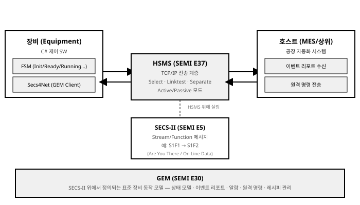

# 8장. 상위 시스템 및 외부 비전 연동

[◀ 이전: 7장. 알람, 레시피 및 데이터 관리](ch07-알람레시피와데이터관리.md) | [📖 목차](00-목차.md) | [다음: 9장. 시스템 최적화, 테스트 및 디버깅 ▶](ch09-시스템최적화와테스트.md)


지금까지 다룬 장들은 장비 내부의 문제, 즉 모터와 I/O를 어떻게 안전하게 제어하고(4장), 그 동작을 어떤 상태 머신으로 조율하며(5장), 오퍼레이터에게 어떻게 보여줄 것인가(6장)에 집중했다. 그러나 실제 양산 현장에 설치되는 장비는 결코 혼자 동작하지 않는다. 장비는 두 방향으로 외부와 대화한다.

첫째는 **눈**이다. 그리퍼가 웨이퍼나 부품을 집기 전에 그 물체가 정확히 어디에, 어떤 각도로 놓여 있는지를 알아야 한다. 이 역할을 머신비전이 담당한다. 카메라가 찍은 이미지에서 물체의 위치와 각도 오차를 계산하고, 그 오차만큼 모터를 보정 이동시키는 것이 바로 **Align(정렬)** 제어다.

둘째는 **입**과 **귀**다. 장비 한 대는 공장 전체를 놓고 보면 수십, 수백 대의 장비 중 하나에 불과하다. 공장의 상위 시스템(MES, Manufacturing Execution System)은 각 장비의 상태를 실시간으로 감시하고, 생산 지시를 내리고, 레시피를 배포하고, 알람을 수집해야 한다. 이 대화를 위해 반도체·디스플레이 업계는 SECS/GEM이라는 표준 프로토콜을 오랫동안 사용해 왔고, 그 외 업계나 사내 시스템에서는 REST API나 gRPC 같은 범용 통신 기술을 흔히 사용한다.

이번 장에서는 이 두 가지 외부 연동, 즉 **비전 연동**과 **상위 시스템 연동**을 다룬다. 두 주제 모두 3장에서 다룬 통신 계층 설계, 4장의 모션 제어, 5장의 상태 머신, 7장의 레시피·데이터 관리와 유기적으로 연결되므로, 각 절에서 해당 장의 내용을 다시 참조하며 설명한다.

## 8.1 OpenCvSharp / Halcon C# API 기반 머신비전 연동 및 Align 제어

### 8.1.1 장비 제어에서 머신비전이 쓰이는 대표 시나리오

장비 제어 소프트웨어 안에서 머신비전은 크게 세 가지 목적으로 쓰인다. 이 세 가지는 요구되는 정확도와 처리 흐름이 서로 다르므로 설계 초기에 구분해 두는 것이 좋다.

**정렬(Align)**. 그리퍼나 노즐이 물체를 집거나 처리하기 전에, 물체의 실제 위치·각도가 설계상의 기준 위치와 얼마나 어긋나 있는지를 비전으로 측정하고, 그 오차만큼 모션 축을 보정 이동시키는 작업이다. 예를 들어 웨이퍼 카세트에서 웨이퍼를 꺼낼 때 웨이퍼 중심이 그리퍼 중심과 정확히 일치해야 파손 없이 이송할 수 있다. Align은 이번 절의 핵심 주제이며, "비전으로 오차를 측정하고 → 모션으로 보정하고 → 다시 측정해 확인하는" **폐루프(closed-loop) 보정** 구조를 갖는다.

**검사(Inspection)**. 완성된 제품이나 공정 중인 부품의 외관에 스크래치, 이물, 결손 등의 불량이 있는지를 검출한다. Align과 달리 검사는 최종적으로 "합격/불합격"이라는 판정을 내리는 것이 목적이며, 모션 피드백으로 이어지지 않는 경우가 많다(단, 불량 판정 시 리젝트 슈트로 배출하는 I/O 동작은 4장의 액추에이터 제어와 연결된다).

**인식(Recognition)**. 제품에 인쇄되거나 레이저로 마킹된 문자, 2D 바코드, QR 코드 등을 읽어 제품 이력을 추적하는 데 쓴다. OpenCvSharp만으로는 바코드/OCR 인식 성능이 제한적이라, 실무에서는 전용 라이브러리(ZXing.Net 등)나 Halcon의 내장 판독 알고리즘을 함께 사용하는 경우가 많다.

이번 절은 이 중 Align을 중심으로, OpenCvSharp를 이용한 오차 계산과 모션 보정의 전체 흐름을 코드 수준까지 구현해 보고, 이어서 상용 머신비전 소프트웨어인 Halcon C# API를 개념적으로 소개한다.

### 8.1.2 비전-모션 폐루프 보정의 전체 흐름

Align 동작은 다음과 같은 순서로 진행된다.

1. 카메라로 대상 물체의 이미지를 취득한다.
2. 이미지에서 정렬 기준이 되는 특징(컨투어 중심점, 템플릿 매칭 위치 등)을 찾는다.
3. 찾은 특징의 픽셀 좌표를 미리 정의된 목표 좌표와 비교해 X/Y/각도 오차를 계산한다.
4. 픽셀 단위 오차를 캘리브레이션 계수를 이용해 실제 물리 단위(mm, deg)로 환산한다.
5. 환산된 오차를 4장에서 다룬 축 제어 모듈의 **상대 이동(Relative Move)** 명령으로 변환해 보정한다.
6. 보정 후 다시 이미지를 취득해 오차가 허용 범위(Tolerance) 이내로 들어왔는지 확인한다. 들어오지 않았다면 2~6을 반복하고, 반복 횟수가 한계를 넘으면 정렬 실패로 처리해 5장의 상태 머신에 알람 이벤트를 통지한다.

이 구조에서 중요한 점은, 비전 모듈은 "오차"만 계산해서 반환하고, 그 오차를 실제 모터 이동으로 바꾸는 책임은 모션 계층에 위임한다는 것이다. 이렇게 책임을 분리해 두면 카메라나 비전 알고리즘을 교체하더라도(예: OpenCvSharp에서 Halcon으로) 모션 제어 로직은 전혀 손댈 필요가 없다. 이는 1장에서 소개한 계층형 아키텍처 원칙을 비전 도메인에 그대로 적용한 것이다.

### 8.1.3 OpenCvSharp로 정렬 오차 계산하기

먼저 오차 계산 결과와 목표값을 담는 데이터 모델을 정의한다.

```csharp
/// <summary>
/// 정렬 목표: 카메라 화면 상에서 물체가 있어야 할 픽셀 좌표와 기준 각도.
/// 캘리브레이션 단계에서 한 번 측정해 설정 파일에 저장해 두는 값이다.
/// </summary>
public sealed class AlignTarget
{
    public double TargetXPx { get; init; }
    public double TargetYPx { get; init; }
    public double TargetAngleDeg { get; init; }
}

/// <summary>
/// 비전으로 측정한 정렬 오차. 물리 단위(mm, deg)로 환산된 값을 담는다.
/// </summary>
public sealed class AlignError
{
    public double DeltaXMm { get; init; }
    public double DeltaYMm { get; init; }
    public double DeltaThetaDeg { get; init; }

    public bool IsWithinTolerance(double xyToleranceMm, double angleToleranceDeg) =>
        Math.Abs(DeltaXMm) <= xyToleranceMm &&
        Math.Abs(DeltaYMm) <= xyToleranceMm &&
        Math.Abs(DeltaThetaDeg) <= angleToleranceDeg;
}
```

다음은 OpenCvSharp의 `Cv2.FindContours`와 `Cv2.MinAreaRect`를 이용해 물체의 중심 좌표와 회전 각도를 함께 구하는 방식이다. 컨투어 기반 방식은 물체의 실루엣이 배경과 뚜렷이 구분되는 경우(백라이트 조명 등)에 특히 안정적이다.

```csharp
using OpenCvSharp;

public sealed class VisionAlignService
{
    // 캘리브레이션으로 미리 구해 둔 "픽셀당 실제 거리(mm)" 환산 계수.
    // 예: 카메라 시야 20mm를 1000px로 촬영했다면 0.02 mm/px.
    private readonly double _pixelToMmX;
    private readonly double _pixelToMmY;

    public VisionAlignService(double pixelToMmX, double pixelToMmY)
    {
        _pixelToMmX = pixelToMmX;
        _pixelToMmY = pixelToMmY;
    }

    /// <summary>
    /// 카메라에서 취득한 한 프레임(frame)과 정렬 목표(target)를 비교해
    /// X/Y/Theta 오차를 계산한다.
    /// </summary>
    public AlignError ComputeError(Mat frame, AlignTarget target)
    {
        using var gray = new Mat();
        Cv2.CvtColor(frame, gray, ColorConversionCodes.BGR2GRAY);

        using var binary = new Mat();
        // Otsu 이진화: 조명 변화가 있어도 임계값을 자동으로 결정해 준다.
        Cv2.Threshold(gray, binary, 0, 255, ThresholdTypes.Binary | ThresholdTypes.Otsu);

        Cv2.FindContours(
            binary,
            out Point[][] contours,
            out HierarchyIndex[] _,
            RetrievalModes.External,
            ContourApproximationModes.ApproxSimple);

        if (contours.Length == 0)
            throw new VisionAlignException("정렬 기준 형상을 이미지에서 찾지 못했습니다.");

        // 노이즈로 생긴 작은 컨투어를 배제하기 위해 면적이 가장 큰 컨투어를 선택한다.
        var targetContour = contours
            .OrderByDescending(c => Cv2.ContourArea(c))
            .First();

        // MinAreaRect는 컨투어를 감싸는 최소 회전 사각형을 반환하며,
        // 이 사각형의 중심(Center)과 기울기(Angle)를 각각 위치/각도 오차 계산에 사용한다.
        RotatedRect rect = Cv2.MinAreaRect(targetContour);

        double deltaXPx = rect.Center.X - target.TargetXPx;
        double deltaYPx = rect.Center.Y - target.TargetYPx;
        double deltaThetaDeg = NormalizeAngle(rect.Angle - target.TargetAngleDeg);

        return new AlignError
        {
            DeltaXMm = deltaXPx * _pixelToMmX,
            DeltaYMm = deltaYPx * _pixelToMmY,
            DeltaThetaDeg = deltaThetaDeg
        };
    }

    // RotatedRect.Angle은 -90 ~ 0도 범위로 반환되므로,
    // 90도를 넘나드는 회전 대칭 형상에서는 각도를 -90~90 범위로 정규화해야
    // 보정 방향이 반대로 뒤집히는 오류를 막을 수 있다.
    private static double NormalizeAngle(double deg)
    {
        while (deg > 90) deg -= 180;
        while (deg < -90) deg += 180;
        return deg;
    }
}

public sealed class VisionAlignException : Exception
{
    public VisionAlignException(string message) : base(message) { }
}
```

컨투어로 잡기 어려운, 배경이 복잡하거나 특정 마크(정렬 마크, 얼라인 키 등)를 기준으로 삼아야 하는 경우에는 템플릿 매칭이 더 적합하다. `Cv2.MatchTemplate`은 기준 이미지(템플릿) 안에서 대상 이미지와 가장 유사한 위치를 찾아 준다.

```csharp
public Point2d FindMarkByTemplate(Mat frame, Mat markTemplate)
{
    using var result = new Mat();
    Cv2.MatchTemplate(frame, markTemplate, result, TemplateMatchModes.CCoeffNormed);

    Cv2.MinMaxLoc(result, out _, out double maxVal, out _, out Point maxLoc);

    if (maxVal < 0.8)
        throw new VisionAlignException($"정렬 마크 매칭 신뢰도가 낮습니다 (score={maxVal:F2}).");

    // 매칭된 좌상단 좌표에 템플릿 크기의 절반을 더해 마크 중심 좌표를 구한다.
    return new Point2d(
        maxLoc.X + markTemplate.Width / 2.0,
        maxLoc.Y + markTemplate.Height / 2.0);
}
```

### 8.1.4 오차를 모션 보정으로 변환하기

오차 계산 결과를 실제 모터 이동으로 변환하는 부분이 바로 "비전 → 모션 폐루프"의 핵심이다. 4장에서 설계한 축 제어 인터페이스가 상대 이동 명령(예: `MoveRelativeAsync`)을 제공한다고 가정하면, Align 컨트롤러는 다음과 같이 구성할 수 있다.

```csharp
public interface IMotionAxis
{
    Task MoveRelativeAsync(double distance, CancellationToken ct = default);
    double CurrentPosition { get; }
}

public interface ICameraSource
{
    Task<Mat> CaptureAsync(CancellationToken ct = default);
}

public sealed class AlignController
{
    private readonly VisionAlignService _visionService;
    private readonly ICameraSource _camera;
    private readonly IMotionAxis _axisX;
    private readonly IMotionAxis _axisY;
    private readonly IMotionAxis _axisTheta;
    private readonly ILogger<AlignController> _logger;

    private const int MaxIteration = 5;
    private const double XyToleranceMm = 0.01;      // 정렬 허용 오차: ±10um
    private const double AngleToleranceDeg = 0.05;  // 정렬 허용 각도: ±0.05도

    public AlignController(
        VisionAlignService visionService,
        ICameraSource camera,
        IMotionAxis axisX,
        IMotionAxis axisY,
        IMotionAxis axisTheta,
        ILogger<AlignController> logger)
    {
        _visionService = visionService;
        _camera = camera;
        _axisX = axisX;
        _axisY = axisY;
        _axisTheta = axisTheta;
        _logger = logger;
    }

    /// <summary>
    /// 정렬 목표에 도달할 때까지 "측정 → 보정 → 재측정"을 반복한다.
    /// 성공 시 true, 반복 한계를 초과하면 false를 반환한다.
    /// </summary>
    public async Task<bool> RunAlignAsync(AlignTarget target, CancellationToken ct = default)
    {
        for (int iteration = 1; iteration <= MaxIteration; iteration++)
        {
            using Mat frame = await _camera.CaptureAsync(ct);
            AlignError error = _visionService.ComputeError(frame, target);

            _logger.LogInformation(
                "Align 반복 {Iteration}: dX={DX:F4}mm dY={DY:F4}mm dTheta={DTheta:F4}deg",
                iteration, error.DeltaXMm, error.DeltaYMm, error.DeltaThetaDeg);

            if (error.IsWithinTolerance(XyToleranceMm, AngleToleranceDeg))
            {
                _logger.LogInformation("Align 성공 (반복 {Iteration}회)", iteration);
                return true;
            }

            // 오차만큼 반대 방향으로 이동시켜 오차를 상쇄한다.
            // 각 축을 순차적으로 이동시키는 이유: 동시 이동 시 축 간 간섭으로
            // 예상치 못한 경로를 그릴 수 있는 저가형 스테이지를 고려한 것이다.
            // 고정밀 스테이지에서는 3축을 동시에 구동해 보정 시간을 단축하기도 한다.
            await _axisX.MoveRelativeAsync(-error.DeltaXMm, ct);
            await _axisY.MoveRelativeAsync(-error.DeltaYMm, ct);
            await _axisTheta.MoveRelativeAsync(-error.DeltaThetaDeg, ct);
        }

        _logger.LogWarning("Align 실패: 최대 반복 횟수({MaxIteration}) 초과", MaxIteration);
        return false;
    }
}
```

실무에서 주의할 점 몇 가지를 짚어 두자.

- **회전 중심과 그리퍼 중심의 불일치**. Theta 축의 회전 중심이 X/Y 이동의 기준점과 정확히 일치하지 않는 스테이지가 많다. 이 경우 각도를 보정하면 X/Y 위치도 함께 틀어지므로, 각도 보정 후 위치를 다시 측정해 보정하는 순서(위 코드처럼 각 반복마다 재측정)가 필수적이다. 더 정교한 설비에서는 회전 중심 오프셋을 좌표 변환 행렬에 반영해 한 번에 계산하기도 한다.
- **캘리브레이션의 정확도**. `_pixelToMmX`, `_pixelToMmY` 계수가 부정확하면 모든 보정이 체계적으로 어긋난다. 이 계수는 정밀 그리드 패턴이나 게이지 블록을 촬영해 별도의 캘리브레이션 루틴으로 산출하고, 카메라나 렌즈를 교체할 때마다 재측정해야 한다.
- **조명 안정성**. `Cv2.Threshold`의 Otsu 자동 임계값은 조명이 어느 정도 변해도 견디지만, 조명이 시간대별로 크게 바뀌는 현장에서는 오탐이 늘어난다. 가능하면 외부광을 차단하고 전용 조명(백라이트, 동축광 등)을 사용하는 것이 소프트웨어 보정보다 훨씬 안정적이다.
- **정렬 실패 시 알람 연계**. `RunAlignAsync`가 `false`를 반환하면 이를 그대로 무시하지 말고, 5장에서 설계한 상태 머신에 알람 이벤트로 전달해 장비를 Error 상태로 전이시키고 7장의 알람 로그에 기록해야 한다.

### 8.1.5 Halcon C# API(HALCON .NET) 개요

OpenCvSharp가 오픈소스 범용 비전 라이브러리라면, Halcon(독일 MVTec사 제품)은 반도체·디스플레이·전자 업계에서 널리 쓰이는 상용 머신비전 소프트웨어다. HALCON은 자체 스크립트 기반 개발 환경인 HDevelop를 제공하며, 여기서 개발한 비전 알고리즘을 C#/.NET 프로젝트에 통합할 수 있는 공식 .NET API를 함께 제공한다.

HALCON .NET API를 이해하는 데 필요한 핵심 개념은 다음 두 가지다.

- **HObject**: 이미지, 리전(Region), 컨투어(XLD) 등 HALCON이 다루는 모든 영상 데이터의 기반 타입이다. OpenCvSharp의 `Mat`이 이미지를 표현하는 것과 비슷한 역할이지만, HObject는 이미지뿐 아니라 분할된 영역이나 추출된 윤곽선 같은 다양한 형태의 비전 데이터를 하나의 개념으로 아우른다.
- **HTuple**: 정수, 실수, 문자열, 그리고 이들의 배열을 모두 담을 수 있는 범용 값 컨테이너다. HALCON의 거의 모든 연산 결과(좌표, 각도, 판정 결과 등)가 HTuple로 반환되며, C# 코드에서는 이 값을 꺼내 일반 타입으로 변환해 사용한다.

HALCON의 비전 처리는 이러한 HObject/HTuple을 입출력으로 삼는 **프로시저(연산자) 호출**의 연쇄로 구성된다. HDevelop에서 개발·검증한 프로시저를 C# 프로젝트에 그대로 이식해 호출하는 방식이 일반적인 개발 흐름이며, 이 덕분에 비전 엔지니어가 HDevelop에서 알고리즘을 튜닝하고 소프트웨어 엔지니어가 이를 C# 애플리케이션에 통합하는 역할 분담이 자연스럽게 이루어진다.

> HALCON .NET의 구체적인 클래스 이름과 메서드 시그니처는 버전마다 조금씩 다르고, 정확한 사용법은 MVTec의 공식 문서를 따라야 한다. 이 책에서는 HObject/HTuple 같은 핵심 개념만 소개하며, 실제 프로젝트에서 HALCON을 채택한다면 반드시 공식 SDK 문서와 라이선스 조건을 함께 검토하기 바란다.

### 8.1.6 OpenCvSharp vs Halcon: 언제 무엇을 선택할 것인가

두 라이브러리는 경쟁 관계라기보다 적용 상황이 다르다고 보는 것이 정확하다.

| 항목 | OpenCvSharp | Halcon (HALCON .NET) |
|---|---|---|
| 라이선스 비용 | 무료(오픈소스, Apache 2.0 기반) | 상용 라이선스(모듈/런타임 단위 과금) |
| 알고리즘 폭 | 범용 컴퓨터 비전 전반(딥러닝 연동 포함) | 산업 검사 특화 알고리즘(형상 기반 매칭, 서브픽셀 정밀도 등)을 폭넓게 내장 |
| 성능 최적화 | CPU/GPU 가속을 직접 설정·튜닝해야 하는 경우가 많음 | 다양한 CPU 아키텍처에 대해 사전 최적화된 연산자 다수 제공 |
| 학습 곡선 | 커뮤니티 자료가 매우 풍부, 진입 장벽 낮음 | 전용 IDE(HDevelop) 학습 필요, 초기 학습 곡선이 있음 |
| 기술 지원 | 커뮤니티 기반(공식 유상 지원은 제한적) | 벤더의 정식 기술 지원 및 유지보수 계약 가능 |
| 주 적용 분야 | 스타트업, 연구 프로토타입, 비용 민감 프로젝트, 일반 산업 자동화 | 반도체/디스플레이 등 고정밀·고신뢰성이 요구되는 양산 라인 |

실무적으로는 두 라이브러리를 함께 사용하는 경우도 드물지 않다. 예를 들어 저비용 보조 카메라의 러프 정렬은 OpenCvSharp로 처리하고, 최종 정밀 검사나 서브픽셀 단위 정렬이 필요한 핵심 공정에는 Halcon을 투입하는 식이다. 어떤 라이브러리를 쓰든, 8.1.4절에서 구성한 것처럼 "비전 모듈은 오차만 계산해 반환하고 모션 계층이 실제 이동을 수행한다"는 책임 분리 원칙을 지키면, 비전 라이브러리 교체가 상위 로직에 영향을 주지 않는다.

## 8.2 SECS/GEM 프로토콜 개요 및 C# GEM 라이브러리 연동

### 8.2.1 SECS/GEM이 필요한 이유

반도체·디스플레이 공장 한 곳에는 수십 개 제조사의 장비 수백 대가 함께 설치된다. 이 모든 장비가 각자 다른 통신 규약을 쓴다면, 공장의 상위 자동화 시스템(MES, APC, SPC 등)은 장비마다 별도의 드라이버를 만들어야 하고, 신규 장비를 들여올 때마다 통합 비용이 눈덩이처럼 불어난다. 이 문제를 해결하기 위해 반도체 장비 업계 표준화 기구인 SEMI(Semiconductor Equipment and Materials International)는 오래전부터 장비-호스트 간 통신을 표준화해 왔고, 그 결과물이 SECS/GEM이다.

SECS/GEM은 하나의 표준이 아니라 몇 개의 SEMI 표준이 계층을 이루는 체계다.

- **E4 (SECS-I)**: RS-232 시리얼 기반의 초기 전송 계층 표준. 현재 신규 장비에서는 거의 쓰이지 않지만 레거시 장비에는 여전히 남아 있다.
- **E5 (SECS-II)**: 메시지의 내용과 구조를 정의하는 표준. 전송 계층(SECS-I이든 HSMS든)과 무관하게, "이 메시지가 무엇을 의미하는가"를 규정한다.
- **E37 (HSMS)**: TCP/IP 기반의 전송 계층 표준으로, 사실상 SECS-I을 대체해 현재 대부분의 신규 장비가 채택하는 방식이다.
- **E30 (GEM)**: SECS-II 메시지 위에서 "장비가 표준적으로 어떻게 동작해야 하는가"를 정의하는 상위 표준. 상태 모델, 이벤트 리포트, 원격 명령, 알람, 데이터 수집(트레이스) 등을 규정한다.

이 네 가지를 합쳐 흔히 "SECS/GEM"이라고 부른다. 정리하면 **HSMS는 배관(어떻게 바이트를 주고받을 것인가), SECS-II는 문장의 문법(메시지를 어떻게 구성할 것인가), GEM은 대화의 규칙(장비가 어떤 상황에서 무슨 말을 해야 하는가)**에 해당한다.

### 8.2.2 HSMS: TCP/IP 기반 전송 계층

HSMS(High-Speed SECS Message Services, SEMI E37)는 장비와 호스트가 TCP 소켓으로 연결을 맺고 그 위에 SECS-II 메시지를 실어 보내는 방식이다. 3장에서 다룬 TCP/IP 통신 기법(비동기 소켓, 프레이밍)이 그대로 응용되는 지점이다.

HSMS 연결은 몇 가지 제어 메시지로 상태를 관리한다.

- **Select**: 두 노드(장비-호스트) 간 논리적 세션을 연다. 한쪽이 Active(먼저 연결을 시도), 다른 쪽이 Passive(연결을 기다림) 역할을 맡는다.
- **Linktest**: 연결이 살아 있는지 주기적으로 확인하는 하트비트. 일정 시간(T6 타임아웃) 내에 응답이 없으면 연결이 끊긴 것으로 간주한다.
- **Separate**: 세션을 정상적으로 종료한다.

HSMS 메시지는 TCP 스트림 위에서 프레이밍을 위해 **4바이트 길이 필드 + 10바이트 헤더 + 본문**의 구조를 가진다. 10바이트 헤더의 구성은 다음과 같다.

| 바이트 위치 | 필드 | 설명 |
|---|---|---|
| 0-1 | Session ID (Device ID) | 논리적 세션(장비) 식별자 |
| 2 | Stream + W-bit | 상위 1비트는 응답 요구(W-bit) 여부, 하위 7비트는 Stream 번호 |
| 3 | Function | Function 번호 |
| 4 | PType | 프레젠테이션 타입(SECS-II 데이터 메시지는 0) |
| 5 | SType | 세션 타입(0=데이터 메시지, 1=Select.req, 2=Select.rsp, 5=Linktest.req, 6=Linktest.rsp, 9=Separate.req 등) |
| 6-9 | System Bytes | 요청-응답을 짝짓는 트랜잭션 ID |

### 8.2.3 SECS-II 메시지 구조: Stream/Function

SECS-II(SEMI E5)는 메시지를 **Stream(대분류)** 과 **Function(세부 종류)** 의 조합으로 구분한다. 관례적으로 홀수 Function은 요청(Primary Message), 짝수 Function은 그 요청에 대한 응답(Secondary Message)을 의미한다. 표기할 때는 `SxFy` 형식을 쓴다.

가장 널리 알려진 예가 **S1F1 "Are You There"** 요청과 그 응답인 **S1F2 "On Line Data"** 다. 호스트가 장비에게 "너 거기 살아있니?"라고 묻는 메시지이며, 장비가 정상이라면 자신의 모델명과 소프트웨어 버전을 담아 응답한다.

```
호스트 → 장비   S1F1  (W-bit=1, 본문 없음: 리스트 길이 0개)
장비   → 호스트  S1F2  (본문: 리스트 2개 항목)
                        - MDLN (장비 모델명, ASCII 문자열)
                        - SOFTREV (소프트웨어 리비전, ASCII 문자열)
```

SECS-II 본문은 **아이템(Item)** 이라는 타입-길이-값(TLV) 형식의 자료 구조로 인코딩된다. 각 아이템은 포맷 코드(리스트/ASCII 문자열/정수/실수 등을 구분), 길이, 실제 데이터로 구성되며, 리스트 아이템은 다른 아이템을 중첩해서 담을 수 있다. 위 S1F2 예시를 개념적으로 풀어 쓰면 다음과 같은 중첩 구조가 된다.

```
<L [2]                 리스트, 항목 2개
  <A "EQP-MODEL-X">    ASCII 문자열: 장비 모델명
  <A "1.4.2">          ASCII 문자열: 소프트웨어 버전
>
```

이 밖에도 실무에서 자주 마주치는 메시지로는 S1F3/S1F4(상태 변수 조회), S2F41/S2F42(원격 명령 요청/응답), S6F11/S6F12(이벤트 리포트 전송/응답) 등이 있다. Stream 번호는 대략적인 카테고리를 나타낸다 — S1은 장비 상태, S2는 장비 제어, S5는 알람, S6는 데이터 수집(이벤트/트레이스) 계열이 대표적이다.

### 8.2.4 GEM: SECS-II 위에서 정의하는 표준 장비 동작 모델

GEM(SEMI E30)은 SECS-II라는 "문법" 위에서 장비가 지켜야 할 "대화의 규칙"을 정의한다. GEM의 핵심 요소는 다음과 같다.

- **상태 모델(State Model)**: 장비가 호스트와의 관계에서 가질 수 있는 표준 상태를 정의한다. 대표적으로 통신 상태(Not Communicating/Communicating), 제어 상태(Equipment Offline/Attempt Online/Host Offline/Online Local/Online Remote) 등이 있다.
- **이벤트 리포트(Event Report)**: 장비 내부에서 의미 있는 사건(공정 시작, 로트 완료, 알람 발생 등)이 발생했을 때, 이를 CEID(Collection Event ID)라는 식별자로 구분해 호스트에게 능동적으로 통지하는 메커니즘이다(S6F11 메시지로 전송된다).
- **원격 명령(Remote Command)**: 호스트가 장비에게 특정 동작(시작, 정지, 레시피 선택 등)을 원격으로 지시하는 메커니즘이다(S2F41 메시지로 전송된다).
- **알람(Alarm)**, **데이터 수집(Trace)**, **레시피 관리(PP - Process Program)** 등도 GEM이 표준화하는 영역이다.

여기서 5장의 내용과 명시적으로 연결되는 지점이 있다. 5장에서 설계한 장비의 표준 상태(Init → Ready → Running → Paused/Error 등)는 임의로 정한 것이 아니라, 실제로는 GEM의 표준 상태 모델(특히 Processing State Model)과 대응 관계를 갖는 것이 일반적이다. 예를 들어 5장의 `Ready` 상태로 전이될 때 GEM 레이어에서는 이를 CEID로 정의해 호스트에게 이벤트 리포트를 보내야 하고, 호스트가 원격 명령으로 `Start`를 지시하면 이 명령이 SECS-II S2F41 메시지로 수신되어 5장의 FSM에 `Start` 트리거를 전달하는 식으로 두 계층이 맞물린다. 즉 **5장의 FSM은 장비 내부의 동작을 관리하는 엔진이고, GEM 레이어는 그 엔진의 상태를 외부에 표준화된 방식으로 노출하는 어댑터**라고 이해하면 두 장의 내용이 자연스럽게 이어진다.

### 8.2.5 Secs4Net: 검증된 오픈소스 C# 구현체 활용하기

SECS/GEM 프로토콜을 처음부터 직접 구현하는 것은 권장하지 않는다. HSMS의 연결 상태 관리, T3/T5/T6/T7/T8 등 다수의 타임아웃 규칙, SECS-II 아이템의 재귀적 인코딩/디코딩, Primary/Secondary 메시지의 트랜잭션 매칭 등 사양서 분량 자체가 방대하고, 구현 오류가 실제 양산 라인에서 장비-호스트 간 통신 두절로 이어질 수 있는 민감한 영역이기 때문이다. 이런 이유로 실무에서는 검증된 라이브러리를 채택하는 것이 안전하다.

**Secs4Net**은 GitHub에 공개된 오픈소스 SECS/GEM(HSMS) 통신 라이브러리로, .NET 환경에서 HSMS 연결 수립, SECS-II 메시지의 송수신 및 인코딩/디코딩, 타임아웃 관리 등 프로토콜의 저수준 처리를 캡슐화해 제공한다. 라이브러리를 도입하면 애플리케이션 개발자는 "이 CEID가 발생했을 때 어떤 메시지를 보낼 것인가", "이 원격 명령을 받으면 어떤 동작을 할 것인가" 같은 장비 고유의 GEM 로직에 집중할 수 있고, 바이트 단위의 프로토콜 처리는 라이브러리에 위임할 수 있다.

아래는 이러한 라이브러리를 사용할 때의 전형적인 개발 패턴을 개념적으로 보여주는 예시다. 실제 클래스명과 메서드 시그니처는 라이브러리 버전에 따라 달라질 수 있으므로, 프로젝트에 도입할 때는 반드시 해당 프로젝트의 GitHub 저장소에 있는 최신 문서와 예제를 확인해야 한다.

```csharp
// 개념 예시: HSMS 연결을 맺고 S1F1 요청을 처리하는 전형적인 흐름
// (정확한 API는 Secs4Net의 공식 문서를 따를 것)

public sealed class GemCommunicationService
{
    // 1) HSMS 연결 설정을 구성한다(IP, 포트, Active/Passive 모드, T3~T8 타임아웃 등).
    // 2) 수신 측에서 특정 Stream/Function 메시지가 도착했을 때 실행할
    //    핸들러를 등록한다. 예를 들어 S1F1 수신 시 자동으로
    //    모델명/소프트웨어 버전을 담은 S1F2 응답을 구성해 반환한다.
    // 3) 5장의 FSM에서 상태가 전이될 때마다 해당 CEID에 대응하는
    //    이벤트 리포트(S6F11)를 호스트로 전송한다.
    // 4) 호스트로부터 원격 명령(S2F41)이 도착하면 명령 이름을 파싱해
    //    5장의 FSM에 대응하는 트리거로 변환해 전달한다.

    public async Task HandleRemoteCommandAsync(string commandName, IReadOnlyDictionary<string, string> parameters)
    {
        // FSM으로 위임: 실제 상태 전이 로직은 5장에서 구현한 상태 머신이 담당한다.
        // (여기서는 GEM 레이어가 FSM의 "어댑터" 역할만 수행한다는 것을 보여주는 것이 목적)
    }
}
```

이처럼 GEM 레이어는 "SECS-II 메시지 ↔ 애플리케이션 내부 이벤트/명령"을 변환하는 어댑터 역할에 집중하도록 설계하는 것이 유지보수 측면에서 유리하다. GEM 프로토콜의 세부 사항이 바뀌거나 라이브러리를 교체하더라도, FSM을 비롯한 장비 제어의 핵심 로직은 영향을 받지 않기 때문이다.



## 8.3 REST API / gRPC를 이용한 MES 및 상위 호스트 통신

### 8.3.1 SECS/GEM만으로 충분하지 않은 경우

SECS/GEM은 반도체·디스플레이 업계에서는 사실상 필수 표준이지만, 모든 상위 시스템 연동이 SECS/GEM으로 이루어지는 것은 아니다. 다음과 같은 상황에서는 REST API나 gRPC 같은 범용 통신 기술이 더 적합하거나, 애초에 유일한 선택지가 된다.

- 반도체·디스플레이 업계가 아닌 다른 산업(2차전지, 자동차 부품, 일반 제조업 등)의 장비는 SECS/GEM을 요구하지 않는 경우가 많고, 대신 사내 MES가 REST API 규격을 제공하는 경우가 흔하다.
- 같은 공장 안에서도 SECS/GEM은 "장비-호스트" 간 표준 통신에 쓰이지만, 그 뒤단의 MES-ERP 연동, 대시보드용 실시간 모니터링, 사내 데이터 수집 시스템과의 연동은 별도의 웹 API로 이루어지는 경우가 많다.
- 장비 제조사 자체적으로 원격 진단, 소프트웨어 업데이트, 클라우드 기반 데이터 분석 서비스를 제공하려면 SECS/GEM보다 범용적인 웹 API가 필요하다.

이런 이유로 실무에서는 SECS/GEM과 REST/gRPC를 배타적으로 선택하는 것이 아니라, 대상 시스템의 성격에 따라 함께 구현하는 경우가 많다. 즉 파운드리 호스트와는 SECS/GEM으로, 사내 대시보드나 클라우드 서비스와는 REST/gRPC로 통신하는 이중 구조다.

### 8.3.2 ASP.NET Core Web API로 장비 상태 노출하기

`ASP.NET Core Web API`를 이용하면 장비 상태 조회와 원격 제어를 표준 HTTP 엔드포인트로 손쉽게 노출할 수 있다. 먼저 상태를 표현하는 DTO(Data Transfer Object)를 정의한다.

```csharp
public sealed class EquipmentStatusDto
{
    public string EquipmentId { get; init; } = string.Empty;
    public string State { get; init; } = string.Empty;   // 5장 FSM의 현재 상태
    public double AxisXPosition { get; init; }
    public double AxisYPosition { get; init; }
    public bool HasActiveAlarm { get; init; }
    public DateTimeOffset TimestampUtc { get; init; }
}
```

컨트롤러는 `[ApiController]` 어트리뷰트로 표준 API 동작(모델 검증, 자동 400 응답 등)을 활성화하고, `[HttpGet]`/`[HttpPost]`로 조회/제어 엔드포인트를 구성한다.

```csharp
[ApiController]
[Route("api/[controller]")]
public class EquipmentController : ControllerBase
{
    private readonly IEquipmentStateService _stateService;
    private readonly ILogger<EquipmentController> _logger;

    public EquipmentController(IEquipmentStateService stateService, ILogger<EquipmentController> logger)
    {
        _stateService = stateService;
        _logger = logger;
    }

    // GET api/equipment/status
    [HttpGet("status")]
    public ActionResult<EquipmentStatusDto> GetStatus()
    {
        EquipmentStatusDto status = _stateService.GetCurrentStatus();
        return Ok(status);
    }

    // POST api/equipment/commands/start
    [HttpPost("commands/start")]
    public async Task<IActionResult> StartAsync(CancellationToken ct)
    {
        bool accepted = await _stateService.RequestStartAsync(ct);
        if (!accepted)
        {
            _logger.LogWarning("Start 명령이 현재 상태에서 거부되었습니다: {State}",
                _stateService.GetCurrentStatus().State);
            return Conflict(new { message = "현재 상태에서는 Start 명령을 수행할 수 없습니다." });
        }
        return Accepted();
    }

    // POST api/equipment/commands/stop
    [HttpPost("commands/stop")]
    public async Task<IActionResult> StopAsync(CancellationToken ct)
    {
        await _stateService.RequestStopAsync(ct);
        return Accepted();
    }
}
```

여기서 REST 컨트롤러 역시 GEM 어댑터와 마찬가지로 5장의 FSM을 직접 조작하지 않고 `IEquipmentStateService`라는 서비스 계층을 거친다는 점에 주목하자. HTTP 요청이든 SECS-II 원격 명령이든, 결국 같은 FSM에 같은 트리거를 전달하도록 통일해 두면 "장비를 시작시키는 방법"이 여러 갈래로 흩어지지 않고 한곳으로 수렴한다.

`Program.cs`의 최소 구성은 다음과 같다.

```csharp
var builder = WebApplication.CreateBuilder(args);

builder.Services.AddControllers();
builder.Services.AddSingleton<IEquipmentStateService, EquipmentStateService>();

var app = builder.Build();

app.MapControllers();
app.Run();
```

### 8.3.3 gRPC가 유리한 경우: 고빈도 스트리밍과 강타입 계약

REST API는 요청-응답 모델에 최적화되어 있어 "현재 상태 조회" 같은 단발성 호출에는 적합하지만, 장비 상태를 초당 수십~수백 회로 실시간 스트리밍해야 하는 모니터링 대시보드나, 여러 서비스 간 내부 통신에서 엄격한 타입 계약이 필요한 경우에는 gRPC가 더 나은 선택이 된다. gRPC는 HTTP/2 기반의 다중화된 스트림과 Protocol Buffers(protobuf)의 이진 직렬화를 사용해 REST/JSON보다 낮은 오버헤드로 양방향 스트리밍을 지원한다.

먼저 `.proto` 파일로 서비스 계약을 정의한다.

```protobuf
syntax = "proto3";

option csharp_namespace = "EquipmentControl.Grpc";

package equipment;

service EquipmentStatusService {
  // 서버 스트리밍: 클라이언트가 한 번 구독하면 서버가 계속 상태를 밀어준다.
  rpc SubscribeStatus (SubscribeRequest) returns (stream EquipmentStatus);

  // 단발성 명령 호출
  rpc SendCommand (CommandRequest) returns (CommandReply);
}

message SubscribeRequest {
  string equipment_id = 1;
}

message EquipmentStatus {
  string state = 1;
  double axis_x_position = 2;
  double axis_y_position = 3;
  bool has_active_alarm = 4;
  int64 timestamp_unix_ms = 5;
}

message CommandRequest {
  string command = 1;
}

message CommandReply {
  bool accepted = 1;
  string message = 2;
}
```

서버 측(`Grpc.AspNetCore`)에서는 이 계약으로부터 생성된 기반 클래스를 상속해 서비스 스트리밍 로직을 구현한다.

```csharp
public class EquipmentStatusGrpcService : EquipmentStatusService.EquipmentStatusServiceBase
{
    private readonly IEquipmentStateService _stateService;

    public EquipmentStatusGrpcService(IEquipmentStateService stateService)
    {
        _stateService = stateService;
    }

    public override async Task SubscribeStatus(
        SubscribeRequest request,
        IServerStreamWriter<EquipmentStatus> responseStream,
        ServerCallContext context)
    {
        // IEquipmentStateService가 상태 변경을 IAsyncEnumerable로 노출한다고 가정한다.
        // (내부 구현은 2장에서 다룬 Channel<T> 기반 생산자-소비자 패턴을 재사용할 수 있다)
        await foreach (var status in _stateService.StatusChanges.WithCancellation(context.CancellationToken))
        {
            await responseStream.WriteAsync(new EquipmentStatus
            {
                State = status.State,
                AxisXPosition = status.AxisXPosition,
                AxisYPosition = status.AxisYPosition,
                HasActiveAlarm = status.HasActiveAlarm,
                TimestampUnixMs = status.TimestampUtc.ToUnixTimeMilliseconds()
            });
        }
    }

    public override Task<CommandReply> SendCommand(CommandRequest request, ServerCallContext context)
    {
        bool accepted = _stateService.TryRequestCommand(request.Command);
        return Task.FromResult(new CommandReply
        {
            Accepted = accepted,
            Message = accepted ? "명령이 접수되었습니다." : "현재 상태에서 처리할 수 없는 명령입니다."
        });
    }
}
```

클라이언트 측에서는 `Grpc.Net.Client`의 `GrpcChannel`로 채널을 열고, 생성된 클라이언트 스텁을 통해 스트림을 구독한다.

```csharp
using var channel = GrpcChannel.ForAddress("https://mes-gateway.internal:5001");
var client = new EquipmentStatusService.EquipmentStatusServiceClient(channel);

using var cts = new CancellationTokenSource();
using var call = client.SubscribeStatus(new SubscribeRequest { EquipmentId = "EQP-001" });

await foreach (var status in call.ResponseStream.ReadAllAsync(cts.Token))
{
    Console.WriteLine(
        $"[{status.State}] X={status.AxisXPosition:F3} Y={status.AxisYPosition:F3} " +
        $"Alarm={status.HasActiveAlarm}");
}
```

`.proto` 계약은 서버와 클라이언트가 동일한 정의로부터 코드를 생성하므로, REST/JSON에서 흔히 발생하는 "필드명 오타", "타입 불일치" 같은 런타임 오류를 컴파일 시점에 걸러낼 수 있다는 것도 gRPC의 실질적인 장점이다.

### 8.3.4 REST vs gRPC 선택 기준

| 기준 | REST API | gRPC |
|---|---|---|
| 전송 프로토콜 | HTTP/1.1 (HTTP/2도 가능) | HTTP/2 필수 |
| 페이로드 형식 | JSON(사람이 읽기 쉬움) | Protocol Buffers(이진, 컴팩트) |
| 스트리밍 | 폴링이나 SSE/WebSocket을 별도로 얹어야 함 | 서버/클라이언트/양방향 스트리밍을 프로토콜 차원에서 기본 지원 |
| 계약 관리 | OpenAPI/Swagger로 문서화(느슨한 타입) | `.proto` 파일이 곧 강타입 계약, 코드 자동 생성 |
| 브라우저 호환성 | 모든 브라우저에서 직접 호출 가능 | 브라우저는 gRPC-Web 등 별도 계층 필요 |
| 디버깅 용이성 | curl, Postman 등으로 즉시 확인 가능 | 전용 도구 필요, 사람이 페이로드를 직접 읽기 어려움 |
| 적합한 상황 | 단발성 조회/제어, 외부 파트너 연동, 범용성이 중요한 경우 | 고빈도 실시간 스트리밍, 내부 마이크로서비스 간 통신, 강타입 계약이 중요한 경우 |
| 대표 용례 | MES에서 장비 상태를 폴링 조회, 레시피 다운로드 API | 다축 서보 위치를 초당 수십 회 이상 대시보드에 스트리밍 |

실제 프로젝트에서는 두 기술을 한 시스템 안에서 함께 쓰는 경우도 많다. 예를 들어 외부 파트너나 웹 대시보드에는 접근성이 좋은 REST API를 노출하고, 같은 공장 내부의 고빈도 상태 스트리밍이나 마이크로서비스 간 통신에는 gRPC를 사용하는 식이다. 어떤 프로토콜을 택하든, 7장에서 다룬 레시피·알람 데이터를 상위 시스템과 주고받아야 한다면 이 절에서 구성한 DTO/protobuf 메시지 스키마를 7장의 데이터 모델과 일관되게 맞춰 두는 것이 이후 유지보수를 크게 줄여준다.

## 요약

- 장비 제어 소프트웨어의 외부 연동은 크게 비전(눈)과 상위 시스템(입/귀) 두 방향으로 나뉜다.
- 머신비전은 정렬(Align), 검사(Inspection), 인식(Recognition) 세 가지 목적으로 쓰이며, Align은 "비전으로 오차 측정 → 모션으로 보정 → 재측정으로 확인"하는 폐루프 구조를 갖는다.
- OpenCvSharp의 `Cv2.FindContours`/`Cv2.MinAreaRect`나 `Cv2.MatchTemplate`으로 물체의 위치·각도를 구하고, 캘리브레이션 계수로 픽셀 오차를 물리 단위로 환산한 뒤 4장의 축 제어 모듈에 상대 이동으로 전달하는 흐름을 구현했다.
- Halcon(HALCON .NET)은 HObject/HTuple을 중심으로 한 상용 머신비전 소프트웨어로, 고정밀·고신뢰성이 요구되는 양산 라인에서 OpenCvSharp의 대안 또는 보완재로 쓰인다.
- SECS/GEM은 반도체·디스플레이 업계의 장비-호스트 표준 통신 체계로, HSMS(E37, 전송 계층)·SECS-II(E5, 메시지 구조)·GEM(E30, 표준 동작 모델)이 계층을 이룬다. 5장의 FSM은 GEM의 표준 상태 모델과 대응되며, GEM 레이어는 SECS-II 메시지와 FSM 트리거를 변환하는 어댑터 역할을 한다.
- SECS/GEM을 직접 구현하기보다 Secs4Net 같은 검증된 오픈소스 라이브러리를 활용하는 것이 실무적으로 안전하다.
- SECS/GEM 표준이 적용되지 않는 산업이나 사내 시스템과의 연동에는 `ASP.NET Core Web API`(REST) 또는 `Grpc.Net.Client`/`Grpc.AspNetCore`(gRPC)를 사용하며, 단발성 조회/제어는 REST가, 고빈도 스트리밍과 강타입 계약이 중요한 경우는 gRPC가 유리하다.

## 연습문제

1. 8.1.4절의 `AlignController.RunAlignAsync`는 X, Y, Theta 축을 순차적으로 이동시킨다. 만약 회전 중심이 그리퍼의 이동 기준점과 일치하지 않는 스테이지라면 어떤 문제가 발생할 수 있는지 설명하고, 이를 보완할 수 있는 방법을 제안하라.
2. `Cv2.MinAreaRect`의 `Angle` 값이 -90도 근처에서 90도 근처로 급격히 바뀌는 경우가 있다. `NormalizeAngle` 메서드가 왜 필요한지, 그리고 이 정규화가 없다면 실제 정렬 동작에서 어떤 오작동이 일어날 수 있는지 설명하라.
3. GEM의 표준 상태 모델과 5장에서 설계한 장비 FSM이 어떻게 대응되는지, CEID(Collection Event ID)와 원격 명령이 FSM과 상호작용하는 흐름을 구체적인 예를 들어 설명하라.
4. HSMS 헤더의 Stream/Function 필드와 S1F1/S1F2 메시지의 관계를 설명하고, 만약 새로운 장비 이벤트(예: "레시피 로딩 완료")를 호스트에 통지해야 한다면 어떤 SECS-II 메시지(Stream/Function)를 사용하는 것이 적절할지 8.2.4절의 내용을 참고해 근거와 함께 제시하라.
5. 동일한 장비 상태 정보를 REST API로 노출할 때와 gRPC 스트리밍으로 노출할 때 각각의 장단점을 정리하고, 사내 실시간 모니터링 대시보드와 외부 MES 연동이라는 두 가지 사용 사례에 대해 어떤 조합을 선택할지 근거를 들어 설명하라.

---

[◀ 이전: 7장. 알람, 레시피 및 데이터 관리](ch07-알람레시피와데이터관리.md) | [📖 목차](00-목차.md) | [다음: 9장. 시스템 최적화, 테스트 및 디버깅 ▶](ch09-시스템최적화와테스트.md)
