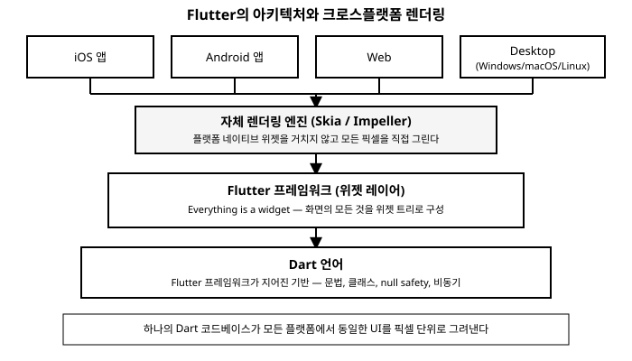

# 1장. Flutter란 무엇인가

📖 [◀ 목차](00-목차.md) | [다음: 2장. 개발 환경 설정과 첫 앱 ▶](ch02-개발환경설정과첫앱.md)

---

## 들어가며

앱 하나를 만들려는데, iOS용과 Android용을 따로 만들어야 한다면 어떨까. 화면 구성은 거의 비슷한데도 Swift(또는 Objective-C)로 한 번, Kotlin(또는 Java)으로 또 한 번, 사실상 같은 로직을 두 벌의 언어와 두 벌의 프로젝트로 작성해야 한다. 여기에 웹 버전과 데스크톱 버전까지 필요하다면 유지보수해야 할 코드베이스는 네다섯 개로 불어난다. Flutter는 바로 이 문제, 즉 "하나의 코드로 여러 플랫폼을 감당할 수는 없을까"라는 질문에서 출발한 프레임워크다. 이 장에서는 Flutter가 정확히 무엇이고, 어떤 원리로 여러 플랫폼에서 동작하는지, 그리고 다른 크로스플랫폼 기술들과 무엇이 다른지 살펴본다.

## Flutter의 정체성

Flutter는 Google이 만들고 오픈소스로 공개한 UI 툴킷이다. 2017년에 처음 정식 발표되었고, 지금은 모바일뿐 아니라 웹과 데스크톱까지 아우르는 크로스플랫폼 개발 도구로 자리 잡았다. Flutter를 한 문장으로 요약하면 이렇다.

> Dart 언어로 작성한 하나의 코드베이스로, iOS와 Android는 물론 웹(Web), Windows, macOS, Linux까지 네이티브 성능을 내는 애플리케이션을 만들 수 있게 해주는 프레임워크.

여기서 핵심 단어는 세 가지다. 첫째는 **하나의 코드베이스**다. 화면을 그리는 UI 코드부터 비즈니스 로직까지, 플랫폼별로 따로 작성할 필요 없이 대부분의 코드를 공유한다. 둘째는 **Dart 언어**다. Flutter는 독자적인 마크업 언어나 설정 파일로 화면을 기술하는 방식이 아니라, Dart라는 하나의 프로그래밍 언어로 UI 구조와 로직을 모두 작성한다. 셋째는 **네이티브 성능**이다. 뒤에서 살펴보겠지만 Flutter는 웹뷰나 스크립트 브릿지에 의존하지 않고 화면을 직접 그리기 때문에, 사용자 입장에서는 각 플랫폼에 맞춰 따로 만든 앱과 구분하기 어려운 수준의 반응 속도와 애니메이션을 얻는다.

이 책이 이미 여러분이 Dart 언어의 기본 문법, 즉 변수와 자료형, 함수, 클래스, null safety 같은 개념을 알고 있다고 가정하는 이유도 여기에 있다. Flutter는 Dart라는 토대 위에 지어진 UI 프레임워크이지, Dart를 대체하는 별도의 언어가 아니다. 만약 변수 선언이나 클래스, `late`나 `?` 같은 null safety 문법이 낯설게 느껴진다면, 이 시리즈의 다른 책인 "Dart 기초부터 응용까지"를 먼저 살펴보길 권한다. 이 책은 그 위에서, Dart로 화면을 어떻게 구성하고 앱을 어떻게 만드는지에 집중한다.

## 다른 크로스플랫폼 접근 방식과의 차이

"하나의 코드로 여러 플랫폼을 지원한다"는 목표 자체는 Flutter만의 것이 아니다. Flutter 이전에도, 그리고 지금도 여러 방식의 크로스플랫폼 기술이 존재한다. Flutter가 무엇이 다른지 이해하려면 기존 접근 방식들과 비교해보는 것이 가장 빠르다.

**웹뷰 기반 하이브리드 앱**(예: Cordova, Ionic 계열)은 사실상 웹 브라우저를 앱 안에 넣어두고, HTML과 CSS, JavaScript로 화면을 만드는 방식이다. 웹 기술을 그대로 재사용할 수 있다는 장점이 있지만, 브라우저 엔진을 한 겹 거치기 때문에 스크롤이나 애니메이션처럼 손끝의 움직임에 민감하게 반응해야 하는 UI에서는 미묘한 버벅임이나 반응 지연이 느껴지기 쉽다.

**React Native**는 브릿지(bridge) 방식을 택한다. JavaScript로 UI 로직을 작성하면, 그 코드가 브릿지를 통해 iOS의 UIKit이나 Android의 View 같은 진짜 플랫폼 네이티브 위젯을 호출해서 화면을 그린다. 즉 화면에 보이는 버튼이나 텍스트는 각 플랫폼이 원래 제공하는 컴포넌트다. 이 방식은 플랫폼 고유의 룩앤필을 자연스럽게 얻을 수 있다는 장점이 있지만, JavaScript 쪽 코드와 네이티브 쪽 코드가 브릿지를 오가며 통신해야 하므로 그 과정에서 오버헤드가 발생하고, iOS와 Android가 같은 컴포넌트를 서로 다르게 구현해 미묘한 동작 차이가 생기기도 한다.

Flutter는 이 두 방식과 근본적으로 다른 길을 택했다. **Flutter는 플랫폼이 제공하는 네이티브 위젯을 전혀 사용하지 않는다.** 대신 자체 렌더링 엔진(과거에는 Skia, 최근 버전에서는 Impeller)을 통해 화면의 모든 픽셀을 직접 그린다. 버튼, 텍스트, 스크롤 바 하나하나가 iOS나 Android가 제공하는 부품이 아니라, Flutter가 자기 손으로 캔버스에 그려낸 결과물이라는 뜻이다. 이 방식 덕분에 다음과 같은 특징이 생긴다.

- 플랫폼 간 브릿지 통신이 필요 없으므로, 화면 갱신이나 애니메이션이 매 프레임 안정적으로 동작한다.
- iOS든 Android든 웹이든, 동일한 코드가 픽셀 단위로 동일한 결과를 그려낸다. 플랫폼마다 미묘하게 다르게 렌더링되는 문제가 애초에 발생하지 않는다.
- 반대로, 플랫폼 고유의 UI 스타일(예: iOS의 스위치, Android의 머티리얼 버튼)을 원한다면 Flutter가 그 스타일을 흉내 낸 위젯을 별도로 제공해야 한다. 다행히 Flutter는 머티리얼 디자인(Material Design)과 iOS 스타일(Cupertino) 위젯 세트를 모두 기본으로 제공한다.

이 아키텍처를 그림으로 정리하면 다음과 같다.

가장 아래층에는 Dart 언어가 있고, 그 위에 Flutter 프레임워크의 위젯 레이어가 올라간다. 개발자가 작성하는 코드는 대부분 이 위젯 레이어에서 이루어진다. 그 위에서 자체 렌더링 엔진이 위젯 트리를 실제 화면의 픽셀로 변환하고, 이렇게 그려진 결과가 iOS, Android, 웹, 데스크톱 등 각 플랫폼 위에서 동일하게 나타난다. 즉 플랫폼은 Flutter 앱이 실행되는 "그릇" 역할만 할 뿐, 화면을 어떻게 그릴지는 전적으로 Flutter가 결정한다.

## "Everything is a widget"

Flutter를 배우다 보면 아주 자주 마주치게 될 표현이 있다. 바로 "Everything is a widget", 즉 "모든 것이 위젯이다"라는 말이다. Flutter에서는 화면에 보이는 텍스트나 버튼, 이미지 같은 요소는 물론이고, 여백을 주는 것, 화면 중앙에 무언가를 배치하는 것, 심지어 화면 전환에 쓰이는 애니메이션 효과까지도 전부 위젯이라는 하나의 개념으로 표현된다. 개발자는 이 작은 위젯들을 레고 블록처럼 조립해서 화면 전체를 구성하며, 그 결과로 만들어지는 구조를 위젯 트리(widget tree)라고 부른다.

지금 단계에서는 "Flutter의 화면은 크고 작은 위젯들이 계층적으로 쌓여서 만들어진다" 정도로만 기억해두면 충분하다. 위젯이 구체적으로 무엇이고 위젯 트리가 어떻게 구성되는지는 3장에서 본격적으로 다룬다.

## Hot Reload가 바꾸는 개발 경험

Flutter를 실제로 써본 개발자들이 가장 먼저 감탄하는 기능을 하나만 꼽으라면 단연 핫 리로드(Hot Reload)다. 전통적인 네이티브 앱 개발에서는 코드를 한 줄 고칠 때마다 앱을 다시 컴파일하고, 껐다가 다시 켜고, 원하는 화면까지 다시 이동해야 결과를 확인할 수 있었다. 버튼 색깔 하나를 바꾸는 데도 수십 초에서 길게는 몇 분이 걸리는 일이 드물지 않았다.

Flutter의 핫 리로드는 이 과정을 극적으로 단축한다. 앱이 실행되고 있는 상태에서 소스 코드를 수정하고 저장하면, Flutter는 애플리케이션을 처음부터 다시 시작하지 않고도 변경된 코드만 실행 중인 Dart 가상 머신에 주입한다. 이때 중요한 점은 **앱의 상태(state)가 그대로 유지된다**는 것이다. 예를 들어 여러 단계를 거쳐 특정 화면까지 들어간 상태에서 텍스트의 글자 크기를 수정했다면, 핫 리로드는 처음 화면으로 되돌리지 않고 지금 보고 있는 바로 그 화면에 변경 사항을 즉시 반영한다.

이 기능이 실제 개발 생산성에 미치는 영향은 상당하다. 레이아웃을 미세하게 조정하거나, 색상과 간격을 눈으로 확인하며 다듬는 작업은 본래 시행착오가 많이 필요한 작업인데, 핫 리로드는 이 시행착오의 비용을 초 단위로 줄여준다. 코드를 고치고, 저장하고, 눈으로 확인하고, 다시 고치는 루프가 거의 즉각적으로 돌아가기 때문에 개발자는 "감"을 잃지 않고 화면을 다듬을 수 있다. 핫 리로드를 실제로 체험해보는 실습은 2장에서 진행한다.

## 이 책에서 다루는 것

이 책은 총 18개 장에 걸쳐 Flutter로 실제 동작하는 앱을 만드는 데 필요한 지식을 순서대로 쌓아 올린다. 2장에서는 개발 환경을 설정하고 첫 번째 Flutter 앱을 직접 실행해보며, 3장부터는 위젯이라는 핵심 개념을 시작으로 레이아웃, 상태 관리, 사용자 입력, 네비게이션, 애니메이션, 네트워크 통신, 로컬 데이터 저장 같은 주제를 하나씩 다룬다. 마지막 18장에서는 그동안 배운 내용을 모두 활용해 할 일 관리 앱을 처음부터 끝까지 만들어보며 마무리한다.

## 요약

- Flutter는 Google이 만든 오픈소스 UI 툴킷으로, Dart 언어로 작성한 하나의 코드베이스로 iOS, Android, 웹, Windows, macOS, Linux용 앱을 만들 수 있게 해준다.
- 웹뷰 기반 하이브리드 앱은 브라우저 엔진을 거치고, React Native는 브릿지를 통해 플랫폼 네이티브 위젯을 호출하는 반면, Flutter는 자체 렌더링 엔진(Skia/Impeller)으로 화면의 모든 픽셀을 직접 그린다.
- 이 렌더링 방식 덕분에 Flutter는 플랫폼 간 브릿지 오버헤드 없이, 모든 플랫폼에서 동일한 UI를 픽셀 단위로 동일하게 그려낸다.
- Flutter에서는 화면 요소부터 여백, 정렬, 애니메이션까지 모든 것이 위젯이라는 개념으로 표현된다("Everything is a widget"). 자세한 내용은 3장에서 다룬다.
- 핫 리로드는 앱의 상태를 유지한 채 코드 변경 사항을 즉시 반영해주는 기능으로, Flutter의 개발 생산성을 크게 끌어올리는 핵심 요소다.
- Flutter는 Dart 언어 위에 지어진 프레임워크이므로, Dart의 기본 문법을 이미 알고 있다는 것을 전제로 이 책이 진행된다.

## 연습문제

1. Flutter를 한 문장으로 정의해보고, 그 정의에 포함된 세 가지 핵심 요소(코드베이스, 언어, 성능)를 각각 설명해보라.
2. 웹뷰 기반 하이브리드 앱, React Native의 브릿지 방식, Flutter의 자체 렌더링 방식을 표로 정리하고 각각의 장단점을 비교해보라.
3. Flutter가 플랫폼 네이티브 위젯을 사용하지 않고 직접 화면을 그리는 방식이 어떤 장점과 어떤 단점을 동시에 가져오는지 설명해보라.
4. 핫 리로드가 "앱의 상태를 유지한 채" 코드를 반영한다는 것이 왜 중요한지, 상태가 초기화되는 경우와 비교해서 설명해보라.
5. Flutter와 Dart의 관계를 한 문장으로 정리하고, 이 책이 Dart 문법을 처음부터 설명하지 않는 이유를 자신의 말로 적어보라.

---

📖 [◀ 목차](00-목차.md) | [다음: 2장. 개발 환경 설정과 첫 앱 ▶](ch02-개발환경설정과첫앱.md)
