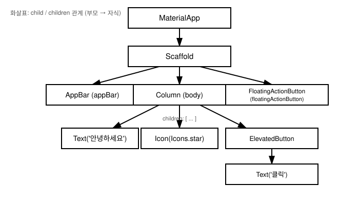

# 3장. 위젯의 개념과 위젯 트리

📖 [◀ 목차](00-목차.md) | [◀ 이전: 2장. 개발 환경 설정과 첫 앱](ch02-개발환경설정과첫앱.md) | [다음: 4장. 기본 위젯들 ▶](ch04-기본위젯들.md)

---

2장에서 첫 Flutter 앱을 실행해 보았습니다. `flutter create`로 생성한 프로젝트를 실행하면 화면에 카운터와 버튼이 있는 기본 앱이 나타났고, `lib/main.dart` 안에는 `MaterialApp`, `Scaffold`, `Text`, `FloatingActionButton` 같은 낯선 이름들이 겹겹이 쌓여 있었습니다. 이번 장에서는 그 코드가 왜 그런 모습을 하고 있는지, Flutter가 화면을 어떤 방식으로 구성하는지를 근본부터 이해합니다. 이 내용은 앞으로 이 책 전체에서 계속 사용할 사고방식이므로 천천히, 확실히 짚고 넘어가겠습니다.

## 3.1 Everything is a Widget

Flutter 공식 문서와 커뮤니티에서 자주 등장하는 문장이 있습니다.

> "Everything is a widget."

이 말은 단순한 슬로건이 아니라 Flutter의 설계를 관통하는 핵심 원리입니다. 다른 UI 프레임워크에서는 화면에 보이는 버튼이나 텍스트 같은 "컨트롤"과, 여백이나 정렬 같은 "레이아웃 속성"을 서로 다른 개념으로 다루는 경우가 많습니다. 예를 들어 어떤 프레임워크에서는 여백을 컨트롤의 `margin` 속성값으로 지정하고, 정렬은 부모 컨테이너의 속성으로 지정합니다. 즉 "보이는 것"과 "배치하는 방법"이 분리되어 있습니다.

Flutter는 이 둘을 구분하지 않습니다. 화면에 글자를 그리는 `Text`도 위젯이고, 버튼 역할을 하는 `ElevatedButton`도 위젯이며, 심지어 자식 위젯 주위에 여백을 주는 `Padding`도 위젯이고, 자식을 가운데로 놓는 `Center`도 위젯입니다. 다음 코드를 봅시다.

```dart
Center(
  child: Padding(
    padding: const EdgeInsets.all(16.0),
    child: Text(
      '환영합니다',
      style: TextStyle(fontSize: 20, color: Colors.blue),
    ),
  ),
)
```

이 코드에는 눈에 보이는 요소가 사실상 텍스트 하나뿐입니다. 그런데도 `Center`, `Padding`, `Text` 세 개의 위젯이 등장합니다. `Padding`은 화면에 아무것도 그리지 않고 그저 자식 위젯 주위에 16픽셀의 여백을 만드는 역할만 합니다. `Center`도 마찬가지로 자기 자신은 아무것도 그리지 않고, 자식을 부모의 가운데에 배치하는 역할만 합니다. 그럼에도 이 둘은 `Text`와 동등하게 "위젯"이라는 하나의 개념으로 다뤄집니다.

이렇게 설계한 이유는 일관성 때문입니다. Flutter에서는 "이것은 컨트롤이니까 이 방식으로 다루고, 저것은 레이아웃 속성이니까 저 방식으로 다룬다"처럼 두 가지 규칙을 배울 필요가 없습니다. 위젯을 만들고, 조합하고, 중첩시키는 단 하나의 규칙만 익히면 텍스트든 버튼이든 여백이든 정렬이든 애니메이션이든 전부 같은 방식으로 다룰 수 있습니다. 4장에서 다룰 `Text`, `Container`, `Image`, `Icon`은 물론이고, 5장에서 배울 `Row`, `Column`, `Padding`, `Align`, 9장의 테마 관련 위젯, 11장의 애니메이션 위젯까지 이 책에서 앞으로 만나는 거의 모든 개념이 결국 위젯입니다.

정리하면, Flutter에서 위젯이란 **화면의 일부를 어떻게 보여줄지, 혹은 어떻게 배치할지를 기술하는 하나의 불변(immutable) 설정 객체**입니다. 위젯 자체가 화면에 그려지는 실체는 아니고, "이렇게 그려달라"는 선언에 가깝습니다. 이 선언들이 모여 최종 화면이 만들어집니다.

## 3.2 위젯 트리: 부모가 자식을 감싸는 구조

위젯은 혼자 존재하지 않습니다. 하나의 위젯이 다른 위젯을 품고, 그 위젯이 또 다른 위젯을 품는 방식으로 계층 구조를 이룹니다. 이를 **위젯 트리(widget tree)**라고 부릅니다. 나무가 뿌리에서 줄기로, 줄기에서 가지로 뻗어 나가듯이, Flutter 앱도 최상위 위젯 하나에서 시작해 점점 더 작고 구체적인 위젯들로 가지를 뻗어 나갑니다.

이 부모-자식 관계를 코드로 표현하는 방법은 놀랍도록 단순합니다. 부모 위젯의 생성자에 `child`(자식이 하나일 때) 또는 `children`(자식이 여러 개일 때) 매개변수로 자식 위젯을 넘겨주면 됩니다.

```dart
import 'package:flutter/material.dart';

void main() {
  runApp(const MyApp());
}

class MyApp extends StatelessWidget {
  const MyApp({super.key});

  @override
  Widget build(BuildContext context) {
    return MaterialApp(
      title: '위젯 트리 예제',
      home: Scaffold(
        appBar: AppBar(
          title: const Text('홈 화면'),
        ),
        body: Center(
          child: Column(
            mainAxisAlignment: MainAxisAlignment.center,
            children: const [
              Icon(Icons.star, color: Colors.amber, size: 48),
              Text('별점을 남겨주세요'),
              ElevatedButton(
                onPressed: null,
                child: Text('평가하기'),
              ),
            ],
          ),
        ),
      ),
    );
  }
}
```

이 코드를 위에서부터 하나씩 읽어보면 다음과 같은 중첩 구조가 보입니다.

- `MaterialApp`은 `home` 매개변수로 `Scaffold`를 자식으로 가집니다.
- `Scaffold`는 `appBar` 매개변수로 `AppBar`를, `body` 매개변수로 `Center`를 자식으로 가집니다. `Scaffold`처럼 하나의 위젯이 `child` 하나가 아니라 여러 개의 "슬롯"(`appBar`, `body`, `floatingActionButton` 등)을 갖고 각 슬롯에 위젯을 채워 넣는 경우도 있습니다. 이 부분은 4장에서 자세히 다룹니다.
- `Center`는 `child` 매개변수로 `Column`을 자식으로 가집니다.
- `Column`은 `children` 매개변수로 `Icon`, `Text`, `ElevatedButton` 세 개의 위젯을 자식 목록으로 가집니다.
- `ElevatedButton`은 다시 `child` 매개변수로 `Text`를 자식으로 가집니다.

이를 트리 형태로 그리면 다음과 같습니다.



`child`와 `children`의 차이는 단순합니다. `Padding`이나 `Center`, `Container`처럼 자식을 딱 하나만 가질 수 있는 위젯은 `child: Widget` 형태의 매개변수를 사용합니다. 반면 `Column`이나 `Row`, `ListView`처럼 여러 자식을 나란히 배치해야 하는 위젯은 `children: List<Widget>` 형태로 위젯 목록을 받습니다. `Row`와 `Column`은 5장 "레이아웃 시스템"에서 본격적으로 다루겠지만, 지금은 "자식이 여러 개면 `children`에 리스트로 담는다"는 규칙만 기억해도 충분합니다.

중요한 점은, 이 트리 구조가 곧 화면의 시각적 구조와 거의 그대로 대응한다는 것입니다. 트리에서 위에 있을수록 더 큰 범위를, 아래로 내려갈수록 더 구체적인 화면 요소를 담당합니다. 코드를 읽을 때 들여쓰기를 따라가면 트리 구조가, 트리 구조를 따라가면 화면의 배치가 그대로 보입니다. 이것이 Flutter 코드가 "선언적(declarative)"이라고 불리는 이유입니다. 명령형 프로그래밍처럼 "버튼을 만들고, 화면 중앙으로 옮기고, 크기를 조절하라"는 절차를 나열하는 대신, "화면 중앙에 이런 버튼이 있다"는 최종 상태를 트리로 선언하는 것입니다.

## 3.3 StatelessWidget과 StatefulWidget

지금까지 살펴본 `MyApp` 클래스는 `StatelessWidget`을 상속했습니다. Flutter의 모든 위젯 클래스는 크게 두 종류로 나뉩니다. **상태가 없는 `StatelessWidget`**과 **상태를 가지는 `StatefulWidget`**입니다. 이 둘의 차이를 정확히 이해하는 것은 Flutter를 배우는 과정에서 가장 중요한 갈림길 중 하나이며, 6장 "상태 관리 기초"와 13장 "상태 관리 심화"의 토대가 됩니다.

### StatelessWidget: 스스로 변하지 않는 위젯

`StatelessWidget`은 한 번 생성되면 그 내용이 스스로 바뀌지 않는 위젯입니다. "상태(state)가 없다"는 말은 이 위젯이 내부에 시간에 따라 변할 수 있는 데이터를 갖고 있지 않다는 뜻입니다. 화면에 어떻게 그려질지는 오직 위젯을 생성할 때 전달된 값(생성자 매개변수)에 의해서만 결정됩니다. 같은 값으로 생성된 `StatelessWidget`은 언제 다시 그려도 항상 같은 모습입니다.

```dart
class Greeting extends StatelessWidget {
  final String name;

  const Greeting({super.key, required this.name});

  @override
  Widget build(BuildContext context) {
    return Text('안녕하세요, $name님!');
  }
}
```

`Greeting` 위젯은 `name`이라는 값을 생성자에서 받아 그대로 화면에 표시할 뿐, 스스로 `name`을 바꾸는 기능이 없습니다. 화면에 표시되는 문구를 바꾸고 싶다면 `Greeting(name: '다른 이름')`처럼 새로운 위젯 인스턴스를 만들어 갈아 끼워야 합니다. 정적인 문구, 아이콘, 로고, 고정된 레이아웃처럼 사용자 상호작용이나 시간 경과에 따라 스스로 바뀔 필요가 없는 화면 요소는 `StatelessWidget`으로 작성하는 것이 자연스럽습니다.

### StatefulWidget: 스스로 상태를 갖고 다시 그려지는 위젯

반면 `StatefulWidget`은 내부에 시간이 지남에 따라 바뀔 수 있는 데이터, 즉 **상태(state)**를 가지고 있고, 그 상태가 바뀌면 스스로 다시 그려질 수 있습니다. 예를 들어 버튼을 누를 때마다 숫자가 올라가는 카운터, 체크박스의 체크 여부, 텍스트 입력 필드에 사용자가 입력 중인 값 등이 대표적인 상태입니다.

`StatefulWidget`은 조금 독특한 구조를 가지고 있습니다. 위젯 클래스 자체는 여전히 불변(immutable)이지만, 그 위젯과 짝을 이루는 별도의 `State` 객체가 실제 상태를 들고 있습니다.

```dart
class CounterBox extends StatefulWidget {
  const CounterBox({super.key});

  @override
  State<CounterBox> createState() => _CounterBoxState();
}

class _CounterBoxState extends State<CounterBox> {
  int _count = 0;

  void _increment() {
    setState(() {
      _count++;
    });
  }

  @override
  Widget build(BuildContext context) {
    return Column(
      mainAxisSize: MainAxisSize.min,
      children: [
        Text('현재 카운트: $_count'),
        ElevatedButton(
          onPressed: _increment,
          child: const Text('1 증가'),
        ),
      ],
    );
  }
}
```

이 코드에서 `CounterBox`는 `StatefulWidget`을 상속하지만, 정작 `_count`라는 상태 값은 `CounterBox` 클래스가 아니라 `_CounterBoxState` 클래스가 가지고 있습니다. `CounterBox`는 `createState()` 메서드를 통해 자신과 짝이 되는 `_CounterBoxState` 객체를 만들어 줄 뿐입니다.

버튼을 누르면 `_increment` 메서드가 호출되고, 그 안에서 `setState(() { _count++; })`를 호출합니다. `setState`는 Flutter에게 "이 상태가 바뀌었으니 화면을 다시 그려달라"고 알리는 신호입니다. `setState`가 호출되면 Flutter는 이 위젯의 `build` 메서드를 다시 실행해서, 바뀐 `_count` 값이 반영된 새로운 화면을 만들어냅니다. `setState`를 호출하지 않고 `_count` 값만 바꾸면 데이터는 바뀌었어도 화면은 갱신되지 않는다는 점에 주의해야 합니다. `setState`와 상태 관리에 대한 더 깊은 논의는 6장에서 이어집니다.

정리하면 다음과 같습니다.

| 구분 | StatelessWidget | StatefulWidget |
|---|---|---|
| 내부 상태 | 없음 | 있음 (`State` 객체가 보유) |
| 다시 그려지는 조건 | 부모가 새 위젯을 전달할 때만 | 내부에서 `setState()`를 호출할 때, 또는 부모가 새 위젯을 전달할 때 |
| 사용 예 | 고정된 텍스트, 아이콘, 정적 레이아웃 | 카운터, 폼 입력, 체크박스, 애니메이션 |
| 대표 메서드 | `build(BuildContext context)` | `createState()`, 그리고 `State` 안의 `build(BuildContext context)` |

"이 화면 요소가 스스로 바뀔 필요가 있는가?"라는 질문이 두 종류를 구분하는 실용적인 기준입니다. 답이 "아니오"라면 `StatelessWidget`으로 충분하고, "예"라면 `StatefulWidget`이 필요합니다. 처음에는 `StatelessWidget`으로 시작했다가 나중에 상태 관리가 필요해지면 `StatefulWidget`으로 바꾸는 경우도 흔합니다.

## 3.4 build 메서드와 BuildContext

앞의 두 예제 모두에서 `build` 메서드가 등장했습니다. `StatelessWidget`은 클래스 자신이 `build(BuildContext context)`를 직접 구현하고, `StatefulWidget`은 짝이 되는 `State` 클래스가 `build(BuildContext context)`를 구현합니다. 이 메서드는 Flutter 프레임워크가 화면을 그리기 위해 호출하는 매우 중요한 메서드입니다.

`build` 메서드가 하는 일은 한 가지입니다. **"지금 이 위젯이 어떤 모습이어야 하는지"를 다른 위젯들의 조합으로 설명하는 위젯 트리(정확히는 그 일부)를 반환하는 것**입니다. 앞서 `CounterBox`의 `build`는 `Column` 위젯 하나를 반환했고, 그 `Column`은 다시 `Text`와 `ElevatedButton`을 자식으로 가졌습니다.

여기서 중요한 개념이 하나 있습니다. `build` 메서드는 Flutter가 필요하다고 판단할 때마다, 즉 화면을 처음 그릴 때, `StatefulWidget`에서 `setState`가 호출되었을 때, 부모 위젯이 다시 그려지면서 이 위젯에 새로운 설정값을 전달할 때 등 여러 상황에서 **반복적으로 호출될 수 있는 메서드**라는 점입니다. 따라서 `build` 메서드 안에서는 시간이 오래 걸리는 작업(네트워크 요청, 무거운 연산 등)을 직접 수행해서는 안 됩니다. 그런 작업은 14장 "비동기 프로그래밍과 FutureBuilder"와 15장 "네트워크 통신"에서 다루는 방법을 사용해야 합니다. `build` 메서드는 어디까지나 "현재 상태를 바탕으로 위젯 트리를 조립해서 반환하는" 가벼운 함수로 취급하는 것이 원칙입니다.

`build` 메서드의 매개변수인 `BuildContext context`도 눈여겨봐야 합니다. `BuildContext`는 **이 위젯이 위젯 트리에서 정확히 어느 위치에 있는지에 대한 정보를 담고 있는 핸들(handle)**이라고 이해하면 됩니다. 트리 구조상 어떤 위젯의 자식으로 들어가 있는지, 조상 위젯들이 무엇인지를 나타내는 일종의 "현재 위치 정보"입니다.

지금 단계에서는 `BuildContext`를 다음과 같이 단순하게 받아들이는 것으로 충분합니다.

- `build` 메서드는 항상 `BuildContext`를 매개변수로 받는다.
- 이 `context`는 "지금 이 위젯이 트리의 어디에 있는가"를 나타낸다.
- 나중에 배울 테마 정보 조회(`Theme.of(context)`, 9장), 화면 전환(`Navigator.of(context)`, 8장), 화면 크기 조회(`MediaQuery.of(context)`) 등 여러 기능들이 이 `context`를 통해 "지금 위치에서 조상 트리를 거슬러 올라가며 필요한 정보를 찾는" 방식으로 동작한다.

`BuildContext`를 활용하는 구체적인 방법들은 8장과 9장에서 실제 코드와 함께 자세히 다룰 것이므로, 지금은 "모든 `build` 메서드는 자신의 트리 위치 정보를 담은 `context`를 받으며, 이 `context`가 이후 여러 기능의 열쇠가 된다"는 개념만 기억해 두면 됩니다.

## 3.5 위젯 트리와 화면이 그려지는 흐름

지금까지 배운 내용을 한 번에 정리해 보겠습니다.

1. `runApp(const MyApp())`이 호출되면 Flutter는 `MyApp` 위젯을 트리의 뿌리로 삼아 화면 그리기를 시작합니다.
2. Flutter는 `MyApp`이 `StatelessWidget`이므로 `build(context)`를 호출합니다.
3. `build`는 `MaterialApp` 위젯을 반환합니다. Flutter는 이 `MaterialApp`을 다시 그리기 위해 그 안에 담긴 `home`(즉 `Scaffold`)을 처리합니다.
4. `Scaffold`도 위젯이므로 다시 자신의 `build`가 호출되고, `appBar`, `body` 등 자신이 가진 슬롯에 들어간 위젯들을 배치합니다.
5. 이 과정이 `Column`, `Text`, `Icon`, `ElevatedButton`처럼 더 이상 나눌 수 없는 가장 작은 위젯에 도달할 때까지 재귀적으로 반복됩니다.
6. 만약 트리 중간에 `StatefulWidget`이 있고 그 상태가 `setState()`로 바뀌면, 그 위젯과 그 아래 자손들만 다시 `build`가 호출되어 새로운 트리 조각으로 교체됩니다. 트리 전체를 처음부터 다시 그리는 것이 아니라, 바뀐 부분만 효율적으로 갱신되는 것입니다.

이렇게 위젯 트리를 선언하고, 상태가 바뀔 때마다 필요한 부분만 다시 `build`하는 방식이 Flutter UI 프로그래밍의 근간입니다. 4장에서는 이 트리를 채우는 데 사용할 구체적인 기본 위젯들(`Text`, `Container`, `Row`, `Column`, `Image`, `Icon`, `Scaffold`, `AppBar`)을 하나씩 살펴보고, 이들을 조합해 실제로 동작하는 화면을 만들어 보겠습니다.

## 요약

- Flutter의 핵심 철학은 "Everything is a widget"입니다. 텍스트, 버튼 같은 눈에 보이는 요소뿐 아니라 여백(`Padding`), 정렬(`Center`) 같은 레이아웃 개념까지 모두 위젯이라는 하나의 통일된 개념으로 다뤄집니다.
- 위젯은 부모가 `child`(자식 하나) 또는 `children`(자식 여러 개) 매개변수로 다른 위젯을 감싸는 방식으로 중첩되어 **위젯 트리**를 이룹니다. 트리의 구조는 화면의 시각적 구조와 대응합니다.
- `StatelessWidget`은 내부 상태가 없어 한 번 그려지면 스스로 바뀌지 않는 위젯이며, `build(BuildContext context)`를 직접 구현합니다.
- `StatefulWidget`은 자신과 짝이 되는 `State` 객체에 상태를 보관하며, `setState()`를 호출해 상태 변경을 알리면 Flutter가 `build`를 다시 호출해 화면을 갱신합니다.
- `build(BuildContext context)` 메서드는 "현재 상태를 바탕으로 위젯 트리를 조립해 반환하는" 역할을 하며, Flutter에 의해 필요할 때마다 반복적으로 호출됩니다. 무거운 작업을 이 메서드 안에서 직접 수행해서는 안 됩니다.
- `BuildContext`는 위젯이 트리에서 차지하는 위치 정보를 담은 핸들로, 이후 장(8장 네비게이션, 9장 테마)에서 조상 트리의 정보를 조회하는 데 폭넓게 사용됩니다.

## 연습문제

1. "Everything is a widget"이라는 Flutter의 철학을 자신의 언어로 설명하고, 눈에 보이지 않지만 위젯으로 취급되는 예를 두 가지 이상 드세요.
2. 다음 코드가 만드는 위젯 트리를 텍스트나 그림으로 그려 보세요. 어떤 위젯이 어떤 위젯의 자식인지 명확히 표시하세요.

   ```dart
   Scaffold(
     appBar: AppBar(title: const Text('내 앱')),
     body: Padding(
       padding: const EdgeInsets.all(16.0),
       child: Row(
         children: const [
           Icon(Icons.person),
           Text('사용자'),
         ],
       ),
     ),
   )
   ```

3. `StatelessWidget`과 `StatefulWidget`의 차이를 표로 정리하고, 다음 화면 요소들을 각각 어느 쪽으로 구현하는 것이 자연스러운지 이유와 함께 답하세요: (a) 앱의 로고를 표시하는 위젯, (b) 좋아요 버튼을 누르면 하트 아이콘의 색이 바뀌는 위젯.
4. `setState()`를 호출하지 않고 `State` 클래스의 필드 값만 직접 바꾸면 어떤 문제가 발생하는지 설명하세요.
5. `build(BuildContext context)` 메서드 안에서 네트워크 요청과 같은 무거운 작업을 직접 수행하면 안 되는 이유를 `build`가 호출되는 시점과 빈도의 관점에서 설명하세요.


---

📖 [◀ 목차](00-목차.md) | [◀ 이전: 2장. 개발 환경 설정과 첫 앱](ch02-개발환경설정과첫앱.md) | [다음: 4장. 기본 위젯들 ▶](ch04-기본위젯들.md)
