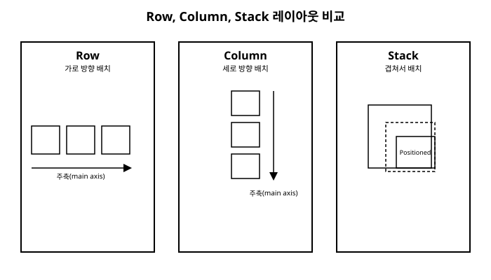

# 5장. 레이아웃 시스템

📖 [◀ 목차](00-목차.md) | [◀ 이전: 4장. 기본 위젯들](ch04-기본위젯들.md) | [다음: 6장. 상태 관리 기초 ▶](ch06-상태관리기초.md)

---

4장에서는 `Text`, `Icon`, `Image`, `Container`, `Row`, `Column` 같은 기본 위젯들을 하나씩 살펴봤습니다. 그런데 실제 화면을 만들다 보면 "위젯을 어디에, 얼마만큼의 크기로, 어떤 순서로 배치할 것인가"라는 문제에 계속 부딪히게 됩니다. Flutter에서는 이 문제를 해결하기 위한 전용 위젯들이 따로 존재합니다. 이런 위젯들을 통틀어 **레이아웃 위젯**이라고 부릅니다.

이번 장에서는 `Row`와 `Column`의 정렬 옵션을 자세히 다루고, `Expanded`와 `Flexible`로 남는 공간을 나누는 방법, `Stack`으로 위젯을 겹쳐 쌓는 방법, `Padding`과 `SizedBox`로 여백과 간격을 만드는 방법, 마지막으로 `MediaQuery`로 화면 크기에 반응하는 레이아웃의 기초를 배웁니다. 이 장을 마치면 카드 목록이나 프로필 화면처럼 실전에서 자주 등장하는 화면 구조를 직접 조립할 수 있게 됩니다.

## Row와 Column의 정렬

`Row`는 자식 위젯을 가로로, `Column`은 세로로 나열합니다. 두 위젯은 배치 방향만 다를 뿐 사용법은 거의 동일하며, 정렬을 다루는 두 가지 핵심 속성 `mainAxisAlignment`와 `crossAxisAlignment`를 공유합니다.

이 두 속성을 이해하려면 먼저 **주축(main axis)**과 **교차축(cross axis)** 개념을 알아야 합니다. `Row`의 주축은 가로 방향이고 교차축은 세로 방향입니다. `Column`은 그 반대로, 주축이 세로 방향이고 교차축이 가로 방향입니다. 즉 "주축"은 위젯이 나열되는 방향, "교차축"은 그와 수직인 방향을 가리킵니다.



### mainAxisAlignment: 주축 방향 정렬

`mainAxisAlignment`는 자식들을 주축 방향으로 어떻게 배치할지 결정합니다. `MainAxisAlignment` 열거형이 제공하는 주요 값은 다음과 같습니다.

- `MainAxisAlignment.start`: 시작 지점에 몰아서 배치(기본값)
- `MainAxisAlignment.end`: 끝 지점에 몰아서 배치
- `MainAxisAlignment.center`: 가운데로 모아서 배치
- `MainAxisAlignment.spaceBetween`: 양 끝에 붙이고 나머지 공간을 자식 사이에 균등 분배
- `MainAxisAlignment.spaceAround`: 각 자식의 앞뒤에 동일한 여백을 부여(양 끝은 그 절반)
- `MainAxisAlignment.spaceEvenly`: 자식 사이와 양 끝 모두에 동일한 여백을 부여

```dart
Row(
  mainAxisAlignment: MainAxisAlignment.spaceBetween,
  children: const [
    Icon(Icons.star),
    Icon(Icons.star),
    Icon(Icons.star),
  ],
)
```

이 코드는 세 개의 별 아이콘을 가로로 배치하되, 첫 번째 아이콘은 왼쪽 끝에, 마지막 아이콘은 오른쪽 끝에 붙이고 그 사이 공간을 균등하게 나눕니다.

### crossAxisAlignment: 교차축 방향 정렬

`crossAxisAlignment`는 자식들을 교차축 방향으로 어떻게 배치할지 결정합니다. `CrossAxisAlignment` 열거형의 주요 값은 다음과 같습니다.

- `CrossAxisAlignment.start`: 교차축 시작 지점에 정렬
- `CrossAxisAlignment.end`: 교차축 끝 지점에 정렬
- `CrossAxisAlignment.center`: 교차축 가운데에 정렬(기본값)
- `CrossAxisAlignment.stretch`: 교차축 방향으로 꽉 채우도록 늘림

```dart
Column(
  crossAxisAlignment: CrossAxisAlignment.start,
  children: const [
    Text('제목입니다'),
    Text('부제목입니다'),
  ],
)
```

`Column`의 교차축은 가로 방향이므로, 위 코드는 두 텍스트를 왼쪽 정렬로 배치합니다. 기본값인 `center`를 그대로 두면 텍스트 길이가 다를 때 가운데로 모여 정렬이 어긋나 보이므로, 왼쪽 정렬이 필요한 목록형 화면에서는 `CrossAxisAlignment.start`를 자주 사용합니다.

두 속성을 함께 사용하면 자식 위젯들을 원하는 위치에 정확히 배치할 수 있습니다.

```dart
Row(
  mainAxisAlignment: MainAxisAlignment.center,
  crossAxisAlignment: CrossAxisAlignment.end,
  children: const [
    Text('가격: '),
    Text(
      '15,000원',
      style: TextStyle(fontSize: 24, fontWeight: FontWeight.bold),
    ),
  ],
)
```

두 텍스트의 글자 크기가 다르더라도 `crossAxisAlignment: CrossAxisAlignment.end`를 지정하면 아래쪽 기준선이 맞춰집니다.

## Expanded와 Flexible로 공간 나누기

`Row`나 `Column`의 자식들은 기본적으로 자기 콘텐츠가 필요로 하는 만큼만 공간을 차지합니다. 그런데 남는 공간을 자식들에게 나눠주고 싶을 때가 있습니다. 이럴 때 `Expanded`와 `Flexible`을 사용합니다.

### Expanded

`Expanded`는 `Row`나 `Column`의 자식을 감싸서, 남는 공간을 최대한 차지하도록 만드는 위젯입니다.

```dart
Row(
  children: [
    Expanded(
      child: Container(color: Colors.red, height: 50),
    ),
    Expanded(
      child: Container(color: Colors.blue, height: 50),
    ),
  ],
)
```

이 코드는 빨간 상자와 파란 상자가 화면 가로 폭을 정확히 절반씩 나눠 갖게 만듭니다. `Expanded`로 감싸지 않은 자식이 먼저 자기 크기만큼 공간을 차지하고, 남는 공간을 `Expanded` 위젯들이 나눠 갖는 방식입니다.

### flex로 비율 조정하기

여러 개의 `Expanded`가 있을 때 `flex` 매개변수로 분배 비율을 지정할 수 있습니다. `flex` 값은 정수이며 기본값은 1입니다.

```dart
Row(
  children: [
    Expanded(
      flex: 2,
      child: Container(color: Colors.red, height: 50),
    ),
    Expanded(
      flex: 1,
      child: Container(color: Colors.blue, height: 50),
    ),
  ],
)
```

`flex` 값의 비율(여기서는 2:1)에 따라 남는 공간이 나뉘므로, 빨간 상자는 전체 폭의 3분의 2를, 파란 상자는 3분의 1을 차지합니다.

### Flexible과 Expanded의 차이

`Flexible`은 `Expanded`와 비슷하지만, 자식이 남는 공간을 반드시 다 차지하도록 강제하지 않습니다. `Flexible`은 내부적으로 `fit` 매개변수를 가지고 있는데, 기본값인 `FlexFit.loose`는 자식이 필요한 만큼만 크기를 차지하되 할당된 공간을 넘지 않도록 제한만 합니다. 반면 `Expanded`는 `FlexFit.tight`를 사용하는 `Flexible`의 특수한 형태로, 할당된 공간을 항상 꽉 채웁니다.

```dart
Row(
  children: [
    Flexible(
      child: Text('짧은 텍스트'),
    ),
    Flexible(
      flex: 2,
      child: Text(
        '이 텍스트는 훨씬 길어서 필요한 경우 두 줄로 줄바꿈될 수 있습니다',
      ),
    ),
  ],
)
```

정리하면, 자식을 무조건 배정된 공간만큼 늘리고 싶다면 `Expanded`를, 자식의 실제 크기를 존중하면서 넘치지 않게만 제한하고 싶다면 `Flexible`을 사용합니다.

## Stack과 Positioned: 위젯 겹쳐 쌓기

`Row`와 `Column`이 위젯을 순서대로 나열한다면, `Stack`은 위젯들을 서로 겹쳐서 쌓습니다. 프로필 사진 위에 온라인 상태를 나타내는 작은 점을 표시하거나, 배경 이미지 위에 텍스트를 올리는 것처럼 요소를 겹칠 때 사용합니다.

```dart
Stack(
  children: [
    Container(
      width: 200,
      height: 200,
      color: Colors.grey,
    ),
    const Positioned(
      right: 8,
      bottom: 8,
      child: Icon(Icons.favorite, color: Colors.red),
    ),
  ],
)
```

`Stack`의 자식은 기본적으로 왼쪽 위 모서리를 기준으로 겹쳐집니다. 특정 자식의 위치를 세밀하게 지정하고 싶다면 그 자식을 `Positioned`로 감싸고 `top`, `bottom`, `left`, `right` 중 필요한 값을 지정합니다. 위 예제에서는 하트 아이콘을 회색 상자의 오른쪽 아래 모서리에서 8픽셀 떨어진 위치에 고정했습니다.

`Positioned`로 감싸지 않은 자식은 `Stack`의 `alignment` 속성을 따릅니다.

```dart
Stack(
  alignment: Alignment.center,
  children: [
    Container(width: 200, height: 200, color: Colors.grey),
    const Text('중앙 텍스트'),
  ],
)
```

`alignment: Alignment.center`를 지정하면 `Positioned`로 위치를 지정하지 않은 자식들이 `Stack` 영역의 정중앙에 배치됩니다.

## Padding과 SizedBox

### Padding

`Padding`은 자식 위젯 주위에 안쪽 여백을 만드는 위젯입니다. `padding` 매개변수에 `EdgeInsets`를 전달해서 여백의 크기를 지정합니다.

```dart
Padding(
  padding: const EdgeInsets.all(16.0),
  child: const Text('여백이 있는 텍스트'),
)
```

`EdgeInsets`는 여백을 지정하는 몇 가지 생성자를 제공합니다.

- `EdgeInsets.all(double value)`: 상하좌우 모두 동일한 여백
- `EdgeInsets.symmetric({double horizontal, double vertical})`: 가로/세로 방향으로 각각 동일한 여백
- `EdgeInsets.only({double left, double top, double right, double bottom})`: 원하는 방향만 개별 지정
- `EdgeInsets.fromLTRB(double left, double top, double right, double bottom)`: 네 방향을 순서대로 지정

```dart
Padding(
  padding: const EdgeInsets.symmetric(horizontal: 24.0, vertical: 8.0),
  child: const Text('가로 24, 세로 8만큼 여백'),
)
```

### SizedBox

`SizedBox`는 자식 위젯의 크기를 고정된 너비와 높이로 제한하는 위젯입니다.

```dart
SizedBox(
  width: 120,
  height: 48,
  child: ElevatedButton(
    onPressed: () {},
    child: const Text('가입하기'),
  ),
)
```

`SizedBox`는 이렇게 자식의 크기를 강제하는 용도로도 쓰이지만, 실전에서는 `child` 없이 `Row`나 `Column` 안에서 **빈 간격을 만드는 용도**로도 자주 쓰입니다.

```dart
Column(
  children: const [
    Text('첫 번째 줄'),
    SizedBox(height: 16),
    Text('두 번째 줄'),
  ],
)
```

`SizedBox(height: 16)`은 아무 내용도 없이 세로로 16픽셀만큼의 공간만 차지합니다. 이런 방식은 `Padding`으로 각 텍스트를 감싸는 것보다 코드가 간결해서, 두 위젯 사이의 간격을 벌릴 때 관용적으로 사용됩니다. 가로 방향 간격이 필요하면 `SizedBox(width: 16)`처럼 `width`만 지정합니다.

## MediaQuery로 화면 크기 읽기

지금까지 살펴본 위젯들은 위젯 트리 안에서의 상대적인 배치를 다뤘습니다. 그런데 태블릿과 스마트폰처럼 화면 크기가 크게 다른 기기에 대응하려면, 앱이 실행 중인 화면의 실제 크기를 알아야 할 때가 있습니다. 이때 사용하는 것이 `MediaQuery`입니다.

`MediaQuery.of(context)`는 현재 화면에 대한 다양한 정보를 담은 `MediaQueryData` 객체를 반환합니다. 이 중 `size` 속성이 화면의 너비와 높이를 `Size` 객체로 담고 있습니다.

```dart
class ResponsiveBox extends StatelessWidget {
  const ResponsiveBox({super.key});

  @override
  Widget build(BuildContext context) {
    final screenWidth = MediaQuery.of(context).size.width;
    final screenHeight = MediaQuery.of(context).size.height;

    return Container(
      width: screenWidth * 0.8,
      height: screenHeight * 0.2,
      color: Colors.orange,
      child: Center(
        child: Text('너비: ${screenWidth.toStringAsFixed(0)}'),
      ),
    );
  }
}
```

이 예제는 화면 너비의 80%, 화면 높이의 20%를 차지하는 상자를 만듭니다. 화면 크기가 바뀌면(예: 기기를 회전하면) `MediaQuery.of(context)`가 새로운 값을 반환하고 `build()`가 다시 호출되어 상자 크기도 함께 조정됩니다.

간단한 반응형 레이아웃은 화면 너비를 기준으로 분기 처리하는 방식으로도 만들 수 있습니다.

```dart
Widget build(BuildContext context) {
  final width = MediaQuery.of(context).size.width;

  if (width < 600) {
    return const Text('좁은 화면: 스마트폰 레이아웃');
  } else {
    return const Text('넓은 화면: 태블릿 레이아웃');
  }
}
```

이렇게 너비 값에 따라 서로 다른 위젯 트리를 반환하면, 하나의 코드베이스로 스마트폰과 태블릿 모두에 어울리는 화면을 만들 수 있습니다. `MediaQuery`는 이 밖에도 `padding`(노치나 상태 표시줄 영역), `devicePixelRatio` 같은 정보도 제공하지만, 본격적인 반응형 디자인 기법은 이 책의 범위를 넘어서므로 여기서는 화면 크기를 읽는 기초만 다룹니다.

## 실전 예제: 카드 목록과 프로필 화면

지금까지 배운 레이아웃 위젯들을 조합하면 실전에서 자주 보는 화면 구조를 만들 수 있습니다.

### 카드 목록 아이템

```dart
class ProductCard extends StatelessWidget {
  const ProductCard({
    super.key,
    required this.name,
    required this.price,
    required this.imageColor,
  });

  final String name;
  final String price;
  final Color imageColor;

  @override
  Widget build(BuildContext context) {
    return Padding(
      padding: const EdgeInsets.symmetric(horizontal: 16.0, vertical: 8.0),
      child: Row(
        crossAxisAlignment: CrossAxisAlignment.center,
        children: [
          Container(
            width: 64,
            height: 64,
            color: imageColor,
          ),
          const SizedBox(width: 16),
          Expanded(
            child: Column(
              crossAxisAlignment: CrossAxisAlignment.start,
              children: [
                Text(
                  name,
                  style: const TextStyle(
                    fontSize: 16,
                    fontWeight: FontWeight.bold,
                  ),
                ),
                const SizedBox(height: 4),
                Text(
                  price,
                  style: const TextStyle(color: Colors.grey),
                ),
              ],
            ),
          ),
          const Icon(Icons.chevron_right),
        ],
      ),
    );
  }
}
```

이 카드는 왼쪽에 정사각형 이미지, 가운데에 상품명과 가격, 오른쪽에 화살표 아이콘을 배치합니다. 가운데 영역을 `Expanded`로 감싸서 상품명이 길거나 짧아도 남는 공간을 모두 차지하도록 만들었고, 그 결과 오른쪽 화살표 아이콘은 항상 카드 오른쪽 끝에 고정됩니다.

### 프로필 화면

```dart
class ProfileHeader extends StatelessWidget {
  const ProfileHeader({super.key});

  @override
  Widget build(BuildContext context) {
    return Container(
      width: double.infinity,
      padding: const EdgeInsets.all(24.0),
      color: Colors.blueGrey.shade50,
      child: Column(
        children: [
          Stack(
            alignment: Alignment.bottomRight,
            children: [
              Container(
                width: 96,
                height: 96,
                decoration: const BoxDecoration(
                  color: Colors.blueGrey,
                  shape: BoxShape.circle,
                ),
              ),
              Positioned(
                right: 0,
                bottom: 0,
                child: Container(
                  width: 24,
                  height: 24,
                  decoration: BoxDecoration(
                    color: Colors.green,
                    shape: BoxShape.circle,
                    border: Border.all(color: Colors.white, width: 2),
                  ),
                ),
              ),
            ],
          ),
          const SizedBox(height: 12),
          const Text(
            '김민준',
            style: TextStyle(fontSize: 20, fontWeight: FontWeight.bold),
          ),
          const SizedBox(height: 4),
          const Text('Flutter 개발자', style: TextStyle(color: Colors.grey)),
          const SizedBox(height: 16),
          Row(
            mainAxisAlignment: MainAxisAlignment.spaceEvenly,
            children: const [
              _ProfileStat(label: '게시물', value: '128'),
              _ProfileStat(label: '팔로워', value: '2,540'),
              _ProfileStat(label: '팔로잉', value: '312'),
            ],
          ),
        ],
      ),
    );
  }
}

class _ProfileStat extends StatelessWidget {
  const _ProfileStat({required this.label, required this.value});

  final String label;
  final String value;

  @override
  Widget build(BuildContext context) {
    return Column(
      children: [
        Text(
          value,
          style: const TextStyle(fontSize: 18, fontWeight: FontWeight.bold),
        ),
        Text(label, style: const TextStyle(color: Colors.grey, fontSize: 12)),
      ],
    );
  }
}
```

이 예제는 `Stack`으로 프로필 원형 이미지 위에 초록색 온라인 상태 점을 겹치고, `Column`으로 이름과 직함을 세로로 나열하며, 마지막으로 `Row`와 `mainAxisAlignment: MainAxisAlignment.spaceEvenly`로 통계 세 개를 균등하게 배치했습니다. 이렇게 `Row`, `Column`, `Stack`, `Padding`, `SizedBox`는 서로 독립적인 위젯이 아니라, 중첩해서 조합할수록 진가를 발휘하는 도구들입니다.

## 요약

- `Row`와 `Column`은 `mainAxisAlignment`(주축 방향 정렬)와 `crossAxisAlignment`(교차축 방향 정렬)로 자식 위젯의 배치를 세밀하게 조정할 수 있습니다.
- `Expanded`는 남는 공간을 꽉 채우고, `Flexible`은 자식의 크기를 존중하면서 넘치지 않게만 제한합니다. 둘 다 `flex` 매개변수로 여러 자식 사이의 분배 비율을 지정할 수 있습니다.
- `Stack`은 위젯을 겹쳐 쌓고, `Positioned`는 `Stack` 안에서 특정 자식의 위치를 `top`/`bottom`/`left`/`right`로 세밀하게 지정합니다.
- `Padding`은 안쪽 여백을, `SizedBox`는 고정 크기 또는 위젯 사이의 빈 간격을 만드는 데 사용합니다.
- `MediaQuery.of(context).size`로 현재 화면의 너비와 높이를 읽어 화면 크기에 따라 다른 레이아웃을 적용하는 반응형 레이아웃의 기초를 만들 수 있습니다.
- 여러 레이아웃 위젯을 중첩하면 카드 목록이나 프로필 화면 같은 실전적인 UI 구조를 조립할 수 있습니다.

다음 6장에서는 3장에서 잠깐 언급했던 `StatefulWidget`을 완결하여, 화면이 사용자와 상호작용하며 스스로 상태를 바꾸는 방법을 배웁니다.

## 연습문제

1. `mainAxisAlignment`와 `crossAxisAlignment`의 차이를 `Row`와 `Column` 각각의 경우로 나누어 설명하세요.
2. `Expanded`와 `Flexible`의 차이를 설명하고, `flex: 3`과 `flex: 1`을 가진 두 `Expanded`가 있을 때 각각이 차지하는 공간의 비율을 계산하세요.
3. `Stack`과 `Positioned`를 사용해서, 회색 사각형 이미지의 왼쪽 위 모서리에 "NEW"라는 빨간 배지 텍스트를 겹치는 위젯을 작성하세요.
4. `SizedBox`가 자식 위젯의 크기를 고정하는 용도 외에 어떤 용도로 흔히 쓰이는지 설명하고, `Column`의 두 `Text` 위젯 사이에 세로 간격 20을 만드는 코드를 작성하세요.
5. `MediaQuery.of(context).size.width`를 이용해서, 화면 너비가 400 미만이면 빨간 상자를, 400 이상이면 파란 상자를 보여주는 위젯을 작성하세요.


---

📖 [◀ 목차](00-목차.md) | [◀ 이전: 4장. 기본 위젯들](ch04-기본위젯들.md) | [다음: 6장. 상태 관리 기초 ▶](ch06-상태관리기초.md)
