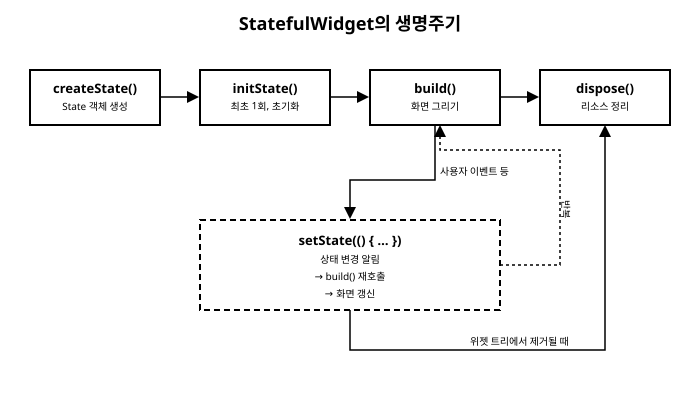

# 6장. 상태 관리 기초

📖 [◀ 목차](00-목차.md) | [◀ 이전: 5장. 레이아웃 시스템](ch05-레이아웃시스템.md) | [다음: 7장. 사용자 입력과 이벤트 처리 ▶](ch07-사용자입력과이벤트처리.md)

---

3장에서 위젯의 개념을 소개하면서, Flutter의 위젯에는 두 가지 종류가 있다고 이야기했습니다. 한 번 만들어지면 내용이 바뀌지 않는 `StatelessWidget`과, 시간이 지나면서 내부 상태가 바뀌고 그에 따라 화면도 다시 그려지는 `StatefulWidget`입니다. 지금까지의 예제 대부분은 `StatelessWidget`으로 충분했지만, 버튼을 누르면 숫자가 올라가는 카운터나 체크박스의 켜짐/꺼짐 상태처럼 "시간에 따라 변하는 값"을 화면에 반영하려면 `StatefulWidget`이 반드시 필요합니다.

이번 장에서는 `StatefulWidget`과 `State<T>` 클래스의 관계, 화면을 다시 그리게 만드는 `setState()`의 동작 원리, 그리고 `initState()`와 `dispose()`로 대표되는 생명주기 메서드를 배웁니다. 이 장을 마치면 카운터 앱을 처음부터 끝까지 직접 구현하면서 Flutter의 상태 관리가 어떻게 동작하는지 이해하게 됩니다.

## StatefulWidget과 State의 관계

`StatelessWidget`은 `build()` 메서드 하나만 정의하면 되지만, `StatefulWidget`은 조금 다른 구조를 가집니다. `StatefulWidget` 자체는 상태를 직접 담지 않고, 그 상태를 관리하는 별도의 `State` 객체를 만들어내는 역할만 합니다.

```dart
class Counter extends StatefulWidget {
  const Counter({super.key});

  @override
  State<Counter> createState() => _CounterState();
}
```

`StatefulWidget`을 상속하는 클래스는 반드시 `createState()` 메서드를 오버라이드해서, 이 위젯과 짝을 이루는 `State` 객체를 반환해야 합니다. 실제 상태 값과 `build()` 메서드는 이 `State` 클래스 쪽에 정의합니다.

```dart
class _CounterState extends State<Counter> {
  int _count = 0;

  @override
  Widget build(BuildContext context) {
    return Text('현재 값: $_count');
  }
}
```

`State<Counter>`처럼 제네릭 타입으로 어떤 위젯의 상태인지 표시합니다. 관례적으로 `State` 클래스의 이름은 위젯 이름 앞에 밑줄(`_`)을 붙여 `_CounterState`처럼 짓고, 밑줄은 이 클래스가 같은 파일 안에서만 쓰이는 비공개(private) 클래스임을 나타냅니다.

여기서 왜 굳이 위젯과 상태 객체를 분리했는지 궁금할 수 있습니다. Flutter는 화면을 다시 그릴 때마다 위젯 객체를 새로 만들어서 버리는 방식으로 동작합니다. 즉 `build()`가 호출될 때마다 `Counter` 위젯 인스턴스는 새로 생성됩니다. 하지만 `_count` 같은 값은 화면이 다시 그려지는 동안에도 계속 유지되어야 하므로, 위젯보다 오래 살아남는 별도의 `State` 객체에 보관하는 것입니다. 이 `State` 객체는 위젯이 트리에서 제거되기 전까지 계속 유지됩니다.

## setState(): 화면을 다시 그리라는 신호

`State` 클래스 안에서 `_count`처럼 상태로 쓰이는 필드는 일반적인 Dart 필드와 다를 게 없습니다. 그래서 다음과 같이 값을 직접 바꾸는 코드를 작성하고 싶어질 수 있습니다.

```dart
void _increment() {
  _count = _count + 1;
}
```

하지만 이 코드는 `_count` 값은 확실히 바꾸지만, 화면에는 아무 변화도 일으키지 않습니다. Flutter는 필드 값이 바뀌었다는 사실을 스스로 감지하지 못하기 때문입니다. Dart 입장에서 `_count`는 그냥 정수 필드일 뿐이고, 이 값이 화면과 연결되어 있다는 것을 Flutter 프레임워크에 알려주는 절차가 따로 필요합니다. 그 절차가 바로 `setState()`입니다.

```dart
void _increment() {
  setState(() {
    _count = _count + 1;
  });
}
```

`setState()`는 콜백 함수(`() { ... }`)를 인자로 받습니다. 이 콜백 안에서 상태 값을 변경하면, `setState()`는 다음 두 가지 일을 순서대로 처리합니다.

1. 콜백을 실행해서 실제로 상태 값을 바꿉니다.
2. 이 `State` 객체가 속한 위젯을 "다시 그려야 하는(dirty) 상태"로 표시하고, Flutter 프레임워크에게 다음 프레임에서 `build()`를 다시 호출하도록 예약합니다.

즉 `setState()`의 핵심은 상태 값을 바꾸는 것 자체가 아니라, **"이 값이 바뀌었으니 화면을 갱신해야 한다"는 사실을 Flutter에게 알리는 것**입니다. 상태 변수를 `setState()` 콜백 바깥에서 바꾸면 값은 바뀌어도 화면은 그대로 남는 반면, `setState()` 안에서 바꾸면 값이 바뀜과 동시에 `build()`가 재실행되어 새로운 값이 화면에 반영됩니다.

```dart
ElevatedButton(
  onPressed: _increment,
  child: const Text('증가'),
)
```

이런 식으로 버튼의 `onPressed` 콜백에서 `setState()`를 감싼 메서드를 호출하면, 버튼을 누를 때마다 상태가 바뀌고 화면도 함께 갱신됩니다.

> 주의: `setState()`의 콜백 함수 자체는 동기적으로 즉시 실행됩니다. 콜백 안에서 비동기 작업(예: 서버 요청)을 직접 수행하지 말고, 비동기 작업이 끝난 뒤 그 결과값만 `setState()` 콜백 안에서 대입하는 방식을 사용해야 합니다. 비동기 프로그래밍은 14장에서 자세히 다룹니다.

## State의 생명주기 메서드

`State` 객체는 생성되어 화면에 나타났다가, 언젠가 화면에서 사라지기까지 정해진 순서를 거칩니다. 이 순서에 맞춰 Flutter가 자동으로 호출해주는 메서드들을 **생명주기 메서드**라고 부릅니다. 이 장에서는 그중 가장 많이 쓰이는 `initState()`와 `dispose()`를 소개합니다.

### initState(): 최초 1회 초기화

`initState()`는 `State` 객체가 위젯 트리에 삽입될 때 딱 한 번만 호출됩니다. 서버에서 초기 데이터를 가져오거나, 애니메이션 컨트롤러를 생성하거나, 상태 변수의 초깃값을 계산하는 등 "이 화면이 시작될 때 한 번만 하면 되는 일"을 여기에 작성합니다.

```dart
class _CounterState extends State<Counter> {
  int _count = 0;

  @override
  void initState() {
    super.initState();
    _count = 10; // 초기값을 10으로 설정
    print('Counter 위젯이 화면에 삽입되었습니다.');
  }

  @override
  Widget build(BuildContext context) {
    return Text('현재 값: $_count');
  }
}
```

`initState()`를 오버라이드할 때는 반드시 맨 처음 줄에서 `super.initState()`를 호출해야 합니다. 이는 부모 클래스인 `State`가 내부적으로 필요한 초기화 작업을 수행하기 때문이며, 이를 빠뜨리면 오류가 발생합니다. 또한 `initState()` 안에서는 아직 위젯이 화면에 완전히 배치되지 않았기 때문에, `BuildContext`에 의존하는 일부 작업(예: `MediaQuery.of(context)`로 화면 크기를 얻는 것)은 여기서 안전하게 수행할 수 없는 경우가 있습니다. 그런 작업은 이후 장에서 다루는 다른 생명주기 메서드에서 처리합니다.

### dispose(): 리소스 정리

`dispose()`는 `State` 객체가 위젯 트리에서 완전히 제거될 때 호출됩니다. `initState()`에서 만든 리소스(예: 스트림 구독, 애니메이션 컨트롤러, 텍스트 입력 컨트롤러 등)를 정리해서 메모리 누수를 막는 것이 이 메서드의 역할입니다.

```dart
@override
void dispose() {
  print('Counter 위젯이 화면에서 제거됩니다.');
  super.dispose();
}
```

`initState()`와 반대로, `dispose()`를 오버라이드할 때는 정리 작업을 먼저 수행한 뒤 마지막 줄에서 `super.dispose()`를 호출하는 것이 관례입니다. `dispose()`가 호출된 이후에는 그 `State` 객체에 대해 다시 `setState()`를 호출할 수 없으므로, 비동기 작업이 진행 중이라면 그 결과를 처리하기 전에 해당 위젯이 이미 제거되지 않았는지 확인하는 습관이 필요합니다(이 내용은 14장에서 더 자세히 다룹니다).

정리하면, `initState()`는 준비 단계, `dispose()`는 마무리 단계를 담당하며, 그 사이에서 `build()`가 `setState()` 호출에 따라 여러 번 반복 실행됩니다.



## 전체 예제: 카운터 앱

지금까지 배운 내용을 모두 합쳐서, 버튼을 누르면 숫자가 하나씩 늘어나는 카운터 앱을 처음부터 끝까지 작성해 보겠습니다.

```dart
import 'package:flutter/material.dart';

void main() {
  runApp(const CounterApp());
}

class CounterApp extends StatelessWidget {
  const CounterApp({super.key});

  @override
  Widget build(BuildContext context) {
    return MaterialApp(
      title: '카운터 앱',
      home: const CounterPage(),
    );
  }
}

class CounterPage extends StatefulWidget {
  const CounterPage({super.key});

  @override
  State<CounterPage> createState() => _CounterPageState();
}

class _CounterPageState extends State<CounterPage> {
  int _count = 0;

  @override
  void initState() {
    super.initState();
    print('CounterPage가 화면에 삽입되었습니다. 초기값: $_count');
  }

  @override
  void dispose() {
    print('CounterPage가 화면에서 제거됩니다.');
    super.dispose();
  }

  void _increment() {
    setState(() {
      _count = _count + 1;
    });
  }

  void _reset() {
    setState(() {
      _count = 0;
    });
  }

  @override
  Widget build(BuildContext context) {
    return Scaffold(
      appBar: AppBar(title: const Text('카운터')),
      body: Center(
        child: Column(
          mainAxisAlignment: MainAxisAlignment.center,
          children: [
            const Text('버튼을 누른 횟수'),
            const SizedBox(height: 8),
            Text(
              '$_count',
              style: const TextStyle(
                fontSize: 48,
                fontWeight: FontWeight.bold,
              ),
            ),
            const SizedBox(height: 24),
            Row(
              mainAxisAlignment: MainAxisAlignment.center,
              children: [
                ElevatedButton(
                  onPressed: _increment,
                  child: const Text('증가'),
                ),
                const SizedBox(width: 16),
                OutlinedButton(
                  onPressed: _reset,
                  child: const Text('초기화'),
                ),
              ],
            ),
          ],
        ),
      ),
    );
  }
}
```

이 예제의 흐름을 순서대로 따라가 보겠습니다.

1. 앱이 시작되면 `CounterApp`이 `MaterialApp`을 통해 `CounterPage`를 화면에 올립니다.
2. `CounterPage`는 `StatefulWidget`이므로 `createState()`가 호출되어 `_CounterPageState` 객체가 생성됩니다.
3. 이 `State` 객체가 위젯 트리에 삽입되면서 `initState()`가 한 번 호출되고, `_count`의 초깃값(0)이 콘솔에 출력됩니다.
4. `build()`가 처음 호출되어 "버튼을 누른 횟수: 0"이 화면에 나타납니다.
5. 사용자가 "증가" 버튼을 누르면 `_increment()`가 호출되고, 그 안의 `setState()`가 `_count`를 1 늘린 뒤 `build()`를 다시 호출하도록 예약합니다.
6. `build()`가 재실행되어 화면에 새로운 `_count` 값(1)이 나타납니다.
7. 사용자가 버튼을 누를 때마다 5~6번 과정이 반복됩니다.
8. 사용자가 이 화면을 벗어나 `CounterPage`가 위젯 트리에서 제거되면 `dispose()`가 호출되어 정리 메시지가 출력됩니다.

여기서 `_reset()` 메서드도 `_increment()`와 마찬가지로 `setState()`로 `_count`를 0으로 되돌리는 것을 볼 수 있습니다. 상태를 어떤 값으로 바꾸든, 그 변경 사항이 화면에 반영되려면 반드시 `setState()`로 감싸야 한다는 원칙은 동일합니다.

## 요약

- `StatefulWidget`은 상태를 직접 담지 않고, `createState()`로 생성한 `State<T>` 객체에게 상태 관리와 `build()`를 위임합니다.
- 상태 변수의 값을 바꾸는 것만으로는 화면이 갱신되지 않습니다. 반드시 `setState(() { ... })`로 값 변경 코드를 감싸야 Flutter가 `build()`를 다시 호출해 화면을 갱신합니다.
- `initState()`는 `State` 객체가 트리에 삽입될 때 한 번만 호출되며 초기화 작업에 사용하고, 오버라이드할 때는 맨 처음에 `super.initState()`를 호출해야 합니다.
- `dispose()`는 `State` 객체가 트리에서 제거될 때 호출되며 리소스 정리에 사용하고, 오버라이드할 때는 마지막에 `super.dispose()`를 호출해야 합니다.
- 카운터 앱 예제에서 보듯, `createState()` → `initState()` → `build()` → (사용자 이벤트에 의한 `setState()`와 `build()`의 반복) → `dispose()` 순서로 `StatefulWidget`의 생명주기가 진행됩니다.

이 장에서 다룬 `setState()`는 하나의 `State` 객체 안에서 상태를 관리하는 가장 기초적인 방법입니다. 7장에서는 사용자 입력과 이벤트 처리를 더 폭넓게 다루고, 13장에서는 여러 위젯에 걸쳐 상태를 공유해야 하는 상황을 위한 심화된 상태 관리 기법들을 다룹니다.

## 연습문제

1. `StatelessWidget`과 `StatefulWidget`의 근본적인 차이를 `State` 객체의 유무를 중심으로 설명하세요.
2. 다음 코드는 버튼을 눌러도 화면의 숫자가 바뀌지 않는 문제가 있습니다. 원인을 설명하고 올바르게 고치세요.
   ```dart
   void _increment() {
     _count = _count + 1;
   }
   ```
3. `initState()`와 `dispose()`가 각각 몇 번, 어느 시점에 호출되는지 설명하고, 두 메서드를 오버라이드할 때 `super` 메서드를 호출하는 위치(맨 처음/맨 마지막)가 왜 서로 다른지 설명하세요.
4. 버튼을 누르면 좋아요 개수가 1씩 증가하고, 다른 버튼을 누르면 좋아요 개수가 0 아래로 내려가지 않는 선에서 1씩 감소하는 `StatefulWidget`을 작성하세요.
5. `initState()` 안에서 콘솔에 "화면 시작"을 출력하고, `dispose()` 안에서 "화면 종료"를 출력하는 `StatefulWidget`을 작성한 뒤, 5장에서 배운 `Column`과 `SizedBox`를 사용해 숫자와 버튼 두 개를 세로로 적절한 간격을 두고 배치하세요.


---

📖 [◀ 목차](00-목차.md) | [◀ 이전: 5장. 레이아웃 시스템](ch05-레이아웃시스템.md) | [다음: 7장. 사용자 입력과 이벤트 처리 ▶](ch07-사용자입력과이벤트처리.md)
