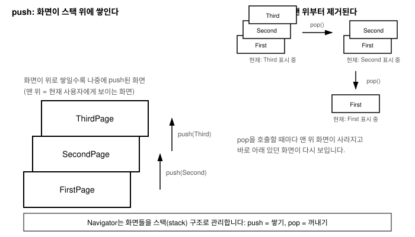

# 8장. 네비게이션과 라우팅

📖 [◀ 목차](00-목차.md) | [◀ 이전: 7장. 사용자 입력과 이벤트 처리](ch07-사용자입력과이벤트처리.md) | [다음: 9장. 테마와 스타일링 ▶](ch09-테마와스타일링.md)

---

지금까지 만든 앱은 화면이 하나뿐이었습니다. 하지만 실제 앱은 대부분 여러 화면으로 이루어져 있습니다. 목록 화면에서 항목을 탭하면 상세 화면으로 이동하고, 상세 화면에서 뒤로 가기를 누르면 다시 목록으로 돌아오는 식입니다. 이번 장에서는 Flutter에서 여러 화면 사이를 이동하는 방법, 즉 네비게이션(navigation)을 다룹니다.

Flutter의 화면 전환은 스택(stack) 자료구조로 이루어집니다. 새 화면으로 이동하는 것을 "쌓는다(push)"고 표현하고, 이전 화면으로 돌아가는 것을 "꺼낸다(pop)"고 표현합니다. 이 비유를 이해하면 네비게이션의 동작 원리가 훨씬 명확해집니다. 기본적인 화면 전환 방법을 익힌 뒤, 화면 사이에 데이터를 주고받는 방법과, 화면이 많아진 앱을 관리하기 쉽게 만들어 주는 이름 있는 라우트(named routes)까지 살펴봅니다.

## 여러 화면을 오가야 하는 문제

3장에서 배운 것처럼 하나의 Flutter 앱은 위젯 트리로 이루어져 있습니다. 그런데 "화면 전체를 통째로 바꾼다"는 것은 단순히 `setState`로 트리 일부를 다시 그리는 것과는 다른 문제입니다. 사용자는 화면을 이동한 뒤에도 기기의 뒤로 가기 버튼이나 화면 안의 뒤로 가기 버튼을 눌러 원래 있던 화면으로 돌아갈 수 있어야 합니다. 즉, 앱은 "지금까지 어떤 화면들을 거쳐 왔는지"를 기억하고 있어야 합니다.

Flutter는 이 문제를 스택 구조로 해결합니다. 앱이 실행되면 스택에는 첫 화면 하나만 들어 있습니다. 사용자가 다음 화면으로 이동하면 그 화면이 스택의 맨 위에 쌓입니다(push). 뒤로 가기를 하면 맨 위 화면이 스택에서 제거되고(pop), 바로 아래 있던 화면이 다시 보이게 됩니다. 이 모든 과정을 관리하는 객체가 `Navigator`입니다.



그림에서 볼 수 있듯이, `FirstPage` 위에 `SecondPage`가 쌓이고 그 위에 다시 `ThirdPage`가 쌓이면 사용자에게는 항상 스택의 맨 위, 즉 가장 최근에 push된 화면이 보입니다. 여기서 `pop()`을 호출하면 `ThirdPage`가 제거되고 `SecondPage`가 다시 화면에 나타납니다. 한 번 더 `pop()`하면 `SecondPage`도 제거되어 `FirstPage`로 돌아갑니다. 웹 브라우저의 "뒤로 가기" 버튼과 원리가 같다고 생각하면 이해하기 쉽습니다.

## 기본 네비게이션: push와 pop

Flutter에서 화면 하나는 보통 `Scaffold`를 담은 하나의 위젯(주로 `StatelessWidget`이나 `StatefulWidget`)으로 표현합니다. 두 번째 화면을 다음과 같이 만들어 보겠습니다.

```dart
class SecondPage extends StatelessWidget {
  const SecondPage({super.key});

  @override
  Widget build(BuildContext context) {
    return Scaffold(
      appBar: AppBar(title: Text('두 번째 화면')),
      body: Center(
        child: ElevatedButton(
          onPressed: () {
            Navigator.pop(context);
          },
          child: Text('뒤로 가기'),
        ),
      ),
    );
  }
}
```

첫 번째 화면에서 이 화면으로 이동하려면 `Navigator.push`를 사용합니다.

```dart
class FirstPage extends StatelessWidget {
  const FirstPage({super.key});

  @override
  Widget build(BuildContext context) {
    return Scaffold(
      appBar: AppBar(title: Text('첫 번째 화면')),
      body: Center(
        child: ElevatedButton(
          onPressed: () {
            Navigator.push(
              context,
              MaterialPageRoute(builder: (context) => SecondPage()),
            );
          },
          child: Text('다음 화면으로'),
        ),
      ),
    );
  }
}
```

`Navigator.push`는 두 개의 인자를 받습니다. 첫 번째는 현재 위젯의 `context`이고, 두 번째는 어떤 화면으로 이동할지를 설명하는 `Route` 객체입니다. `MaterialPageRoute`는 Material 디자인 스타일의 화면 전환 애니메이션(오른쪽에서 왼쪽으로 슬라이드하는 효과 등)을 적용해 주는 대표적인 `Route` 구현체입니다. `builder` 매개변수에는 `BuildContext`를 받아 이동할 화면 위젯을 반환하는 함수를 전달합니다.

`Navigator.pop(context)`는 반대로 현재 화면을 스택에서 제거하고 이전 화면으로 돌아갑니다. 7장에서 다룬 `TextButton`이 다이얼로그나 화면을 "닫는" 용도로 자주 쓰인다고 언급했는데, `Navigator.pop`이 바로 그 "닫기" 동작의 실체입니다.

```dart
TextButton(
  onPressed: () {
    Navigator.pop(context);
  },
  child: Text('닫기'),
)
```

여기서 `context`는 항상 현재 빌드되고 있는 위젯 트리 안에서 유효한 `BuildContext`여야 합니다. 그래야 `Navigator`가 "이 context를 가진 화면이 스택의 어느 위치에 있는지"를 올바르게 찾아 그 화면을 대상으로 push나 pop을 수행할 수 있습니다.

## 화면 간 데이터 전달

화면을 이동할 때 단순히 화면만 바뀌는 것이 아니라 데이터도 함께 전달해야 하는 경우가 많습니다. 예를 들어 목록에서 선택한 항목의 정보를 상세 화면에 넘겨주는 경우입니다.

### push할 때 값 전달하기

가장 간단한 방법은 이동할 화면의 생성자에 값을 전달하는 것입니다.

```dart
class DetailPage extends StatelessWidget {
  final String itemName;

  const DetailPage({super.key, required this.itemName});

  @override
  Widget build(BuildContext context) {
    return Scaffold(
      appBar: AppBar(title: Text('상세 정보')),
      body: Center(
        child: Text('선택한 항목: $itemName', style: TextStyle(fontSize: 20)),
      ),
    );
  }
}
```

```dart
Navigator.push(
  context,
  MaterialPageRoute(
    builder: (context) => DetailPage(itemName: '사과'),
  ),
);
```

`DetailPage`는 다른 위젯과 마찬가지로 평범한 생성자 매개변수(`itemName`)를 가질 뿐입니다. 화면이라고 해서 데이터를 받는 방식이 특별한 것은 아니며, 4장에서 배운 위젯 생성자 패턴을 그대로 활용한 것입니다.

### pop할 때 결과값 돌려받기

반대 방향, 즉 두 번째 화면에서 어떤 결과를 선택한 뒤 그 값을 첫 번째 화면으로 돌려주고 싶을 때도 있습니다. 예를 들어 선택 화면에서 옵션 하나를 고르면, 그 선택 결과를 이전 화면에 알려줘야 하는 상황입니다. 이때는 `Navigator.pop(context, 반환값)`처럼 `pop`에 두 번째 인자로 값을 전달합니다.

```dart
class SelectionPage extends StatelessWidget {
  const SelectionPage({super.key});

  @override
  Widget build(BuildContext context) {
    return Scaffold(
      appBar: AppBar(title: Text('옵션 선택')),
      body: Column(
        children: [
          ListTile(
            title: Text('옵션 A'),
            onTap: () {
              Navigator.pop(context, '옵션 A');
            },
          ),
          ListTile(
            title: Text('옵션 B'),
            onTap: () {
              Navigator.pop(context, '옵션 B');
            },
          ),
        ],
      ),
    );
  }
}
```

호출하는 쪽에서는 `Navigator.push`가 반환하는 `Future`를 `await`해서 그 결과값을 받을 수 있습니다. `push`는 push된 화면이 아직 스택에 남아 있는 동안에는 완료되지 않는 `Future`를 반환하고, 그 화면이 `pop`될 때 비로소 `pop`에 전달된 값을 담아 완료됩니다.

```dart
ElevatedButton(
  onPressed: () async {
    final result = await Navigator.push(
      context,
      MaterialPageRoute(builder: (context) => SelectionPage()),
    );

    if (result != null) {
      setState(() {
        selectedOption = result as String;
      });
    }
  },
  child: Text('옵션 선택하러 가기'),
)
```

`async`/`await` 문법은 14장 비동기 프로그래밍에서 더 자세히 다루지만, 여기서는 "화면이 닫힐 때까지 기다렸다가, 그 화면이 넘겨준 값을 받아서 처리한다"는 흐름만 이해하면 충분합니다. `result`가 `null`인 경우도 처리해야 하는데, 사용자가 값을 선택하지 않고 기기의 뒤로 가기 버튼 등으로 화면을 닫았을 때는 `pop`에 아무 값도 전달되지 않아 `result`가 `null`이 되기 때문입니다.

## 이름 있는 라우트(Named Routes)

지금까지 살펴본 `Navigator.push`와 `MaterialPageRoute`는 이동할 화면을 그 자리에서 직접 생성하는 방식입니다. 화면이 몇 개 되지 않을 때는 이 방식으로 충분하지만, 화면 수가 늘어날수록 앱 곳곳에 `MaterialPageRoute(builder: (context) => ...)` 코드가 반복해서 흩어지게 됩니다. 이럴 때는 이름 있는 라우트를 사용하면 코드를 훨씬 정돈된 형태로 관리할 수 있습니다.

이름 있는 라우트는 문자열 이름과 화면을 미리 짝지어 `MaterialApp`에 등록해 두고, 이동할 때는 그 이름만으로 화면을 지정하는 방식입니다.

```dart
void main() {
  runApp(MaterialApp(
    initialRoute: '/',
    routes: {
      '/': (context) => FirstPage(),
      '/second': (context) => SecondPage(),
      '/settings': (context) => SettingsPage(),
    },
  ));
}
```

`initialRoute`는 앱이 처음 시작할 때 보여줄 화면의 이름입니다. `routes`는 각 이름과 해당 화면을 만드는 함수를 매핑한 `Map`입니다. 이렇게 등록해 두면 화면 이동은 다음처럼 간단해집니다.

```dart
ElevatedButton(
  onPressed: () {
    Navigator.pushNamed(context, '/second');
  },
  child: Text('다음 화면으로'),
)
```

뒤로 가기는 이름 있는 라우트를 쓰더라도 동일하게 `Navigator.pop(context)`를 사용합니다. 스택에서 화면을 꺼내는 동작 자체는 화면을 어떤 방식으로 push했는지와 무관하기 때문입니다.

이름 있는 라우트로 이동할 때도 데이터를 전달할 수 있습니다. `arguments` 매개변수를 사용합니다.

```dart
Navigator.pushNamed(
  context,
  '/second',
  arguments: '사과',
);
```

받는 쪽에서는 `ModalRoute.of(context)!.settings.arguments`로 전달된 값을 꺼낼 수 있습니다.

```dart
class SecondPage extends StatelessWidget {
  const SecondPage({super.key});

  @override
  Widget build(BuildContext context) {
    final itemName = ModalRoute.of(context)!.settings.arguments as String;

    return Scaffold(
      appBar: AppBar(title: Text('두 번째 화면')),
      body: Center(child: Text('전달받은 값: $itemName')),
    );
  }
}
```

### 왜 화면이 많아질수록 유리한가

화면이 몇 개 안 되는 작은 앱이라면 `MaterialPageRoute`를 직접 생성하는 방식과 이름 있는 라우트 사이에 큰 차이가 없습니다. 하지만 화면이 열 개, 스무 개로 늘어나는 실제 앱에서는 이름 있는 라우트가 다음과 같은 이점을 줍니다.

- **경로가 한곳에 모인다.** 앱에 어떤 화면들이 있는지, 각 화면이 어떤 문자열 경로에 대응하는지를 `routes` 맵 한 곳만 보면 파악할 수 있습니다. 화면 목록이 여기저기 코드에 흩어져 있지 않습니다.
- **이동 코드가 짧고 일관적이다.** 어느 파일에서든 `Navigator.pushNamed(context, '/settings')`처럼 문자열 하나로 이동을 표현할 수 있어서, 매번 어떤 클래스를 import해서 생성자를 어떻게 호출해야 하는지 신경 쓸 필요가 줄어듭니다.
- **웹 URL과 자연스럽게 연결된다.** Flutter Web으로 빌드했을 때 라우트 이름은 브라우저 주소창의 경로와 대응될 수 있어서, 딥링크나 URL 기반 이동을 다룰 때 이름 있는 라우트 구조가 유리합니다.
- **리팩터링이 쉬워진다.** 특정 화면의 위젯 클래스명이 바뀌더라도, 그 화면을 가리키는 문자열 이름과 호출하는 쪽의 코드는 그대로 유지할 수 있습니다. 변경은 `routes` 맵 한 줄만 고치면 됩니다.

다만 이름 있는 라우트가 무조건 우월한 것은 아닙니다. 화면 사이에 복잡한 객체를 넘길 때는 `arguments`를 다시 원하는 타입으로 캐스팅해야 하는 번거로움이 있어서, 간단한 앱이나 화면 수가 적은 프로토타입 단계에서는 `MaterialPageRoute`를 직접 쓰는 방식도 충분히 실용적입니다. 프로젝트 규모와 팀의 취향에 맞게 선택하면 됩니다.

## 요약

- Flutter의 화면 전환은 `Navigator`가 관리하는 스택 구조로 동작합니다. 새 화면으로 이동하는 것은 push(쌓기), 이전 화면으로 돌아가는 것은 pop(꺼내기)입니다.
- 기본적인 화면 이동은 `Navigator.push(context, MaterialPageRoute(builder: (context) => SecondPage()))`로, 뒤로 가기는 `Navigator.pop(context)`로 수행합니다.
- push할 화면의 생성자에 값을 전달하면 다음 화면으로 데이터를 넘길 수 있고, `Navigator.pop(context, 반환값)`과 `await Navigator.push(...)`를 조합하면 이전 화면으로 결과값을 돌려받을 수 있습니다.
- 이름 있는 라우트는 `MaterialApp(routes: {...})`에 문자열 이름과 화면을 등록해 두고 `Navigator.pushNamed(context, '/경로')`로 이동하는 방식입니다. 화면이 많아질수록 경로 관리, 코드 일관성, 리팩터링 측면에서 유리합니다.
- 이름 있는 라우트로 데이터를 전달할 때는 `pushNamed`의 `arguments`와 `ModalRoute.of(context)!.settings.arguments`를 사용합니다.

## 연습문제

1. `Navigator.push`와 `Navigator.pop`이 스택 구조로 동작한다는 것을, 화면 A → B → C 순서로 이동한 뒤 두 번 뒤로 가기를 하는 시나리오로 직접 설명해 보세요.
2. 목록 화면에서 항목을 탭하면 그 항목의 이름을 생성자로 전달받는 상세 화면으로 이동하는 코드를 작성해 보세요. (`ListView`는 10장에서 자세히 다루므로, 여기서는 `ListTile` 몇 개를 `Column`에 나열하는 정도로 충분합니다.)
3. 두 번째 화면에 "예"와 "아니오" 버튼을 두고, 각각 `Navigator.pop(context, true)`와 `Navigator.pop(context, false)`를 호출하도록 만든 뒤, 첫 번째 화면에서 `await`로 그 결과를 받아 `Text` 위젯에 표시하는 코드를 작성해 보세요.
4. `MaterialPageRoute`를 직접 사용하는 방식과 이름 있는 라우트 방식의 차이를 설명하고, 화면이 15개인 앱을 만든다면 어느 쪽을 선택할지, 그 이유와 함께 답해 보세요.
5. `MaterialApp`의 `routes`에 `'/'`, `'/second'`, `'/third'` 세 개의 경로를 등록하고, 각 화면에 다음 화면으로 이동하는 버튼과 이전 화면으로 돌아가는 버튼을 만들어 보세요.


---

📖 [◀ 목차](00-목차.md) | [◀ 이전: 7장. 사용자 입력과 이벤트 처리](ch07-사용자입력과이벤트처리.md) | [다음: 9장. 테마와 스타일링 ▶](ch09-테마와스타일링.md)
