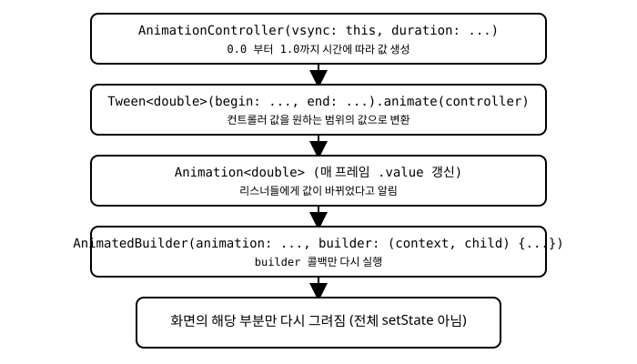

# 11장. 애니메이션 기초

📖 [◀ 목차](00-목차.md) | [◀ 이전: 10장. 리스트와 스크롤](ch10-리스트와스크롤.md) | [다음: 12장. Form과 유효성 검사 ▶](ch12-Form과유효성검사.md)

---

버튼을 눌렀을 때 살짝 커지는 카드, 화면 전환 시 서서히 나타나는 배너, 리스트에 새 항목이 추가될 때 부드럽게 펼쳐지는 효과. 이런 작은 움직임들은 앱을 "그냥 동작하는 화면"에서 "만지고 싶은 화면"으로 바꿔 놓습니다. Flutter는 애니메이션을 프레임워크의 부가 기능이 아니라 렌더링 파이프라인의 핵심 요소로 설계했기 때문에, 비교적 적은 코드로도 매끄러운 애니메이션을 만들 수 있습니다.

이 장에서는 Flutter가 제공하는 두 가지 애니메이션 접근 방식인 **암묵적 애니메이션(implicit animation)**과 **명시적 애니메이션(explicit animation)**을 차례로 살펴봅니다. 4장과 5장에서 다룬 기본 위젯과 레이아웃 위에 움직임을 얹는 방법을 배우고, 6장에서 익힌 `StatefulWidget`의 생명주기를 애니메이션 컨트롤러 관리에 어떻게 연결하는지 확인합니다.

## 11.1 암묵적 애니메이션: 값이 바뀌면 알아서 부드럽게

Flutter에는 이름이 `Animated`로 시작하는 위젯들이 여러 개 있습니다. 이 위젯들의 공통점은 특정 속성 값이 바뀌면 즉시 새 값으로 점프하는 대신, 지정한 시간 동안 이전 값에서 새 값으로 자연스럽게 전환해 준다는 것입니다. 개발자가 애니메이션의 진행 상태를 직접 관리할 필요가 없어서 "암묵적"이라고 부릅니다.

가장 많이 쓰이는 것이 `AnimatedContainer`입니다. 일반 `Container`와 사용법이 거의 같지만, `duration` 매개변수를 반드시 지정해야 합니다.

```dart
class BoxToggle extends StatefulWidget {
  const BoxToggle({super.key});

  @override
  State<BoxToggle> createState() => _BoxToggleState();
}

class _BoxToggleState extends State<BoxToggle> {
  bool _expanded = false;

  @override
  Widget build(BuildContext context) {
    return GestureDetector(
      onTap: () {
        setState(() {
          _expanded = !_expanded;
        });
      },
      child: AnimatedContainer(
        duration: const Duration(milliseconds: 300),
        curve: Curves.easeInOut,
        width: _expanded ? 200 : 100,
        height: _expanded ? 200 : 100,
        decoration: BoxDecoration(
          color: _expanded ? Colors.indigo : Colors.orange,
          borderRadius: BorderRadius.circular(_expanded ? 24 : 8),
        ),
      ),
    );
  }
}
```

동작 방식을 뜯어보면 이렇습니다. `setState`가 호출되어 `_expanded` 값이 바뀌면 `build`가 다시 실행되고, `AnimatedContainer`는 새로 전달받은 `width`, `height`, `color`, `borderRadius` 값이 이전 값과 다르다는 것을 스스로 감지합니다. 그러면 화면에 즉시 새 값을 적용하는 대신, `duration`에 지정한 300밀리초 동안 `curve`(여기서는 `Curves.easeInOut`, 즉 처음과 끝은 느리고 중간은 빠른 곡선)를 따라 값을 보간하면서 매 프레임 다시 그립니다. 개발자는 애니메이션 타이머나 프레임 콜백을 전혀 다루지 않았다는 점에 주목하세요. `setState`로 목표 상태만 알려주면 나머지는 위젯이 알아서 처리합니다.

`AnimatedContainer`가 지원하는 애니메이션 가능 속성에는 `width`, `height`, `padding`, `margin`, `alignment`, `decoration`, `foregroundDecoration`, `transform` 등이 있으며, 애니메이션이 끝났을 때 호출되는 `onEnd` 콜백도 지정할 수 있습니다.

### 그 밖의 Animated* 위젯들

`Animated` 계열 위젯은 `AnimatedContainer` 말고도 여러 개가 있으며, 필요한 속성 하나만 애니메이션 처리하고 싶을 때 유용합니다.

- **`AnimatedOpacity`**: `opacity` 값(0.0~1.0)이 바뀌면 서서히 나타나거나 사라지는 효과를 만듭니다.

  ```dart
  AnimatedOpacity(
    opacity: _visible ? 1.0 : 0.0,
    duration: const Duration(milliseconds: 400),
    child: const FlutterLogo(size: 100),
  )
  ```

- **`AnimatedAlign`**: `alignment` 값이 바뀔 때 자식 위젯이 부드럽게 이동합니다.
- **`AnimatedPadding`**: `padding` 값의 변화를 애니메이션으로 표현합니다.
- **`AnimatedDefaultTextStyle`**: 자식으로 내려가는 텍스트 스타일(글자 크기, 색상, 굵기 등)이 바뀔 때 자연스럽게 전환합니다.
- **`AnimatedPositioned`**: 5장에서 다룬 `Stack` 안에서 `Positioned`의 위치 값이 바뀔 때 위젯이 미끄러지듯 이동하게 합니다. `Stack`의 직계 자식으로만 사용할 수 있습니다.

이 위젯들은 사용 패턴이 모두 동일합니다. "바뀔 값"과 `duration`(그리고 선택적으로 `curve`)을 전달하면, 값이 실제로 달라졌을 때만 애니메이션이 실행됩니다. 처음 빌드될 때는 애니메이션 없이 지정된 값으로 바로 렌더링됩니다.

암묵적 애니메이션은 코드가 짧고 이해하기 쉬워서 대부분의 UI 전환 효과에는 이것만으로 충분합니다. 하지만 애니메이션을 일시 정지하거나, 반복시키거나, 진행 중간 값을 다른 계산에 사용하는 등 더 세밀한 제어가 필요하다면 다음 절에서 다루는 명시적 애니메이션이 필요합니다.

## 11.2 명시적 애니메이션: 직접 제어하기

암묵적 애니메이션은 "목표 값이 바뀌면 자동으로 전환"하는 방식이지만, 명시적 애니메이션은 애니메이션의 시작·정지·반복·역재생을 코드로 직접 지휘합니다. 이를 위한 핵심 클래스가 `AnimationController`입니다.

### AnimationController와 vsync

`AnimationController`는 시간이 지남에 따라 0.0에서 1.0(기본값 기준) 사이의 값을 만들어내는 객체입니다. 화면 주사율에 맞춰 매 프레임 값을 갱신하기 위해 `vsync` 매개변수로 `TickerProvider`가 필요합니다. `StatefulWidget`의 `State`에 `SingleTickerProviderStateMixin`을 붙이면 `State` 자신이 `TickerProvider` 역할을 할 수 있습니다.

```dart
class PulseBox extends StatefulWidget {
  const PulseBox({super.key});

  @override
  State<PulseBox> createState() => _PulseBoxState();
}

class _PulseBoxState extends State<PulseBox>
    with SingleTickerProviderStateMixin {
  late final AnimationController _controller;

  @override
  void initState() {
    super.initState();
    _controller = AnimationController(
      vsync: this,
      duration: const Duration(milliseconds: 400),
    );
  }

  @override
  void dispose() {
    _controller.dispose();
    super.dispose();
  }

  @override
  Widget build(BuildContext context) {
    return Container(); // 다음 절에서 완성합니다
  }
}
```

`SingleTickerProviderStateMixin`이라는 이름에서 알 수 있듯, 이 믹스인은 하나의 `AnimationController`만 관리할 수 있습니다. 화면 하나에서 애니메이션 컨트롤러를 두 개 이상 만들어야 한다면 `TickerProviderStateMixin`(복수형)을 사용해야 합니다.

`AnimationController`는 `forward()`, `reverse()`, `repeat()`, `stop()`, `reset()` 같은 메서드로 재생을 제어합니다. `forward()`는 현재 값에서 1.0까지 진행시키고, `reverse()`는 0.0까지 되돌립니다.

### Tween으로 값의 범위 지정하기

`AnimationController`가 만들어내는 값은 기본적으로 0.0~1.0 사이의 `double`입니다. 하지만 실제로 필요한 값은 크기(픽셀), 색상, 회전 각도처럼 다양합니다. 이때 `Tween`을 사용해 컨트롤러의 진행률(0.0~1.0)을 원하는 범위의 값으로 매핑합니다.

```dart
late final Animation<double> _scale;

@override
void initState() {
  super.initState();
  _controller = AnimationController(
    vsync: this,
    duration: const Duration(milliseconds: 400),
  );
  _scale = Tween<double>(begin: 1.0, end: 1.4).animate(
    CurvedAnimation(parent: _controller, curve: Curves.easeInOut),
  );
}
```

`Tween<double>(begin: 1.0, end: 1.4)`는 "0.0은 1.0으로, 1.0은 1.4로 대응시키고 그 사이는 선형 보간"하는 규칙을 정의합니다. 여기에 `.animate(controller)`를 호출하면 컨트롤러의 진행에 따라 실제로 값을 방출하는 `Animation<double>` 객체가 만들어집니다. 곡선을 적용하고 싶다면 컨트롤러를 바로 넘기는 대신 `CurvedAnimation(parent: _controller, curve: ...)`으로 감싸서 전달하면 됩니다. `Tween`은 `double`뿐 아니라 `ColorTween`, `SizeTween`, `EdgeInsetsTween`처럼 다양한 타입에 대응하는 하위 클래스도 제공합니다.

### AnimatedBuilder로 효율적으로 다시 그리기

`Animation` 객체는 값이 바뀔 때마다 등록된 리스너에게 알림을 보냅니다. 가장 단순한 방법은 `_controller.addListener(() => setState(() {}))`를 호출하는 것이지만, 이렇게 하면 매 프레임마다 `build` 메서드 전체가 다시 실행되어 비효율적입니다. 애니메이션과 무관한 자식 위젯까지 매번 다시 빌드되기 때문입니다.

`AnimatedBuilder`는 이 문제를 해결합니다. `animation`으로 지정한 `Animation`(또는 `AnimationController`)이 값을 갱신할 때마다 `builder` 콜백만 다시 실행하고, 나머지 위젯 트리는 그대로 재사용합니다.

```dart
@override
Widget build(BuildContext context) {
  return AnimatedBuilder(
    animation: _scale,
    builder: (context, child) {
      return Transform.scale(
        scale: _scale.value,
        child: child,
      );
    },
    child: Container(
      width: 120,
      height: 120,
      decoration: BoxDecoration(
        color: Colors.teal,
        borderRadius: BorderRadius.circular(16),
      ),
    ),
  );
}
```

여기서 `child` 매개변수가 핵심입니다. `Container`처럼 애니메이션 값과 무관하게 매 프레임 동일하게 유지되는 무거운 위젯을 `AnimatedBuilder`의 `child`로 넘기면, `builder`가 반복 호출되더라도 이 `child` 인스턴스는 다시 만들어지지 않고 그대로 재사용됩니다. `builder` 콜백은 매개변수로 받은 `child`를 애니메이션 값에 따라 감싸기만 하면 됩니다. 애니메이션되는 부분과 애니메이션되지 않는 부분을 이렇게 분리하는 것이 `AnimatedBuilder`를 사용하는 핵심 패턴입니다.

전체 흐름을 정리하면 다음과 같습니다.



## 11.3 dispose()에서 컨트롤러 해제하기

`AnimationController`는 내부적으로 `Ticker`를 사용해 매 프레임 콜백을 등록합니다. 이 자원은 가비지 컬렉터가 알아서 정리해 주지 않으므로, 위젯이 화면에서 사라질 때 반드시 명시적으로 해제해야 합니다. 해제하지 않으면 이미 제거된 위젯을 위한 애니메이션이 백그라운드에서 계속 실행되면서 메모리를 낭비하고, 심한 경우 "디스포즈된 위젯을 위한 setState 호출" 같은 오류로 이어질 수 있습니다.

6장에서 살펴본 `State`의 생명주기를 떠올려 보면, `initState()`에서 만든 자원은 그에 대응하는 `dispose()`에서 정리하는 것이 원칙이었습니다. `AnimationController`도 예외가 아닙니다.

```dart
@override
void dispose() {
  _controller.dispose();
  super.dispose();
}
```

`super.dispose()`는 관례상 재정의한 `dispose()`의 마지막 줄에 호출합니다. 컨트롤러를 여러 개 사용한다면 각각을 빠짐없이 `dispose()`해야 하며, `TextEditingController`(7장)나 `ScrollController`(10장)처럼 명시적으로 생성한 다른 컨트롤러들과 마찬가지로 취급하면 됩니다.

## 11.4 실전 예제: 눌렀다 떼면 커졌다 작아지는 버튼

지금까지 배운 내용을 모아, 버튼을 누르고 있는 동안 상자가 커지고 손을 떼면 원래 크기로 돌아오는 위젯을 만들어 보겠습니다.

```dart
import 'package:flutter/material.dart';

class PressableBox extends StatefulWidget {
  const PressableBox({super.key});

  @override
  State<PressableBox> createState() => _PressableBoxState();
}

class _PressableBoxState extends State<PressableBox>
    with SingleTickerProviderStateMixin {
  late final AnimationController _controller;
  late final Animation<double> _scale;

  @override
  void initState() {
    super.initState();
    _controller = AnimationController(
      vsync: this,
      duration: const Duration(milliseconds: 150),
    );
    _scale = Tween<double>(begin: 1.0, end: 1.2).animate(
      CurvedAnimation(parent: _controller, curve: Curves.easeOut),
    );
  }

  @override
  void dispose() {
    _controller.dispose();
    super.dispose();
  }

  void _handleTapDown(TapDownDetails details) {
    _controller.forward();
  }

  void _handleTapUp(TapUpDetails details) {
    _controller.reverse();
  }

  void _handleTapCancel() {
    _controller.reverse();
  }

  @override
  Widget build(BuildContext context) {
    return GestureDetector(
      onTapDown: _handleTapDown,
      onTapUp: _handleTapUp,
      onTapCancel: _handleTapCancel,
      child: AnimatedBuilder(
        animation: _scale,
        builder: (context, child) {
          return Transform.scale(
            scale: _scale.value,
            child: child,
          );
        },
        child: Container(
          width: 140,
          height: 60,
          alignment: Alignment.center,
          decoration: BoxDecoration(
            color: Colors.deepPurple,
            borderRadius: BorderRadius.circular(12),
          ),
          child: const Text(
            '눌러보세요',
            style: TextStyle(color: Colors.white, fontSize: 16),
          ),
        ),
      ),
    );
  }
}
```

`GestureDetector`(7장에서 다룬 제스처 처리 위젯)의 `onTapDown`에서 `_controller.forward()`를 호출해 상자를 키우고, `onTapUp`이나 `onTapCancel`에서 `reverse()`를 호출해 원래 크기로 되돌립니다. `Tween`의 범위를 `1.0`에서 `1.2`로 설정했기 때문에 상자는 원래 크기의 최대 120%까지만 커집니다. `AnimatedBuilder`는 `_scale` 값이 바뀔 때마다 `Transform.scale`만 다시 계산하고, 실제 버튼 모양을 그리는 `Container`와 `Text`는 `child`로 넘겨 재사용합니다.

이 예제를 조금 응용하면, 탭할 때마다 자동으로 커졌다 작아지길 반복하는 "펄스" 효과도 만들 수 있습니다. `_controller.addStatusListener`로 애니메이션이 `AnimationStatus.completed` 상태가 되면 `reverse()`를, `AnimationStatus.dismissed` 상태가 되면 원하는 만큼 `forward()`를 다시 호출하도록 연결하면 됩니다.

## 요약

- `AnimatedContainer`, `AnimatedOpacity`를 비롯한 `Animated*` 계열 위젯은 속성 값이 바뀔 때 `duration` 동안 자동으로 부드럽게 전환되는 암묵적 애니메이션을 제공합니다. 대부분의 간단한 전환 효과는 이것만으로 충분합니다.
- 더 정교한 제어가 필요할 때는 명시적 애니메이션을 사용합니다. `StatefulWidget`에 `SingleTickerProviderStateMixin`을 붙이고, `AnimationController(vsync: this, duration: ...)`로 시간에 따라 값을 생성하는 컨트롤러를 만듭니다.
- `Tween<double>(begin: ..., end: ...).animate(controller)`로 컨트롤러의 0.0~1.0 진행률을 원하는 값 범위로 매핑합니다. 곡선을 적용하려면 `CurvedAnimation`으로 감쌉니다.
- `AnimatedBuilder`는 애니메이션 값이 바뀔 때마다 `builder` 콜백만 다시 실행하여, 애니메이션과 무관한 무거운 위젯은 `child`로 넘겨 재사용할 수 있게 해 줍니다.
- `AnimationController`는 `Ticker` 자원을 사용하므로 `initState()`에서 생성했다면 반드시 `dispose()`에서 `controller.dispose()`를 호출해 해제해야 합니다.
- `forward()`, `reverse()`, `repeat()`, `stop()` 같은 메서드로 애니메이션의 재생을 직접 제어할 수 있습니다.

## 연습문제

1. `AnimatedContainer`와 `AnimationController` 기반 명시적 애니메이션의 차이를 설명하고, 각각 어떤 상황에 더 적합한지 예를 들어 설명하세요.
2. `AnimatedOpacity`를 사용해 버튼을 누르면 이미지가 서서히 사라졌다가 다시 나타나는 위젯을 작성하세요.
3. 이 장의 `PressableBox` 예제에서 `_controller.dispose()` 호출을 실수로 빠뜨렸다고 가정할 때, 어떤 문제가 발생할 수 있는지 설명하세요.
4. `AnimatedBuilder`의 `builder` 콜백이 매번 새로운 `Container`를 생성하도록 코드를 수정하면 성능에 어떤 영향이 있을지 설명하고, `child` 매개변수를 사용하는 버전과 비교해 보세요.
5. `AnimationController`에 `repeat(reverse: true)`를 적용하여, 상자의 투명도가 0.3과 1.0 사이를 계속 오가는 깜빡임 효과를 만드는 코드를 작성하세요.


---

📖 [◀ 목차](00-목차.md) | [◀ 이전: 10장. 리스트와 스크롤](ch10-리스트와스크롤.md) | [다음: 12장. Form과 유효성 검사 ▶](ch12-Form과유효성검사.md)
