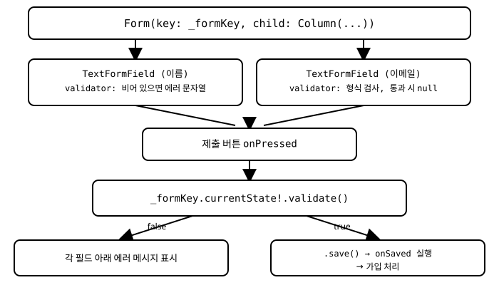

# 12장. Form과 유효성 검사

📖 [◀ 목차](00-목차.md) | [◀ 이전: 11장. 애니메이션 기초](ch11-애니메이션기초.md) | [다음: 13장. 상태 관리 심화 ▶](ch13-상태관리심화.md)

---

7장에서는 `TextField`와 `onChanged`, 컨트롤러를 이용해 개별 입력 필드를 다루는 방법을 배웠습니다. 하지만 회원가입, 로그인, 배송지 입력처럼 여러 필드를 한꺼번에 검증하고 제출해야 하는 화면에서는 필드마다 따로 상태를 관리하고 오류 메시지를 직접 표시하는 방식이 금세 번거로워집니다. 필드가 늘어날수록 "이 필드는 검증했는데 저 필드는 빼먹었다" 같은 실수도 생기기 쉽습니다.

Flutter는 이런 상황을 위해 여러 입력 필드를 하나의 단위로 묶어 관리하는 `Form` 위젯을 제공합니다. 이 장에서는 `Form`과 `TextFormField`, `GlobalKey<FormState>`를 이용해 폼 전체를 한 번에 검증하고 제출하는 방법을 배우고, 이름과 이메일을 입력받는 회원가입 폼을 처음부터 끝까지 구현합니다.

## 12.1 Form과 GlobalKey<FormState>

`Form`은 눈에 보이는 UI가 없는 위젯입니다. 여러 개의 입력 필드(주로 `TextFormField`)를 `child`로 감싸서, 그 안의 필드들을 하나의 검증 단위로 묶어주는 역할만 합니다.

```dart
Form(
  key: _formKey,
  child: Column(
    children: [
      TextFormField(/* ... */),
      TextFormField(/* ... */),
    ],
  ),
)
```

여기서 중요한 것이 `key`입니다. `Form`은 자신의 상태(`FormState`)를 통해 "전체 필드 검증하기", "전체 필드 저장하기" 같은 동작을 외부에 노출합니다. 이 `FormState`에 접근하려면 `GlobalKey<FormState>`를 만들어 `Form`의 `key`로 전달해야 합니다.

```dart
class SignUpForm extends StatefulWidget {
  const SignUpForm({super.key});

  @override
  State<SignUpForm> createState() => _SignUpFormState();
}

class _SignUpFormState extends State<SignUpForm> {
  final _formKey = GlobalKey<FormState>();

  @override
  Widget build(BuildContext context) {
    return Form(
      key: _formKey,
      child: const Column(
        children: [
          // TextFormField 들이 들어갈 자리
        ],
      ),
    );
  }
}
```

`GlobalKey`는 위젯 트리 어디서든 특정 위젯의 상태 객체를 직접 가리킬 수 있게 해주는 특수한 키입니다. `_formKey.currentState`로 이 `Form`에 대응하는 `FormState` 인스턴스에 접근할 수 있고, 여기서 `validate()`와 `save()` 같은 메서드를 호출합니다. `_formKey`는 `State` 클래스의 필드로 한 번만 생성하고, `build`가 여러 번 호출되어도 같은 인스턴스를 계속 재사용해야 합니다.

## 12.2 TextFormField와 validator

`TextFormField`는 `TextField`가 제공하는 모든 기능(7장 참고)에 더해 `Form`과 연동되는 두 가지 콜백, `validator`와 `onSaved`를 추가로 제공합니다.

```dart
TextFormField(
  decoration: const InputDecoration(
    labelText: '이름',
    border: OutlineInputBorder(),
  ),
  validator: (value) {
    if (value == null || value.trim().isEmpty) {
      return '이름을 입력해 주세요.';
    }
    return null;
  },
)
```

`validator`는 `String? Function(String?)` 형태의 콜백입니다. 규칙은 단순합니다.

- 입력값이 유효하지 **않으면** 사용자에게 보여줄 오류 메시지 문자열을 반환합니다.
- 입력값이 유효하면 `null`을 반환합니다.

`Form`은 이 반환값을 이용해 각 필드 아래에 오류 메시지를 자동으로 표시하거나 감춥니다. 개발자가 직접 `Text` 위젯으로 오류 메시지를 그리거나 상태를 관리할 필요가 없습니다.

이메일처럼 형식 검사가 필요한 필드는 정규식을 함께 사용합니다.

```dart
TextFormField(
  decoration: const InputDecoration(
    labelText: '이메일',
    border: OutlineInputBorder(),
  ),
  keyboardType: TextInputType.emailAddress,
  validator: (value) {
    if (value == null || value.trim().isEmpty) {
      return '이메일을 입력해 주세요.';
    }
    final emailPattern = RegExp(r'^[\w.+-]+@[\w-]+\.[a-zA-Z]{2,}$');
    if (!emailPattern.hasMatch(value.trim())) {
      return '올바른 이메일 형식이 아닙니다.';
    }
    return null;
  },
)
```

`validator`는 필드 하나마다 독립적으로 정의합니다. 뒤에서 살펴볼 `_formKey.currentState!.validate()`를 호출하면, `Form`이 자식으로 갖고 있는 모든 `TextFormField`의 `validator`를 한꺼번에 실행하고 그 결과를 종합합니다.

## 12.3 validate()와 save()의 흐름

`Form`을 사용하는 전형적인 흐름은 다음 세 단계로 이루어집니다.

1. 사용자가 제출 버튼을 누른다.
2. `_formKey.currentState!.validate()`를 호출한다. 이 메서드는 폼에 속한 모든 `validator`를 실행하고, 하나라도 `null`이 아닌 문자열을 반환하면 그 메시지를 필드 아래에 표시한 뒤 `false`를 반환한다. 모든 필드가 `null`을 반환하면 `true`를 반환한다.
3. `validate()`가 `true`를 반환했을 때만 `_formKey.currentState!.save()`를 호출한다. 이 메서드는 각 `TextFormField`에 등록된 `onSaved` 콜백을 모두 실행한다.

```dart
ElevatedButton(
  onPressed: () {
    if (_formKey.currentState!.validate()) {
      _formKey.currentState!.save();
      // 이 지점에서는 모든 필드가 유효하고,
      // onSaved 콜백을 통해 값이 저장된 상태입니다.
    }
  },
  child: const Text('가입하기'),
)
```

`validate()`와 `save()`를 분리해 둔 이유는 명확합니다. 값을 저장하거나 서버로 전송하는 부수 효과는 모든 입력이 유효하다고 확인된 뒤에만 일어나야 하기 때문입니다. `onSaved` 콜백 안에서는 보통 `TextFormField`가 넘겨준 최종 문자열 값을 로컬 변수나 상태 객체에 옮겨 담습니다.

```dart
TextFormField(
  validator: (value) {
    if (value == null || value.trim().isEmpty) {
      return '이름을 입력해 주세요.';
    }
    return null;
  },
  onSaved: (value) {
    _name = value!.trim();
  },
)
```

`onSaved`의 `value`는 `validator`를 통과했다는 것이 보장된 뒤에만 실행되므로(정확히는 `validate()`가 `true`를 반환한 경우에만 `save()`를 호출하도록 코드에서 지켜주면), `null` 검사를 다시 반복하지 않고 안전하게 값을 꺼내 쓸 수 있습니다. `TextEditingController`를 각 필드에 직접 연결해서 값을 읽는 방법(7장)도 여전히 유효하지만, `onSaved`를 사용하면 컨트롤러를 따로 만들지 않고도 `Form` 하나의 흐름 안에서 값을 모을 수 있다는 장점이 있습니다.

전체 흐름을 그림으로 정리하면 다음과 같습니다.



## 12.4 실전 예제: 회원가입 폼 만들기

이름과 이메일을 입력받아 유효성 검사를 거친 뒤 가입을 처리하는 화면을 처음부터 끝까지 작성해 보겠습니다.

```dart
import 'package:flutter/material.dart';

class SignUpPage extends StatefulWidget {
  const SignUpPage({super.key});

  @override
  State<SignUpPage> createState() => _SignUpPageState();
}

class _SignUpPageState extends State<SignUpPage> {
  final _formKey = GlobalKey<FormState>();

  String _name = '';
  String _email = '';

  void _submit() {
    final isValid = _formKey.currentState!.validate();
    if (!isValid) {
      return;
    }
    _formKey.currentState!.save();

    ScaffoldMessenger.of(context).showSnackBar(
      SnackBar(content: Text('$_name님, 가입이 완료되었습니다. ($_email)')),
    );
  }

  @override
  Widget build(BuildContext context) {
    return Scaffold(
      appBar: AppBar(title: const Text('회원가입')),
      body: Padding(
        padding: const EdgeInsets.all(24),
        child: Form(
          key: _formKey,
          child: Column(
            crossAxisAlignment: CrossAxisAlignment.stretch,
            children: [
              TextFormField(
                decoration: const InputDecoration(
                  labelText: '이름',
                  border: OutlineInputBorder(),
                ),
                textInputAction: TextInputAction.next,
                validator: (value) {
                  if (value == null || value.trim().isEmpty) {
                    return '이름을 입력해 주세요.';
                  }
                  if (value.trim().length < 2) {
                    return '이름은 두 글자 이상 입력해 주세요.';
                  }
                  return null;
                },
                onSaved: (value) {
                  _name = value!.trim();
                },
              ),
              const SizedBox(height: 16),
              TextFormField(
                decoration: const InputDecoration(
                  labelText: '이메일',
                  border: OutlineInputBorder(),
                ),
                keyboardType: TextInputType.emailAddress,
                textInputAction: TextInputAction.done,
                validator: (value) {
                  if (value == null || value.trim().isEmpty) {
                    return '이메일을 입력해 주세요.';
                  }
                  final emailPattern =
                      RegExp(r'^[\w.+-]+@[\w-]+\.[a-zA-Z]{2,}$');
                  if (!emailPattern.hasMatch(value.trim())) {
                    return '올바른 이메일 형식이 아닙니다.';
                  }
                  return null;
                },
                onSaved: (value) {
                  _email = value!.trim();
                },
              ),
              const SizedBox(height: 24),
              ElevatedButton(
                onPressed: _submit,
                child: const Text('가입하기'),
              ),
            ],
          ),
        ),
      ),
    );
  }
}
```

이 예제에서 눈여겨볼 부분을 정리해 보겠습니다.

- `_formKey`는 `_SignUpPageState`의 필드로 한 번만 생성되어, `build`가 다시 호출되어도 동일한 `Form`을 계속 가리킵니다.
- 이름 필드는 비어 있는지, 그리고 두 글자 이상인지를 검사합니다. 두 조건 중 하나라도 어긋나면 그에 맞는 메시지를 반환합니다.
- 이메일 필드는 비어 있는지 확인한 뒤, 정규식으로 `아이디@도메인.최상위도메인` 형태를 갖추었는지 검사합니다.
- `_submit()`은 `validate()`의 결과를 변수에 담아 먼저 확인하고, `false`라면 `return`으로 즉시 함수를 빠져나갑니다. 이렇게 하면 유효하지 않은 데이터로 `save()`가 호출되는 일을 막을 수 있습니다.
- `validate()`가 `true`를 반환했을 때만 `save()`가 호출되므로, `onSaved` 콜백 안에서는 값이 이미 검증되었다고 믿고 사용할 수 있습니다.
- 가입 처리 결과는 `ScaffoldMessenger.of(context).showSnackBar(...)`로 간단히 알려줍니다. 실제 앱이라면 이 지점에서 15장에서 다룰 네트워크 요청을 보내거나, 8장에서 배운 네비게이션으로 다음 화면으로 이동하게 될 것입니다.

`TextFormField`에 `autovalidateMode: AutovalidateMode.onUserInteraction`을 추가하면, 제출 버튼을 누르기 전이라도 사용자가 필드를 수정하는 즉시 유효성 검사 결과를 보여줄 수 있습니다. 처음에는 버튼을 눌러야만 검사하는 방식으로 시작하고, 사용성을 개선하고 싶을 때 이 옵션을 추가하는 방식을 추천합니다.

## 요약

- `Form`은 여러 개의 입력 필드를 하나의 단위로 묶어 한 번에 검증하고 제출할 수 있게 해주는 위젯입니다.
- `GlobalKey<FormState>`를 `Form`의 `key`로 전달하면, `_formKey.currentState`를 통해 `validate()`와 `save()` 같은 폼 전체 동작을 호출할 수 있습니다.
- `TextFormField`의 `validator`는 값이 유효하지 않으면 오류 메시지 문자열을, 유효하면 `null`을 반환하는 콜백입니다. `Form`은 이 결과에 따라 필드 아래에 오류 메시지를 자동으로 표시합니다.
- `_formKey.currentState!.validate()`는 폼에 속한 모든 필드의 `validator`를 실행하고, 전부 통과했을 때만 `true`를 반환합니다.
- `validate()`가 `true`를 반환한 뒤 `_formKey.currentState!.save()`를 호출하면, 각 필드의 `onSaved` 콜백이 실행되어 값을 안전하게 모을 수 있습니다.
- 이메일처럼 형식이 정해진 입력은 `RegExp`를 이용한 정규식 검사를 `validator` 안에서 함께 수행합니다.

## 연습문제

1. `Form`과 `GlobalKey<FormState>` 없이, 필드마다 별도의 `bool` 오류 상태 변수를 두고 검증하는 방식과 비교했을 때 `Form`을 사용하는 방식의 장점을 설명하세요.
2. `validator` 콜백이 `null`을 반환하는 경우와 빈 문자열 `''`을 반환하는 경우의 차이를 설명하세요.
3. 이 장의 회원가입 폼에 비밀번호 입력 필드를 추가하고, 8자 이상이면서 숫자를 하나 이상 포함해야 한다는 `validator`를 작성하세요.
4. 비밀번호 확인 필드를 추가해, 두 비밀번호 입력값이 서로 다르면 오류 메시지를 표시하도록 구현하려면 어떤 정보에 접근할 수 있어야 하는지 설명하세요. (힌트: 두 필드 값을 동시에 비교하려면 `TextEditingController`를 사용하는 방법도 고려해 보세요.)
5. `AutovalidateMode.onUserInteraction`을 적용했을 때와 적용하지 않았을 때, 사용자가 처음 화면에 진입해 아무것도 입력하지 않은 시점의 화면 표시가 어떻게 달라지는지 설명하세요.


---

📖 [◀ 목차](00-목차.md) | [◀ 이전: 11장. 애니메이션 기초](ch11-애니메이션기초.md) | [다음: 13장. 상태 관리 심화 ▶](ch13-상태관리심화.md)
