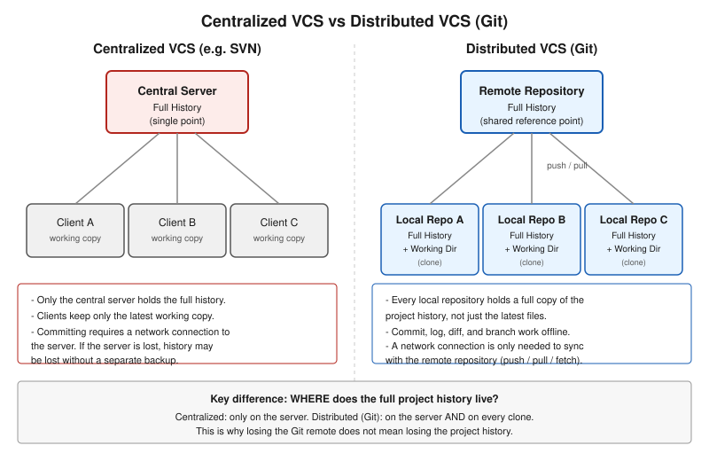

# 1장. Git이란 무엇인가

📖 [◀ 목차](00-목차.md) | [다음: 2장. 설치와 첫 저장소 ▶](ch02-설치와첫저장소.md)

---

## 들어가며

혼자서 짧은 코드를 짤 때는 버전 관리라는 것을 딱히 의식하지 않아도 큰 문제가 생기지 않습니다. 파일 하나를 열어서 고치고, 저장하고, 실행해 보면 그만입니다. 하지만 프로그램이 조금만 커지고, 그 프로그램을 며칠 이상 붙잡고 있거나 다른 사람과 함께 작업하게 되는 순간부터 이야기가 달라집니다. "어제까지는 잘 되던 기능이 오늘 갑자기 안 된다", "실험적으로 코드를 뜯어고쳤는데 원래대로 되돌리고 싶다", "동료가 수정한 파일과 내가 수정한 파일을 어떻게 합쳐야 할지 모르겠다" 같은 상황은 코드를 다루는 사람이라면 누구나 한 번쯤 마주치게 됩니다.

이번 장에서는 이런 상황에서 왜 버전 관리 시스템이 필요한지, 그리고 그 여러 버전 관리 시스템 중에서도 오늘날 가장 널리 쓰이는 Git이 어떤 배경에서 등장했고 어떤 방식으로 문제를 해결하는지를 살펴봅니다. 아직 명령어를 실제로 입력해 보지는 않지만, 이 장에서 잡아 두는 개념은 앞으로 이 책 전체를 읽어 나가는 데 필요한 지도 역할을 합니다.

## 버전 관리 없이 작업할 때 생기는 문제

버전 관리 시스템(Version Control System, VCS)을 아직 써 본 적이 없는 사람들이 흔히 택하는 방법은 파일 이름에 날짜나 번호를 붙여서 복사본을 남기는 것입니다.

```text
report.docx
report_final.docx
report_final2.docx
report_final_진짜최종.docx
report_final_진짜최종_수정.docx
```

이런 방식은 파일이 몇 개뿐이고 혼자 작업할 때는 어찌어찌 굴러갑니다. 하지만 조금만 규모가 커지면 다음과 같은 문제가 빠르게 드러납니다.

- **어떤 버전이 진짜 최신인지 알기 어렵다.** 파일 이름만으로는 "final"과 "final2" 중 어느 쪽에 어떤 변경이 들어있는지, 왜 그렇게 나뉘었는지 알 수 없습니다.
- **무엇이, 언제, 왜 바뀌었는지 기록이 남지 않는다.** 두 파일을 눈으로 비교하지 않는 이상 정확히 몇 줄이 바뀌었는지 알기 어렵고, 그 변경의 이유는 기억에만 의존하게 됩니다.
- **여러 사람이 동시에 작업하기 어렵다.** 같은 파일을 두 사람이 각자 복사해서 수정한 뒤에는, 두 변경 내용을 사람이 직접 눈으로 대조하며 합쳐야 합니다. 파일 수가 많아지면 이 작업은 사실상 불가능에 가까워집니다.
- **실수로 무언가를 지우거나 망가뜨렸을 때 되돌릴 지점이 마땅치 않다.** 복사본을 촘촘히 남겨 두지 않았다면, 문제가 생기기 전 상태로 돌아가는 것 자체가 불가능할 수 있습니다.
- **디스크 공간과 관리 부담이 커진다.** 폴더 전체를 통째로 복사해서 백업하는 방식은 파일이 조금만 바뀌어도 전체를 다시 복사해야 하므로 비효율적입니다.

버전 관리 시스템은 바로 이런 문제를 해결하기 위해 만들어졌습니다. 핵심 아이디어는 간단합니다. 파일을 여러 개의 이름으로 복사해 두는 대신, 프로젝트의 변경 이력 자체를 하나의 저장소(repository) 안에 체계적으로 기록해 두는 것입니다. 이렇게 하면 "언제 누가 무엇을 왜 바꿨는지"를 정확히 추적할 수 있고, 필요하면 과거의 특정 시점으로 정확히 되돌아갈 수 있으며, 여러 사람의 변경 내용을 프로그램이 자동으로 비교하고 합칠 수 있습니다.

## 중앙집중식 VCS와 분산 VCS

버전 관리 시스템은 등장 이후 크게 두 가지 구조로 발전해 왔습니다. 바로 **중앙집중식(centralized) VCS**와 **분산(distributed) VCS**입니다.

### 중앙집중식 VCS

중앙집중식 VCS는 프로젝트의 전체 이력을 담고 있는 저장소가 단 하나, 보통은 네트워크상의 서버에 존재하는 구조입니다. CVS나 SVN(Subversion) 같은 도구들이 이 방식을 대표합니다. 개발자는 자신의 컴퓨터에 "지금 작업 중인 최신 버전"만 내려받아 두고, 실제 변경 이력과 과거 버전들은 모두 중앙 서버에 저장되어 있습니다.

이 구조에서 커밋(변경 내용을 저장소에 기록하는 행위)을 하려면 반드시 중앙 서버와 통신해야 합니다. 즉 네트워크가 끊겨 있으면 이력을 남기는 작업 자체가 어려워집니다. 또한 중앙 서버가 고장 나거나 데이터가 손상되면, 별도의 백업이 없는 한 프로젝트 전체의 이력을 잃어버릴 위험이 있습니다.

### 분산 VCS와 Git

분산 VCS는 이런 한계를 다른 방식으로 풀어냅니다. Git에서는 프로젝트를 내려받는 순간(clone) 서버에 있던 전체 이력이 그대로 내 컴퓨터로 복제됩니다. 즉 작업 중인 개발자 각자의 컴퓨터마다 프로젝트의 완전한 저장소 사본이 존재합니다.

이 구조는 몇 가지 실질적인 이점을 만들어 냅니다.

- **오프라인에서도 대부분의 작업이 가능합니다.** 커밋, 이력 조회, 브랜치 생성과 전환처럼 자주 쓰는 작업은 로컬 저장소만으로 처리되므로 네트워크 연결이 필요하지 않습니다. 네트워크가 필요한 시점은 다른 사람과 변경 내용을 주고받을 때뿐입니다.
- **속도가 빠릅니다.** 이력 조회나 두 시점 사이의 차이 비교 같은 작업이 로컬 디스크에서 이루어지므로 서버 응답을 기다릴 필요가 없습니다.
- **한 지점의 장애가 전체 이력의 손실로 이어지지 않습니다.** 서버가 사라지더라도, 그 서버를 clone해 두었던 개발자 중 누구의 컴퓨터에나 프로젝트 이력 전체가 고스란히 남아 있습니다.
- **브랜치를 만들고 실험하는 부담이 훨씬 적습니다.** 로컬에서 자유롭게 브랜치를 만들어 실험하다가, 필요 없으면 그냥 지워 버릴 수 있습니다. 이 부분은 뒤에서 다시 살펴보겠습니다.

물론 분산 방식이라고 해서 서버가 아예 필요 없다는 뜻은 아닙니다. 실제 협업에서는 여러 사람이 변경 내용을 모아 두고 공유할 기준점이 필요하기 때문에, 관례적으로 하나의 저장소를 "원격 저장소(remote repository)"로 지정해 두고 그곳을 중심으로 협업합니다. 다만 그 원격 저장소도 다른 로컬 저장소들과 데이터 구조상 동등한 저장소일 뿐이라는 점이 중앙집중식 방식과의 근본적인 차이입니다.



## Git의 역사

Git은 리눅스 커널을 만든 것으로 잘 알려진 리누스 토르발스(Linus Torvalds)가 2005년에 만든 도구입니다. 당시 리눅스 커널 개발팀은 BitKeeper라는 상용 분산 버전 관리 시스템을 사용하고 있었는데, 라이선스 문제로 더 이상 BitKeeper를 무료로 사용할 수 없는 상황에 놓이게 되었습니다.

리눅스 커널처럼 전 세계에 흩어진 수많은 개발자가 동시에 참여하는 프로젝트를 관리하려면, 특정 회사의 서버 하나에 의존하지 않으면서도 빠르고 안정적으로 동작하는 버전 관리 시스템이 필요했습니다. 기존의 대안들은 이런 요구를 충분히 만족시키지 못한다고 판단한 토르발스는 직접 새로운 버전 관리 시스템을 설계하기 시작했고, 이것이 바로 Git입니다. Git은 짧은 기간에 핵심 기능이 만들어졌고, 이후 리눅스 커널 개발에 실제로 사용되면서 검증과 개선을 거듭했습니다. 현재는 주니오 하마노(Junio Hamano)를 비롯한 여러 관리자와 전 세계 기여자들에 의해 유지보수되고 있습니다.

Git이라는 이름의 유래에 대해서는 여러 이야기가 전해지지만, 토르발스 본인이 종종 장난스럽게 "상황에 따라 아무 의미로나 붙일 수 있는 이름"이라고 언급했다는 점 정도만 기억해 두어도 충분합니다. 중요한 것은 이름의 유래가 아니라, Git이 리눅스 커널처럼 크고 분산된 협업 프로젝트의 실전 요구 속에서 태어나고 다듬어진 도구라는 사실입니다. 이런 배경 덕분에 Git은 처음부터 속도, 데이터 무결성, 그리고 대규모 분산 협업이라는 세 가지 목표를 뚜렷하게 지향하며 설계되었습니다.

## Git의 핵심 개념 미리보기

앞으로 이 책에서 자세히 다룰 개념들을 미리 짧게 소개합니다. 지금 당장 완전히 이해할 필요는 없으며, 전체적인 그림을 그려 보는 정도로 읽어 나가면 충분합니다.

**스냅샷 기반 저장.** 많은 버전 관리 시스템은 파일이 바뀔 때마다 "이전 버전과 비교해서 어느 줄이 어떻게 달라졌는가"라는 차이(diff) 정보를 누적해서 저장합니다. 반면 Git은 커밋을 할 때마다 그 순간 프로젝트 전체 파일들의 상태를 하나의 스냅샷(snapshot)으로 저장합니다. 다만 실제로 바뀌지 않은 파일까지 매번 통째로 복사하지는 않으며, 내부적으로 이전 스냅샷의 파일을 그대로 가리키는 방식으로 저장 공간을 절약합니다. 이 저장 방식의 구체적인 원리는 3장에서 다시 다룹니다.

**커밋(commit).** 커밋은 "지금 이 순간의 프로젝트 상태를 하나의 기록으로 저장하겠다"는 행위이자, 그렇게 저장된 기록 하나하나를 가리키는 말이기도 합니다. 각 커밋은 누가, 언제, 왜(커밋 메시지) 이 변경을 만들었는지에 대한 정보를 함께 담고 있으며, 이 커밋들이 시간 순서대로 연결되면서 프로젝트의 전체 역사를 이룹니다.

**브랜치(branch).** 브랜치는 커밋의 흐름이 갈라져 나가는 독립적인 작업 줄기입니다. 새로운 기능을 실험하거나 버그를 수정할 때, 기존 작업 흐름(흔히 main 또는 master라고 부르는 브랜치)에 영향을 주지 않고 별도의 브랜치를 만들어 작업할 수 있습니다. 작업이 만족스럽게 끝나면 그 브랜치의 변경 내용을 원래 브랜치에 합치고, 마음에 들지 않으면 브랜치째로 버릴 수도 있습니다. Git은 브랜치 생성과 전환이 매우 가볍고 빠르다는 점이 특히 강점으로 꼽히며, 이 주제는 이후 장에서 훨씬 깊이 다룹니다.

**로컬 저장소와 원격 저장소.** 로컬 저장소(local repository)는 여러분의 컴퓨터 안에 존재하는, 프로젝트 이력 전체를 담은 저장소입니다. 원격 저장소(remote repository)는 협업을 위해 네트워크상의 다른 위치(회사 서버, 또는 뒤에서 설명할 GitHub 같은 호스팅 서비스)에 두는 저장소입니다. 평소 작업은 로컬 저장소에서 이루어지고, 다른 사람과 변경 내용을 주고받을 때만 원격 저장소와 통신합니다.

## Git과 GitHub, GitLab의 관계

Git을 처음 접하는 사람들이 자주 혼동하는 부분이 하나 있습니다. 바로 Git과 GitHub(또는 GitLab, Bitbucket 같은 서비스)의 관계입니다.

**Git은 버전 관리 시스템 그 자체**입니다. 여러분의 컴퓨터에 설치되어 명령어로 동작하는 프로그램이며, 인터넷 연결이 전혀 없어도 로컬 저장소만으로 커밋하고 이력을 관리할 수 있습니다.

**GitHub, GitLab, Bitbucket 등은 Git 저장소를 인터넷에 올려 두고 여러 사람이 접근할 수 있게 해 주는 호스팅 서비스**입니다. 이들은 Git이 다루는 저장소 데이터를 서버에 보관해 주는 동시에, 이슈 트래커, 코드 리뷰(Pull Request/Merge Request), 프로젝트 관리, CI/CD 연동 같은 부가 기능을 함께 제공합니다. 즉 Git이라는 "도구"가 있고, 그 도구가 다루는 저장소를 온라인에서 공유하고 협업하기 편하게 만들어 주는 "서비스"가 GitHub나 GitLab이라고 이해하면 정확합니다.

비유하자면 Git은 문서를 작성하고 버전을 관리하는 워드프로세서 프로그램에, GitHub나 GitLab은 그렇게 만든 문서를 온라인에 올려 여러 사람과 공유하고 댓글을 주고받을 수 있게 해 주는 클라우드 저장 및 협업 서비스에 가깝습니다. Git 없이 GitHub만 쓸 수는 없지만, GitHub 없이 Git만 쓰는 것은 얼마든지 가능합니다. 실제로 많은 개인 프로젝트나 사내 프로젝트는 GitHub 같은 외부 서비스 없이 Git만으로도 완결된 버전 관리를 수행합니다.

이 책은 Git이라는 도구 자체의 사용법과 원리를 다루는 데 집중합니다. GitHub나 GitLab 같은 특정 호스팅 서비스의 화면 구성이나 가입 절차는 다루지 않지만, 원격 저장소를 다루는 `git remote`, `git push`, `git pull`, `git fetch` 같은 명령어는 어떤 호스팅 서비스를 쓰든 동일하게 적용되는 Git의 표준 기능이므로 뒤에서 자세히 배우게 됩니다.

## 이 책의 학습 로드맵

이 책은 Git을 처음 배우는 사람이 실제로 손으로 명령어를 입력해 가며 개념을 익힐 수 있도록 구성되어 있습니다. 전체적인 흐름은 다음과 같습니다.

- **기초 다지기**: Git을 설치하고, 사용자 정보를 설정하고, 첫 저장소를 만들어 보는 것부터 시작합니다(2장).
- **Git의 내부 동작 원리**: 스냅샷, 커밋, `.git` 디렉터리의 구조 등 Git이 데이터를 저장하고 추적하는 방식을 이해합니다.
- **일상적인 작업 흐름**: 파일을 스테이징하고 커밋하는 기본 작업 주기, 변경 이력을 조회하고 비교하는 방법을 익힙니다.
- **브랜치와 병합**: 여러 작업 줄기를 만들고 관리하며, 이를 합치는 과정에서 발생할 수 있는 충돌을 해결하는 방법을 배웁니다.
- **원격 저장소와 협업**: 다른 사람과 변경 내용을 주고받는 방법, 협업 시 자주 마주치는 상황들을 다룹니다.
- **되돌리기와 문제 해결**: 실수한 작업을 되돌리거나 이력을 정리하는 다양한 방법을 배웁니다.

각 장은 개념 설명, 직접 실행해 볼 수 있는 셸 명령어 예제, 요약, 연습문제 순서로 구성되어 있습니다. 특정 프로그래밍 언어에 종속되지 않으므로, 어떤 언어로 개발하든 상관없이 이 책의 내용을 그대로 적용할 수 있습니다. 바로 다음 장에서는 Git을 실제로 설치하고, 첫 번째 저장소를 만들어 보겠습니다.

## 요약

- 파일 이름에 날짜나 번호를 붙여 복사본을 관리하는 방식은 변경 이력 추적, 협업, 되돌리기 측면에서 뚜렷한 한계가 있으며, 이를 해결하기 위해 버전 관리 시스템(VCS)이 등장했습니다.
- 중앙집중식 VCS(SVN 등)는 단일 중앙 서버에 이력을 저장하는 반면, 분산 VCS(Git)는 모든 사용자의 로컬 컴퓨터에 저장소의 완전한 사본을 둡니다. 이 덕분에 Git은 오프라인 작업, 빠른 로컬 연산, 단일 장애점 회피 같은 이점을 가집니다.
- Git은 2005년 리누스 토르발스가 리눅스 커널 개발을 위해 만든 분산 버전 관리 시스템이며, 이후 주니오 하마노를 비롯한 커뮤니티가 유지보수하고 있습니다.
- Git의 핵심 개념으로 스냅샷 기반 저장, 커밋, 브랜치, 로컬/원격 저장소가 있으며 이는 이후 장들에서 하나씩 자세히 다룹니다.
- Git은 버전 관리 도구 자체이고, GitHub·GitLab 같은 서비스는 Git 저장소를 온라인에서 호스팅하고 협업 기능을 더해 주는 별개의 서비스입니다.

## 연습문제

1. 파일 이름에 날짜나 버전 번호를 붙여 여러 복사본을 관리하는 방식의 한계를 세 가지 이상 설명해 보세요.
2. 중앙집중식 VCS와 분산 VCS의 가장 근본적인 차이는 무엇이며, 이 차이가 오프라인 작업 가능 여부에 어떤 영향을 미치는지 설명해 보세요.
3. Git이 등장하게 된 역사적 배경을 리눅스 커널 개발과 연결지어 간단히 설명해 보세요.
4. Git과 GitHub의 관계를 다른 소프트웨어에 비유해서 설명해 보세요. 왜 "GitHub 없이 Git만 쓰는 것"은 가능하지만 "Git 없이 GitHub만 쓰는 것"은 불가능한지 이유를 함께 적어 보세요.
5. Git의 핵심 개념 중 스냅샷, 커밋, 브랜치의 관계를 여러분의 말로 정리해 보세요.


---

📖 [◀ 목차](00-목차.md) | [다음: 2장. 설치와 첫 저장소 ▶](ch02-설치와첫저장소.md)
