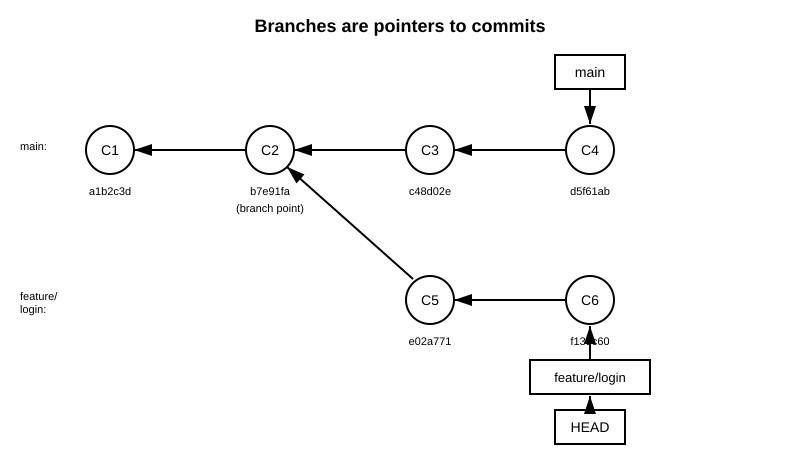

# 4장. 브랜치의 기본

📖 [◀ 목차](00-목차.md) | [◀ 이전: 3장. 스테이징과 커밋](ch03-스테이징과커밋.md) | [다음: 5장. 병합(merge)과 충돌 해결 ▶](ch05-병합과충돌해결.md)

---

3장에서는 파일을 스테이징하고 커밋해서 하나의 선형적인 이력을 쌓는 방법을 다루었다. 하지만 실제 개발은 하나의 흐름으로만 진행되지 않는다. 새 기능을 실험해보고 싶은데 지금 안정적으로 동작하는 코드는 건드리고 싶지 않을 때, 여러 사람이 동시에 서로 다른 작업을 진행할 때, Git의 브랜치(branch)는 이런 상황을 해결해주는 핵심 도구다. 이번 장에서는 브랜치가 실제로 무엇인지, 그리고 브랜치를 만들고 오가는 기본 명령어를 다룬다.

## 브랜치란 무엇인가

많은 입문서가 브랜치를 "작업 내용을 나뭇가지처럼 나누어 진행하는 것"이라고 비유적으로 설명한다. 틀린 설명은 아니지만, Git이 실제로 브랜치를 어떻게 구현하는지 알면 훨씬 명쾌하게 이해할 수 있다.

**브랜치는 특정 커밋을 가리키는 이름 붙은 포인터일 뿐이다.** 그 이상도 이하도 아니다. 브랜치를 만든다고 해서 파일이 복사되거나 디렉터리가 새로 만들어지지 않는다. 그저 "이 이름은 이 커밋을 가리킨다"라는 41바이트짜리(40자리 SHA-1 해시 + 줄바꿈) 정보 하나가 저장소에 추가될 뿐이다. 실제로 브랜치는 `.git/refs/heads/` 디렉터리 아래에 브랜치 이름과 같은 파일로 존재하며, 그 파일 안에는 해당 브랜치가 가리키는 커밋의 해시 값만 딱 한 줄 들어 있다.

```bash
$ git branch feature-login
$ cat .git/refs/heads/feature-login
b7e91fa3c8d2a1e0f6c5b4a3d2e1f0a9b8c7d6e5
```

이 가벼움(lightweight)이 Git 브랜치의 핵심이다. 브랜치를 새로 만드는 데는 파일 하나를 쓰는 정도의 비용밖에 들지 않으므로, 실험적인 작업이라도 부담 없이 브랜치를 만들었다가 필요 없으면 지워버릴 수 있다. 아래 그림은 커밋들의 이력 위에서 `main` 브랜치와 `feature/login` 브랜치가 각각 어떤 커밋을 가리키는지, 그리고 `HEAD`가 어떻게 연결되는지를 보여준다.



그림에서 `C2` 커밋 지점에서 두 흐름이 갈라진다. `main`은 `C1 → C2 → C3 → C4` 순서로 이어지는 커밋 이력의 맨 끝인 `C4`를 가리키고, `feature/login`은 `C2`에서 갈라져 나온 `C5 → C6` 이력의 끝인 `C6`을 가리킨다. 여기서 중요한 점은, `C1`부터 `C2`까지의 커밋은 두 브랜치가 공유하고 있다는 사실이다. 브랜치가 갈라졌다고 해서 커밋이 통째로 복제되는 것이 아니라, 이력의 일부 구간을 함께 가리키다가 특정 지점부터 각자 다른 커밋을 추가로 쌓아나가는 것뿐이다.

## HEAD의 의미

`HEAD`는 "지금 내가 어느 브랜치에서 작업하고 있는가"를 가리키는 특수한 참조다. 대부분의 경우 `HEAD`는 브랜치를 직접 가리키는 것이 아니라, 브랜치 이름을 가리키는 간접 참조(symbolic reference)로 동작한다.

```bash
$ cat .git/HEAD
ref: refs/heads/main
```

즉 연결 구조는 `HEAD → main → C4`처럼 한 단계를 더 거친다. 이렇게 되어 있기 때문에 `main` 브랜치에서 새 커밋을 만들면, Git은 다음 두 가지 일을 순서대로 처리한다.

1. 새 커밋을 만들고, 그 부모를 현재 `main`이 가리키던 커밋으로 설정한다.
2. `HEAD`가 가리키는 대상, 즉 `main`이 새로 만든 커밋을 가리키도록 갱신한다.

`HEAD`는 그대로 `main`을 가리킨 채로 있고, `main`만 앞으로 이동한다. 그래서 브랜치를 옮겨 다니며 커밋해도 "지금 커밋한 결과가 자동으로 올바른 브랜치에 쌓인다".

브랜치 이름이 아니라 커밋 해시를 직접 체크아웃하면 `HEAD`가 브랜치를 거치지 않고 커밋을 곧바로 가리키게 되는데, 이를 detached HEAD(분리된 HEAD) 상태라고 부른다.

```bash
$ git checkout c48d02e
Note: switching to 'c48d02e'.

You are in 'detached HEAD' state. You can look around, make experimental
changes and commit them, and you can discard any commits you make in this
state without impacting any branches by switching back to a branch.
...
HEAD is now at c48d02e some commit message
```

이 상태에서도 커밋은 만들 수 있지만, 그 커밋을 가리키는 브랜치가 없기 때문에 다른 브랜치로 이동하는 순간 참조를 잃고 나중에 가비지 컬렉션의 대상이 될 수 있다. 분리된 HEAD 상태에서 작업한 내용을 남기고 싶다면 반드시 `git branch <새이름>` 등으로 브랜치를 만들어 커밋에 이름을 붙여주어야 한다.

## git branch로 브랜치 다루기

`git branch` 명령은 브랜치를 조회, 생성, 삭제, 이름 변경하는 기본 도구다.

```bash
$ git branch
* main
```

인자 없이 실행하면 로컬 브랜치 목록을 보여주고, 현재 위치한 브랜치 앞에는 `*` 표시가 붙는다. 각 브랜치가 마지막으로 가리키는 커밋까지 함께 보고 싶다면 `-v`(`--verbose`) 옵션을 쓴다.

```bash
$ git branch -v
* main            d5f61ab Add project README
  feature-login   b7e91fa Start login form
```

새 브랜치를 만들려면 이름을 지정한다. 이때 브랜치는 만들어지기만 할 뿐, **현재 작업 위치는 바뀌지 않는다.**

```bash
$ git branch feature-login
$ git branch
  feature-login
* main
```

브랜치가 더 이상 필요 없어지면 `-d`(`--delete`)로 삭제한다.

```bash
$ git branch -d feature-login
Deleted branch feature-login (was b7e91fa).
```

`-d`는 안전장치가 있어서, 그 브랜치의 커밋이 다른 브랜치(주로 현재 브랜치)에 아직 병합되지 않았다면 삭제를 거부한다. 병합 여부와 상관없이 강제로 지우고 싶다면 `-D`(`--delete --force`의 축약)를 사용한다.

```bash
$ git branch -D experimental-idea
```

브랜치 이름을 바꾸고 싶을 때는 `-m`(`--move`)을 쓴다.

```bash
$ git branch -m feature-login feature-login-form   # 다른 브랜치 이름 변경
$ git branch -m new-name                            # 현재 브랜치 이름 변경
```

## git switch / git checkout -b로 브랜치 생성과 이동

브랜치를 만드는 것과 그 브랜치로 옮겨가는 것은 별개의 동작이다. Git 2.23부터는 이 둘을 명확히 구분하기 위해 `git switch` 명령이 도입되었다.

```bash
$ git switch feature-login
Switched to branch 'feature-login'
```

이미 존재하는 브랜치로 이동할 때는 이름만 넘기면 되고, 브랜치를 새로 만들면서 곧바로 이동하고 싶을 때는 `-c`(`--create`) 옵션을 붙인다.

```bash
$ git switch -c feature-signup
Switched to a new branch 'feature-signup'
```

특정 커밋이나 다른 브랜치를 기준점으로 삼아 새 브랜치를 만들고 싶다면 시작 지점을 추가로 지정할 수 있다.

```bash
$ git switch -c hotfix-typo main
Switched to a new branch 'hotfix-typo'
```

`git switch`가 도입되기 전부터 널리 쓰였고 지금도 실무에서 흔히 볼 수 있는 방식은 `git checkout`이다. `git checkout`은 원래 파일을 특정 시점 상태로 되돌리는 용도와 브랜치를 이동하는 용도를 함께 담당하는 다목적 명령이었는데, 이 두 가지 역할이 한 명령에 섞여 있어 혼동을 일으킨다는 지적이 있었고, 그 결과로 브랜치 이동 전용의 `git switch`와 파일 복원 전용의 `git restore`가 새로 분리되어 나왔다. `git checkout`은 여전히 정상적으로 동작하며 하위 호환을 위해 계속 지원된다.

```bash
$ git checkout feature-login       # 기존 브랜치로 이동
$ git checkout -b feature-signup   # 새 브랜치를 만들며 이동
```

`git switch -c`와 `git checkout -b`는 사실상 같은 결과를 낸다. 새 프로젝트에서는 의미가 더 명확한 `git switch`(및 `git restore`)를 사용하는 것을 권장하지만, 여러 문서와 기존 스크립트에서 `checkout -b`를 계속 만나게 되므로 두 표현 모두 읽고 쓸 수 있어야 한다.

## 브랜치를 나누어 작업하는 이유

브랜치를 적극적으로 활용하면 다음과 같은 상황에서 큰 도움이 된다.

- **기능 개발(feature development)**: 새 기능을 완성될 때까지 별도 브랜치에서 작업하면, 개발 중인 미완성 코드가 다른 사람이 사용하는 안정적인 브랜치에 섞여 들어가는 일을 막을 수 있다.
- **실험(experiment)**: "이 방식이 될지 안 될지 일단 시도해보자" 싶은 아이디어를 브랜치 하나로 격리해서 시험해볼 수 있다. 잘 안 되면 `git branch -D`로 브랜치째 지워버리면 그만이고, 원래 작업하던 브랜치는 전혀 영향을 받지 않는다.
- **안정 버전 유지**: 실제 서비스에 배포된 상태를 나타내는 브랜치(흔히 `main`)를 항상 안정적으로 유지하면서, 그 다음 버전을 준비하는 작업은 별도 브랜치에서 진행할 수 있다. 문제가 생기면 안정 브랜치 쪽에서 급한 수정(hotfix)만 별도로 처리하는 것도 가능하다.
- **병렬 작업**: 여러 사람이 각자의 브랜치에서 동시에 작업하면 서로의 미완성 코드에 발이 걸리지 않는다. 각자의 작업이 준비되었을 때 병합(merge)하면 되는데, 브랜치를 병합하는 구체적인 방법은 이후 장에서 다룬다.

## git log --graph --all로 브랜치 구조 확인하기

브랜치가 여러 개로 늘어나면 머릿속으로 구조를 그리기가 점점 어려워진다. 이럴 때 `git log`에 `--graph`와 `--all` 옵션을 함께 사용하면 모든 브랜치의 커밋 이력을 텍스트 그래프로 시각화해서 볼 수 있다.

```bash
$ git switch -c feature-login
$ echo "login form" > login.txt
$ git add login.txt
$ git commit -m "Start login form"
$ git switch main
$ echo "changelog entry" >> README.md
$ git add README.md
$ git commit -m "Update changelog"
$ git log --oneline --graph --all
* d9a4e21 (main) Update changelog
| * b7e91fa (feature-login) Start login form
|/
* d5f61ab Add project README
```

`*`는 커밋 하나를, `|`는 브랜치가 갈라진 채로 이어지는 흐름을, `/`나 `\`는 흐름이 갈라지거나 합쳐지는 지점을 나타낸다. 브랜치 이름은 괄호 안에 표시되는데, 이는 `--graph`가 아니라 `--decorate` 옵션(대부분의 Git 배포판에서 기본으로 켜져 있다)이 담당하는 표시다. 명시적으로 켜고 싶다면 다음처럼 쓴다.

```bash
$ git log --oneline --graph --all --decorate
```

`--all`을 빼면 현재 브랜치의 이력만 보이므로, 다른 브랜치의 존재 자체를 놓치기 쉽다. 여러 브랜치를 오가며 작업할 때는 이 조합을 습관처럼 실행해보는 것이 브랜치 구조를 직관적으로 파악하는 데 큰 도움이 된다.

## 브랜치 이름 규칙 실무 관례

Git 자체는 브랜치 이름에 특별한 규칙을 강제하지 않는다(공백이나 일부 특수문자 등 몇 가지 문법적 제약만 있을 뿐이다). 하지만 여러 사람이 함께 작업하는 프로젝트에서는 브랜치 이름만 보고도 그 브랜치의 목적을 짐작할 수 있도록 접두어를 붙이는 관례가 널리 쓰인다. 참고로만 알아두자.

| 접두어 | 용도 |
|---|---|
| `feature/` | 새로운 기능 개발. 예: `feature/user-signup` |
| `fix/` | 버그 수정. 예: `fix/login-crash` |
| `hotfix/` | 배포된 버전에 대한 긴급 수정. 예: `hotfix/payment-error` |
| `release/` | 배포 준비 중인 버전. 예: `release/1.2.0` |
| `docs/` | 문서 작업. 예: `docs/api-guide` |
| `chore/` | 빌드 설정, 의존성 정리 등 부수적인 작업. 예: `chore/upgrade-deps` |

이런 접두어는 Git이 이해하는 문법이 아니라 팀이나 프로젝트가 합의한 관례일 뿐이다. 회사나 프로젝트마다 세부 규칙이 다를 수 있으므로, 새로운 프로젝트에 합류했다면 먼저 그 프로젝트의 브랜치 이름 관례를 확인하는 것이 좋다.

## 요약

- 브랜치는 파일이나 디렉터리의 복사본이 아니라, 특정 커밋을 가리키는 이름 붙은 포인터다. `.git/refs/heads/` 아래에 커밋 해시 한 줄만 담긴 파일로 존재하므로 생성 비용이 매우 가볍다.
- `HEAD`는 보통 현재 작업 중인 브랜치를 가리키는 간접 참조이며, 브랜치를 거치지 않고 커밋을 직접 가리키는 상태를 detached HEAD라고 한다.
- `git branch`로 브랜치를 조회(`-v`), 생성, 삭제(`-d`/`-D`), 이름 변경(`-m`)할 수 있다.
- `git switch`는 브랜치 이동 전용 명령이며, `-c` 옵션으로 생성과 이동을 한 번에 처리한다. 과거부터 쓰여온 `git checkout -b`도 동일하게 동작한다.
- 기능 개발, 실험, 안정 버전 유지, 병렬 작업 등의 이유로 브랜치를 나누어 작업하며, `git log --oneline --graph --all`로 전체 브랜치 구조를 한눈에 확인할 수 있다.
- 브랜치 이름에 `feature/`, `fix/` 같은 접두어를 붙이는 것은 Git의 규칙이 아니라 팀의 관례다.

## 연습문제

1. 새 브랜치를 만들었을 때 `.git/refs/heads/` 디렉터리 안에 실제로 어떤 파일이 생기는지 확인하고, 그 파일의 내용이 무엇을 의미하는지 설명하라.
2. `git branch feature-a`와 `git switch feature-a`를 각각 따로 실행했을 때와, `git switch -c feature-b`를 한 번에 실행했을 때의 결과 차이를 `git branch` 출력으로 비교하라.
3. 임의의 커밋 해시로 `git checkout <해시>`를 실행하여 detached HEAD 상태를 재현하고, 이 상태에서 커밋을 하나 만든 뒤 다른 브랜치로 이동하면 그 커밋이 어떻게 되는지(어떻게 하면 잃어버리지 않는지) 설명하라.
4. `main` 브랜치와 새로 만든 브랜치에서 각각 서로 다른 파일을 커밋한 뒤, `git log --oneline --graph --all`을 실행하여 그래프가 갈라지는 모습을 확인하고 각 기호(`*`, `|`, `/`)가 무엇을 뜻하는지 설명하라.
5. `git branch -d`로 아직 병합되지 않은 브랜치를 삭제하려고 하면 어떤 메시지가 나오는지 확인하고, `-d`와 `-D`의 차이를 실습을 통해 설명하라.


---

📖 [◀ 목차](00-목차.md) | [◀ 이전: 3장. 스테이징과 커밋](ch03-스테이징과커밋.md) | [다음: 5장. 병합(merge)과 충돌 해결 ▶](ch05-병합과충돌해결.md)
