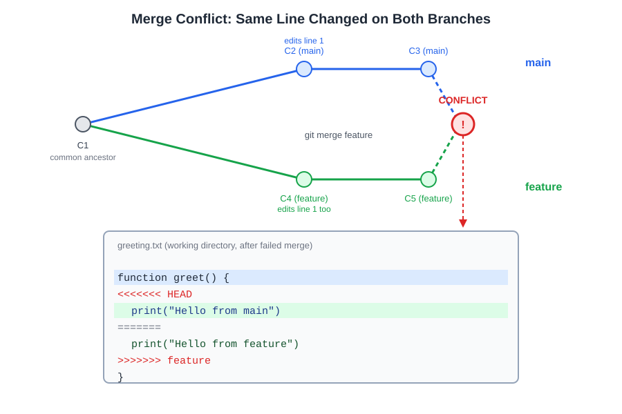

# 5장. 병합(merge)과 충돌 해결

📖 [◀ 목차](00-목차.md) | [◀ 이전: 4장. 브랜치의 기본](ch04-브랜치의기본.md) | [다음: 6장. 원격 저장소와 GitHub ▶](ch06-원격저장소와GitHub.md)

---

지난 장에서는 `git branch`와 `git switch`(또는 `git checkout`)로 브랜치를 만들고 옮겨 다니는 방법을 배웠습니다. 브랜치는 나눠서 일하기 위한 도구이지만, 언젠가는 나뉜 작업을 다시 하나로 합쳐야 합니다. 이 장에서는 두 브랜치의 변경 이력을 합치는 `git merge` 명령과, 합치는 과정에서 발생할 수 있는 충돌(conflict)을 읽고 해결하는 방법을 다룹니다.

## 5.1 병합이란 무엇인가

병합(merge)은 서로 다른 브랜치에서 각각 진행된 커밋 이력을 하나의 브랜치로 합쳐 넣는 작업입니다. 예를 들어 `main` 브랜치에서 갈라져 나온 `feature` 브랜치에서 작업을 마쳤다면, 그 결과를 다시 `main`에 반영해야 협업자들도 그 변경을 볼 수 있습니다.

```bash
git switch main
git merge feature
```

위 명령은 "현재 브랜치(main)에 feature 브랜치의 변경 내용을 합쳐 넣어라"는 뜻입니다. 이때 Git이 실제로 어떤 작업을 하는지는 두 브랜치가 어떤 관계에 있었는지에 따라 달라집니다. 이번 장에서는 그 두 가지 경우, 즉 **fast-forward 병합**과 **3-way 병합**을 순서대로 살펴봅니다.

## 5.2 Fast-forward 병합

`feature` 브랜치가 `main`에서 갈라진 뒤로 `main` 쪽에는 새 커밋이 하나도 없었다면 어떻게 될까요? 이 경우 `feature`의 커밋들은 사실 `main` 커밋의 연장선일 뿐입니다. Git은 굳이 두 이력을 합치는 새 커밋을 만들 필요 없이, `main` 브랜치 포인터를 `feature`가 가리키는 커밋으로 그냥 옮겨버립니다. 이를 **fast-forward(빨리 감기) 병합**이라고 합니다.

```bash
mkdir merge-lab && cd merge-lab
git init
echo "이 저장소는 병합 실습용입니다." > intro.txt
git add intro.txt
git commit -m "Add intro.txt"
```

여기서 새 브랜치를 만들고 커밋을 하나 추가합니다.

```bash
git switch -c update-intro
echo "Git으로 버전 관리를 배웁니다." >> intro.txt
git commit -am "Add second line to intro.txt"
```

`main`으로 돌아가 병합해 봅니다. `main`은 그 사이 아무 커밋도 하지 않았으므로 fast-forward가 일어납니다.

```bash
git switch main
git merge update-intro
```

```text
Updating a1b2c3d..e4f5g6h
Fast-forward
 intro.txt | 1 +
 1 file changed, 1 insertion(+)
```

출력에 `Fast-forward`라는 단어가 보입니다. 새로운 병합 커밋은 만들어지지 않았고, `main`이 가리키는 커밋만 바뀌었습니다. `git log --oneline --graph`로 보면 브랜치가 갈라졌던 흔적조차 남지 않고 일직선 이력이 됩니다.

## 5.3 3-way 병합과 병합 커밋

이번에는 `main`에서도 새 커밋이 생긴 뒤에 병합해 보겠습니다. 이 경우 두 브랜치는 서로 다른 방향으로 진행되었기 때문에 포인터만 옮기는 방식으로는 합칠 수 없습니다. Git은 두 브랜치의 공통 조상(base) 커밋, 그리고 두 브랜치의 최신 커밋, 이렇게 세 지점을 비교해서 변경 내용을 합칩니다. 이를 **3-way 병합**이라 부릅니다.

```bash
git switch -c add-footer
echo "감사합니다." >> intro.txt
git commit -am "Add footer line"
```

```bash
git switch main
echo "Git 학습서" > title.txt
git add title.txt
git commit -m "Add title.txt"
```

이제 `main`과 `add-footer`는 공통 조상 이후 서로 다른 파일을 건드리며 각자 커밋을 쌓았습니다. `main`에서 병합합니다.

```bash
git merge add-footer
```

```text
Merge made by the 'ort' strategy.
 intro.txt | 1 +
 1 file changed, 1 insertion(+)
```

`Merge made by the 'ort' strategy` 메시지가 이번에는 fast-forward가 아니라 실제로 **병합 커밋(merge commit)**이 새로 만들어졌다는 뜻입니다. 두 변경 내용이 겹치지 않았기 때문에 Git은 자동으로 병합하고, 부모가 둘인 커밋을 하나 생성합니다. 기본 커밋 메시지는 편집기가 열리며 미리 채워지는데, 그대로 저장하고 닫으면 됩니다.

```bash
git log --oneline --graph --all
```

```text
*   9f1a2c3 (HEAD -> main) Merge branch 'add-footer'
|\
| * 7b3d4e5 (add-footer) Add footer line
* | c2a1b0f Add title.txt
|/
* a1b2c3d Add intro.txt
```

그래프에서 커밋이 두 갈래로 나뉘었다가 다시 하나로 합쳐지는 모습, 그리고 `Merge branch 'add-footer'` 커밋이 부모를 두 개 가진다는 사실을 확인할 수 있습니다.

### `--no-ff` 옵션

두 브랜치 관계가 fast-forward 가능한 상황이더라도, "이 브랜치에서 작업했었다"는 기록을 이력에 남기고 싶을 때는 `--no-ff` 옵션을 씁니다.

```bash
git merge --no-ff feature
```

이 옵션을 주면 fast-forward가 가능하더라도 강제로 병합 커밋을 만듭니다. 팀에 따라 "모든 기능 브랜치는 반드시 병합 커밋을 남긴다"는 규칙을 정해두고 이 옵션을 습관적으로 쓰기도 합니다.

## 5.4 충돌이 발생하는 상황

3-way 병합은 두 브랜치가 서로 다른 부분을 고쳤을 때는 문제없이 자동으로 합쳐집니다. 하지만 **두 브랜치가 같은 파일의 같은 줄을 서로 다르게 고쳤다면**, Git은 어느 쪽 내용을 최종본으로 삼아야 할지 판단할 수 없습니다. 이 상태를 **충돌(conflict)**이라고 하며, 사람이 직접 어느 쪽을 남길지(또는 둘을 어떻게 합칠지) 결정해 주어야 합니다.

아래 그림은 `main`과 `feature` 두 브랜치가 공통 조상 이후 같은 줄을 서로 다르게 고치고, 병합을 시도했을 때 충돌 마커가 담긴 파일이 만들어지는 과정을 보여줍니다.



직접 충돌을 만들어 보겠습니다.

```bash
mkdir conflict-lab && cd conflict-lab
git init
echo "Hello, Git!" > greeting.txt
git add greeting.txt
git commit -m "Add greeting.txt"
```

같은 지점에서 두 브랜치를 만들고, 각각 `greeting.txt`의 내용을 다르게 고칩니다.

```bash
git switch -c branch-a
echo "Hello, GitHub!" > greeting.txt
git commit -am "Change greeting to GitHub"

git switch main
git switch -c branch-b
echo "Hi there, Git!" > greeting.txt
git commit -am "Change greeting to Hi there"
```

먼저 `branch-a`를 `main`에 병합합니다. `main`은 그동안 변경이 없었으므로 fast-forward로 끝납니다.

```bash
git switch main
git merge branch-a
```

이제 `main`의 `greeting.txt` 내용은 `"Hello, GitHub!"`입니다. 여기에 `branch-b`를 병합해 봅니다.

```bash
git merge branch-b
```

```text
Auto-merging greeting.txt
CONFLICT (content): Merge conflict in greeting.txt
Automatic merge failed; fix conflicts and then commit the result.
```

`CONFLICT (content)`라는 메시지가 나오고, 병합이 자동으로 끝나지 않았습니다. 이 시점에서 Git은 병합을 "진행 중" 상태로 남겨 두고 사람의 개입을 기다립니다.

## 5.5 충돌 마커 읽는 법

`git status`를 실행하면 현재 상태를 알려줍니다.

```bash
git status
```

```text
On branch main
You have unmerged paths.
  (fix conflicts and run "git commit")
  (use "git merge --abort" to abort the merge)

Unmerged paths:
  (use "git add <file>..." to mark resolution)
        both modified:   greeting.txt

no changes added to commit (use "git add" and/or "git commit -a")
```

`both modified: greeting.txt`는 두 브랜치가 이 파일을 각자 고쳤고, 아직 해결되지 않았다는 뜻입니다. 파일을 열어 보면 다음과 같은 내용이 들어 있습니다.

```bash
cat greeting.txt
```

```text
<<<<<<< HEAD
Hello, GitHub!
=======
Hi there, Git!
>>>>>>> branch-b
```

이 네 개의 줄을 **충돌 마커(conflict marker)**라고 부르며, 각각 의미가 있습니다.

| 마커 | 의미 |
|---|---|
| `<<<<<<< HEAD` | 이 지점부터가 현재 브랜치(HEAD, 여기서는 main)의 내용입니다. |
| `=======` | 두 버전을 나누는 구분선입니다. |
| `>>>>>>> branch-b` | 여기까지가 병합해 오려는 브랜치(branch-b)의 내용입니다. |

즉 `<<<<<<< HEAD`와 `=======` 사이는 "내 브랜치의 내용", `=======`와 `>>>>>>> branch-b` 사이는 "합치려는 브랜치의 내용"입니다. 파일이 크면 이런 충돌 블록이 여러 군데에 나타날 수도 있습니다.

## 5.6 충돌 해결 절차

충돌을 해결하는 절차는 항상 같은 세 단계입니다.

### 1단계: 파일을 직접 수정한다

편집기로 파일을 열어 마커(`<<<<<<<`, `=======`, `>>>>>>>`)를 모두 지우고, 최종적으로 남길 내용만 남깁니다. 한쪽 내용을 선택할 수도 있고, 두 내용을 적절히 합칠 수도 있습니다. 여기서는 둘을 합쳐 봅니다.

```bash
echo "Hello, GitHub! Hi there, Git!" > greeting.txt
cat greeting.txt
```

```text
Hello, GitHub! Hi there, Git!
```

### 2단계: `git add`로 해결됐다고 표시한다

```bash
git add greeting.txt
```

`git add`는 원래 "이 변경 내용을 다음 커밋에 포함시켜라"는 뜻이지만, 병합 도중에는 추가로 "이 파일의 충돌을 해결했다"는 표시 역할도 합니다. `git status`로 확인하면 상태가 바뀐 것을 볼 수 있습니다.

```bash
git status
```

```text
On branch main
All conflicts fixed but you are still merging.
  (use "git commit" to conclude merge)

Changes to be committed:
        modified:   greeting.txt
```

### 3단계: `git commit`으로 병합을 마무리한다

```bash
git commit
```

메시지 없이 `git commit`만 실행하면 편집기가 열리고 `Merge branch 'branch-b'`처럼 기본 병합 메시지가 미리 채워져 있습니다. 특별한 이유가 없다면 그대로 저장하고 닫으면 됩니다. 이제 병합 커밋이 만들어지면서 병합이 완료됩니다.

```bash
git log --oneline --graph
```

```text
*   3c4d5e6 (HEAD -> main) Merge branch 'branch-b'
|\
| * 2b3c4d5 (branch-b) Change greeting to Hi there
* | 1a2b3c4 (branch-a) Change greeting to GitHub
|/
* 0a1b2c3 Add greeting.txt
```

## 5.7 병합 취소하기: `git merge --abort`

충돌을 보고 나니 "지금은 해결할 상황이 아니다" 싶을 수도 있습니다. 이럴 때는 병합을 아예 시작 전 상태로 되돌릴 수 있습니다.

```bash
git merge branch-b
```

```text
CONFLICT (content): Merge conflict in greeting.txt
Automatic merge failed; fix conflicts and then commit the result.
```

```bash
git merge --abort
```

```bash
git status
```

```text
On branch main
nothing to commit, working tree clean
```

`git merge --abort`는 병합이 진행 중인 상태(`git status`에 `You have unmerged paths`가 뜨는 상태)에서만 쓸 수 있으며, 실행하면 병합을 시도하기 전 커밋 상태로 완전히 되돌아갑니다. 파일 내용, 인덱스 모두 병합 전으로 복원되므로 부담 없이 다시 시도할 수 있습니다.

> 참고: 만약 `git add`까지 마친 뒤 커밋 전에 마음이 바뀌었다면 여전히 `git merge --abort`를 쓸 수 있습니다. 다만 이미 `git commit`으로 병합을 완료한 뒤라면 `--abort`는 더 이상 쓸 수 없고, 그 커밋을 되돌리는 별도의 방법(예: `git revert`)이 필요합니다.

## 5.8 병합 도구(mergetool)

지금까지는 편집기로 충돌 마커를 직접 지우는 방식으로 해결했습니다. 파일 하나에 충돌 블록이 여러 개거나 파일 수가 많아지면, 두 버전을 나란히 보여주며 클릭만으로 선택/병합할 수 있는 전용 도구를 쓰는 것이 편합니다. Git은 이런 외부 병합 도구를 연결해 주는 `git mergetool` 명령을 제공합니다. VS Code, KDiff3, Meld, Beyond Compare 같은 도구를 `git config --global merge.tool <도구이름>`으로 등록해 두면 `git mergetool` 한 번으로 해당 도구가 열립니다. 도구 설정과 구체적인 사용법은 이 책의 범위를 벗어나므로, 여기서는 이런 선택지가 있다는 것만 기억해 두면 충분합니다.

## 5.9 실습: 충돌 해결 시나리오 정리

지금까지의 흐름을 하나의 절차로 정리하면 다음과 같습니다.

```bash
# 1. 병합 시도
git switch main
git merge feature

# 2. 충돌 발생 확인
git status

# 3. 충돌 파일을 편집기로 열어 마커를 지우고 내용을 확정

# 4. 해결된 파일을 스테이징
git add <충돌났던파일>

# 5. 남은 충돌이 없는지 재확인
git status

# 6. 병합 커밋으로 마무리
git commit
```

만약 3~5번 단계에서 "역시 지금은 아니다"라는 판단이 서면 언제든 다음 명령으로 되돌릴 수 있습니다.

```bash
git merge --abort
```

## 요약

- `git merge <브랜치>`는 다른 브랜치의 이력을 현재 브랜치로 합칩니다.
- 대상 브랜치가 갈라진 뒤 현재 브랜치에 새 커밋이 없다면 **fast-forward 병합**이 일어나며, 브랜치 포인터만 이동하고 새 커밋은 생기지 않습니다.
- 두 브랜치가 각자 커밋을 쌓았다면 **3-way 병합**이 일어나며, 부모가 둘인 **병합 커밋**이 새로 생깁니다. `--no-ff`로 fast-forward 가능한 상황에서도 강제로 병합 커밋을 남길 수 있습니다.
- 두 브랜치가 같은 파일의 같은 줄을 다르게 고치면 **충돌**이 발생하며, Git은 파일에 `<<<<<<<`, `=======`, `>>>>>>>` 충돌 마커를 남기고 사람의 판단을 기다립니다.
- 충돌 해결은 항상 "파일 직접 수정 → `git add`로 해결 표시 → `git commit`으로 병합 완료"의 3단계를 따릅니다.
- 병합을 취소하고 싶다면 커밋 전까지는 `git merge --abort`로 병합 시도 이전 상태로 되돌릴 수 있습니다.
- 충돌이 잦거나 복잡하다면 `git mergetool`로 외부 병합 도구를 연결해 쓸 수 있습니다.

## 연습문제

1. Fast-forward 병합과 3-way 병합의 차이를 설명하고, 각각 언제 발생하는지 서술하시오.
2. 다음 충돌 마커를 보고 `HEAD` 쪽 내용과 병합해 오는 브랜치 쪽 내용을 각각 구분해 쓰시오.

   ```text
   <<<<<<< HEAD
   총 재고 수량: 120개
   =======
   총 재고 수량: 150개
   >>>>>>> stock-update
   ```

3. 충돌을 해결하는 세 단계(파일 수정, `git add`, `git commit`)를 순서대로 설명하시오. `git add`가 이 상황에서 어떤 의미를 갖는지도 함께 서술하시오.
4. `git merge --abort`를 사용할 수 있는 시점과 사용할 수 없는 시점을 각각 설명하시오.
5. 직접 저장소를 하나 만들어 두 브랜치가 같은 파일의 같은 줄을 다르게 수정하도록 하고, 병합을 시도해 충돌을 발생시킨 뒤 해결까지 완료해 보시오. 각 단계에서 `git status`의 출력이 어떻게 바뀌는지 기록하시오.


---

📖 [◀ 목차](00-목차.md) | [◀ 이전: 4장. 브랜치의 기본](ch04-브랜치의기본.md) | [다음: 6장. 원격 저장소와 GitHub ▶](ch06-원격저장소와GitHub.md)
