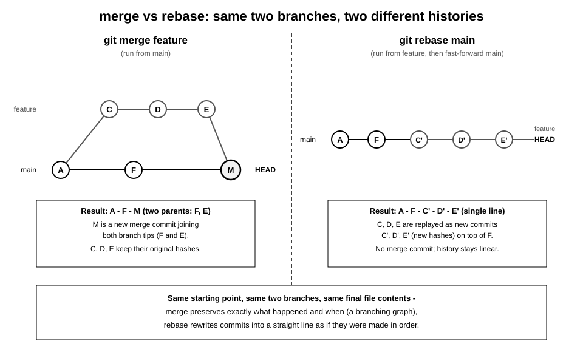

# 9장. Rebase와 Cherry-pick

📖 [◀ 목차](00-목차.md) | [◀ 이전: 8장. 되돌리기와 수정](ch08-되돌리기와수정.md) | [다음: 10장. Stash와 임시 작업 관리 ▶](ch10-Stash와임시작업관리.md)

---

## 들어가며

5장에서는 `git merge`로 두 브랜치의 이력을 합치는 방법을 배웠습니다. 병합은 두 브랜치가 실제로 어떻게 갈라졌다가 합쳐졌는지를 그래프 모양 그대로 남기는 방식입니다. 하지만 Git에는 두 브랜치를 하나로 합치는 또 다른 방법이 있습니다. 바로 `git rebase`입니다. rebase는 브랜치가 갈라졌던 흔적을 남기지 않고, 마치 처음부터 한 줄로 순서대로 작업한 것처럼 커밋을 재배치합니다.

이번 장에서는 `git rebase`가 merge와 어떻게 다른 결과를 만드는지, 커밋을 자유롭게 다듬을 수 있는 대화형 리베이스(`git rebase -i`), 리베이스 도중 충돌이 났을 때의 대처법, 그리고 실무에서 리베이스를 쓸 때 반드시 지켜야 할 원칙을 다룹니다. 마지막으로 브랜치 전체가 아니라 커밋 하나만 콕 집어 다른 브랜치에 옮겨 심는 `git cherry-pick`도 함께 살펴봅니다.

## 9.1 병합의 두 가지 방법: merge와 rebase

실습을 위해 저장소 하나를 새로 만들고, `main` 브랜치에서 커밋을 하나 남긴 뒤 `feature/login` 브랜치를 파 보겠습니다.

```bash
mkdir rebase-lab && cd rebase-lab
git init
echo "# MyApp" > README.md
git add README.md
git commit -m "docs: 프로젝트 초기 README 작성"

git switch -c feature/login
echo "function login() {}" > login.js
git add login.js
git commit -m "feat: 로그인 기능 초안 작성"

echo "// TODO: 유효성 검사" >> login.js
git commit -am "feat: 로그인 함수에 TODO 주석 추가"

echo "// 입력값 검증 로직 추가" >> login.js
git commit -am "feat: 입력값 검증 추가"
```

`feature/login`이 세 개의 커밋을 쌓는 동안, `main`도 가만히 있지 않고 자기 갈 길을 갔다고 해봅시다.

```bash
git switch main
echo '{"port": 3000}' > config.json
git add config.json
git commit -m "chore: 기본 설정 파일 추가"
```

이제 두 브랜치는 같은 지점(README 커밋)에서 갈라져서 각자 커밋을 쌓은 상태입니다. `git log --oneline --graph --all`로 확인해 봅니다.

```bash
git log --oneline --graph --all
```

```text
* 9c1d2e3 (feature/login) feat: 입력값 검증 추가
* 7a8b9c0 feat: 로그인 함수에 TODO 주석 추가
* 4d5e6f7 feat: 로그인 기능 초안 작성
| * 2b3c4d5 (HEAD -> main) chore: 기본 설정 파일 추가
|/
* 1a2b3c4 docs: 프로젝트 초기 README 작성
```

이 상태에서 `feature/login`을 `main`에 합치는 방법은 두 가지입니다.

**방법 1: merge.** `main`에서 `git merge feature/login`을 실행하면, 두 브랜치가 각자 커밋을 쌓았으므로 5장에서 배운 3-way 병합이 일어나고 부모가 둘인 병합 커밋이 새로 생깁니다. 그래프에는 브랜치가 갈라졌다가 다시 만나는 다이아몬드 모양이 그대로 남습니다.

**방법 2: rebase.** `feature/login`에서 `git rebase main`을 실행하면, Git은 `feature/login`의 세 커밋(초안 작성, TODO 주석, 입력값 검증)을 잠시 떼어놓았다가, `main`의 최신 커밋(설정 파일 추가) 위에 하나씩 다시 적용합니다. 이렇게 다시 적용된 커밋은 내용은 같아도 해시가 새로 계산되므로 원래 커밋과는 다른 커밋입니다. 결과적으로 브랜치가 갈라졌던 흔적 없이 하나로 쭉 이어진 이력이 만들어집니다.

아래 그림은 같은 두 브랜치를 merge로 합쳤을 때와 rebase로 합쳤을 때 히스토리 모양이 어떻게 달라지는지 나란히 비교해서 보여줍니다.



merge는 "실제로 무슨 일이 있었는지"를 있는 그대로 보존합니다. 반면 rebase는 "마치 처음부터 순서대로 작업한 것처럼" 이력을 다시 쓰기 때문에 더 읽기 편한 일직선 로그를 만들지만, 원래의 분기 시점 같은 정보는 사라집니다. 어느 쪽이 항상 옳다고 할 수는 없고, 프로젝트나 팀의 관례에 따라 선택하는 문제입니다.

## 9.2 git rebase 기본 사용법

앞서 만든 저장소에서 실제로 rebase를 실행해 보겠습니다. rebase는 "옮겨질 브랜치" 쪽에서 실행하고, 인자로는 "그 위에 올라탈 브랜치"를 지정합니다.

```bash
git switch feature/login
git rebase main
```

```text
Successfully rebased and updated refs/heads/feature/login.
```

그래프를 다시 확인하면 `feature/login`의 세 커밋이 `main`의 설정 파일 커밋 뒤로 옮겨져서 일직선으로 이어진 것을 볼 수 있습니다.

```bash
git log --oneline --graph --all
```

```text
* e5f6a7b (HEAD -> feature/login) feat: 입력값 검증 추가
* c3d4e5f feat: 로그인 함수에 TODO 주석 추가
* a1b2c3d feat: 로그인 기능 초안 작성
* 2b3c4d5 (main) chore: 기본 설정 파일 추가
* 1a2b3c4 docs: 프로젝트 초기 README 작성
```

rebase가 끝난 시점에는 `main` 브랜치 포인터가 아직 움직이지 않았다는 점에 주의합니다. rebase는 `feature/login`이 어디서 갈라졌는지를 바꿨을 뿐, `main`에 그 결과를 반영하지는 않습니다. `main`에 실제로 합치려면 다시 `main`으로 옮겨가서 병합해야 합니다.

```bash
git switch main
git merge feature/login
```

```text
Updating 2b3c4d5..e5f6a7b
Fast-forward
 login.js | 3 +++
 1 file changed, 3 insertions(+)
```

이번에는 `feature/login`이 이미 `main`의 연장선에 있는 상태이므로 fast-forward 병합이 일어나고, 새로운 병합 커밋 없이 이력이 하나로 합쳐집니다. "rebase 후 fast-forward 병합"은 선형 이력을 유지하고 싶은 팀에서 가장 흔하게 쓰는 조합입니다.

## 9.3 대화형 리베이스로 커밋 다듬기: git rebase -i

`feature/login`의 커밋 세 개를 다시 살펴보겠습니다.

```bash
git log --oneline -3
```

```text
e5f6a7b feat: 입력값 검증 추가
c3d4e5f feat: 로그인 함수에 TODO 주석 추가
a1b2c3d feat: 로그인 기능 초안 작성
```

가운데 있는 "TODO 주석 추가" 커밋은 사실 그 자체로 의미 있는 작업이라기보다, 바로 다음 커밋에서 실제로 처리된 임시 메모에 가깝습니다. 이런 커밋은 남겨두는 것보다 원래 커밋에 합쳐서 이력을 깔끔하게 정리하는 편이 나을 때가 많습니다. `git rebase -i`(interactive rebase)를 쓰면 브랜치를 다시 쌓는 과정에서 각 커밋을 어떻게 처리할지 하나하나 지정할 수 있습니다.

```bash
git rebase -i HEAD~3
```

`HEAD~3`은 "지금부터 세 개의 커밋을 대상으로 리베이스한다"는 뜻입니다. 이 명령을 실행하면 기본 편집기가 열리고 다음과 같은 내용이 표시됩니다.

```text
pick a1b2c3d feat: 로그인 기능 초안 작성
pick c3d4e5f feat: 로그인 함수에 TODO 주석 추가
pick e5f6a7b feat: 입력값 검증 추가

# 리베이스 e5f6a7b onto 2b3c4d5 (3 commands)
#
# Commands:
# p, pick <commit> = use commit
# r, reword <commit> = use commit, but edit the commit message
# e, edit <commit> = use commit, but stop for amending
# s, squash <commit> = use commit, but meld into previous commit
# f, fixup [-C | -c] <commit> = like "squash" but keep only the previous
#                    commit's log message
# d, drop <commit> = remove commit
```

각 줄은 오래된 커밋이 위, 최신 커밋이 아래 순서로 나열됩니다(`git log`와는 반대 순서입니다). 자주 쓰는 명령은 다음과 같습니다.

| 명령 | 의미 |
|---|---|
| `pick` | 커밋을 그대로 유지한다 (기본값) |
| `reword` | 커밋 내용은 그대로 두고 메시지만 새로 입력한다 |
| `edit` | 이 커밋에서 리베이스를 잠시 멈추고 내용을 수정할 기회를 준다 |
| `squash` | 바로 앞 커밋에 합치되, 두 커밋의 메시지를 모두 보여주고 새로 편집한다 |
| `fixup` | `squash`와 같지만 이 커밋의 메시지는 버리고 앞 커밋 메시지만 남긴다 |
| `drop` | 이 커밋을 아예 버린다 |

### 9.3.1 커밋 합치기: squash와 fixup

"TODO 주석 추가" 커밋을 바로 앞 커밋에 합쳐 버리려면, 그 줄의 `pick`을 `fixup`(또는 축약형 `f`)으로 바꿉니다.

```text
pick a1b2c3d feat: 로그인 기능 초안 작성
fixup c3d4e5f feat: 로그인 함수에 TODO 주석 추가
pick e5f6a7b feat: 입력값 검증 추가
```

이 상태로 저장하고 편집기를 닫으면, Git은 `c3d4e5f`의 변경 내용을 `a1b2c3d`에 합치고 `c3d4e5f`의 커밋 메시지는 버립니다. 만약 두 커밋의 메시지를 합쳐서 새로 작성하고 싶다면 `fixup` 대신 `squash`를 씁니다. 이 경우 저장 후 다음과 같은 메시지 편집 화면이 한 번 더 열립니다.

```text
# This is a combination of 2 commits.
# This is the 1st commit message:

feat: 로그인 기능 초안 작성

# This is the commit message #2:

feat: 로그인 함수에 TODO 주석 추가
```

불필요한 줄을 지우고 하나의 메시지로 정리한 뒤 저장하면 합쳐진 커밋이 만들어집니다.

### 9.3.2 순서 바꾸기와 메시지 수정하기: reword

편집기에 나열된 줄의 순서를 바꾸면 커밋이 적용되는 순서도 그대로 바뀝니다. 단, 뒤 커밋이 앞 커밋에서 만든 코드를 전제로 하고 있다면 순서를 바꾸는 순간 충돌이 날 수 있으니 내용을 이해하고 있는 커밋들에서만 순서를 바꾸는 것이 안전합니다.

커밋 메시지의 오타를 고치거나 메시지를 더 명확하게 다시 쓰고 싶을 때는 `reword`(축약형 `r`)를 씁니다.

```text
pick a1b2c3d feat: 로그인 기능 초안 작성
reword e5f6a7b feat: 입력값 검증 추가
```

저장하고 닫으면, `reword`로 표시한 커밋 차례가 됐을 때 메시지 편집 화면이 열립니다. 여기서 메시지를 원하는 대로 고치고 저장하면 그 내용을 반영한 새 커밋으로 교체됩니다.

```text
feat: 입력값 검증 추가

이메일 형식과 비밀번호 최소 길이를 검사하도록 검증 로직을 보강
```

정리를 마치고 나면 히스토리가 다음과 같이 깔끔해집니다.

```bash
git log --oneline
```

```text
f1a2b3c feat: 입력값 검증 추가
9d8c7b6 feat: 로그인 기능 초안 작성
2b3c4d5 chore: 기본 설정 파일 추가
1a2b3c4 docs: 프로젝트 초기 README 작성
```

## 9.4 리베이스 충돌 해결하기

rebase는 커밋을 하나씩 재생(replay)하는 과정이므로, 그 과정에서 대상 브랜치와 내용이 충돌할 수 있습니다. 충돌이 나면 rebase는 그 자리에서 멈추고 사람의 판단을 기다립니다.

```bash
git switch feature/payment
git rebase main
```

```text
Auto-merging payment.js
CONFLICT (content): Merge conflict in payment.js
error: could not apply a1b2c3d... feat: 결제 금액 검증 추가
hint: Resolve all conflicts manually, mark them as resolved with
hint: "git add/rm <conflicted_files>", then run "git rebase --continue".
```

충돌이 발생한 파일에는 5장에서 본 것과 같은 형태의 충돌 마커가 남습니다.

```text
<<<<<<< HEAD
const MAX_AMOUNT = 1000000;
=======
const MAX_AMOUNT = 500000;
>>>>>>> a1b2c3d (feat: 결제 금액 검증 추가)
```

병합 충돌과 다른 점이 하나 있습니다. rebase 도중에는 `HEAD`가 "지금까지 재생을 마친, 대상 브랜치 위에 새로 쌓인 커밋들"을 가리키고, 마커 아래쪽은 "지금 재생하려는 원래 커밋"을 가리킵니다. 즉 병합과는 두 쪽의 역할이 반대라는 점을 기억해 둘 필요가 있습니다.

충돌을 해결하는 절차는 다음과 같습니다.

```bash
# 1. 파일을 열어 마커를 지우고 최종 내용을 남긴다

# 2. 해결한 파일을 스테이징한다
git add payment.js

# 3. 리베이스를 계속 진행한다
git rebase --continue
```

`git rebase --continue`는 지금 재생 중이던 커밋을 스테이징된 내용으로 마무리하고, 다음 커밋으로 넘어갑니다. 커밋 하나가 해결됐다고 전체가 끝나는 것은 아니며, 재생할 커밋이 여러 개라면 커밋마다 이 과정이 반복될 수 있습니다.

리베이스 도중 쓸 수 있는 명령이 두 가지 더 있습니다.

```bash
# 지금 충돌난 커밋 하나를 건너뛴다 (이 커밋의 변경 내용은 결과물에서 사라진다)
git rebase --skip

# 리베이스 자체를 취소하고, 리베이스를 시작하기 전 상태로 완전히 되돌린다
git rebase --abort
```

`--skip`은 문제의 커밋을 통째로 버리고 다음 커밋으로 넘어가므로, 그 커밋에 담긴 변경 내용이 정말 필요 없는 경우가 아니라면 신중하게 판단해야 합니다. 반대로 `--abort`는 지금까지 해결한 내용을 포함해 모든 진행 상황을 버리고 `git rebase`를 실행하기 전 브랜치 상태로 돌아갑니다. 충돌을 어떻게 풀어야 할지 확신이 서지 않을 때는 일단 `--abort`로 물러나서 다시 생각해보는 편이 안전합니다.

```bash
git status
```

```text
interactive rebase in progress; onto 2b3c4d5
Last command done (1 command done):
   pick a1b2c3d feat: 결제 금액 검증 추가
No commands remaining.
You are currently rebasing branch 'feature/payment' on '2b3c4d5'.
  (fix conflicts and run "git rebase --continue")
  (use "git rebase --skip" to skip this patch)
  (use "git rebase --abort" to check out the original branch)
```

`git status`는 rebase가 진행 중일 때 이렇게 지금 상태와 다음에 쓸 수 있는 명령까지 함께 안내해 줍니다. 충돌 상황에서 무엇을 해야 할지 헷갈릴 때는 가장 먼저 `git status`를 확인하는 습관을 들이는 것이 좋습니다.

## 9.5 원칙: 이미 공유한 히스토리는 리베이스하지 않는다

rebase는 커밋을 "새로 만들어서" 대체하는 작업입니다. 즉 rebase가 끝나면 원래 커밋은 사라지고, 같은 변경 내용을 담았지만 해시가 다른 새 커밋들이 그 자리를 대신합니다. 나 혼자만 보는 로컬 브랜치라면 이력이 통째로 바뀌어도 아무 문제가 없습니다. 하지만 그 브랜치를 이미 원격 저장소에 `push`해서 다른 사람이 내려받아(`pull` 또는 `fetch`) 작업을 시작했다면 이야기가 완전히 달라집니다.

다른 사람이 이미 옛 커밋들을 기준으로 자기 작업을 쌓아 놓은 상태에서 내가 그 커밋들을 rebase로 새 커밋으로 바꿔버리면, 원격 저장소에는 강제로 덮어써야만(`git push --force`) 내 변경을 반영할 수 있습니다. 이때 벌어지는 일을 정리하면 다음과 같습니다.

- 강제 푸시를 하는 순간, 원격 저장소의 옛 커밋들은 더 이상 어느 브랜치에서도 가리켜지지 않는 상태가 됩니다.
- 이미 옛 커밋을 내려받은 동료의 로컬 브랜치는 원격과 이력이 완전히 어긋나 버립니다. 동료가 `git pull`을 실행하면 두 이력이 서로 다른 커밋들의 나열이라서 병합 충돌 수준을 넘어서는 혼란스러운 상황(중복된 커밋, 꼬인 그래프)이 벌어지기 쉽습니다.
- 동료가 옛 커밋 위에 자기 커밋을 새로 쌓아둔 상태였다면, 그 작업을 수동으로 다시 정리해야 할 수도 있습니다.

이런 이유로 실무에서는 다음 원칙을 지킵니다.

> **이미 다른 사람과 공유된(원격에 push되어 다른 사람이 받아갔을 수 있는) 브랜치는 rebase하지 않는다.**

반대로 말하면, 아직 나만 보고 있는 로컬 브랜치이거나, `push`는 했지만 나 혼자만 쓰는 개인 작업 브랜치라는 것이 확실하다면 rebase로 이력을 자유롭게 정리해도 괜찮습니다. 실제로 많은 팀이 "PR을 올리기 전까지, 내 브랜치에서 커밋을 정리하는 용도"로만 대화형 리베이스를 허용하고, main이나 develop처럼 여러 사람이 공유하는 브랜치에는 절대 rebase를 하지 않는다는 규칙을 둡니다.

부득이하게 이미 공유한 브랜치를 rebase해야 하는 상황이라면, 무작정 `git push --force`를 쓰기보다 `git push --force-with-lease`를 쓰는 편이 그나마 안전합니다. `--force-with-lease`는 내가 마지막으로 알고 있던 원격 상태와 실제 원격 상태가 같을 때만 강제 푸시를 허용하므로, 그 사이 다른 사람이 새로 올린 커밋을 실수로 덮어쓰는 사고를 줄여줍니다. 다만 이 옵션도 "공유된 이력은 rebase하지 않는다"는 원칙을 대신할 수는 없으며, 팀 전체에 미리 알리고 조율한 뒤에 쓰는 최후의 수단으로 남겨두는 것이 좋습니다.

## 9.6 git cherry-pick으로 커밋 골라 적용하기

rebase가 "브랜치 전체를 다른 지점 위로 옮기는" 작업이라면, `git cherry-pick`은 "다른 브랜치의 커밋 중 딱 하나(또는 몇 개)만 골라서" 지금 브랜치에 그대로 적용하는 명령입니다. 예를 들어 `feature/login` 브랜치에서 작업하던 중 만든 버그 수정 커밋을, 그 브랜치 전체를 합치지 않고 지금 당장 `main`에만 반영해야 하는 상황에서 유용합니다.

```bash
git switch feature/login
git log --oneline
```

```text
c9d8e7f fix: 로그인 실패 시 에러 메시지 표시
f1a2b3c feat: 입력값 검증 추가
9d8c7b6 feat: 로그인 기능 초안 작성
```

`fix: 로그인 실패 시 에러 메시지 표시` 커밋만 급하게 `main`에 반영해야 한다면 다음과 같이 합니다.

```bash
git switch main
git cherry-pick c9d8e7f
```

```text
[main 3e4f5a6] fix: 로그인 실패 시 에러 메시지 표시
 Date: Sun Aug 30 10:20:11 2026 +0900
 1 file changed, 1 insertion(+)
```

`main`에 `3e4f5a6`이라는 새 커밋이 생겼습니다. 원래 커밋(`c9d8e7f`)과 변경 내용은 같지만, 부모 커밋이 다르므로 역시 해시가 다른 별개의 커밋입니다.

여러 커밋을 한 번에 적용하고 싶다면 해시를 나열합니다.

```bash
git cherry-pick c9d8e7f f1a2b3c
```

이 경우 지정한 순서대로 하나씩 적용됩니다. 커밋들 사이에 의존 관계가 있다면(뒤 커밋이 앞 커밋에서 만든 코드를 전제로 한다면) 순서를 반드시 지켜야 합니다.

cherry-pick도 rebase와 마찬가지로 내용이 겹치면 충돌이 날 수 있습니다. 이때 쓰는 명령도 rebase와 이름이 같습니다.

```bash
git cherry-pick --continue   # 충돌을 해결하고 git add로 표시한 뒤 계속 진행
git cherry-pick --skip       # 지금 커밋을 건너뛴다
git cherry-pick --abort      # cherry-pick 시작 전 상태로 되돌린다
```

자주 함께 쓰는 옵션 두 가지를 짚어봅니다.

```bash
# 커밋은 만들지 않고, 변경 내용만 작업 디렉터리/스테이징 영역에 적용한다
git cherry-pick -n c9d8e7f
git cherry-pick --no-commit c9d8e7f

# 새 커밋 메시지 끝에 원본 커밋 해시를 기록해 둔다
git cherry-pick -x c9d8e7f
```

`-n`(`--no-commit`)은 cherry-pick의 결과를 바로 커밋하지 않고, 다른 변경 사항과 합쳐서 한 번에 커밋하고 싶을 때 유용합니다. `-x`는 결과 커밋 메시지 끝에 `(cherry picked from commit c9d8e7f...)`라는 문구를 자동으로 남겨서, 나중에 "이 커밋이 원래 어디서 왔는지" 추적할 수 있게 해줍니다. 여러 브랜치에 같은 수정을 반복해서 cherry-pick해야 하는 프로젝트(예: 여러 릴리스 브랜치에 동일한 버그 수정을 적용하는 경우)에서는 `-x`를 습관적으로 붙이는 것이 좋습니다.

## 요약

- `git merge`는 두 브랜치가 갈라졌다가 합쳐진 모양을 그대로 보존하고, `git rebase`는 브랜치의 커밋을 다른 브랜치 위로 옮겨 재생해서 갈라진 흔적 없는 일직선 이력을 만든다. rebase로 재생된 커밋은 내용이 같아도 해시가 새로 계산되는 별개의 커밋이다.
- `git rebase -i HEAD~N`(대화형 리베이스)으로 최근 N개 커밋을 대상으로 `pick`, `reword`(메시지 수정), `squash`/`fixup`(합치기), `drop`(삭제), 순서 변경 같은 작업을 할 수 있다. `squash`는 메시지를 새로 편집할 기회를 주고, `fixup`은 앞 커밋의 메시지만 남긴다.
- 리베이스 도중 충돌이 나면 파일을 수정하고 `git add`로 표시한 뒤 `git rebase --continue`로 이어간다. 현재 커밋을 버리고 넘어가려면 `git rebase --skip`, 리베이스 자체를 취소하려면 `git rebase --abort`를 쓴다.
- 이미 원격에 push되어 다른 사람이 받아갔을 수 있는 브랜치는 rebase하지 않는다. rebase는 커밋을 새로 만드는 작업이라, 공유된 브랜치를 rebase하면 강제 푸시가 필요해지고 동료의 로컬 이력과 어긋나는 문제가 생긴다.
- `git cherry-pick <commit>`은 브랜치 전체가 아니라 지정한 커밋만 골라 현재 브랜치에 새 커밋으로 적용한다. `-n`(`--no-commit`)으로 커밋 없이 변경 내용만 가져오거나, `-x`로 원본 커밋 해시를 메시지에 남길 수 있다. 충돌 시 `--continue`/`--skip`/`--abort`로 진행 상황을 제어한다.

## 연습문제

1. `main`에서 갈라진 `feature` 브랜치가 커밋 세 개를 쌓는 동안 `main`도 커밋 하나를 새로 쌓았다고 하자. `git merge feature`를 했을 때와 `git rebase main`(그 뒤 fast-forward 병합)을 했을 때, 최종 `git log --oneline --graph` 결과가 각각 어떤 모양으로 다른지 그림이나 글로 설명하시오.
2. 커밋 다섯 개가 쌓인 브랜치에서, 처음 두 커밋은 하나로 합치고(메시지도 새로 정리) 세 번째 커밋의 메시지만 고치고 싶다. `git rebase -i HEAD~5`로 열리는 편집 화면을 어떻게 채워야 하는지 작성하시오.
3. `git rebase -i`에서 `squash`와 `fixup`의 차이를 설명하시오.
4. 리베이스 도중 충돌이 발생했을 때, `git rebase --continue`와 `git rebase --skip`은 각각 무엇을 하는지, 그리고 언제 어느 쪽을 선택해야 하는지 설명하시오.
5. 이미 `origin`에 push되어 동료가 내려받은 `develop` 브랜치를 실수로 rebase하고 강제 푸시했다고 하자. 이로 인해 동료에게 어떤 문제가 생길 수 있는지, 그리고 왜 "공유된 히스토리는 rebase하지 않는다"는 원칙이 필요한지 서술하시오.


---

📖 [◀ 목차](00-목차.md) | [◀ 이전: 8장. 되돌리기와 수정](ch08-되돌리기와수정.md) | [다음: 10장. Stash와 임시 작업 관리 ▶](ch10-Stash와임시작업관리.md)
