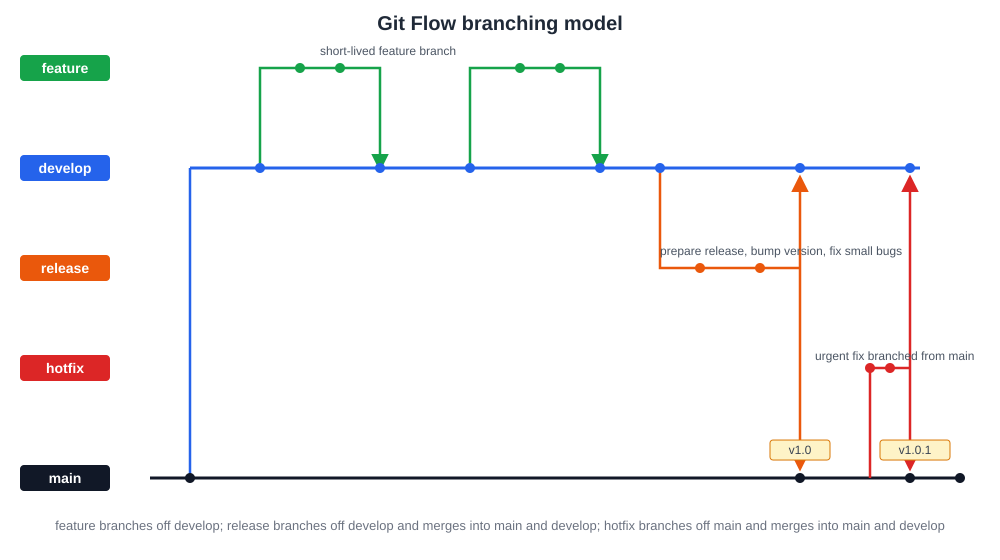

# 12장. 브랜치 전략

📖 [◀ 목차](00-목차.md) | [◀ 이전: 11장. Pull Request와 코드 리뷰 워크플로우](ch11-PullRequest와코드리뷰워크플로우.md) | [다음: 13장. 태그와 릴리스 관리 ▶](ch13-태그와릴리스관리.md)

---

11장까지 브랜치를 만들고, 커밋을 쌓고, Pull Request로 리뷰를 거쳐 병합하는 방법을 익혔습니다. 그런데 팀 전체가 이 도구들을 각자 마음대로 사용하면 어떻게 될까요? 어떤 사람은 `main`에 직접 커밋하고, 어떤 사람은 브랜치를 만들었다가 몇 달째 병합하지 않고, 어떤 사람은 브랜치 이름을 `test`, `test2`, `진짜최종`처럼 지어버리면 저장소는 금세 누구도 전체 그림을 파악할 수 없는 상태가 됩니다.

**브랜치 전략(branching strategy)**은 팀이 브랜치를 언제 만들고, 어떤 이름으로 부르고, 언제 병합하며, 어떤 브랜치가 배포 가능한 상태를 대표하는지에 대한 공통 규칙입니다. 이 장에서는 널리 쓰이는 세 가지 전략인 Git Flow, GitHub Flow, Trunk-based Development를 살펴보고, 각각이 어떤 팀과 프로젝트에 적합한지 실무적인 기준으로 비교합니다.

## 12.1 Git Flow

Git Flow는 브랜치의 역할을 다섯 가지로 세분화하는 전략입니다. 정기적인 릴리스 주기를 갖는 프로젝트, 여러 버전을 동시에 유지보수해야 하는 프로젝트에서 특히 자주 쓰입니다.

### 다섯 가지 브랜치의 역할

- **main**: 항상 실제 배포된(또는 배포 가능한) 상태를 가리키는 브랜치입니다. 이 브랜치의 커밋에는 보통 릴리스 태그(`v1.0.0` 등)가 붙습니다.
- **develop**: 다음 릴리스를 준비하며 여러 기능이 통합되는 브랜치입니다. 평소 개발 작업은 이 브랜치를 기준으로 이루어집니다.
- **feature/\***: 하나의 기능을 개발하기 위한 브랜치입니다. `develop`에서 갈라져 나와, 작업이 끝나면 다시 `develop`으로 병합됩니다.
- **release/\***: 다음 릴리스를 준비하는 브랜치입니다. `develop`에서 갈라져 나와 버전 번호 확정, 문서 정리, 사소한 버그 수정만 진행하고, 준비가 끝나면 `main`과 `develop` 양쪽에 병합됩니다.
- **hotfix/\***: 이미 배포된 `main`에서 발견된 긴급한 버그를 고치기 위한 브랜치입니다. `main`에서 갈라져 나와, 수정이 끝나면 `main`과 `develop` 양쪽에 병합됩니다.



전체 흐름을 요약하면 다음과 같습니다.

1. 평소에는 `develop`에서 `feature/*` 브랜치를 여러 개 파생시켜 기능을 개발하고, 완료되면 `develop`으로 병합한다.
2. 릴리스를 준비할 때가 되면 `develop`에서 `release/*` 브랜치를 만들어 마지막 점검을 한다.
3. 릴리스 브랜치가 준비되면 `main`에 병합하고 태그를 붙인 뒤, 같은 내용을 `develop`에도 병합해 두 브랜치가 어긋나지 않게 한다.
4. 배포 후 긴급한 버그가 발견되면 `main`에서 `hotfix/*` 브랜치를 만들어 수정하고, `main`과 `develop` 양쪽에 병합한다.

### 명령어로 살펴보는 Git Flow

Git Flow는 개념적인 규칙이며, Git 자체에 별도의 명령어가 내장되어 있지는 않습니다. 아래 예제처럼 기본 Git 명령어만으로도 충분히 이 흐름을 따라갈 수 있습니다. (별도로 `git-flow`라는 확장 도구를 설치하면 `git flow feature start` 같은 보조 명령을 사용할 수도 있지만, 이 확장 없이도 전략 자체를 실행하는 데는 문제가 없습니다.)

```bash
# 저장소에 처음 develop 브랜치를 만드는 경우
git checkout main
git checkout -b develop
git push -u origin develop

# 기능 개발: develop에서 feature 브랜치 생성
git checkout develop
git checkout -b feature/payment-refund

# 작업 후 develop으로 병합 (실무에서는 보통 PR을 통해 병합한다)
git checkout develop
git merge --no-ff feature/payment-refund
git branch -d feature/payment-refund

# 릴리스 준비: develop에서 release 브랜치 생성
git checkout develop
git checkout -b release/1.2.0
# 버전 파일 수정, 최종 버그 수정 등 진행 후 커밋

# 릴리스 완료: main과 develop 양쪽에 병합
git checkout main
git merge --no-ff release/1.2.0
git tag -a v1.2.0 -m "1.2.0 릴리스"

git checkout develop
git merge --no-ff release/1.2.0
git branch -d release/1.2.0

# 긴급 수정: main에서 hotfix 브랜치 생성
git checkout main
git checkout -b hotfix/1.2.1
# 버그 수정 커밋

# 수정 완료: main과 develop 양쪽에 병합
git checkout main
git merge --no-ff hotfix/1.2.1
git tag -a v1.2.1 -m "긴급 버그 수정"

git checkout develop
git merge --no-ff hotfix/1.2.1
git branch -d hotfix/1.2.1
```

### Git Flow의 장단점

- **장점**: 브랜치 이름만 보고도 그 코드가 어떤 목적으로 존재하는지 알 수 있습니다. `main`은 항상 배포된 상태, `develop`은 항상 다음 릴리스 준비 상태라는 규칙이 명확해서, 여러 버전을 동시에 유지보수하는 프로젝트(예: 1.x와 2.x를 함께 지원)에 특히 유리합니다.
- **단점**: 브랜치 종류와 병합 규칙이 많아 팀원 모두가 규칙을 숙지해야 합니다. 기능 하나를 배포하기까지 `feature → develop → release → main`을 거쳐야 하므로, 하루에도 여러 번 배포하는 팀에게는 절차가 무겁게 느껴질 수 있습니다.

## 12.2 GitHub Flow

GitHub Flow는 Git Flow보다 훨씬 단순한 전략입니다. 배포 가능한 브랜치는 `main` 하나뿐이고, 나머지는 모두 짧게 살고 사라지는 기능 브랜치입니다.

### 흐름

1. `main`에서 새 브랜치를 만든다. 브랜치 이름은 작업 내용을 짐작할 수 있게 짓는다.
2. 브랜치에 커밋을 쌓으며 작업하고, 자주 원격 저장소로 push한다.
3. 준비가 되면(완성되지 않았더라도) Pull Request를 연다.
4. 코드 리뷰와 논의를 거친다. 필요하면 커밋을 추가해 반영한다.
5. 승인을 받으면 `main`으로 병합한다.
6. `main`으로 병합된 코드는 즉시(또는 매우 짧은 주기로) 배포한다.

```bash
# main은 언제나 배포 가능한 상태를 유지한다
git checkout main
git pull origin main

# 새 기능을 위한 브랜치 생성
git checkout -b feature/search-autocomplete

# 작업하며 자주 커밋하고 push
git add .
git commit -m "feat: 검색어 자동완성 API 연동"
git push -u origin feature/search-autocomplete

# PR을 열고 리뷰를 받은 뒤, main으로 병합 (보통 Squash and merge 사용)
# 병합 후 즉시 배포 파이프라인이 main을 대상으로 실행된다
```

### 왜 지속적 배포에 적합한가

Git Flow의 `develop`, `release` 브랜치는 "아직 배포하지 않은 상태"를 오랫동안 보관하기 위한 장치입니다. 하지만 하루에도 여러 번 배포하는 서비스라면, 배포되지 않은 상태를 별도 브랜치에 오래 쌓아둘 이유가 없습니다. GitHub Flow는 애초에 "`main`에 들어간 것은 곧 배포된다"는 단순한 원칙을 세워, 배포를 준비하는 별도의 단계 자체를 없앱니다.

이 단순함 덕분에 브랜치 사이의 병합 규칙을 외울 필요가 없고, PR 하나가 병합되면 바로 다음 PR 작업을 시작할 수 있어 흐름이 끊기지 않습니다. 대신 이 전략이 제대로 동작하려면 다음 조건이 뒷받침되어야 합니다.

- `main`으로 병합되기 전에 충분한 자동화된 테스트가 통과해야 한다.
- 배포 자동화(CI/CD)가 구축되어 있어 병합과 배포 사이의 수작업이 최소화되어 있어야 한다.
- 문제가 생겼을 때 빠르게 되돌리거나(revert) 재배포할 수 있는 절차가 있어야 한다.

## 12.3 Trunk-based Development

Trunk-based Development(트렁크 기반 개발)는 GitHub Flow보다 한 걸음 더 나아간 전략입니다. 핵심 아이디어는 "브랜치를 최대한 짧게 유지하고, 가능하면 자주 trunk(주로 `main`)에 합류시킨다"는 것입니다.

- 기능 브랜치를 만들더라도 수명이 하루, 길어야 며칠을 넘기지 않습니다. 며칠씩 브랜치에 커밋을 쌓아두면 그만큼 `main`과 멀어져서 나중에 병합할 때 충돌 위험이 커지기 때문입니다.
- 완성되지 않은 기능이라도 `main`에 자주 병합합니다. 대신 사용자에게 아직 노출되면 안 되는 코드는 **feature flag(기능 플래그)**라는 개념으로 감싸서, 코드는 `main`에 들어가 있지만 플래그가 꺼져 있는 동안은 실제로 실행되지 않도록 만듭니다. (feature flag를 어떻게 구현하는지는 언어나 프레임워크, 사용하는 도구마다 다르므로 이 책에서는 개념만 소개합니다.)
- 팀 규모가 크고 배포 빈도가 매우 높은 조직에서는 아예 별도 브랜치 없이 `main`에 직접, 그러나 매우 작은 단위로 커밋하는 경우도 있습니다. 이 경우에도 커밋 하나하나가 항상 빌드와 테스트를 통과하는 상태를 유지해야 합니다.

```bash
# trunk-based 흐름의 예: 브랜치 수명을 최대한 짧게 가져간다
git checkout main
git pull origin main
git checkout -b feature/new-checkout-flag

# 하루 이내에 작업을 끝내고, 미완성 기능은 플래그로 감싼 채 병합
git add .
git commit -m "feat: 새 결제 흐름 초안 (feature flag: new_checkout 뒤에 감춤)"
git push -u origin feature/new-checkout-flag
# PR 리뷰 후 곧바로 main에 병합, 플래그는 기본적으로 꺼진 상태로 배포됨
```

이 전략은 브랜치 병합 자체보다 "테스트와 자동화가 얼마나 탄탄한가", "기능 플래그 인프라가 얼마나 잘 갖춰져 있는가"에 성공 여부가 달려 있습니다. 브랜치 전략만 놓고 보면 셋 중 가장 단순하지만, 이를 지탱하는 엔지니어링 인프라는 셋 중 가장 많이 요구됩니다.

## 12.4 어떤 전략을 선택해야 할까

세 전략은 우열을 가리는 관계가 아니라, 팀의 상황에 따라 맞는 선택이 달라지는 관계입니다.

| 전략 | 적합한 팀/프로젝트 | 특징 |
|---|---|---|
| Git Flow | 정기 릴리스 주기가 있는 제품(데스크톱/모바일 앱, 임베디드, 여러 버전을 동시 지원해야 하는 소프트웨어) | 브랜치 종류가 많고 규칙이 명확하지만, 배포까지 절차가 김 |
| GitHub Flow | 웹 서비스, SaaS처럼 지속적으로 배포되는 프로젝트, 중소 규모 팀 | `main` 하나만 배포 가능 상태로 유지, PR 중심의 단순한 흐름 |
| Trunk-based Development | 배포 빈도가 매우 높고 테스트 자동화·기능 플래그 인프라가 갖춰진 대규모 조직 | 브랜치 수명이 극도로 짧고, 미완성 기능은 플래그로 숨김 |

실무적으로 참고할 만한 기준을 정리하면 다음과 같습니다.

- 앱스토어 심사처럼 배포 자체에 시간이 걸리고, 여러 버전을 동시에 지원해야 한다면 Git Flow처럼 브랜치로 상태를 명확히 구분하는 전략이 유리합니다.
- 웹 서비스처럼 병합되는 즉시 배포해도 문제가 없고, 테스트 자동화가 어느 정도 갖춰져 있다면 GitHub Flow 정도의 단순함이 팀 생산성에 더 도움이 됩니다.
- 하루에도 수십, 수백 번 배포하는 대규모 조직이고, feature flag와 자동화된 테스트·모니터링 체계가 이미 탄탄하다면 Trunk-based Development로 병합 자체의 마찰을 최소화할 수 있습니다.
- 팀 규모가 작고 이제 막 협업 규칙을 세우는 단계라면, 처음부터 Git Flow의 다섯 가지 브랜치를 도입하기보다 GitHub Flow처럼 단순한 규칙으로 시작해서, 필요할 때 규칙을 추가해 나가는 편이 안전합니다.

이 책의 18장에서는 실전 프로젝트를 처음부터 끝까지 진행하면서 협업 흐름을 직접 실습합니다. 그 프로젝트는 지속적으로 배포되는 웹 서비스를 가정하므로, **GitHub Flow를 기준으로** `main` 브랜치 하나와 기능 브랜치, 그리고 11장에서 다룬 Pull Request 워크플로우를 조합해 진행할 예정입니다. 지금 이 장에서 세 전략의 차이를 이해해두면, 18장에서 왜 GitHub Flow를 선택했는지도 자연스럽게 납득할 수 있을 것입니다.

## 요약

- 브랜치 전략은 팀이 브랜치를 언제 만들고 언제 병합할지에 대한 공통 규칙이며, Git 자체가 강제하는 것이 아니라 팀이 합의해서 지키는 약속이다.
- Git Flow는 main, develop, feature, release, hotfix 다섯 가지 브랜치로 역할을 세분화하며, 정기 릴리스와 다중 버전 유지보수가 필요한 프로젝트에 적합하다.
- GitHub Flow는 main 브랜치 하나와 기능 브랜치, PR만으로 구성되는 단순한 전략으로, 지속적 배포 환경에 적합하다.
- Trunk-based Development는 브랜치 수명을 극도로 짧게 유지하고 feature flag로 미완성 기능을 감추며 자주 main에 합류시키는 전략으로, 강력한 테스트 자동화 인프라를 전제로 한다.
- 이 책의 18장 실전 프로젝트는 GitHub Flow를 기준으로 진행된다.

## 연습문제

1. Git Flow에서 `release` 브랜치가 `main`뿐 아니라 `develop`에도 병합되어야 하는 이유를 설명해 보세요. 만약 `develop`에 병합하는 것을 잊는다면 어떤 문제가 생길 수 있을까요?
2. GitHub Flow에서는 왜 `develop`이라는 별도의 통합 브랜치를 두지 않는지, 지속적 배포라는 맥락과 연결해 설명해 보세요.
3. Trunk-based Development에서 feature flag가 필요한 이유를 설명해 보세요. feature flag 없이 미완성 기능을 자주 `main`에 병합하면 어떤 문제가 생길 수 있을까요?
4. 여러분이 다니는(또는 알고 있는) 회사나 오픈소스 프로젝트가 실제로 어떤 브랜치 전략을 쓰고 있는지 조사해 보고, 이 장에서 배운 세 전략 중 어느 것에 가장 가까운지 비교해 보세요.
5. 모바일 앱을 앱스토어에 배포하면서 동시에 이전 두 개 버전(v1.x, v2.x)도 계속 버그 수정을 해줘야 하는 팀이 있다고 가정해 봅시다. Git Flow, GitHub Flow, Trunk-based Development 중 어떤 전략이 가장 적합할지, 그 이유와 함께 설명해 보세요.


---

📖 [◀ 목차](00-목차.md) | [◀ 이전: 11장. Pull Request와 코드 리뷰 워크플로우](ch11-PullRequest와코드리뷰워크플로우.md) | [다음: 13장. 태그와 릴리스 관리 ▶](ch13-태그와릴리스관리.md)
