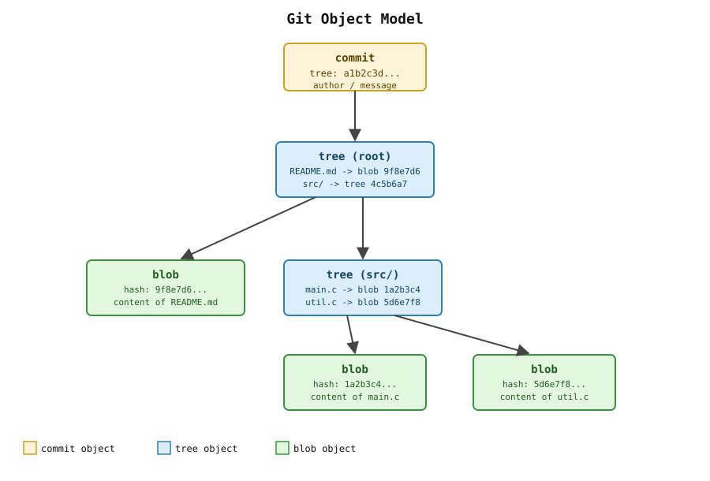

# 16장. Git 내부 구조

📖 [◀ 목차](00-목차.md) | [◀ 이전: 15장. 서브모듈과 모노레포](ch15-서브모듈과모노레포.md) | [다음: 17장. Git Hooks와 자동화 ▶](ch17-GitHooks와자동화.md)

---

지금까지 이 책에서는 `git add`, `git commit`, `git branch`, `git merge`처럼 일상적으로 쓰는 명령을 중심으로 Git을 배웠다. 이 장에서는 한 걸음 물러나 "이 명령들이 실제로 무엇을 하고 있는가"를 들여다본다. Git을 표면적인 명령어 목록으로만 외우면 어느 순간 예상과 다른 동작(예: `git reset`이 왜 파일을 지우기도 하고 안 지우기도 하는지, 커밋 해시가 왜 그렇게 생겼는지)을 만났을 때 당황하게 된다. 반면 내부 구조를 한 번이라도 직접 들여다본 사람은 그런 상황에서도 "Git이 왜 이렇게 동작하는지" 스스로 추론할 수 있다.

## 16.1 Git은 콘텐츠 주소화 저장소다

Git의 가장 근본적인 특징은 콘텐츠 주소화 저장소(content-addressable storage)라는 점이다. 이 말은 Git이 데이터를 "파일 이름"이나 "경로"가 아니라 "내용 그 자체"를 기준으로 저장하고 찾는다는 뜻이다.

일반적인 파일 시스템에서는 `readme.txt`라는 이름이 있고, 그 이름 아래에 내용이 들어 있다. 반면 Git은 어떤 데이터를 저장할 때 그 데이터의 내용을 해시 함수에 통과시켜 나온 해시값을 곧 그 데이터의 "주소"로 사용한다. 즉 내용이 같으면 해시값도 항상 같고, 내용이 조금이라도 다르면 해시값도 완전히 달라진다.

이 장에서는 이 아이디어가 실제로 어떻게 구현되어 있는지 `.git` 디렉터리를 직접 열어보면서 확인한다. 먼저 실습용 저장소를 하나 만들자.

```bash
git init hello-git
cd hello-git
git config user.name "Alice"
git config user.email "alice@example.com"

echo "Hello, Git internals!" > greeting.txt
git add greeting.txt
git commit -m "Add greeting file"
```

## 16.2 .git 디렉터리 둘러보기

`git init`이 만들어내는 `.git` 디렉터리가 바로 저장소의 실체다. 작업 디렉터리에 보이는 파일들은 이 디렉터리 안에 저장된 데이터를 특정 시점 기준으로 "풀어놓은" 결과물일 뿐이다.

```bash
ls -a .git
```

```text
.  ..  COMMIT_EDITMSG  HEAD  config  description  hooks  index  info  logs  objects  refs
```

이 가운데 이 장에서 다룰 핵심 요소는 다음과 같다.

- `objects/`: Git이 저장하는 모든 데이터(파일 내용, 디렉터리 구조, 커밋, 태그)가 실제로 들어 있는 곳. 16.3절과 16.4절에서 자세히 살펴본다.
- `refs/`: 브랜치와 태그처럼 "이름이 붙은 커밋 포인터"들을 담고 있는 디렉터리. 16.6절에서 다룬다.
- `HEAD`: 현재 체크아웃된 위치를 가리키는 파일.
- `config`: 이 저장소에만 적용되는 설정(원격 저장소 주소, 사용자 이름 등)이 담긴 파일.

`HEAD`와 `config`를 먼저 열어보자.

```bash
cat .git/HEAD
```

```text
ref: refs/heads/main
```

`HEAD`는 커밋 해시를 직접 담고 있는 것이 아니라, `refs/heads/main`이라는 다른 파일을 "가리키고" 있다. 이런 형태를 심볼릭 레퍼런스(symbolic reference)라고 부른다. 즉 `HEAD`는 "지금 어느 브랜치 위에 있는가"를 나타내고, 실제 커밋 위치는 그 브랜치 이름의 ref 파일이 담당한다.

```bash
cat .git/config
```

```ini
[core]
	repositoryformatversion = 0
	filemode = false
	bare = false
	logallrefupdates = true
[user]
	name = Alice
	email = alice@example.com
```

`config` 파일은 뒤에서 배울 원격 저장소(`[remote "origin"]`)나 브랜치별 설정(`[branch "main"]`)이 추가될 때마다 이 안에 새로운 섹션으로 쌓인다. `.gitmodules`가 슈퍼프로젝트와 함께 커밋되어 팀원에게 공유되는 것과 달리, `.git/config`는 커밋되지 않는 로컬 전용 파일이라는 점도 기억해두자.

## 16.3 Git 객체 모델: blob, tree, commit, tag

Git이 다루는 모든 데이터는 결국 네 가지 종류의 객체(object) 중 하나로 저장된다.



- **blob**: 파일의 내용을 저장하는 객체. 파일 이름이나 권한 정보는 담지 않고, 오직 바이트 단위의 내용만 담는다.
- **tree**: 디렉터리 하나의 구조를 저장하는 객체. "이 이름은 이 blob(파일)을 가리킨다", "저 이름은 저 tree(하위 디렉터리)를 가리킨다"는 목록과 각 항목의 파일 모드(실행 권한 등)를 담는다.
- **commit**: 특정 시점의 스냅샷과 메타데이터를 저장하는 객체. 최상위 tree 하나, 부모 커밋(들), 작성자·커미터 정보, 커밋 메시지를 담는다.
- **tag**: 주석 태그(annotated tag)를 만들 때 생성되는 객체. 특정 객체(보통 커밋)를 가리키면서, 태그를 만든 사람과 메시지 같은 부가 정보를 담는다.

commit은 tree를 가리키고, tree는 blob과 또 다른 tree를 가리킨다. 이 관계는 한 방향으로만 이어지며, 한 번 만들어진 객체는 절대 내용이 변경되지 않는다(불변, immutable). 커밋을 "수정"하는 것처럼 보이는 작업(`git commit --amend`, `git rebase` 등)도 실제로는 기존 객체를 고치는 것이 아니라, 새로운 객체를 만들고 브랜치가 가리키는 대상을 그 새 객체로 바꾸는 것이다.

## 16.4 git cat-file로 객체 내용 직접 들여다보기

이제 16.1절에서 만든 커밋의 객체들을 직접 열어보자. 이때 사용하는 `git cat-file`은 사용자가 평소에 잘 쓰지 않는 저수준 명령이다(이런 명령을 plumbing이라 부르는데, 16.7절에서 자세히 다룬다).

먼저 방금 만든 커밋의 해시값을 확인한다.

```bash
git log -1 --format=%H
```

```text
c3f1a9d2e7b4c6a8f0d1e2b3c4a5f6d7e8c9b0a1
```

이 해시값(줄여서 `c3f1a9d`처럼 앞 7~10자리만 써도 대부분 구분 가능하다)으로 `git cat-file`을 실행해보자. `-t` 옵션은 객체의 타입을, `-p`(pretty-print) 옵션은 객체의 내용을 사람이 읽기 좋은 형태로 보여준다.

```bash
git cat-file -t c3f1a9d2e7b4c6a8f0d1e2b3c4a5f6d7e8c9b0a1
```

```text
commit
```

```bash
git cat-file -p c3f1a9d2e7b4c6a8f0d1e2b3c4a5f6d7e8c9b0a1
```

```text
tree 9d1e2f3a4b5c6d7e8f9a0b1c2d3e4f5a6b7c8d9e
author Alice <alice@example.com> 1735500000 +0900
committer Alice <alice@example.com> 1735500000 +0900

Add greeting file
```

commit 객체의 내용이 그대로 드러난다. 최상위 tree의 해시, 작성자·커미터 정보(이름, 이메일, 타임스탬프, 타임존), 그리고 커밋 메시지. 이 커밋은 첫 커밋이라 `parent` 줄이 없지만, 두 번째 커밋부터는 `parent <해시>` 줄이 추가되어 이전 커밋을 가리킨다.

이제 이 commit이 가리키는 tree 객체를 열어보자.

```bash
git cat-file -p 9d1e2f3a4b5c6d7e8f9a0b1c2d3e4f5a6b7c8d9e
```

```text
100644 blob 4f2e6d1a8c3b5e7f9a0b1c2d3e4f5a6b7c8d9e0f	greeting.txt
```

tree 객체는 파일 모드(`100644`는 일반 파일, 실행 파일이면 `100755`), 객체 타입(`blob`), 그 객체의 해시, 그리고 이름(`greeting.txt`)을 한 줄로 보여준다. 디렉터리가 여러 단계로 중첩되어 있다면, 하위 디렉터리는 `blob` 대신 `tree` 타입과 그 디렉터리의 해시로 표시되고, 그 tree를 다시 `git cat-file -p`로 열어보면 그 안의 항목들이 나온다. 15장에서 다룬 서브모듈 경로가 `git status`에서 특수하게 표시되었던 것도, tree 안에서 서브모듈 항목이 `blob`이나 `tree`가 아니라 `commit`이라는 특수한 타입(gitlink)으로 기록되기 때문이다.

마지막으로 blob 객체, 즉 파일의 실제 내용을 확인해보자.

```bash
git cat-file -p 4f2e6d1a8c3b5e7f9a0b1c2d3e4f5a6b7c8d9e0f
```

```text
Hello, Git internals!
```

방금 `greeting.txt`에 적었던 바로 그 내용이다. blob 객체 안에는 파일 이름이 전혀 등장하지 않는다는 점에 주의하자. 파일 이름은 그 blob을 가리키는 tree 쪽에 기록되어 있을 뿐, blob 자신은 순수하게 내용만 담고 있다.

### 16.4.1 git hash-object로 콘텐츠 주소화 직접 확인하기

`git cat-file`이 해시로부터 내용을 찾아가는 명령이라면, `git hash-object`는 그 반대 방향, 즉 내용으로부터 해시를 계산하는 plumbing 명령이다. 이를 이용해 "같은 내용이면 항상 같은 해시가 나온다"는 콘텐츠 주소화의 핵심을 직접 확인할 수 있다.

```bash
echo "Hello, Git internals!" | git hash-object --stdin
```

```text
4f2e6d1a8c3b5e7f9a0b1c2d3e4f5a6b7c8d9e0f
```

`greeting.txt`를 커밋할 때 만들어졌던 blob의 해시와 정확히 같은 값이 나온다. 파일 이름도, 저장 위치도 전혀 관여하지 않았는데 오직 내용만으로 동일한 해시가 계산된 것이다. 만약 같은 내용을 담은 파일을 저장소 여러 곳에 만들어 커밋해도, Git은 그 파일들 각각에 대해 새 blob을 만드는 대신 이미 존재하는 같은 blob 하나를 재사용한다. 이것이 Git이 내부적으로 저장 공간을 절약하는 방식이기도 하다.

## 16.5 해시는 어떻게 계산되는가

Git 객체의 해시는 SHA-1이라는 암호학적 해시 함수로 계산된다(Git 2.29부터는 저장소를 만들 때 `--object-format=sha256`을 지정해 SHA-256을 사용하는 실험적인 방식도 지원하지만, 이 책을 쓰는 시점 기준으로 기본값은 여전히 SHA-1이다). SHA-1은 임의 길이의 입력을 받아 160비트(16진수 40자리) 길이의 고정된 출력을 만들어내는 함수로, 다음과 같은 성질을 갖는다.

- 같은 입력에는 항상 같은 출력이 나온다(결정적).
- 입력이 단 한 비트만 달라져도 출력은 완전히 다른 값이 된다.
- 출력만 보고 원래 입력을 역산해내는 것은 사실상 불가능하다.
- 서로 다른 두 입력이 우연히 같은 출력을 낼 확률은 실질적으로 무시할 수 있을 만큼 낮다.

Git이 blob 하나를 저장할 때 실제로 해시하는 대상은 파일 내용 그 자체가 아니라, 앞에 짧은 헤더를 붙인 문자열이다. 개략적으로 표현하면 다음과 같다.

```text
"blob " + 내용의 바이트 길이 + NUL 문자 + 실제 내용
```

예를 들어 `Hello, Git internals!\n`이라는 22바이트 내용을 담은 blob이라면, 실제로 해시 함수에 들어가는 입력은 `"blob 23\0Hello, Git internals!\n"`이다(개행 문자까지 포함하면 23바이트가 된다). 이 전체 문자열을 SHA-1로 해시한 값이 곧 그 blob의 이름(해시값)이 된다. tree, commit, tag 객체도 마찬가지로 각각 `"tree <크기>\0..."`, `"commit <크기>\0..."`, `"tag <크기>\0..."` 형태의 헤더를 붙인 뒤 해시를 계산한다.

이렇게 계산된 해시는 곧 그 객체가 저장되는 위치이기도 하다. Git은 40자리 해시값의 앞 2자리를 디렉터리 이름으로, 나머지 38자리를 파일 이름으로 사용해 `objects/` 아래에 압축된 형태로 저장한다.

```bash
find .git/objects -type f
```

```text
.git/objects/4f/2e6d1a8c3b5e7f9a0b1c2d3e4f5a6b7c8d9e0f
.git/objects/9d/1e2f3a4b5c6d7e8f9a0b1c2d3e4f5a6b7c8d9e
.git/objects/c3/f1a9d2e7b4c6a8f0d1e2b3c4a5f6d7e8c9b0a1
```

앞서 `git cat-file -p`로 열어봤던 세 해시값이 정확히 이 파일들의 이름(디렉터리 2자리 + 파일 이름 38자리)과 일치하는 것을 확인할 수 있다. 이 파일들을 직접 텍스트 편집기로 열어봐도 사람이 읽을 수 있는 내용은 나오지 않는데, zlib로 압축되어 저장되어 있기 때문이다. `git cat-file`은 이 압축을 풀고 헤더를 제거해 우리가 알아볼 수 있는 내용만 보여준 것이다.

커밋을 많이 쌓다 보면 이런 개별 파일(느슨한 객체, loose object)이 아주 많아지는데, `git gc`가 실행되면 Git은 이들을 하나의 packfile로 묶어 `objects/pack/` 아래에 압축·저장한다. 개별 loose object를 직접 눈으로 찾아보는 지금과 같은 실습은 packfile로 정리되기 전, 즉 커밋을 갓 만든 저장소에서 가장 확인하기 쉽다.

## 16.6 refs/heads, refs/tags는 그냥 파일이다

3장과 여러 장에 걸쳐 "브랜치는 커밋을 가리키는 이동 가능한 포인터"라고 배웠다. 이 절에서는 그 포인터가 실제로 어떤 형태로 저장되는지 눈으로 직접 확인한다.

```bash
cat .git/refs/heads/main
```

```text
c3f1a9d2e7b4c6a8f0d1e2b3c4a5f6d7e8c9b0a1
```

`refs/heads/main` 파일의 내용은 정확히 우리가 앞서 확인했던 커밋 해시와 같다. 즉 브랜치는 특별한 자료구조가 아니라, 40자리 커밋 해시 하나만 달랑 담긴 텍스트 파일이다. 새 커밋을 만들면 Git이 하는 일은 사실 이 파일의 내용을 새 커밋의 해시로 덮어쓰는 것뿐이다.

```bash
echo "second commit" >> greeting.txt
git add greeting.txt
git commit -m "Update greeting"

cat .git/refs/heads/main
```

```text
7b3e5f1a9c2d4e6b8f0a1c3d5e7f9b0a2c4d6e8f
```

파일 내용이 새 커밋의 해시로 바뀐 것을 확인할 수 있다. `git branch`로 새 브랜치를 만드는 것도 마찬가지로, 지정한 커밋의 해시를 담은 새 ref 파일을 `refs/heads/` 아래에 하나 더 만드는 것에 지나지 않는다.

```bash
git branch feature/experiment
cat .git/refs/heads/feature/experiment
```

```text
7b3e5f1a9c2d4e6b8f0a1c3d5e7f9b0a2c4d6e8f
```

`git branch`로 만든 새 브랜치가 현재 `HEAD`와 같은 커밋을 가리키므로, 두 ref 파일의 내용이 동일하다.

태그도 같은 원리로 동작하지만, 태그의 두 종류(가벼운 태그와 주석 태그)는 저장 방식에서 미묘한 차이를 보인다. 먼저 가벼운 태그(lightweight tag)를 만들어보자.

```bash
git tag v0.1
cat .git/refs/tags/v0.1
```

```text
7b3e5f1a9c2d4e6b8f0a1c3d5e7f9b0a2c4d6e8f
```

가벼운 태그는 브랜치와 마찬가지로 커밋 해시를 그대로 담은 ref 파일일 뿐이다. 이번에는 주석 태그(annotated tag)를 만들어보자.

```bash
git tag -a v0.2 -m "Second release"
cat .git/refs/tags/v0.2
```

```text
2a4c6e8f0b1d3e5f7a9c0b2d4e6f8a0c1e3d5f7b
```

주석 태그의 ref 파일에 담긴 해시는 우리가 앞서 봤던 커밋 해시와 다르다. 이는 주석 태그를 만들 때 Git이 커밋을 직접 가리키는 대신, tag 객체를 새로 만들고 그 tag 객체의 해시를 ref에 저장하기 때문이다. `git cat-file`로 이 tag 객체를 열어보면 그 차이가 분명해진다.

```bash
git cat-file -p 2a4c6e8f0b1d3e5f7a9c0b2d4e6f8a0c1e3d5f7b
```

```text
object 7b3e5f1a9c2d4e6b8f0a1c3d5e7f9b0a2c4d6e8f
type commit
tag v0.2
tagger Alice <alice@example.com> 1735501000 +0900

Second release
```

tag 객체는 어떤 객체를 가리키는지(`object`), 그 객체의 타입(`type`), 태그 이름(`tag`), 태그를 만든 사람(`tagger`), 그리고 태그 메시지를 담고 있다. 즉 주석 태그는 "커밋을 가리키는 별도의 객체"이고, 가벼운 태그는 "커밋을 곧바로 가리키는 이름표"라는 차이가 있다. 이 차이 때문에 주석 태그만 태그를 만든 사람과 날짜, 서명(`git tag -s`) 같은 부가 정보를 가질 수 있다.

`HEAD`가 브랜치 이름을 통하지 않고 특정 커밋을 직접 가리키는 detached HEAD 상태(15장에서 서브모듈을 초기화할 때 이 상태가 된다고 언급했다)에서는, `.git/HEAD` 파일 자체에 `ref: refs/heads/...`가 아니라 커밋 해시가 그대로 들어간다.

```bash
git checkout 7b3e5f1a9c2d4e6b8f0a1c3d5e7f9b0a2c4d6e8f
cat .git/HEAD
```

```text
7b3e5f1a9c2d4e6b8f0a1c3d5e7f9b0a2c4d6e8f
```

`HEAD`가 다른 ref를 가리키는 심볼릭 레퍼런스에서, 커밋 해시를 직접 담은 파일로 바뀐 것을 확인할 수 있다. 실습을 마쳤다면 다시 브랜치로 돌아가 두자.

```bash
git checkout main
```

## 16.7 porcelain 명령과 plumbing 명령

이 장에서 사용한 `git cat-file`, `git hash-object` 같은 명령과, 지금까지 이 책 전반에서 사용해 온 `git add`, `git commit`, `git status`, `git merge` 같은 명령 사이에는 뚜렷한 층위 차이가 있다. Git 커뮤니티에서는 이를 porcelain과 plumbing이라는 용어로 구분한다.

- **plumbing**: 객체를 만들고, 읽고, ref를 갱신하는 등 Git의 가장 기초적인 동작을 담당하는 저수준 명령. 사용자 친화적인 출력이나 편의 기능 없이, 스크립트에서 다루기 좋은 형태로 결과를 내놓는다. `git hash-object`, `git cat-file`, `git write-tree`, `git commit-tree`, `git update-ref`, `git rev-parse`, `git ls-tree` 등이 여기에 속한다.
- **porcelain**: 사람이 대화하듯 사용하도록 만들어진 고수준 명령. 여러 plumbing 명령을 내부적으로 조합하고, 사람이 읽기 좋은 메시지와 확인 절차를 덧붙인다. `git add`, `git commit`, `git status`, `git branch`, `git merge`, `git log` 등 이 책에서 지금까지 다룬 명령 대부분이 여기에 속한다.

예를 들어 `git commit`이라는 porcelain 명령 하나가 실행될 때, Git 내부적으로는 대략 다음과 같은 plumbing 수준의 작업이 순서대로 일어난다고 볼 수 있다.

1. 스테이징 영역(인덱스)의 내용을 바탕으로 새 tree 객체를 만든다(`git write-tree`가 하는 일).
2. 그 tree와 현재 `HEAD`가 가리키는 커밋을 부모로 삼아 새 commit 객체를 만든다(`git commit-tree`가 하는 일).
3. 현재 브랜치의 ref 파일을 방금 만든 새 커밋의 해시로 갱신한다(`git update-ref`가 하는 일).

실제로 이 세 단계를 plumbing 명령으로 직접 흉내 내볼 수도 있다.

```bash
echo "manual commit demo" > demo.txt
git add demo.txt

TREE=$(git write-tree)
COMMIT=$(git commit-tree "$TREE" -p HEAD -m "Manual commit via plumbing")
git update-ref refs/heads/main "$COMMIT"

git log -1
```

`git write-tree`는 현재 인덱스 상태로 tree 객체를 만들고, `git commit-tree`는 그 tree와 부모 커밋(`-p HEAD`), 메시지를 받아 commit 객체를 만든다. 마지막으로 `git update-ref`가 `refs/heads/main` 파일을 새 커밋 해시로 직접 덮어쓴다. `git log -1`로 확인해보면 방금 만든 커밋이 평소 `git commit`으로 만든 것과 다를 바 없이 정상적으로 나타난다.

이 실습이 보여주는 것은, `git commit` 같은 porcelain 명령이 어떤 마법을 부리는 것이 아니라 plumbing 명령들을 정해진 순서로 실행하고 그 결과를 편리하게 감싸주는 것에 지나지 않는다는 사실이다. 평소 작업에서는 당연히 porcelain 명령을 쓰는 것이 훨씬 안전하고 편리하다(예: `git commit`은 커밋 메시지가 비어 있는지, 스테이징된 변경이 있는지 등을 검증해준다). 하지만 Git이 내부적으로 어떻게 동작하는지 이해해두면, 예상 밖의 상황을 만났을 때 "결국 커밋은 tree와 부모 포인터, 메시지를 담은 객체일 뿐이고 브랜치는 그 객체의 해시를 담은 파일일 뿐"이라는 사실에 기대어 문제를 훨씬 침착하게 진단할 수 있다.

## 요약

- Git은 콘텐츠 주소화 저장소다. 데이터를 이름이 아니라 내용의 해시값을 기준으로 저장하고, 같은 내용은 항상 같은 해시로 식별된다.
- Git 객체는 blob(파일 내용), tree(디렉터리 구조), commit(스냅샷과 메타데이터), tag(주석 태그 정보) 네 가지로 구성되며, commit은 tree를, tree는 blob과 다른 tree를 가리키는 방식으로 서로 연결된다.
- `git cat-file -t`/`-p`로 해시값을 이용해 객체의 타입과 내용을 직접 확인할 수 있고, `git hash-object`로는 내용으로부터 해시를 역으로 계산해볼 수 있다.
- 객체의 해시는 `"타입 크기\0내용"` 형태의 문자열을 SHA-1로 해시한 값이며, 이 해시가 곧 `objects/` 아래에서 그 객체가 저장되는 경로가 된다.
- `refs/heads/<브랜치>`와 `refs/tags/<태그>`는 커밋(또는 주석 태그의 경우 tag 객체)의 해시 하나만 담은 평범한 텍스트 파일이며, `HEAD`는 보통 현재 브랜치의 ref를 가리키는 심볼릭 레퍼런스다.
- `git add`, `git commit`, `git merge` 같은 porcelain 명령은 `git write-tree`, `git commit-tree`, `git update-ref` 같은 plumbing 명령을 내부적으로 조합해 동작하는 고수준 래퍼(wrapper)다.

## 연습문제

1. 새 저장소를 만들고 파일 하나를 커밋한 뒤, `git cat-file -p`를 이용해 commit 객체, 그 commit이 가리키는 tree 객체, 그 tree가 가리키는 blob 객체를 순서대로 열어보고 각 객체에 어떤 정보가 들어 있는지 설명하라.
2. 서로 다른 이름을 가진 두 파일에 완전히 동일한 내용을 담아 커밋한 뒤, `git ls-tree HEAD`나 tree 객체를 직접 열어봐서 두 파일이 같은 blob 해시를 공유하는지 확인하라. 이 결과가 콘텐츠 주소화 저장소의 어떤 성질을 보여주는지 설명하라.
3. 가벼운 태그(`git tag`)와 주석 태그(`git tag -a`)를 각각 만든 뒤, 두 태그의 ref 파일 내용을 비교하고 왜 서로 다른지 설명하라.
4. `git write-tree`, `git commit-tree`, `git update-ref`를 순서대로 사용해 `git commit` 없이 새 커밋을 하나 만들어보고, `git log`로 정상적인 커밋처럼 보이는지 확인하라.
5. porcelain 명령과 plumbing 명령의 차이를 예를 들어 설명하고, 왜 일상적인 작업에서는 plumbing 명령 대신 porcelain 명령을 사용하는 것이 권장되는지 논하라.


---

📖 [◀ 목차](00-목차.md) | [◀ 이전: 15장. 서브모듈과 모노레포](ch15-서브모듈과모노레포.md) | [다음: 17장. Git Hooks와 자동화 ▶](ch17-GitHooks와자동화.md)
