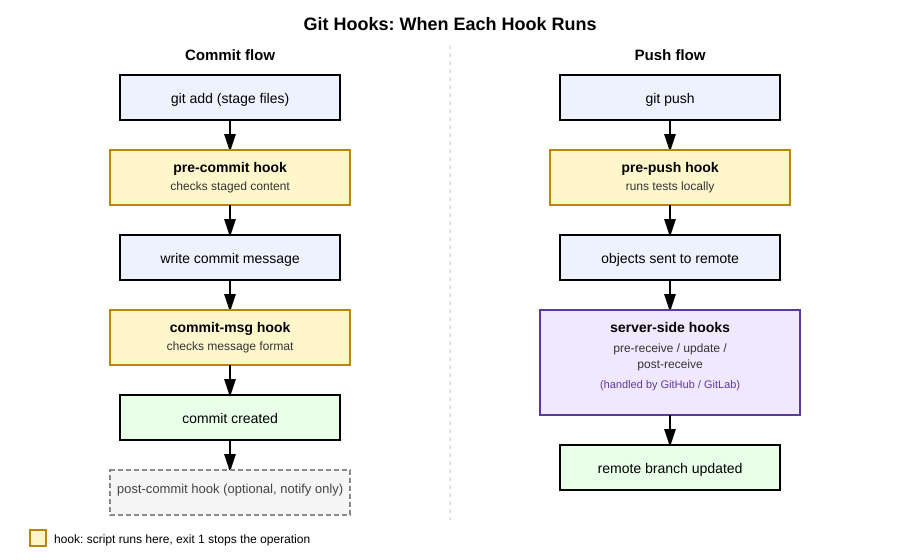

# 17장. Git Hooks와 자동화

📖 [◀ 목차](00-목차.md) | [◀ 이전: 16장. Git 내부 구조](ch16-Git내부구조.md) | [다음: 18장. 실전 프로젝트: 협업 시나리오로 배우는 Git 워크플로우 ▶](ch18-실전프로젝트협업시나리오로배우는Git워크플로우.md)

---

## 들어가며

지금까지는 `git commit`, `git push` 같은 명령을 우리가 직접 실행할 때마다 Git이 그 작업을 수행했습니다. 그런데 실무에서는 "커밋하기 전에 코드 스타일을 자동으로 검사하고 싶다", "커밋 메시지가 정해진 규칙을 따르는지 확인하고 싶다", "테스트가 통과하지 않으면 푸시 자체를 막고 싶다"는 요구가 자주 생깁니다. 매번 사람이 손으로 검사하고 넘어가는 방식은 실수가 생기기 마련이고, 팀 규모가 커질수록 이런 실수의 비용도 커집니다.

Git은 이런 요구를 위해 **Git Hooks(Git 훅)**라는 메커니즘을 기본으로 제공합니다. 특정 시점에 Git이 자동으로 스크립트를 실행해 주는 기능으로, 별도의 외부 도구 없이도 저장소 안에서 바로 사용할 수 있습니다. 이번 장에서는 Git Hooks가 무엇인지, 어떤 훅들이 있는지, 그리고 실제로 동작하는 훅 스크립트를 직접 작성해 보면서 Git을 이용한 자동화의 첫걸음을 떼어 봅니다.

## Git Hooks란 무엇인가

모든 Git 저장소는 `.git` 디렉터리 안에 `hooks`라는 하위 디렉터리를 가지고 있습니다. 이 디렉터리를 확인해 봅시다.

```bash
ls .git/hooks
```

새로 `git init`한 저장소라면 다음과 비슷한 목록이 보일 것입니다.

```
applypatch-msg.sample
commit-msg.sample
fsmonitor-watchman.sample
post-update.sample
pre-applypatch.sample
pre-commit.sample
pre-merge-commit.sample
pre-push.sample
pre-rebase.sample
pre-receive.sample
prepare-commit-msg.sample
push-to-checkout.sample
update.sample
```

파일 이름이 모두 `.sample`로 끝나는 것을 볼 수 있습니다. Git은 각 훅 시점마다 어떤 스크립트를 작성하면 되는지 보여주는 예시 파일을 미리 넣어 두었을 뿐, 기본적으로는 아무 훅도 활성화되어 있지 않습니다. `.sample` 확장자를 떼어 내고 실행 권한을 부여하면 그 순간부터 해당 훅이 동작하기 시작합니다.

즉, Git Hooks의 핵심은 단순합니다.

- `.git/hooks/` 아래에 정해진 이름(`pre-commit`, `commit-msg` 등)의 실행 가능한 스크립트를 두면
- Git이 해당 시점에 자동으로 그 스크립트를 실행하고
- 스크립트의 종료 코드(exit code)가 0이 아니면 Git은 해당 작업을 **중단**합니다.

스크립트의 언어는 특별히 제한되지 않습니다. 셸 스크립트, 파이썬, 자바스크립트 등 실행 가능한 어떤 스크립트도 훅으로 사용할 수 있습니다. 다만 이 장에서는 별도의 실행 환경 없이 어떤 운영체제에서도 바로 시험해 볼 수 있도록 셸 스크립트(`sh`)로 예제를 작성합니다.

## 주요 클라이언트 훅

Git 훅은 크게 **클라이언트 훅**과 **서버 훅**으로 나뉩니다. 클라이언트 훅은 개발자 각자의 컴퓨터에서, 즉 로컬 저장소에서 `commit`, `push` 같은 명령을 실행할 때 동작합니다. 이번 장에서는 실무에서 가장 자주 쓰이는 세 가지 클라이언트 훅을 중심으로 살펴봅니다.

| 훅 이름 | 실행 시점 | 주로 하는 일 |
|---|---|---|
| `pre-commit` | 커밋 메시지를 입력받기 **전** | 스테이징된 코드 검사(스타일 검사, 금지 패턴 검사 등) |
| `commit-msg` | 커밋 메시지를 입력받은 **후**, 커밋이 실제로 만들어지기 전 | 커밋 메시지 형식 검사 |
| `pre-push` | 원격 저장소로 데이터를 보내기 **전** | 테스트 실행, 특정 브랜치로의 푸시 제한 등 |

이 밖에도 `post-commit`(커밋이 만들어진 직후 알림 등에 사용), `pre-rebase`(리베이스 시작 전 검사), `post-checkout`(브랜치 전환 직후 실행), `post-merge`(병합 직후 실행) 같은 훅도 있습니다. 동작 방식은 모두 동일합니다. 정해진 이름의 실행 가능한 스크립트를 `.git/hooks/`에 두면 해당 시점에 자동으로 실행됩니다.

커밋 과정과 푸시 과정에서 각 훅이 정확히 어느 지점에 끼어드는지는 다음 그림으로 정리할 수 있습니다.



## 실습: pre-commit 훅으로 금지 패턴 검사하기

가장 먼저, 커밋에 포함되면 안 되는 패턴(예: 비밀번호나 API 키를 코드에 그대로 적어 둔 흔적)이 있으면 커밋 자체를 거부하는 `pre-commit` 훅을 만들어 보겠습니다.

먼저 실습용 저장소를 하나 준비합니다.

```bash
mkdir hooks-practice
cd hooks-practice
git init
```

`.git/hooks/pre-commit` 파일을 다음 내용으로 작성합니다. (편집기로 직접 만들어도 되고, 아래처럼 셸에서 바로 작성해도 됩니다.)

```bash
#!/bin/sh
# .git/hooks/pre-commit
# 스테이징된 파일에서 민감한 정보로 보이는 패턴을 검사합니다.

staged_files=$(git diff --cached --name-only --diff-filter=ACM)

if [ -z "$staged_files" ]; then
    exit 0
fi

found=0
pattern="(password|secret|api_key)[[:space:]]*="

for file in $staged_files; do
    if [ -f "$file" ] && grep -nEi "$pattern" "$file" >/dev/null 2>&1; then
        echo "[pre-commit] 금지된 패턴이 발견되었습니다: $file"
        grep -nEi "$pattern" "$file"
        found=1
    fi
done

if [ "$found" -eq 1 ]; then
    echo "커밋이 거부되었습니다. 민감한 정보로 보이는 값을 코드에서 제거한 뒤 다시 시도하세요."
    exit 1
fi

exit 0
```

작성한 스크립트에 실행 권한을 부여해야 합니다. 실행 권한이 없으면 Git이 훅 파일을 무시합니다.

```bash
chmod +x .git/hooks/pre-commit
```

이제 훅이 잘 동작하는지 확인해 봅시다. 먼저 금지 패턴이 포함된 파일을 만들어 커밋을 시도합니다.

```bash
echo 'api_key = "abcd1234"' > config.txt
git add config.txt
git commit -m "설정 파일 추가"
```

`pre-commit` 훅이 걸리는 패턴을 발견하면 다음과 비슷한 메시지와 함께 커밋이 거부되고, `git commit`의 종료 코드도 0이 아닌 값으로 끝납니다.

```
[pre-commit] 금지된 패턴이 발견되었습니다: config.txt
1:api_key = "abcd1234"
커밋이 거부되었습니다. 민감한 정보로 보이는 값을 코드에서 제거한 뒤 다시 시도하세요.
```

문제가 되는 부분을 수정하고 다시 커밋하면 정상적으로 통과합니다.

```bash
echo 'api_key = "read from environment variable"' > config.txt
git add config.txt
git commit -m "설정 파일 추가"
```

## 실습: commit-msg 훅으로 커밋 메시지 형식 검사하기

`pre-commit`이 코드 내용을 검사한다면, `commit-msg`는 **커밋 메시지 자체**를 검사합니다. `commit-msg` 훅은 실행될 때 첫 번째 인자(`$1`)로 커밋 메시지가 저장된 임시 파일의 경로를 전달받습니다.

이번에는 커밋 메시지가 `feat:`, `fix:`, `docs:`처럼 정해진 타입으로 시작하는지 검사하는 훅을 만들어 보겠습니다.

```bash
#!/bin/sh
# .git/hooks/commit-msg
# 커밋 메시지가 "타입: 설명" 형식을 따르는지 검사합니다.

commit_msg_file="$1"
first_line=$(head -n 1 "$commit_msg_file")

pattern="^(feat|fix|docs|style|refactor|test|chore)(\([a-z0-9-]+\))?: .+"

if ! echo "$first_line" | grep -qE "$pattern"; then
    echo "커밋 메시지 형식이 올바르지 않습니다."
    echo "형식: <타입>(<범위>): <설명>"
    echo "예:   feat: 할 일 삭제 기능 추가"
    echo "예:   fix(parser): 빈 줄 처리 오류 수정"
    echo "허용 타입: feat, fix, docs, style, refactor, test, chore"
    exit 1
fi

exit 0
```

```bash
chmod +x .git/hooks/commit-msg
```

형식에 맞지 않는 메시지로 커밋을 시도하면 거부됩니다.

```bash
git commit --allow-empty -m "설정 수정함"
```

```
커밋 메시지 형식이 올바르지 않습니다.
형식: <타입>(<범위>): <설명>
...
```

형식에 맞는 메시지로 바꾸면 통과합니다.

```bash
git commit --allow-empty -m "fix: 설정 파일 파싱 오류 수정"
```

`pre-commit`과 `commit-msg`는 같은 커밋 과정 안에서 순서대로 실행됩니다. `pre-commit`이 먼저 실행되어 코드 내용을 검사하고, 통과하면 커밋 메시지 입력 단계로 넘어가며, 메시지가 확정된 뒤 `commit-msg`가 그 메시지를 검사합니다. 둘 중 하나라도 0이 아닌 종료 코드를 반환하면 커밋은 만들어지지 않습니다.

## 실습: pre-push 훅으로 푸시 전 테스트 실행하기

로컬에서 아무리 꼼꼼히 확인해도, 테스트가 실패하는 코드를 실수로 원격 저장소에 올려버리는 경우가 있습니다. `pre-push` 훅을 사용하면 `git push`가 실제로 네트워크를 통해 데이터를 보내기 전에 마지막 관문을 하나 더 둘 수 있습니다.

```bash
#!/bin/sh
# .git/hooks/pre-push
# 원격 저장소로 푸시하기 전에 테스트 스크립트를 실행합니다.

remote_name="$1"
remote_url="$2"

echo "[pre-push] $remote_name ($remote_url) 로 푸시하기 전에 테스트를 실행합니다..."

if [ ! -f ./run-tests.sh ]; then
    echo "[pre-push] run-tests.sh가 없어 검사를 건너뜁니다."
    exit 0
fi

if ! sh ./run-tests.sh; then
    echo "[pre-push] 테스트가 실패하여 푸시를 중단합니다."
    exit 1
fi

exit 0
```

```bash
chmod +x .git/hooks/pre-push
```

`pre-push` 훅은 첫 번째 인자로 원격 저장소 이름(예: `origin`), 두 번째 인자로 원격 저장소 URL을 전달받습니다. 또한 표준 입력(stdin)을 통해 "어떤 로컬 브랜치의 어떤 커밋이 어떤 원격 브랜치로 전송되는지"에 대한 정보를 한 줄씩 전달받을 수 있는데, 특정 브랜치(예: `main`)로의 직접 푸시만 별도로 검사하고 싶을 때는 이 정보를 읽어 판단하면 됩니다. 이 장에서는 가장 단순한 형태로, 푸시를 시도할 때마다 테스트 스크립트 하나를 실행하는 예제만 다룹니다.

## 훅이 저장소마다 공유되지 않는 이유

여기까지 실습을 따라 했다면 한 가지 중요한 한계를 눈치챘을 것입니다. 방금 만든 `pre-commit`, `commit-msg`, `pre-push` 파일은 모두 `.git/hooks/` 디렉터리 안에 있습니다. 그런데 2장에서 살펴봤고 16장에서 더 자세히 다루었듯이, `.git` 디렉터리는 Git 자신이 저장소를 관리하는 데 사용하는 내부 저장소이지, `git add`나 `git commit`으로 우리가 직접 다루는 일반 파일이 아닙니다.

다시 말해 다음과 같은 문제가 생깁니다.

- 내가 만든 훅은 내 컴퓨터의 `.git/hooks/`에만 존재합니다.
- 이 저장소를 `git clone`해서 받은 동료의 컴퓨터에는 이 훅이 전혀 존재하지 않습니다.
- 팀 전체가 같은 규칙(커밋 메시지 형식, 금지 패턴 검사 등)을 적용받으려면, 각자 훅 스크립트를 일일이 복사해서 넣어야 합니다.

이는 실무에서 꽤 불편한 문제입니다. 팀 차원에서 지키고 싶은 규칙이 개인의 로컬 설정에 머물러 있다면, 새로 합류한 팀원은 그 규칙의 존재조차 모를 수 있습니다.

### core.hooksPath로 훅 디렉터리를 저장소 안에 두기

Git은 이 문제를 어느 정도 해결할 수 있는 설정을 제공합니다. `core.hooksPath` 설정을 사용하면 Git이 훅을 찾는 위치를 `.git/hooks/`가 아닌, 우리가 지정한 다른 디렉터리로 바꿀 수 있습니다. 이 디렉터리는 `.git` 바깥에 있으므로 일반 파일처럼 커밋하고 공유할 수 있습니다.

```bash
mkdir .githooks
mv .git/hooks/pre-commit .githooks/pre-commit
mv .git/hooks/commit-msg .githooks/commit-msg
git config core.hooksPath .githooks
git add .githooks
git commit -m "chore: 공유 가능한 Git Hooks 디렉터리 추가"
```

이제 `.githooks/pre-commit`, `.githooks/commit-msg`는 저장소의 일반 파일이므로 `git push`, `git clone`, `git pull`을 통해 그대로 공유됩니다. 다만 한 가지 여전히 남는 한계가 있습니다. `core.hooksPath`는 **저장소별 로컬 설정**(`.git/config`에 저장되는 값)이기 때문에, 이 저장소를 새로 clone한 사람은 스스로 다음 명령을 한 번 실행해 주어야 훅이 실제로 동작합니다.

```bash
git config core.hooksPath .githooks
```

즉, 훅 스크립트 자체는 저장소를 통해 공유되지만 "이 디렉터리를 훅으로 사용하라"는 설정까지 자동으로 적용되지는 않습니다. 이 마지막 한 걸음을 자동화하려면 보통 프로젝트에 참여할 때 실행하는 초기 설정 스크립트(`setup.sh` 등) 안에 위 명령을 포함시켜 두는 방식을 많이 사용합니다.

### Husky 같은 도구

이런 불편함을 더 매끄럽게 해결해 주는 도구도 있습니다. 대표적으로 **Husky**는 프로젝트 의존성 설치 과정에 맞춰 Git 훅을 자동으로 구성해 주는 도구로, 특히 Node.js 기반 프로젝트에서 널리 쓰입니다. 팀원이 프로젝트를 내려받아 의존성만 설치하면 훅이 자동으로 활성화되도록 만들어 주기 때문에, `core.hooksPath`를 각자 수동으로 설정해야 하는 위 방식의 불편함을 줄여 줍니다. 이 책에서는 설치 방법까지 다루지는 않지만, "훅 공유 문제를 해결해 주는 도구가 존재한다" 정도는 기억해 두면 좋습니다.

## 서버 훅과 GitHub / GitLab

지금까지 다룬 훅은 모두 로컬 컴퓨터에서 실행되는 클라이언트 훅이었습니다. Git은 이와 별도로 원격 저장소(서버) 쪽에서 실행되는 **서버 훅**도 지원합니다. 대표적으로 `pre-receive`(데이터를 받기 전 검사), `update`(브랜치별로 개별 검사), `post-receive`(수신 완료 후 알림 등)가 있습니다.

다만 GitHub나 GitLab처럼 우리가 흔히 사용하는 호스팅 서비스를 이용한다면, 이 서버 훅 스크립트를 직접 작성하고 배치할 일은 거의 없습니다. 서버 자체를 우리가 관리하지 않기 때문입니다. 대신 GitHub와 GitLab은 서버 훅이 하던 역할을 **브랜치 보호 규칙(branch protection rules)**, **필수 상태 검사(required status checks)**, **웹훅(webhook)** 같은 자체 기능으로 제공합니다. 예를 들어 "`main` 브랜치에는 리뷰 승인 없이 직접 푸시할 수 없다"거나 "특정 검사를 통과해야만 병합 버튼이 활성화된다" 같은 규칙은, 서버 훅을 직접 작성하지 않고도 저장소 설정 화면에서 지정할 수 있습니다. 이 내용은 18장에서 실제 협업 시나리오와 함께 다시 살펴봅니다.

## 요약

- Git Hooks는 `.git/hooks/` 디렉터리에 정해진 이름의 실행 가능한 스크립트를 두면, Git이 특정 시점에 자동으로 그 스크립트를 실행해 주는 기능입니다.
- `pre-commit`은 커밋 메시지를 입력받기 전에 스테이징된 내용을 검사하고, `commit-msg`는 작성된 커밋 메시지의 형식을 검사하며, `pre-push`는 원격 저장소로 데이터를 보내기 전에 실행됩니다.
- 훅 스크립트가 0이 아닌 종료 코드를 반환하면 Git은 해당 작업(커밋, 푸시 등)을 중단합니다.
- `.git/hooks/`는 `.git` 디렉터리 내부에 있어 기본적으로 커밋 대상이 아니므로, clone을 통해 다른 사람에게 공유되지 않습니다.
- `core.hooksPath` 설정으로 훅 디렉터리를 `.git` 바깥으로 옮기면 스크립트 자체는 저장소를 통해 공유할 수 있지만, 각자 `git config core.hooksPath ...`를 실행해 주어야 하는 한계는 남습니다. Husky 같은 도구는 이 설정 과정을 자동화해 줍니다.
- `pre-receive`, `update`, `post-receive` 같은 서버 훅은 GitHub나 GitLab을 사용할 경우 브랜치 보호 규칙, 필수 상태 검사 같은 플랫폼 기능으로 대체되는 경우가 대부분입니다.

## 연습문제

1. `.git/hooks/` 디렉터리에 기본으로 들어 있는 `.sample` 파일들이 실제로 동작하지 않는 이유를 설명하고, 이를 동작하게 만들려면 어떤 절차가 필요한지 적어 보세요.
2. `pre-commit`, `commit-msg`, `pre-push` 세 훅이 각각 어떤 시점에 실행되는지, 그리고 어떤 종류의 검사에 적합한지 표로 정리해 보세요.
3. 커밋 메시지가 `WIP`, `수정`처럼 의미 없는 한 단어로만 이루어진 경우 커밋을 거부하는 `commit-msg` 훅을 직접 작성해 보세요.
4. `.git/hooks/`에 직접 만든 훅이 다른 팀원과 공유되지 않는 이유를 설명하고, `core.hooksPath`를 사용해도 여전히 남는 한계가 무엇인지 서술해 보세요.
5. 서버 훅(`pre-receive` 등)을 GitHub나 GitLab 사용자가 직접 작성할 일이 드문 이유를 설명하고, 대신 어떤 기능으로 비슷한 목적을 달성할 수 있는지 예를 들어 보세요.


---

📖 [◀ 목차](00-목차.md) | [◀ 이전: 16장. Git 내부 구조](ch16-Git내부구조.md) | [다음: 18장. 실전 프로젝트: 협업 시나리오로 배우는 Git 워크플로우 ▶](ch18-실전프로젝트협업시나리오로배우는Git워크플로우.md)
