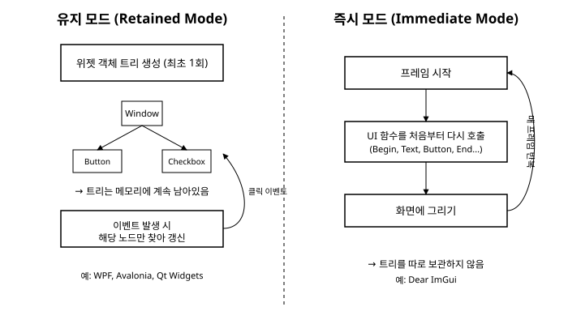

# 1장. ImGui란 무엇인가

[◀ 이전: 목차](00-목차.md) | [📖 목차](00-목차.md) | [다음: 2장. 개발 환경 설정과 첫 창 ▶](ch02-개발환경설정과첫창.md)


게임을 개발하다 보면 이런 순간이 옵니다. 캐릭터의 이동 속도, 카메라 시야각, 조명의 색상값 같은 것을 코드를 고치고 다시 컴파일하지 않고 그 자리에서 슬라이더로 조절해 보고 싶어지는 순간입니다. 혹은 물리 엔진을 디버깅하다가 충돌 박스가 실제로 어디에 그려지고 있는지, 프레임마다 몇 개의 드로우 콜이 발생하는지 화면 한구석에 숫자로 띄워 보고 싶어지기도 합니다. 이런 요구에 답하기 위해 태어난 라이브러리가 바로 이 책에서 다룰 **Dear ImGui**입니다.

Dear ImGui는 Omar Cornut가 개발을 시작한 오픈소스 C++ GUI 라이브러리로, 정식 명칭은 "Dear ImGui"이지만 흔히 줄여서 ImGui라고 부릅니다. 이름에 들어있는 "IM"이 바로 이 라이브러리의 정체성을 설명하는 단어인 **즉시 모드(Immediate Mode)**입니다. 이번 장에서는 즉시 모드가 정확히 무엇이고, 우리가 지금까지 알고 있던 GUI 프레임워크와 어떻게 다른지, 그리고 이 방식이 왜 게임 개발과 툴 제작 분야에서 특히 사랑받는지를 살펴봅니다.

## 유지 모드 GUI: 우리에게 익숙한 방식

Windows Forms, WPF, Avalonia, Qt Widgets, 웹의 DOM까지, 우리가 흔히 접해온 대부분의 GUI 프레임워크는 **유지 모드(Retained Mode)** 방식으로 동작합니다. 유지 모드에서는 화면에 보일 위젯 하나하나가 실제 객체로 만들어지고, 그 객체들은 부모-자식 관계로 얽힌 트리 구조를 이루며 메모리 위에 계속 살아있습니다.

버튼 하나를 만드는 상황을 생각해 봅시다. WPF라면 XAML 마크업으로 `<Button Content="저장"/>`을 선언하거나, 코드에서 `new Button()` 객체를 만들어 부모 패널에 자식으로 추가합니다. 이렇게 한 번 만들어진 `Button` 객체는 그 창이 닫힐 때까지 메모리에 남아 있습니다. 사용자가 버튼을 클릭하면 프레임워크는 "어느 객체가 클릭되었는가"를 판단해서 그 객체에 연결된 클릭 이벤트 핸들러를 호출합니다. 버튼의 글자를 바꾸고 싶다면 그 객체의 `Content` 속성을 직접 바꿔주면 되고, 화면을 다시 그리는 일은 프레임워크가 알아서 처리합니다.

이 방식의 핵심은 "한 번 만들고, 필요할 때마다 그 객체를 찾아가서 갱신한다"는 점입니다. 위젯 트리는 프로그램이 직접 손으로 만든 자료구조이고, 화면 갱신은 그 트리에 발생한 변경 사항을 프레임워크가 감지해서 처리하는 이벤트 기반 흐름을 따릅니다. 이 구조는 복잡한 애플리케이션의 UI를 체계적으로 관리하기에 유리하지만, 그만큼 위젯 객체의 생성과 해제, 이벤트 바인딩, 데이터와 화면 상태의 동기화 같은 관리 부담이 따라옵니다.

## 즉시 모드 GUI: ImGui의 방식

즉시 모드는 이와 정반대의 발상에서 출발합니다. **위젯 객체를 아예 만들어 보관하지 않습니다.** 대신 화면이 갱신되는 매 프레임마다, "지금 이 화면에 이런 위젯을 그려라"라고 명령하는 함수를 처음부터 다시 호출합니다.

말로만 들으면 다소 낯설게 느껴질 수 있으니 코드로 살펴보겠습니다.

```cpp
if (ImGui::Button("저장")) {
    save_file();
}
```

이 한 줄이 하는 일은 "여기에 '저장'이라는 라벨을 가진 버튼을 그려라. 그리고 이번 프레임에 사용자가 이 버튼을 클릭했다면 true를 돌려달라"는 요청입니다. 여기에는 `Button` 클래스도, 클릭 이벤트를 받아 처리하는 핸들러 등록 코드도 없습니다. `ImGui::Button()`은 호출되는 그 순간 버튼을 화면에 그리는 명령을 그려야 할 목록에 추가하고, 동시에 이번 프레임에 클릭이 일어났는지를 곧바로 `bool` 값으로 반환합니다. 이 함수가 반환되고 나면 "버튼이라는 객체"는 어디에도 남아있지 않습니다.

그런데 화면은 1초에 수십 번씩 다시 그려집니다. 즉시 모드는 이 매 프레임마다 위와 같은 UI 코드를 처음부터 끝까지 다시 실행합니다. 창을 그리고 싶다면 프레임마다 `ImGui::Begin()`을 다시 호출하고, 텍스트를 보이고 싶다면 프레임마다 `ImGui::Text()`를 다시 호출하는 식입니다. 마치 매 순간 캔버스를 깨끗이 지우고 처음부터 그림을 다시 그리는 것과 비슷합니다. 다만 실제로는 화면 전체를 매번 새로 칠하는 것이 아니라, "이번 프레임에 그려야 할 도형과 텍스트의 목록"을 매 프레임 새로 구성하고 그 목록을 그래픽 API에 넘기는 방식으로 동작합니다.

이렇게 프레임마다 UI 코드를 다시 실행하다 보니, "위젯이 지금 어떤 상태였는지"를 별도의 객체에 저장해 둘 필요가 사라집니다. 버튼이 눌렸는지 여부는 함수가 호출되는 그 순간 바로 알려주기 때문입니다. 위젯의 상태를 누가, 어떻게 들고 있는지에 대한 이야기는 잠시 후에 조금 더 자세히 다루겠습니다.

아래 그림은 두 방식의 개념적인 차이를 정리한 것입니다. 유지 모드는 트리를 한 번 만든 뒤 이벤트로 그 트리의 일부를 갱신하는 반면, 즉시 모드는 매 프레임 UI 함수 호출 자체를 처음부터 반복합니다.



## Dear ImGui의 특징

즉시 모드라는 개념 자체는 Dear ImGui 이전부터 그래픽 프로그래밍 분야에서 논의되어 왔지만, Dear ImGui는 이 개념을 실용적인 라이브러리로 완성도 있게 구현해 널리 퍼뜨린 대표 주자입니다. Dear ImGui를 다른 GUI 도구들과 구분 짓는 특징을 몇 가지로 정리해 보겠습니다.

**리소스 파일이 없습니다.** WPF의 XAML, 안드로이드의 XML 레이아웃, Qt의 `.ui` 파일처럼 UI의 구조를 별도의 마크업 파일로 선언하고 이를 코드와 연결하는 GUI 프레임워크가 많습니다. 이 방식은 디자이너와 개발자의 협업에는 유리하지만, 별도의 파일 포맷을 배우고 코드와 마크업 사이를 오가며 디버깅해야 하는 부담이 생깁니다. Dear ImGui는 이런 리소스 파일이 전혀 없습니다. UI는 처음부터 끝까지 C++ 함수 호출로만 기술되며, 이는 곧 UI를 만드는 논리가 프로그램의 나머지 로직과 똑같은 언어, 똑같은 컴파일 단위 안에 있다는 뜻입니다.

**가볍고 빠릅니다.** 위젯 객체를 만들고 트리로 관리하는 부담이 없다 보니, Dear ImGui는 메모리 사용량과 실행 속도 면에서 매우 가볍게 동작하도록 설계되어 있습니다. 라이브러리 자체도 외부 의존성이 거의 없는 십여 개의 소스 파일로 이루어져 있어서, 별도의 설치 절차 없이 프로젝트에 파일 몇 개를 끼워 넣는 것만으로 사용을 시작할 수 있습니다. 이 부분은 2장에서 실제로 손으로 확인해 보겠습니다.

**개발 도구와 디버그 UI 제작에 널리 쓰입니다.** 이 책의 도입부에서 예로 든 것처럼, 게임이나 실시간 그래픽 애플리케이션을 개발하는 과정에서는 "지금 당장 이 값을 조절하고 그 결과를 눈으로 확인하고 싶다"는 요구가 끊임없이 발생합니다. 이런 상황에서는 정교하게 디자인된 UI보다 빠르게 만들고 빠르게 고칠 수 있는 UI가 더 큰 가치를 가집니다. 이런 이유로 Dear ImGui는 여러 상용 게임 엔진의 에디터, 그래픽 디버깅 도구, 게임 내 개발자 콘솔 등에서 폭넓게 채택되어 실무에서 검증된 라이브러리입니다. 물론 게임 개발에만 국한되지 않고, 프로토타입 제작이나 내부용 데이터 시각화 도구처럼 "빠르게 만들어 빠르게 쓰고 버리는" 성격의 애플리케이션 전반에 잘 어울립니다.

## 즉시 모드는 상태를 어떻게 다루는가

즉시 모드가 위젯 객체를 보관하지 않는다면, 체크박스가 체크되어 있는지, 슬라이더가 지금 몇 값을 가리키고 있는지 같은 정보는 대체 어디에 저장되는 것일까요? 답은 간단합니다. **그 값은 여러분의 프로그램 코드가 직접 들고 있습니다.** Dear ImGui의 위젯 함수는 그 값을 담을 변수의 주소를 포인터로 넘겨받아서, 함수가 호출되는 시점에 사용자의 입력이 있었다면 그 포인터가 가리키는 변수를 즉시 바꿔 씁니다.

```cpp
static bool show_grid = true;
static float zoom_level = 1.0f;

ImGui::Checkbox("격자 표시", &show_grid);
ImGui::SliderFloat("확대 비율", &zoom_level, 0.1f, 5.0f);
```

`ImGui::Checkbox()`는 `show_grid` 변수의 주소를 받아서, 사용자가 체크박스를 클릭하면 그 자리에서 `show_grid` 값을 뒤집어 버립니다. `ImGui::SliderFloat()` 역시 `zoom_level`의 주소를 받아서 사용자가 슬라이더를 드래그하는 동안 그 값을 실시간으로 갱신합니다. 두 함수 모두 값이 바뀌었는지를 `bool` 반환값으로도 알려주기 때문에, "값이 바뀐 그 프레임에만 실행할 로직"을 `if (ImGui::SliderFloat(...)) { ... }`처럼 자연스럽게 작성할 수 있습니다.

정리하면, 유지 모드에서는 위젯 객체 자신이 상태를 들고 있고 우리는 그 객체를 통해 상태에 접근하는 반면, 즉시 모드에서는 상태를 담을 변수를 우리가 직접 준비하고 위젯 함수는 그 변수를 그때그때 읽고 쓰는 역할만 담당합니다. 이 차이는 사소해 보이지만 UI 코드를 설계하는 방식 전반에 영향을 미치는 중요한 개념입니다. 특히 여러 프레임에 걸쳐 유지되어야 하는 상태(어떤 트리 노드가 펼쳐져 있는지, 어떤 탭이 선택되어 있는지 등)를 누가 어디에 보관해야 하는지는 실전에서 자주 부딪히는 문제입니다. 이 내용은 3장에서 즉시 모드의 핵심 개념을 다루면서, 그리고 14장 상태 관리 패턴에서 더 체계적으로 다룰 것입니다.

## 이 책에서 다룰 내용

이 책은 Dear ImGui를 처음 접하는 독자가 개발 환경을 갖추는 것부터 시작해서, 실제로 동작하는 설정 에디터를 완성하기까지의 여정을 담고 있습니다. 2장에서는 GLFW와 OpenGL3 백엔드를 이용해 여러분의 컴퓨터 화면에 첫 ImGui 창을 띄워 보고, 3장에서는 이번 장에서 예고한 즉시 모드의 상태 관리 원리를 ID 스택이라는 개념과 함께 더 깊이 파고듭니다. 이어지는 4장부터 9장까지는 버튼, 슬라이더, 트리, 테이블, 팝업 등 실무에서 자주 쓰이는 위젯들을 하나씩 익히고, 10장부터는 도킹, 커스텀 렌더링, 스타일링, 입력 처리, 상태 관리, 데이터 시각화, 다양한 렌더링 백엔드, 성능 최적화라는 조금 더 심화된 주제로 나아갑니다. 마지막 18장에서는 그동안 익힌 내용을 모두 모아 하나의 완결된 설정 에디터 프로그램을 만들어 봅니다.

즉시 모드라는 낯선 개념도, 일단 손으로 직접 창을 하나 띄워 보고 나면 생각보다 훨씬 직관적으로 다가올 것입니다. 다음 장에서 바로 그 첫 창을 함께 만들어 보겠습니다.

## 요약

- 유지 모드 GUI(WPF, Avalonia, Qt Widgets 등)는 위젯을 객체로 만들어 트리 구조로 유지하고, 이벤트가 발생하면 해당 객체를 찾아 갱신하는 방식으로 동작합니다.
- 즉시 모드 GUI는 위젯 객체를 따로 보관하지 않고, 매 프레임마다 위젯을 그리라는 함수를 처음부터 다시 호출합니다. Dear ImGui는 이 즉시 모드 방식을 구현한 대표적인 C++ GUI 라이브러리입니다.
- Dear ImGui는 XAML이나 XML 같은 별도의 리소스 파일 없이 순수 C++ 코드만으로 UI를 기술하며, 가볍고 빠르게 동작하도록 설계되어 여러 게임 엔진과 개발 도구의 디버그 UI로 널리 채택되었습니다.
- 즉시 모드에서는 위젯의 상태(체크 여부, 슬라이더 값 등)를 위젯 객체가 아니라 프로그램이 직접 들고 있는 변수가 저장하며, 위젯 함수는 포인터를 통해 그 변수를 그 자리에서 읽고 씁니다. 이 원리는 3장에서 더 자세히 다룹니다.

## 연습문제

1. 유지 모드 GUI와 즉시 모드 GUI의 차이를 "위젯 객체를 보관하는가"라는 관점에서 자신의 말로 설명해 보세요.
2. `ImGui::Checkbox("옵션", &option_enabled)`를 호출했을 때, `option_enabled` 값은 누가 어느 시점에 바꾸는지 설명해 보세요.
3. 즉시 모드 GUI가 게임 엔진의 디버그 UI나 개발 도구 제작에 특히 잘 어울리는 이유를 두 가지 이상 들어보세요.
4. 여러분이 알고 있는 유지 모드 GUI 프레임워크(WPF, Qt, Android, 웹 DOM 등)를 하나 떠올려서, 버튼 하나를 만드는 코드가 Dear ImGui의 `ImGui::Button()` 호출과 어떻게 다른지 비교해 보세요.
5. 즉시 모드 방식에서 "여러 프레임에 걸쳐 유지되어야 하는 상태"는 왜 문제가 될 수 있을지 생각해 보세요. (힌트: 위젯 함수가 반환된 후에는 아무것도 남지 않습니다.)

---

[◀ 이전: 목차](00-목차.md) | [📖 목차](00-목차.md) | [다음: 2장. 개발 환경 설정과 첫 창 ▶](ch02-개발환경설정과첫창.md)
