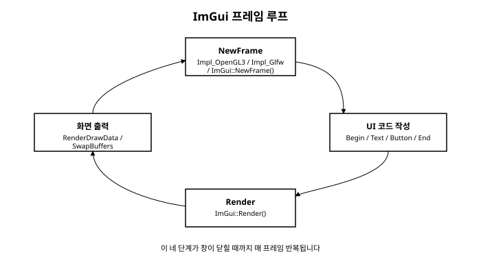

# 2장. 개발 환경 설정과 첫 창

[◀ 이전: 1장. ImGui란 무엇인가](ch01-ImGui란무엇인가.md) | [📖 목차](00-목차.md) | [다음: 3장. Immediate Mode의 핵심 개념 ▶](ch03-ImmediateMode의핵심개념.md)


1장에서 Dear ImGui가 즉시 모드 방식으로 동작하는 가벼운 C++ GUI 라이브러리라는 것을 이론으로 살펴보았다면, 이번 장에서는 실제로 손을 움직여 여러분의 화면에 첫 ImGui 창을 띄워 보겠습니다. 이 과정에서 Dear ImGui를 프로젝트에 가져오는 방법, ImGui가 화면에 무언가를 그리기 위해 필요로 하는 구성 요소들, 그리고 매 프레임 반복되는 초기화-루프-종료의 구조를 순서대로 익힙니다.

## Dear ImGui를 프로젝트에 포함하는 두 가지 방법

Dear ImGui는 별도의 복잡한 빌드 시스템을 요구하지 않는 라이브러리로 유명합니다. GitHub 저장소(https://github.com/ocornut/imgui)를 내려받아 보면 `imgui.h`, `imgui.cpp`, `imgui_draw.cpp`, `imgui_widgets.cpp`, `imgui_tables.cpp`, `imgui_demo.cpp` 같은 소스 파일 몇 개가 저장소 루트에 그대로 놓여 있는 것을 볼 수 있습니다. 여기에 더해 특정 창 관리 라이브러리나 그래픽 API와 ImGui를 연결해 주는 백엔드 파일들이 `backends/` 폴더 안에 별도로 준비되어 있습니다.

가장 널리 쓰이는 방법은 이 소스 파일들을 통째로 여러분의 프로젝트 폴더 안에 복사해 넣고, 여러분이 사용하는 빌드 시스템(CMake, Visual Studio 프로젝트 등)의 소스 목록에 그대로 추가하는 것입니다. 별도의 라이브러리 빌드나 링크 설정 없이, 그냥 `.cpp` 파일 몇 개가 늘어나는 것뿐이라고 생각하면 됩니다. 이 방식은 라이브러리 버전을 프로젝트 안에 고정해 두고 필요하면 소스를 직접 들여다보거나 수정할 수 있다는 장점이 있어서, ImGui 커뮤니티에서는 여전히 가장 흔한 방식으로 통합니다.

만약 여러분이 이미 vcpkg로 C++ 라이브러리를 관리하는 데 익숙하다면, vcpkg를 통해 Dear ImGui를 설치하는 방법도 있습니다.

```bash
vcpkg install imgui[glfw-binding,opengl3-binding]
```

여기서 대괄호 안의 `glfw-binding`과 `opengl3-binding`은 vcpkg의 **기능(feature)** 옵션으로, ImGui 코어뿐 아니라 이번 장에서 사용할 GLFW 백엔드와 OpenGL3 렌더러 백엔드까지 함께 설치해 달라는 지정입니다. vcpkg의 classic 모드와 manifest 모드, `find_package`를 이용한 CMake 연동에 대해서는 다른 책에서 이미 자세히 다루었으므로 여기서는 넘어가지만, 요점은 같습니다. vcpkg가 소스를 내려받아 컴파일해 두면, 여러분은 `CMakeLists.txt`에서 `find_package(imgui CONFIG REQUIRED)`로 그 결과물을 찾아 연결하기만 하면 됩니다. 이 책의 예제 코드는 소스를 직접 포함하는 방식이든 vcpkg를 이용하는 방식이든 동일하게 동작하므로, 편한 방법을 선택하면 됩니다.

## ImGui를 이루는 세 가지 역할

Dear ImGui로 창 하나를 띄우려면 사실 세 가지 서로 다른 역할을 하는 구성 요소가 함께 필요합니다. 이 역할을 구분해서 이해하지 않으면 왜 헤더 파일을 세 종류나 include해야 하는지, 왜 초기화 함수를 세 번이나 호출해야 하는지가 헷갈리기 쉽습니다.

**첫째, ImGui 코어**입니다. `imgui.h`를 include하면 사용할 수 있는 `ImGui::Begin()`, `ImGui::Text()`, `ImGui::Button()` 같은 함수들이 여기에 해당합니다. 코어는 위젯의 배치를 계산하고, 사용자의 입력을 해석하고, "이번 프레임에 그려야 할 도형과 글자의 목록"을 만들어내는 일을 담당합니다. 그런데 코어 자신은 실제 운영체제 창을 여는 방법도, 마우스나 키보드 입력을 운영체제로부터 받아오는 방법도, 그래픽 카드에 그림을 그리는 방법도 전혀 알지 못합니다. 코어는 철저히 플랫폼과 무관하게(platform-agnostic) 설계되어 있습니다.

**둘째, 플랫폼 백엔드**입니다. 창을 만들고, 마우스와 키보드 입력을 감지해서 ImGui 코어에 전달하는 역할을 맡습니다. 이 책에서는 크로스 플랫폼 창 관리 라이브러리인 **GLFW**를 사용하며, `backends/imgui_impl_glfw.h`를 include해서 이 역할을 담당하는 함수들을 가져옵니다. GLFW 대신 SDL이나 Win32 API를 직접 사용하는 백엔드도 Dear ImGui 저장소에 함께 제공되며, 이 내용은 16장 다양한 렌더링 백엔드에서 더 폭넓게 다룹니다.

**셋째, 렌더러 백엔드**입니다. ImGui 코어가 만들어낸 "그려야 할 도형과 글자의 목록"을 실제로 화면에 그리는 역할을 맡습니다. 이 책에서는 **OpenGL3**를 사용하며, `backends/imgui_impl_opengl3.h`를 include합니다. 렌더러 백엔드는 정점 버퍼를 만들고, 텍스처를 업로드하고, 실제 그리기 명령을 그래픽 API에 넘기는 저수준 작업을 대신 처리해 줍니다.

정리하면 "코어가 UI 로직을 계산하고, 플랫폼 백엔드가 창과 입력을 담당하고, 렌더러 백엔드가 실제 그리기를 담당한다"는 역할 분담이 Dear ImGui 구조의 핵심입니다. 이 세 역할이 분리되어 있기 때문에 같은 UI 코드를 GLFW+OpenGL3 조합에서도, SDL+Vulkan 조합에서도 거의 그대로 재사용할 수 있는 것입니다.

## 초기화 순서

세 구성 요소를 실제로 준비하는 순서는 다음과 같습니다. 이 순서는 뒤바뀌면 안 되는 의존 관계를 가지고 있으므로 그대로 기억해 두는 것이 좋습니다.

1. **GLFW 윈도우 생성**: ImGui보다 먼저, 그림을 그릴 실제 운영체제 창과 OpenGL 컨텍스트를 준비합니다.
2. **`ImGui::CreateContext()`**: ImGui가 내부적으로 사용할 상태를 담을 컨텍스트를 만듭니다. 이후의 모든 ImGui 함수 호출은 이 컨텍스트를 전제로 동작합니다.
3. **`ImGui::StyleColorsDark()`**: 위젯의 색상 테마를 어두운 기본 테마로 설정합니다. 스타일과 테마는 12장에서 자세히 다룹니다.
4. **`ImGui_ImplGlfw_InitForOpenGL(window, true)`**: 플랫폼 백엔드를 초기화하면서, 앞서 만든 GLFW 창을 ImGui와 연결합니다. 두 번째 인자 `true`는 GLFW의 콜백 함수들을 ImGui가 자동으로 설치하도록 지정하는 옵션입니다.
5. **`ImGui_ImplOpenGL3_Init("#version 130")`**: 렌더러 백엔드를 초기화합니다. 문자열 인자는 사용할 GLSL 셰이더 버전을 지정합니다.

이 순서가 왜 중요한지 짚어보면, GLFW 창이 먼저 있어야 그 창을 ImGui 플랫폼 백엔드에 넘겨줄 수 있고, `CreateContext()`로 컨텍스트가 먼저 만들어져 있어야 그 이후의 스타일 설정이나 백엔드 초기화 함수들이 "어느 컨텍스트에 대해 작업할지"를 알 수 있습니다.

## 메인 루프 구조

초기화가 끝나면 프로그램은 창이 닫힐 때까지 반복되는 메인 루프에 들어갑니다. 이 루프 안에서 매 프레임 실행되는 흐름은 크게 네 단계로 나뉩니다.

1. **새 프레임 시작**: `ImGui_ImplOpenGL3_NewFrame()`, `ImGui_ImplGlfw_NewFrame()`, `ImGui::NewFrame()` 세 함수를 순서대로 호출합니다. 각 백엔드가 이번 프레임을 위한 준비(창 크기 갱신, 입력 상태 갱신 등)를 마친 뒤에 ImGui 코어가 새 프레임을 시작하는 순서입니다.
2. **UI 코드 작성**: `ImGui::Begin()`으로 창을 열고, `ImGui::Text()`나 `ImGui::Button()` 같은 위젯 함수를 호출한 뒤 `ImGui::End()`로 창을 닫습니다. 1장에서 설명했듯, 이 코드는 매 프레임 처음부터 다시 실행됩니다.
3. **`ImGui::Render()`**: 지금까지 호출된 위젯 함수들을 바탕으로 "그려야 할 도형과 글자의 목록"을 확정합니다. 이 시점까지는 실제로 화면에 아무것도 그려지지 않습니다.
4. **백엔드 렌더 및 버퍼 교체**: `ImGui_ImplOpenGL3_RenderDrawData(ImGui::GetDrawData())`를 호출해서 확정된 목록을 실제로 화면에 그리고, GLFW의 `glfwSwapBuffers()`로 화면에 최종 결과를 표시합니다.

이 네 단계가 창이 닫힐 때까지 초당 수십 번씩 반복됩니다. 아래 그림은 이 순환 구조를 정리한 것입니다.



## Hello, ImGui!

지금까지 설명한 내용을 하나의 완결된 프로그램으로 묶어 보겠습니다. 창 하나를 띄우고 그 안에 텍스트 한 줄을 표시하는, 이 책의 첫 실행 가능한 예제입니다.

```cpp
#include <GLFW/glfw3.h>
#include "imgui.h"
#include "backends/imgui_impl_glfw.h"
#include "backends/imgui_impl_opengl3.h"

int main() {
    // 1. GLFW 초기화 및 윈도우 생성
    if (!glfwInit()) {
        return -1;
    }

    GLFWwindow* window = glfwCreateWindow(1280, 720, "Hello, ImGui!", nullptr, nullptr);
    if (window == nullptr) {
        return -1;
    }
    glfwMakeContextCurrent(window);
    glfwSwapInterval(1); // 수직 동기화 활성화

    // 2. ImGui 컨텍스트 생성 및 스타일 설정
    ImGui::CreateContext();
    ImGui::StyleColorsDark();

    // 3. 플랫폼 백엔드와 렌더러 백엔드 초기화
    ImGui_ImplGlfw_InitForOpenGL(window, true);
    ImGui_ImplOpenGL3_Init("#version 130");

    // 4. 메인 루프
    while (!glfwWindowShouldClose(window)) {
        glfwPollEvents();

        // 새 프레임 시작
        ImGui_ImplOpenGL3_NewFrame();
        ImGui_ImplGlfw_NewFrame();
        ImGui::NewFrame();

        // UI 코드 작성
        ImGui::Begin("첫 번째 창");
        ImGui::Text("Hello, ImGui!");
        ImGui::End();

        // 렌더링 확정
        ImGui::Render();

        int display_w, display_h;
        glfwGetFramebufferSize(window, &display_w, &display_h);
        glViewport(0, 0, display_w, display_h);
        glClearColor(0.1f, 0.1f, 0.1f, 1.0f);
        glClear(GL_COLOR_BUFFER_BIT);

        ImGui_ImplOpenGL3_RenderDrawData(ImGui::GetDrawData());

        glfwSwapBuffers(window);
    }

    // 5. 종료 처리
    ImGui_ImplOpenGL3_Shutdown();
    ImGui_ImplGlfw_Shutdown();
    ImGui::DestroyContext();

    glfwDestroyWindow(window);
    glfwTerminate();

    return 0;
}
```

이 코드를 빌드하고 실행하면 짙은 회색 배경 위에 "첫 번째 창"이라는 제목을 가진 작은 창이 뜨고, 그 안에 "Hello, ImGui!"라는 문구가 표시됩니다. 창을 마우스로 드래그해서 옮겨보거나 모서리를 잡고 크기를 조절해 보세요. 별도의 코드를 추가하지 않았는데도 창의 이동과 크기 조절이 자연스럽게 동작하는 것을 볼 수 있는데, 이는 `ImGui::Begin()`이 만드는 창이 기본적으로 이런 조작을 지원하도록 구현되어 있기 때문입니다. 이 창의 세부 옵션들은 5장 창과 레이아웃에서 자세히 다룹니다.

종료 처리 부분도 눈여겨볼 필요가 있습니다. 초기화의 역순으로 `ImGui_ImplOpenGL3_Shutdown()`, `ImGui_ImplGlfw_Shutdown()`, `ImGui::DestroyContext()`를 호출해서 각 구성 요소가 사용한 자원을 정리합니다. 초기화할 때 코어보다 백엔드가 나중에 준비되었으니, 정리할 때는 반대로 백엔드를 먼저 정리하고 코어를 마지막에 정리하는 순서를 지키는 것이 안전합니다.

## 요약

- Dear ImGui는 소스 파일을 프로젝트에 직접 포함시키는 방식이 가장 흔하지만, `vcpkg install imgui[glfw-binding,opengl3-binding]`처럼 vcpkg로도 필요한 백엔드까지 함께 설치할 수 있습니다.
- Dear ImGui를 동작시키려면 세 가지 역할이 필요합니다. UI 로직을 계산하는 **코어**, 창과 입력을 담당하는 **플랫폼 백엔드**(이 책에서는 GLFW), 실제로 화면에 그리는 **렌더러 백엔드**(이 책에서는 OpenGL3)입니다.
- 초기화는 GLFW 윈도우 생성 → `ImGui::CreateContext()` → `ImGui::StyleColorsDark()` → `ImGui_ImplGlfw_InitForOpenGL()` → `ImGui_ImplOpenGL3_Init()` 순서로 진행합니다.
- 메인 루프는 매 프레임 새 프레임 시작(`NewFrame` 3종) → UI 코드 작성(`Begin`/`Text`/`End` 등) → `ImGui::Render()` → 백엔드 렌더링 및 버퍼 교체의 네 단계를 반복합니다.
- 종료 시에는 초기화의 역순으로 백엔드와 컨텍스트를 정리해야 합니다.

## 연습문제

1. Dear ImGui의 코어, 플랫폼 백엔드, 렌더러 백엔드가 각각 어떤 역할을 담당하는지 한 문장씩으로 설명해 보세요.
2. 초기화 과정에서 `ImGui::CreateContext()`가 `ImGui_ImplGlfw_InitForOpenGL()`보다 먼저 호출되어야 하는 이유를 설명해 보세요.
3. 메인 루프의 네 단계(새 프레임 시작, UI 코드 작성, Render, 화면 출력) 중 실제로 화면에 그림이 그려지는 단계는 어디부터인지 짚어보세요.
4. 이번 장의 "Hello, ImGui!" 예제에서 `ImGui::Text("Hello, ImGui!")` 다음 줄에 `ImGui::Button("클릭")`을 추가해 보고, 정상적으로 버튼이 표시되는지 확인해 보세요.
5. 종료 처리 코드에서 `ImGui_ImplOpenGL3_Shutdown()`과 `ImGui::DestroyContext()`의 호출 순서를 바꾸면 어떤 문제가 생길 수 있을지 추론해 보세요.

---

[◀ 이전: 1장. ImGui란 무엇인가](ch01-ImGui란무엇인가.md) | [📖 목차](00-목차.md) | [다음: 3장. Immediate Mode의 핵심 개념 ▶](ch03-ImmediateMode의핵심개념.md)
