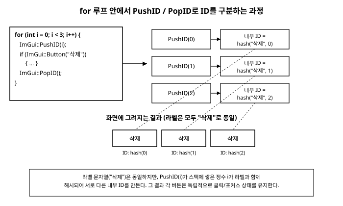

# 3장. Immediate Mode의 핵심 개념

[◀ 이전: 2장. 개발 환경 설정과 첫 창](ch02-개발환경설정과첫창.md) | [📖 목차](00-목차.md) | [다음: 4장. 기본 위젯 ▶](ch04-기본위젯.md)


1장에서 우리는 Dear ImGui가 "즉시 모드(Immediate Mode)"라는 방식으로 동작한다고 이야기했습니다. 위젯을 화면에 미리 만들어두고 이벤트가 올 때까지 기다리는 대신, 매 프레임마다 위젯을 다시 호출해서 그 자리에서 그리고 그 자리에서 값을 주고받는다는 것이었습니다. 이번 장에서는 그 말이 코드 수준에서 정확히 무엇을 의미하는지 하나씩 짚어보겠습니다.

이 장을 다 읽고 나면 다음 세 가지를 분명히 설명할 수 있어야 합니다.

- 위젯 함수에 변수의 주소를 넘긴다는 것이 실제로 어떤 일을 하는가
- 버튼처럼 "이벤트"를 반환하는 위젯과 슬라이더처럼 "값"을 유지하는 위젯이 왜 다르게 동작하는가
- ImGui가 화면에 그려진 수많은 위젯 중 하나를 어떻게 구분해내는가 (ID 시스템)

이 세 가지는 이후 모든 장에서 계속 마주치게 될 개념이므로, 여기서 확실히 이해하고 넘어가는 것이 중요합니다.

## 3.1 위젯은 그 자리에서 상태를 읽고 쓴다

가장 간단한 예로 체크박스를 살펴보겠습니다.

```cpp
static bool show_grid = true;

// 매 프레임 호출되는 UI 코드 안에서
ImGui::Checkbox("격자 표시", &show_grid);
```

`ImGui::Checkbox()`는 리턴값으로 `bool`을 돌려주기도 하지만, 여기서 진짜 주목해야 할 부분은 두 번째 인자입니다. `show_grid`라는 변수 자체가 아니라 `&show_grid`, 즉 그 변수의 **주소**를 넘기고 있습니다.

`Checkbox` 함수 내부에서는 대략 다음과 같은 일이 벌어집니다.

1. 지금 이 체크박스가 그려질 위치에 사각형과 (필요하다면) 체크 표시를 그린다. 체크 표시를 그릴지 말지는 `*show_grid`, 즉 포인터가 가리키는 현재 값을 즉시 읽어서 결정한다.
2. 이번 프레임에 사용자가 이 사각형 영역을 마우스로 클릭했는지 검사한다.
3. 클릭했다면 `*show_grid = !*show_grid;`처럼 포인터를 통해 호출자의 변수를 직접 뒤집어버린다.
4. 값이 바뀌었으면 `true`를, 바뀌지 않았으면 `false`를 함수의 리턴값으로 돌려준다.

즉 `ImGui::Checkbox("격자 표시", &show_grid);` 한 줄은 "체크박스를 그려줘"라는 요청이 아니라, "지금 이 순간 `show_grid`가 무엇인지 보여주고, 사용자가 클릭했다면 지금 이 순간 `show_grid`를 바꿔줘"라는 요청에 가깝습니다. 그리기와 입력 처리와 상태 갱신이 함수 호출 한 번 안에서 전부 끝납니다.

이것이 "리테인 모드(Retain Mode)" GUI 툴킷과 가장 크게 다른 지점입니다. 리테인 모드에서는 체크박스 객체를 한 번 만들어두고, 그 객체가 자기 상태(체크되었는지 여부)를 내부에 계속 들고 있습니다. 애플리케이션은 "체크박스 객체의 상태가 바뀌었다"는 이벤트를 나중에 콜백으로 전달받아야 합니다. 반면 ImGui에는 체크박스 "객체"라는 것이 애초에 존재하지 않습니다. 매 프레임 `Checkbox()`라는 함수를 호출할 뿐이고, 그 함수는 여러분이 건네준 `bool` 변수를 읽고 쓰는 일만 합니다.

이 사실은 다음과 같은 결론으로 이어집니다.

- `show_grid`를 코드의 다른 곳에서 바꾸면 (예를 들어 파일에서 설정을 읽어와서), 다음 프레임에 그려지는 체크박스는 자동으로 그 값을 반영합니다. 체크박스에게 "값이 바뀌었다"고 따로 알려줄 필요가 없습니다.
- 반대로 체크박스를 아예 그리지 않는 프레임이 있어도 `show_grid` 값은 그대로 남아 있습니다. 값은 여러분의 변수 안에 있는 것이지 ImGui 안에 있는 것이 아니기 때문입니다.

같은 원리가 슬라이더에도 그대로 적용됩니다.

```cpp
static float volume = 0.5f;

ImGui::SliderFloat("볼륨", &volume, 0.0f, 1.0f);
```

`SliderFloat`는 `volume` 포인터가 가리키는 현재 값을 이용해 슬라이더 핸들의 위치를 계산해서 그리고, 사용자가 핸들을 드래그하는 동안 마우스 위치를 다시 0.0~1.0 범위의 값으로 환산해서 `*volume`에 즉시 써넣습니다. 함수가 리턴되고 나면 `volume` 변수에는 이미 최신 값이 들어 있습니다.

## 3.2 "클릭되었는가"를 묻는 위젯 vs. "값"을 유지하는 위젯

체크박스와 슬라이더는 둘 다 "포인터를 넘기고 즉시 값을 갱신받는다"는 패턴을 따르지만, 버튼은 이와 조금 다르게 동작합니다.

```cpp
if (ImGui::Button("실행"))
{
    RunSimulation();
}
```

버튼에는 넘겨줄 상태 변수가 없습니다. 버튼 자체는 "눌린 채로 유지되는" 상태를 가질 필요가 없는 위젯이기 때문입니다. 대신 `Button()`은 딱 한 가지 질문에 대한 답만 `bool`로 돌려줍니다. "이번 프레임에 사용자가 이 버튼을 클릭해서 뗐는가?" 그렇다면 `true`를 한 프레임 동안만 반환하고, 그 다음 프레임부터는 다시 `false`를 반환합니다.

이 차이를 표로 정리하면 다음과 같습니다.

| 위젯 | 넘기는 것 | 함수가 하는 일 | 리턴값의 의미 |
|---|---|---|---|
| `Button` | (상태 없음) | 그리기 + 클릭 감지 | "이번 프레임에 클릭되어 눌림이 해제됐는가" (일회성 이벤트) |
| `Checkbox` | `bool*` | 그리기 + 클릭 시 `*v` 반전 | "이번 프레임에 값이 바뀌었는가" |
| `SliderFloat`/`SliderInt` | `float*`/`int*` | 그리기 + 드래그 중 `*v` 갱신 | "이번 프레임에 값이 바뀌었는가" |

즉 `Button`의 리턴값은 "사건(event)"이고, `Checkbox`나 `SliderFloat`의 리턴값은 부가 정보("값이 방금 바뀌었다는 알림")일 뿐 진짜 결과물은 포인터를 통해 넘겨받은 변수 안에 들어 있습니다. 이 둘을 혼동하면 다음과 같은 흔한 실수를 하게 됩니다.

```cpp
// 잘못된 예: Checkbox의 리턴값을 "현재 체크 상태"로 착각
static bool enabled = true;
if (ImGui::Checkbox("활성화", &enabled))
{
    // 이 블록은 "값이 바뀐 프레임"에만 실행된다.
    // enabled가 계속 true인 상태를 매 프레임 확인하고 싶다면
    // if 문이 아니라 그냥 아래에서 enabled 변수를 직접 검사해야 한다.
}

if (enabled)
{
    DrawSomething(); // 이렇게 별도로 검사해야 매 프레임 올바르게 동작한다.
}
```

`Checkbox`가 반환하는 `bool`은 "지금 체크되어 있는가"가 아니라 "방금 이 호출에서 값이 바뀌었는가"입니다. 현재 체크 여부는 어디까지나 `enabled` 변수 자체를 보고 판단해야 합니다. 이 구분은 언뜻 사소해 보이지만, Immediate Mode의 데이터 흐름을 정확히 이해하고 있는지 가늠하는 좋은 시험대이기도 합니다.

드래그 계열 위젯인 `DragFloat`, `DragInt`도 슬라이더와 동일한 패턴입니다. 클릭한 채로 마우스를 좌우로 움직이면 그 이동량만큼 값을 누적해서 포인터에 즉시 써넣습니다. 자세한 사용법은 4장에서 다룹니다.

## 3.3 ID 시스템: ImGui는 위젯을 어떻게 구분하는가

지금까지 예제에서는 위젯이 하나씩만 등장했지만, 실제 UI에서는 같은 라벨을 가진 위젯이 여러 개 필요한 경우가 자주 있습니다. 예를 들어 리스트의 각 항목마다 "삭제" 버튼을 하나씩 붙인다고 해봅시다.

```cpp
const char* items[] = { "사과", "바나나", "체리" };

for (int i = 0; i < 3; i++)
{
    ImGui::Text("%s", items[i]);
    ImGui::SameLine();
    if (ImGui::Button("삭제")) // 문제: 라벨이 모두 "삭제"로 동일하다
    {
        // ...
    }
}
```

ImGui는 위젯을 리테인 모드처럼 객체로 들고 있지 않지만, 그럼에도 불구하고 프레임과 프레임 사이에 "이 버튼이 지금 마우스 위에 올라가 있는지", "이 텍스트 입력창이 지금 포커스를 가지고 있는지" 같은 최소한의 정보는 내부적으로 기억해야 합니다. 이런 정보를 구분해서 저장하려면 각 위젯마다 고유한 식별자, 즉 **ID**가 필요합니다.

ImGui는 기본적으로 위젯의 라벨 문자열로부터 이 ID를 만듭니다. 그런데 위 코드처럼 라벨이 전부 "삭제"로 똑같다면, ImGui 입장에서는 세 개의 버튼을 서로 다른 위젯으로 구분할 방법이 없습니다. 실행해보면 세 버튼 중 하나만 반응하거나, 호버 상태가 이상하게 섞이는 등의 문제가 나타납니다. 이는 버그가 아니라, ID가 겹쳤을 때 나타나는 당연한 결과입니다.

### ID 스택이라는 개념

ImGui는 이 문제를 해결하기 위해 **ID 스택**이라는 개념을 사용합니다. 위젯의 최종 ID는 단순히 라벨 문자열 하나만으로 정해지는 것이 아니라, "현재 ID 스택에 쌓여 있는 값들 + 위젯의 라벨"을 모두 합쳐서 해시한 결과로 정해집니다. `ImGui::PushID()`로 스택에 값을 하나 쌓고 `ImGui::PopID()`로 그 값을 다시 빼는 방식으로, 코드 블록 단위로 "이 구간에서는 ID에 이 값을 더 섞어라"라고 지시할 수 있습니다.

앞의 반복문을 고쳐보겠습니다.

```cpp
for (int i = 0; i < 3; i++)
{
    ImGui::PushID(i);              // 스택에 i를 쌓는다
    ImGui::Text("%s", items[i]);
    ImGui::SameLine();
    if (ImGui::Button("삭제"))      // 실제 ID는 hash(i, "삭제")
    {
        // 이제 i번째 항목의 삭제 버튼만 정확히 반응한다
    }
    ImGui::PopID();                // 스택에서 i를 뺀다
}
```

`PushID(i)`는 정수, 문자열, 포인터 등 여러 타입을 받을 수 있는 오버로드를 제공합니다. 반복문의 인덱스를 넘기는 것이 가장 흔한 사용법이지만, 포인터 기반 아이디(예를 들어 각 항목을 가리키는 구조체의 주소)를 넘기는 것도 좋은 선택입니다.

이 과정을 그림으로 표현하면 다음과 같습니다.



화면에는 여전히 "삭제"라는 라벨이 세 번 나란히 보이지만, 내부적으로는 `PushID(0)`, `PushID(1)`, `PushID(2)`가 각각 서로 다른 값을 스택에 쌓기 때문에 세 버튼은 서로 완전히 독립적인 ID를 갖게 됩니다. 사용자 눈에는 라벨이 같은 버튼 세 개로 보이지만, ImGui 내부적으로는 명백히 구분되는 세 개의 위젯입니다.

### `##`을 이용한 숨김 ID

`PushID`/`PopID`는 반복문처럼 여러 위젯을 한 번에 감싸야 할 때 유용하지만, 위젯 하나의 라벨만 살짝 바꾸고 싶을 때는 더 간단한 방법이 있습니다. 라벨 문자열 안에 `##`을 넣으면, `##` 뒤에 오는 부분은 ID를 계산하는 데는 사용되지만 화면에는 표시되지 않습니다.

```cpp
static float pos_x = 0.0f, pos_y = 0.0f;

ImGui::Text("위치");
ImGui::SliderFloat("##pos_x", &pos_x, -100.0f, 100.0f); // 라벨이 보이지 않는다
ImGui::SameLine();
ImGui::SliderFloat("##pos_y", &pos_y, -100.0f, 100.0f);
```

이 예제에서 두 슬라이더는 화면에 아무 라벨도 보여주지 않지만(`##` 앞에 텍스트가 없으므로), ID는 각각 `"##pos_x"`, `"##pos_y"`로 서로 다릅니다. 반대로 화면에 보이는 라벨은 같게 유지하면서 ID만 다르게 하고 싶다면 다음처럼 씁니다.

```cpp
ImGui::Button("삭제##apple");
ImGui::Button("삭제##banana");
```

두 버튼 모두 화면에는 "삭제"라고만 표시되지만, 실제 ID는 각각 `"삭제##apple"`, `"삭제##banana"`이므로 완전히 다른 위젯으로 취급됩니다. 항목의 개수가 코드 작성 시점에 정해져 있어서 각 항목마다 의미 있는 이름을 직접 붙일 수 있을 때는 이 방식이 `PushID`보다 더 읽기 쉬운 경우가 많습니다. 반면 반복문으로 임의 개수의 항목을 순회할 때는 `PushID(i)` 쪽이 더 자연스럽습니다.

> 참고로 `##`과 비슷하게 생긴 `###`이라는 문법도 있습니다. `##`은 그 뒤의 문자열을 ID 계산에 포함시키는 반면, `###`은 그 뒤의 문자열만으로 ID를 고정해버리고 앞부분(화면에 보이는 텍스트)은 ID 계산에서 완전히 제외합니다. 예를 들어 창 제목이 상황에 따라 바뀌어도 같은 창으로 취급하고 싶을 때(`"진행 상황: 3/10###progress"`처럼) 유용하게 쓰입니다. 지금 단계에서는 `##`만 잘 익혀두어도 충분합니다.

### ID 스택은 자동으로도 쌓인다

사실 `PushID`/`PopID`를 직접 호출하지 않아도, `ImGui::TreeNode()`나 `ImGui::BeginChild()`처럼 계층 구조를 만드는 함수들은 내부적으로 이미 ID 스택에 값을 쌓았다가 대응하는 `TreePop()`, `EndChild()` 시점에 다시 빼는 방식으로 동작합니다. 그래서 서로 다른 트리 노드나 서로 다른 자식 창 안에서는 완전히 같은 라벨의 위젯을 마음 편히 사용해도 충돌이 나지 않습니다. 트리와 리스트에 대해서는 7장에서 더 자세히 다룹니다.

## 3.4 오해 바로잡기: 상태는 어디에 저장되는가

Immediate Mode를 처음 접할 때 가장 흔히 생기는 오해는 "매 프레임 다시 그린다니, 그럼 위젯의 상태(체크되었는지, 슬라이더 값이 얼마인지)는 매 프레임 사라졌다가 다시 생기는 것 아닌가?"라는 것입니다.

정답은 그렇지 않다는 것입니다. **ImGui는 여러분의 애플리케이션 데이터를 소유하지 않습니다.** `show_grid`, `volume` 같은 변수는 여러분의 프로그램이 선언하고 소유한 평범한 C++ 변수이며, 그 값은 함수 지역 변수라면 `static`으로, 클래스 멤버라면 객체가 살아있는 동안, 전역 변수라면 프로그램 종료까지 평범한 C++ 규칙에 따라 계속 유지됩니다. ImGui의 위젯 함수는 그저 매 프레임 그 변수의 값을 "잠깐 읽고 필요하면 잠깐 쓰는" 손님일 뿐입니다.

즉 그림으로 표현하면 다음과 같은 관계입니다.

```
[애플리케이션이 소유한 변수들]  <-- 계속 살아있음, 프레임과 무관
        ^        |
        |        v
   (쓰기)     (읽기)
        |        |
     ImGui::Checkbox(&show_grid) 같은 위젯 함수 호출
        (매 프레임 새로 호출되지만, 자기 자신은 값을 소유하지 않음)
```

"매 프레임 다시 그린다"는 말은 위젯을 그리는 **명령**을 매 프레임 다시 내린다는 뜻이지, 데이터를 매 프레임 새로 만든다는 뜻이 아닙니다. 오히려 반대로, 데이터가 애플리케이션 쪽에 안정적으로 존재하기 때문에 위젯 함수는 매 프레임 그 데이터를 그대로 다시 읽어서 그릴 수 있는 것입니다.

물론 ImGui가 정말로 아무 상태도 기억하지 않는 것은 아닙니다. 지금 어떤 위젯에 마우스가 올라가 있는지, 어떤 텍스트 입력창이 포커스를 가지고 있는지, 어떤 트리 노드가 펼쳐져 있는지 같은 "UI 자체의 상태"는 ImGui 내부의 컨텍스트(`ImGuiContext`)가 프레임 사이에 계속 들고 있습니다. 이것이 바로 앞서 살펴본 ID 시스템이 필요한 이유이기도 합니다. ImGui는 이 내부 상태를 위젯의 ID를 키로 삼아 저장해두었다가, 다음 프레임에 같은 ID를 가진 위젯이 다시 호출되면 그 상태를 이어서 사용합니다.

정리하면 상태는 두 종류로 나뉩니다.

- **애플리케이션 데이터** (체크박스가 켜져 있는지, 슬라이더 값이 얼마인지): 여러분의 코드가 선언하고 소유하며, ImGui는 포인터를 통해 읽고 쓸 뿐입니다.
- **UI 내부 상태** (호버 여부, 포커스, 트리 펼침 여부, 스크롤 위치 등): ImGui의 컨텍스트가 위젯 ID를 키로 삼아 내부적으로 관리합니다.

이 구분은 14장 "상태 관리 패턴"에서 다시 등장합니다. 프로그램이 커지면 "이 값을 지역 변수로 둘 것인가, 클래스 멤버로 둘 것인가, 아니면 별도의 애플리케이션 상태 구조체에 몰아넣을 것인가"를 고민하게 되는데, 그 고민의 출발점이 바로 지금 이 절에서 확인한 사실, 즉 "ImGui는 여러분의 데이터를 대신 들고 있어 주지 않는다"는 원칙입니다.

## 요약

- ImGui 위젯 함수는 변수의 포인터를 직접 받아 그 자리에서 값을 읽고(그리기 위해), 필요하면 그 자리에서 값을 씁니다(입력을 반영하기 위해). `ImGui::Checkbox("옵션", &v)`처럼 `&`를 붙여 주소를 넘기는 것은 바로 이 때문입니다.
- `Button()`처럼 자체 상태가 없는 위젯은 "이번 프레임에 클릭되었는가"라는 일회성 이벤트를 `bool`로 반환합니다. `Checkbox`, `SliderFloat` 등은 포인터로 넘긴 값을 직접 갱신하며, 리턴값은 어디까지나 "방금 값이 바뀌었는가"를 알려주는 부가 정보입니다.
- 같은 라벨의 위젯이 여러 개 있으면 ID가 충돌합니다. `ImGui::PushID()`/`ImGui::PopID()`로 반복문에서 각 위젯에 고유 ID를 부여하거나, 라벨에 `##숨김ID`를 붙여 화면 표시는 그대로 두고 내부 ID만 다르게 만들 수 있습니다.
- ImGui는 여러분의 애플리케이션 데이터를 소유하지 않습니다. 데이터는 여러분의 변수 안에 계속 존재하고, ImGui는 매 프레임 그것을 읽고 쓸 뿐입니다. 반면 호버, 포커스, 트리 펼침 여부 같은 UI 자체의 상태는 위젯 ID를 키로 ImGui 내부 컨텍스트가 관리합니다. 이 구분은 14장에서 더 깊이 다룹니다.

## 연습문제

1. `ImGui::Checkbox("표시", &visible)`를 호출할 때 두 번째 인자로 `visible`이 아니라 `&visible`을 넘겨야 하는 이유를 함수 내부에서 일어나는 일을 근거로 설명하세요.
2. 다음 코드는 의도한 대로 동작하지 않습니다. 무엇이 문제인지 찾고 고쳐보세요.

   ```cpp
   static bool paused = false;
   if (ImGui::Checkbox("일시정지", &paused))
   {
       UpdateSimulation(); // 매 프레임 시뮬레이션을 갱신하고 싶었다
   }
   ```

3. 문자열 배열 `names`에 담긴 N개의 이름 각각에 대해 "이름 출력 + 이름 옆에 같은 라벨의 SmallButton('편집')"을 그리는 반복문을 작성하세요. `PushID`/`PopID`를 사용해 각 버튼이 독립적으로 클릭되도록 만드세요.
4. `##`을 사용해서 화면에는 아무 라벨도 보이지 않지만 서로 다른 ID를 갖는 `InputText` 두 개를 나란히 배치하는 코드를 작성해보세요. 어떤 상황에서 `##` 방식이 `PushID`/`PopID` 방식보다 더 적합한지 설명하세요.
5. "ImGui는 상태를 저장하지 않는다"라는 문장은 정확히 어떤 의미에서는 맞고 어떤 의미에서는 틀린 표현인지, 이 장에서 다룬 두 종류의 상태(애플리케이션 데이터 vs. UI 내부 상태)를 근거로 설명하세요.

---

[◀ 이전: 2장. 개발 환경 설정과 첫 창](ch02-개발환경설정과첫창.md) | [📖 목차](00-목차.md) | [다음: 4장. 기본 위젯 ▶](ch04-기본위젯.md)
