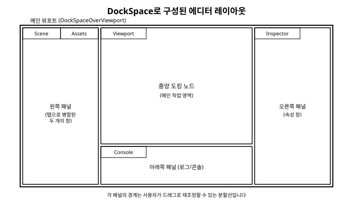

# 10장. 도킹과 멀티 뷰포트

[◀ 이전: 9장. 다이얼로그와 팝업](ch09-다이얼로그와팝업.md) | [📖 목차](00-목차.md) | [다음: 11장. 커스텀 렌더링과 ImDrawList ▶](ch11-커스텀렌더링과ImDrawList.md)


지금까지 만든 예제들은 창을 하나 띄우거나, 여러 창을 화면 위에 자유롭게 떠 있는 상태로 배치하는 정도였습니다. 하지만 비주얼 스튜디오나 언리얼 엔진 에디터, 블렌더 같은 전문 도구들을 떠올려 보면, 창들이 제멋대로 떠 있는 게 아니라 하나의 큰 화면 안에서 탭으로 묶이거나 좌우/상하로 딱 맞게 분할되어 있는 모습을 볼 수 있습니다. 사용자가 패널의 경계를 드래그해서 크기를 조절하고, 탭을 드래그해서 다른 위치로 옮기거나 아예 화면 밖으로 떼어낼 수도 있습니다.

ImGui는 이런 레이아웃을 **도킹(Docking)** 기능으로 지원합니다. 이번 장에서는 도킹이 정확히 무엇을 해주는 기능인지, 어떻게 켜고 기본 레이아웃을 잡는지, 그리고 창을 여러 개의 실제 운영체제 창으로 분리해주는 **멀티 뷰포트(Multi-Viewport)** 기능까지 간단히 살펴봅니다.

## 10.1 도킹이란 무엇인가

도킹은 한마디로 "여러 개의 독립적인 ImGui 창을 하나의 레이아웃 안에서 탭으로 묶거나 화면을 분할해서 배치할 수 있게 해주는 기능"입니다. 지금까지 우리가 `ImGui::Begin("씬 뷰")`, `ImGui::Begin("인스펙터")`처럼 각각 만들었던 창들은 도킹이 켜져 있으면 화면 위에서 서로 자석처럼 달라붙어 하나의 큰 틀을 이룰 수 있게 됩니다.

중요한 점은, 도킹이 켜져 있다고 해서 여러분이 창을 만드는 코드 자체를 바꿔야 하는 것은 아니라는 점입니다. 5장에서 배운 것처럼 `Begin`/`End`로 창을 정의하는 방식은 그대로입니다. 달라지는 것은 사용자가 그 창들을 화면 위에서 어떻게 배치할 수 있는지, 그리고 여러분이 프로그램 시작 시 "이 영역은 도킹이 가능한 공간이다"라고 한 번 선언해 준다는 점뿐입니다.

## 10.2 도킹 기능 활성화하기

도킹을 사용하려면 먼저 `ImGuiIO`의 `ConfigFlags`에 `ImGuiConfigFlags_DockingEnable` 플래그를 켜야 합니다. 보통 2장에서 다룬 초기화 코드, 즉 `ImGui::CreateContext()` 직후에 넣습니다.

```cpp
ImGui::CreateContext();
ImGuiIO& io = ImGui::GetIO();
io.ConfigFlags |= ImGuiConfigFlags_DockingEnable;
```

이 플래그 하나만 켜면 사용자가 창의 제목 표시줄을 드래그해서 다른 창에 가져다 붙이는 도킹 상호작용이 즉시 가능해집니다.

한 가지 짚고 넘어갈 점은, 도킹 기능은 Dear ImGui 저장소에서 오랫동안 `docking`이라는 별도 브랜치로 관리되어 왔다는 사실입니다. 즉, 여러분이 사용하는 배포판이나 패키지 매니저, 바인딩에 따라 기본 릴리스에는 도킹 관련 API가 아예 포함되어 있지 않을 수 있습니다. 만약 `ImGuiConfigFlags_DockingEnable`이나 이 장에서 다룰 함수들이 컴파일 에러를 낸다면, 사용 중인 ImGui 배포본이 도킹 기능을 포함하고 있는지부터 확인해볼 필요가 있습니다.

## 10.3 DockSpaceOverViewport로 전체 화면 도킹 공간 만들기

플래그만 켠다고 화면에 바로 도킹 레이아웃이 나타나는 것은 아닙니다. "이 영역을 도킹이 가능한 공간으로 쓰겠다"고 알려주는 도킹 스페이스(dock space)가 최소 하나는 있어야 합니다. 가장 흔한 요구사항은 애플리케이션 창 전체를 하나의 거대한 도킹 공간으로 만들어서, 그 안에 모든 패널들이 자유롭게 배치되도록 하는 것입니다. 이를 위한 함수가 `ImGui::DockSpaceOverViewport()`입니다.

전형적인 사용 패턴은 메인 루프에서 다른 모든 창을 그리기 전에 한 번 호출해 주는 것입니다.

```cpp
// 매 프레임, 다른 창들을 그리기 전에 호출
ImGui::DockSpaceOverViewport(0, ImGui::GetMainViewport());

// 이후 평소처럼 창들을 정의
ImGui::Begin("씬 뷰");
ImGui::Text("여기에 3D 렌더링 결과가 표시됩니다");
ImGui::End();

ImGui::Begin("인스펙터");
ImGui::Text("선택한 오브젝트의 속성");
ImGui::End();

ImGui::Begin("콘솔");
ImGui::Text("로그 출력...");
ImGui::End();
```

이렇게만 해도 "씬 뷰", "인스펙터", "콘솔" 세 개의 창은 프로그램을 처음 실행했을 때는 겹쳐진 상태로 나타나지만, 사용자가 제목 표시줄을 드래그하면 화면의 좌/우/상/하 어느 쪽으로든 도킹할 수 있게 됩니다. 이때 `DockSpaceOverViewport`의 첫 번째 인자로 `0`을 넘기면 ImGui가 내부적으로 도킹 스페이스의 ID를 자동으로 생성해서 관리해 줍니다. 프로그램을 재실행해도 창들이 마지막으로 배치된 위치를 기억하게 하려면, `imgui.ini` 파일을 통한 레이아웃 저장 기능이 함께 동작하는데, 이는 5장에서 다룬 창 설정 저장 메커니즘을 그대로 사용합니다.

애플리케이션을 처음 실행했을 때부터 미리 정해진 레이아웃(예: 왼쪽에 씬 트리, 가운데에 뷰포트, 오른쪽에 인스펙터)으로 시작하게 하고 싶다면, `ImGui::DockBuilder` 계열의 저수준 API를 사용해 코드로 도킹 구조를 직접 구성할 수도 있습니다. 다만 이 API는 처음 접할 때 다소 번거롭게 느껴질 수 있으므로, 입문 단계에서는 사용자가 한 번 배치한 레이아웃을 `imgui.ini`가 기억하게 하는 방식으로도 충분합니다.

## 10.4 사용자가 창을 도킹하는 상호작용

도킹 스페이스만 마련해 두면, 실제로 창을 어디에 어떻게 붙일지는 대부분 ImGui가 알아서 처리해줍니다. 개발자 입장에서 알아두면 좋은 상호작용 흐름은 다음과 같습니다.

- 사용자가 창의 제목 표시줄을 마우스로 누른 채 다른 창 위로 드래그하면, 그 창의 상/하/좌/우/중앙에 반투명한 미리보기 영역(도킹 가이드)이 나타납니다.
- 중앙에 놓으면 두 창이 하나의 영역 안에서 탭으로 합쳐지고, 상/하/좌/우 중 하나에 놓으면 그 방향으로 화면이 분할되어 새로운 도킹 노드가 만들어집니다.
- 이미 도킹된 창의 탭을 다시 드래그해서 도킹 공간 바깥으로 빼내면, 그 창은 다시 독립적으로 떠 있는 창이 됩니다.
- 도킹 노드 사이의 경계선을 드래그하면 각 영역의 비율을 조절할 수 있습니다.

이 모든 과정에서 여러분이 작성하는 코드는 그대로입니다. 즉, "씬 뷰" 창이 지금 독립적으로 떠 있는지, 다른 창과 탭으로 묶여 있는지, 화면 왼쪽에 도킹되어 있는지는 `ImGui::Begin("씬 뷰")` ... `ImGui::End()` 코드 입장에서는 신경 쓸 필요가 없는 부분입니다. 도킹 상태와 레이아웃은 ImGui 내부의 도킹 시스템이 별도로 관리하며, 여러분의 창 정의 코드는 "이 이름을 가진 창에 이런 내용을 그려라"라는 선언만 계속 반복하면 됩니다. 이는 이 책 전체를 관통하는 즉시 모드의 철학, 즉 3장에서 설명한 "매 프레임 다시 선언한다"는 원칙과도 정확히 맞닿아 있습니다.

만약 특정 창은 절대 도킹되지 않고 항상 독립적으로 떠 있게 하고 싶다면, `Begin`을 호출할 때 `ImGuiWindowFlags_NoDocking` 플래그를 넘겨서 해당 창을 도킹 대상에서 제외할 수 있습니다.

아래 그림은 하나의 메인 뷰포트 안에 여러 패널이 탭과 분할을 통해 배치된 전형적인 에디터 레이아웃의 예입니다.



## 10.5 멀티 뷰포트: 창을 OS 창으로 떼어내기

도킹이 "ImGui 창들을 하나의 애플리케이션 창 안에서 재배치하는 기능"이라면, **멀티 뷰포트**는 한 걸음 더 나아가 ImGui 창을 아예 운영체제의 독립적인 창으로 분리해서 화면의 다른 모니터로 옮기거나 애플리케이션 창 바깥으로 완전히 뗄 수 있게 해주는 기능입니다. 여러 모니터를 쓰는 사용자가 인스펙터 창만 따로 떼어서 두 번째 모니터에 두는 식의 작업 흐름을 지원하려는 목적입니다.

멀티 뷰포트는 다음 플래그로 활성화합니다.

```cpp
io.ConfigFlags |= ImGuiConfigFlags_ViewportsEnable;
```

이 기능은 도킹보다 요구 조건이 하나 더 있습니다. 사용 중인 렌더링 백엔드와 플랫폼 백엔드(윈도우 생성을 담당하는 계층)가 멀티 뷰포트를 지원해야 하며, 백엔드에 따라 추가 초기화 코드가 필요할 수 있습니다. 이 책에서는 백엔드별 상세 설정까지 다루지는 않지만, 16장에서 다양한 렌더링 백엔드를 살펴볼 때 이 기능이 어떤 조건에서 동작하는지 함께 짚어볼 만합니다. 지금 단계에서는 "도킹은 하나의 OS 창 안에서의 재배치이고, 멀티 뷰포트는 여러 개의 실제 OS 창으로의 분리다"라는 개념적인 차이와, 이를 켜는 플래그가 도킹과는 별도로 존재한다는 점만 기억해두면 충분합니다.

## 요약

- 도킹은 여러 개의 ImGui 창을 하나의 레이아웃 안에서 탭으로 묶거나 화면을 분할해 배치할 수 있게 해주는 기능으로, 비주얼 스튜디오나 언리얼 엔진 에디터 같은 도구의 UI와 비슷한 느낌을 만들어 줍니다.
- `io.ConfigFlags |= ImGuiConfigFlags_DockingEnable;`로 기능을 켤 수 있으며, 배포판에 따라 도킹 기능이 포함되지 않은 경우도 있으므로 사용 중인 ImGui 버전을 확인해야 합니다.
- `ImGui::DockSpaceOverViewport()`를 매 프레임 호출해 두면 애플리케이션 창 전체가 도킹 가능한 공간이 되고, 이후 평소처럼 `Begin`/`End`로 정의한 창들을 사용자가 자유롭게 도킹할 수 있습니다.
- 창을 드래그해서 다른 창 위, 좌/우/상/하에 놓으면 자동으로 탭 병합이나 화면 분할이 일어나며, 이 상호작용 로직은 대부분 ImGui가 알아서 처리하므로 개발자는 도킹 스페이스만 마련해 주면 됩니다.
- 멀티 뷰포트(`ImGuiConfigFlags_ViewportsEnable`)는 창을 실제 운영체제의 독립적인 창으로 분리해 다른 모니터로 옮길 수 있게 해주는 기능으로, 도킹과는 별개의 플래그와 백엔드 지원이 필요합니다.

## 연습문제

1. 도킹(Docking)과 멀티 뷰포트(Multi-Viewport)의 차이를 한 문장씩으로 설명해보세요.
2. `ImGuiConfigFlags_DockingEnable`을 켜지 않은 상태에서 창의 제목 표시줄을 드래그하면 어떤 일이 일어나는지, 켠 상태와 비교해서 관찰해보세요.
3. `DockSpaceOverViewport()`를 호출하는 코드를 지워보고, 도킹 기능이 켜져 있어도 도킹 공간이 없으면 어떤 제약이 생기는지 확인해보세요.
4. "씬 뷰", "인스펙터", "콘솔", "속성" 네 개의 창을 만들고, 프로그램을 실행한 뒤 직접 드래그로 좌/우/아래로 분할된 레이아웃을 구성해보세요. 그 다음 `imgui.ini` 파일을 열어 어떤 내용이 저장되어 있는지 살펴보세요.
5. 특정 창 하나만 `ImGuiWindowFlags_NoDocking` 플래그를 주어 도킹이 불가능하게 만들고, 나머지 창들과 어떻게 다르게 동작하는지 확인해보세요.

---

[◀ 이전: 9장. 다이얼로그와 팝업](ch09-다이얼로그와팝업.md) | [📖 목차](00-목차.md) | [다음: 11장. 커스텀 렌더링과 ImDrawList ▶](ch11-커스텀렌더링과ImDrawList.md)
