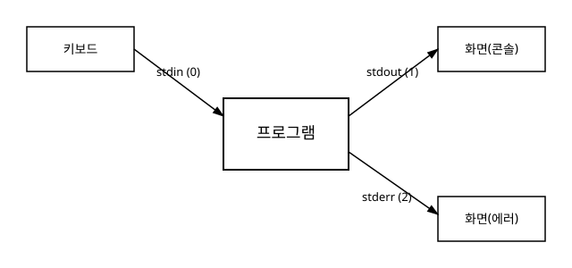

# 5장. 입출력 기초

[◀ 이전: 4장. 연산자와 표현식](ch04-연산자와표현식.md) | [📖 목차](00-목차.md) | [다음: 6장. 제어문 - 조건문 ▶](ch06-조건문.md)

---

지금까지 변수와 자료형, 연산자를 살펴보면서 프로그램 내부에서 값을 계산하는 방법을 배웠습니다. 하지만 프로그램이 쓸모 있으려면 외부에서 값을 받아들이고, 계산 결과를 사람이 볼 수 있는 형태로 내보낼 수 있어야 합니다. 이 장에서는 C 언어에서 가장 널리 쓰이는 입출력 함수인 `printf`와 `scanf`를 중심으로, 화면에 출력하고 키보드로부터 입력받는 방법을 다룹니다.

## 5.1 표준 입출력 스트림

C 프로그램이 실행되면 운영체제는 프로그램에게 세 개의 표준 스트림(stream)을 자동으로 열어 줍니다. 스트림이란 데이터가 흘러 들어오거나 흘러 나가는 통로라고 생각하면 됩니다.

- **stdin** (standard input, 표준 입력): 프로그램이 값을 읽어 들이는 통로입니다. 특별히 지정하지 않으면 키보드에 연결됩니다.
- **stdout** (standard output, 표준 출력): 프로그램이 일반적인 결과를 내보내는 통로입니다. 기본적으로 화면(콘솔)에 연결됩니다.
- **stderr** (standard error, 표준 에러): 오류 메시지나 경고를 내보내는 전용 통로입니다. 역시 기본적으로 화면에 연결됩니다.



굳이 stdout과 stderr를 나눠 놓은 이유가 궁금할 수 있습니다. 실무에서는 프로그램의 정상적인 출력 결과를 파일로 저장하면서도, 오류 메시지는 화면에 바로 보이도록 하고 싶은 경우가 많습니다. 셸(shell)에서는 `프로그램 > 결과.txt` 처럼 stdout만 파일로 돌릴 수 있는데, 이때 stderr는 리다이렉션되지 않고 그대로 화면에 출력됩니다. 즉, 정상 출력과 오류 출력을 분리해 두면 문제가 생겼을 때 원인을 훨씬 빨리 찾을 수 있습니다.

지금 단계에서는 `printf`가 stdout에, `fprintf(stderr, ...)`가 stderr에 쓴다는 정도만 기억해 두면 충분합니다. 파일을 다루는 자세한 방법은 15장 파일 입출력에서 다시 다룹니다.

```c
#include <stdio.h>

int main(void)
{
    printf("정상적인 결과입니다.\n");           // stdout으로 출력
    fprintf(stderr, "경고: 값이 예상 범위를 벗어났습니다.\n"); // stderr로 출력

    return 0;
}
```

## 5.2 printf로 출력하기

`printf` 함수는 서식 문자열(format string)과 그 뒤에 나열된 값들을 받아, 서식 문자열 안의 서식 지정자(format specifier) 자리에 값을 채워 넣어 출력합니다. 서식 지정자는 `%`로 시작하며, 뒤따르는 문자에 따라 값을 어떤 형식으로 해석해서 출력할지 결정합니다.

```c
#include <stdio.h>

int main(void)
{
    int age = 25;
    double height = 175.5;
    char grade = 'A';

    printf("나이: %d, 키: %.1f, 학점: %c\n", age, height, grade);

    return 0;
}
```

이 코드를 실행하면 다음과 같이 출력됩니다.

```
나이: 25, 키: 175.5, 학점: A
```

### 자주 쓰는 서식 지정자

| 서식 지정자 | 의미 | 대응하는 자료형 예시 |
|---|---|---|
| `%d` | 부호 있는 10진 정수 | `int` |
| `%u` | 부호 없는 10진 정수 | `unsigned int` |
| `%f` | 소수(고정 소수점) 표기 실수 | `double`, `float` |
| `%e` | 지수(과학적) 표기 실수 | `double`, `float` |
| `%c` | 문자 하나 | `char` |
| `%s` | 문자열 | `char *` (문자 배열) |
| `%x`, `%X` | 16진수(소문자/대문자) | `unsigned int` |
| `%o` | 8진수 | `unsigned int` |
| `%p` | 포인터 값(주소) | 포인터 타입 |
| `%%` | 퍼센트 기호 `%` 자체 출력 | 없음 |

`printf`는 `%d`에 `int`가 아닌 `double`을 넘기는 것처럼 서식 지정자와 인자의 타입이 맞지 않아도 컴파일 단계에서 항상 걸러 주지는 않습니다. 이런 실수는 엉뚱한 값이 출력되는 원인이 되므로, 서식 지정자와 실제 값의 타입을 항상 맞춰 주는 습관을 들이는 것이 좋습니다. 참고로 `double` 값을 `%f`로 출력할 때는 `long double`이 아닌 이상 별도의 접두사 없이 `%f`를 그대로 사용합니다(단, `scanf`에서 `double`을 읽을 때는 `%lf`가 필요합니다. 이는 뒤에서 다시 설명합니다).

### 폭과 정밀도 지정하기

서식 지정자에는 출력 폭(width)과 정밀도(precision)를 지정할 수 있습니다. 표 형태의 출력을 깔끔하게 정렬할 때 특히 유용합니다.

```c
#include <stdio.h>

int main(void)
{
    printf("[%5d]\n", 42);      // 폭 5, 오른쪽 정렬:   [   42]
    printf("[%-5d]\n", 42);     // 폭 5, 왼쪽 정렬:     [42   ]
    printf("[%05d]\n", 42);     // 빈 자리를 0으로 채움: [00042]
    printf("[%.2f]\n", 3.14159); // 소수점 아래 2자리:  [3.14]
    printf("[%8.2f]\n", 3.14159); // 폭 8, 소수점 아래 2자리
    printf("[%-10s]\n", "hi");   // 문자열 왼쪽 정렬, 폭 10

    return 0;
}
```

`%` 다음에 오는 `-`는 왼쪽 정렬, 숫자는 최소 출력 폭, `.` 뒤의 숫자는 정밀도를 의미합니다. 정수에서 정밀도는 최소 출력 자릿수를, 실수에서는 소수점 아래 자릿수를 의미합니다.

## 5.3 scanf로 입력받기

`scanf` 함수는 stdin으로부터 값을 읽어 변수에 저장합니다. 기본 형태는 `printf`와 비슷하지만, 값을 저장할 변수의 **주소**를 넘겨줘야 한다는 중요한 차이가 있습니다.

```c
#include <stdio.h>

int main(void)
{
    int age;
    double height;

    printf("나이를 입력하세요: ");
    scanf("%d", &age);            // & 로 age의 주소를 넘김

    printf("키(cm)를 입력하세요: ");
    scanf("%lf", &height);        // double을 읽을 때는 %lf

    printf("입력하신 나이는 %d살, 키는 %.1fcm입니다.\n", age, height);

    return 0;
}
```

### 왜 & 연산자가 필요한가

`scanf`는 함수 호출이 끝나도 값이 호출자에게 남아 있어야 하므로, 변수 자체가 아니라 그 변수가 저장된 **메모리 주소**를 받아서 그 주소에 직접 값을 써 넣는 방식으로 동작합니다. `&변수명`은 "이 변수가 어디에 있는지"를 나타내는 주소값을 만들어 냅니다. 이 주소 개념은 11장 포인터 기초에서 훨씬 자세히 다루게 되므로, 지금은 "scanf로 값을 읽을 때는 변수 앞에 &를 붙인다"는 규칙 정도로 기억해 두어도 충분합니다.

단, 예외가 하나 있습니다. 문자열을 읽을 때 사용하는 문자 배열은 배열 이름 자체가 이미 첫 원소의 주소를 나타내므로 &를 붙이지 않습니다.

```c
#include <stdio.h>

int main(void)
{
    char name[20];

    printf("이름을 입력하세요: ");
    scanf("%s", name);   // 배열 이름 앞에는 & 를 붙이지 않는다

    printf("반갑습니다, %s님!\n", name);

    return 0;
}
```

배열과 문자열을 다루는 자세한 내용은 9장 배열과 10장 문자열에서 이어서 설명합니다.

### scanf 사용 시 주의할 점

`scanf`는 입문자가 가장 자주 실수하는 함수 중 하나입니다. 대표적인 주의사항을 정리하면 다음과 같습니다.

**1) 반환값을 확인하지 않으면 위험합니다.** `scanf`는 성공적으로 읽어 들인 항목의 개수를 반환합니다. 사용자가 숫자를 요구하는 자리에 문자를 입력하면 변환에 실패하고, 그 값은 그대로 입력 버퍼에 남아 다음 입력을 방해합니다.

```c
int n;
int result = scanf("%d", &n);

if (result != 1) {
    printf("숫자를 올바르게 입력하지 않았습니다.\n");
}
```

**2) 입력 버퍼에 남는 개행 문자를 조심해야 합니다.** `scanf("%d", &n)`으로 숫자를 입력받으면, 사용자가 Enter 키를 눌러서 생긴 개행 문자(`\n`)는 버퍼에 그대로 남습니다. 이후 `%c`로 문자 하나를 읽으면 방금 남아 있던 개행 문자를 읽어 버리는 문제가 자주 발생합니다.

```c
#include <stdio.h>

int main(void)
{
    int score;
    char grade;

    printf("점수를 입력하세요: ");
    scanf("%d", &score);

    printf("학점을 입력하세요: ");
    scanf(" %c", &grade);   // 서식 지정자 앞에 공백을 두면 앞선 개행/공백을 건너뛴다

    printf("점수 %d, 학점 %c\n", score, grade);

    return 0;
}
```

`%c` 앞에 공백 문자 하나를 넣어 주면 `scanf`가 공백류 문자(스페이스, 탭, 개행)를 모두 건너뛰고 다음 값이 나올 때까지 기다립니다. 반면 `%d`나 `%f`, `%s`는 앞뒤 공백을 스스로 건너뛰므로 이런 처리가 원래부터 필요하지 않지만, `%c`만은 예외적으로 신경 써야 합니다.

**3) `%s`는 공백에서 입력을 끊습니다.** `scanf("%s", name)`은 공백을 만나면 그 앞까지만 읽으므로, "홍길동"처럼 띄어쓰기가 없는 단어 하나를 읽는 데는 적합하지만 "홍 길동"처럼 공백이 포함된 문장 전체를 읽으려면 다른 방법이 필요합니다. 이 부분은 10장 문자열에서 `fgets`와 함께 다시 설명합니다.

**4) 문자 배열의 크기를 넘는 입력에 취약합니다.** `scanf("%s", name)`은 배열의 크기를 알지 못하므로, 입력이 배열보다 길면 배열 범위를 넘어서 메모리를 덮어씁니다. 안전한 입력 방법은 10장 문자열과 15장 파일 입출력에서 다루는 `fgets`를 참고하기 바랍니다. 지금 단계에서는 이런 위험이 있다는 사실만 기억해도 충분합니다.

## 5.4 입력-처리-출력 예제

지금까지 배운 내용을 하나의 프로그램으로 정리해 보겠습니다. 사용자로부터 시험 점수 세 개를 입력받아 평균을 계산하고, 그 평균에 따라 간단한 안내 메시지를 출력하는 프로그램입니다.

```c
#include <stdio.h>

int main(void)
{
    int score1, score2, score3;
    double average;

    // 1. 입력 단계
    printf("국어, 영어, 수학 점수를 순서대로 입력하세요: ");
    scanf("%d %d %d", &score1, &score2, &score3);

    // 2. 처리 단계
    average = (score1 + score2 + score3) / 3.0;   // 정수 나눗셈을 피하려고 3.0으로 나눔

    // 3. 출력 단계
    printf("입력한 점수: %d, %d, %d\n", score1, score2, score3);
    printf("평균 점수: %.2f\n", average);

    if (average >= 60.0) {
        printf("평균 60점 이상입니다.\n");
    } else {
        printf("평균 60점 미만입니다.\n");
    }

    return 0;
}
```

이 예제에서 눈여겨볼 부분은 두 가지입니다. 첫째, `scanf("%d %d %d", ...)`처럼 서식 지정자를 나열하면 공백이나 개행으로 구분된 여러 값을 한 번에 읽을 수 있습니다. 둘째, `score1 + score2 + score3`은 정수끼리의 덧셈이라 결과도 정수이지만, `3.0`으로 나누는 순간 실수 나눗셈으로 승격되어 소수점 이하 값을 잃지 않습니다. 이런 정수와 실수의 자동 변환 규칙은 3장 변수와 자료형, 4장 연산자와 표현식에서 다룬 내용을 다시 떠올려 보면 좋습니다.

조건에 따라 다른 메시지를 출력하는 `if`/`else` 구문은 6장 제어문 - 조건문에서 본격적으로 다룹니다.

## 요약

- 표준 입출력 스트림에는 stdin(표준 입력), stdout(표준 출력), stderr(표준 에러) 세 가지가 있으며 각각 기본적으로 키보드와 화면에 연결되어 있습니다.
- `printf`는 서식 문자열의 `%` 지정자 자리에 값을 채워서 stdout으로 출력하며, `%d`, `%f`, `%c`, `%s`, `%x` 등 자료형에 맞는 지정자를 사용해야 합니다.
- 출력 폭과 정밀도(`%5d`, `%.2f`, `%-10s` 등)를 지정하면 출력 결과를 정렬하거나 자릿수를 제한할 수 있습니다.
- `scanf`는 변수의 주소(`&변수명`)에 값을 써 넣으며, 문자 배열은 배열 이름 자체가 주소이므로 `&`를 붙이지 않습니다.
- `scanf`는 반환값으로 성공적으로 읽은 항목 수를 알려 주므로 입력 검증에 활용할 수 있고, `%c` 앞에 공백을 넣어 버퍼에 남은 개행 문자를 건너뛰는 습관이 필요합니다.

## 연습문제

1. 사용자로부터 정수 하나를 입력받아 그 값이 짝수인지 홀수인지 판별해 출력하는 프로그램을 작성하세요. (짝수/홀수 판별 자체는 나머지 연산자를 사용하고, 조건 출력은 `if`/`else`를 미리 사용해 봐도 좋습니다.)
2. 원의 반지름을 실수로 입력받아 원의 넓이와 둘레를 소수점 둘째 자리까지 출력하는 프로그램을 작성하세요. (원주율은 `3.14159`로 가정합니다.)
3. 이름(문자열)과 나이(정수)를 각각 입력받아 "OO님은 OO살입니다."라는 문장을 출력하는 프로그램을 작성하세요.
4. 정수 하나를 입력받아 10진수, 8진수, 16진수로 각각 출력하는 프로그램을 작성하세요. `%d`, `%o`, `%x`를 활용하세요.
5. `scanf("%d", &n)`으로 정수를 입력받은 뒤 곧바로 `scanf(" %c", &c)`로 문자 하나를 입력받는 프로그램을 작성하고, `%c` 앞의 공백을 뺐을 때와 넣었을 때 동작이 어떻게 달라지는지 직접 실행해서 비교해 보세요.

---

[◀ 이전: 4장. 연산자와 표현식](ch04-연산자와표현식.md) | [📖 목차](00-목차.md) | [다음: 6장. 제어문 - 조건문 ▶](ch06-조건문.md)
